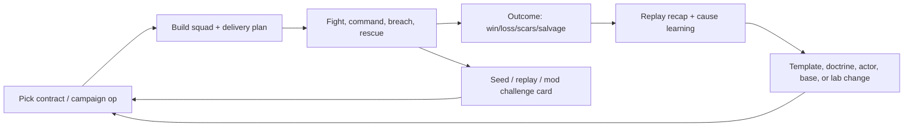

← [[decisions/index|decision records]] · [[systems/ux-ui-and-retention|UX/retention]] · [[spec/progression-retention|progression spec]] · [[spec/core-loop|core loop]] · [[research-log/moonshot-register|moonshots]]

# DR-011: Progression And Retention Loop

> [!info] Status: OPEN; LEAN: intrinsic-first hybrid
> The current lean is a Cortex-specific retention stack: mastery, autonomy, readable AI, persistent campaign stakes, salvage/loadout experimentation, short repeatable challenges, replay sharing, and creator content. Daily seeds, roguelite structure, async strategy, and collection mechanics are open prototype tracks. They are not launch commitments until tests prove they improve the game without damaging fairness, modding, or player trust.

## Context

The future game needs players to come back for reasons that fit a physics/destruction sandbox. "Retention" cannot mean obligation, hidden timers, or opaque pay pressure. In this project, retention should mean:

- The player wants to improve direct-control and command skill.
- The battlefield keeps producing different tactical problems.
- Named actors, rescued gear, faction consequences, and enemy commanders create memory.
- Loadouts and terrain tools support experimentation instead of one solved build.
- Replays and scenario cards make the best moments easy to learn from and share.
- Mods and challenge seeds let the game keep expanding after official content is exhausted.

The product risk is two-sided. If progression is too thin, players treat each battle as disposable. If progression is too heavy, the game becomes grind, meta-pressure, or balance debt. The right answer needs to make repeated play faster and richer, not heavier.

## Decision Question

Which progression and retention structure should guide the first spec and prototype backlog?

## Options

| Option | Summary | Best Use |
|---|---|---|
| A. Intrinsic-first hybrid retention stack | Mastery + campaign stakes + salvage/loadouts + challenges + replay/community loops. | Current recommended foundation. |
| B. Live-service / daily-reward-first loop | Daily login rewards, rotating shops, time-limited events, battle-pass pressure. | Research only; high trust risk if it leads design. |
| C. Pure sandbox/mod retention | No meta progression; players return for tools, experiments, mods, and community scenarios. | Strong for creators; weak for campaign players. |
| D. Roguelite campaign loop | Run-based progression, procedural contracts, unlocks between attempts. | Good prototype track for short sessions. |
| E. Collection/gacha-led retention | Randomized actor/item/cosmetic collection drives return. | Moonshot/monetization research only until fairness is proven. |
| F. Async strategic layer first | World map, faction turns, shared operations, leaderboards/challenges. | Strong later layer; backend-heavy before core feel is proven. |

## Evaluation Matrix

| Lens | A. Intrinsic Hybrid | B. Live-Service First | C. Sandbox/Mod Only | D. Roguelite | E. Collection/Gacha Led | F. Async Strategy First |
|---|---|---|---|---|---|---|
| Player value | Very high: maps to Cortex stories. | Medium: can create habit but not necessarily love. | High for creators; variable for campaign players. | High if runs are short and surprising. | Unknown; can be fun if cosmetic/story-led, bad if power-led. | High for committed players. |
| Readability | Good if tied to replay, loadout, and campaign UI. | Often noisy; timer/shop UI competes with tactical UI. | Good if tools are clear. | Good if run rules are explicit. | Risky if rarity/probability/value is opaque. | Requires strong map/event explanations. |
| AI burden | Medium: veterans, doctrine, enemy commanders need harness tests. | Low mechanically, but may distract from AI quality. | Medium: mods stress AI. | High: generated contracts must remain AI-solvable. | Medium: collection variants multiply AI metadata. | High: async orders and faction turns need reliable simulation summaries. |
| UX burden | High but aligned with existing HUD/loadout/replay needs. | High and easy to clutter. | Medium: browser/workbench heavy. | Medium: run setup, modifiers, recap. | High: odds, inventory, fairness, duplicate handling. | Very high: map, ops, leaderboards, backend status. |
| Backend burden | Optional early; can start local-only. | High if events, shops, accounts, seasons. | Medium/high for registry and sharing. | Low local; medium if daily seeds/leaderboards. | High if monetized. | High from day one. |
| Modding impact | Positive if contracts and item roles are data-driven. | Risk: official economy can fight mod freedom. | Excellent. | Positive if run rules are moddable. | Risk: scarcity conflicts with modded content. | Positive if operations can include mods cleanly. |
| Balance impact | Manageable with horizontal progression. | High power-creep pressure. | Community-dependent. | Manageable if unlocks are tools/variants, not raw power. | High if random power affects tactical counters. | High if shared economy becomes dominant. |
| Retention upside | Strong and durable. | Can spike metrics but risks burnout. | Long-tail strong; onboarding weaker. | Strong for short sessions. | Potentially high but dangerous to trust. | Strong if core game already works. |
| Fits personal-project posture | Yes. | Prototype freely, do not let it lead. | Yes. | Yes. | Prototype freely; log fairness and source inspiration. | Prototype after core loop or as moonshot. |

## Current Recommendation

Use **A. Intrinsic-first hybrid retention stack** as the main spec direction, with **D. roguelite contracts**, **F. async strategy**, and **E. collection/cosmetic systems** as freely prototyped side tracks.

The first product promise should be: players return because each mission is a readable destructible-system problem with persistent consequences, meaningful loadout choices, named survivors, strong AI companions/enemies, and replayable/shareable outcomes. The game should never depend on dark-pattern pressure to compensate for weak core play.

## Retention Architecture

| Layer | Player Motivation | Cortex-Like Feature | Prototype Test |
|---|---|---|---|
| Skill mastery | Competence: I am getting better. | Direct-control movement, aim, recoil, terrain use, rescue timing. | RET-A-01 actor challenge replay value. |
| Tactical autonomy | Autonomy: I chose my plan. | Breach route, loadout doctrine, dig/repair/defend choices, craft delivery timing. | RET-A-02 generated contract constraints. |
| Relatedness / care | Relatedness: these actors and squads matter. | Named veterans, injuries, rival commanders, rescue and recovery. | RET-A-03 veteran survives two missions. |
| Systemic variety | Surprise: the sim makes new stories. | Material layouts, enemy doctrine, weather/hazards, equipment constraints. | RET-A-04 rotating contract generator. |
| Economic meaning | Consequence: the battlefield matters after the fight. | Salvage, recovered enemy tech, base repairs, delivery losses. | RET-A-05 salvage-to-loadout loop. |
| Learning loop | Reflection: I know why I won/lost. | Replay timeline, death recap, command failure causes, share card. | RET-A-06 replay/share recap. |
| Creator/community | Longevity: players make and trade problems. | Mods, challenge browser, deterministic seeds, workbench validation. | RET-A-07 modded challenge install. |
| Optional collection | Identity: I customize and remember. | Cosmetics, biographies, decals, commemorative trophies, non-core variants. | RET-A-08 collection prototype with no power lock. |

## Candidate Progression Objects

| Object | What It Stores | Why It Helps | Guardrail |
|---|---|---|---|
| Commander profile | Campaign choices, doctrine preferences, unlocked tutorials/labs, replay archive. | Gives continuity without forcing grind. | Do not hide core controls behind profile XP. |
| Actor veteran | Name, role, scars, traits, injuries, rescue history, favorite equipment. | Converts units from disposable bodies into stories. | Traits should be readable and bounded; avoid mandatory perfect rolls. |
| Loadout template | Squad role, equipment roles, delivery craft, mass/cost/danger warnings. | Speeds repetition and encourages experiments. | Keep role filters transparent; never require memorized item names. |
| Salvage manifest | Recovered gear, scrap, rare parts, base repair materials. | Makes cleanup and risk meaningful. | Avoid grind-only scrap sinks. |
| Contract seed | Objective, terrain/material profile, constraints, reward table, replay hash. | Cheap variety with deterministic replay/debug. | Generated objectives must pass AI/path/material validation. |
| Enemy commander dossier | Known tactics, grudges, preferred materials/routes, defeated squads. | Creates rivalry without human players. | Must not cheat invisibly; expose scouting clues. |
| Base/faction state | Facilities, damage, research/lab unlocks, faction pressure. | Adds strategic stakes. | Do not make downtime more important than missions. |
| Replay card | Mission result, seed, loadout, key events, mod/package hashes. | Turns moments into learning/sharing objects. | Must be automatic and low friction. |

## Loop Model

## Prototype Plan

| Test ID | Test | Pass Signal | Evidence Needed |
|---|---|---|---|
| RET-A-01 | Five-minute actor challenge with replay score and personal-best target. | Player retries at least twice because control mastery is interesting. | Actor-feel sandbox + recorder. |
| RET-A-02 | Daily/seeded breach contract with one constraint. | Same seed is replayable and readable; different loadouts create different plans. | Contract seed schema + loadout fixtures. |
| RET-A-03 | Named veteran carries wound/trait across two missions. | Player changes behavior to preserve or use the veteran. | Actor state persistence + UI row. |
| RET-A-04 | Salvage changes next loadout without raw power creep. | Recovered gear/tools alter tactical options, not just numbers. | Loadout/equipment metadata + economy stub. |
| RET-A-05 | Enemy commander adapts one visible tactic after defeat. | Player notices the adaptation and can counter it. | AI harness + scenario state. |
| RET-A-06 | Replay recap explains a loss and offers "retry with same seed". | Player can state cause of failure within 10 seconds. | Replay/event viewer. |
| RET-A-07 | Modded challenge installs and validates before play. | Package errors are caught before mission launch. | Package-builder/workbench Slice A. |
| RET-A-08 | Cosmetic/biography collection prototype with no power lock. | Collection adds identity without blocking core tools. | UI prototype + fairness checklist. |
| RET-A-09 | Anti-fatigue pacing test. | Player can stop after one mission without losing progress or missing mandatory rewards. | Session metrics + save model. |
| RET-A-10 | Horizontal progression test. | New unlock expands tactics but does not obsolete an earlier tool. | Balance matrix + loadout role overlap check. |

## Monetization And Collection Boundary

This record does not ban gacha, collection, battle passes, daily rewards, cosmetics, or copied monetization patterns for private research. It only says they should not lead the spec until the core game proves it can earn return play through intrinsic value.

| Mechanic | Prototype Freely? | Spec Commitment Bar |
|---|---|---|
| Cosmetic collection | Yes. | Must not confuse combat readability or mod identity. |
| Actor biographies / portraits / scars | Yes. | Must be earnable/readable and not hide tactical power. |
| Randomized equipment drops | Yes. | Core counters and terrain tools must stay available through transparent play paths. |
| Paid/random gacha | Yes for private prototypes. | Needs a separate ethics/economy DR before any release commitment. |
| Daily login rewards | Yes. | Must not punish breaks or create mandatory chores. |
| Battle pass / seasonal track | Yes. | Needs backend, modding, and fairness evidence. |

## Evidence

| Evidence | Source | How It Applies |
|---|---|---|
| Self-determination theory research ties game enjoyment and future play to autonomy, competence, and relatedness. | Ryan, Rigby, Przybylski, "The Motivational Pull of Video Games" (2006), https://link.springer.com/article/10.1007/s11031-006-9051-8 | Retention stack should prioritize mastery, agency, and squad/campaign relationship, not only external rewards. |
| Scott Rigby's GDC Online retention talk warns against trapping players and emphasizes mastery, autonomy, relatedness, meaningful competence feedback, and intrinsic motivation. | GameDeveloper, https://www.gamedeveloper.com/game-platforms/gdc-online-player-retention-requires-real-motivation-engagement | Supports intrinsic-first posture and anti-obligation guardrails. |
| Replayability depends first on playability, good UI, challenge, shortness/ease where appropriate, variety from initial conditions, opponents, roles, and strategies. | GameDeveloper, Ernest Adams, https://www.gamedeveloper.com/design/replayability-part-2-game-mechanics | Supports short seed challenges, role/loadout variation, and low-friction replay loops. |
| Progression works when challenge/reward are balanced, paths are customizable, and endgame shifts to mastery/refinement; power creep, monotony, and fatigue are pitfalls. | GameDeveloper, Cameron McKellar, https://www.gamedeveloper.com/design/power-progression-in-games-crafting-rewarding-player-experiences | Supports horizontal progression, plateaus, loadout variety, and fatigue guardrails. |
| Dark patterns can include fake urgency, hidden costs, obstruction, unauthorized charges, and confusing virtual currency. | FTC, "Bringing Dark Patterns to Light", https://www.ftc.gov/reports/bringing-dark-patterns-light | Any future monetization/collection loop needs a transparent UX and separate commitment review. |
| Dynamic difficulty in F2P research can affect engagement, retention, and monetization together. | HBS faculty page, https://www.hbs.edu/faculty/Pages/item.aspx?num=67771 | Adaptive challenge can support retention, but should be used for fun/fairness before revenue optimization. |
| Powder Toy's save/stamp/community loop provides durable sandbox replay without mandatory meta-progression. | [[comparables/the-powder-toy-local-audit]] | Community sharing and deterministic artifacts can be a core retention pillar. |
| OpenLieroX and OpenSoldat demonstrate long-tail multiplayer/mod retention through fast sessions, content packages, server/lobby flow, and low-friction repeat play. | [[comparables/openlierox-local-audit]], [[comparables/opensoldat-local-audit]], [[comparables/opensoldat-satellites-local-audit]] | Supports short-session contracts, mod validation, and optional backend/hub layers. |
| Equipment/loadout data now has AI/UI/modding/balancing/replay consumers. | [[spec/equipment-loadout]], [[references/equipment-provenance-workbench-view]] | Retention loops should use role metadata, not flat item rarity. |

## Risks

| Risk | Mitigation |
|---|---|
| Meta-progression dilutes direct-control combat. | First RET tests depend on actor-feel and replay; do not build heavy economy before fun is proven. |
| Veteran actors make players save-scum or avoid risk. | Keep rescue/recovery and honorable loss rewards; reward brave survival stories, not perfect preservation. |
| Salvage economy becomes grind. | Favor tactical options, repairs, and scenario unlocks over linear scrap inflation. |
| Generated contracts produce impossible AI/path states. | Contract generator must run AI/material/path validation before surfacing a seed. |
| Daily seeds become obligation. | "Daily" should mean shared seed of the day, not missed-reward punishment. |
| Collection/gacha corrupts sandbox trust. | Keep collection as prototype-only until a separate ethics/economy DR; never hide core counters behind opaque random access in a settled spec. |
| Async strategy layer consumes backend effort before the game is fun. | Keep local campaign state first; backend/hub Slice A can share replays/seeds before it runs a persistent world. |

## Current Spec Implications

| Spec Page | Implication |
|---|---|
| [[spec/product-promise]] | Promise should emphasize replayable stories, capable solo AI, readable destruction, and creative tactics, not login habit. |
| [[spec/core-loop]] | Add salvage, replay, and improvement as first-class loop phases. |
| [[spec/progression-retention]] | New exploratory spec page owns RET-A tests and progression object model. |
| [[spec/equipment-loadout]] | Item roles must support progression loops through tactical roles, not rarity tiers only. |
| [[spec/backend-service-hub-slice-a]] | Early backend should support challenge/replay/mod sharing before live-service economy. |
| [[spec/ux-wireframes-slice-a]] | UX must include recap, saved templates, veteran/squad state, and contract setup surfaces. |

## Revisit Trigger

Reopen this record when:

- RET-A-01..RET-A-06 have prototype results.
- A first campaign/save loop exists.
- Monetization becomes a release-facing question.
- A moonshot from [[research-log/moonshot-register]] graduates into prototype evidence.
- Player sessions show the return loop is driven by obligation, confusion, or grind rather than mastery and stories.

## Source Trail

- [[systems/ux-ui-and-retention]]
- [[spec/progression-retention]]
- [[spec/core-loop]]
- [[spec/product-promise]]
- [[references/sources]]
- [[comparables/the-powder-toy-local-audit]]
- [[comparables/openlierox-local-audit]]
- [[comparables/opensoldat-local-audit]]
- [[references/equipment-provenance-workbench-view]]
- GameDeveloper, GDC Online retention: https://www.gamedeveloper.com/game-platforms/gdc-online-player-retention-requires-real-motivation-engagement
- GameDeveloper, replayability mechanics: https://www.gamedeveloper.com/design/replayability-part-2-game-mechanics
- GameDeveloper, power progression: https://www.gamedeveloper.com/design/power-progression-in-games-crafting-rewarding-player-experiences
- Springer, SDT/video games: https://link.springer.com/article/10.1007/s11031-006-9051-8
- FTC, dark patterns report: https://www.ftc.gov/reports/bringing-dark-patterns-light
- HBS faculty research, personalized game design: https://www.hbs.edu/faculty/Pages/item.aspx?num=67771
