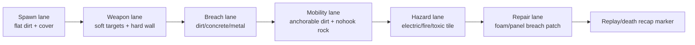

← [[spec/index|spec section]] · [[spec/prototype-roadmap|prototype roadmap]] · [[references/prototype-run-bundle-schema|run-bundle schema]] · [[systems/replay-determinism-and-run-evidence|determinism/run evidence]] · [[decisions/dr-004-first-playable-slice|DR-004 first playable]] · [[engine/direct-control-and-actor-feel-lifecycle|direct control lifecycle]] · [[systems/material-and-mobility-affordance-schema|material/mobility schema]] · [[systems/replay-event-architecture|replay/event architecture]]

# Actor-Feel Sandbox Slice A

> [!warning] Prototype requirements, not final spec
> This page turns the current Cortex/OpenSoldat/OpenLieroX/Powder Toy research into a buildable first slice. It is allowed to be opinionated because prototypes need direction. Final product commitments still require evidence and DR closure.

## Purpose

Slice A answers the most important early question:

> Can one actor feel good to move, aim, shoot, dig, survive, and read inside a small destructible scene?

This slice is not a public demo, campaign promise, multiplayer promise, or final engine choice. It is the instrumented sandbox that should make later AI, damage, terrain, replay, UX, networking, and modding decisions much less speculative.

## Inputs

| Source | Requirement Pulled Forward |
|---|---|
| [[engine/direct-control-and-actor-feel-lifecycle]] | CCCP control state, actor update order, movement/aim/item loop, firearm firing/reload/recoil/loudness, material penetration evidence. |
| [[decisions/dr-004-first-playable-slice]] | Start with one actor, a small scene, gun, digger, minimum HUD, and optional mobility lane. |
| [[comparables/opensoldat-local-audit]] | Explicit control state, movement accuracy, reticle bloom, stance/recoil, inherited projectile velocity, reload/fire bars. |
| [[comparables/openlierox-local-audit]] | Rope/tether/jet mastery, material anchor rules, semantic carve events, explosion child consequences, bot/replay shared input surface. |
| [[comparables/the-powder-toy-local-audit]] | Data-first material fields, snapshots/deltas, tool feedback, sandbox/lab value. |
| [[systems/material-and-mobility-affordance-schema]] | Minimum material set, material overlay modes, AI material contract, replay/network terrain events. |
| [[systems/replay-event-architecture]] | Input trace + event log + periodic snapshots from day one. |
| [[systems/replay-determinism-and-run-evidence]] | Hybrid run-evidence posture, checksums, actor/inventory/terrain snapshots, and DET-A acceptance tests for the same actor-feel run. |
| [[systems/ux-overlay-screen-brief]] | HUD, material overlay, death cause, reticle, and tool-readability acceptance tests. |
| [[systems/damage-equipment-and-items]] | Wounds, equipment fallout, item role clarity, and damage readability need early hooks. |

## Slice Boundaries

| Category | In Scope | Out Of Scope |
|---|---|---|
| Actor | One controllable humanoid or proxy actor with health, stability, inventory, recoil, fall recovery, and tool slots. | Full squad roster, faction variants, veterans, bodies with final art. |
| Scene | One compact test map with destructible terrain, hard bunker wall, hazard, repair/build strip, and mobility/anchor lane. | Campaign map, procedural world, full activity scripting. |
| Equipment | Basic firearm, digger/drill, grenade/charge, repair foam/panel, optional tether/grapple/jet lane. | Full arsenal, dropships, economy balancing, crafting. |
| Terrain | Small material grid with semantic carve/fill events and dirty regions. | Noita-grade chemistry, full collapse simulation, large streaming terrain. |
| AI | None required for pass, but control/event hooks must let a bot drive the same intent surface later. | Friendly squad AI, commander AI, enemy waves. |
| Replay | Rolling event buffer, input trace, periodic actor/terrain snapshot, basic debug playback or event viewer. | Shareable replay browser, network replay, polished scrub UI. |
| UX | Minimal tactical HUD, reticle feedback, material/tool validity cues, status/death cause text. | Final visual design, full command overlay, buy menu, workbench. |
| Networking | Events must be serializable enough to inform DR-005 later. | Online co-op, PvP, rollback, dedicated server. |

## Test Scene Layout

| Zone | What It Tests | Required Feedback |
|---|---|---|
| Spawn lane | Ground movement, jump/fall recovery, reticle idle state. | Actor status, stance, momentum, stability. |
| Weapon lane | Fire, reload, recoil, spread, inherited velocity, impact. | Reticle bloom, ammo/reload bar, hit impact labels. |
| Breach lane | Digger/drill/charge selection against material strength. | Tool-validity color, carve preview, material label. |
| Mobility lane | Jet/tether/grapple/anchor read, valid vs invalid material. | Anchorable/nohook cue, tension/energy, failure reason. |
| Hazard lane | Damage-on-touch and avoidance readability. | Hazard overlay, wound/status change, death cause. |
| Repair lane | Fill/patch/reinforce action and material ownership. | Build preview, integrity result, dirty rect/event record. |

## Minimum Actor Contract

| Field | Prototype Requirement | Why |
|---|---|---|
| `actor_id` | Stable id in events and snapshots. | Replay, AI, networking, tests. |
| `control_intent` | Serializable movement/aim/fire/tool input record. | Player, AI, replay, and net prediction should converge on one surface. |
| `position_velocity` | Position, velocity, facing, aim angle. | Needed for movement feel and inherited projectile velocity. |
| `status` | At least `STABLE`, `UNSTABLE`, `DYING`, `DEAD`. | HUD and replay must explain actor state. |
| `health_or_body_state` | Coarse health plus optional body-part/wound slots. | DR-003 needs early readability evidence. |
| `stability` | Fall/recoil/impact recovery variable. | Lets movement damage and aim wobble be visible. |
| `inventory_slots` | Weapon, dig tool, explosive, repair tool, mobility tool. | Tests equipment switching without full loadout UI. |
| `noise_or_alert` | Loudness event on weapon/tool use. | Feeds future AI awareness and HUD-03. |

## Minimum Equipment Set

| Item | Role | Required Feel/Telemetry |
|---|---|---|
| Light rifle | Baseline shooting. | Recoil impulse, fire cooldown, reload time, reticle bloom, inherited velocity. |
| Digger/drill | Controlled terrain removal. | Carve preview, material resistance, heat/charge/cooldown if applicable. |
| Grenade/charge | Burst terrain/body consequence. | Throw arc or placement ghost, fuse, blast radius, child events. |
| Repair foam/panel | Patch or reinforce. | Placement preview, material created, integrity gain, pathability change. |
| Optional tether/grapple/jet | Movement mastery. | Valid/invalid anchor, energy/tension, release reason, nohook feedback. |

Do not add more items until these five roles are readable. The goal is depth per tool, not a big list.

## Minimum Material Set

| Material | Purpose | Acceptance Pressure |
|---|---|---|
| Air | Empty/passable baseline. | Actor and projectile pass cleanly. |
| Dirt | Default destructible terrain. | Digger works; explosion carves; tether may anchor. |
| Concrete | Bunker wall. | Rifle ineffective, drill/charge effective, cover/line-of-sight clear. |
| Metal | Hard/ricochet material. | Sparks/ricochet or strong resistance; conductive hazard can attach later. |
| Loose rubble/sand | Soft fill and footing test. | Movement slowdown or low-support label if implemented. |
| Nohook rock | Negative mobility case. | Anchor/tether fails with readable reason. |
| Hazard tile | Damage proof point. | Player can identify danger before contact. |
| Repair foam/panel | Build/repair proof point. | New material updates pathability/integrity and event log. |

## Feel Requirements

| Loop | Must Happen | Failure Smell |
|---|---|---|
| Move | Actor accelerates, stops, jumps/falls, and recovers predictably. | Sluggish, floaty, or unexplainable knockdown. |
| Aim | Reticle expresses accuracy, recoil, stance, and movement penalty. | Player fires and cannot tell why shots missed. |
| Shoot | Shots inherit actor velocity enough to matter; impacts are readable. | Weapon feels detached from body motion. |
| Reload | Reload and cooldown states are visible without opening a menu. | Player mashes fire because readiness is unclear. |
| Dig | Terrain tools explain which material is affected and how fast. | Player tries every tool because material response is hidden. |
| Explode | Blast creates terrain/body/equipment/camera consequences with a clear cause. | Explosion is spectacle but not understandable. |
| Repair | Created material changes cover/path/terrain state in a visible way. | Repair feels like decorative painting. |
| Recover | Fall, recoil, wound, and hazard states have visible recovery windows. | Player cannot tell if the actor is stunned, dead, or controllable. |
| Mobility | Optional tether/grapple/jet gives mastery without confusing anchor validity. | Player blames controls for material-rule failure. |

## HUD And Overlay Requirements

| Surface | Required In Slice A | Related Test |
|---|---|---|
| Reticle | Accuracy bloom, target/material validity, friendly/fire danger placeholder, reload/cooldown hint. | A-FEEL-02 |
| Actor status | Health/wound/stability/status text or silhouette. | A-FEEL-06, HUD-01, HUD-02 |
| Item strip | Current item, ammo/charge/cooldown, unavailable reason. | A-FEEL-01 |
| Material overlay | Integrity/pathability/hazard/mobility validity on demand. | MAT-01A..D |
| Event tail | Last important event: `weapon_fired`, `terrain_carve_mask`, `actor_wounded`, `anchor_failed`. | REC-01 |
| Death recap | Last 3-5 seconds of causes in text or simple timeline. | REPLAY-01 |

## Event Hooks

These events are enough to make Slice A useful for DR-002, DR-003, DR-005, DR-007, DR-008, and DR-009. Names can change later, but each concept should exist.

When these hooks are implemented, run output should follow [[references/prototype-run-bundle-schema]] so A-FEEL evidence can be checked and compared across runs.

| Event | Required Payload |
|---|---|
| `input_intent` | actor id, tick, move vector/buttons, aim vector, selected item. |
| `weapon_fired` | actor id, item id, muzzle position, aim, recoil, accuracy, ammo state. |
| `projectile_hit` | projectile id, source, target kind, material/actor/item id, impulse, result. |
| `terrain_penetration_threshold` | material id, impulse, integrity threshold, pass/fail, spawned material. |
| `terrain_carve_mask` | cause id, material ids affected, mask id or radius, position, dirty rect, removed count. |
| `terrain_fill_or_repair` | actor/tool id, material created, position, dirty rect, integrity delta. |
| `actor_wounded` | actor id, source, body region or coarse part, damage channel, severity. |
| `actor_status_changed` | actor id, old status, new status, cause. |
| `equipment_state_changed` | item id, owner, old state, new state, reason. |
| `anchor_attached` | actor id, tool id, material id, point, tension/length if applicable. |
| `anchor_failed` | actor id, tool id, material id, point, reason. |
| `tool_selected_for_material` | actor id, tool id, material id, expected effect, validity. |
| `snapshot_actor` | actor transform, status, selected item, inventory summary. |
| `snapshot_terrain_chunk` | chunk id, version/checksum, dirty rect or compact payload. |

## Acceptance Tests

| ID | Test | Pass Criteria |
|---|---|---|
| A-FEEL-01 | Five-minute fun pass | One player can spend five minutes moving, shooting, digging, exploding, and repairing without needing a mission wrapper. |
| A-FEEL-02 | Reticle explains accuracy | Player can say why a shot is inaccurate: moving, airborne, recoil, reload, stance, or range. |
| A-FEEL-03 | Tool/material match | Player picks the right tool for dirt, concrete, metal, and repair panel in under two seconds each. |
| A-FEEL-04 | Explosion consequence chain | One blast records terrain edit, actor/item consequence if hit, camera/audio cue, and replay bookmark/event tail. |
| A-FEEL-05 | Mobility validity | Player can identify valid vs invalid anchor/thrust/landing state before committing. |
| A-FEEL-06 | Damage cause | Player can explain why the actor is weak, unstable, dying, or dead within five seconds. |
| MAT-01A | Breakability | Dirt, concrete, metal, and reinforced/repair material show correct breakability/tool hints. |
| MAT-01B | Mobility | Anchorable and nohook materials are distinguishable under pressure. |
| MAT-01C | Hazard | Hazard material is readable before touch and after damage. |
| MAT-01D | AI path placeholder | Even before AI exists, blocked/unsafe terrain reasons map to labels an AI can later emit. |
| REC-01 | Event reconstruction | Last 30 seconds can be exported or inspected as ordered events plus snapshots. |
| REC-02 | Cause replay | A death or major failure can be traced to input, projectile/tool event, terrain/hazard, and status change. |

## Prototype Variables To Expose

| Variable | Why It Should Be Tunable |
|---|---|
| Movement acceleration/friction/gravity | Actor feel will need iteration without recompiles. |
| Jump/jet/tether force | Mobility mastery and readability need fast tuning. |
| Reticle bloom multipliers | Movement/stance/recoil penalties must feel fair. |
| Weapon recoil/spread/reload/fire interval | Fast path to compare OpenSoldat-like feel vs Cortex-like weight. |
| Material integrity/resistance | Tool affordance tests need quick balancing. |
| Explosion radius/force/carve mask | Blast readability and performance hinge on this. |
| Event verbosity | Recorder must be useful without flooding. |
| Snapshot interval | DR-002/DR-005 need bandwidth and replay-size estimates. |

## First Build Tickets

| Order | Ticket | Done When |
|---|---|---|
| 1 | Create one-room sandbox scene and debug controls. | Actor can move, aim, switch items, and restart instantly. |
| 2 | Add explicit `control_intent` record. | Player input is serializable and can be replayed for a short run. |
| 3 | Add rifle with reticle bloom/recoil/reload. | A-FEEL-02 is testable. |
| 4 | Add material grid and three terrain materials: air, dirt, concrete. | Digger and projectile hits can query material. |
| 5 | Add terrain carve/fill events and dirty rects. | REC-01 sees terrain events. |
| 6 | Add drill/digger and grenade/charge. | A-FEEL-03 and A-FEEL-04 are testable. |
| 7 | Add minimal status/wound/stability HUD. | A-FEEL-06 and HUD-02 are testable. |
| 8 | Add material overlay modes for integrity, hazard, mobility. | MAT-01A..C are testable. |
| 9 | Add optional tether/grapple/jet lane. | A-FEEL-05 is testable, or explicitly moved to Slice A.1 if it slows the core loop. |
| 10 | Add rolling recorder and basic event viewer/export. | REC-01 and REC-02 are testable. |

## Kill Criteria

| Criterion | Action |
|---|---|
| Movement/combat remains unreadable after two serious control iterations. | Stop adding systems; redesign actor control and HUD feedback. |
| Terrain edits cannot emit compact dirty regions/events at target combat density. | Reduce material grid complexity or change terrain backend before adding AI. |
| Recorder cannot reconstruct cause for damage, death, or terrain loss. | Fix event taxonomy before moving to squad AI. |
| Mobility lane makes core gun/dig loop slower to evaluate. | Move tether/grapple/jet to Slice A.1; do not delete the idea. |
| Tool/material validity is still guesswork after overlay pass. | Simplify material set or strengthen UI labels. |
| Prototype feels fun only when chaos is consequence-free. | Add recovery/death recap earlier; campaign losses need trust. |

## Decisions Fed

| Decision | Evidence Slice A Should Produce |
|---|---|
| [[decisions/dr-001-engine-strategy]] | Whether the chosen build path supports fast actor/terrain/replay iteration. |
| [[decisions/dr-002-replay-event-architecture]] | Whether input + events + snapshots reconstruct a five-minute run. |
| [[decisions/dr-003-body-damage-readability]] | Whether status/wound/stability feedback is readable during action. |
| [[decisions/dr-004-first-playable-slice]] | Whether one actor is fun for five minutes. |
| [[decisions/dr-005-multiplayer-posture]] | Early terrain/actor event sizes and authority boundaries. |
| [[decisions/dr-007-terrain-material-model]] | Whether the minimum material set is readable and performant. |
| [[decisions/dr-008-ai-architecture]] | Whether AI can later use the same control/material/event contracts. |
| [[decisions/dr-009-command-ux-style]] | Whether HUD/material overlay language can scale into command overlay. |

## Reuse And Provenance Notes

Private prototyping may copy/adapt patterns freely. If any code, data, sprites, sounds, or prose enters the future project, log it in [[references/usage-ledger]].

| Inspiration | Reuse Posture |
|---|---|
| OpenSoldat control-state shape, reticle bloom, weapon-feel schema. | Safe as design inspiration; source is MIT if code is copied, but log exact paths/commit. |
| OpenLieroX rope/material/carve/weapon-action patterns. | Safe as design inspiration; direct public source/asset reuse needs review due mixed/unclear license areas. |
| Powder Toy material/tool/snapshot/lab patterns. | Safe as design inspiration; direct source reuse depends on GPL compatibility and should be logged. |
| Cortex/CCCP mechanics and data conventions. | Core research source; direct reuse in a future public release needs project-specific posture and license review. |

## Open Questions

| Question | Cheapest Test |
|---|---|
| Is mobility mastery core enough for launch? | Compare Slice A with and without tether/grapple/jet after the gun/dig loop works. |
| How much body detail is needed before squad AI? | Test coarse status first, then add limb silhouette only if players still misread damage. |
| Should terrain be pixel grid, cell grid, polygons, or hybrid in the prototype? | Implement the cheapest backend that can emit semantic events and dirty chunks; compare with DR-001 engine audit. |
| Does repair/build belong in Slice A? | Add one repair foam/panel action; kill or defer if it distracts from destructible combat feel. |
| Can event capture stay cheap while terrain mutates fast? | Run REC-01 at explosion spam density and track event count/bytes per second. |

## Source Trail

- [[decisions/dr-004-first-playable-slice]]
- [[decisions/dr-002-replay-event-architecture]]
- [[decisions/dr-003-body-damage-readability]]
- [[decisions/dr-005-multiplayer-posture]]
- [[decisions/dr-007-terrain-material-model]]
- [[decisions/dr-008-ai-architecture]]
- [[decisions/dr-009-command-ux-style]]
- [[engine/direct-control-and-actor-feel-lifecycle]]
- [[systems/material-and-mobility-affordance-schema]]
- [[systems/replay-event-architecture]]
- [[systems/replay-determinism-and-run-evidence]]
- [[systems/ux-overlay-screen-brief]]
- [[systems/damage-equipment-and-items]]
- [[comparables/opensoldat-local-audit]]
- [[comparables/openlierox-local-audit]]
- [[comparables/the-powder-toy-local-audit]]
