← [[spec/index|spec section]] · [[spec/visual-direction|visual direction]] · [[spec/audio-identity|audio identity]] · [[spec/animation-system|animation system]] · [[spec/vfx-and-particles|VFX/particles]] · [[spec/lighting-and-shadows|lighting/shadows]] · [[spec/atmospheric-effects-and-decals|atmospheric effects/decals]] · [[spec/music-and-soundtrack|music/soundtrack]] · [[spec/launch-content-roster|launch content roster]] · [[decisions/dr-044-audiovisual-production-pipeline|DR-044]] · [[references/usage-ledger|usage ledger]]

# Art And Asset Pipeline (3-Tier AI-Driven)

> [!summary] What this page is
> The complete asset production plan. Every sprite, animation, VFX, lighting effect, decal, sky/background, video clip, and audio cue follows the same 3-tier pipeline: Tier 1 procedural placeholder → Tier 2 ComfyUI/diffusion-generated → Tier 3 hand-polished + AI-augmented. AI agents drive every step. Modders use the same pipeline.

> [!important] Hardware floor
> Project owner has 32GB VRAM (RTX 4090-class). Pipeline assumes that floor. Tier 1 runs on any CPU. Tier 2 requires ≥12GB VRAM (Tier 2 minimum) or ≥24GB VRAM (Tier 2 ideal: Flux.1-dev + AnimateDiff + Stable Video Diffusion comfortably). Tier 3 runs Aseprite + Spine + FMOD on any modern CPU.

## Three-Tier Pipeline Overview

```mermaid
flowchart LR
    PROMPT[Asset prompt + ControlNet inputs<br/>+ palette JSON + style anchor] -->|Tier 1| SVG[SVG/geometric placeholder<br/>tools/asset_gen/*.py]
    SVG -->|build step| PNG1[16/32/64 px PNG<br/>game/assets/placeholders/]

    PROMPT -->|Tier 2| COMFY[ComfyUI workflow<br/>tools/comfyui_workflows/*.json]
    COMFY -->|SDXL + LoRA + ControlNet| LARGE[1024px concept]
    LARGE -->|PixelArt-Detector| QUANT[Palette-quantized pixel art]
    QUANT -->|background remove + sheet pack| PNG2[Production-quality sprite<br/>game/assets/tier2/]

    PNG2 -->|Tier 3| ASE[Aseprite headless cleanup<br/>tools/aseprite_cleanup.py]
    ASE -->|hand-polish + recolor + variants| PNG3[Final art<br/>game/assets/tier3/]
    PNG3 -->|spritesheet packer| SHEET[atlas + animation manifest]
```



## Tier 1 — Procedural SVG/Geometric Placeholders (M0..M2)

**Goal:** Every milestone from M0 onward has visually-coherent placeholders that look intentional. Zero artist required. Generated as build step from Python scripts.

### Stack

- **Generator:** Python 3.11 + `cairo-svg` + `Pillow`. Scripts under `tools/asset_gen/`.
- **Format:** SVG → PNG via Cairo at multiple resolutions (16/32/64/128 px).
- **Color discipline:** Faction palette JSON (`content/palettes/<faction>.json`); per-faction primary + accent + outline colors. Universal status palette for HP/ammo/affliction.
- **Build integration:** `cargo build` runs `python3 tools/asset_gen/build_placeholders.py` if any `.svg.template` or palette JSON changed.

### Asset categories generated

| Category | Method | Example |
|---|---|---|
| Actor sprites (infantry, robot, android, mech) | Body-part rectangles + head circle + faction-colored outline. Per-frame rotation/scale for walk cycle. | 16×24 px human, 48×64 px mech, recolored per faction. |
| Weapons | Rectangle + barrel triangle + faction-colored grip; muzzle-flash N-gon overlay. | AK-47 = 16×6 px wood-rect + steel-rect + magazine-rect. |
| Vehicles / dropcraft | Layered rectangles + wing trapezoids. | Light dropship = 64×32 px hull + thruster glow. |
| Base objects | Rectangles with iconographic glyphs (M for medikit, W for weapon, R for repair, etc.). | Medikit = 16×16 with red cross. |
| Materials | Solid color + 2x2 noise overlay; varies by hardness/density (grit pattern). | Sand = tan + dotted noise; rock = dark gray + crack lines. |
| UI icons | SVG with proper iconography; rendered at 32/64/128 px. | Loadout slots, faction emblems, status icons. |
| Audio | Sine/square/triangle synth via `synthio`; 200ms blips at distinct frequencies. | Gunshot = 200Hz square attack + decay; reload = ascending sine. |
| Fonts | Open-license fonts (JetBrains Mono + Press Start 2P + Noto). | UI text + display headings. |

### Generated file structure

```
game/assets/placeholders/
├── actors/
│   ├── infantry_human_idle.png    (16×24)
│   ├── infantry_human_walk_0.png
│   ├── infantry_human_walk_1.png
│   ├── ...
├── weapons/
│   ├── ak47.png                   (16×6)
│   ├── ...
├── materials/
│   ├── sand.png                   (32×32 swatch)
│   ├── ...
├── ui/
│   ├── loadout_slot.png           (64×64)
│   ├── ...
└── manifest.json                  (catalog of all generated)
```

### Done-criteria

- [ ] `cargo build` regenerates all placeholders deterministically.
- [ ] Every roster entry in `content/` has a Tier 1 placeholder.
- [ ] Faction recolor works (single palette JSON change → all faction sprites recolor).
- [ ] Manifest verifies completeness (every roster id has its asset).

## Tier 2 — ComfyUI / Diffusion-Generated Placeholders (M2..M5)

**Goal:** Every roster entry has production-quality pixel art generated by AI agent via ComfyUI. Looks like a real game from M2 onward.

### Stack

| Component | Detail |
|---|---|
| **ComfyUI** | Pinned version (commit hash in `tools/comfyui_workflows/COMFYUI_COMMIT.txt`); installed in `~/.comfyui` or per-developer dotfile path. |
| **Base model: SDXL 1.0** | https://huggingface.co/stabilityai/stable-diffusion-xl-base-1.0. ~6.6GB. Default for fast iteration. |
| **Base model: Flux.1-dev** | https://huggingface.co/black-forest-labs/FLUX.1-dev. ~24GB. Used for hero assets + backgrounds + cinematic concepts. |
| **Base model: SD3.5-large** | https://huggingface.co/stabilityai/stable-diffusion-3.5-large. ~16GB. Used for character consistency + photorealistic concept passes. |
| **LoRA: Pixel Art XL** | https://civitai.com/models/120096/pixel-art-xl. SDXL-compatible. License: CreativeML Open RAIL++-M (commercial use allowed; logged in usage-ledger). |
| **LoRA: Faction-style** | Per-faction style LoRA trained from Tier 1 placeholders + reference comic-noir + sci-fi art (~50-100 imgs/faction; trained via kohya_ss). Stored in `tools/comfyui_models/loras/`. |
| **LoRA: Animation-consistency** | AnimateLCM or similar to maintain character identity across frames. |
| **ControlNet: SDXL** | Canny (edge), Depth, OpenPose (character pose), Tile (background patterning). |
| **Custom nodes** | ComfyUI-PixelArt-Detector (palette quantize, downscale, dither); ComfyUI-Crystools (perf monitoring); ComfyUI-Manager (dependency mgmt); ComfyUI-Impact-Pack (face fix, segmentation); ComfyUI-AnimateDiff-Evolved (animation). |
| **Palette source** | LoSpec palette JSON (https://lospec.com/palette-list); per-faction 16-color palette + universal 8-color status palette + 16-color environmental palette. |
| **Background removal** | rembg (BRIA-RMBG-1.4 or U2Net via `rembg` Python lib). |
| **Spritesheet packer** | TexturePacker CLI (commercial-friendly) OR aseprite headless `--sheet`. |
| **Concept→sprite orchestrator** | `tools/asset_gen/comfy_runner.py` (Python). Reads asset spec (id, prompt, controlnet inputs, seed, target size, palette). Talks to ComfyUI WebSocket API. Saves output. Logs to usage-ledger. |

### Per-asset workflow (chassis sprite example)

1. Load asset spec: `content/actors/coalition_soldier_light.ron` → name, faction, role, silhouette dimensions.
2. Load Tier 1 placeholder (`assets/placeholders/actors/coalition_soldier_light.png`) for ControlNet Canny + Depth seed.
3. Generate prompt template:
   ```
   pixel art, [coalition soldier light, helmet visor, jetpack, rifle], [tactical pulp sci-fi tone],
   [orthographic side view], [comic-noir lighting], [16-color faction palette],
   16-bit pixel art style, sharp pixels, no anti-aliasing, by Kazuya Saito
   negative: 3D, photo, blurry, anti-aliased, soft, smooth, realistic
   ```
4. Call ComfyUI workflow `tools/comfyui_workflows/chassis_sprite_orthographic.json`:
   - SDXL + Pixel Art XL LoRA (weight 0.8) + Faction-style LoRA (weight 0.4)
   - ControlNet Canny (Tier 1 sprite as guide, weight 0.6)
   - 1024×1024 generation @ 30 steps, seed deterministic per asset id
5. Apply ComfyUI-PixelArt-Detector:
   - Downscale to 24×32 px (chassis target size)
   - Quantize to faction palette (`content/palettes/coalition.json`)
   - Optional dithering (Floyd-Steinberg) for transition smoothness
6. rembg auto-strips background → transparent PNG.
7. Aseprite headless cleanup pass (Tier 3 borderline; runs in Tier 2 with default cleanup): pixel-snap, palette-enforce, single-pixel-isolation removal.
8. Save to `game/assets/tier2/actors/coalition_soldier_light.png`.
9. Generate animation frames (idle/walk/run/fire/death) via ComfyUI Sprite Sheet Generator workflow (loads single sprite + AnimateDiff motion module + per-action prompt + N-frame extraction).
10. Pack to spritesheet via TexturePacker; emit `coalition_soldier_light.atlas.json` + `coalition_soldier_light.atlas.png`.
11. Log to `references/usage-ledger.md`: asset id, prompt, seed, model hash, LoRA hashes, ControlNet inputs, license, regenerable Y.
12. Hot-reload triggers in `cf-render-2d` if dev build.

### Background + sky + parallax pipeline

Per-world atmospheric concept art generated by AI:

1. Load world spec: `content/worlds/mars.ron` → atmosphere (CO2 thin), gravity, ambient temp, weather table, time of day.
2. Generate per-world sky concept via Flux.1-dev:
   ```
   [Mars surface horizon at dusk], [thin pinkish-red atmosphere with horizon dust haze],
   [Phobos visible in sky, distant], [pixel art panoramic background],
   [tactical pulp sci-fi tone], [16:9 wide], [parallax-friendly with distinct depth layers]
   ```
3. AI-segment into 4 parallax layers (sky / horizon / mid-mountains / foreground-rocks) via depth-map ControlNet + manual mask refinement.
4. Per-layer apply Tier 2 quantize at appropriate resolution (sky 480×270 base; foreground 1920×1080 native).
5. Animate sky via AnimateDiff (slow drift, 4-8s loop) for parallax cloud scroll OR procedural shader (preferred for runtime efficiency).
6. Per-time-of-day variants: dawn / day / dusk / night. Smooth blend in shader.
7. Per-weather variants: clear / dust storm / acid rain / aurora. Triggered by `EnvironmentSignal.weather`.

### Video / cutscene / cinematic pipeline

| Use case | Method |
|---|---|
| **Briefing comic panels (3-5 panels per mission)** | SDXL+LoRA static panels from mission manifest data. Rendered to `assets/tier2/cinematics/<mission_id>/panel_<N>.png`. |
| **Animated panel transitions (between panels)** | AnimateDiff 1-2s loops; subtle motion (parallax pan, slow zoom, light pulse). |
| **Mission intro cinematic (8-12s)** | Stable Video Diffusion image-to-video from final briefing panel. Per-mission seed. |
| **Mission outro cinematic (5-8s)** | SVD from final mission state snapshot. |
| **Hero campaign cutscenes (12-30s)** | Pre-rendered SVD + manual cut + audio; for ~6 hero campaign moments (intro, faction reveals, finale). Cinematic budget: 4-6 hours of AI agent time per cinematic. |
| **In-game ambient loops (sky scroll, weather, base ambient)** | AnimateDiff 4-8s loops + tile shader; runtime-blended. |
| **Title screen background** | AnimateDiff loop (8-12s) with title-art parallax. |
| **Trailer cuts (post-launch update trailers)** | SVD + community-submitted clips + narrator voice (ElevenLabs if licensed). |

### Generated file structure (Tier 2)

```
game/assets/tier2/
├── actors/
│   ├── coalition_soldier_light.atlas.png  (spritesheet)
│   ├── coalition_soldier_light.atlas.json (animation manifest)
│   ├── ...
├── weapons/
│   ├── ak47.png                           (single sprite)
│   ├── ak47_muzzle_flash.png              (VFX frames)
│   ├── ...
├── vehicles/
│   ├── light_dropship.atlas.png
│   ├── ...
├── base_objects/
│   ├── shield_generator.atlas.png         (idle + active states)
│   ├── ...
├── backgrounds/
│   ├── mars_dawn_layer_sky.png
│   ├── mars_dawn_layer_horizon.png
│   ├── mars_dawn_layer_mid.png
│   ├── mars_dawn_layer_fore.png
│   ├── mars_dust_storm_layer_sky.png      (weather variant)
│   ├── ...
├── cinematics/
│   ├── breach_contract/
│   │   ├── panel_1.png
│   │   ├── panel_2.png
│   │   ├── intro.mp4                      (SVD output)
│   │   └── outro.mp4
│   ├── ...
├── ui/
│   ├── main_menu_bg.mp4                   (animated bg loop)
│   ├── faction_emblems/
│   │   ├── coalition.svg                  (vector for resolution-independence)
│   │   └── ...
│   └── ...
├── decals/
│   ├── blood_splatter_<n>.png             (per-direction variants)
│   ├── scorch_mark_<n>.png
│   ├── oil_spill_<n>.png
│   ├── frost_patch_<n>.png
│   └── ...
└── manifest.json
```

### Done-criteria

- [ ] Every Tier 1 placeholder has been replaced by a Tier 2 generated asset by M5 acceptance.
- [ ] ComfyUI workflows committed and runnable from `comfy_runner.py`.
- [ ] Per-asset deterministic seed: same seed + same prompt = identical output.
- [ ] usage-ledger covers 100% of generated assets.
- [ ] Faction recolor variant generation (one source asset → 8 faction variants) takes <5 min per asset.
- [ ] Mod-author can run `cf-asset-pipeline regen --mod my_mod --tier 2` and get production-quality output.

## Tier 3 — Hand-Polished + AI-Augmented Final (M5+)

**Goal:** Hero assets (player chassis, named NPCs, signature weapons, key bases) are pixel-perfect, palette-locked, animation-tagged, with procedural variants. Non-hero assets get Tier 2 + automated cleanup pass.

### Stack

| Component | Detail |
|---|---|
| **Aseprite headless** | https://www.aseprite.org/ ($19.99 one-time). Run via `aseprite --batch --script` for cleanup automation. Project-owner license + per-modder license. |
| **Spine (optional, for hero chassis)** | http://esotericsoftware.com/spine-runtimes (free runtime; $69 essential). Used for skeletal animation on hero chassis. `bevy_spine` for runtime. |
| **DragonBones (free alternative)** | https://github.com/DragonBones/DragonBonesCSharp. Free skeletal authoring. |
| **FMOD Studio** | Free up to $200K/yr revenue. Used for final mix + adaptive music + spatial audio. Wrapped via `bevy_fmod`. |
| **bevy_kira_audio (alternative)** | Pure-Rust audio with Apache-2.0; for projects under FMOD threshold. |
| **AI cleanup agent** | Python tool `tools/aseprite_cleanup.py` orchestrates: pixel-snap, palette-enforce (DR-044 lock), isolated-pixel removal, dithering polish. Runs Aseprite headless via Lua scripting. |
| **Variant generator** | Python tool `tools/variant_gen.py`: takes hero asset + variant spec (faction, paint, damage stage, weather effect overlay) + emits all variants. |
| **`cf-asset-pipeline` CLI** | Master Rust binary: `cf-asset-pipeline regen --tier 3 --asset weapons/ak47` runs the full Tier 1 → 2 → 3 chain. |

### Per-hero-asset workflow

1. Identify hero asset (player chassis, named NPC, signature weapon).
2. Tier 2 base from previous step.
3. AI agent (Aseprite Lua + Python orchestrator) does cleanup:
   - Pixel-perfect line correction
   - Palette enforcement (no off-palette pixels)
   - Dithering polish
   - Anti-aliasing removal
   - Isolated-pixel removal
4. Project-owner reviews via Aseprite GUI (5-10 min). Manual touch-up if needed (uncommon at Tier 3 with good Tier 2).
5. Animation event tag pass: AI agent tags footstep frames, casing-eject frames, muzzle-flash anchors via per-frame metadata. Manually adjusted if needed.
6. Variants generated procedurally:
   - Faction recolors (palette swap)
   - Damage stages (decal overlays + sprite swap for severe stages)
   - Paint jobs (alpha-mask painting on metallic regions)
7. Skeletal-rig (hero chassis only): Spine/DragonBones rig with limb hierarchy + IK + animation curves. Runtime via `bevy_spine`.
8. Export final atlas. Lock palette hash. Log to usage-ledger as `tier-3-final`.

### Hero asset list (M5+ scope)

| Hero asset | Reason |
|---|---|
| Player chassis × 18 (3 light/medium/heavy human PA + 5 robot + 4 android + 5 mech + 1 drone) | Player sees these every session. Pixel-perfect required. |
| Signature weapons × 24 (per faction × 3) | Faction visual register hinge. |
| Named NPCs × 24 | Narrative payoff. |
| Mission-anchor base modules × 12 (command core, shield, key turrets, brain case mount) | Tactical readability. |
| Faction emblems + UI icons × 60 | Comic-noir UI hinge. |
| Title screen + main menu bg | First impression. |
| Per-world hero parallax background × 12 | Sets tone per world. |
| Cinematic comic-panel hero scenes × 30 (campaign + faction reveal + finale) | Narrative payoff. |
| **Total hero-asset count** | **~250-300 hero assets** |

### Non-hero assets (Tier 2 + automated cleanup)

All other roster entries (~600+) stay at Tier 2 quality with automated cleanup pass. Acceptable for shipping per modern indie standards (Vampire Survivors, Slay the Spire precedents).

### Done-criteria

- [ ] All hero assets pass cleanup at pixel-perfect standard.
- [ ] All variants procedurally generated.
- [ ] Aseprite cleanup automation runs without manual intervention 90%+ of time.
- [ ] FMOD/bevy_kira mixer pass at final master.
- [ ] No off-palette pixels in any hero asset (CI gate).
- [ ] Animation event tags complete on every hero animation (CI gate).

## Cross-Tier — Lighting, Shadows, Sky, Atmospheric Effects

These are runtime systems, not pre-baked, but their authoring + tuning follows the same 3-tier pipeline.

### Lighting & shadows (per [[spec/lighting-and-shadows]])

| Aspect | Tier |
|---|---|
| Normal map generation | Tier 2 (Flux.1-dev + ControlNet Depth → automated normal-map bake via `materialize` Python tool). |
| Per-asset normal map | Authored alongside diffuse. Hot-reloadable. |
| Light volume tuning | Tier 3 (in-engine via `cfctl observe --lights` + project-owner playtest). |
| Shadow caster shape | Procedural per-sprite outline + manual hero-asset mask. |
| Per-world ambient lighting | Per-world `World.ambient_light_color` + `solar_distance_au` derived (closer to sun = warmer; far = cooler). Tier 2 generates baked-in ambient; runtime modulates via `EnvironmentSignal.day_night` + weather. |

### Sky shader (per [[spec/lighting-and-shadows#Sky System]])

- Per-world `World.sky_definition.ron`: gradient (top/horizon/bottom colors), star density, parallax offset, weather variants, day-night cycle.
- Runtime sky shader (wgpu) reads spec + `EnvironmentSignal.day_night` + `EnvironmentSignal.weather` and renders procedural sky.
- Tier 2 art: per-world sky reference images for shader color-tuning.
- Tier 3 polish: per-world atmospheric perspective tweaks (Mars dust haze, Vulcan thermal shimmer, Mimas star-field clarity).

### Atmospheric effects (per [[spec/atmospheric-effects-and-decals]])

Player-asked specifically: **breath in cold weather, blood stains.**

| Effect | Tier 1 | Tier 2 | Tier 3 |
|---|---|---|---|
| **Human breath (cold)** | White rectangle particle | AnimateDiff-generated 6-frame breath cloud loop, faction-tinted | Procedural shader: breath emission scaled by `actor.body_temperature_K - air_temperature_K`; particle density varies; visible only when ΔT > threshold. Disappears in vacuum (no medium). |
| **Robot vent (overheat)** | Red rectangle | AnimateDiff steam plume | Procedural shader; emission density scaled by `chassis.heat`; overclocking robots vent constantly. |
| **Blood splatter** | Red dot | SDXL+ControlNet generated 8 splatter directions × 4 sizes | Procedural decal system: persists on terrain per `cf-material` chunk; fades over real-time minutes; AI agent generates per-faction blood color (red human, blue alien, oil-black robot). |
| **Oil/coolant pool** | Black dot | SDXL generated puddle decal | Per-`cf-material` interaction; pools per gravity field; flammable interaction with fire kernel. |
| **Scorch mark / explosion blast** | Black ring | SDXL generated burn pattern | Persistent decal on terrain; faction-specific (clean military burn vs sloppy improvised explosive). |
| **Frost / ice patch** | Light-blue dot | SDXL frost crystal pattern | Generated on cold surfaces below threshold; affects movement (slip mechanic). |
| **Dust trail (movement)** | Dot trail | AnimateDiff dust puff loop | Per-actor footstep emit; intensity scaled by movement speed + ground material. |
| **Casing eject** | Yellow dot | Animated casing sprite + bounce physics | Casings bounce per gravity, persist for ~10s, sound-tagged. |
| **Muzzle flash** | White triangle | SDXL generated 4-frame flash | Per-weapon flash signature (laser ≠ kinetic); illuminates surrounding area via dynamic light. |
| **Smoke trail (jetpack/projectile)** | Gray rect | AnimateDiff smoke loop | Per-actor jet emission + per-projectile trail; fades per atmospheric density. |
| **Tracer round** | Yellow line | SDXL streak | Per-bullet trail; brightness fades per range; visible per ammo type. |
| **EMP arc** | Cyan zigzag | SDXL+AnimateDiff arc | Per-EMP weapon discharge; static-y on screen + radio interference per DR-043. |
| **Acid corrosion** | Green dot | SDXL bubble + steam | Per-tick corrosion VFX on contact surfaces. |
| **Weather precipitation (rain/snow/dust/ash)** | Per-particle line | SDXL frame + procedural | Per-`weather.event_started` event; particle density per intensity; affects audio mix + visibility per DR-040. |

### Done-criteria for atmospheric effects

- [ ] Human breath visible at <0°C ambient air; not visible at >5°C; not visible in vacuum (suit must seal).
- [ ] Blood splatter direction matches projectile direction (cause-chain to combat event).
- [ ] Decals persist for tunable duration; cleaned up under perf pressure (low-priority budget).
- [ ] Frost patches affect actor movement (slip + reduced speed).
- [ ] Dust trails fade per atmospheric density (no dust in vacuum).
- [ ] Casings bounce per gravity field (low-g = long bounce per DR-038).
- [ ] All effects emit replay events with parent cause.

## Cross-Tier — Music & Audio

Per [[spec/music-and-soundtrack]] and [[decisions/dr-047-launch-and-live-operations]].

| Component | Tier 1 | Tier 2 | Tier 3 |
|---|---|---|---|
| **Music tracks** | Synth blip jingles | Suno v5 / Udio AI-composed tracks (cloud) OR MusicGen-Medium local | Final mix in FMOD Studio; adaptive layering; mastering pass. |
| **SFX library** | Synth squares | Stable Audio Open 1.0 (Apache-2.0, local on 32GB VRAM) generated per-event; Freesound.org search for niche cues | Final tagged + caption-bound + spatialized via Steam Audio per DR-043. |
| **Voice (NPCs)** | Text-only | ElevenLabs (license review) OR open-source XTTS-v2 / Tortoise (slower, free) | Final pass + audio normalization. Skip if license blocks. |
| **Adaptive music system** | Static loop per scene | Per-scenario layered tracks (combat / tension / ambient / debrief) crossfade by `EnvironmentSignal` | Per-mission director phase changes. |

## Cross-Tier — Modding Parity

Modders must be able to:

1. Run `cf-asset-pipeline init my-mod` to scaffold a new mod project with sample ComfyUI workflow + palette + animation set.
2. Edit prompts/seeds in their mod's RON manifests.
3. Run `cf-asset-pipeline regen --mod my-mod --tier 2` and get production-quality output without leaving Bevy/ComfyUI.
4. Hot-reload mod content during dev (`cf-mod reload my-mod`).
5. Submit to Steam Workshop with one button (`cf-asset-pipeline workshop publish my-mod`).
6. View in-game asset provenance (right-click any sprite → "Show source mod + prompt + license").

## Implementation Backlog (Roadmap Insertion)

| Milestone | Scope |
|---|---|
| **M0.5 — Tier 1 SVG Pipeline** | `tools/asset_gen/build_placeholders.py`. Generates all roster Tier 1 placeholders. Build-step integration. |
| **M-ART-1 (parallel to M5) — Tier 2 ComfyUI Pipeline** | ComfyUI install, model downloads, workflow `.json` files, `comfy_runner.py`, usage-ledger integration, per-asset-category workflows (sprite, animation, background, decal, video). |
| **M-ART-2 (parallel to M5+) — Tier 3 Cleanup + Variants** | Aseprite headless cleanup, variant generator, hero-asset polish, Spine integration. |
| **M-LIGHT (parallel to M2 + M4) — Lighting & Shadow System** | wgpu shaders for normal-mapped 2D lighting, dynamic shadows, sky shader, ambient blending per `EnvironmentSignal`. |
| **M-VFX (parallel to M5.6 + M5.7) — VFX & Particles** | Particle system, decal system, atmospheric effects per [[spec/atmospheric-effects-and-decals]]. |
| **M-DECAL (parallel to M5.6) — Persistent Decals** | Blood, oil, frost, scorch, casing on `cf-material` terrain. Cleanup budget. |
| **M-MUSIC (parallel to M4 + M7) — Adaptive Music + SFX Library** | Stable Audio Open + Suno generation + FMOD Studio mix + adaptive layering per [[spec/music-and-soundtrack]]. |

## Done-Criteria (Pipeline)

- [ ] All 3 tiers operate end-to-end via AI agent.
- [ ] Re-running pipeline produces deterministic output (seed-based).
- [ ] Modders can use the same pipeline (`cf-asset-pipeline init` works).
- [ ] usage-ledger covers 100% of AI-generated assets.
- [ ] License audit clean (no GPL contamination, no unlicensed model output).
- [ ] Steam Deck performance budget met (Tier 3 assets render at 800p/60).
- [ ] Modding workshop accepts Tier 2/3 assets.
- [ ] Tier 1 → Tier 2 → Tier 3 transition is invisible to player (file-name swap).

## Anti-Goals

- ❌ Hand-painting every sprite. Solo dev can't sustain.
- ❌ Cloud-only generation. Local-first per DR-013.
- ❌ Letting Tier 2 ship without cleanup pass on hero assets. Quality floor matters.
- ❌ Generating assets without usage-ledger entry. License risk.
- ❌ Locking modders out of the pipeline. Modding parity per DR-006 + DR-045.
- ❌ "AI art means we don't need quality control." Cleanup + palette enforcement + faction discipline mandatory.

## Source Trail

- [[decisions/dr-019-visual-direction]] — visual style anchors.
- [[decisions/dr-020-audio-identity]] — diegetic-first mix.
- [[decisions/dr-044-audiovisual-production-pipeline]] — DR locking 3-tier direction.
- [[decisions/dr-045-launch-content-roster]] — content scale that this pipeline must serve.
- [[references/usage-ledger]] — per-asset license + provenance log.
- ComfyUI: https://github.com/comfyanonymous/ComfyUI
- Pixel Art XL LoRA: https://civitai.com/models/120096/pixel-art-xl
- ComfyUI-PixelArt-Detector: https://github.com/dimtoneff/ComfyUI-PixelArt-Detector
- Stable Audio Open 1.0: https://stability.ai/news-updates/introducing-stable-audio-open
- Astropulse pixeldetector: https://github.com/Astropulse/pixeldetector
- LoSpec palette library: https://lospec.com/palette-list
- Aseprite: https://www.aseprite.org/
- AnimateDiff: https://github.com/guoyww/AnimateDiff

## Change Log

- 2026-05-06: Created. AI-driven 3-tier pipeline; covers all visual + audio + animation + VFX + lighting + sky + decal + video + music. Closes DR-044.
