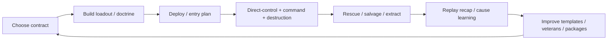

← [[spec/index|spec section]] · [[spec/prototype-roadmap|prototype roadmap]] · [[spec/prototype-implementation-backlog-slice-a|implementation backlog]] · [[dashboards/research-readiness|readiness]] · [[dashboards/system-heatmap|system heatmap]] · [[decisions/index|decisions]] · [[prototypes/index|prototype evidence]] · [root plan](../../VAULT_PLAN.md)

# Game Spec v0 (Planning Anchor)

> [!summary] What this page is
> The first implementation-facing game spec for the future Cortex-like game. It is the **planning anchor** for product direction, first playable scope, system boundaries, and prototype order. It is **not** a final ship spec, balance sheet, engine lock, live-service commitment, or proof that unbuilt systems already work. Treat the body of this page as direction-grade truth and treat any specific feature as still mutable until its DR closes and prototype evidence backs it.

> [!warning] Evidence boundary
> A feature below is a v0 commitment only when this page says it is a commitment. Anything listed under prototype tracks, moonshots, or open research remains explicitly unproven until backed by local code evidence, comparable repo evidence, public source evidence, decision-record closure, or prototype run evidence.

## Source Of Truth

Use this spec as the implementation starting point, then follow evidence in this order.

| Rank | Evidence Source | Use |
|---|---|---|
| 1 | Local Cortex and comparable code notes in [[engine/architecture]], [[engine/direct-control-and-actor-feel-lifecycle]], [[engine/terrain-mutation-and-pathfinding-lifecycle]], [[engine/body-damage-wound-gib-lifecycle]], [[engine/activity-scenario-lifecycle]], [[engine/content-module-loading-lifecycle]], and local comparable audits. | Confirm how source systems actually behave before copying a pattern into the future design. |
| 2 | Existing vault systems notes and generated references. | Translate code and research into implementation contracts. |
| 3 | Decision records in [[decisions/index]]. | Track options, rejected alternatives, risks, validation plans, and reopen triggers. |
| 4 | Prototype evidence in [[prototypes/index]] and `prototype_runs/`. | Promote or kill claims based on runnable evidence. |
| 5 | External sources in [[references/sources]]. | Fill gaps where local evidence is absent or broader industry evidence matters. |
| 6 | Explicit assumptions and moonshots. | Keep speculation useful without turning it into a false promise. |

## Product Promise

Build a solo-first tactical physics sandbox where the player can command AI-controlled fragile soldiers, androids, robots, armored bodies, and enterable mechs as a strategy game; directly possess or pilot bodies when desired; power a base through a vulnerable command core; uproot that core for a risky boosted-avatar play; tear through destructible terrain; survive chaotic mission failures; and use replay/debug tools to understand and improve every run.

The game must feel like a modern successor to the Cortex Command fantasy without copying Cortex Command as a product plan. The target is a clearer, more moddable, more replayable version of the core fantasy: tiny actors, brutal materials, improvised tunnels, emergency rescues, dangerous delivery craft, clever tools, damageable armor/mechs/equipment, and AI helpers that explain what they are doing.

## Player Fantasy

| Fantasy | What The Player Does | Spec Obligation |
|---|---|---|
| Field commander under pressure | Switches between direct control and squad orders while terrain, bodies, and craft are changing the battlefield. | Direct control and command UX must coexist; see [[decisions/dr-004-first-playable-slice]] and [[decisions/dr-009-command-ux-style]]. |
| Continuity commander | Can play commander-first, pilot-first, or hybrid; AI controls bodies by default and the player takes over only when they want. | Player identity/control posture follows [[decisions/dr-015-player-identity-control-posture]]; command UX and AI trust must support strategy-style play. |
| Base-core tactician | Keeps the command core rooted to power base shields/turrets/sensors/doors/repair platforms, or uproots it into an avatar body/chassis for a high-risk power spike. | Command core and base-power mechanics follow [[spec/command-core-base-power]]; base modules, avatar boosts, and loss risks must be replay/UX visible. |
| Physical problem solver | Uses rifles, diggers, charges, medkits, repair tools, and delivery plans to solve a destructible objective. | Items need shared AI/UI/modding/replay role records; see [[spec/equipment-loadout]] and [[references/equipment-role-records-slice-a]]. |
| Chassis tactician | Chooses humans, androids, robots, armor layers, powered armor, and mechs for different mission constraints. | Chassis/origin choices need mass, protection, damage-stage, repair/treatment, AI, loadout, replay, and UX contracts; see [[spec/chassis-armor-mechs-and-origins]]. |
| Rescue storyteller | Saves or loses named actors, recovers gear, and understands why the run collapsed. | Body damage, replay/debrief, and progression must surface causes, not only outcomes. |
| Creator and tester | Builds packages, validates fields, test-launches missions, and inspects source/provenance. | Modding/workbench is core product scope, not an external afterthought. |
| Mastery loop player | Replays a same seed with different loadouts and tactics. | Contracts, run bundles, debriefs, templates, and replay cards must make iteration fast. |

## Product Pillars

| Pillar | Commitment | Evidence / Control |
|---|---|---|
| Physical battles create readable stories. | Destruction, damage, delivery, and AI failures must emit events, overlays, and recap causes. | [[systems/replay-event-architecture]], [[spec/replay-recorder-slice-a]], [[spec/ux-wireframes-slice-a]]. |
| Direct actor feel comes first. | One actor that feels good beats a broad but mushy battlefield. | [[spec/actor-feel-sandbox-slice-a]], [[spec/prototype-roadmap]], [[prototypes/actor-feel-lab-a1-runtime-smoke]]. |
| AI is a tested product feature. | No "great solo AI" claim ships without scenario harness results, reason labels, and replay evidence. | [[spec/ai-trust-harness-slice-a]], [[systems/ai-trust-test-suite]], [[decisions/dr-008-ai-architecture]]. |
| Equipment has one shared meaning. | AI, UI, modding, balance, replay, backend/session, and missions consume the same item role record. | [[spec/equipment-loadout]], [[spec/equipment-loadout-workbench-slice-a]], [[references/equipment-role-records-slice-a]]. |
| Bodies and machines fail locally. | Armor plates, limbs, weapons, tools, mech modules, sensors, reactors, and origins degrade in readable stages when they matter. | [[spec/chassis-armor-mechs-and-origins]], [[spec/body-damage-model]], [[decisions/dr-014-tone-player-promise]]. |
| Command core creates strategic risk. | Rooted core powers the base; uprooted/embedded core creates a stronger avatar while weakening the base. | [[decisions/dr-015-player-identity-control-posture]], [[spec/command-core-base-power]]. |
| Modding and diagnostics are part of the game. | Package validation, provenance, loader graph, diagnostics, and test launch are first-class workflows. | [[spec/modding-model]], [[spec/package-builder-workbench-slice-a]], [[engine/content-module-loading-lifecycle]]. |
| Progression widens tactics. | Retention comes from mastery, horizontal tools, veterans, salvage, templates, replays, and challenges before grind. | [[decisions/dr-011-progression-retention-loop]], [[spec/progression-retention]]. |

## Launch Commitments v0

These are v0 product-direction commitments. They still need prototype evidence before release scope is frozen, but they are not optional side ideas for the first playable path.

| Area | v0 Commitment | First Proof |
|---|---|---|
| Camera & framing | **Strict 2D side-view.** Cortex/Liero classic: small actors, huge destructible terrain, no camera rotation. Tactical map view (per DR-009) is a UI mode that overlays/replaces the side-view temporarily, not a different sim. | A1 actor-feel runs; UX-W camera-mode tests. |
| Tone | **Tactical pulp sci-fi disaster sandbox** (DR-014). Gritty tactical stakes, pulpy systemic consequences, surreal sci-fi accents, sandbox/workbench support. Excludes pure comedy, pure X-COM grimness, pure Noita opacity, pure Powder Toy sandbox. | [[decisions/dr-014-tone-player-promise]]. |
| Engine direction | **Greenfield native core + CCCP as reference lab** (DR-001 direction closed). Greenfield engine; CCCP is read-only reference for mechanics/feel/taxonomy/AI lessons. | [[decisions/dr-001-engine-strategy]]. Implementation specifics (lang/runtime/renderer/data schema) still open. |
| AI bar | **Most humanlike AI in the genre** (DR-014 / DR-008 raised bar). Friendly and enemy bots must communicate intent, model perception/memory, exhibit personality/doctrine, make readable mistakes, and learn-from-defeat. Beyond utility scoring once basics work. | AI-H + AI-EQ + future humanlike-AI tests. |
| Player identity / control posture | **Command-core operator** (DR-015). The player can play strategy-first through orders and AI autonomy, direct-pilot bodies/mechs when desired, or fluidly switch between both. Direct control is optional intervention, not a mandatory always-on mode. | Commander-only breach test, pilot-intervention handoff test, AI handoff replay labels. |
| Command core / base power | The command core is a rooted/mobile/embedded strategic object. Rooted: powers base shields, turrets, sensors, doors, repair platforms, energy pads, command relays, logistics. Embedded: creates a stronger core-bearing avatar while base systems weaken/offline. | CORE-A tests in [[spec/command-core-base-power]]. |
| Primary launch mode | **Solo-first**. Local/offline play must work without account or live-service dependency. | [[spec/prototype-roadmap]], [[decisions/dr-005-multiplayer-posture]], [[decisions/dr-013-backend-service-scope]]. |
| Scope flexibility framework | **Framework must accommodate** solo-hero, small-squad (3-5), RTS-scale (10+), persistent squad campaign (3-10 named with veterans/legacy), and **MMO-ready architecture** for eventual growth. Players author their own scenarios. Default delivered campaign mode is persistent squad. Architectural choices (ECS, networking authority, scenario data model, content pipeline) must not foreclose any of these scales. | Slice-A scenario manifest + scale stress test (single actor, 5 actors, 50 actors); networking authority memo (DR-005). |
| First playable | A single-actor lab grows into a repeatable Breach Contract proof mission before campaign breadth. | [[spec/prototype-implementation-backlog-slice-a]], [[spec/mission-director-slice-a]]. |
| Direct control | Player movement, aim, weapon, tool, damage/status, and recovery loops are first-class, but bodies must remain AI-usable when not possessed. | A1 actor-feel runs, A-FEEL tests, DR-015 commander-only and handoff tests. |
| Destructible terrain | Terrain and material affordances are core to navigation, combat, tools, AI, missions, replay, and UX. | MAT-T terrain/material sandbox tests. |
| Replay/debug | Every meaningful prototype must produce inspectable run evidence. | [[references/prototype-run-bundle-schema]], [[spec/replay-recorder-slice-a]]. |
| AI trust | Friendly AI is a launch-quality bar, not decoration, but only proven harness behavior can be promised. | AI-H and AI-EQ tests. |
| Loadout/workbench | Equipment roles, source provenance, bot suitability, package warnings, and mission capabilities must be visible. | LOAD-A, LOAD-R, LOAD-W, LOAD-FIELD, and PACK tests. |
| Chassis/armor/mechs | **First-class** (DR-014). Armor layers, damageable equipment, mechs, powered armor, robots/androids, multiple origins/races, staged machine/body damage, pilot rescue/eject, repair/salvage. Not stat-boost suits; chassis grammar from [[spec/chassis-armor-mechs-and-origins]]. | CHASSIS-A tests; one chassis-bearing actor in Slice A. |
| Accessibility floor | Text scale, contrast, no-color-only states, same-input navigation, remap/holds, captions, reduced motion/shake/flash are early requirements. | ACC-A and UX-W tests. |
| Modding | Schema-first data, Lua escape hatches, package builder, loader parity, diagnostics, and provenance are product scope. Player-authored scenarios are core (per scope flexibility). | MOD-A, PACK-A, CONTENT-A tests. |
| Backend posture | Local-first service spine for health/schema/package/replay/diagnostics/hub fixtures; online adapters stay optional but architecture must not foreclose MMO-scale services. | BACK-SCOPE and BACK-A tests. |

## Explicit Non-Commitments v0

| Area | Status | Why |
|---|---|---|
| Live PvP at launch | Prototype track, not a launch promise. | Terrain/entity authority, bandwidth, cheating, and UX are unproven; see [[decisions/dr-005-multiplayer-posture]]. |
| Account economy / gacha / paid collection | Research and private prototype only. | Fairness, modding trust, ethics, and economy require a future release-facing DR beyond [[decisions/dr-011-progression-retention-loop]]. |
| Noita-grade material chemistry at launch | Moonshot, not v0 promise. | The launch path is curated material affordances until [[decisions/dr-007-terrain-material-model]] has run evidence. |
| Full deterministic replay | Open research. | The current posture is hybrid semantic events, snapshots, checksums, and deterministic islands only when proven. |
| Final engine implementation | Open within direction. | DR-001 direction closed (greenfield + CCCP reference); language/runtime/renderer/ECS-or-OOP/data-schema/build-CI still open. |
| Final arsenal balance | Open. | Generated role cards and overlap audits are seed data; runtime item behavior and AI-H evidence must decide. |
| Final origin/race roster | Open. | Grammar is fixed in [[spec/chassis-armor-mechs-and-origins]]; ship roster (suggested 2-3 origins) decided by content cost vs prototype-mission needs. |
| MMO live service at launch | Not a v0 commitment. | Architecture must not foreclose it (per Scope flexibility framework), but no v1 MMO promise. Future DR after persistent-squad campaign + co-op evidence. |
| Default game mode beyond solo | Persistent squad campaign is the planned default delivered mode, but launch order (solo arena → squad campaign → RTS → MMO-able) decided by playtest evidence. | RET-A and Slice-B/C scope. |

## Core Loop

The core loop is:

| Step | Player Question | Required Surface | Evidence Page |
|---|---|---|---|
| Choose contract | What problem am I solving, and what tools should I bring? | Contract card, objective grammar, material profile, capability strip, expected length, seed. | [[spec/mission-director-slice-a]], [[spec/progression-retention]]. |
| Build loadout | Do I have a plan, a backup, and bot-usable gear? | Mission strip, role filters, slots, cost/mass, delivery risk, AI competence, package warnings. | [[spec/equipment-loadout-workbench-slice-a]]. |
| Deploy | Can I enter without losing the run immediately? | LZ/delivery risk, cargo/craft warning, abort/retry, commander opening intent. | [[engine/loadout-delivery-economy-lifecycle]], [[spec/mission-director-slice-a]]. |
| Fight/command | What is happening, who needs orders, and why did that fail? | HUD, squad panel, order overlay, material overlay, event feed, reason labels. | [[spec/ux-wireframes-slice-a]], [[spec/ai-trust-harness-slice-a]]. |
| Rescue/recover | What can still be saved? | Downed actors, wounds, extract route, salvage, gear fallout, emergency objective. | [[spec/body-damage-model]], [[spec/progression-retention]]. |
| Replay/recap | What happened and what should I try next? | Timeline, cause chains, death/loss recap, loadout edit link, same-seed retry. | [[spec/replay-recorder-slice-a]], [[systems/replay-determinism-and-run-evidence]]. |
| Improve | How do I convert this run into mastery? | Template edits, veteran state, salvage, creator/package fixes, next contract suggestions. | [[decisions/dr-011-progression-retention-loop]], [[spec/progression-retention]]. |

## First Playable Slice

The first playable is not a campaign, content showcase, or final engine proof. It is a narrow, instrumented proof that the core fantasy works.

| Slice | Main Question | Required Result |
|---|---|---|
| A0 Lab shell | Can we run, reset, tune, and capture evidence quickly? | Run-bundle path, config/seed, simple scene, checker pass. |
| A1 Actor feel | Is one actor readable and satisfying for five minutes? | Movement, aim, rifle, reload, status, selected item strip, manual play notes. |
| A2 Terrain/material | Do material rules, carving, filling, hazards, and path implications make sense? | Eight-material fixture, dig/fill/blast events, overlays, dirty-region metrics. |
| A3 Recorder/viewer | Can failures be reconstructed without guesswork? | Event envelope, JSONL export, snapshots/checksums, viewer/event tail, death recap. |
| A4 UX comprehension | Can the player understand state and failure causes under pressure? | HUD, material overlay, failure labels, accessibility proofs. |
| A5 Equipment/loadout | Do item roles survive real field data and workbench usage? | Role records, fixture loadouts, trace/source panels, bot labels, export preview. |
| A6 AI trust bootstrap | Can a bot use shared intent/item surfaces and explain decisions? | AI-H scenario runner, reason labels, item choice/refusal/result events. |
| A7 Breach Contract | Can these systems form one repeatable mission? | Typed manifest, objective states, commander reasons, capability strip, debrief/replay. |

The first playable exits only when [[spec/prototype-implementation-backlog-slice-a]] gates are met or explicitly revised by [[decisions/dr-004-first-playable-slice]].

## Controls And Actor Feel

| Requirement | v0 Direction | Tests / Evidence |
|---|---|---|
| Direct control | Control intent serializes before sim consequences: move, aim, selected item, fire/use, jump/stance, reload, command handoff. | A1-001, REC-A input traces, AI-H control-driver compatibility. |
| Aim and weapon feel | Reticle and firing outcomes must show motion, recoil, reload, stance/range/spread, and failure causes. | A-FEEL-02, HUD-01..03, [[engine/projectile-to-impact-lifecycle]]. |
| Recovery | Actor should recover from recoil, impact, terrain snag, or command swap with readable status. | A-FEEL-01/03, BODY-A status events. |
| Tool feel | Digger, repair/fill, explosive, and support actions show validity before or immediately after action. | MAT-T, LOAD-A, LOAD-W, UX-W material overlays. |
| Chassis feel | Armor, powered armor, robots, and mechs must feel different through mass, acceleration, recoil, route fit, noise, and recovery, not only stat bars. | CHASSIS-A, A-FEEL, MAT-T route-fit tests. |
| Input coverage | Keyboard/mouse first; controller/gamepad path must be tested early for HUD/workbench traversal. | ACC-A same-input navigation, LOAD-W fixture traversal follow-ups. |

## Physics, Destruction, And Terrain

| Area | v0 Direction | Open Boundary |
|---|---|---|
| Terrain representation | Prototype with curated material affordances before richer material simulation. | Backend may change after MAT-T and DR-007 evidence. |
| Material set | Slice A starts with air, dirt, concrete, metal, nohook/anchor material, hazard, loose fill, repair/fill. | Noita-grade chemistry stays MS-01 until isolated tests prove value/perf. |
| Destruction events | Every carve, blast, fill, repair, dirty-region update, path refresh, and terrain snapshot emits replay/debug data. | Event volume and snapshot sizes feed DR-002/DR-005/DR-007. |
| Mobility affordances | Anchorability, nohook, jet safety, path cost, hazard, and climb/cover implications must be visible to player and AI. | Mobility tools can split to A.1 if they block gun/dig feel. |
| Structural complexity | Collapse/support rules are prototype-only until readability and performance are proven. | Avoid hidden simulation that the HUD cannot explain. |

## Actors, Body Damage, And Death

| Area | v0 Direction | Evidence |
|---|---|---|
| Body state | Use readable coarse states first: stable, impaired, downed/dying, dead/gibbed, with expandable limb/wound detail. | [[spec/body-damage-model]], [[decisions/dr-003-body-damage-readability]]. |
| Damage channels | Projectile, blast, crush/fall, hazard/material, fire/heat, tool/self, and scripted mission causes must map to event families. | BODY-A and REC-A cause-chain tests. |
| Wounds and fallout | Wounds, bleeding/status changes, limb loss/gibs, inventory/equipment fallout, and treatment/support actions must be evented. | [[engine/body-damage-wound-gib-lifecycle]], [[systems/damage-equipment-and-items]]. |
| Armor/chassis/equipment damage | Armor plates, weapons, tools, sensors, mech limbs, reactors, and origin-specific body systems should degrade in coarse readable stages when tactically meaningful. | [[spec/chassis-armor-mechs-and-origins]], CHASSIS-A tests. |
| Origins | Human, android, robot, augmented, and later surreal/biological origins are tactical body promises, not cosmetic skins. | [[spec/chassis-armor-mechs-and-origins]], BODY-A/RET-A evidence. |
| Player comprehension | Death/loss recap shows last causes, relevant input, source actor/item/material, status progression, and next action. | REC-A-04, BODY-A, UX death recap tests. |
| AI use | Bots need reason labels for rescue, retreat, treatment, refusal, and unsafe orders. | AI-H and AI-EQ scenarios. |

## Equipment And Loadouts

Equipment is a shared system contract, not a catalog page.

| Surface | v0 Requirement | Source |
|---|---|---|
| Role record | Each item must resolve to one shared `role_record` with identity/provenance, slots, action/effect, terrain/material consequence, AI policy, UI projection, balance/overlap, replay/backend, and mission tags. | [[spec/equipment-loadout]], [[references/equipment-role-records-slice-a]]. |
| Chassis and armor slots | Actor origins, armor layers, powered armor, mech modules, and damageable equipment extend the same slot/role-record model instead of becoming a separate RPG inventory. | [[spec/chassis-armor-mechs-and-origins]], [[spec/equipment-loadout]]. |
| Loadout fixtures | Slice A uses nine fixture loadouts from generated data to test assault, breach, medic, scout, sniper, heavy, grenadier, and bad-loadout cases. | [[references/equipment-loadout-fixtures-slice-a]]. |
| Workbench | Mission strip, catalog, actor columns, detail drawer, trace tab, source inspector, bot trust, overlap compare, diagnostics, and export preview are required prototype surfaces. | [[spec/equipment-loadout-workbench-slice-a]]. |
| Bot suitability | Items expose bot claim states, reason labels, refused/selected/result events, source confidence, and first fix actions. | [[references/equipment-ai-behavior-contract]], [[references/equipment-ai-summary-seed-slice-a]]. |
| Balance | Overlap groups are not final balance; they are prompts for runtime comparison and role differentiation. | [[references/equipment-overlap-audit-slice-a]], [[references/equipment-overlap-resolution-worksheet-slice-a]]. |
| Reuse/provenance | If any external item code/assets/data enter the future project or prototype, log it. | [[references/usage-ledger]], [[decisions/dr-010-license-reuse-matrix]]. |

## AI And AI Trust Harness

| Layer | v0 Direction | Validation |
|---|---|---|
| Intent layer | Bots write through the same serializable intent/control layer as players where practical. | AI-H control-driver tests and replay traces. |
| Tactical AI | Start with utility/scored jobs plus scripted hooks, not opaque cleverness. | [[decisions/dr-008-ai-architecture]], AI-H-01..06. |
| Item decisions | Item choice/refusal/result events must include reason labels, rejected alternatives, source confidence, and result. | AI-EQ and AI-EQ-SUMMARY tests. |
| Chassis decisions | Bots must understand armor mass, route fit, mech entry/exit, pilot rescue, equipment damage, origin-specific repair/treatment, and module failures before default use claims. | CHASSIS-A + AI-H reason-label tests. |
| Terrain reasoning | Bots must understand path blockers, wrong tool, stale path, unsafe hazard, and breach/rescue opportunities. | MAT-T + AI-H path/material tests. |
| Trust UI | Player-facing command and replay surfaces must show what the bot is trying, why it changed, and how it failed. | [[spec/ux-wireframes-slice-a]], [[systems/ai-trust-test-suite]]. |
| Commander AI | Enemy director/commander decisions must expose reason strings and objective state changes. | [[spec/mission-director-slice-a]], MISSION-A. |

## Missions And Director

| Area | v0 Direction | First Proof |
|---|---|---|
| Mission unit | Use contract missions with typed manifests, seeds, material profiles, objective grammar, capability requirements, director phases, and replay/save fields. | [[spec/mission-director-slice-a]]. |
| First proof | Breach Contract: compact destructible objective, entry choice, breach/rescue/salvage pressure, commander response, debrief/replay output. | A7 MISSION-A tests. |
| Director | Director manages pacing, pressure, reinforcement decisions, LZ risk, and objective escalation with reason labels. | Commander events and MISSION-A-06..09. |
| Objectives | Objectives should reward terrain problem-solving: breach, infiltrate, destroy, recover, rescue, extract, defend, salvage. | [[systems/destruction-objective-mission-patterns]]. |
| Failure | Failed objectives branch to extraction, secondary objective, same-seed retry, or loadout edit, not only restart. | [[spec/core-loop]], [[spec/progression-retention]]. |

## UX/UI

| Surface | v0 Requirement | Validation |
|---|---|---|
| HUD | Actor, chassis/origin, armor/equipment condition, item/ammo/cooldown, health/status, reticle state, order state, material/tool label, and last critical event. | HUD-01..03, CHASSIS-A, and UX-W tests. |
| Squad panel | Actor status, current job/order, path/material blocker, inventory role, armor/mech/pilot state, rescue/extract state. | SQUAD/ORDER/CHASSIS tests. |
| Command overlay | Direct + slowdown overlay first; optional tactical map remains a prototype/DR-009 validation route. | ORDER-01, AI-H reason label display. |
| Buy/loadout/workbench | Mission capability strip, role cards, chassis/origin compatibility, armor/mech slots, source/provenance, bot trust, package diagnostics, and export preview. | LOAD-W, CHASSIS-A, and ACC-A workbench tests. |
| Replay/debrief | Timeline, cause chains, screenshots/snapshots, actor fate, equipment used/refused, retry/edit actions. | REC-A, MISSION-A, RET-A. |
| Hub | Local game, package/workbench, replay/reports, diagnostics, server fixtures, settings. | BACK-A and UX-W hub tests. |
| Accessibility | 200 percent text scale, color-independent state labels, keyboard/controller route, remap/holds, captions, reduced motion/shake/flash. | [[spec/accessibility-comfort-slice-a]]. |

## Replay And Debug

| Requirement | v0 Direction | Evidence Gate |
|---|---|---|
| Event envelope | Events use stable ids, run id, tick/time, category/type, actor/source ids, parent cause, and payload. | [[spec/replay-recorder-slice-a]], [[references/prototype-run-bundle-schema]]. |
| Snapshots/checksums | Use hybrid semantic events plus actor/inventory/terrain snapshots and checksums. | DET-A tests. |
| Viewer | Start with JSONL export, event tail, filters, parent-chain view, and failure recap before polished replay product. | REC-A-01..07. |
| Run bundle | Every serious prototype run emits manifest, events, summary, notes, and captures. | `research_tools/prototype_run_check.py`. |
| Determinism | Only deterministic islands proven by checksums/divergence tests can be called deterministic. | [[systems/replay-determinism-and-run-evidence]]. |
| Networking bridge | Event volume, snapshot size, dirty terrain chunks, hashes, and byte budgets feed multiplayer/backend decisions. | DR-005, DR-013, BACK-SCOPE. |

## Modding And Workbench

| Area | v0 Direction | Evidence |
|---|---|---|
| Data model | Schema-first packages with Lua/script escape hatches and explicit capability metadata. | [[decisions/dr-006-modding-data-model]], [[spec/modding-model]]. |
| Loader parity | Workbench must understand module order, includes, `CopyOf`, source paths, duplicate pressure, script references, and diagnostics. | [[engine/content-module-loading-lifecycle]], [[references/content-loader-graph-cccp]]. |
| Package builder | Deterministic package output, provenance scanner, validation diagnostics, loader graph, preset/effect graphs, migration preview, test launch. | [[spec/package-builder-workbench-slice-a]]. |
| Source inspector | Equipment/workbench can jump from role card to source provenance, field confidence, include context, duplicate refs, and fix actions. | [[references/equipment-source-trace-slice-a]]. |
| Release boundary | Private reuse is allowed; public release cleanup comes from the usage ledger. | [[references/usage-ledger]], [[decisions/dr-010-license-reuse-matrix]]. |

## Backend And Networking Posture

| Layer | v0 Direction | Boundary |
|---|---|---|
| Local-first spine | Build local service endpoints/fixtures for health, schema versions, package registry, join eligibility, replay/report index, diagnostics export, redaction, and hub UX. | Required for Slice A/B tooling and future online options. |
| Backend fixtures | Static/heartbeat server rows, package mismatch rows, stale heartbeat cases, local supervisor states, and deep-link parser. | Required for BACK-A tests. |
| Co-op architecture | Keep event, snapshot, package hash, and authority data visible so co-op remains possible. | No launch co-op/PvP promise until DR-005 evidence. |
| Public services | Accounts, matchmaking, live leaderboards, anti-cheat enforcement, moderation, economy, paid inventory. | Research/prototype only; future DR required before commitment. |
| Privacy/diagnostics | Local diagnostics and consented exports must redact private paths/secrets where applicable. | BACK-SCOPE tests. |

## Progression And Retention

| Area | v0 Direction | Guardrail |
|---|---|---|
| Return loop | Same-seed retries, saved templates, veteran actors, salvage, replay/debrief, contract variants, creator challenges. | RET-A tests after actor-feel, recorder, loadout, and one contract exist. |
| Progression shape | Horizontal unlocks and tactical options over raw power escalation. | Avoid turning sandbox mastery into grind. |
| Veterans | Named actors, scars, specialties, and recovery stories are retention candidates. | Prototype before campaign commitment. |
| Chassis identity | Armor sets, mech hulls, repaired modules, android shells, robot frames, and origin histories can become memorable return-loop objects if they stay tactical and readable. | Prototype through CHASSIS-A and RET-A before campaign commitment. |
| Salvage | Salvage creates tactical recovery and material consequences. | Must not punish experimentation into restart-only behavior. |
| Collection/economy | Cosmetics/collection/gacha can be researched privately but must not corrupt modding or fairness commitments. | Future monetization ethics DR before release commitment. |

## Prototype Tracks

These tracks are required or allowed, but not final launch promises.

| Track | Status | Next Artifact |
|---|---|---|
| A1 manual actor-feel run | Required next evidence. | Human play notes and checked run bundle from [[prototypes/actor-feel-lab-a1-ui-smoke]] / actor lab. |
| Integrated collision and global path proof | Required before terrain/AI claims grow. | A1/A2 runtime path/collision run bundle. |
| Replay recorder/viewer | Required. | REC-A/DET-A implementation from [[spec/replay-recorder-slice-a]]. |
| Terrain/material lab | Required. | MAT-T-01..10 implementation from [[spec/terrain-material-sandbox-slice-a]]. |
| Full equipment workbench traversal | Required. | LOAD-W full traversal, source drill-down, gamepad, 200 percent text, replay/export. |
| Chassis/armor/mech/origin prototype | Required before promising the mech/armor fantasy as more than direction. | CHASSIS-A local armor, staged equipment damage, enterable mech, and android/robot origin run evidence. |
| AI trust harness | Required before AI promise. | AI-H-01..06 and AI-H-LOAD scenario runner. |
| Breach Contract mission | Required before Slice B. | MISSION-A proof mission. |
| Backend/hub fixtures | Required for local-first service spine. | BACK-A and BACK-SCOPE runs. |
| PvP/co-op networking | Optional prototype track. | Bandwidth/authority run; future DR-005 update. |
| Async strategy/community loop | Optional prototype track. | JSON/static backend contract seed; future DR. |

## Moonshots

Moonshots stay alive in [[research-log/moonshot-register]] and must not block the first playable. Promote them only through a DR or prototype result.

| Moonshot | v0 Treatment |
|---|---|
| Noita-grade material chemistry | Isolate as MS-01; do not mix into A2 unless the curated material set is already readable and performant. |
| Live PvP | Isolate as MS-02 or DR-005 follow-up; do not delay local replay/terrain evidence. |
| AI personality engine | Prototype after AI-H can measure basic competence. |
| Veteran/legacy actors | Prototype with RET-A after body/replay/debrief exists. |
| Lua REPL + scene scrubber | Good workbench experiment after package-builder basics. |
| Tactical map as replay scrub UI | Prototype alongside UX-W; do not assume it is the command UI. |
| Adaptive commander | Prototype after Breach Contract reason strings exist. |
| Material lab as shipping mode | Revisit after MAT-T. |
| Async strategic layer | Revisit after backend fixture contracts. |
| Voxel/2.5D experiment | Separate experiment only. |
| Cosmetic collection economy | Research only until fairness/modding DR. |
| Exotic origins and biotech bodies | Prototype after human/android/robot readability works; keep as surreal-world expansion, not Slice A dependency. |

## Open Research Questions

| Question | Current Status | Must Resolve With |
|---|---|---|
| Should the final game build on CCCP, a fork, or a greenfield engine? | Open. CCCP build passes; runtime visual proof partial. | [[decisions/dr-001-engine-strategy]], [[engine/cccp-build-run-audit]], greenfield comparison. |
| What terrain backend best balances feel, readability, AI, replay, and networking? | Open. Curated material Slice A chosen for test. | MAT-T runs and [[decisions/dr-007-terrain-material-model]]. |
| How deterministic can replay be? | Open. Hybrid event/snapshot/checksum posture. | REC-A/DET-A run bundles. |
| How much AI complexity is enough for solo trust? | Open. Harness requirements ready. | AI-H and AI-EQ runs, [[decisions/dr-008-ai-architecture]]. |
| What command UX should ship? | Open lean: direct + slowdown + optional tactical map. | UX-W/ORDER tests and [[decisions/dr-009-command-ux-style]]. |
| What multiplayer posture is viable? | Open lean: solo-first/co-op-ready, no PvP promise. | Event volume, terrain snapshot, authority prototype, [[decisions/dr-005-multiplayer-posture]]. |
| What backend scope is worth building now? | Local-first spine chosen for Slice A. | BACK-SCOPE/BACK-A evidence and [[decisions/dr-013-backend-service-scope]]. |
| Which item roles are truly distinct? | Generated role records and overlap worksheets exist; runtime proof open. | LOAD-W, AI-H-LOAD, overlap comparisons. |
| How far should armor, mechs, robots, androids, and species/origins go? | Open. Direction accepted; prototype evidence missing. | [[decisions/dr-014-tone-player-promise]], [[spec/chassis-armor-mechs-and-origins]], CHASSIS-A tests. |
| How should body damage stay readable instead of noisy? | Coarse silhouette + advanced opt-in lean. | BODY-A, HUD, REC-A recap tests and [[decisions/dr-003-body-damage-readability]]. |
| What retention loop is fair and durable? | Intrinsic-first hybrid lean. | RET-A tests and future economy/fairness DR if monetization becomes real. |
| What audio identity and localization plan should exist? | Not yet specified. | New DRs or spec pages after first playable UX vocabulary stabilizes. |

## Implementation Rules

| Rule | Practical Meaning |
|---|---|
| Build evidence, not prose-only confidence. | Each promoted claim needs a code path, source, DR, or run artifact. |
| Keep reference repos clean. | Prototype in `prototype_workspaces/` or another explicit workspace unless asked to edit upstream refs. |
| Instrument every mechanic early. | If AI, replay, UX, networking, or missions depend on a mechanic, emit events before broadening it. |
| Prefer readable outcomes over hidden depth. | The player must understand material, item, AI, damage, and mission failures. |
| Use one shared data contract per concept. | Do not let AI/UI/modding/balance/replay/backend maintain divergent item or mission meanings. |
| Log reuse when it enters the future project. | Private reuse is allowed, but the usage ledger preserves future release options. |

## Source Trail

- [[spec/product-promise]]
- [[spec/core-loop]]
- [[spec/player-modes]]
- [[spec/simulation-architecture]]
- [[spec/actor-feel-sandbox-slice-a]]
- [[spec/terrain-material-sandbox-slice-a]]
- [[spec/body-damage-model]]
- [[spec/chassis-armor-mechs-and-origins]]
- [[spec/equipment-loadout]]
- [[spec/equipment-role-card-renderer-slice-a]]
- [[spec/equipment-loadout-workbench-slice-a]]
- [[spec/ai-trust-harness-slice-a]]
- [[spec/mission-director-slice-a]]
- [[spec/ux-wireframes-slice-a]]
- [[spec/accessibility-comfort-slice-a]]
- [[spec/replay-recorder-slice-a]]
- [[spec/modding-model]]
- [[spec/package-builder-workbench-slice-a]]
- [[spec/backend-networking]]
- [[spec/backend-service-hub-slice-a]]
- [[spec/progression-retention]]
- [[spec/prototype-roadmap]]
- [[spec/prototype-implementation-backlog-slice-a]]
- [[dashboards/research-readiness]]
- [[dashboards/system-heatmap]]
- [[decisions/index]]
- [[references/sources]]
- [[references/usage-ledger]]
- [[research-log/moonshot-register]]
