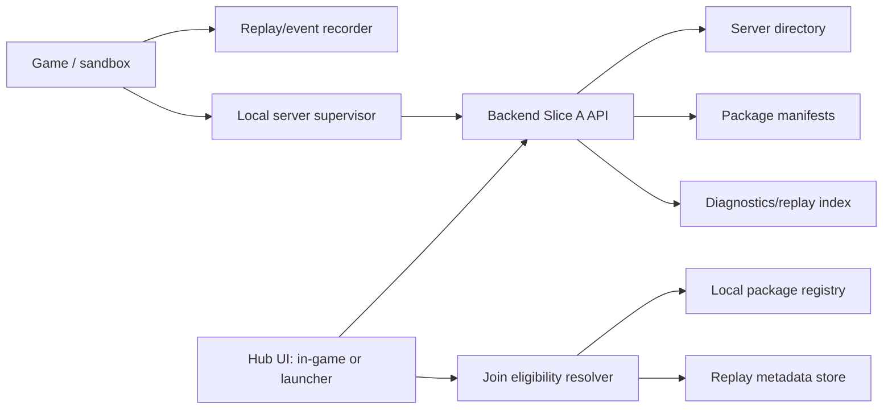

← [[spec/index|spec section]] · [[decisions/dr-013-backend-service-scope|DR-013 backend service scope]] · [[spec/backend-networking|backend/networking posture]] · [[systems/networking-backend-frontend|networking/backend/frontend]] · [[comparables/opensoldat-satellites-local-audit|OpenSoldat satellite audit]] · [[systems/modding-package-and-workbench|modding workbench]] · [[spec/replay-recorder-slice-a|replay recorder Slice A]] · [[spec/ux-wireframes-slice-a|UX wireframes Slice A]]

# Backend Service And Hub Slice A

> [!summary] Purpose
> Convert the OpenSoldat base/launcher/lobby audit plus current platform research into a concrete first backend/frontend slice. [[decisions/dr-013-backend-service-scope]] sets the boundary: local-first service spine first, with the same contracts extending into `cf-server`, `lobby_directory`, public-server discovery, public-shard account adapters, anti-cheat foundation, and MMO persistence as M9-M12 mature. This slice is **not** a commitment to ranked matchmaking, cloud-only hosting, or a live-service economy. DR-057 allows dormant/default-off optional cosmetic economy hooks later, but Slice A must not couple core backend readiness to them.

> [!tip] UX companion
> Hub layout, server-row readability, join blockers, replay browsing, diagnostics, and settings/accessibility flows are translated into screen requirements in [[spec/ux-wireframes-slice-a]].

> [!important] Product stance
> Build the best game first. Backend scope exists to support the game: fast local play, strong AI, replay/debug, mod compatibility, safe joining, good UX, and future community growth. License/reuse tracking is documentation only; it must not block private prototypes.

## Why This Slice Exists

OpenSoldat shows that a 2D action game is not just an executable. Its ecosystem splits engine, base content, launcher, and lobby into separate responsibilities. For a Cortex-like game, those responsibilities are even more important because terrain destruction, AI, mods, and replays all need compatibility and provenance.

| Need | Why It Matters In A Cortex-Like Game |
|---|---|
| Server discovery | Players need to know whether they can join before they click: version, mods, content hashes, rules, bot count, terrain-sync profile, password/invite status, and replay compatibility. |
| Local hosted game flow | Solo/local/co-op prototypes should start a local server/sandbox cleanly, show readiness, and shut down without orphaned processes. |
| Content compatibility | Mutable terrain plus mods makes package identity critical. Names are not enough; use manifest hashes and package sets. |
| Replay/report browsing | AI trust, death recaps, terrain bugs, support, and sharing all need searchable replay metadata. |
| Hub UX | The launcher/in-game hub should expose local game, server browser, replays, mods/workbench, settings, diagnostics, and updates without becoming a replacement for in-game UX. |
| Future platform flexibility | Steam, direct TCP/UDP, GameNetworkingSockets, relay services, and self-hosted backend options should plug into the same high-level join model. |

## Evidence Stack

### Local OpenSoldat Evidence

| Evidence | Local Path | Lesson |
|---|---|---|
| Base content archive and `sv_pure` SHA1 dependency | `comparables_repos/opensoldat-base/README.md:9-17` | Official content packages must be byte-identical for pure servers. Our server rows need package and manifest hashes. |
| Reproducible package script | `comparables_repos/opensoldat-base/create_smod.py:155-194` | Normalize archive metadata, timestamps, permissions, and file ordering. |
| Launcher top-level IA | `comparables_repos/opensoldat-launcher/src/components/App.tsx:151-156` | `LOBBY`, `LOCAL`, `DEMOS`, `SETTINGS` are useful operational buckets; we need to add `MODS/WORKBENCH`, `REPLAYS/REPORTS`, and `DIAGNOSTICS`. |
| Deep-link join | `comparables_repos/opensoldat-launcher/src/components/App.tsx:117-135`, `src/soldatLink.ts` | Join links are useful; password-in-URL is a pattern to improve, not copy as-is. |
| Lobby response shape | `comparables_repos/opensoldat-launcher/src/stores/lobby/servers.ts:8-33` | Server list rows include anti-cheat, country, map, players, bots, password, version, game style, and custom weapons. |
| Browser mapping | `comparables_repos/opensoldat-launcher/src/stores/lobby/servers.ts:82-150` | A simple fetch/map/filter model is enough for Slice A, but the URL must be configurable and schema-versioned. |
| User-facing server fields | `comparables_repos/opensoldat-launcher/src/types/index.ts:81-101` | The UI row shape is compact and scannable; our row needs extra compatibility/status fields. |
| Server filters | `comparables_repos/opensoldat-launcher/src/stores/lobby/filters.ts:29-90` | Quick search, player occupancy, game mode, style, no-bots, and no-password are baseline filters. |
| Local server process lifecycle | `comparables_repos/opensoldat-launcher/src/api/soldat/server.ts:4-18`, `:21-60` | Avoid stdout readiness checks; use structured health/status events. |
| Client spawn/join arguments | `comparables_repos/opensoldat-launcher/src/api/soldat/client.ts:23-54` | Join launch should validate host/port and keep credentials out of casual logs/links. |
| Lobby service endpoints | `comparables_repos/opensoldat-lobby/main.go:80-132`, `:250-263` | Slice A can start with static `/servers`; production needs registration, TTL, validation, auth, rate limits, and monitoring. |
| Broad CORS | `comparables_repos/opensoldat-lobby/main.go:244-247` | Useful for local prototypes; production CORS should be explicit. |

### External Platform Lessons

| Source | Lesson To Keep |
|---|---|
| Steamworks Game Servers documentation | Dedicated/community servers are a first-class multiplayer path; Steam exposes unified server-browser style data via `ISteamMatchmakingServers`. |
| Valve Master Server Query Protocol and Server Queries docs | Server discovery commonly filters by region, dedicated/secure, game dir/app id, map, password, empty/full, version, and tags; servers heartbeat/quit so stale rows expire. |
| Steam Datagram Relay documentation | If using Steam/SDR later, traffic can be relayed with hidden IPs plus authenticated, encrypted, rate-limited transport; this influences trust fields and connection-ticket design. |
| Unity Lobby documentation | Modern lobby services support browsing, join codes, private invites, host-lobby-for-server, and query requirements such as game mode/map. |
| Unity Multiplay docs | Hosting platforms depend on query protocol health, allocation identity, crash/backoff behavior, and server state checks; our local supervisor should expose this early. |

## Non-Goals For Slice A

| Non-Goal | Why |
|---|---|
| Real money economy, gacha-like collection, cosmetic battle pass, or account inventory | Research freely elsewhere; preserve clean extension seams if cheap, but do not entangle early backend with optional economy before the core game is fun. Any future activation follows DR-057. |
| Public matchmaking | Server browser + join eligibility is enough to validate schema and UX. |
| Tournament-grade anti-cheat | Track trust tiers, content hashes, and server-side validation now; full commercial anti-cheat remains later. |
| Production-scale backend | Slice A can be static JSON plus heartbeat TTL. Production hardening is a later milestone. |
| Transport choice | This note defines discovery and hub requirements, not whether we use Steam, GameNetworkingSockets, raw UDP, Relay, or something else. |

## Slice A Architecture

| Component | Slice A Responsibility |
|---|---|
| Backend API | Serve static server rows; accept optional local heartbeat; expire stale rows; expose package/replay metadata. |
| Hub UI | Show server browser, local host panel, replays/reports, mods/workbench, settings, and diagnostics from the same data model. |
| Join eligibility resolver | Given a server row and local install state, return `can_join`, `blocked`, or `needs_action` with reasons. |
| Local server supervisor | Start/stop local sandbox/server, publish structured health, report crash/exit/stderr, and clean up on app close. |
| Package registry | Track installed packages, dev mounts, manifest hashes, compatibility flags, and provenance pointers. |
| Replay metadata store | Track local replay event schema, content manifest hash, actors, tags, duration, and error/failure markers. |

## API Surface

All endpoints are versioned. Slice A can be implemented as a local service or static JSON files first.

| Endpoint | Method | Slice A Behavior | Future Hardening |
|---|---|---|---|
| `/v1/health` | `GET` | Returns service version, schema versions, and clock. | Add deployment id, rate-limit status, and dependency health. |
| `/v1/servers` | `GET` | Returns server list sorted by `last_heartbeat_at` and filtered client-side first. | Add server-side filters, pagination, auth abuse controls, and moderation. |
| `/v1/servers/register` | `POST` | Optional local-only registration for prototype servers. | Signed server identity, validation, rate limits, moderation queue. |
| `/v1/servers/{server_id}/heartbeat` | `POST` | Updates player counts, health, map, packages, and expiry time. | Authenticated server token, replay/schema compatibility checks. |
| `/v1/servers/{server_id}/players` | `GET` | Returns visible player/bot summary if allowed. | Privacy controls and abuse limits. |
| `/v1/join/eligibility` | `POST` | Computes local install compatibility and join blockers from a server row. | Account entitlements, ban state, anti-cheat/trust checks. |
| `/v1/packages` | `GET` | Lists known packages and manifest hashes. | Registry moderation, downloads, dependency solver. |
| `/v1/packages/{package_id}/{version}` | `GET` | Returns package manifest summary and provenance pointer. | Signed manifests and mirrors. |
| `/v1/replays` | `GET` | Lists local replay metadata and tags. | Uploads, privacy, share links, bug-report flow. |
| `/v1/diagnostics/report` | `POST` | Accepts local crash/replay/AI-fail summaries in dev builds. | Consent, redaction, retention policy, support triage. |

## Server Row Schema

| Field | Required | Purpose |
|---|---|---|
| `server_id` | Yes | Stable id for a row; not just `ip:port`. |
| `display_name` | Yes | Human-readable name. |
| `endpoint` | Yes for direct connect | Host, port, protocol, relay id, or local supervisor id. |
| `region` | Yes | Browser grouping and latency hint. |
| `version` | Yes | Game build version. |
| `protocol_version` | Yes | Network/discovery schema compatibility. |
| `simulation_profile` | Yes | `single_actor_lab`, `co_op_lab`, `full_battle`, etc. |
| `terrain_sync_profile` | Yes | `none`, `semantic_events`, `chunk_deltas`, `snapshot_stream`, etc. |
| `map_id` / `map_hash` | Yes | Map identity and byte/content hash. |
| `game_mode` | Yes | Browser filter and expectation setting. |
| `ruleset` | Yes | Difficulty, friendly fire, economy, AI director, time scale. |
| `players` | Yes | Human player count, max players, spectators. |
| `bots` | Yes | Bot count, AI difficulty tier, commander AI enabled. |
| `password_required` | Yes | Join UX and filter. |
| `invite_required` | Yes | Private lobby semantics without exposing secrets. |
| `package_set` | Yes | Required packages with id, version, manifest hash, trust tier. |
| `content_manifest_hash` | Yes | Single hash for join/replay compatibility. |
| `replay_schema_version` | Yes | Whether local recorder/viewer can understand server event metadata. |
| `trust_tier` | Yes | `local`, `friend`, `community`, `verified`, `unknown`. |
| `mod_safety` | Yes | `vanilla`, `known_mods`, `unknown_scripts`, `dev_mounts`. |
| `join_state` | Yes | Cached `can_join`, `needs_download`, `blocked`, or `unknown`. |
| `join_blockers` | Yes | Concrete user-facing reasons. |
| `last_heartbeat_at` / `expires_at` | Yes | Stale row cleanup. |
| `tags` | No | Search/filter labels: `ai-heavy`, `bunker`, `casual`, `high-destruction`. |
| `warnings` | No | Compatibility caveats or server health notes. |

## OpenSoldat Field Translation

| OpenSoldat Lobby Field | Meaning | Our Slice A Equivalent |
|---|---|---|
| `Name` | Server name | `display_name` |
| `IP`, `Port` | Direct endpoint | `endpoint.direct.host`, `endpoint.direct.port` |
| `Private` | Password needed | `password_required` plus `invite_required` when appropriate |
| `NumPlayers`, `MaxPlayers` | Occupancy | `players.current`, `players.max` |
| `NumBots` | Bot occupancy | `bots.current`, `bots.ai_tier` |
| `CurrentMap` | Map | `map_id`, `map_hash` |
| `GameStyle` | Mode | `game_mode` |
| `Version` | Build compatibility | `version`, `protocol_version` |
| `WM` | Custom weapons | `package_set`, `mod_safety`, `content_manifest_hash` |
| `AC` | Anti-cheat | `trust_tier`, future `anti_cheat` |
| `Country` | Location | `region`, measured ping |
| `Advanced`, `Realistic`, `Survival` | Rules | `ruleset` |
| `OS` | Host platform | Optional diagnostics only; avoid making it a primary filter unless needed. |
| `Info` | Description | `description`, `warnings`, `tags` |

## Join Eligibility

The browser must not make the player guess why a row is disabled.

| Result | Meaning | UI Behavior |
|---|---|---|
| `can_join` | Version, protocol, packages, map, replay schema, and trust checks pass. | Primary join button enabled. |
| `needs_download` | Compatible packages are missing but available. | Show package list, size, provenance, and install action. |
| `needs_update` | Client or protocol is old. | Show update action or branch requirement. |
| `blocked_package_hash` | Local package name/version matches but hash differs. | Disable join; show repair/reinstall action. |
| `blocked_unknown_script` | Server requires unsafe or unknown script capability. | Disable by default; allow dev override only in private mode. |
| `blocked_password_or_invite` | Credentials missing. | Prompt without putting secret in URL. |
| `blocked_replay_schema` | Server/replay event schema is incompatible. | Join may still be possible for live play; replay/upload warning should be explicit. |
| `blocked_trust` | Server trust tier below user threshold. | Show reason and override if user enables it. |

## Deep Link Shape

Do not copy `soldat://ip:port/password` as-is.

| Link Type | Example Shape | Rule |
|---|---|---|
| Join server | `ourgame://join?server_id=...&invite=...` | `invite` should be opaque and revocable; no plain password in shareable URLs. |
| Join direct | `ourgame://connect?host=...&port=...` | Allowed for local/dev; resolver still runs compatibility checks. |
| Install package | `ourgame://package?id=...&version=...&hash=...` | Show provenance and required capabilities before install. |
| Open replay | `ourgame://replay?id=...` | Resolve local or remote metadata, then open viewer/report flow. |

Acceptance: every parsed link must produce a structured `deep_link_opened` event and a `join_eligibility_result` or `content_resolve_result` event before launch.

## Local Server Supervisor

OpenSoldat's launcher watches process output for a ready string. Our supervisor should instead expose explicit lifecycle state.

| State | Meaning | Required Data |
|---|---|---|
| `created` | Config accepted, process not started. | Launch profile, package set, sandbox path. |
| `starting` | Process spawned. | Process id, start time, expected health endpoint or IPC channel. |
| `ready` | Server accepts queries/connects. | Endpoint, protocol, map, package hash, max players, bot count. |
| `degraded` | Server running but health has warnings. | Warning code and user-facing message. |
| `stopping` | Controlled shutdown requested. | Reason and timeout. |
| `stopped` | Clean exit. | Exit code, duration. |
| `crashed` | Unexpected exit or failed health. | Exit code, stderr tail, replay/report id if available. |

## Hub UX Requirements

| Surface | Slice A Requirement |
|---|---|
| Server browser | Dense table with name, ping/region, mode, map, humans, bots, packages, trust, join state, and warnings. |
| Filters | Quick search, mode, player range, bot presence, password/invite, compatible-only, trust tier, package status, local/dev servers. |
| Server detail drawer | Package set, rules, AI profile, replay compatibility, trust explanation, join blockers, provenance links. |
| Local game panel | Start/stop local sandbox/server, show lifecycle states, health, package hash, logs, and quick-open replay folder. |
| Replay/report browser | Local replays grouped by map, event tags, AI failures, deaths, terrain collapses, friendly fire, version, and package hash. |
| Mods/workbench link | Missing package actions route to workbench/registry, not a generic error. |
| Diagnostics | Show backend health, API schema versions, local package registry status, and last failed join explanation. |

## Backend Events

These events feed [[spec/replay-recorder-slice-a]] and future support tools.

| Event | When |
|---|---|
| `backend_server_list_fetched` | Hub fetches `/v1/servers`. |
| `backend_server_registered` | Local or remote server registers. |
| `backend_server_heartbeat` | Server updates liveness and metadata. |
| `backend_server_expired` | Backend removes a stale server row. |
| `join_eligibility_requested` | UI or deep link asks if a server can be joined. |
| `join_eligibility_result` | Resolver returns status and reasons. |
| `content_resolve_result` | Package resolver identifies available/missing/mismatched content. |
| `deep_link_opened` | App receives a join/package/replay link. |
| `local_server_health_changed` | Supervisor transitions state. |
| `backend_diagnostics_report_created` | Dev/support report is created. |

## Acceptance Tests

| ID | Test | Pass Condition |
|---|---|---|
| BACK-A-01 | Static server list loads. | Hub renders at least five fixture rows with mode, map, players, bots, version, trust, packages, and join state. |
| BACK-A-02 | Compatibility reasons are explicit. | Each disabled row shows one or more concrete `join_blockers`; no generic "cannot join" state. |
| BACK-A-03 | Package hash mismatch blocks join. | Matching name/version but mismatched `content_manifest_hash` returns `blocked_package_hash` and repair action. |
| BACK-A-04 | Missing package path is ergonomic. | Missing package returns `needs_download` or `needs_local_mount`; UI routes to package/workbench action. |
| BACK-A-05 | Local server lifecycle is structured. | Start/ready/degraded/stop/crash states are emitted without parsing stdout text. |
| BACK-A-06 | Deep link does not leak secrets. | Plain password-style links are rejected or converted to an invite-token prompt; no secret appears in event export. |
| BACK-A-07 | Replay compatibility is visible. | Server rows and replay rows show `replay_schema_version`; incompatible rows warn before launch/upload. |
| BACK-A-08 | Stale server expiration works. | A row past `expires_at` disappears or shows stale/degraded within one refresh interval. |
| BACK-A-09 | Offline fallback works. | Hub can show local servers, local replays, installed packages, and diagnostics when remote backend is unavailable. |
| BACK-A-10 | API version mismatch is recoverable. | Client shows a clear update/schema warning instead of crashing when API version changes. |
| BACK-A-11 | Privacy/redaction boundary exists. | Diagnostics report strips invite tokens, passwords, local absolute user paths, and private IPs unless dev mode explicitly includes them. |
| BACK-A-12 | Events are recorder-ready. | Every fetch, join decision, package mismatch, deep link, and local health transition exports as JSONL-compatible events. |

## First Tickets

| Ticket | Scope |
|---|---|
| BACK-001 | Define JSON schemas for `ServerSummary`, `PackageManifestSummary`, `ReplaySummary`, `JoinEligibilityRequest`, and `JoinEligibilityResult`. |
| BACK-002 | Build fixture `servers.json`, `packages.json`, and `replays.json` with Cortex-like rows: vanilla lab, modded bunker breach, AI-heavy defense, local dev mount, incompatible package. |
| BACK-003 | Implement local static API or file-backed adapter with `/v1/health`, `/v1/servers`, `/v1/packages`, `/v1/replays`, and `/v1/join/eligibility`. |
| BACK-004 | Build hub server browser table and server detail drawer. |
| BACK-005 | Implement compatibility resolver against local package registry fixture. |
| BACK-006 | Implement deep-link parser with invite-token posture and rejection events. |
| BACK-007 | Implement local server supervisor interface with fake process adapter first. |
| BACK-008 | Wire backend events into the recorder JSONL event envelope. |
| BACK-009 | Add diagnostics/export view with privacy redaction checks. |
| BACK-010 | Run BACK-A-01..BACK-A-12 and record results in `research-log/`. |

## Metrics To Capture

| Metric | Why |
|---|---|
| Server list fetch time | Browser must feel instant. |
| Join decision latency | Compatibility checks should not block the UI. |
| Number of join blockers per row | Helps discover confusing mod/package states. |
| Stale row count | Finds heartbeat/expiry failures. |
| Package mismatch rate | Indicates workbench/package-builder quality. |
| Deep-link parse failure rate | Finds broken community links. |
| Local server crash/ready time | Measures host flow reliability. |
| Replay metadata parse time | Keeps replay browser usable as replays accumulate. |

## Design Rules

| Rule | Reason |
|---|---|
| Never show a disabled join button without a reason. | Player trust depends on concrete next actions. |
| Treat package hashes as first-class multiplayer/replay fields. | Names and versions are too weak for modded destructible simulations. |
| Keep server-browser rows dense but scannable. | Operational UI should help repeated use, not market the game. |
| Do not put secrets in URLs, logs, telemetry, or replay events. | Invite/password leakage is easy to create and hard to clean up. |
| Keep local/offline flows excellent. | Solo-first and modding-first users should not need a live backend. |
| Design backend events like replay events. | Support, AI debugging, and networking diagnostics all benefit from one event vocabulary. |

## Open Questions

| Question | Next Evidence |
|---|---|
| Should hub be in-game first, external launcher first, or both sharing one UI package? | UX wireframes plus implementation stack decision after DR-001. |
| Should server discovery use Steam, self-hosted API, direct LAN discovery, or multiple adapters? | DR-005 bandwidth/authority prototype plus platform decision. |
| What minimum package manifest fields are required before package-builder Slice A? | Follow-up package-builder/workbench Slice A requirements. |
| What content trust tiers are enough for private prototype vs public release? | DR-006 workbench prototype and DR-010 public-release posture. |
| How much player identity is needed before co-op? | Co-op/PvP prototype research; no account economy commitment yet. |

## Source Trail

### Local

- `../comparables_repos/opensoldat-base/README.md`
- `../comparables_repos/opensoldat-base/create_smod.py`
- `../comparables_repos/opensoldat-launcher/src/components/App.tsx`
- `../comparables_repos/opensoldat-launcher/src/soldatLink.ts`
- `../comparables_repos/opensoldat-launcher/src/stores/lobby/servers.ts`
- `../comparables_repos/opensoldat-launcher/src/stores/lobby/filters.ts`
- `../comparables_repos/opensoldat-launcher/src/types/index.ts`
- `../comparables_repos/opensoldat-launcher/src/api/soldat/client.ts`
- `../comparables_repos/opensoldat-launcher/src/api/soldat/server.ts`
- `../comparables_repos/opensoldat-lobby/main.go`

### Public

- Steamworks Game Servers: `https://partner.steamgames.com/doc/features/multiplayer/game_servers`
- Steamworks `ISteamMatchmakingServers`: `https://partner.steamgames.com/doc/api/ISteamMatchmakingServers`
- Steamworks Multiplayer Overview: `https://partner.steamgames.com/doc/features/multiplayer`
- Steam Datagram Relay: `https://partner.steamgames.com/doc/features/multiplayer/steamdatagramrelay`
- Valve Master Server Query Protocol: `https://developer.valvesoftware.com/wiki/Master_Server_Query_Protocol`
- Valve Server Queries: `https://developer.valvesoftware.com/wiki/Server_Queries`
- Unity Lobby: `https://docs.unity.com/en-us/lobby`
- Unity Lobby heartbeat: `https://docs.unity.com/lobby/heartbeat-a-lobby`
- Unity Multiplay ecosystem: `https://docs.unity.com/multiplay-hosting/concepts/ecosystem`
- Unity Multiplay game server events: `https://docs.unity.com/en-us/multiplay-hosting/concepts/server-events`
- Unity Multiplay server readiness: `https://docs.unity.com/en-us/multiplay-hosting/concepts/server-readiness`

## Research Log

- 2026-05-04: Created from OpenSoldat satellite audit, local code path review, Steam/Valve server-browser docs, Steam Datagram Relay docs, and Unity Lobby/Multiplay docs.
