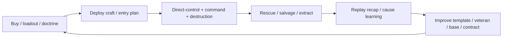

← [[spec/index|spec section]] · [[game/player-loop-and-ux|player loop]] · [[engine/loadout-delivery-economy-lifecycle|loadout/delivery]] · [[spec/mission-director-slice-a|mission director Slice A]] · [[decisions/dr-011-progression-retention-loop|DR-011]] · [[spec/progression-retention|progression]]

# Core Loop

> [!warning] Exploratory requirements
> The loop below is the current design target. It is not final until the actor-feel sandbox, replay recorder, loadout UI, and at least one repeatable contract mission have prototype results.

## Loop Thesis

The future game loop should be:

The player should feel pressure inside the mission and relief/curiosity after the mission. Every loop should answer: "What happened, why did it happen, and what should I try next?"

## Step Contracts

| Step | Player Feels | UI Shows | AI/System Does | Return Hook |
|---|---|---|---|---|
| Choose contract | "I can pick a problem that fits my mood." | Objective, expected length, material profile, required roles, seed, constraints. | Validates path/material/AI feasibility before listing. | Same-seed retry, daily/featured seed, campaign op. |
| Build loadout | "I have a plan and a backup." | Role filters, cost/mass, delivery risk, AI competence, missing counters. | Checks item metadata, bot suitability, package compatibility. | Saved templates and loadout experiments. |
| Deploy | "Entry itself is a tactical choice." | Entry zone, craft risk, abort/retry, terrain preview. | Runs delivery events and initial AI orders. | Cleaner deployments become mastery goals. |
| Fight/command | "I can act now and command the squad." | HUD, squad panel, order overlay, material overlay, major event feed. | Runs physics, terrain, AI, weapons, recorder events. | Emergent stories and skill mastery. |
| Rescue/recover | "Can I save what matters?" | Downed actors, brain safety, extract route, salvage risk. | Persists wounds, deaths, gear, terrain scars, base deltas. | Veterans, salvage, consequences. |
| Replay/recap | "Now I understand the battle." | Timeline, death/loss causes, key breaches, actor fates, retry/edit actions. | Emits stable replay card with seed/package/loadout hashes. | Learning, sharing, personal bests. |
| Improve | "I have a new idea." | Suggested template edits, lab tests, veteran state, next contract options. | Saves horizontal unlocks and campaign state. | The next run starts faster and deeper. |

## Failure Recovery Loops

| Failure | Recovery Path | Why It Matters |
|---|---|---|
| Actor wounded | Rescue, stabilize, swap control, extract, or accept scar. | Keeps veteran stakes from becoming instant punishment. |
| Bot stuck | Command overlay shows blocked path and recovery option. | Converts AI failure into understandable command feedback. |
| Delivery failure | Abort craft, emergency drop, retry route, salvage wreckage. | Makes logistics a story without wasting the session. |
| Objective collapse | Switch to extraction, secondary objective, or same-seed retry. | Keeps losses productive. |
| Loadout missing counter | Recap points to missing role/tool and opens template edit. | Turns failure into loadout learning. |

## Prototype Gates

| Gate | Source |
|---|---|
| Single actor feels good before meta rewards matter. | [[spec/actor-feel-sandbox-slice-a]], [[decisions/dr-004-first-playable-slice]] |
| Recorder can explain at least one major loss cause. | [[spec/replay-recorder-slice-a]], [[decisions/dr-002-replay-event-architecture]] |
| Buy/loadout can express role, mass, cost, delivery risk, and AI competence. | [[spec/equipment-loadout]], [[references/equipment-provenance-workbench-view]] |
| One contract can be replayed with same seed and different loadouts. | [[spec/mission-director-slice-a]], [[spec/progression-retention]], [[decisions/dr-011-progression-retention-loop]] |
| UX wireframes can show HUD, squad, command, buy, replay, and hub surfaces without overlap. | [[spec/ux-wireframes-slice-a]] |

## Mission Contract Bridge

The core loop depends on a contract mission, not a generic arena. [[spec/mission-director-slice-a]] defines the first one: a compact breach mission with a typed manifest, mission capability strip, director pacing, commander reason strings, objective events, and replay/debrief output.

| Core Loop Step | Mission Director Field |
|---|---|
| Choose contract | `mission_id`, scene profile, objective list, material profile, capability requirements, expected length. |
| Build loadout | required/recommended/dangerous/manual-only capability tags linked to equipment role cards. |
| Deploy | LZ candidates, delivery footprint, craft/cargo risk, launch event. |
| Fight/command | objective ids, director phase, commander target/squad decisions, terrain events. |
| Rescue/recover | emergency actions, extraction objective, salvage and veteran outcomes. |
| Replay/recap | mission event families, failure cause, debrief summary, same-seed retry metadata. |

## Inputs

- [[game/player-loop-and-ux]]
- [[engine/loadout-delivery-economy-lifecycle]]
- [[systems/destruction-objective-mission-patterns]]
- [[spec/mission-director-slice-a]]
- [[decisions/dr-004-first-playable-slice]]
- [[decisions/dr-009-command-ux-style]]
- [[decisions/dr-011-progression-retention-loop]]
- [[spec/progression-retention]]
