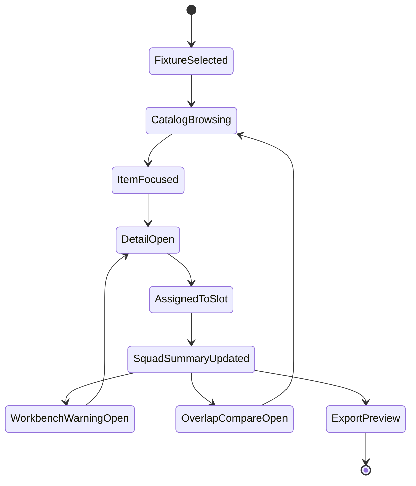

<- [[spec/index|spec section]] · [[spec/prototype-implementation-backlog-slice-a|implementation backlog A5]] · [[spec/equipment-loadout|equipment/loadout]] · [[spec/equipment-role-card-renderer-slice-a|role-card renderer]] · [[spec/ux-wireframes-slice-a|UX wireframes Slice A]] · [[spec/accessibility-comfort-slice-a|accessibility/comfort Slice A]] · [[spec/package-builder-workbench-slice-a|package-builder]] · [[engine/content-module-loading-lifecycle|content/module lifecycle]] · [[references/content-loader-graph-cccp|loader graph]] · [[references/prototype-run-bundle-schema|run-bundle schema]] · [[references/equipment-role-card-renderer-view-slice-a|renderer view]] · [[references/equipment-device-loadout-field-atlas|field atlas]] · [[references/equipment-source-anchored-device-snapshots|source snapshots]] · [[references/equipment-comparable-design-patterns|comparable patterns]] · [[references/equipment-loadout-fixtures-slice-a|LOAD-A fixtures]] · [[references/equipment-capability-authoring-matrix|capability matrix]] · [[references/equipment-ai-behavior-contract|AI behavior contract]] · [[references/equipment-ai-summary-seed-slice-a|AI summary seed]] · [[references/equipment-role-records-slice-a|role records]] · [[references/equipment-consumer-traceability-matrix|consumer traceability]] · [[references/equipment-consumer-traceability-slice-a|generated trace report]] · [[references/equipment-trace-tab-view-slice-a|trace-tab view]] · [[references/equipment-source-trace-slice-a|source trace]] · [[references/equipment-provenance-workbench-view|provenance view]] · [[references/equipment-package-diagnostics-slice-a|package diagnostics]] · [[research-log/2026-05-04-equipment-role-record-contract|role-record contract]]

# Equipment Loadout Workbench Slice A

> [!summary] Purpose
> Define the first interactive equipment/loadout/workbench prototype. This is the concrete UI target for the generated equipment artifacts: catalog rows, item detail drawers, actor slot cards, squad capability summaries, overlap comparison, provenance diagnostics, package-mode warnings, AI/replay reason labels, and the shared role-record projection that keeps every consumer aligned on the same item meaning.

> [!important] Product stance
> The buy/loadout screen is mission planning, not a shop spreadsheet. It must answer: "Can this squad solve the mission, will bots use this gear safely, what breaks if I publish this package, and why does this item deserve to exist?"

> [!note] First prototype evidence
> [[prototypes/actor-feel-lab-a1-load-w-workbench-smoke]] proves a compact LOAD-W panel can render generated workbench counts, nine fixture tabs, and a selected Light Digger trace/source/AI/diagnostic join beside the actor-feel lab. [[prototypes/actor-feel-lab-a1-load-w-fixture-switch-smoke]] proves all nine LOAD-A fixture imports can be generated and a runtime switch from `engineer_breach` to `medic_rescue` can preserve Medikit trace/source/AI joins. [[prototypes/actor-feel-lab-a1-load-w-fixture-tab-input-smoke]] proves actual fixture-tab input can switch runtime fixtures by mouse click and focused-button keyboard activation while preserving trace/source/AI joins. [[prototypes/actor-feel-lab-a1-load-w-fixture-traversal-smoke]] proves fixture controls can be reached by Tab, navigated by ArrowRight, activated with Enter/Space, and restored after render while preserving trace/source/AI joins. These are render/data-routing/input-routing/fixture-control traversal smokes only; full workbench traversal, physical gamepad input, 200% text scale, package editing, AI-H execution, replay/export preview, and final workbench UX remain open.

## Slice A Question

Can a player or designer assemble one small squad from real CCCP-derived item fixtures, immediately see mission capability gaps, bot-risk labels, duplicate-role pressure, and package/workbench fixes, then export enough structured state for AI, replay, balancing, and modding tests?

## Required Inputs

| Input | Source | Prototype Use |
|---|---|---|
| Renderer view model | [[references/equipment-role-card-renderer-view-slice-a]], `cortext_command_vault/references/equipment-role-card-renderer-view.slice-a.json` | Catalog rows, workbench rows, detail drawers, overlap table, fixture summaries, acceptance coverage. |
| Device/loadout field atlas | [[references/equipment-device-loadout-field-atlas]] | Field drill-downs for held-device, firearm, magazine, round, loadout, delivery-role, and durable external schema references; LOAD-FIELD tests. |
| Source-anchored device snapshots | [[references/equipment-source-anchored-device-snapshots]] | Literal values for representative devices/loadouts; source-snapshot tab inputs; LOAD-FIELD-SNAPSHOT and scripted-tool reason-label seeds. |
| Comparable design patterns | [[references/equipment-comparable-design-patterns]] | OpenSoldat feel fields, OpenRA projectile/effect split, Unreal GAS ability/effect state, and Godot/Unity/Factorio authoring/runtime boundaries; LOAD-COMP tests. |
| Content module loading lifecycle | [[engine/content-module-loading-lifecycle]] | Source/provenance drill-downs for module order, include stack, `CopyOf`, source file, zip import, script reload, and package-mode diagnostics. |
| Generated loader graph | [[references/content-loader-graph-cccp]], `cortext_command_vault/references/content-loader-graph-cccp.json` | Module browser fixture, include/source jump targets, duplicate preset pressure, script/path diagnostics, and package/source confidence fields. |
| LOAD-A fixture loadouts | [[references/equipment-loadout-fixtures-slice-a]], `cortext_command_vault/references/equipment-loadout-fixtures.slice-a.json` | Actor columns, slot layout, warning expectations, manual badges, negative loadout checks. |
| Capability authoring matrix | [[references/equipment-capability-authoring-matrix]] | Capability chips, authoring tier, AI claim state, required fields, modding gates, balance risk rubric. |
| AI behavior contract | [[references/equipment-ai-behavior-contract]] | Bot item-choice/refusal labels, "why blocked" panel rows, AI/replay reason events, and bot-claim-state transitions. |
| AI summary seed | [[references/equipment-ai-summary-seed-slice-a]], `cortext_command_vault/references/equipment-ai-summary-seed.slice-a.json` | Bot trust panel rows, why-blocked labels, blackboard/source-confidence drilldowns, replay/export item decision event previews, package bot-default gates, and AI-H/AI-EQ follow-up queues. |
| Generated role records | [[references/equipment-role-records-slice-a]], `cortext_command_vault/references/equipment-role-records.slice-a.json` | LOAD-W-21/22 shared item object: joins role cards, source trace, AI summary, trace-tab rows, package diagnostics, overlap rows, fixture refs, renderer rows, replay/backend events, and mission capability tags. |
| Consumer traceability matrix | [[references/equipment-consumer-traceability-matrix]] | Trace tab, consumer-impact badges, schema deltas, replay/backend event contract, and test obligations for LOAD-W/PACK/AI-H/REC consumers. |
| Generated consumer traceability report | [[references/equipment-consumer-traceability-slice-a]], `cortext_command_vault/references/equipment-consumer-traceability.slice-a.json` | Initial trace tab rows, coverage counters, top AI/package/replay/fixture gaps, and LOAD-011 acceptance proof. |
| Generated trace-tab view | [[references/equipment-trace-tab-view-slice-a]], `cortext_command_vault/references/equipment-trace-tab-view.slice-a.json` | LOAD-W-010 UI-ready rows: item trace rows, fixture tabs, package diagnostic trace rows, gap badges, open targets, and acceptance proof. |
| Generated source trace | [[references/equipment-source-trace-slice-a]], `cortext_command_vault/references/equipment-source-trace.slice-a.json` | LOAD-FIELD-SOURCE UI-ready rows: source state, source confidence, loader context, include parents, duplicate source hits, direct/inherited/inferred/missing fields, trace-tab refs, and open targets. |
| Role-card renderer contract | [[spec/equipment-role-card-renderer-slice-a]] | LOAD-R behavior, visibility policy, detail drawers, overlap requirements, accessibility and navigation tests. |
| Equipment model | [[spec/equipment-loadout]] | Actor role taxonomy, explicit slots, metadata contract, delivery risk model, LOAD-A tests. |
| Implementation-facing role record | [[spec/equipment-loadout#Implementation-Facing Role Record]], [[research-log/2026-05-04-equipment-role-record-contract]] | Consumer-facing item projection for AI, UI, modding/workbench, balance, replay/debug, backend/session, and mission checks; LOAD-W-21/22 parity tests. |
| Provenance view | [[references/equipment-provenance-workbench-view]] | Source/provenance/attention rows for warning drill-downs and package workbench panels. |
| Package diagnostics | [[references/equipment-package-diagnostics-slice-a]] | Dev/local/published/bot-default verdicts, diagnostic codes, required reason labels. |
| AI scenarios | [[references/equipment-ai-scenarios-slice-a]] | AI-H-LOAD scenario links for bot item choice/refusal rows. |
| UX/accessibility wireframes | [[spec/ux-wireframes-slice-a]], [[spec/accessibility-comfort-slice-a]] | Screen hierarchy, keyboard/controller navigation, accessibility/comfort floors, ACC-A evidence, HUD/loadout bridge. |

## Prototype Surfaces

| Surface | Default User | Must Answer | Data Used |
|---|---|---|---|
| Mission requirement strip | Player/designer | What capabilities does this mission need? | Fixture `mission_context`, capability matrix, missing capability warnings. |
| Catalog browser | Player | Which item solves which problem, with what risk? | 63 `catalog_rows`, bot badges, warning badges, overlap badges, stat chips. |
| Item detail drawer | Player/designer | Why should I use this item and what proof backs it? | 5 generated drawer examples plus role-record, role-card, source-trace, and provenance fallbacks. |
| Actor loadout column | Player | What is this actor responsible for and what slots are overloaded? | LOAD-A slots, actor role tags, item rows, mass/cost/bot state. |
| Squad capability summary | Player | What can the squad do or not do? | Fixture summaries: combat, breach, heal, mobility, scout, anti-craft, bot-safe count. |
| Bot trust panel | Player/AI tester | Which items are bot-safe, risky, manual, or blocked, and why? | Role-record AI policy slice, bot badges, package diagnostics, AI scenario reason labels, [[references/equipment-ai-behavior-contract]], [[references/equipment-ai-summary-seed-slice-a]]. |
| Overlap compare panel | Designer/balancer | Which items look like false choices? | 10 overlap rows, overlap worksheet, capability matrix. |
| Workbench diagnostic drawer | Creator | What should I fix before local/published/bot-default use? | Package diagnostics, provenance rows, warning details, source paths, field atlas rows. |
| Trace tab | Designer/tester/agent | Where did this item fact come from, which consumers use it, what proof is missing, and what can I open next? | Role-record slices, generated trace-tab view, source trace, consumer traceability report, package diagnostics, fixtures, renderer rows, [[references/equipment-device-loadout-field-atlas]]. |
| Source inspector | Designer/creator/agent | What exact file/line/module/include path produced this item and what source confidence should downstream consumers trust? | [[references/equipment-source-trace-slice-a]], [[references/content-loader-graph-cccp]], corpus field provenance, role cards. |
| Replay/export preview | Tester | Which events/labels will AI/replay/backend receive? | Role-record replay/backend/session slice, replay contracts, role signatures, item ids, package ids, selected/refused reason labels, AI summary required events, claim-state deltas. |

## Layout Contract

```text
+--------------------------------------------------------------------------------+
| Mission Strip: Bunker breach | Need: combat + breach + support | Missing: heal |
+----------------------+------------------------------+--------------------------+
| Catalog              | Actor Loadout                | Detail / Workbench       |
| Search/filter/tabs   | Coalition Light Soldier      | Selected item drawer     |
| [Assault Rifle]      | Role: Assault                | Best at / Bad at         |
| [Heavy Digger]       | Primary: Assault Rifle       | Bot: Risky, why          |
| [Medikit]            | Secondary: Heavy Pistol      | Warnings, source path    |
| [Grapple Gun]        | Consumable: Frag Grenades    | Compare / fix actions    |
+----------------------+------------------------------+--------------------------+
| Squad Summary: breach 0, heal 0, mobility 0, bot-safe 0, manual 1, risky 2     |
| Overlap: high assault-rifle group | Package: local ok, published needs warnings |
+--------------------------------------------------------------------------------+
```

### Screen Regions

| Region | Required Controls | Required States |
|---|---|---|
| Mission strip | Fixture selector, mission tags, capability requirement chips, negative-fixture toggle. | `candidate`, `negative_fixture`, missing capability warning, no-mission-selected. |
| Catalog browser | Search, faction/package filter, role filter, capability filter, bot-state filter, overlap-risk filter, sort by cost/mass/range/warning count. | Empty search, hidden/internal excluded, designer mode includes hidden/workbench rows. |
| Catalog row | Role icon, name, package, capability chips, cost/mass/range chips, bot badge, warning count, overlap badge. | Focused, selected, assigned, blocked, manual-only, high-overlap. |
| Actor column | Actor role tags, slot groups, assigned item rows, mass/cost subtotal, bot-safe count, missing capability chips. | Empty slot, invalid slot, overloaded, warning present, negative fixture failed/passed. |
| Detail drawer | Role summary, best/bad at, handling, terrain consequence, AI policy, provenance, source, warning drill-down, compare actions. | Catalog item, hidden/internal item, scripted tool, overlap item, package warning item, medium-confidence source item. |
| Squad summary | Capability grid, mission fit verdict, delivery burden, manual/risky/bot-safe totals. | Good enough, missing breach, missing support, bot-unsafe, package-warning. |
| Workbench drawer | Diagnostic codes, severity, source path, first fix action, package-mode verdicts, affected consumers. | Dev-only ok, local warning, published warning, bot-default blocked. |
| Trace tab | Six consumer columns, source path, canonical role fields, package diagnostic rows, AI/replay reason labels, gap badges, open targets. | Covered, needs proof, missing, not applicable, fixture-filtered, warning-filtered, package-mode-filtered. |
| Source inspector | Source state/confidence, module order/layer, include depth, include parents, file stats, duplicate preset hits, source fields, provenance counts, source-driven next actions. | Source linked, source not in loader graph, role-card only, missing source path, duplicate preset review, critical field missing. |
| Export preview | JSONL event preview, replay labels, AI reason labels, package hash/source fields. | Ready, missing label, package warning, scenario link missing. |

## Fixture Routes

| Route | Fixture | Prototype Purpose | Required Visible Outcome |
|---|---|---|---|
| `/loadout/assault-basic` | `assault_basic` | Baseline rifle/sidearm/grenade assignment. | Shows combat/backup/area damage, missing breach/heal/mobility, grenade manual badge, no bot-safe items. |
| `/loadout/engineer-breach` | `engineer_breach` | Terrain tool and breaching role clarity. | Shows breach count 3, constructor review, timed explosive manual badge, missing combat/heal/mobility. |
| `/loadout/medic-rescue` | `medic_rescue` | Support and rescue explanation. | Shows heal count 2, medikit scripted-support warning, support-use replay/AI scenario links. |
| `/loadout/sniper-overwatch` | `sniper_overwatch` | Long-range comparison and sensor role. | Shows two overwatch items, sensor review, target-priority reason labels. |
| `/loadout/grenadier-risky` | `grenadier_risky` | Friendly-fire and explosive risk. | Shows grenade launcher bot-safe seed, manual grenade badges, friendly-fire warning. |
| `/loadout/heavy-craft-killer` | `heavy_craft_killer` | Anti-craft/heavy target-class metadata. | Shows Rocket Launcher/Uber Cannon bot-safe seeds, missile launcher harness caveat, shield warning. |
| `/loadout/scout-salvager` | `scout_salvager` | Scanner, disarmer, mobility, pickup value. | Shows scanner/disarmer/grapple roles, grapple manual badge, missing breach/heal. |
| `/loadout/bad-missing-breach` | `bad_loadout_missing_breach` | Negative mission-fit proof. | Blocks "mission-ready" verdict and names missing breach, terrain tool, and support. |
| `/loadout/bad-bot-unsafe` | `bad_loadout_bot_unsafe` | Negative bot-safety proof. | Blocks bot-default assignment, shows manual-required and friendly-fire guard warnings. |

## Interaction State Machine



| Transition | Required Event |
|---|---|
| `CatalogBrowsing -> ItemFocused` | `loadout.catalog.focused` with `item_id`, `row_id`, `package_id`, `source_kind`. |
| `ItemFocused -> DetailOpen` | `loadout.detail.opened` with `item_id`, `role_signature`, warning ids. |
| `DetailOpen -> AssignedToSlot` | `loadout.item.assigned` with actor id, slot, capability, bot state, manual flag. |
| `AssignedToSlot -> SquadSummaryUpdated` | `loadout.summary.recomputed` with missing capabilities and bot-safe/manual/risky counts. |
| `SquadSummaryUpdated -> WorkbenchWarningOpen` | `workbench.diagnostic.opened` with diagnostic code, package mode, source path. |
| `SquadSummaryUpdated -> OverlapCompareOpen` | `loadout.overlap.compare_opened` with `group_id` and candidate items. |
| `SquadSummaryUpdated -> ExportPreview` | `loadout.export.previewed` with replay labels, AI reason labels, package ids. |

## Required Data Projections

| Projection | Minimum Shape |
|---|---|
| Catalog row | `row_id`, `item_id`, `display_name`, `package_id`, `visibility`, `role.primary_verb`, `role.archetype`, `role.role_tags`, `stat_chips`, `bot_badge`, `warning_badges`, `overlap_badge`, `actions`. |
| Role record | `role_record_id`, `row_id`, `item_id`, `package_id`, `source_path`, `source_confidence`, `identity_provenance`, `handling_slot_pressure`, `action_effect_model`, `projectile_area_shape`, `terrain_material_consequence`, `ai_policy`, `ui_projection`, `balance_overlap`, `replay_backend_session`, `mission_capability`, `warning_ids`, `open_targets`. Generated by [[references/equipment-role-records-slice-a]]. |
| Actor slot row | `actor_id`, `actor_role_tags`, `slot`, `item_id`, `display_name`, `capability`, `slot_role`, `bot_state`, `warnings`, `manual_badge`, `source_fixture_id`. |
| Squad summary | `fixture_id`, `capabilities`, `missing_capabilities`, `bot_safe_items`, `risky_items`, `manual_or_hidden_items`, `expected_warnings`, `expected_manual_badges`, `tests`. |
| Workbench diagnostic | `diagnostic_code`, `severity`, `consumer`, `source_path`, `field_provenance`, `first_fix_action`, `package_mode_verdicts`, `bot_assignment_verdict`. |
| Trace tab row | `trace_row_id`, `item_id`, `source_path`, `role`, `severity`, `consumer_columns`, `diagnostic_codes`, `consumer_impacts`, `fixture_refs`, `scenario_refs`, `overlap_refs`, `reason_labels`, `event_tags`, `open_targets`, `next_actions`. |
| Source trace row | `row_id`, `item_id`, `source_state`, `confidence`, `source_path`, `loader_context`, `provenance_summary`, `source_fields`, `trace_tab_refs`, `open_targets`, `warning_ids`, `next_actions`. |
| AI summary row | `row_id`, `item_id`, `claim_state`, `decision_intents`, `decision_inputs`, `blackboard_keys`, `required_reason_labels`, `required_events`, `scenario_refs`, `source_trace`, `first_fix_actions`. |
| Trace fixture tab | `fixture_id`, `trace_row_ids`, `consumer_state_counts`, `diagnostic_trace_row_ids`, `package_mode_verdicts`, `bot_assignment_verdict`, `missing_capabilities`, `tests`, `open_targets`. |
| Overlap compare row | `group_id`, `risk`, `role_signature`, `items`, `item_count`, `recommended_action`, `renderer_actions`, `worksheet_status`. |
| Export preview row | `event_name`, `item_id`, `package_id`, `role_signature`, `primary_verb`, `selected_or_refused_reason`, `source_fixture_id`, `replay_relevance`. |
| Bot block row | `item_id`, `bot_claim_state`, `claim_state`, `refusal_label`, `required_reason_label`, `source_confidence`, `source_field`, `missing_field`, `first_fix_action`, `scenario_ref`, `package_mode_verdict`. |

## Role Record Projection Contract

The workbench must not let catalog, AI, package, replay, and mission panels invent separate item meanings. Each selected item gets one `role_record`; every panel renders a slice of that record and may add local UI state, but it cannot silently fork source confidence, bot policy, terrain consequence, or replay labels.

| Role Record Slice | Primary Workbench Surface | Acceptance Requirement |
|---|---|---|
| Identity/provenance | Detail drawer, source inspector, trace tab. | Shows stable `item_id`, `package_id`, display name, source path, source state, source confidence, and warning ids before any consumer-specific interpretation. |
| Handling/slot pressure | Catalog row, actor loadout column, HUD preview. | One-arm/two-arm/support/shield/dual-wield/pickup/bulk constraints produce the same slot warning and same role-card badge everywhere. |
| Action/effect model | Detail drawer, bot trust panel, export preview. | Fire, dig, fill, heal, grapple, scan, shield, construct, and scripted-support verbs map to the same target rules, cooldown/ammo pressure, and failure labels. |
| Projectile/area shape | Bot trust panel, danger overlay, replay/export preview. | Range band, spread, blast radius, target class, inherited velocity, tracer/no-tracer state, and friendly-fire risk feed the same bot refusal and replay reason labels. |
| Terrain/material consequence | Mission strip, material overlay, source inspector. | Dig/fill/breach/repair/foam/concrete/grapple-anchor effects expose material fit, route/path invalidation, dirty region, and mission-capability impact. |
| AI policy | Bot trust panel, AI harness link, package diagnostics. | Claim state, blackboard keys, required reason labels, required events, source confidence, and first fix action match the AI summary seed. |
| UI projection | Catalog browser, detail drawer, actor slot. | Best-at, bad-at, role chips, stat chips, warning copy, and manual/bot-safe/risky labels share one text source where practical. |
| Balance/overlap | Overlap compare panel, balancing export. | Overlap group, false-choice risk, differentiator, recommended action, and fixture coverage appear before the item can be treated as balanced. |
| Replay/backend/session | Replay/export preview, package workbench, service hub checks. | Event families, package hash/source fields, loadout snapshot, selected/refused labels, and compatibility warnings are visible before export. |
| Mission capability | Mission requirement strip, squad summary, fixture tabs. | Required/recommended/missing capability chips are computed from the same role record used by AI and balance surfaces. |

## LOAD-W-010 Trace Tab Contract

LOAD-W-010 is backed by [[references/equipment-trace-tab-view-slice-a]] and must be treated as a first-class workbench surface, not a hidden debug dump.

The trace tab sits beside the generated [[references/equipment-ai-summary-seed-slice-a|AI summary seed]]. The trace tab answers "where did this fact come from and who consumes it"; the AI summary seed answers "what does a bot need to know before selecting, refusing, or reporting this item?"

| Requirement | Why |
|---|---|
| Every item trace row has UI, AI, workbench/package, balance, replay/backend, and fixture/test columns. | Agents and designers can see which consumers are covered, partial, missing, or not applicable without reading raw JSON. |
| Every warning or gap has a text label, status token, and first follow-up action. | The trace tab remains navigable at 200% text scale and does not rely on color-only state. |
| Every row exposes open targets. | The workbench can jump to catalog row, detail drawer, source path, package diagnostic, fixture tab, AI scenario, overlap compare, or replay/export preview. |
| Fixture tabs aggregate trace rows and diagnostics. | A mission/loadout route can show why a squad passes or fails AI, package, replay, balance, and capability gates. |
| Partial and missing rows are allowed in private prototypes. | Exploration stays unblocked, while published package and bot-default claims remain gated by diagnostics and harness evidence. |

## UX Rules

| Rule | Reason |
|---|---|
| The first screen is the workbench, not an explainer page. | Users need to inspect and assign items immediately. |
| Warnings are action-linked. | A warning badge must open the workbench drawer with a first fix action. |
| Manual-only is not a failure. | Personal/player use is allowed; only bot-default and published claims need stronger gates. |
| Negative fixtures are first-class. | The UI must prove it can say "this loadout cannot solve the mission" before real balancing begins. |
| Designer mode unlocks hidden/internal rows. | The player catalog stays clean while workbench/replay/package tools can inspect everything. |
| Role icons are backed by text labels. | Accessibility and AI/debug clarity are more important than compact style. |
| Compare mode must change a decision. | If the overlap panel cannot suggest role split, skin/legacy, mission fixture, or catalog decision, it is decorative noise. |
| Export preview is visible early. | Replay, AI, backend, and package compatibility should not be added after UX hardens. |

## Acceptance Tests

| ID | Test | Pass Condition |
|---|---|---|
| LOAD-W-01 | Fixture selector | All nine LOAD-A fixtures are selectable by stable fixture id and show purpose, mission context, actor candidate, and tests. |
| LOAD-W-02 | Catalog load | Prototype loads 63 unique player-catalog rows from the generated renderer view and does not show hidden/internal rows in player mode. |
| LOAD-W-03 | Designer mode | Designer/workbench mode can show 106 workbench rows, including hidden/internal/payload rows with source path and visibility status. |
| LOAD-W-04 | Detail drawer | Assault Rifle, Grapple Gun, Medikit, Rocket Launcher, and Concrete Sprayer all open detail drawers with role, bot, warning, provenance, and source sections. |
| LOAD-W-05 | Assignment | Assigning an item updates actor slot state, cost/mass subtotal, bot state, manual badge, and squad summary without reloading the page. |
| LOAD-W-06 | Mission-fit warnings | `bad_loadout_missing_breach` shows missing breach, terrain tool, and support warnings and blocks "mission ready." |
| LOAD-W-07 | Bot-default gate | `bad_loadout_bot_unsafe` blocks bot-default assignment and shows manual-required/friendly-fire guard diagnostics. |
| LOAD-W-08 | Capability summary | Every fixture displays combat, breach, heal, mobility, scout/sensor, anti-craft, bot-safe, risky, and manual counts, even when the count is zero. |
| LOAD-W-09 | Workbench diagnostic | Clicking a warning badge opens diagnostic code, severity, source path, field provenance, first fix action, package-mode verdict, and affected consumers. |
| LOAD-W-10 | Overlap compare | High-risk assault rifle and sidearm groups are reachable from catalog rows and show candidate differentiators from the worksheet. |
| LOAD-W-11 | AI reason labels | Bot-risk rows expose reason labels such as friendly-fire risk, target out of range, wrong tool, no anchor, or bot grapple unsupported. |
| LOAD-W-12 | Replay/export preview | Export preview includes item id, package id, role signature, primary verb, selected/refused reason label, and source fixture id. |
| LOAD-W-13 | Keyboard/controller nav | Fixture selector, filters, catalog rows, actor slots, detail drawer, warnings, overlap compare, and export preview are reachable without mouse-only interactions. Current evidence: [[prototypes/actor-feel-lab-a1-load-w-fixture-tab-input-smoke]] covers fixture-tab mouse click plus focused-button keyboard activation; [[prototypes/actor-feel-lab-a1-load-w-fixture-traversal-smoke]] covers Tab-to-fixture focus, ArrowRight focus movement, Enter/Space activation, and focus restore for fixture controls. Full workbench traversal and physical gamepad input remain open. |
| LOAD-W-14 | 200% text scale | Labels, warnings, buttons, actor slots, and diagnostic drawers do not overlap or truncate critical text at 200% text scale. |
| LOAD-W-15 | Color independence | Bot state, warning severity, overlap risk, and manual-only status are communicated by text/icon plus color, not color alone. |
| LOAD-W-16 | Same data across consumers | Catalog row, actor slot, workbench diagnostic, AI label, replay/export preview, and package verdict for the same item share the same `item_id` and warning ids. |
| LOAD-W-17 | Trace tab render | The UI can render all 106 item trace rows, 9 fixture tabs, 39 diagnostic trace rows, and 80 gap badges from [[references/equipment-trace-tab-view-slice-a]] without inventing extra item meanings. |
| LOAD-W-18 | Source inspector render | The UI can render all 106 source-trace rows from [[references/equipment-source-trace-slice-a]], including source confidence, source open target, loader module target, role-card target, trace-tab refs, and source-driven next actions. |
| LOAD-W-19 | AI summary seed render | Bot trust panel can render all 106 AI summary seed rows and every row exposes claim state, reason labels, required events, source confidence, and first fix actions. |
| LOAD-W-20 | AI reason/export parity | Bot trust panel and replay/export preview use the same reason labels and event families from [[references/equipment-ai-summary-seed-slice-a]]. |
| LOAD-W-21 | Role-record projection parity | Catalog row, detail drawer, actor slot, trace tab, source inspector, bot trust panel, overlap compare, replay/export preview, package diagnostics, and mission strip read the same role record for a selected item and preserve `item_id`, `package_id`, source confidence, warning ids, role tags, bot policy, and replay labels. |
| LOAD-W-22 | Role-record source confidence | Medium/low confidence role slices show source confidence and a next action before AI, balance, backend/session, or package panels treat the item as settled. |
| LOAD-FIELD-01 | Field drill-down | Selecting a fixture item shows source path, CCCP field, normalized field, direct/inherited/inferred/manual status, consumers, and first fix action from [[references/equipment-device-loadout-field-atlas]]. |
| LOAD-FIELD-02 | Legacy loadout conversion | Importing a legacy ordered `AddCargoItem` list renders explicit actor slots, preserves original order as provenance, and warns about ambiguous ownership. |
| LOAD-FIELD-03 | AI reason source | Bot item-choice/refusal labels cite actual normalized fields such as `danger_radius`, `support_required`, `material_fit`, `range_band`, `ammo_pressure`, or `bot_unproven`. |
| LOAD-FIELD-SNAPSHOT-01 | Source snapshot tab | Selecting a representative item shows literal CCCP values, source path/range, normalized field, consumer impact, and open gaps from [[references/equipment-source-anchored-device-snapshots]]. |
| LOAD-FIELD-SNAPSHOT-02 | Legacy source-order explanation | Importing a legacy loadout shows the original ordered `AddCargoItem` list beside the converted actor-slot result and ambiguity warnings. |

## Implementation Tickets

| Ticket | Output | Depends On |
|---|---|---|
| LOAD-W-001 | Prototype data loader for renderer view, fixtures, diagnostics, and AI scenarios. | [[references/equipment-role-card-renderer-view-slice-a]], [[references/equipment-loadout-fixtures-slice-a]] |
| LOAD-W-002 | Fixture selector and mission strip. | LOAD-W-001 |
| LOAD-W-003 | Catalog browser with player/designer visibility modes and filters. | LOAD-W-001 |
| LOAD-W-004 | Item detail drawer and warning drill-down. | [[references/equipment-provenance-workbench-view]], [[references/equipment-package-diagnostics-slice-a]] |
| LOAD-W-005 | Actor column assignment and squad capability summary. | [[spec/equipment-loadout]], [[references/equipment-loadout-fixtures-slice-a]] |
| LOAD-W-006 | Bot trust panel and AI scenario links. | [[references/equipment-ai-scenarios-slice-a]], [[spec/ai-trust-harness-slice-a]] |
| LOAD-W-007 | Overlap compare panel. | [[references/equipment-overlap-audit-slice-a]], [[references/equipment-overlap-resolution-worksheet-slice-a]] |
| LOAD-W-008 | Replay/export preview. | [[spec/replay-recorder-slice-a]], [[spec/equipment-role-card-renderer-slice-a]] |
| LOAD-W-009 | Accessibility/keyboard/controller pass. | [[spec/ux-wireframes-slice-a]], [[spec/accessibility-comfort-slice-a]] |
| LOAD-W-010 | Trace tab: source field -> canonical field -> UI row -> AI label -> package diagnostic -> replay/backend event. | [[references/equipment-consumer-traceability-matrix]], [[references/equipment-consumer-traceability-slice-a]], [[references/equipment-trace-tab-view-slice-a]] |
| LOAD-W-011 | Field atlas/source-snapshot drill-down and legacy loadout import preview. | [[references/equipment-device-loadout-field-atlas]], [[references/equipment-source-anchored-device-snapshots]], [[references/equipment-cccp-field-map]] |
| LOAD-W-012 | Source inspector: source path -> loader graph -> role card -> trace tab refs -> source confidence -> next actions. | [[references/equipment-source-trace-slice-a]], [[references/content-loader-graph-cccp]], [[references/equipment-role-cards-slice-a]], [[references/equipment-trace-tab-view-slice-a]] |
| LOAD-W-013 | AI summary seed panel and export join. | [[references/equipment-ai-summary-seed-slice-a]], [[references/equipment-ai-behavior-contract]], [[references/equipment-trace-tab-view-slice-a]], [[spec/replay-recorder-slice-a]] |
| LOAD-W-014 | Role-record projection assembler/view that joins role cards, source trace, AI summary, diagnostics, overlap rows, fixture refs, replay/export labels, and mission capability into one consumer-facing item object. | [[references/equipment-role-records-slice-a]], [[spec/equipment-loadout#Implementation-Facing Role Record]], [[references/equipment-role-cards-slice-a]], [[references/equipment-source-trace-slice-a]], [[references/equipment-ai-summary-seed-slice-a]], [[references/equipment-package-diagnostics-slice-a]], [[research-log/2026-05-04-equipment-role-record-contract]] |

## Non-Goals

| Not In Slice A | Reason |
|---|---|
| Final art direction. | The first prototype validates information architecture and data contracts. |
| Final balance. | Fixture data is candidate data, not authoritative balance. |
| Real mission economy. | Cost/mass are shown, but campaign economy is handled by [[spec/progression-retention]]. |
| Full package editor. | This prototype opens diagnostics; package build execution belongs to [[spec/package-builder-workbench-slice-a]]. |
| Bot behavior implementation. | This prototype exposes AI labels and scenario links; the runner belongs to [[spec/ai-trust-harness-slice-a]]. |

## Source Trail

- [[references/equipment-role-card-renderer-view-slice-a]]
- `cortext_command_vault/references/equipment-role-card-renderer-view.slice-a.json`
- [[references/equipment-loadout-fixtures-slice-a]]
- `cortext_command_vault/references/equipment-loadout-fixtures.slice-a.json`
- [[references/equipment-capability-authoring-matrix]]
- [[references/equipment-consumer-traceability-matrix]]
- [[references/equipment-consumer-traceability-slice-a]]
- `cortext_command_vault/references/equipment-consumer-traceability.slice-a.json`
- [[references/equipment-trace-tab-view-slice-a]]
- `cortext_command_vault/references/equipment-trace-tab-view.slice-a.json`
- [[references/equipment-source-trace-slice-a]]
- `cortext_command_vault/references/equipment-source-trace.slice-a.json`
- [[references/equipment-provenance-workbench-view]]
- [[references/equipment-package-diagnostics-slice-a]]
- [[references/equipment-ai-scenarios-slice-a]]
- [[references/equipment-ai-summary-seed-slice-a]]
- `cortext_command_vault/references/equipment-ai-summary-seed.slice-a.json`
- [[references/equipment-role-records-slice-a]]
- `cortext_command_vault/references/equipment-role-records.slice-a.json`
- [[spec/equipment-role-card-renderer-slice-a]]
- [[spec/equipment-loadout]]
- [[research-log/2026-05-04-equipment-role-record-contract]]
- [[spec/ux-wireframes-slice-a]]
- [[spec/accessibility-comfort-slice-a]]

## Change Log

- 2026-05-04: Created the first interactive equipment/loadout/workbench prototype requirements page after the capability matrix pass.
- 2026-05-04: Linked [[references/equipment-consumer-traceability-matrix]] and added LOAD-W-010 for a trace tab that proves fields reach every intended consumer.
- 2026-05-04: Added generated [[references/equipment-consumer-traceability-slice-a]] as LOAD-W-010's first data source for trace rows, consumer states, and gap badges.
- 2026-05-04: Added generated [[references/equipment-trace-tab-view-slice-a]] as the LOAD-W-010 UI-ready view model and added LOAD-W-17 for trace-tab rendering.
- 2026-05-04: Added generated [[references/equipment-ai-summary-seed-slice-a]] as the bot-facing item-use seed for LOAD-W-19/20, bot trust panels, replay/export parity, and package bot-default gates.
- 2026-05-04: Linked [[references/equipment-device-loadout-field-atlas]] and added LOAD-FIELD tests plus a field-atlas drill-down ticket for exact CCCP device/loadout fields.
- 2026-05-04: Added generated [[references/equipment-source-trace-slice-a]] as the LOAD-FIELD-SOURCE/source-inspector input and added LOAD-W-18 plus LOAD-W-012.
- 2026-05-04: Linked [[references/equipment-source-anchored-device-snapshots]] and added source-snapshot tab tests so fixture details can show literal CCCP values beside normalized fields and consumer impacts.
- 2026-05-04: Added [[prototypes/actor-feel-lab-a1-load-w-fixture-tab-input-smoke]] and [[research-log/2026-05-04-a1-load-w-fixture-tab-input-smoke]] so fixture-tab mouse click and focused-button keyboard activation have checked browser input evidence before full accessibility/controller passes.
- 2026-05-04: Added the implementation-facing role-record projection contract, LOAD-W-21/22 parity/source-confidence tests, and LOAD-W-014 so the workbench renders one shared item meaning across AI, UI, modding/workbench, balance, replay/backend, and mission consumers.
- 2026-05-04: Added generated [[references/equipment-role-records-slice-a]] and role-record browser seed/prototype evidence so LOAD-W-21/22 are backed by data and smoke tests, not only prose.
