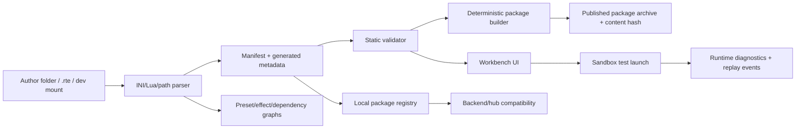

← [[spec/index|spec section]] · [[spec/modding-model|modding model]] · [[systems/modding-package-and-workbench|modding workbench]] · [[engine/content-module-loading-lifecycle|content/module lifecycle]] · [[references/content-loader-graph-cccp|generated loader graph]] · [[references/equipment-source-trace-slice-a|equipment source trace]] · [[repos/cccp-vscode-extension|CCCP VS Code extension]] · [[repos/legacy-mod-converter|legacy converter]] · [[comparables/opensoldat-satellites-local-audit|OpenSoldat satellites]] · [[spec/backend-service-hub-slice-a|backend service/hub Slice A]] · [[spec/ux-wireframes-slice-a|UX wireframes Slice A]] · [[spec/equipment-role-card-renderer-slice-a|role-card renderer Slice A]] · [[spec/equipment-loadout-workbench-slice-a|equipment loadout workbench]] · [[references/equipment-device-loadout-field-atlas|equipment field atlas]] · [[references/equipment-role-card-renderer-view-slice-a|equipment renderer view]] · [[references/equipment-ai-behavior-contract|equipment AI behavior]] · [[references/equipment-ai-summary-seed-slice-a|equipment AI summary seed]] · [[references/equipment-consumer-traceability-matrix|equipment traceability]] · [[references/equipment-consumer-traceability-slice-a|equipment trace report]] · [[references/equipment-overlay-merged-preview|equipment merged preview]] · [[references/equipment-role-cards-slice-a|equipment role cards]] · [[references/equipment-overlap-audit-slice-a|equipment overlap audit]] · [[references/equipment-overlap-resolution-worksheet-slice-a|equipment overlap worksheet]] · [[references/equipment-package-diagnostics-slice-a|equipment diagnostics]]

# Package Builder And Workbench Slice A

> [!summary] Purpose
> Turn the current modding research into a buildable first creator-tool slice: deterministic package output, manifest/provenance validation, source-position diagnostics, dev-mount vs published package modes, migration preview, and a quick test-launch loop. This is the modding/tooling counterpart to [[spec/backend-service-hub-slice-a]].

> [!tip] UX companion
> The workbench, package diagnostics, graph views, migration preview, and test-launch loop are translated into screen requirements in [[spec/ux-wireframes-slice-a]]. Loader graph evidence is generated in [[references/content-loader-graph-cccp]], and equipment source-position confidence is generated in [[references/equipment-source-trace-slice-a]]. Equipment-specific diagnostics are seeded in [[references/equipment-overlay-review-matrix]], with first test fixtures in [[references/equipment-loadout-fixtures-slice-a]], manual suppress/classify patches in [[references/equipment-manual-overlay-patches]], a patch-applied preview in [[references/equipment-overlay-merged-preview]], generated role-card and overlap inputs in [[references/equipment-role-cards-slice-a]] and [[references/equipment-overlap-audit-slice-a]], overlap resolution statuses in [[references/equipment-overlap-resolution-worksheet-slice-a]], exact source field rules in [[references/equipment-device-loadout-field-atlas]], renderer/drill-down fixture data in [[references/equipment-role-card-renderer-view-slice-a]], renderer requirements in [[spec/equipment-role-card-renderer-slice-a]], interactive LOAD-W requirements in [[spec/equipment-loadout-workbench-slice-a]], bot item-choice/refusal labels in [[references/equipment-ai-behavior-contract]], generated bot item-use seed rows in [[references/equipment-ai-summary-seed-slice-a]], consumer-impact traceability in [[references/equipment-consumer-traceability-matrix]] and [[references/equipment-consumer-traceability-slice-a]], and expected package-builder output in [[references/equipment-package-diagnostics-slice-a]].

> [!important] Posture
> Private copying/adapting is allowed. The workbench should make reuse **fast and visible**, not blocked. Provenance and license fields exist so future public-release cleanup is possible, not because early experiments need legal friction.

## Why This Slice Exists

Cortex Command survived because of creator content, but `.rte` modding is brittle: path references, `CopyOf` inheritance, load order, Lua scripts, materials, sounds, sprites, faction files, and activities can fail late and opaquely. The future game needs creator tooling as a product feature, not a post-launch plugin.

| Need | Why It Matters |
|---|---|
| Deterministic packages | Server compatibility, replays, support reports, mod sync, and bug repro all depend on stable hashes. |
| Dev mounts | Creators need edit/run speed without rebuilding archives every change. |
| Published package mode | Servers/replays need immutable package manifests and content hashes. |
| Provenance scanner | Private reuse should be easy; public-release cleanup should not require archaeology. |
| Source diagnostics | Bad paths, bad capitalization, parse errors, missing presets, unsafe scripts, and migration failures need file/line/column positions. |
| Preset/effect graphs | Designers need to see `CopyOf` inheritance and projectile/effect chains before running the game. |
| Migration preview | Rule-driven legacy conversion must show diffs and validation results before writing files. |

## Evidence Stack

### Local Cortex / CCCP Evidence

| Evidence | Local Path | Lesson |
|---|---|---|
| Base module entry point | `Cortex-Command-Community-Project/Data/Base.rte/Index.ini:1-19` | `.rte` modules are load-order graphs of `IncludeFile`, `ScriptPath`, materials, devices, actors, craft, AI, scenes, activities, and global scripts. |
| Preset loader owns module lifecycle | `Cortex-Command-Community-Project/Source/Managers/PresetMan.h:52-67`, `PresetMan.cpp:70-167`, [[engine/content-module-loading-lifecycle]] | Package validation should model the engine's real load order, official-vs-mod modules, and user-data modules. |
| Content lifecycle trace covers the full loader contract: zip import, official module order, sorted `Mods/*.rte`, userdata modules, `MergedIndex.ini`, module metadata, include stack, `CopyOf`, preset collisions/source paths, scan-folder mode, and script reload. | [[engine/content-module-loading-lifecycle]] | PACK-A needs engine-loader parity before package hashes, equipment field provenance, AI item claims, replay compatibility, or backend/server eligibility can be trusted. |
| Generated loader graph captures the active checkout: 10 official modules, 508 unique INI files, 498 include edges, 3064 top-level preset blocks, 48085 `CopyOf` refs, 458 script paths, no missing includes, no wrong-case include/script paths, and 5 duplicate same-module preset keys. | [[references/content-loader-graph-cccp]], `research_tools/content_loader_graph.py` | PACK-A now has a concrete JSON fixture for the first module browser, source-position diagnostics, duplicate-pressure view, and package-mode verdict prototyping. |
| Generated equipment source trace joins role cards to loader graph context: 106 rows, 106 source-linked, 508 loader files available, 2 duplicate-source rows, and 76 rows with critical missing fields. | [[references/equipment-source-trace-slice-a]], `research_tools/equipment_source_trace.py` | PACK-014C can promote source confidence, duplicate-source pressure, and direct/inherited/inferred/missing field counts into package-builder diagnostics instead of treating all role-card facts as equally trustworthy. |
| Reader supports `IncludeFile` stack | `Cortex-Command-Community-Project/Source/System/Reader.h:262-270` | Diagnostics must resolve nested include context, not just report the final file. |
| Preset lookup can cross modules | `Cortex-Command-Community-Project/Source/Managers/PresetMan.cpp:310-376` | `CopyOf`/preset resolution needs a graph and conflict report. |
| Lua exposes broad engine access | `Cortex-Command-Community-Project/Source/Managers/LuaMan.cpp:80-102`, `:126-215` | Script capability tiers are mandatory for replay/network/server trust later. |
| Base scripts show global behavior hooks | `Cortex-Command-Community-Project/Data/Base.rte/Scripts/GlobalScripts.ini` | Workbench needs runtime/script validation, not only static INI checks. |

### Existing Tooling Evidence

| Evidence | Local Path | Lesson |
|---|---|---|
| VS Code extension features | `Cortex-Command-Community-Project-VSCode-Extension/README.md:5-23` | Syntax highlighting, snippets, module underlines, and file-path validation already prove the value of LSP-like tooling. |
| Tree-sitter grammar | `.../packages/tree-sitter-ccini/grammar.js:24-132` | We have a parser foundation for modules, settings, include files, class definitions, module paths, and known file extensions. |
| File-path diagnostics | `.../packages/server/src/validations/validateFilePath.ts:10-74`, `:82-99` | Workbench should reuse/expand source-position diagnostics and sprite-frame path fallback checks. |
| Workspace file indexing | `.../packages/server/src/services/fs.service.ts:20-39`, `:54-73` | Current tools index `Data` and `Mods`; future workbench needs package registry + dev mounts. |
| On-change validation | `.../packages/server/src/extension.ts:120-146` | Workbench should validate on file changes, not only on publish. |
| Snippets | `.../packages/syntaxes/src/snippets.jsonc:16-85` | Authoring templates are part of the UX. |
| Legacy converter rule model | `Cortex-Command-Legacy-Mod-Converter/README.md:16-30` | Migrations should be explicit rules, reviewable, and extensible. |
| Converter UI and diagnostics | `Cortex-Command-Legacy-Mod-Converter/src/main.zig:126-204` | Conversion should return user-facing diagnostics with file/line/column when possible. |

### Comparable Evidence

| Evidence | Vault Note | Lesson |
|---|---|---|
| OpenSoldat deterministic `soldat.smod` and `sv_pure` SHA1 | [[comparables/opensoldat-satellites-local-audit]] | Package hashes are runtime compatibility data. |
| OpenSoldat launcher distinguishes `.smod`, `.sint`, directories, and local mount mode | [[comparables/opensoldat-satellites-local-audit]] | Separate dev mounts, published archives, UI skins, content mods, and demos/replays. |
| Powder Toy Lua, save/stamp, snapshot/delta, community-save flow | [[comparables/the-powder-toy-local-audit]] | Workbench should include stamps, undo/delta thinking, Lua categories, and uploadable/shareable metadata. |
| OpenLieroX projectile action chains and Gusanos Lua | [[comparables/openlierox-local-audit]] | Effect graphs and loop/budget validation are needed for combinatorial weapons. |

### External Standards / Service Lessons

| Source | Lesson To Keep |
|---|---|
| JSON Schema official specification | Use schema validation for manifests and generated metadata if the implementation stack favors JSON. |
| SPDX License List | Store license identifiers and expressions in standard form where possible. |
| OCI Image Layout / Image Spec | Content-addressable layout, descriptors, manifests, and blobs are useful patterns for package storage; do not copy container complexity blindly. |
| Language Server Protocol specification | Diagnostics, document sync, completion, rename, and code actions are proven editor integration patterns. |
| mod.io REST API documentation | Mod ecosystems need dependencies, metadata, tags, files, moderation, and install flow; dependencies must be handled carefully, not blindly auto-installed. |

## Non-Goals For Slice A

| Non-Goal | Why |
|---|---|
| Full visual node editor | Start with generated graph views and warnings; editing nodes can come later. |
| Marketplace upload | Local package output and metadata first; publishing integration comes after validation is useful. |
| Public legal compliance automation | Provenance scanner helps; final licensing decisions happen before public release. |
| Complete Lua debugger | Static capability analysis + runtime errors + test-launch logs first. |
| Full asset editor | Preview sprites/sounds/materials; authoring art/audio happens in external tools for now. |
| Multiplayer anti-cheat | Export capability/trust fields now; enforcement waits for DR-005 evidence. |

## Slice A Architecture

| Component | Slice A Responsibility |
|---|---|
| Parser | Parse module graph, includes, class definitions, assignments, module paths, scripts, and asset references. Mirror [[engine/content-module-loading-lifecycle]] for load order, include stack, `CopyOf`, source paths, and script entry points. |
| Manifest generator | Produce or update `manifest.toml` / `manifest.json` from `.rte` structure plus explicit author fields. |
| Static validator | Validate schema, paths, capitalization, allowed extensions, `CopyOf`, include order, duplicate presets, dependencies, provenance, and package mode. |
| Graph builder | Generate preset inheritance graph, package dependency graph, and first effect-chain graph for weapons/projectiles/scripts. |
| Deterministic builder | Produce byte-stable package output and content manifest hash from the author folder. |
| Local registry | Store installed packages, dev mounts, package hashes, trust tier, capabilities, provenance summary, and build status. |
| Workbench UI | Show project tree, diagnostics, graph views, provenance table, build panel, migration preview, and test-launch controls. |
| Test-launch adapter | Launch a sandbox scenario with selected package set and capture runtime diagnostics/replay events. |

## Package Modes

| Mode | Purpose | Mutable | Hash Use |
|---|---|---|---|
| `dev_mount` | Fast local iteration from a directory. | Yes | Hash shown as "dirty/dev"; not valid for public server purity. |
| `local_package` | Deterministic archive built locally for testing. | No | Can be used for replays/local co-op compatibility. |
| `published_package` | Signed/registry-ready package. | No | Required for public server rows, dependency resolution, and support reports. |
| `legacy_rte` | Imported old `.rte` module. | Yes during migration | Must produce warnings until manifest/provenance/package output exists. |
| `ui_skin` | Interface/cosmetic package. | No when published | Separate compatibility tier from gameplay scripts/content. |
| `scenario_pack` | Scenes, activities, bunkers, challenge seeds. | No when published | Replay and leaderboard compatibility depends on this. |

## Manifest Shape

Slice A can use TOML for author editing and JSON for generated machine output. Required fields:

| Field | Required | Notes |
|---|---|---|
| `id` | Yes | Reverse-DNS or namespace-safe id. |
| `display_name` | Yes | Human-readable. |
| `version` | Yes | Semver. |
| `package_type` | Yes | `gameplay_mod`, `scenario_pack`, `ui_skin`, `total_conversion`, `toolkit`, `dev_only`. |
| `engine_range` | Yes | Compatible engine/spec version range. |
| `schema_version` | Yes | Manifest schema version. |
| `authors` | Yes | Names/handles. |
| `license` | Yes | SPDX expression where possible; `custom` allowed with file reference. |
| `provenance_policy` | Yes | `private_unverified`, `known_sources`, `release_ready`, etc. |
| `dependencies` | No | `id`, version range, required/optional, source registry. |
| `entry_points` | No | Includes, scripts, activities, global scripts, editor extensions. |
| `assets` | Generated | File path, type, size, hash, source/provenance status. |
| `presets` | Generated | Class, `PresetName`, module, source file, line, groups, dependencies. |
| `capabilities` | Generated + explicit | Lua filesystem, network, terrain mutation, entity spawn, UI extension, backend calls, unsafe/native. |
| `compatibility` | Generated + explicit | Replay schema, network safety, AI-readable tags, server-pure eligibility. |
| `content_hash` | Generated | Hash of canonical manifest + package blobs. |
| `build` | Generated | Builder version, timestamp policy, source dirty flag, warnings. |

## Deterministic Build Rules

| Rule | Reason |
|---|---|
| Sort file paths by canonical package path. | Stable archive order. |
| Normalize archive metadata: timestamp, permissions, owner/group, host OS, compression settings. | Prevent OS-dependent package hashes. |
| Hash file bytes before packaging and store per-file digests. | Helps repair, diff, provenance, and support reports. |
| Do not silently normalize source file contents. | Line endings/case/content changes should be explicit migrations, not hidden builder behavior. |
| Reject duplicate canonical paths after case-folding. | Prevents Windows/macOS/Linux mismatch bugs. |
| Fail package build on unresolved `IncludeFile`, bad path, duplicate preset conflict, or missing required provenance. | Published packages must be trustworthy. |
| Allow dev-mount warnings for private prototyping. | Research speed matters; only published/server-pure mode needs strict gates. |
| Generate a content manifest before archive write and verify after archive write. | Catches builder nondeterminism. |
| Build twice in validation and compare hashes. | Minimum reproducibility proof. |

## Validation Matrix

| Check | Dev Mount | Local Package | Published Package |
|---|---|---|---|
| Manifest parse/schema | Warning allowed if generated | Required | Required |
| File path existence/case | Error for active content | Error | Error |
| Allowed extensions | Warning | Error unless ignored | Error |
| Include graph | Error on cycles/missing includes | Error | Error |
| Engine loader parity | Warning until first test launch | Required | Required |
| `CopyOf` / preset resolution | Warning for unresolved legacy imports | Error | Error |
| Duplicate preset conflict | Warning with winner shown | Error unless explicit `replaces` | Error unless explicit `replaces` |
| Lua syntax | Error | Error | Error |
| Lua capability declaration | Warning | Error for server-pure | Error |
| Provenance per file | Warning | Warning | Error |
| License expression | Warning | Warning | Error |
| Package hash reproducible | Not applicable | Required | Required |
| Test launch | Optional | Required for "clean" badge | Required for registry-ready badge |
| Runtime warnings | Captured | Captured | Must be below threshold |

Equipment items add a stricter validation layer on top of this generic matrix. The first diagnostic set is in [[references/equipment-overlay-review-matrix]] and includes `EQUIP_MASS_MISSING`, `EQUIP_COST_MISSING`, `EQUIP_ROLE_UNCLEAR`, `EQUIP_GROUP_MISSING`, `EQUIP_AMMO_LINK_MISSING`, `EQUIP_AI_SUMMARY_MISSING`, `EQUIP_DESCRIPTION_MISSING`, and `EQUIP_INTERNAL_IN_CATALOG`. The first manual patch layer in [[references/equipment-manual-overlay-patches]] tells validators which generated warnings remain after common `CopyOf` resolution, which replacement items need catalog policy, and which internal components/payloads should be excluded from player catalogs. The generated overlay now also includes `field_provenance` and `warning_details`, so diagnostics can explain direct vs inherited vs inferred vs manual values and suggest first fix actions. [[references/equipment-overlay-merged-preview]] is the current patch-applied fixture source; [[references/equipment-role-cards-slice-a]] and [[references/equipment-overlap-audit-slice-a]] add role-card and duplicate-role pressure; [[references/equipment-source-trace-slice-a]] adds loader-module/source-confidence/field-provenance joins for those role cards; [[references/equipment-package-diagnostics-slice-a]] is the current expected-output fixture for package-builder tests; [[references/equipment-provenance-workbench-view]] is the first fixture-level diagnostics/provenance panel until the real workbench owns patch application. [[spec/equipment-role-card-renderer-slice-a]] defines how warning badges drill into source/provenance/package verdicts. [[references/equipment-ai-behavior-contract]] defines bot item-choice/refusal labels that diagnostics should share with AI reports, UI badges, and replay events. [[references/equipment-ai-summary-seed-slice-a]] turns every role-card row into a package-readable bot claim state with required reason labels, event families, blackboard keys, source confidence, and first fix actions. [[references/equipment-consumer-traceability-matrix]] defines the consumer-impact labels diagnostics should eventually carry, and [[references/equipment-consumer-traceability-slice-a]] now emits the current row-level coverage/gap queue for PACK-014C.

## Diagnostic Model

| Field | Required | Example |
|---|---|---|
| `code` | Yes | `PATH_NOT_FOUND`, `COPYOF_UNRESOLVED`, `DUPLICATE_PRESET`, `UNDECLARED_CAPABILITY` |
| `severity` | Yes | `info`, `warning`, `error`, `fatal` |
| `file` | Yes when known | `Mods/MyPack.rte/Devices.ini` |
| `line` / `column` | Yes when known | `42:12` |
| `include_stack` | Yes for included files | `Index.ini -> Devices.ini -> Weapons.ini` |
| `message` | Yes | Human-readable reason. |
| `suggestion` | No | Possible path/preset correction. |
| `fix_action` | No | `create_manifest`, `add_dependency`, `replace_path`, `declare_capability` |
| `blocks_package` | Yes | Whether deterministic output can proceed. |
| `blocks_server_pure` | Yes | Whether backend join compatibility can trust the package. |

## Workbench Screens

| Screen | Required Slice A Content |
|---|---|
| Project home | Package mode, manifest status, current hash/dirty flag, validation summary, last test-launch result. |
| File tree | `.rte`/package tree with type icons, missing/bad-case markers, provenance flags. |
| Loader graph | Official/mod/userdata layers, include stack, `CopyOf` edges, collision/override state, source paths, and script entry points from [[engine/content-module-loading-lifecycle]]. |
| Diagnostics | Filterable table by severity/code/file; click jumps to source position. |
| Manifest editor | Form + raw view for id, version, type, dependencies, license, provenance policy, capabilities. |
| Preset graph | `CopyOf` inheritance, unresolved nodes, duplicate conflicts, groups, source file links. |
| Effect graph | Initial read-only graph for projectile/script chains: spawn, emit, damage, terrain carve, timer/death callbacks. |
| Provenance ledger | Per-file status: original, copied, adapted, generated, unknown; source URL/path; license; release cleanup note. |
| Build panel | Build package, build twice/compare hashes, verify package, export package manifest. |
| Migration preview | Legacy converter rules, before/after diff, diagnostics, apply/revert buttons. |
| Test launch | Choose sandbox scene, package set, actor/tool fixture, run, capture runtime diagnostics and replay event file. |

## Backend / Hub Contract

This slice feeds [[spec/backend-service-hub-slice-a]].

| Output | Consumer |
|---|---|
| `PackageManifestSummary` | Server browser, join eligibility resolver, replay metadata, support reports. |
| `content_hash` | Server purity, replay compatibility, bug reproduction. |
| `capabilities` | Trust tier, server-pure eligibility, warning UI. |
| `provenance_summary` | Workbench, future public-release cleanup, package detail drawer. |
| `dependency_graph` | Installer, server join flow, package repair. |
| `diagnostics_summary` | Hub package list and support reports. |

## Workbench Events

These events should be compatible with [[spec/replay-recorder-slice-a]] JSONL principles even if they are tool events, not combat events.

| Event | When |
|---|---|
| `package_manifest_loaded` | Workbench opens or generates manifest. |
| `package_validation_started` / `package_validation_finished` | Static validation begins/ends. |
| `package_diagnostic_emitted` | Validator finds a source issue. |
| `package_build_started` / `package_build_finished` | Builder starts/finishes. |
| `package_hash_verified` | Build-twice or archive verification passes/fails. |
| `provenance_entry_changed` | User marks source/license/status. |
| `migration_preview_generated` | Converter rules produce a diff. |
| `migration_applied` | User applies converter output. |
| `test_launch_started` / `test_launch_finished` | Sandbox test runs. |
| `runtime_mod_error` | Engine reports a package-caused runtime issue. |

## Acceptance Tests

| ID | Test | Pass Condition |
|---|---|---|
| PACK-A-01 | Import a valid `.rte` fixture. | Workbench parses `Index.ini`, includes, assets, scripts, and presets; loader graph matches [[engine/content-module-loading-lifecycle]] for official/mod/userdata order, include stack, and source paths; diagnostics are clean or expected. |
| PACK-A-02 | Detect missing path. | Bad `FilePath` creates source-position diagnostic with suggested likely file if one exists. |
| PACK-A-03 | Detect case mismatch. | Package with `base.rte/foo.png` when actual path differs fails published package validation. |
| PACK-A-04 | Build deterministic archive twice. | Two builds from same fixture produce identical content hash and package bytes. |
| PACK-A-05 | Detect duplicate canonical path. | Case-folded duplicate file names block published package build. |
| PACK-A-06 | Generate package manifest summary. | Summary includes id, version, package type, dependencies, capability tier, content hash, diagnostics count, and provenance status. |
| PACK-A-07 | Build `CopyOf` graph. | Fixture with inheritance shows parent/child graph, unresolved reference, and explicit replacement conflict. |
| PACK-A-08 | Capability declaration catches script power. | Lua file using file/network/backend/terrain mutation APIs without declaration raises warning/error by package mode. |
| PACK-A-09 | Provenance scanner flags unknowns. | Copied/unknown asset status is visible; published package build requires release-ready or documented exception. |
| PACK-A-10 | Migration preview works. | Legacy fixture conversion shows before/after diff, rule id, diagnostics, apply/revert path. |
| PACK-A-11 | Test launch captures runtime errors. | Broken runtime fixture reports error with package id, file/script path, and replay/diagnostic event id. |
| PACK-A-12 | Dev mount and published package differ clearly. | Dev mount can run with warnings; published package refuses unresolved errors and shows why. |
| PACK-A-13 | Backend compatibility output exists. | Generated `PackageManifestSummary` can be consumed by [[spec/backend-service-hub-slice-a]] join eligibility fixtures. |
| PACK-A-14 | Validation events export. | Build, diagnostic, migration, provenance, and test-launch events export as JSONL-compatible records. |
| PACK-A-15 | Bot-default package gates use AI summary seed. | Published/bot-default verdicts cite [[references/equipment-ai-summary-seed-slice-a]] claim state, required reason labels, source confidence, and first fix actions for every blocked/risky/manual item. |

## First Tickets

| Ticket | Scope |
|---|---|
| PACK-001 | Define manifest schema and generated `PackageManifestSummary` JSON. |
| PACK-002 | Build fixture mods: clean device, bad path, bad case, unresolved `CopyOf`, duplicate preset, script capability, unknown provenance, legacy migration. |
| PACK-003 | Reuse or port Tree-sitter CCINI parser for include graph and source positions. |
| PACK-003A | Add loader parity fixture covering official module order, sorted `Mods/*.rte`, userdata modules, `MergedIndex.ini`, `Require`, scan-folder warning, zip import report, and script reload labels from [[engine/content-module-loading-lifecycle]]. |
| PACK-004 | Extend file indexer from `Data`/`Mods` to package registry + dev mounts. |
| PACK-005 | Implement path/case/extension validator and diagnostic model. |
| PACK-006 | Implement `CopyOf`/preset graph builder and conflict detector. |
| PACK-007 | Implement deterministic package builder with build-twice hash check. |
| PACK-008 | Implement provenance scanner/table and usage-ledger export helper. |
| PACK-009 | Implement migration preview using converter-style rule ids and diffs. |
| PACK-010 | Implement local package registry and package summary export for backend Slice A. |
| PACK-011 | Implement minimal workbench UI screens: home, file tree, diagnostics, manifest, graphs, provenance, build, migration, test launch. |
| PACK-012 | Implement equipment diagnostic rules from [[references/equipment-overlay-review-matrix]] so loadout/catalog items share severity semantics with LOAD-A. |
| PACK-013 | Load [[references/equipment-manual-overlay-patches]] or [[references/equipment-overlay-merged-preview]] before fixture diagnostics so replacement/catalog policy and internal payloads are handled consistently. |
| PACK-014 | Add package-builder tests against [[references/equipment-package-diagnostics-slice-a]], [[references/equipment-overlay-merged-preview]] fixture reports, and [[references/equipment-loadout-fixtures-slice-a]] expected warnings. |
| PACK-014A | Add workbench role-card panels and overlap warnings from [[spec/equipment-role-card-renderer-slice-a]], [[references/equipment-role-cards-slice-a]], and [[references/equipment-overlap-audit-slice-a]]. |
| PACK-014B | Consume [[references/equipment-role-card-renderer-view-slice-a]] workbench rows so warning badges can jump to source/provenance/package verdicts before the real UI exists. |
| PACK-014C | Make the real package builder emit the `consumer_impacts` seeded in [[references/equipment-package-diagnostics-slice-a]], [[references/equipment-consumer-traceability-matrix]], [[references/equipment-consumer-traceability-slice-a]], and [[references/equipment-device-loadout-field-atlas]] so each warning states whether it affects UI, bot defaults, published packages, replay/debug, backend compatibility, or balance review. |
| PACK-014C-SOURCE | Use [[references/equipment-source-trace-slice-a]] to include source state/confidence, loader module, include parents, duplicate source hits, and critical missing fields in package diagnostics. |
| PACK-014D | Map bot-default blockers to [[references/equipment-ai-behavior-contract]] labels such as `missing_ai_summary`, `package_blocks_bot_default`, `scripted_tool_unproven`, and `manual_recommended_item`. |
| PACK-014E | Join [[references/equipment-ai-summary-seed-slice-a]] into package diagnostics so bot-default blockers show claim state, blackboard/source fields, required reason labels, required events, source confidence, and first fix actions. |
| PACK-015 | Wire test-launch adapter to actor-feel or material sandbox once one exists. |
| PACK-016 | Run PACK-A-01..PACK-A-14 and log results in `research-log/`. |

## Design Rules

| Rule | Reason |
|---|---|
| Creator speed first, published purity second. | Private iteration must be fast; server/replay compatibility needs deterministic packages only when publishing. |
| Every error must be actionable. | Bad path, bad preset, bad capability, or bad provenance should say how to fix it. |
| Package hashes are gameplay infrastructure. | Replays, servers, diagnostics, and support all depend on them. |
| Provenance is a table, not a lecture. | The user should be able to mark copied/adapted/generated/private material quickly. |
| Use generated metadata to help AI. | Package manifests should expose AI competency tags, terrain effects, hazard labels, and item roles. |
| Never let "valid schema" mean "fun content." | Validation catches breakage; sandbox tests and playtests catch game quality. |

## Open Questions

| Question | Next Evidence |
|---|---|
| TOML, JSON, or both for author-facing manifests? | Prototype one fixture in both; choose the lower-friction authoring path. |
| How much of the existing VS Code extension should be reused vs rewritten? | Implementation stack decision after DR-001. |
| Can generated effect graphs cover Lua-heavy content? | Start with known INI/projectile fields and simple Lua capability detection; expand after fixtures. |
| What package archive format should we use? | Compare plain zip, tar+zstd, OCI-like layout, and engine-native bundle during PACK-007. |
| How strict should provenance be before public release? | DR-010 and actual public-release plan; private mode remains unblocked. |

## Source Trail

### Local

- `../Cortex-Command-Community-Project/Data/Base.rte/Index.ini`
- `../Cortex-Command-Community-Project/Source/Managers/PresetMan.h`
- `../Cortex-Command-Community-Project/Source/Managers/PresetMan.cpp`
- `../Cortex-Command-Community-Project/Source/System/DataModule.h`
- `../Cortex-Command-Community-Project/Source/System/DataModule.cpp`
- `../Cortex-Command-Community-Project/Source/System/Reader.h`
- `../Cortex-Command-Community-Project/Source/System/Reader.cpp`
- `../Cortex-Command-Community-Project/Source/System/Entity.h`
- `../Cortex-Command-Community-Project/Source/System/Entity.cpp`
- `../Cortex-Command-Community-Project/Source/System/System.h`
- `../Cortex-Command-Community-Project/Source/System/System.cpp`
- `../Cortex-Command-Community-Project/Source/Managers/LuaMan.cpp`
- `../Cortex-Command-Community-Project-VSCode-Extension/README.md`
- `../Cortex-Command-Community-Project-VSCode-Extension/packages/tree-sitter-ccini/grammar.js`
- `../Cortex-Command-Community-Project-VSCode-Extension/packages/server/src/validations/validateFilePath.ts`
- `../Cortex-Command-Community-Project-VSCode-Extension/packages/server/src/services/fs.service.ts`
- `../Cortex-Command-Community-Project-VSCode-Extension/packages/shared/src/lib/fileExtensions.ts`
- `../Cortex-Command-Community-Project-VSCode-Extension/packages/server/src/extension.ts`
- `../Cortex-Command-Community-Project-VSCode-Extension/packages/syntaxes/src/snippets.jsonc`
- `../Cortex-Command-Legacy-Mod-Converter/README.md`
- `../Cortex-Command-Legacy-Mod-Converter/src/main.zig`
- `../comparables_repos/opensoldat-base/README.md`
- `../comparables_repos/opensoldat-base/create_smod.py`
- `../research_tools/equipment_overlay_merge.py`
- `../research_tools/equipment_overlay_check.py`
- `../research_tools/equipment_package_diagnostics.py`
- `../research_tools/equipment_role_cards.py`
- [[references/equipment-overlay-merged-preview]]
- [[references/equipment-role-cards-slice-a]]
- [[references/equipment-role-card-renderer-view-slice-a]]
- [[references/equipment-overlap-audit-slice-a]]
- [[references/equipment-overlap-resolution-worksheet-slice-a]]
- [[references/equipment-package-diagnostics-slice-a]]
- [[engine/content-module-loading-lifecycle]]
- [[references/equipment-ai-behavior-contract]]
- [[references/equipment-ai-summary-seed-slice-a]]
- [[references/equipment-consumer-traceability-matrix]]
- [[references/equipment-consumer-traceability-slice-a]]
- [[references/equipment-device-loadout-field-atlas]]
- [[references/equipment-source-trace-slice-a]]
- [[spec/equipment-role-card-renderer-slice-a]]

### Public

- JSON Schema specification: `https://json-schema.org/specification`
- SPDX License List: `https://spdx.org/licenses`
- OCI Image Layout: `https://specs.opencontainers.org/image-spec/image-layout/?v=v1.1.0`
- Language Server Protocol: `https://microsoft.github.io/language-server-protocol/specifications/lsp/3.17/specification/`
- mod.io API v1: `https://docs.mod.io/restapiref/`
- mod.io dependencies endpoint: `https://docs.mod.io/restapi/docs/get-mod-dependencies`

## Research Log

- 2026-05-04: Created from CCCP `.rte`/PresetMan/LuaMan evidence, CCCP VS Code extension parser/diagnostics/snippets, legacy converter migration rules/diagnostics, OpenSoldat package purity, Powder Toy save/stamp/Lua lessons, OpenLieroX effect-chain lessons, and external schema/license/package/mod-service references.
