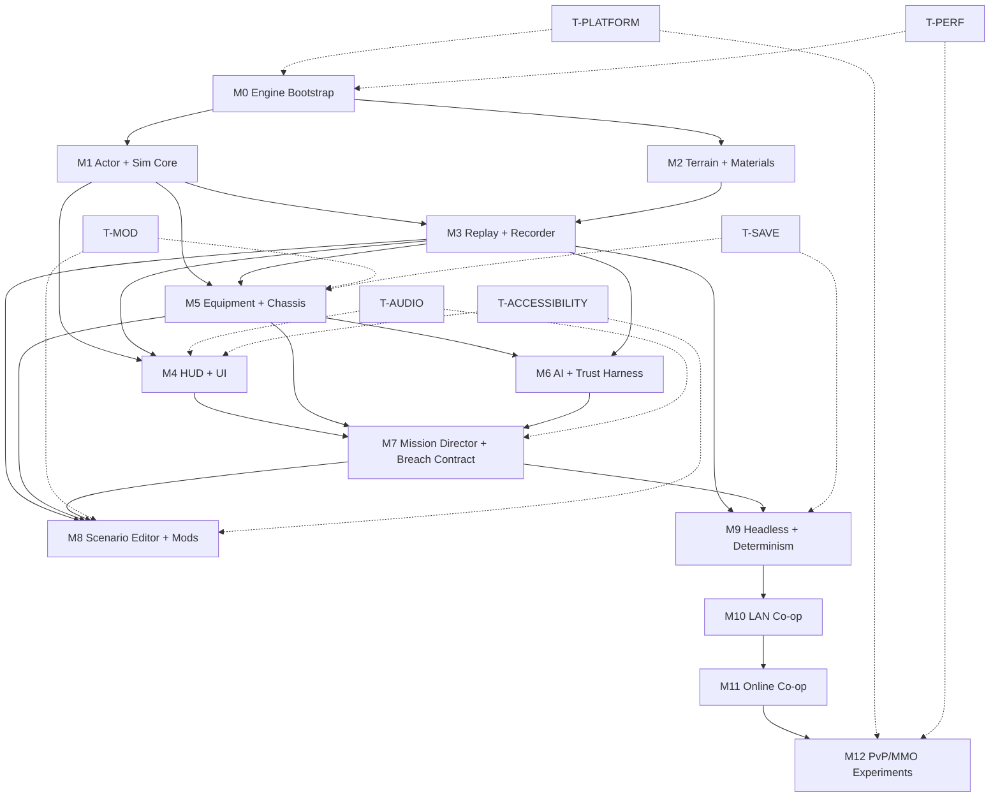

← [[spec/index|spec section]] · [[spec/authoritative-game-spec-v0|game spec v0]] · [[spec/prototype-implementation-backlog-slice-a|implementation backlog]] · [[dashboards/research-readiness|readiness]] · [[decisions/index|decisions]] · [VAULT_PLAN.md](../../VAULT_PLAN.md) · [HTML-era snapshot](../research-log/2026-05-04-prototype-roadmap-html-snapshot.md)

# Native Build Roadmap

> [!summary] What this is
> The native development roadmap. Replaces the prior browser-lab-flavored roadmap in full. The project is a **greenfield Rust native game** built on Bevy + wgpu as foundation, with custom core crates for the systems that make this game special. Targets desktop-first (Win/Linux/macOS) at 4K/120 ceiling with 1080p/60 floor and Steam Deck 800p/60 compatibility, MMO-ready from day one, with first-class scenario editor and modding at launch.

> [!warning] Authority boundary
> This is a planning anchor. Milestones, ticket counts, and per-feature detail will move as evidence comes in. The structure (M0..M12 + side tracks) is committed. Specific timelines and ticket boundaries will be tuned per milestone.

---

## Table Of Contents

- [Read Order](#read-order)
- [Strategic Frame](#strategic-frame)
- [Stack At A Glance](#stack-at-a-glance)
- [Repository Layout](#repository-layout)
- [Milestone Map](#milestone-map)
- [Side Tracks](#side-tracks)
- [Milestone Details](#milestone-details)
  - [M0 — Engine Bootstrap](#m0--engine-bootstrap)
  - [M1 — Actor Controller And Sim Core](#m1--actor-controller-and-sim-core)
  - [M2 — Pixel Terrain And Materials](#m2--pixel-terrain-and-materials)
  - [M3 — Replay And Event Recorder](#m3--replay-and-event-recorder)
  - [M4 — HUD And Comic-Noir UI](#m4--hud-and-comic-noir-ui)
  - [M5 — Equipment, Chassis, And Damage Grammar](#m5--equipment-chassis-and-damage-grammar)
  - [M6 — AI Core And Trust Harness](#m6--ai-core-and-trust-harness)
  - [M7 — Mission Director And Breach Contract Proof Mission](#m7--mission-director-and-breach-contract-proof-mission)
  - [M8 — Scenario Editor And Mod Tools](#m8--scenario-editor-and-mod-tools)
  - [M9 — Headless Server And Determinism Islands](#m9--headless-server-and-determinism-islands)
  - [M10 — LAN Co-op](#m10--lan-co-op)
  - [M11 — Online Co-op (Private)](#m11--online-co-op-private)
  - [M12 — PvP And MMO Experiments](#m12--pvp-and-mmo-experiments)
- [Side Track Details](#side-track-details)
  - [T-PLATFORM — Cross-Platform CI And Steam Deck](#t-platform--cross-platform-ci-and-steam-deck)
  - [T-MOD — Modding And Scripting](#t-mod--modding-and-scripting)
  - [T-AUDIO — Diegetic SFX And Captions](#t-audio--diegetic-sfx-and-captions)
  - [T-SAVE — Save Game System](#t-save--save-game-system)
  - [T-ACCESSIBILITY — Accessibility Floor](#t-accessibility--accessibility-floor)
  - [T-PERF — Performance Targets And Budgets](#t-perf--performance-targets-and-budgets)
- [Dependency Graph](#dependency-graph)
- [Feature Index](#feature-index)
- [Milestone Done-Criteria Summary](#milestone-done-criteria-summary)
- [Risk Register](#risk-register)
- [Anti-Goals](#anti-goals)
- [Source Trail](#source-trail)

---

## Read Order

If you only have time to read three things before starting work:

1. [[spec/authoritative-game-spec-v0]] — what the game is.
2. This roadmap — what gets built and in what order.
3. [[spec/prototype-implementation-backlog-slice-a]] — concrete task cards for the current milestone.

If you have more time, also read: [[decisions/index]], [[dashboards/decision-tracker]], [[references/usage-ledger]], [[research-log/moonshot-register]], [[prototypes/actor-feel-lab-a1-human-playtest-2026-05-04]] (the "ok I guess" signal that informs M1 acceptance).

---

## Strategic Frame

| Dimension | Commitment |
|---|---|
| Engine direction | Greenfield native; CCCP is read-only reference (DR-001). |
| Native stack | Rust + Bevy/wgpu hybrid + custom core crates (DR-024). |
| Target platforms | Desktop-first: Windows, Linux, macOS. Steam Deck 800p/60 floor. Headless Linux server later. Web only for labs/tools/demos. No mobile (DR-025). |
| Team model | AI-augmented solo/small-core. Modular repo so AI agents can own crates without breakage (DR-026). |
| Pacing & control | Hybrid real-time tactical. Direct possession optional. Strategy-first valid (DR-015 + DR-026). |
| Multiplayer phasing | MMO-ready architecture from day one; ship solo-first first. Solo lab → split-screen → LAN co-op → online co-op → PvP/MMO (DR-005 + DR-026). |
| Visual fidelity | Target 4K/120 strong desktop; floor 1080p/60; Steam Deck 800p/60. Pixel-sim battlefield + comic-noir UI + scalable SDF/vector text + 200% UI scaling (DR-019 + DR-028). |
| Audio | Diegetic industrial synth-dread; audio-as-tactical-UI; mandatory captions (DR-020). |
| Sim model | Fixed 60/120 Hz islands; AI/terrain budgeted-async; deterministic where it earns its keep. |
| Scenario editor | First-class at launch. Same manifest format for official, procedural, player-authored (DR-017 + DR-030). |
| Base layer | Deep combat-base (command core + power grid + shields + turrets + sensors + doors + repair pads + hangar + storage + traps + breachable structure). NOT full colony sim (DR-027). |
| Save game | Versioned local-first campaign saves + replay/run bundles. Multiple slots, autosave, ironman, scenario policies, migration-safe (DR-029). |
| Content economy | Premium game + free modding. Expansions/DLC/cosmetics later. No core-mechanic monetization (DR-031). |
| Modding | Schema-first + scripting (Lua/Rhai TBD); package builder + validator; first-class at launch (DR-006). |

---

## Stack At A Glance

| Layer | Choice | Why |
|---|---|---|
| Language | Rust (edition 2021+) | Memory safety, predictability for determinism, excellent ECS ecosystem, AGPL-clean separation from CCCP's C++. |
| App shell / windowing / input / asset pipeline / hot reload | Bevy | Mature, ECS-native, good docs, fast iteration, cross-platform. Use Bevy's plugin system as our extension point. |
| Renderer foundation | wgpu via Bevy where it fits; **custom wgpu-first** for terrain/sprite/particle hot paths | Need 4K/120 + chunked terrain textures + GPU-assisted carving. Off-the-shelf 2D renderers don't deliver that ceiling. |
| ECS | Bevy ECS | Schedule, parallelism, world model are excellent. Custom systems plug in cleanly. |
| Sim core | **Custom crate** with fixed-tick scheduler | Bevy's frame loop is for rendering; sim must run on a fixed-tick deterministic island. |
| Pixel terrain | **Custom crate** | Chunked, GPU-assisted, mutable per-pixel material. Off-the-shelf has no answer. |
| Body/chassis/mech model | **Custom crate** | DR-014/021 chassis grammar is unique to this project. |
| AI | **Custom crate** | DR-022 humanlike-bar means perception/memory/doctrine/adaptation; not off-the-shelf. |
| Replay/event | **Custom crate** | DR-002/DR-018 event taxonomy + scenario manifest + run-bundle schema. |
| Networking | **Custom crate** built on a transport (lightyear / renet / quinn TBD) | DR-005 MMO-ready architecture. Authority boundaries, snapshot/event hybrid, deterministic islands. |
| Save | **Custom crate** | DR-029 versioned + migration-safe + replay-linked. |
| UI | egui (Bevy plugin) for tools/workbench; **custom Bevy UI or egui-skinned** for game HUD | Comic-noir UI requires control egui can't fully give; tools can use egui. |
| Audio | Bevy audio backend or kira | Diegetic-first mix; caption events drive subtitle UI. |
| Modding scripts | mlua (Lua) or Rhai — pick during M8 | Lua is familiar; Rhai is Rust-native. Decide based on M5/M6 needs. |
| Build / CI | cargo + GitHub Actions (Win/Linux/macOS matrix) | Per DR-025. |

### Stack Question: Why Not C + raylib + stb?

This was evaluated as a stack sanity check, not as a new formal product decision. The roadmap stays on Rust + Bevy/wgpu because the target is not only "draw a fast 2D game." The target is 4K/120, destructible pixel terrain, replay/debug, save migration, humanlike AI, modding/workbench tooling, future headless/network architecture, and AI-agent-heavy implementation.

Full comparison note: [[references/rust-bevy-wgpu-vs-c-raylib-stb]].

| Area | Rust + Bevy/wgpu + custom crates | C + raylib + stb |
|---|---|---|
| Raw control | High. | Highest. |
| Time to first pixels | Medium. | Excellent. |
| 4K/120 renderer path | Strong with custom wgpu hot paths. | Possible, but OpenGL-first and more custom work. |
| GPU terrain/compute future | Strong: Vulkan, Metal, DX12, WebGPU through wgpu. | Weaker: raylib is OpenGL-centered. |
| AI-agent coding safety | Strong: Rust types, crates, tests, compiler catches many mistakes. | Riskier: memory bugs, pointer lifetime, data races, and ownership mistakes are easier. |
| Modular repo ownership | Excellent with Cargo workspace crates. | Possible, but more manual build/API discipline. |
| Replay/save/schema/event systems | Excellent with Rust types and serialization ecosystem. | Possible, but more hand-rolled. |
| UI/workbench/editor | Better via Bevy, egui, custom tooling, and typed data. | Mostly custom work. |
| Modding pipeline | Better for schema validation, package diagnostics, source provenance, and migration. | Possible, but more hand-rolled. |
| Long-term engine quality | Better fit for this project's ambition. | Better fit only for a minimalist handmade engine. |

Allowed use of raylib/stb: throwaway prototypes, asset converters, image utilities, procedural terrain experiments, minimal-dependency benchmarks, and reference implementations. Do not let those side experiments become the product engine by inertia.

---

## Repository Layout

Modular crate workspace so AI agents can own separate crates per DR-026:

```
cortex-game/                          # cargo workspace root
├── Cargo.toml                        # workspace + shared deps
├── crates/
│   ├── cx-app/                       # binary; thin Bevy app shell + plugin wiring
│   ├── cx-sim-core/                  # fixed-tick scheduler, time, RNG, deterministic islands
│   ├── cx-terrain/                   # chunked pixel terrain + materials + GPU carving
│   ├── cx-physics/                   # custom 2D physics (collision, atom-style probes)
│   ├── cx-actor/                     # actor components, controller intent layer
│   ├── cx-chassis/                   # armor/mech/origin grammar (DR-014/021)
│   ├── cx-equipment/                 # role records, modules, jam/eject/repair
│   ├── cx-ai/                        # perception, memory, utility, doctrine, reason labels (DR-022)
│   ├── cx-mission/                   # scenario manifest, director, objectives, command-core (DR-017)
│   ├── cx-replay/                    # event taxonomy, run bundle, snapshots, checksums (DR-002)
│   ├── cx-save/                      # versioned save, migration, ironman policies (DR-029)
│   ├── cx-net/                       # authority, snapshots, transport adapter (DR-005)
│   ├── cx-render-2d/                 # custom wgpu pipelines: chunked terrain, sprite batching, particles
│   ├── cx-ui/                        # comic-noir HUD, mission cards, accessibility
│   ├── cx-audio/                     # diegetic mix, caption events
│   ├── cx-mod/                       # mod loader, schema validator, script host
│   ├── cx-tools-editor/              # in-engine scenario/package workbench (DR-020b)
│   ├── cx-headless/                  # headless server binary
│   └── cx-bench/                     # perf harness
├── assets/                           # sprites, audio, manifests, scenes
├── content/                          # base game packages (data + manifests + scripts)
├── tools/                            # scripts, generators, run-bundle checker
├── tests/                            # integration tests
└── docs/                             # design/architecture notes (links into vault)
```

Each crate is owned by an explicit feature/agent boundary. Inter-crate boundaries are defined by traits and event types, not by reaching into each other's structs.

---

## Milestone Map

| ID | Title | What It Proves | Depends On | Critical |
|---|---|---|---|---|
| M0 | Engine Bootstrap | Workspace builds, app runs, fixed-tick sim ticks, hello-world render | — | Yes |
| M1 | Actor Controller + Sim Core | One actor playable; control intent + physics + simple weapon | M0 | Yes |
| M2 | Pixel Terrain + Materials | Mutable chunked terrain; GPU-assisted carving; material affordances | M0, M1 | Yes |
| M3 | Replay + Event Recorder | Event taxonomy + run bundle + snapshot/checksum + headless replay | M0..M2 | Yes |
| M4 | HUD + Comic-Noir UI | HUD reads sim state; comic-noir cards; accessibility floor | M1, M3 | Yes |
| M5 | Equipment + Chassis + Damage Grammar | Role records; modules; armor layers; jam/eject/repair/salvage events | M1, M3 | Yes |
| M6 | AI Core + Trust Harness | Perception/memory/utility/doctrine; reason-label events; AI-H scenario runner | M1, M3, M5 | Yes |
| M7 | Mission Director + Breach Contract | Typed manifest; director; command-core minimum; base-system slice; first proof mission playable | M1..M6 | Yes |
| M8 | Scenario Editor + Mod Tools | In-engine workbench; same manifest format; mod loader; package builder | M3, M5, M7 | Yes |
| M9 | Headless Server + Determinism Islands | Headless sim binary; deterministic island contracts; replay-from-events | M3, M7 | Yes |
| M10 | LAN Co-op | 2 clients on local network; replicated state; survival of one Breach Contract | M9 | Optional v1 |
| M11 | Online Co-op (Private) | NAT/relay; lobby; package hash sync | M10 | Optional v1 |
| M12 | PvP/MMO Experiments | Bandwidth/authority/cheat models tested at scale | M10, M11 | Post-launch only |

---

## Side Tracks

Side tracks run alongside milestones, not as separate gates. They have their own done-criteria and acceptance tests that intersect with multiple milestones.

| ID | Title | Spans Milestones |
|---|---|---|
| T-PLATFORM | Cross-platform CI and Steam Deck | M0..M12 |
| T-MOD | Modding and scripting | M5..M8 primary; lifelong |
| T-AUDIO | Diegetic SFX and captions | M4..M7 primary; lifelong |
| T-SAVE | Save game system | M5..M9 primary; lifelong |
| T-ACCESSIBILITY | Accessibility floor | M4..M8 primary; lifelong |
| T-PERF | Performance targets and budgets | M0..M12 |

---

## Milestone Details

### M0 — Engine Bootstrap

**What it proves:** The native repo exists, builds on three platforms, runs a Bevy app with a fixed-tick sim plugin, ticks at 60 Hz, exits cleanly, produces a deterministic run bundle from a scripted no-op scene.

**Scope:**
- Cargo workspace with the crate layout above.
- `cx-app` binary that launches a Bevy app with empty schedule.
- `cx-sim-core` fixed-tick scheduler (60 Hz default; 120 Hz option).
- `cx-replay` minimal event envelope + run-bundle writer (no events yet beyond `system_*`).
- `cx-render-2d` minimal wgpu pipeline that clears the screen.
- GitHub Actions CI: build matrix Win/Linux/macOS; cargo check + cargo test + cargo clippy.
- `tools/run_bundle_check.py` ported from the existing Python tool to validate native run bundles.
- Hello-world scene: blank window, press ESC to exit, run-bundle written to `prototype_runs/native/`.

**Done-criteria:**
- [ ] `cargo build --release` succeeds on Win/Linux/macOS.
- [ ] CI is green for all three platforms.
- [ ] `cargo run` opens a window, ticks the sim at 60 Hz for 5 seconds, exits cleanly.
- [ ] A run bundle is written under `prototype_runs/native/m0_*/` with manifest+events+summary+notes.
- [ ] `tools/run_bundle_check.py` passes on the bundle.
- [ ] Repository is committed; commit history is semantic.

**Cross-DR:** DR-001, DR-024, DR-025, DR-026, DR-002 (run-bundle).

---

### M1 — Actor Controller And Sim Core

**What it proves:** One actor is playable on the native engine. Movement, aim, simple weapon, and the body-status state machine all run through the fixed-tick sim and emit replay events. This is the moment the **HTML lab is officially superseded as the iteration harness**.

**Scope:**
- `cx-actor` actor components: `Position`, `Velocity`, `Aim`, `Status` (STABLE/UNSTABLE/DOWNED/DEAD), `Inventory`.
- `cx-sim-core` control intent layer: input → `ControlIntent` resource → consumed by sim systems.
- `cx-physics` minimal 2D physics: gravity, ground collision, recoil impulse.
- `cx-equipment` minimal: one rifle preset; magazine/ammo state; fire/reload events.
- `cx-render-2d`: pixel-art sprite rendering (sub-pixel-clean); chunky pixel actor sprite.
- `cx-replay`: event taxonomy expanded to `input_intent`, `actor_status_changed`, `weapon_fired`, `weapon_reloaded`, `actor_snapshot`.
- HUD stub via egui: ammo + status text overlay.
- Manual playtest: WASD movement, mouse aim, click-to-fire, R to reload.

**Done-criteria:**
- [ ] One actor is playable for 5 minutes without crash.
- [ ] All control inputs produce `input_intent` events.
- [ ] Status transitions emit `actor_status_changed` with cause.
- [ ] A 5-minute run bundle validates with the run-bundle checker.
- [ ] Project owner does a manual playtest and writes a verbatim reaction in a vault note.
- [ ] HTML lab is marked superseded; new prototype work goes into native.

**Cross-DR:** DR-001, DR-003, DR-004, DR-024, DR-026, DR-002.

---

### M2 — Pixel Terrain And Materials

**What it proves:** Mutable chunked pixel terrain. The player can dig a soft-material wall and the change is visible, replay-recorded, and respected by the simple physics.

**Scope:**
- `cx-terrain` chunked pixel terrain: 256×256 chunks; per-pixel material id; sparse storage.
- GPU-assisted carving compute shader (wgpu): blast/dig writes apply on the GPU when bounds are large; CPU fallback for small writes.
- Material registry with launch material set: air, dirt, concrete, metal-nohook, hazard, loose fill, repair-fill, anchor.
- Material affordances: hardness, anchorability, hazard flags, path-cost contribution.
- Dirty-region tracker for downstream consumers (path, replay, render).
- Digger tool wired into `cx-equipment`; `tool_action_started` / `terrain_carved` / `tool_refused` events.
- Material overlay (toggle key): renders material id as colored overlay.
- Visual feedback: pixel debris particles when carving.

**Done-criteria:**
- [ ] Player can dig through dirt fast, concrete slowly, metal-nohook is refused with reason label.
- [ ] Carving emits `terrain_carved` events with bbox + material id + count.
- [ ] Dirty regions update; render reflects mutation within one frame.
- [ ] Material overlay reads correctly across all 8 launch materials.
- [ ] Run bundle validates; replay can reconstruct the terrain state at any tick.
- [ ] Perf budget: 1280×720 scene + carving session sustains 120 FPS on baseline hardware (per T-PERF).

**Cross-DR:** DR-007, DR-019, DR-024, DR-002.

---

### M3 — Replay And Event Recorder

**What it proves:** Event taxonomy is complete enough that any prior milestone's run can be replayed headlessly and produce identical state checksums. Determinism islands are real.

**Scope:**
- `cx-replay` event taxonomy expanded to cover all event categories from [[systems/replay-event-architecture]]: combat, body, terrain, AI, logistics, mission, modifier, network.
- Snapshot writer: full actor/inventory/terrain snapshot at scene start + every objective change.
- Checksum producer: per-tick or per-snapshot.
- Headless replay binary: replays a run bundle without rendering and produces matching checksums.
- Run-bundle viewer: simple egui-based event tail + filter + parent-chain view.
- Determinism island contract: documents which subsystems are deterministic (sim core, terrain mutation, AI decisions) and which are not (audio, particles cosmetic, render).

**Done-criteria:**
- [ ] A 5-minute M2 run can be replayed headlessly and produces identical actor/terrain/inventory checksums.
- [ ] Drift between replay and live run is reported per-tick with diff.
- [ ] Replay viewer can scrub through events and show context.
- [ ] Death recap: given an `actor_died` event, the viewer shows the parent cause chain.
- [ ] Run bundle includes manifest, events, summary, snapshots, checksums, captures.

**Cross-DR:** DR-002, DR-005, DR-018, DR-024.

---

### M4 — HUD And Comic-Noir UI

**What it proves:** Game state is readable from the HUD without text walls. Comic-noir mission card style is established. Accessibility floor (DR-012) is hit.

**Scope:**
- `cx-ui` HUD: body silhouette (DR-003 style); module strip stub; ammo + reload; objective banner; timer; last-important-event ticker.
- Comic-noir mission card: pre-mission briefing card; post-mission debrief card; both static.
- Status banners ("ARMOR CRACKED LEFT", "JET FAILED", "EJECT NOW") triggered by chassis events.
- Material overlay UI integrated; tool-validity color cues.
- Accessibility floor: 200% text scale + reflow; high-contrast mode; color-independent state labels; controller route through HUD; remap holds; captions.
- SDF/vector text rendering for clean scaling.

**Done-criteria:**
- [ ] HUD-01..HUD-03 acceptance tests from [[systems/ux-overlay-screen-brief]] pass with 5 playtesters.
- [ ] ACC-A floor passes for HUD + mission card + material overlay.
- [ ] Mission card renders pre/post mission with comic-noir style.
- [ ] 200% text scale doesn't break HUD layout.

**Cross-DR:** DR-003, DR-009, DR-012, DR-019, DR-024.

---

### M5 — Equipment, Chassis, And Damage Grammar

**What it proves:** The chassis grammar from DR-014/021 works on the native engine. One powered-armor actor and one light mech actor exercise the full ladder of layers + modules + damage stages + jam + eject + repair + salvage.

**Scope:**
- `cx-chassis` chassis components: layered armor zones, modules with state, pilot/operator binding.
- Damage stages: `nominal` → `degraded` → `module-warning` → `module-failed` → `weapon-jammed` → `armor-cracked` → `disabled` → `pilot-injured` → `eject` → `bail-too-late` → `wreck` → `gibbed/exploded`.
- Module system: jet, shield, sensor, repair-drone, weapon-mount; each with damage states.
- `cx-equipment` role records implementation; LOAD-A fixture support; AI policy hints.
- Events: `chassis_stage_changed`, `module_state_changed`, `armor_layer_damaged`, `weapon_jammed`, `weapon_cleared`, `pilot_state_changed`, `pilot_ejected`, `pilot_extracted`, `pilot_lost`, `chassis_repaired`, `chassis_salvaged`.
- Two reference chassis: powered armor (Spartan-ish proportions); light mech (~3× human).
- Tutorial-safety scenario policy honored: lethal demoted to KO during onboarding-shaped scenarios.

**Done-criteria:**
- [ ] Player can take damage and progress through stages with HUD + replay parity.
- [ ] Module damage produces module-warning → failure with reason labels.
- [ ] Pilot eject works: player ejects from a wrecked mech and continues as foot infantry.
- [ ] Chassis salvage emits `chassis_salvaged` with recoverable modules.
- [ ] BODY-A and CHASSIS-A acceptance tests pass.

**Cross-DR:** DR-003, DR-014, DR-018, DR-021, DR-024.

---

### M6 — AI Core And Trust Harness

**What it proves:** The 8-criteria humanlike AI bar from DR-022 has a runnable harness. Perception, memory, doctrine, reason labels, recovery, and replay are all in place. Strategic adaptation across missions is staged but not yet required to fire.

**Scope:**
- `cx-ai` perception model: sight cone + hearing range + memory grid for last-known positions.
- Utility scoring + doctrine slots: cautious, aggressive, support, scout, sniper, etc. (start with 4-6).
- Reason-label events: `tactic_chosen` with reason string for every decision.
- Mistake/recovery model: bots can panic, miss, get stuck; recovery actions emit events.
- AI-H scenario runner: AI-H-01..AI-H-06 from [[spec/ai-trust-harness-slice-a]].
- Reason-label HUD overlay: shows what each visible bot is currently trying to do.
- Cross-mission state stub: faction commander persists across the same campaign session (file-based).

**Done-criteria:**
- [ ] AI-H-01..AI-H-06 pass with replay evidence.
- [ ] All 8 DR-022 criteria are testable; at least 6 are demonstrably met (intent, perception, doctrine, mistakes, recovery, replay proof; strategic adaptation + fairness staged).
- [ ] A friendly bot in a 60-90s scene actively communicates intent through reason labels.

**Cross-DR:** DR-008, DR-014, DR-022, DR-024.

---

### M7 — Mission Director And Breach Contract Proof Mission

**What it proves:** Everything above composes into one playable Breach Contract mission. Manifest format works. Command core works minimally. Base systems work minimally. Mission director paces the encounter. The first proof mission can be played, won, lost, replayed, debriefed.

**Scope:**
- `cx-mission` typed scenario manifest schema (data-only): objectives, teams, terrain rules, command-core/base state, capability requirements, director phases, save fields, replay events, validation.
- Mission director: manages pacing, reinforcement, LZ risk, objective escalation, with reason labels.
- Command-core mechanic minimum: rooted core powers ≥ 2 base systems (shield + 1 turret). Uprooted core embeds into player avatar with stat boost. Losing core = mission failure if `command_core_endgame` policy.
- Base system slice: command core + power grid + 1 shield + 1 turret + 1 door + 1 repair pad.
- Breach Contract scenario: enter compound → breach wall → neutralize 2-3 enemies → reach extract → before timer.
- Comic-noir pre-/post-mission cards.
- Death recap from replay.

**Done-criteria:**
- [ ] Mission can be won and lost via the listed paths.
- [ ] Replay reconstructs the mission tick-perfect.
- [ ] Command-core uproot works: player embeds the core into a chassis and gains the avatar boost; rooted base systems shed.
- [ ] MISSION-A acceptance tests pass.
- [ ] Project owner plays the mission at least 5 times and writes a verbatim reaction.
- [ ] At this point, the **A-FEEL gate from the prior HTML playtest is met** — the lab has something to do, not just operate.

**Cross-DR:** DR-014, DR-015, DR-016, DR-017, DR-018, DR-021, DR-022, DR-027.

---

### M8 — Scenario Editor And Mod Tools

**What it proves:** Players can author scenarios using the same manifest format the engine ships with. Mod loader works. Package builder produces deterministic packages.

**Scope:**
- `cx-tools-editor` in-engine workbench mode: scenario editor (place spawns, materials, objectives, command-core, base systems, capability requirements, director config); test-run; export.
- `cx-mod` mod loader: discovers packages in `mods/`; validates schemas; loads at engine startup.
- Package builder: produces deterministic `.cxpkg` archives; provenance tracking; loader graph; preset/effect graphs; migration preview.
- Lua or Rhai scripting host for mod scripts (decision in M5; implement in M8).
- Scenario validator: catches missing fields, broken refs, AI policy violations, accessibility issues.
- One sample mod: adds a new chassis archetype using the same grammar.

**Done-criteria:**
- [ ] A player can author a Breach Contract variant in the in-engine editor.
- [ ] The variant exports as a `.cxpkg`, loads back into the engine, runs.
- [ ] Sample mod's new chassis works in M7 mission.
- [ ] PACK-A and MOD-A acceptance tests pass.

**Cross-DR:** DR-006, DR-010, DR-017, DR-024, DR-030.

---

### M9 — Headless Server And Determinism Islands

**What it proves:** The sim runs without rendering on a Linux headless target. Deterministic islands are real and testable. Replays from events alone reconstruct identical state.

**Scope:**
- `cx-headless` headless binary: same sim, no renderer, no audio, network-driven inputs.
- Determinism island contracts documented and validated: which subsystems are bit-deterministic; which are stochastic-but-replayable; which are cosmetic only.
- Headless replay-from-events: given a run bundle, the headless server replays and produces identical checksums.
- Performance pass: headless can run 10× real-time on baseline hardware for replay validation.

**Done-criteria:**
- [ ] A 10-minute M7 mission run replays headlessly with bit-identical actor/terrain/inventory checksums.
- [ ] Headless server runs on a Linux VPS without graphics drivers.
- [ ] DET-A acceptance tests pass.

**Cross-DR:** DR-002, DR-005, DR-024, DR-025.

---

### M10 — LAN Co-op

**What it proves:** Two clients on a local network can play one Breach Contract together with replicated state, authority resolution, and replay parity.

**Scope:**
- `cx-net` authority model: server-authoritative for sim; clients send inputs, receive snapshots + events.
- LAN discovery (no NAT yet).
- Lobby + ready-up.
- Replicated state: actors, terrain, inventory, mission state.
- Co-op friendly fire policy (configurable per scenario).
- Per-client replay bundles that align.

**Done-criteria:**
- [ ] Two clients survive one 5-minute Breach Contract together with no desync.
- [ ] Both clients' replay bundles align tick-for-tick.
- [ ] Bandwidth budget within target (TBD per T-PERF).

**Cross-DR:** DR-005, DR-013, DR-024, DR-025.

---

### M11 — Online Co-op (Private)

**What it proves:** Online co-op works through NAT/relay between two friends. Package hash sync prevents version mismatch crashes.

**Scope:**
- NAT punch-through or relay (transport library decision).
- Lobby with code-based join.
- Package hash sync: server checks client packages match; soft-fail with auto-download for the dev workflow; hard-fail with mismatch report for shipping.
- Latency compensation: client-side prediction + server reconciliation for player actor; pure replication for AI bots.

**Done-criteria:**
- [ ] Two friends in different cities co-op a Breach Contract.
- [ ] Latency masking works at 50-150ms RTT without obvious jitter.
- [ ] Package mismatch produces a clean error, not a crash.

**Cross-DR:** DR-005, DR-013, DR-024.

---

### M12 — PvP And MMO Experiments

**What it proves:** The architecture can support PvP and large-scale online without re-architecting. Or it tells us where the wall is.

**Scope (gated, post-launch):**
- PvP prototype: 2-4 players in a small destructible map.
- Anti-cheat foundation: server-authoritative simulation; all client actions validated.
- Bandwidth/authority/cheat models tested at 4-8 player density.
- MMO experiment (R&D only): persistent world prototype with N players in same shard.

**Done-criteria:**
- [ ] PvP is stable enough to run public stress tests.
- [ ] MMO prototype runs N=20 players for 10 minutes without desync.
- [ ] DR-005 launch posture is reconsidered with prototype evidence.

**Cross-DR:** DR-005, DR-013, DR-024.

---

## Side Track Details

### T-PLATFORM — Cross-Platform CI And Steam Deck

Spans M0..M12. From M0:

- GitHub Actions matrix: Win (windows-latest), Linux (ubuntu-latest), macOS (macos-latest).
- `cargo build --release`, `cargo test`, `cargo clippy -- -D warnings` on each.
- Steam Deck testing pass at every milestone end (manual; document in vault).
- Platform-specific issues (input mapping, audio backend, file paths) tracked per milestone.

**Done-criteria per milestone:** CI green; Steam Deck plays the milestone's reference scene at 800p/60.

### T-MOD — Modding And Scripting

Spans M5..M8 primary; lifelong from M5.

- Schema-first data: every mod-extensible system has a documented schema.
- Scripting host: mlua or Rhai (decided during M5; implemented in M6 or M7).
- Sandbox: scripts cannot do filesystem/network without capability declaration.
- Documentation: auto-generated API reference from Rust trait impls.
- Sample mods: 3-5 sample mods covering chassis, weapons, scenarios, AI doctrines, materials.

**Done-criteria:** A modder authors a chassis + scenario + AI doctrine in under one weekend; package validates and runs.

### T-AUDIO — Diegetic SFX And Captions

Spans M4..M7 primary; lifelong from M4.

- Diegetic-first mix per DR-020.
- Audio cue → caption event pipeline: every critical SFX has a caption.
- Origin-specific failure sound families per [[spec/audio-identity]].
- Mix policy: synth music ducks under critical alarms.
- Captioned playback in replay viewer.

**Done-criteria:** All M4..M7 SFX have captions; mix passes 5 deaf-accessibility playtest sessions.

### T-SAVE — Save Game System

Spans M5..M9 primary; lifelong from M5.

- `cx-save` versioned save format (`.cxsave`).
- Saves include: command core state, base modules, actors/veterans, mechs, salvage, faction state, enemy commander memory, mission manifests, scenario policy.
- Multiple save slots per profile.
- Autosave before/after contracts.
- Mission suspend/resume.
- Same-seed retry.
- Ironman / scenario policies persisted.
- Replay archive linked to saves.
- Migration-safe schema with version handlers.

**Done-criteria:** Save → load → continue mission produces identical state. Migration test: a v0.1 save loads on v0.2 with declared migration handlers.

### T-ACCESSIBILITY — Accessibility Floor

Spans M4..M8 primary; lifelong from M4.

- Per DR-012 and [[spec/accessibility-comfort-slice-a]]:
  - 200% text scale + reflow.
  - High contrast mode.
  - Color-independent state labels.
  - Controller / keyboard / mouse parity.
  - Remap holds.
  - Captions for all critical audio.
  - Reduced motion / shake / flash.
- ACC-A acceptance tests at every milestone end.

**Done-criteria:** Every milestone's user-facing surface passes ACC-A floor.

### T-PERF — Performance Targets And Budgets

Spans M0..M12.

| Target | Hardware | Scenario |
|---|---|---|
| 4K @ 120 Hz | Strong desktop (modern dGPU) | M7 Breach Contract with 5 actors + active terrain |
| 1080p @ 60 Hz | Mid-range desktop | Same |
| 800p @ 60 Hz | Steam Deck OLED | Same |

Sim runs at 60 Hz fixed island (or 120 Hz for high-refresh inputs). Render decoupled from sim.

Per-frame budget at 4K/120: 8.33ms. Sim tick at 60Hz: 16.67ms. AI/terrain async budgets defined per milestone.

**Done-criteria per milestone:** Reference scene meets the three targets.

---

## Dependency Graph



---

## Feature Index

Quick lookup: which milestone owns which feature.

| Feature | Milestone(s) |
|---|---|
| Cargo workspace + crate layout | M0 |
| Bevy app shell | M0 |
| Custom wgpu render pipelines | M0 (clear), M1 (sprite), M2 (terrain), M5 (chassis), M7 (full) |
| Fixed-tick sim scheduler | M0 |
| Run-bundle writer / checker | M0, M3 |
| Actor controller + control intent | M1 |
| 2D physics | M1 |
| Pixel terrain (chunked) | M2 |
| Material system + affordances | M2 |
| GPU-assisted terrain carving | M2 |
| Material overlay UI | M2, M4 |
| Event taxonomy (full) | M3 |
| Snapshots + checksums | M3 |
| Headless replay | M3, M9 |
| Replay viewer | M3 |
| HUD body silhouette | M4 |
| Comic-noir mission cards | M4 |
| SDF/vector text | M4 |
| Accessibility floor | M4, T-ACCESSIBILITY |
| Equipment role records | M5 |
| Chassis layers + modules | M5 |
| Damage stages | M5 |
| Pilot eject / repair / salvage | M5 |
| Tutorial-safety policy | M5, M7 |
| AI perception + memory | M6 |
| AI utility + doctrine | M6 |
| AI reason labels | M6 |
| AI-H scenario runner | M6 |
| Cross-mission commander state | M6, M7 |
| Mission manifest schema | M7 |
| Mission director | M7 |
| Command-core mechanic | M7 |
| Base systems (shield + turret + door + repair pad) | M7 |
| Breach Contract proof mission | M7 |
| Comic-noir debrief | M4, M7 |
| In-engine scenario editor | M8 |
| Mod loader + package builder | M8 |
| Lua/Rhai script host | M8 |
| Headless dedicated server | M9 |
| Determinism island contracts | M9 |
| LAN co-op | M10 |
| Online co-op (NAT) | M11 |
| Package hash sync | M11 |
| PvP prototype | M12 |
| MMO experiment | M12 |
| Diegetic audio + captions | T-AUDIO, M4..M7 |
| Save game system | T-SAVE, M5..M9 |
| CI matrix Win/Linux/macOS | T-PLATFORM, M0..M12 |
| Steam Deck compatibility | T-PLATFORM |
| 4K/120 + 1080p/60 + Deck/800p/60 perf | T-PERF |

---

## Milestone Done-Criteria Summary

| Milestone | Headline Done-Criterion |
|---|---|
| M0 | Workspace builds on 3 platforms; Bevy app ticks; M0 run bundle validates. |
| M1 | One actor playable for 5 minutes; HTML lab is officially superseded. |
| M2 | Player digs through 8-material grid; carving replay-recorded; perf budget met. |
| M3 | Headless replay produces identical checksums to live run. |
| M4 | HUD-01..HUD-03 + ACC-A floor pass with 5 playtesters. |
| M5 | Powered armor + light mech work end-to-end with chassis grammar; pilot eject works. |
| M6 | 6 of 8 DR-022 AI criteria demonstrably met; AI-H-01..06 pass. |
| M7 | Project owner plays Breach Contract 5 times; A-FEEL gate met. |
| M8 | Player authors a Breach Contract variant + sample mod loads. |
| M9 | 10-minute mission replays headlessly bit-identical. |
| M10 | LAN co-op survives one Breach Contract; per-client bundles align. |
| M11 | Online co-op survives one Breach Contract; package hash mismatch handled. |
| M12 | PvP stable for stress tests; MMO prototype N=20 for 10 minutes. |

---

## Risk Register

| Risk | Why It Matters | Mitigation |
|---|---|---|
| Bevy breaking changes mid-development | Version churn could break the project. | Pin Bevy version; treat upgrades as scheduled work; isolate Bevy interface in `cx-app` and a few plugins. |
| Custom wgpu renderer is more work than expected | Could delay M2/M7. | Start with off-the-shelf Bevy renderer; introduce custom wgpu only where perf demands. |
| GPU-assisted terrain carving is hard cross-platform | macOS Metal + Linux Vulkan + Windows DX12 differ. | Wgpu abstracts this; CPU fallback path always present; test on all platforms in CI. |
| AI 8-criteria humanlike bar is too ambitious | Could become a tarpit. | Ship 6 of 8 by M6; defer strategic-adaptation + fairness instrumentation to M7+ if needed. |
| Determinism is harder than expected | Replay validation could fail late. | Define determinism islands narrowly; cosmetic systems are NOT in islands. Test at every milestone. |
| Solo+AI-augmented capacity is overestimated | Scope creep across 12 milestones. | Modular crate boundaries let agents own pieces; ruthless anti-goals; M7 is the v1 milestone marker. |
| MMO/PvP experiments balloon | M12 could swallow the project. | M12 is post-launch only; v1 ships at M7-M9. |
| Steam Deck perf doesn't hit 800p/60 | Compatibility floor missed. | Test at every milestone; degrade gracefully; reduce particle/lighting on lower spec. |
| Modding breaks determinism | Mods could desync replays. | Mod scripts run in a sandboxed deterministic island; non-deterministic ops are forbidden in sim-tick scope. |
| Cross-DR conflicts emerge | A new DR contradicts an existing one. | Decision-tracker is the single source of truth; conflicts trigger a DR review. |

---

## Anti-Goals

This roadmap explicitly does NOT include for v1:

- Mobile platform.
- Cloud save (optional later).
- Live-service economy.
- Public PvP at launch (M12 is post-launch).
- Account system (deferred to backend service scope).
- Marketplace / paid mods.
- Full colony sim (per DR-027).
- Noita-grade material chemistry (moonshot).
- VR/AR.
- Per-pixel deformable rigid bodies (chassis are sprite-based with module damage; no Teardown-style voxel sim).
- Multi-region simultaneous combat in MMO mode (M12 is small-shard exploration).
- Voice chat (use external; we provide text + captions).
- Full localization at v1 (English-first; localization plan TBD).

---

## Source Trail

- [[spec/authoritative-game-spec-v0]]
- [[spec/prototype-implementation-backlog-slice-a]]
- [[spec/setting-and-world-frame]]
- [[spec/chassis-armor-mechs-and-origins]]
- [[spec/command-core-base-power]]
- [[spec/visual-direction]]
- [[spec/audio-identity]]
- [[spec/replay-recorder-slice-a]]
- [[spec/terrain-material-sandbox-slice-a]]
- [[spec/mission-director-slice-a]]
- [[spec/equipment-loadout]]
- [[spec/equipment-loadout-workbench-slice-a]]
- [[spec/ai-trust-harness-slice-a]]
- [[systems/ux-overlay-screen-brief]]
- [[spec/ux-wireframes-slice-a]]
- [[spec/accessibility-comfort-slice-a]]
- [[spec/backend-networking]]
- [[spec/backend-service-hub-slice-a]]
- [[spec/modding-model]]
- [[spec/package-builder-workbench-slice-a]]
- [[spec/missions-and-objectives]]
- [[spec/progression-retention]]
- [[decisions/index]]
- [[dashboards/decision-tracker]]
- [[dashboards/research-readiness]]
- [[dashboards/system-heatmap]]
- [[references/usage-ledger]]
- [[research-log/moonshot-register]]
- [[research-log/2026-05-04-prototype-roadmap-html-snapshot]] — superseded HTML-era version
- [VAULT_PLAN.md](../../VAULT_PLAN.md)
