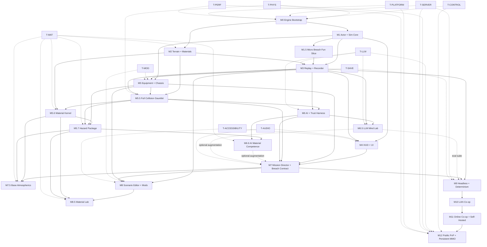

← [[spec/index|spec section]] · [[spec/authoritative-game-spec-v0|game spec v0]] · [[spec/native-implementation-backlog|native backlog]] · [[spec/feature-completion-checklist|feature checklist]] · [[spec/server-app-architecture|server app architecture]] · [[spec/persistent-mmo-architecture|persistent MMO architecture]] · [[spec/full-collision-physics-plan|full collision plan]] · [[spec/hybrid-llm-ai-plan|hybrid LLM AI plan]] · [[spec/ai-control-observability-layer|AI control/observability]] · [[comparables/noita-grade-material-simulation-research|systemic material research]] · [[spec/prototype-implementation-backlog-slice-a|historical HTML backlog]] · [[dashboards/research-readiness|readiness]] · [[decisions/index|decisions]] · [VAULT_PLAN.md](../../VAULT_PLAN.md) · [HTML-era snapshot](../research-log/2026-05-04-prototype-roadmap-html-snapshot.md)

# Native Build Roadmap

> [!summary] What this is
> The native development roadmap. Replaces the prior browser-lab-flavored roadmap in full. The project is a **greenfield Rust native game** built on Bevy + wgpu as foundation, with custom core crates for the systems that make this game special. Targets desktop-first (Win/Linux/macOS) at 4K/120 ceiling with 1080p/60 floor and Steam Deck 800p/60 compatibility. The full-product architecture includes a **dedicated server binary (`cf-server`) anyone can host** for LAN co-op, online co-op, public PvP arenas, and **persistent MMO shards** (DR-005 + DR-013 + DR-034 + DR-035), and **Noita-grade systemic material simulation** (DR-036) where every material is a verb, every reaction has a cause chain, every hazard has an overlay/caption/replay event. M12 proves PvP/MMO readiness; earlier milestones are not blocked on M12-scale soak tests. First-class scenario editor and modding at launch (DR-030 + DR-006).

> [!warning] Authority boundary
> This is a planning anchor. Milestones, ticket counts, and per-feature detail will move as evidence comes in. The structure (M0..M12 + side tracks) is committed. Specific timelines and ticket boundaries will be tuned per milestone.

---

## Table Of Contents

- [[#Read Order|Read Order]]
- [[#Glossary|Glossary]]
- [[#Agent Implementation Contract|Agent Implementation Contract]]
  - [[#Short Assignment Contract|Short Assignment Contract]]
  - [[#Open Decision Gates Protocol|Open Decision Gates Protocol]]
- [[#Milestone Handoff Template|Milestone Handoff Template]]
- [[#Human Playtest Checklist Template|Human Playtest Checklist Template]]
- [[#Strategic Frame|Strategic Frame]]
- [[#Stack At A Glance|Stack At A Glance]]
- [[#Coordinate System And Units|Coordinate System And Units]]
- [[#Repository Layout|Repository Layout]]
- [[#Toolchain And Workspace Bootstrap|Toolchain And Workspace Bootstrap]]
- [[#Per-Crate AGENTS.md Template|Per-Crate AGENTS.md Template]]
- [[#Logging, Tracing, And Error Policy|Logging, Tracing, And Error Policy]]
- [[#Asset And Placeholder Strategy|Asset And Placeholder Strategy]]
- [[#Testing Layers|Testing Layers]]
- [[#CLI Reference|CLI Reference]]
- [[#Control Transport And Envelope|Control Transport And Envelope]]
- [[#Scenario Manifest Schema|Scenario Manifest Schema]]
- [[#Run-Bundle Naming Convention|Run-Bundle Naming Convention]]
- [[#Bug Log Format|Bug Log Format]]
- [[#Inter-Milestone Bridges|Inter-Milestone Bridges]]
- [[#Per-Milestone Kickoff Smoke|Per-Milestone Kickoff Smoke]]
- [[#Milestone Map|Milestone Map]]
- [[#Side Tracks|Side Tracks]]
- [[#Milestone Details|Milestone Details]]
  - [[#M0 — Engine Bootstrap|M0 — Engine Bootstrap]]
  - [[#M1 — Actor Controller And Sim Core|M1 — Actor Controller And Sim Core]]
  - [[#M1.5 — Micro Breach Fun Slice|M1.5 — Micro Breach Fun Slice]]
  - [[#M2 — Pixel Terrain And Materials|M2 — Pixel Terrain And Materials]]
  - [[#M3 — Replay And Event Recorder|M3 — Replay And Event Recorder]]
  - [[#M4 — HUD And Comic-Noir UI|M4 — HUD And Comic-Noir UI]]
  - [[#M5 — Equipment, Chassis, And Damage Grammar|M5 — Equipment, Chassis, And Damage Grammar]]
  - [[#M5.5 — Full Collision Gauntlet|M5.5 — Full Collision Gauntlet]]
  - [[#M5.6 — Material Kernel|M5.6 — Material Kernel]]
  - [[#M5.7 — Hazard Package|M5.7 — Hazard Package]]
  - [[#M6 — AI Core And Trust Harness|M6 — AI Core And Trust Harness]]
  - [[#M6.5 — LLM Mind Lab|M6.5 — LLM Mind Lab]]
  - [[#M6.6 — AI Material Competence|M6.6 — AI Material Competence]]
  - [[#M7 — Mission Director And Breach Contract Proof Mission|M7 — Mission Director And Breach Contract Proof Mission]]
  - [[#M7.5 — Base Atmospherics|M7.5 — Base Atmospherics]]
  - [[#M8 — Scenario Editor And Mod Tools|M8 — Scenario Editor And Mod Tools]]
  - [[#M8.5 — Material Lab|M8.5 — Material Lab]]
  - [[#M9 — Dedicated Server App + Determinism Islands|M9 — Dedicated Server App + Determinism Islands]]
  - [[#M10 — LAN Co-op|M10 — LAN Co-op]]
  - [[#M11 — Online Co-op (Self-Hosted Dedicated Servers)|M11 — Online Co-op (Self-Hosted Dedicated Servers)]]
  - [[#M12 — Public PvP Arenas + Persistent MMO Shards|M12 — Public PvP Arenas + Persistent MMO Shards]]
- [[#Side Track Details|Side Track Details]]
  - [[#T-LLM — Async LLM Mind Layer|T-LLM — Async LLM Mind Layer]]
  - [[#T-CONTROL — AI Control And Observability|T-CONTROL — AI Control And Observability]]
  - [[#T-SERVER — Dedicated Server App Lifecycle And Community Hosting|T-SERVER — Dedicated Server App Lifecycle And Community Hosting]]
  - [[#T-PHYS — Full Collision And Physical Consequence|T-PHYS — Full Collision And Physical Consequence]]
  - [[#T-MAT — Systemic Materials, Chemistry, And Atmospheres|T-MAT — Systemic Materials, Chemistry, And Atmospheres]]
  - [[#T-PLATFORM — Cross-Platform CI And Steam Deck|T-PLATFORM — Cross-Platform CI And Steam Deck]]
  - [[#T-MOD — Modding And Scripting|T-MOD — Modding And Scripting]]
  - [[#T-AUDIO — Diegetic SFX And Captions|T-AUDIO — Diegetic SFX And Captions]]
  - [[#T-SAVE — Save Game System|T-SAVE — Save Game System]]
  - [[#T-ACCESSIBILITY — Accessibility Floor|T-ACCESSIBILITY — Accessibility Floor]]
  - [[#T-PERF — Performance Targets And Budgets|T-PERF — Performance Targets And Budgets]]
- [[#Dependency Graph|Dependency Graph]]
- [[#Feature Index|Feature Index]]
- [[#Validation Command Matrix|Validation Command Matrix]]
- [[#Bug Hunt Checklist|Bug Hunt Checklist]]
- [[#Definition Of Done|Definition Of Done]]
- [[#Milestone Done-Criteria Summary|Milestone Done-Criteria Summary]]
- [[#Risk Register|Risk Register]]
- [[#Anti-Goals|Anti-Goals]]
- [[#Source Trail|Source Trail]]

---

## Read Order

If you only have time to read four things before starting work:

1. [[spec/authoritative-game-spec-v0]] — what the game is.
2. This roadmap — what gets built and in what order. **Pay special attention to [[#Open Decision Gates Protocol|Open Decision Gates Protocol]] — do not silently assume an OPEN DR's lean is locked.**
3. [[spec/native-implementation-backlog]] — concrete native task cards for the current milestone.
4. [[spec/feature-completion-checklist]] — completion/rating rows that must be updated when work lands. The Open Decision Gates Checklist is mandatory.

If you have more time, also read in roughly this order:

- [[spec/ai-control-observability-layer]] — `cf-control` / `cfctl` / observation stream / UI tree (cross-cutting from M0).
- [[spec/server-app-architecture]] — `cf-server` dedicated server binary; modes (`coop_room`, `pvp_arena`, `lan_room`, `mmo_shard`, `lobby_directory`); community-hosting posture (T-SERVER / M9..M12).
- [[spec/persistent-mmo-architecture]] — MMO shard mode, persistence, interest management, account model, MMO-001..MMO-012 (M12 / DR-035).
- [[spec/full-collision-physics-plan]] — collision classes, matrix, projectile-projectile rules, CCD tiers, impulse-to-damage, COLL-001..COLL-012 (T-PHYS / M5.5).
- [[decisions/dr-036-systemic-material-simulation-direction]] — systemic material direction: bounded active-region CA kernel, reaction table, affliction layer, atmospheres, material lab, AI material competence (T-MAT / M5.6..M8.5).
- [[comparables/noita-grade-material-simulation-research]] — source-backed material/chemistry/atmosphere research for Noita, Powder Toy, Barotrauma, Oxygen Not Included, Stationeers, and open-source falling-sand projects.
- [[spec/hybrid-llm-ai-plan]] — async LLM mind layer with strict schemas, mock provider, validator, replay logging (T-LLM / M6.5).
- [[references/prototype-run-bundle-schema]] — run-bundle event categories, manifest/summary/notes contract, per-milestone acceptance gates.
- [[decisions/index]] and [[dashboards/decision-tracker]] — DR-001..DR-036 with current direction and lean.
- [[references/usage-ledger]] — log when external code/data/assets enter the project.
- [[research-log/moonshot-register]] — wild ideas; promote only with a DR.
- [[prototypes/actor-feel-lab-a1-human-playtest-2026-05-04]] — the "ok I guess" signal that informs M1.5 acceptance.
- [[spec/prototype-implementation-backlog-slice-a]] — historical browser/HTML A0..A7 backlog; reference only when explicitly assigned to old actor-feel-lab work.

---

## Glossary

A junior agent must never have to guess what these words mean. If a term is used in this roadmap, the backlog, the AI control spec, or any task card, it lives here.

| Term | Meaning |
|---|---|
| **Actor** | A simulated entity with `Position`, `Velocity`, `Aim`, `Status`, and `Inventory`. Includes infantry, powered armor, and mech-pilot pairs. |
| **Action** | A semantic player-or-AI request to do something (move, fire, click UI). Routed through `cf-control` and consumed by sim systems on the next fixed tick. |
| **Anti-scope** | What a task card must NOT grow into. If you start drifting toward an anti-scope item, stop and write a follow-up task card instead. |
| **Bevy version** | Pinned in `Cargo.toml`; do not bump without a milestone's explicit upgrade task. |
| **Broadphase** | The cheap first collision pass that finds possible pairs using spatial structures. Required before narrowphase; brute-force all-pairs is not acceptable for gameplay scale. |
| **Capability gate** | A flag in the run manifest that explicitly enables a debug-only or remote-access feature. Default off. |
| **Chassis** | An armor/mech/origin grouping with layered armor zones, modules, and pilot binding. See [[spec/chassis-armor-mechs-and-origins]]. |
| **Checksum** | A bit-deterministic hash of actor/terrain/inventory state at a given tick used to detect replay drift. Algorithm: blake3. |
| **CCD** | Continuous collision detection. Used for fast or important bodies so projectiles, limbs, and mech parts do not tunnel through terrain, actors, shields, or each other. |
| **Collision class** | A named physical class (`actor_limb`, `held_weapon`, `projectile_kinetic`, `terrain_proxy`, etc.) that drives matrix rules, filters, CCD tier, and events. The full launch catalog (16 classes) is in [[spec/full-collision-physics-plan]]: `actor_core`, `actor_limb`, `armor_zone`, `held_weapon`, `loose_item`, `projectile_kinetic`, `projectile_explosive`, `beam_or_trace`, `terrain_pixel`, `terrain_proxy`, `debris_chunk`, `mech_part`, `base_object`, `force_field`, `sensor_trigger`, `cosmetic_particle`. |
| **Collision filter reason** | Required reason string whenever two physical classes do NOT collide. Silent missing pairs are bugs. |
| **Collision matrix** | Data table that says which collision classes collide, sense, filter, damage, or ignore. M5.5 fails if a physical pair has no rule. |
| **Collision proxy** | Simplified shape used for physics/contact instead of raw art pixels. Examples: capsule limb, convex weapon, chunk terrain outline. |
| **Command core** | The rooted/uprooted/embedded strategic object that powers the base or boosts a chassis avatar. See [[spec/command-core-base-power]]. |
| **Contact manifold** | Narrowphase contact result: contact points, normal, depth, time-of-impact fraction, and impulse data. |
| **`cf-app`** | The Bevy app shell binary; the launcher that wires plugins. |
| **`cf-control`** | The crate that owns command/observation/UI-tree schemas and the local control server. |
| **`cfctl`** | The CLI binary for AI/dev control. During M0..M1 use `cargo run -p cfctl -- <subcommand>`; once installed/PATH-ed, `cfctl <subcommand>` is shorthand. |
| **`cf-e2e`** | A scripted end-to-end runner built on `cf-control`/`cfctl`. Used for milestone E2E proof. |
| **`cf-headless`** | The headless server binary; same sim, no renderer/audio, network-driven inputs. |
| **Determinism island** | A subsystem whose state is bit-deterministic given the same inputs and seed. Cosmetic systems are NOT in determinism islands. |
| **Doctrine** | A named AI policy bundle (cautious, aggressive, support, scout, sniper, etc.). Influences utility scoring weights. |
| **E2E** | End-to-end test: runs a scenario from CLI, drives it with `cfctl`/`cf-e2e`, asserts outcomes from observations/events, writes a run bundle. |
| **Event** | A typed record emitted by sim systems (combat/body/terrain/AI/mission/control/system/etc.). All player-visible behavior emits events. |
| **Event id** | Stable id of the form `<run_id>:<tick>:<seq>`. Globally unique per run. Used for parent-cause chains. |
| **Fixed tick** | The 60 Hz (or 120 Hz) sim cadence; render is decoupled and interpolates between ticks. |
| **Full collision** | Product promise that everything physical has collision identity and consequence unless explicitly filtered with tests and replay visibility. It does not mean naive all-pairs simulation. |
| **Junior agent** | The default reader/implementer of this roadmap. Treat them as competent in Rust and game programming basics, but assume they have NOT read CCCP source, the prior HTML lab, or the rest of this vault. |
| **`AiMindProposal`** | The strict-schema output an LLM mind worker may produce. Doctrine patches, squad orders, dialogue, memory writes; never raw actions. See [[spec/hybrid-llm-ai-plan]]. |
| **Manifest (run)** | `run_manifest.json` inside a run bundle. Identifies build, scenario, seed, schema versions, capabilities, expected tests. |
| **Mind frame** | A compact, fog-of-war-filtered observation packet sent to an LLM mind worker. Derived from the `cf-control` observation stream. |
| **Mind task** | A queued LLM request with kind, deadline, cost cap, observation, output schema. Async; never blocks sim. |
| **Mind worker** | An async background worker that consumes mind tasks and submits validated `AiMindProposal` results. Local AI never waits on it. |
| **Mock provider** | The deterministic LLM provider used by CI, AI-H, replay, and mind-lab tests. Always built. No API keys. |
| **`cf-server`** | The dedicated server binary (DR-034). Same Rust workspace; same sim path as the client. Modes: `coop_room`, `pvp_arena`, `lan_room`, `mmo_shard`, `lobby_directory`. Linux + Windows. Reference Docker image ships at launch. |
| **Dedicated server / server app** | Synonyms for `cf-server`. Anyone can host. |
| **Server mode** | A run-mode of `cf-server` selected via `--mode`. One binary, multiple modes. |
| **Coop room** | `cf-server --mode coop_room`: private/public co-op session for 2-4 (configurable up to 8). |
| **PvP arena** | `cf-server --mode pvp_arena`: server-authoritative PvP for 2-8 with anti-cheat foundation. |
| **LAN room** | `cf-server --mode lan_room`: LAN-discovered co-op session. |
| **MMO shard** | `cf-server --mode mmo_shard`: persistent long-running world; 50-200 concurrent target; community-hostable per DR-035. |
| **Lobby directory** | `cf-server --mode lobby_directory`: public registry that aggregates community-hosted shards. |
| **Anti-cheat profile** | Named tuning bundle for server-side input/state validation: `casual`, `competitive`, `tournament_strict`. |
| **Snapshot store** | MMO shard's compressed binary snapshot directory; default cadence 10 min. |
| **Event journal** | Append-only per-tick event log for MMO shards; supports point-in-time recovery. |
| **Interest management** | Server-side filter that delivers events/snapshots only for in-range entities to each client. Required for MMO scale. |
| **Lobby/portal** | UI flow for cross-shard travel. Player logs out on Shard A, logs in on Shard B; no live cross-shard combat at v1. |
| **Trust tier** | Per-mod label (`vanilla`, `verified`, `community`, `experimental`); operators pin a max trust accepted from clients. |
| **Active material kernel** | The CPU-deterministic chunked CA in `cf-material` that simulates per-pixel materials in active regions. 64×64 chunks; dirty rects; sleeping chunks. Per DR-036. |
| **Reaction table** | Data-driven pair/triple material reactions with priority, temperature thresholds, catalysts, byproducts. Every reaction emits a replay-recorded `reaction.*` event with cause chain. |
| **Density layering** | Stable layering of immiscible liquids by density (oil floats on water, sludge sinks, gas rises). Implemented via density-compare swap rule in the active kernel. |
| **Phase change** | Temperature-driven material transition (water ↔ steam, lava ↔ rock). Recorded as a `material.*` event with parent cause. |
| **Hazard perception map** | Per-actor view of nearby material/temperature/electricity/gas fields used by AI for pathing and tactical decisions (M6.6 / DR-036). Respects fog-of-war (DR-022 + DR-032 fairness). |
| **AI affordance tag** | Per-material label (`avoid`, `seek`, `use-as-weapon`, `extinguish-with`, `neutralize-with`, `vent`, `pump`) consumed by AI utility scoring. |
| **Hull / room / atmosphere** | Barotrauma-style room volume in `cf-atmos` with water level, oxygen level, pressure, fire state, toxic gas. Connected via gaps. |
| **Gap** | Connection between two hulls (or a hull and outside). Open/closed state. Carries water/oxygen/gas flow + flow force. |
| **Reaction event** | Replay-recorded `reaction.*` event capturing reagents, byproducts, priority, temperature, catalysts, and parent cause. |
| **Material event** | Replay-recorded `material.*` event capturing material id, contact point, temperature, state change, and parent cause. |
| **Atmosphere event** | Replay-recorded `atmosphere.*` event capturing hull/gap/pump/vent state changes. |
| **Affliction** | Per-actor systemic state (`wetness`, `burning`, `corroded`, `electrified`, `poisoned`, `asphyxiating`, `suffocating`, `drowning`, `depressurizing`). Visible on HUD. |
| **Material lab** | The `cf-tools-editor --mode material_lab` workbench. Brushes, inspect, recipe journal, stamps, AI puppet test. Designer authors a tiny reaction puzzle in <10 minutes (M8.5). |
| **Launch material set** | 17 materials shipped at launch (air, dirt/sand, rock/concrete, metal, wood/organic, water, steam/mist, smoke, fire/heat, oil/fuel, acid, toxic sludge/liquid, toxic gas, lava, blood/vomit, electricity charge, pebble/debris). Per DR-036. |
| **Expansion materials** | Materials gated behind material lab + balance review (slime, brine, coolant, cryo, fuel vapor, foam, nanogel, alchemic precursor, Midas, biological variants). |
| **Manifest (scenario)** | RON file in `content/scenarios/` describing teams, objectives, materials, command core, base systems, capability requirements, director config, save fields. |
| **Mission director** | The system that paces a scenario: reinforcement, LZ risk, objective escalation. Emits commander-decision events with reason labels. |
| **Module** | A chassis subcomponent with damage states (jet, shield, sensor, repair-drone, weapon-mount). Failures emit reason-labeled events. |
| **Narrowphase** | The exact collision pass for candidate pairs found by broadphase. Produces contact manifolds, TOI, impulses, and damage inputs. |
| **Observation** | A structured snapshot of game state delivered to `cfctl`/control clients. Includes clock, player context, actors, equipment, terrain patch, objectives, UI tree, captions, recent events, perf counters. |
| **Projectile-projectile collision** | Physical projectile contact such as bullet-bullet, bullet-rocket, or shell-shell. Kinetic rounds deflect/fragment/lose energy; explosive rounds may detonate or fuze-fail by profile. |
| **Reason label** | A short string explaining WHY the AI/mission/refusal/warning fired. Required on every AI choice and refusal. |
| **Recoil impulse** | The instantaneous velocity change applied to the firing actor; configurable per weapon preset. |
| **Role record** | The shared item meaning consumed by AI, UI, modding, balance, replay, backend, mission. See [[spec/equipment-loadout]]. |
| **Run** | One execution of a scenario from start to end (or abort). Identified by a unique `run_id`. |
| **Run bundle** | The directory `prototype_runs/native/<run_id>/` containing `run_manifest.json`, `events.jsonl`, `summary.json`, `notes.md`, `screenshots/`, `captures/`. |
| **`run_id`** | Unique per run. Format: `<milestone>_<UTC ISO-8601 with hyphens>_<short_hash>`, e.g. `m0_2026-05-04T22-30-00Z_a1b2c3d4`. |
| **Scenario** | A single playable unit identified by an id (`m0_blank`, `m1_actor_range`, `micro_breach`, `breach_contract`, ...). Loaded from a scenario manifest. |
| **Scenario id** | The string used by `--scenario <id>` flags. Maps 1:1 to a manifest file in `content/scenarios/<id>.ron`. |
| **Seed** | A `u64` deterministic seed for the run's RNG. Default: read from manifest; overridable via `--seed <u64>`. |
| **Side track** | A cross-cutting concern (T-CONTROL, T-LLM, T-PHYS, T-PLATFORM, T-MOD, T-AUDIO, T-SAVE, T-ACCESSIBILITY, T-PERF) with its own done-criteria that intersect every milestone. |
| **Snapshot** | A periodic full state dump (actor/inventory/terrain) used for replay anchoring and drift detection. |
| **Soft breach** | M1.5's stub destructible surface; replaced by M2's full chunked terrain without breaking replay consumers. |
| **Swept shape** | A moving ray/capsule/convex proxy tested across a tick to find impact before tunneling can occur. |
| **Tick** | A discrete sim step. Tick 0 is scenario start. Ticks are u64 monotonic. |
| **TOI** | Time of impact. Fraction of a tick at which a swept contact occurs. Used for high-speed projectile and critical body contacts. |
| **UI tree** | The structured representation of every UI element by stable id, role, label, state, bounds. Queryable/clickable through `cfctl ui ...`. |
| **World units** | Pixel-space coordinates. 1 unit = 1 logical pixel. Y is up. Origin at scene's defined anchor. |

---

## Agent Implementation Contract

This roadmap is intended to be assignable to an AI implementation agent one milestone at a time. A milestone is not complete because code compiles or a feature appears once. The agent must build, test, bug hunt, repair, document evidence, and update the vault.

### Short Assignment Contract

The user should be able to assign work with a short prompt such as:

```text
Implement M0 from /Users/erol/projects/cortex-command-repos-all/cortext_command_vault/spec/prototype-roadmap.md
```

or:

```text
Implement M1.
```

That short prompt is a complete milestone assignment. The worker must expand it through the canonical docs rather than asking the user to paste a giant handoff prompt.

For every short milestone assignment, the worker must:

1. Read `/Users/erol/projects/corefall/AGENTS.md` first if working in the Corefall implementation repo.
2. Follow [[#Read Order|Read Order]], [[spec/ai-coder-reading-list]], this contract, the assigned milestone section, and the assigned milestone's task cards in [[spec/native-implementation-backlog]].
3. Apply [[#Open Decision Gates Protocol|Open Decision Gates Protocol]] before locking schemas, event envelopes, architecture decisions, UI/accessibility posture, or other open-DR surfaces.
4. Implement all agent-completable task cards for the milestone.
5. Run [[#Validation Command Matrix|Validation Command Matrix]] plus the milestone-specific validation commands.
6. Produce run-bundle evidence under `/Users/erol/projects/corefall/prototype_runs/native/`.
7. Update [[spec/feature-completion-checklist]] with evidence and AI self-ratings.
8. Update this roadmap if status, scope, evidence, risks, dependencies, or follow-up work changed.
9. Add or update `/Users/erol/projects/corefall/docs/implementation-log/<date>-<milestone>.md` and `/Users/erol/projects/corefall/CHANGELOG.md`.
10. Leave both repos commit-ready, and commit only when the user asks or when the active assignment explicitly includes committing.

### Required Agent Loop

| Phase | Required Action | Output |
|---|---|---|
| 1. Preflight | Read `AGENTS.md`, this roadmap, [[spec/native-implementation-backlog]], the milestone's linked DRs/specs, and current repo state. | Short implementation plan with write scope and anti-scope. |
| 2. Ownership | Name crates/files owned by the milestone and avoid unrelated edits. | Work happens in the milestone's owned crates plus explicit boundary crates. |
| 3. Build | Implement the smallest complete vertical slice that satisfies the task cards. | Code, assets, schema, and fixture changes. |
| 4. Unit/integration tests | Add or update tests for every new behavior, event, schema, and failure label. | `cargo test --workspace` passes. |
| 5. E2E run | Run the milestone reference scenario from the command line and produce a run bundle. | `prototype_runs/native/<milestone>_<timestamp>/`. |
| 6. Bug hunt | Actively search for crashes, replay drift, missing events, UI overlap, perf spikes, stale docs, and edge cases. | Bug log in the run notes plus fixes. |
| 7. Rerun | Rerun all validation after fixes. | Clean command matrix. |
| 8. Evidence | Update vault prototype/research notes with links to run bundle, screenshots, test output, and known gaps. | New or updated note under `cortext_command_vault/prototypes/` or `research-log/`. |
| 9. Checklist update | Update [[spec/feature-completion-checklist]] rows for affected roadmap features, milestone scope, done-criteria, side tracks, and native task cards. | Checked rows only when evidence exists; AI self-ratings filled; human ratings left blank unless provided. |
| 10. Final audit | Compare all milestone done-criteria and backlog task cards against actual evidence. | Final audit section in the vault note and concise handoff summary listing checklist IDs changed. |

### Agent-Completable Vs Human-Gated

| Gate Type | Meaning | Handling |
|---|---|---|
| Agent-completable | Can be proven by code, tests, scripted E2E, screenshots, replay checks, perf counters, or static analysis. | Agent must finish before stopping. |
| Human-gated | Requires project-owner playtest, multi-person playtest, accessibility tester feedback, platform hardware the agent cannot access, or subjective fun assessment. | Agent must prepare the build, scripted evidence, and playtest checklist; mark the gate `READY_FOR_HUMAN` instead of pretending it passed. |

No milestone should use a human-gated item to hide incomplete agent-completable work.

### Open Decision Gates Protocol

> [!warning] Mandatory: do not assume an open DR's lean
> Several DRs are **OPEN** (lean only) or have **topic-level decisions** that have not been made. If a milestone's Cross-DR row references a still-open decision, the AI worker MUST stop at the relevant phase and either (a) confirm the lean still holds against current evidence and write a one-paragraph evidence trail in the milestone vault note, or (b) ask the user through the active agent's available user-input/chat mechanism when evidence is missing or the lean is contested. Silent assumption that a lean is locked is forbidden.

| Open DR / Topic | Status | Lean | Milestones It Gates | What The Worker Must Do Before Proceeding |
|---|---|---|---|---|
| [[decisions/dr-002-replay-event-architecture|DR-002]] | OPEN | Hybrid event log + snapshots | M0, M1, M1.5, M2, M3, M5.6, M6.5, M7, M8.5, M9, M10, M11, M12 (any milestone that emits replay events) | Confirm event taxonomy + snapshot cadence + checksum algorithm with the user before adding new event categories or changing snapshot policy. M3 is the closure milestone. |
| [[decisions/dr-003-body-damage-readability|DR-003]] | OPEN | Silhouette default + advanced HUD opt-in | M3, M4, M5, M5.7, M7, M8 | Confirm silhouette vs full-body display posture before locking HUD layout (M4). HUD-01..HUD-03 acceptance closes the DR. |
| [[decisions/dr-004-first-playable-slice|DR-004]] | OPEN | Sequenced single actor → squad → bunker breach | M1, M1.5, M7 | Confirm scope of "first playable" before assigning M7's Breach Contract proof. M7's done-criteria close the DR. |
| [[decisions/dr-006-modding-data-model|DR-006]] | OPEN | Schema-first + Lua escape hatches + workbench | M2, M5, M5.6, M5.7, M6.6, M7.5, M8, M8.5 | Confirm modding schema versioning + capability gates + script-host posture before locking content schemas (M2 onward). M8 closes the DR. |
| [[decisions/dr-007-terrain-material-model|DR-007]] | OPEN (defers implementation specifics to DR-036) | Curated solids + hazards first; systemic direction active per DR-036 | M2, M5.6, M5.7, M7.5 | Confirm M2's launch material set still matches DR-007 lean before adding new material categories. M5.6/M5.7/M7.5 close DR-007 implementation specifics under DR-036. |
| [[decisions/dr-008-ai-architecture|DR-008]] | OPEN | Hybrid jobs + utility scoring + scripted hooks | M6, M6.5, M6.6, M7, M11, M12 | Confirm utility/job/scripted-hook split before adding new AI subsystems (M6). AI-01..AI-12 + AI-H suite close the DR. |
| [[decisions/dr-009-command-ux-style|DR-009]] | OPEN | Direct + slowdown overlay + optional tactical map | M4, M5, M6, M7, M8 | Confirm command UX posture (slowdown ratio, tactical map opt-in, order grammar) before adding command surfaces. ORDER-01 closes the DR. |
| [[decisions/dr-010-license-reuse-matrix|DR-010]] | OPEN | Documentation only; ledger tracks usage | All | When external code/asset/data enters the project, log it in `[[references/usage-ledger]]`. No release-readiness gating during private prototyping. Public-release decision closes the DR. |
| [[decisions/dr-011-progression-retention-loop|DR-011]] | OPEN | Intrinsic-first hybrid: mastery + autonomy + veterans + salvage + replays + creator challenges | M7, M11, M12 | Confirm retention model (no gacha/grind) before designing campaign loops in M7+. RET-A-01..RET-A-06 close the DR. |
| [[decisions/dr-012-accessibility-comfort-readability|DR-012]] | OPEN | Slice-A accessibility/comfort floor, not late compliance | M0, M4, M5.7, M6.6, M7, M7.5, M8, M8.5 | Confirm UI scale, contrast, captions, remap, reduced motion are wired into the milestone's player surfaces. ACC-A-01..16 close the DR. |
| Networking transport library (topic) | OPEN | lightyear vs renet vs quinn | M9, M10, M11, M12 | Decision deferred to M9/M10 prototyping. Worker MUST present transport options + perf evidence to user before committing to one library in `cf-net`. |
| Modding script host (topic) | OPEN | mlua vs Rhai | M5, M8 | Decision deferred to M5 implementation. Worker MUST run `cf-mod` script-host benchmark + capability-gate audit and ask the user before locking the host. |
| Localization plan (topic) | OPEN | None yet | M4, M7, M8 | Strings/fonts/lang packs/mod-localization. Worker MUST flag any string-source code path that bakes English-only strings; avoid hardcoded UI strings. Open a follow-up task if the milestone needs locale support. |
| Cloud-save backend (topic) | OPEN | Post-launch | T-SAVE | Local-first today (DR-029); no cloud at launch. Worker MUST NOT add cloud dependencies during T-SAVE work. |

When a milestone closes one of these decisions, the worker MUST:

1. Update the relevant DR file (`status` + `closed_at` + revisit_trigger refresh).
2. Update [[decisions/index]] + [[dashboards/decision-tracker]].
3. Update this section's `Status` column.
4. Update [[dashboards/research-readiness]].
5. Note the closure in the milestone's vault note + research-log.

When a milestone gathers evidence that **invalidates** a still-open lean, the worker MUST:

1. Write a `revisit_trigger` entry in the relevant DR.
2. Ask the user through the active agent's available user-input/chat mechanism whether to revise the lean before proceeding.
3. Capture the discussion in the milestone vault note.

### Required Milestone Artifacts

| Artifact | Required For | Notes |
|---|---|---|
| Run bundle | Every milestone M0 onward. | `run_manifest.json`, `events.jsonl`, `summary.json`, `notes.md`, captures/screenshots when visual. |
| Test log | Every milestone. | Include exact commands run and pass/fail summary. |
| E2E scenario | Every milestone with gameplay/tool UI. | Scripted where possible; manual checklist when unavoidable. |
| Screenshot or capture | Visual/UI milestones and bug fixes. | Must be linked from `summary.json.artifacts`. |
| Perf counters | M0 onward, richer from M2 onward. | Frame time, sim tick cost, event volume, terrain dirty cost as applicable. |
| Replay/checksum report | M3 onward; earlier if events exist. | Drift reports must name first divergence. |
| Vault note | Every milestone. | New note under `prototypes/` or `research-log/` with final audit. |
| Feature checklist update | Every milestone and substantial feature pass. | Update [[spec/feature-completion-checklist]] with status, evidence, AI self-ratings, and human rating placeholders. |
| Known issues | Every milestone. | Must distinguish blockers from accepted follow-ups. |

---

## Milestone Handoff Template

Use this template when assigning a milestone to an AI agent.

```markdown
Goal: Implement milestone <M#> from /Users/erol/projects/cortex-command-repos-all/cortext_command_vault/spec/prototype-roadmap.md.

Context (read in this order):
1. /Users/erol/projects/corefall/AGENTS.md.
2. /Users/erol/projects/cortex-command-repos-all/AGENTS.md.
3. /Users/erol/projects/cortex-command-repos-all/cortext_command_vault/spec/authoritative-game-spec-v0.md.
4. /Users/erol/projects/cortex-command-repos-all/cortext_command_vault/spec/prototype-roadmap.md (especially the Short Assignment Contract, Open Decision Gates Protocol, the milestone's section, and the Open DR gates row).
5. /Users/erol/projects/cortex-command-repos-all/cortext_command_vault/spec/native-implementation-backlog.md (milestone task cards).
6. /Users/erol/projects/cortex-command-repos-all/cortext_command_vault/spec/feature-completion-checklist.md (Open Decision Gates Checklist + the milestone scope/done-criteria/task rows).
7. /Users/erol/projects/cortex-command-repos-all/cortext_command_vault/spec/ai-control-observability-layer.md (every player surface MUST be reachable from cfctl).
8. The milestone's linked DRs/spec pages, including any cross-cutting plan (full-collision-physics-plan, hybrid-llm-ai-plan, server-app-architecture, persistent-mmo-architecture, dr-036-systemic-material-simulation-direction).
9. /Users/erol/projects/cortex-command-repos-all/cortext_command_vault/references/prototype-run-bundle-schema.md (run-bundle event categories + acceptance gates).

Open Decision Gates pre-check:
- Identify every still-open DR or topic-level decision listed in the milestone's "Open DR gates" row.
- For each: confirm the current lean still matches design intent OR ask the user through the active agent's available user-input/chat mechanism.
- Capture the result in the milestone vault note before code work begins.

Write scope:
- Own only the crates/files named in the milestone task cards.
- Do not edit canonical reference repos.
- Keep unrelated refactors out.

Required loop:
1. Inspect current code, run the Open Decision Gates pre-check, and write a short plan.
2. Implement all task cards for the milestone.
3. Add unit/integration/E2E tests.
4. Wire every new player-facing surface (UI, action, observation, event) into cfctl per ai-control-observability-layer.md.
5. Run the validation command matrix.
6. Bug hunt and fix issues until green.
7. Produce a run bundle under prototype_runs/native/.
8. Update the vault with a prototype/research note and final audit.
9. Update feature-completion-checklist rows for every affected feature/task/done-criterion, including the Open Decision Gates Checklist rows, AI self-ratings and evidence links.
10. If the milestone closes a DR, update the DR file + decisions/index + dashboards/decision-tracker + dashboards/research-readiness + a dated research-log note in the same pass.

Done when:
- Every agent-completable task card is complete.
- Validation commands pass.
- E2E scenario passes.
- Run-bundle checker passes.
- Feature-completion-checklist rows are updated, including Open Decision Gates rows. Handoff lists row IDs changed.
- Every new player-facing surface is reachable from cfctl with assert/inspect coverage.
- Known issues are documented.
- Human-gated items, if any, are marked READY_FOR_HUMAN with a playtest checklist.
```

---

## Human Playtest Checklist Template

When a milestone has a `READY_FOR_HUMAN_PLAYTEST` gate, the agent must produce this checklist as a markdown file co-located with the milestone vault note.

```markdown
# <Milestone> Human Playtest Checklist

Build hash: <git-sha>
Build platform(s) tested: <macOS/Linux/Windows>
Scenario(s) ready: <scenario_id list>
Estimated playtime: <X minutes per run; Y suggested runs>
Save needed before play: <yes/no>; if yes, path: <path>

## Pre-Flight (agent confirms)
- [ ] Build runs from a clean checkout: `cargo run -p cf-app -- --scenario <id>`.
- [ ] No panics in scripted smoke run.
- [ ] Run bundle from scripted run validates.
- [ ] Screenshot/capture of the starting scene attached.
- [ ] Reset path tested (ESC, restart scenario).

## Tester Tasks
1. Launch `cargo run -p cf-app -- --scenario <id>`.
2. Play <scenario> for <N> minutes.
3. Try each of: <list specific player actions to attempt>.
4. Note one Good, one Bad, one Meh (mandatory; verbatim).
5. If something crashes or feels broken, save the run bundle path and screenshot.

## Tester Capture Form
- Verbatim reaction (one paragraph): _________________________
- Did the scenario feel readable / boring / confusing / fun? _________________________
- One thing I would change first: _________________________
- Did anything crash? <y/n>; if yes, what: _________________________
- Did the HUD ever lie or hide information you needed? _________________________
- Run bundle path (if any): prototype_runs/native/<run_id>/

## Acceptance For Milestone
The milestone is fully done when:
- Tester has played at least <N> runs.
- Verbatim reaction is recorded in a vault note.
- Any crashes are filed as bugs and triaged.
- Acceptance criteria from the milestone done-criteria are confirmed by tester observation, not just by agent claim.
```

---

## Strategic Frame

| Dimension | Commitment |
|---|---|
| Engine direction | Greenfield native; CCCP is read-only reference (DR-001). |
| Native stack | Rust + Bevy/wgpu hybrid + custom core crates (DR-024). |
| Target platforms | Desktop-first: Windows, Linux, macOS. Steam Deck 800p/60 floor. Headless Linux server later. Web only for labs/tools/demos. No mobile (DR-025). |
| Team model | AI-augmented solo/small-core. Modular repo so AI agents can own crates without breakage (DR-026). |
| Pacing & control | Hybrid real-time tactical. Direct possession optional. Strategy-first valid (DR-015 + DR-026). |
| Multiplayer phasing | **Full ladder architected from day one** (DR-005 closed): solo + LAN co-op + online co-op + community-hostable public PvP arenas + persistent MMO shards. Server-authoritative simulation; one `cf-server` binary; community-hostable by default; no proprietary cloud lock-in. PvP/MMO readiness is proven by M12 evidence gates; ranked PvP and first-party hosting are post-launch. |
| Dedicated server app | **`cf-server` is a full-product artifact** (DR-034). Same Rust workspace; same sim/terrain/physics/equipment/chassis/AI/replay/mod crates; modes selected via `--mode <coop_room\|pvp_arena\|lan_room\|mmo_shard\|lobby_directory>`. Linux + Windows; reference Docker image; documented hosting guide. See [[spec/server-app-architecture]]. |
| Persistent MMO mode | **MMO shard is a full-product target mode** (DR-035). Bounded shard-with-portal model (NOT seamless world); 50-200 concurrent target; community-hostable; persistent terrain/bases/veterans/factions/commander memory; account required for public shards, NOT for private LAN/co-op. **No subscription**. M12 proves readiness. See [[spec/persistent-mmo-architecture]]. |
| Backend services | Local-first default for solo/private play; public-server service spine (lobby_directory, account adapter, persistence, anti-cheat foundation, observability) is built as online modes mature (DR-013). Steam/EOS/PlayFab/Unity Multiplay are optional adapters, never required. |
| Systemic material simulation | **Noita-grade systemic causality** is a launch product surface (DR-036), not a moonshot. Hybrid: active-region per-pixel material sim + rigid-body collision (DR-033) + Barotrauma-style room/atmosphere networks + reaction engine + AI hazard perception + replay/event audit. Curated launch material set (17 materials); expansion via material lab. Every material is a verb; every reaction has a cause chain; every hazard has an overlay/caption/replay event. T-MAT side track + M5.6/M5.7/M6.6/M7.5/M8.5 milestones. See [[comparables/noita-grade-material-simulation-research]]. |
| Visual fidelity | Target 4K/120 strong desktop; floor 1080p/60; Steam Deck 800p/60. Pixel-sim battlefield + comic-noir UI + scalable SDF/vector text + 200% UI scaling (DR-019 + DR-028). |
| Audio | Diegetic industrial synth-dread; audio-as-tactical-UI; mandatory captions (DR-020). |
| Sim model | Fixed 60/120 Hz islands; AI/terrain budgeted-async; deterministic where it earns its keep. |
| Scenario editor | First-class at launch. Same manifest format for official, procedural, player-authored (DR-017 + DR-030). |
| Base layer | Deep combat-base (command core + power grid + shields + turrets + sensors + doors + repair pads + hangar + storage + traps + breachable structure). NOT full colony sim (DR-027). |
| Save game | Versioned local-first campaign saves + replay/run bundles. Multiple slots, autosave, ironman, scenario policies, migration-safe (DR-029). |
| Content economy | Premium game + free modding. Expansions/DLC/cosmetics later. No core-mechanic monetization (DR-031). |
| Modding | Schema-first + scripting (Lua/Rhai TBD); package builder + validator; first-class at launch (DR-006). |
| Async LLM mind layer | Optional async "mind" workers (cloud or local) propose doctrine, memory, personality, debriefs, commander adaptation through strict `AiMindProposal` schemas. **Local AI never blocks on an LLM. No API key required for the core game, CI, or AI-H** (DR-032). See T-LLM + M6.5. |
| Physical collision | Full collision is a core game-feel promise: weapons, limbs, bodies, armor, mechs, objects, terrain, shields, base parts, debris, and projectiles collide by default unless an explicit tested filter says otherwise. Implemented through T-PHYS + M5.5 (DR-033), not brute-force all-pairs. |

---

## Stack At A Glance

| Layer | Choice | Why |
|---|---|---|
| Language | Rust (edition 2021+) | Memory safety, predictability for determinism, excellent ECS ecosystem, AGPL-clean separation from CCCP's C++. |
| App shell / windowing / input / asset pipeline / hot reload | Bevy | Mature, ECS-native, good docs, fast iteration, cross-platform. Use Bevy's plugin system as our extension point. |
| Renderer foundation | wgpu via Bevy where it fits; **custom wgpu-first** for terrain/sprite/particle hot paths | Need 4K/120 + chunked terrain textures + GPU-assisted carving. Off-the-shelf 2D renderers don't deliver that ceiling. |
| ECS | Bevy ECS | Schedule, parallelism, world model are excellent. Custom systems plug in cleanly. |
| Sim core | **Custom crate** with fixed-tick scheduler | Bevy's frame loop is for rendering; sim must run on a fixed-tick deterministic island. |
| Pixel terrain | **Custom crate** | Chunked, GPU-assisted, mutable per-pixel material. Off-the-shelf has no answer. |
| Physics/collision | **Custom crate** with staged broadphase/narrowphase/CCD | Need full collision matrix, projectile-projectile contacts, terrain chunk proxies, limb/equipment/mech contacts, impulse-to-damage, replay-visible contact events, and 4K/120 budgets (DR-033). |
| Active material kernel | **Custom crate** `cf-material` (CPU-deterministic; chunked 64×64; dirty rects; sleeping chunks) | Noita-grade systemic causality at the active-region scale; reaction table + density layering + phase change + electricity/conductivity/wetness; per DR-036. |
| Room / atmosphere networks | **Custom crate** `cf-atmos` | Barotrauma-style hulls/gaps/pumps/vents/oxygen/pressure/fire networks; powers DR-027 deep combat-base; per DR-036. |
| Pipe / power / signal networks | **Custom crate** `cf-utility-net` (or fold into `cf-mission`) | Stationeers-style atmospherics + power graph for base equipment; sensor-readable + AI-controllable; per DR-036. |
| Body/chassis/mech model | **Custom crate** | DR-014/021 chassis grammar is unique to this project. |
| AI | **Custom crate** | DR-022 humanlike-bar means perception/memory/doctrine/adaptation; not off-the-shelf. |
| Replay/event | **Custom crate** | DR-002/DR-018 event taxonomy + scenario manifest + run-bundle schema. |
| AI/dev control | **Custom crate + CLI** | `cf-control` schemas plus `cfctl` so agents/tests can observe and act without screenshots. |
| Networking | **Custom crate** built on a transport (lightyear / renet / quinn TBD) | DR-005 server-authoritative architecture. Authority boundaries, snapshot/event hybrid, deterministic islands. Transport selection committed before M11. |
| Dedicated server | **Custom binary `cf-server` + ops/persistence/anti-cheat/admin crates** | DR-034 single-binary multi-mode server. Linux + Windows. Reuses every sim crate. See [[spec/server-app-architecture]]. |
| Save / persistence | **Custom crate** (client + shared with server-side persistence) | DR-029 versioned + migration-safe + replay-linked; MMO shard persistence per DR-035. |
| UI | egui (Bevy plugin) for tools/workbench; **custom Bevy UI or egui-skinned** for game HUD | Comic-noir UI requires control egui can't fully give; tools can use egui. |
| Audio | Bevy audio backend or kira | Diegetic-first mix; caption events drive subtitle UI. |
| Modding scripts | mlua (Lua) or Rhai — pick during M8 | Lua is familiar; Rhai is Rust-native. Decide based on M5/M6 needs. |
| Build / CI | cargo + GitHub Actions (Win/Linux/macOS matrix) | Per DR-025. |

### Stack Question: Why Not C + raylib + stb?

This was evaluated as a stack sanity check, not as a new formal product decision. The roadmap stays on Rust + Bevy/wgpu because the target is not only "draw a fast 2D game." The target is 4K/120, destructible pixel terrain, replay/debug, save migration, humanlike AI, modding/workbench tooling, future headless/network architecture, and AI-agent-heavy implementation.

Full comparison note: [[references/rust-bevy-wgpu-vs-c-raylib-stb]].

| Area | Rust + Bevy/wgpu + custom crates | C + raylib + stb |
|---|---|---|
| Raw control | High. | Highest. |
| Time to first pixels | Medium. | Excellent. |
| 4K/120 renderer path | Strong with custom wgpu hot paths. | Possible, but OpenGL-first and more custom work. |
| GPU terrain/compute future | Strong: Vulkan, Metal, DX12, WebGPU through wgpu. | Weaker: raylib is OpenGL-centered. |
| AI-agent coding safety | Strong: Rust types, crates, tests, compiler catches many mistakes. | Riskier: memory bugs, pointer lifetime, data races, and ownership mistakes are easier. |
| Modular repo ownership | Excellent with Cargo workspace crates. | Possible, but more manual build/API discipline. |
| Replay/save/schema/event systems | Excellent with Rust types and serialization ecosystem. | Possible, but more hand-rolled. |
| UI/workbench/editor | Better via Bevy, egui, custom tooling, and typed data. | Mostly custom work. |
| Modding pipeline | Better for schema validation, package diagnostics, source provenance, and migration. | Possible, but more hand-rolled. |
| Long-term engine quality | Better fit for this project's ambition. | Better fit only for a minimalist handmade engine. |

Allowed use of raylib/stb: throwaway prototypes, asset converters, image utilities, procedural terrain experiments, minimal-dependency benchmarks, and reference implementations. Do not let those side experiments become the product engine by inertia.

---

## Coordinate System And Units

| Concept | Choice | Why |
|---|---|---|
| Coordinate space | World units = pixels at 1× zoom. | Pixel-sim battlefield maps cleanly to world units; render scale handles zoom. |
| Y axis | Y is up. | Right-handed, matches `glam` defaults; gravity pulls toward `-Y`. |
| Origin | Scenario manifest's declared anchor (default `(0, 0)` at the bottom-left of the playable region). | Predictable for content authors. |
| Scale | One actor head ≈ 8 px tall. Mech (light) ≈ 24 px. Heavy mech ≈ 48 px. | Keeps Cortex/Liero/Soldat readability. |
| Time | `f32` seconds for render; `u64` ticks for sim. 1 tick = 1/60 s by default; 1/120 s in 120 Hz mode. | Sim is integer-tick, render is fractional-second. |
| Gravity | Default `-980.0` world units per second² (≈ 9.8 m/s² in pixel space if 1 px ≈ 1 cm). | Tunable per scenario manifest. |
| Velocity | `Vec2<f32>` world units per second. | Render decoupling expects float velocities. |
| Mass | `f32` kilograms. | Used by recoil, momentum, projectile impulse. |
| Angles | Radians, `f32`. Aim is a unit `Vec2`. | Match `glam` and avoid degree/radian confusion. |
| Linear maths | `glam::Vec2`, `glam::Vec3` (rare), `glam::IVec2` for grid coords. | Match Bevy. |
| Random | Deterministic per-run via `rand_xoshiro::Xoshiro256StarStar` seeded from manifest. Wrapped by `cf-sim-core::Rng`. NEVER call `rand::thread_rng` or system time inside sim islands. | Fixed seed → reproducible; wrap forces audit. |
| Floating point | All sim-tick math uses `f32`. No `f64` inside sim islands. Fixed-point used for terrain checksum input only. | f32 is consistent across platforms when the same instructions are emitted. |
| Bit-determinism note | Cross-platform bit-deterministic `f32` is NOT guaranteed by IEEE on all CPUs/compilers. The determinism contract uses checksums of *quantized* state at snapshot boundaries, not raw float comparisons. See [[systems/replay-determinism-and-run-evidence]]. |

---

## Repository Layout

Modular crate workspace so AI agents can own separate crates per DR-026:

```
game/                        # cargo workspace root
├── Cargo.toml                        # workspace + shared deps
├── crates/
│   ├── cf-app/                       # binary; thin Bevy app shell + plugin wiring
│   ├── cf-sim-core/                  # fixed-tick scheduler, time, RNG, deterministic islands
│   ├── cf-terrain/                   # chunked pixel terrain + materials + GPU carving
│   ├── cf-physics/                   # custom 2D physics (collision, atom-style probes)
│   ├── cf-material/                  # active material kernel: per-pixel CA, reaction table, density layering, phase change, electricity, replay-deterministic (DR-036)
│   ├── cf-atmos/                     # room/volume/atmosphere networks: hulls/gaps/pumps/vents/oxygen/pressure/fire (DR-036)
│   ├── cf-actor/                     # actor components, controller intent layer
│   ├── cf-chassis/                   # armor/mech/origin grammar (DR-014/021)
│   ├── cf-equipment/                 # role records, modules, jam/eject/repair
│   ├── cf-ai/                        # perception, memory, utility, doctrine, reason labels (DR-022)
│   ├── cf-mission/                   # scenario manifest, director, objectives, command-core (DR-017)
│   ├── cf-replay/                    # event taxonomy, run bundle, snapshots, checksums (DR-002)
│   ├── cf-control/                   # command/observation schemas, action routing, UI tree contracts
│   ├── cfctl/                        # CLI binary for AI/dev control: observe, act, step, assert, bundle
│   ├── cf-e2e/                       # scripted end-to-end runner built on cf-control/cfctl
│   ├── cf-save/                      # versioned save, migration, ironman policies (DR-029)
│   ├── cf-net/                       # authority, snapshots, transport adapter (DR-005)
│   ├── cf-render-2d/                 # custom wgpu pipelines: chunked terrain, sprite batching, particles
│   ├── cf-ui/                        # comic-noir HUD, mission cards, accessibility
│   ├── cf-audio/                     # diegetic mix, caption events
│   ├── cf-mod/                       # mod loader, schema validator, script host
│   ├── cf-tools-editor/              # in-engine scenario/package workbench (DR-030)
│   ├── cf-headless/                  # headless sim runner used by replay verification + CI
│   ├── cf-server/                    # dedicated server binary (DR-034); modes: coop_room, pvp_arena, lan_room, mmo_shard, lobby_directory
│   ├── cf-server-ops/                # server lifecycle: config, health/readiness, metrics, drain shutdown, restart hooks
│   ├── cf-server-persistence/        # MMO shard snapshot/journal/restore (DR-035); also reused for save migration tests
│   ├── cf-server-anti-cheat/         # server-side input validation, replay drift detection, profiles, ban list, audit log
│   ├── cf-server-admin/              # admin/console API (capability-gated) over the cf-control envelope
│   └── cf-bench/                     # perf harness
├── assets/                           # sprites, audio, manifests, scenes
├── content/                          # base game packages (data + manifests + scripts)
├── tools/                            # scripts, generators, run-bundle checker
├── tests/                            # integration tests
└── docs/                             # design/architecture notes (links into vault)
```

Each crate is owned by an explicit feature/agent boundary. Inter-crate boundaries are defined by traits and event types, not by reaching into each other's structs.

---

## Toolchain And Workspace Bootstrap

This is the M0 day-zero recipe. A junior agent assigned M0 must produce these files first, BEFORE any feature code, and verify them with the kickoff smoke (see [[#Per-Milestone Kickoff Smoke|Per-Milestone Kickoff Smoke]]).

### `rust-toolchain.toml` (in `game/`)

```toml
[toolchain]
channel = "1.84.0"
components = ["rustfmt", "clippy"]
profile = "default"
```

Pin Rust at a specific stable. Update only on a deliberate task (own row in the milestone audit), never as a side effect.

### Workspace `Cargo.toml`

```toml
[workspace]
resolver = "2"
members = [
  "crates/cf-app",
  "crates/cf-sim-core",
  "crates/cf-terrain",
  "crates/cf-physics",
  "crates/cf-material",
  "crates/cf-atmos",
  "crates/cf-actor",
  "crates/cf-chassis",
  "crates/cf-equipment",
  "crates/cf-ai",
  "crates/cf-mission",
  "crates/cf-replay",
  "crates/cf-control",
  "crates/cfctl",
  "crates/cf-e2e",
  "crates/cf-save",
  "crates/cf-net",
  "crates/cf-render-2d",
  "crates/cf-ui",
  "crates/cf-audio",
  "crates/cf-mod",
  "crates/cf-tools-editor",
  "crates/cf-headless",
  "crates/cf-server",
  "crates/cf-server-ops",
  "crates/cf-server-persistence",
  "crates/cf-server-anti-cheat",
  "crates/cf-server-admin",
  "crates/cf-bench",
]

[workspace.package]
version = "0.0.1"
edition = "2021"
rust-version = "1.84"
license = "Apache-2.0 OR MIT"
publish = false

[workspace.dependencies]
bevy = { version = "0.14", default-features = false, features = ["bevy_winit", "bevy_render", "bevy_core_pipeline", "bevy_sprite", "bevy_text", "bevy_ui", "x11"] }
glam = "0.27"
serde = { version = "1", features = ["derive"] }
serde_json = "1"
ron = "0.8"
thiserror = "1"
anyhow = "1"
tracing = "0.1"
tracing-subscriber = { version = "0.3", features = ["env-filter"] }
rand_xoshiro = "0.6"
blake3 = "1"
clap = { version = "4", features = ["derive", "env"] }
tokio = { version = "1", features = ["rt-multi-thread", "macros", "net", "io-util", "sync", "time"] }
tokio-tungstenite = "0.23"
jsonrpsee = { version = "0.24", features = ["server", "client", "ws-client", "macros"] }
schemars = "0.8"

[profile.dev]
opt-level = 1

[profile.dev.package."*"]
opt-level = 3

[profile.release]
lto = "thin"
codegen-units = 1
debug = true   # keep debug info in release for crash triage
```

Rationale for the dep set:

| Dep | Used By |
|---|---|
| `bevy` | `cf-app`, `cf-render-2d`, `cf-ui`, `cf-tools-editor`, `cf-audio`. |
| `glam` | All sim/physics/render crates. |
| `serde` + `serde_json` + `ron` | Replay, save, scenario manifests, control envelope. |
| `thiserror` + `anyhow` | Error policy below. |
| `tracing` + `tracing-subscriber` | Logging policy below. |
| `rand_xoshiro` | Deterministic RNG. |
| `blake3` | Checksums + content hashing. |
| `clap` | CLI flags for `cf-app`, `cfctl`, `cf-e2e`, `cf-headless`, `cf-bench`, `cf-mod`. |
| `tokio` + `tokio-tungstenite` + `jsonrpsee` | Local control server + `cfctl` client. |
| `schemars` | JSON-Schema generation for control envelope versioning. |

### `rustfmt.toml`

```toml
edition = "2021"
max_width = 120
use_small_heuristics = "Max"
imports_granularity = "Crate"
group_imports = "StdExternalCrate"
reorder_imports = true
reorder_modules = true
newline_style = "Unix"
```

### `clippy.toml`

```toml
avoid-breaking-exported-api = false
too-many-arguments-threshold = 8
type-complexity-threshold = 250
disallowed-methods = [
  { path = "rand::thread_rng", reason = "Use cf-sim-core::Rng inside sim islands; wrap in cf-control for non-sim helpers." },
  { path = "std::time::SystemTime::now", reason = "Use sim tick or cf-sim-core::WallClock to keep determinism intact." },
]
```

### `.cargo/config.toml`

```toml
[build]
rustflags = ["-D", "warnings"]

[alias]
ci-fmt = "fmt --all -- --check"
ci-check = "check --workspace --all-targets"
ci-clippy = "clippy --workspace --all-targets -- -D warnings"
ci-test = "test --workspace"
xtask = "run -p xtask --"

[target.x86_64-pc-windows-msvc]
linker = "rust-lld.exe"

[target.aarch64-apple-darwin]
rustflags = ["-C", "link-arg=-Wl,-rpath,@loader_path"]
```

### `.gitignore` (in `game/`)

```
/target
**/*.rs.bk
Cargo.lock.bak

# IDE
/.idea
/.vscode
*.iml

# Run bundles produced by local runs in-tree
/prototype_runs/native/local_*

# OS
.DS_Store
Thumbs.db
```

### `.github/workflows/ci.yml`

```yaml
name: ci
on:
  pull_request: {}
  push:
    branches: [main]
jobs:
  test:
    strategy:
      fail-fast: false
      matrix:
        os: [ubuntu-latest, macos-latest, windows-latest]
    runs-on: ${{ matrix.os }}
    defaults:
      run:
        working-directory: game
    steps:
      - uses: actions/checkout@v4
      - name: Install Linux deps
        if: runner.os == 'Linux'
        run: |
          sudo apt-get update
          sudo apt-get install -y libasound2-dev libudev-dev libxkbcommon-dev libwayland-dev
      - uses: dtolnay/rust-toolchain@stable
        with:
          toolchain: 1.84.0
          components: rustfmt, clippy
      - uses: Swatinem/rust-cache@v2
      - name: cargo fmt
        run: cargo fmt --all -- --check
      - name: cargo check
        run: cargo check --workspace --all-targets
      - name: cargo clippy
        run: cargo clippy --workspace --all-targets -- -D warnings
      - name: cargo test
        run: cargo test --workspace
      - name: cfctl observe smoke
        run: cargo run -p cfctl -- observe --once --scenario m0_blank
      - name: run-bundle smoke
        run: |
          cargo run -p cfctl -- run --scenario m0_blank --ticks 300 --write-run-bundle
          python3 ../research_tools/prototype_run_check.py prototype_runs/native/m0_*
```

### Bootstrap Command Sequence (for M0)

```bash
mkdir -p game/crates
cd game
# create rust-toolchain.toml, Cargo.toml, rustfmt.toml, clippy.toml, .cargo/config.toml, .gitignore as above
for crate in cf-app cf-sim-core cf-terrain cf-physics cf-material cf-atmos cf-actor cf-chassis \
             cf-equipment cf-ai cf-mission cf-replay cf-control cfctl cf-e2e cf-save cf-net \
             cf-render-2d cf-ui cf-audio cf-mod cf-tools-editor cf-headless cf-server \
             cf-server-ops cf-server-persistence cf-server-anti-cheat cf-server-admin cf-bench; do
  case "$crate" in
    cf-app|cfctl|cf-e2e|cf-headless|cf-server|cf-bench) crate_kind="--bin" ;;
    *) crate_kind="--lib" ;;
  esac
  cargo new $crate_kind crates/$crate --name $crate
done
# Add per-crate deps from workspace.dependencies, write minimal lib.rs/main.rs stubs.
cargo check --workspace --all-targets
```

The per-crate `Cargo.toml` for a library follows the template below. For a binary crate, add a `bin` array-of-tables entry with `name` and `path` (omit for crates whose binary entry is the default `src/main.rs`).

```toml
[package]
name = "cf-sim-core"
version.workspace = true
edition.workspace = true
rust-version.workspace = true
license.workspace = true
publish.workspace = true

[dependencies]
glam = { workspace = true }
serde = { workspace = true }
thiserror = { workspace = true }
tracing = { workspace = true }
rand_xoshiro = { workspace = true }
blake3 = { workspace = true }
```

---

## Per-Crate AGENTS.md Template

Every crate gets a top-level `AGENTS.md` with this exact skeleton. Junior agents read it before touching the crate.

```markdown
# <crate-name> — AGENTS.md

## Owns
- <bullet list of responsibilities>

## Public API Boundary
- <traits, types, events this crate exposes; everything else is private>

## Does NOT Own
- <bullet list of anti-scope; redirect to other crates>

## Test Surface
- Unit tests: `cargo test -p <crate-name>`
- Integration tests: `tests/<scenario>.rs`
- Required event categories in run bundles: <list>

## Cross-Crate Contracts
- Depends on: <crates>
- Depended on by: <crates>
- Event names this crate emits: <list>
- Event names this crate consumes: <list>

## Common Pitfalls
- <known traps; e.g. "do not call rand::thread_rng inside sim systems">

## Source Trail
- Vault links to relevant DRs, specs, and design notes.
```

---

## Logging, Tracing, And Error Policy

### Logging

- Use `tracing`. Never use `println!`, `eprintln!`, or `log::`.
- Top-level binaries (`cf-app`, `cfctl`, `cf-e2e`, `cf-headless`, `cf-bench`, `cf-mod`) initialize `tracing-subscriber` in `main()` with `EnvFilter::try_from_default_env().unwrap_or_else(|_| EnvFilter::new("info,cf_=debug"))`.
- Spans: every fixed sim tick wraps in `tracing::trace_span!("sim_tick", tick = %tick)`. Every scenario load wraps in `tracing::info_span!("scenario", id = %scenario_id, run = %run_id)`.
- Log levels:
  - `error!`: actual bugs, panics-narrowly-avoided, replay drift, scenario load failures.
  - `warn!`: non-fatal degradation (recorder dropped events, perf budget missed, package validation warning).
  - `info!`: lifecycle (run started/finished, scenario loaded, control client connected).
  - `debug!`: per-frame perf samples, AI decisions, terrain dirty regions.
  - `trace!`: per-tick sim/system traces.
- Targets: every crate sets `TARGET = "cf::<short>"`, e.g. `cf::sim`, `cf::ai`, `cf::ctl`, `cf::ui`, `cf::net`. Filters use these.

### Error Policy

| Layer | Pattern | Why |
|---|---|---|
| Inside sim systems | `Result<T, cf_sim_core::SimError>` with `thiserror`-derived enums; never panic on bad data. | Panicking inside the sim breaks replay parity. |
| Library boundaries | Crate-specific error enums via `thiserror`; no `anyhow` in lib crates. | Callers can match on variants. |
| Binaries (`cf-app`, `cfctl`, etc.) | `anyhow::Result<()>` at `main()`; convert library errors with `?`. | Concise top-level error surface. |
| Scenario/manifest loading | Errors include the file path, line/col when possible, and a fix-hint. | Junior agents need to know where to look. |
| Control envelope | Every command response is `accepted`, `rejected`, or `queued`, with reason label and effective tick. | Spec'd in [[#Control Transport And Envelope|Control Transport]]. |
| Panic policy | Panic ONLY for invariant violations the agent can never recover from (poisoned mutex, malformed compile-time fixture). All recoverable failures return `Result`. | Panics destroy replay determinism. |

### Reporting

- Every `error!`/`warn!` increments a counter visible in `summary.json.event_counts.by_severity`.
- Every panic (caught by `std::panic::set_hook`) writes a final `system.panic` event with backtrace before the process exits. The hook is installed by every binary in `main()`.

---

## Asset And Placeholder Strategy

Until M5 chassis art arrives, milestones use procedurally generated or simple-PNG placeholders. The agent commits placeholders under `game/assets/placeholders/` with a stable file naming scheme. Real art replaces placeholders by file-name swap.

| Asset | Location | M0..M4 Source | M5+ Source |
|---|---|---|---|
| Actor sprite (infantry) | `assets/placeholders/actors/infantry_idle.png` | 16×16 procedurally drawn at build time, OR a checked-in 16×16 PNG with bright distinct colors for parts. | Hand-authored pixel art per chassis archetype. |
| Materials | `assets/placeholders/materials/<name>.png` | Solid 1×1 colored swatch per material id. | Hand-authored per material. |
| Audio cues | `assets/placeholders/audio/<event>.ogg` | 200ms sine/square synth blips at distinct frequencies. | Diegetic synth-dread per [[spec/audio-identity]]. |
| Fonts | `assets/placeholders/fonts/<name>.ttf` | Use a permissively licensed monospace + display pair (e.g. JetBrains Mono + Press Start 2P; check usage-ledger). | Final SDF/vector text per [[decisions/dr-019-visual-direction]]. |
| Sprites for HUD | `assets/placeholders/ui/<element>.png` | 9-slice or solid-color rectangles. | Comic-noir UI per DR-019. |

Every placeholder logged in [[references/usage-ledger]] with license. Generated placeholders: include the generator script under `tools/asset_gen/`. Do not let placeholders linger after final art ships.

---

## Testing Layers

| Layer | Where | What It Tests | Required Starting |
|---|---|---|---|
| Unit | `crates/<crate>/src/...` `#[cfg(test)] mod tests {}` | Pure functions, type roundtrips, schema serialization, math helpers, error variants. | M0 |
| Integration | `crates/<crate>/tests/*.rs` | Cross-module behavior within a crate; deterministic scenarios that build small fixtures. | M0 |
| Workspace integration | `game/tests/*.rs` | Cross-crate behavior (e.g. sim + replay + control all in one process). | M1 |
| E2E | `cargo run -p cf-e2e -- --scenario <id> --script <name>` | Full scenario run from CLI, asserts via observations + events; writes run bundle. | M1.5 |
| Replay | `cargo run -p cf-headless -- replay <run-bundle> --verify-checksums` | A previously captured run replays headlessly to identical checksums. | M3 |
| Determinism | `cargo run -p cf-bench --bin determinism -- --seed-set seeds.json --runs 100` | Same seed produces same checksum 100/100 runs across the test matrix. | M9 |
| Perf | `cargo run -p cf-bench -- --scenario <id> --profile milestone` | Frame budget, sim cost, event volume, dirty cost; outputs `bench_report.json` artifact. | M2 |
| Accessibility smoke | `cargo run -p cf-e2e -- --scenario <id> --ui-scale 2.0 --high-contrast --verify-focus` | Layout doesn't break at 200%; focus traversal reaches every interactable; captions fire. | M4 |
| Save roundtrip | `cargo run -p cf-e2e -- --scenario <id> --save-load-roundtrip --verify-checksums` | Save → load reproduces identical state. | M5/T-SAVE |
| Network alignment | `cargo run -p cf-headless -- replay-compare <client-a-bundle> <client-b-bundle>` | Two clients' bundles align tick-for-tick. | M10 |

Naming convention: integration test files use the format `<feature>_<scenario>.rs` (e.g. `terrain_carve_lane.rs`). Test names use snake_case and include the assertion (`fn carve_through_dirt_emits_terrain_carved_event()`).

---

## CLI Reference

Single source of truth for every CLI flag. If a flag exists in the codebase but not in this table, it is undocumented and must be added or removed.

### `cf-app`

| Flag | Type | Default | Meaning |
|---|---|---|---|
| `--scenario <id>` | string | required | Scenario id; loads `content/scenarios/<id>.ron`. |
| `--seed <u64>` | u64 | from manifest | Override the manifest's seed. |
| `--run-seconds <f32>` | f32 | unlimited | Auto-exit after N wall-seconds. Useful for smoke tests. |
| `--ticks <u64>` | u64 | unlimited | Auto-exit after N sim ticks. |
| `--write-run-bundle` | flag | false | Emit run bundle on exit. |
| `--run-bundle-dir <path>` | path | `prototype_runs/native/` | Override run-bundle root. |
| `--control-api` | flag | false | Open the local control server (see [[#Control Transport And Envelope|Control Transport]]). |
| `--control-port <u16>` | u16 | 17890 | Bind port for control server (loopback only). |
| `--control-uds <path>` | path | none | Optional Unix domain socket path for the control server (POSIX only). |
| `--headless-smoke` | flag | false | Skip window creation, run sim only, exit cleanly. |
| `--debug-capabilities <list>` | comma list | empty | Enables capability-gated debug actions; recorded in manifest. |
| `--ui-scale <f32>` | f32 | 1.0 | Initial UI scale factor. |
| `--high-contrast` | flag | false | Enables high-contrast palette. |
| `--captions <on\|off>` | enum | on | Initial caption setting. Semantic placeholder in M0; captions become content-bearing from audio/UI milestones. |
| `--reduced-motion` | flag | false | Enables reduced-motion posture. Semantic placeholder in M0; later VFX/camera systems must read it. |
| `--reduced-shake` | flag | false | Disables or reduces camera shake once camera/VFX systems exist. Recorded in M0 settings state. |
| `--reduced-flash` | flag | false | Disables or reduces flashing effects once VFX systems exist. Recorded in M0 settings state. |

### `cfctl`

`cfctl` is the CLI client. During M0..M1, run as `cargo run -p cfctl -- <subcommand>`. After install, `cfctl <subcommand>` is shorthand.

| Subcommand | Purpose | Key Flags |
|---|---|---|
| `observe --once` | Print one observation snapshot to stdout. | `--format json|ron`, `--scenario <id>` (auto-launches if no app is running and `--auto-launch`). |
| `observe --stream --hz <N>` | Stream observations at N Hz to stdout. | `--format json`, `--filter <category>`. |
| `observe --mind-frame <scope>` | Print one compact, fog-of-war-filtered `MindObservationFrame` for an LLM mind worker. | `<scope>` ∈ `actor`, `squad`, `faction`, `mission_director`, `post_mission`. Optional `--ref <id>` to pin the actor/squad/faction. Optional `--once`/`--stream`. Output is the JSON payload of the `MindObservationFrame`. |
| `observe --collisions` | Stream or snapshot live collision pairs, filters, contact normals, TOI, impulses, projectile deflections, recent `collision.*` events, and budget/degradation status (T-PHYS, M5.5). | Optional `--once`/`--stream --hz <N>`, `--filter <class-pair>`, `--include-cosmetic`, `--scope <actor\|squad\|faction\|all>`, `--last <N>` for last-N collision events. |
| `inspect collision <event-id>` | Print the full `collision.*` event payload by id: classes, materials, contact point/normal, TOI fraction, impulses, parent cause chain, and follow-up damage/projectile-deflection links (T-PHYS, M5.5). | Optional `--format json\|ron`, `--with-parents`, `--with-children`. |
| `observe --materials` | Stream or snapshot active-region material/temperature/state grid; per-pixel id, temperature, density, last reaction, parent cause (T-MAT, M5.6+). | Optional `--once`/`--stream --hz <N>`, `--scope chunk:<x>,<y>` or `--scope all`, `--filter <material-id>`, `--last <N>` for last-N material events. |
| `observe --atmospheres` | Stream or snapshot per-room atmosphere state: water level, oxygen, pressure, fire state, toxic gas, connected hulls/gaps (T-MAT, M7.5). | Optional `--once`/`--stream --hz <N>`, `--scope <room-id\|all>`. |
| `observe --reactions` | Stream or snapshot recent `reaction.*` events: reagents, byproducts, temperature, parent cause chain (T-MAT, M5.6+). | Optional `--once`/`--stream --hz <N>`, `--filter <reaction-tag>`, `--last <N>`. |
| `inspect material <event-id>` | Print the full `material.*` event payload by id: material id, contact point, temperature, state, parent cause, follow-up reaction/damage links. | Optional `--format json\|ron`, `--with-parents`, `--with-children`. |
| `inspect reaction <event-id>` | Print the full `reaction.*` event payload by id: reagents, byproducts, priority, temperature, catalysts, parent cause chain. | Optional `--format json\|ron`, `--with-parents`, `--with-children`. |
| `observe --hud` | Stream or snapshot HUD state: silhouette, ammo, status, modules, objective banner, last critical event, captions, accessibility flags. Required for any UI/HUD milestone (M4+). | Optional `--once`/`--stream --hz <N>`, `--scope <player\|squad\|faction>`, `--include-cosmetic`. |
| `observe --captions` | Stream caption queue: id, source, priority, transcript, alert class, spatial hint, lifetime. | Optional `--once`/`--stream --hz <N>`, `--filter <category>`, `--last <N>`. |
| `observe --mission` | Stream mission/director state: objectives, timers, director phase, commander reasons, fail/win conditions, debrief readiness. | Optional `--once`/`--stream --hz <N>`, `--include-completed`, `--scope <objective-id\|all>`. |
| `observe --debrief` | Snapshot debrief state after mission end: outcome, cause chains, AI explanations, salvage, rescue summary, retry seed. | Optional `--once`, `--scope <player\|squad>`. |
| `observe --ai` | Stream AI intent labels for visible bots: actor id, doctrine, current tactic + reason, perception facts, blocked-path reasons, recovery actions. Respects fog-of-war by default. | Optional `--once`/`--stream --hz <N>`, `--scope <actor\|squad\|faction\|all>`, `--include-hidden` (requires debug capability). |
| `observe --base` | Snapshot or stream command-core/base-power state: rooted/uprooted/embedded core, shields, turrets, sensors, doors, repair pads, hangar/storage, traps, breachable structure (DR-027). | Optional `--once`/`--stream --hz <N>`, `--scope <base-id\|all>`. |
| `observe --camera` | Snapshot camera state: mode (`side`, `tactical-map`, `replay-scrub`), position, zoom, follow target, slowdown ratio (DR-009). | Optional `--once`/`--stream --hz <N>`. |
| `observe --audio` | Snapshot audio routing relevant to gameplay: caption-driving sources, alert classes, mix bus state. Audio waveforms are not exposed by default; only the semantic state. | Optional `--once`/`--stream --hz <N>`. |
| `observe --save` | Snapshot save-system state: slot list, autosave/ironman flags, scenario policy, last-load source, migration warnings (T-SAVE / DR-029). | Optional `--once`. |
| `observe --settings` | Snapshot current settings: UI scale, contrast mode, captions on/off, reduced motion/shake/flash, keybinds, language pack (DR-012). | Optional `--once`, `--diff <baseline>` to print only deltas. |
| `observe --replay` | Snapshot replay state: tick, paused/playing, scrub position, divergence flag, viewer filters, parent-chain pin. | Optional `--once`/`--stream --hz <N>`. |
| `observe --perf` | Snapshot performance counters: frame ms, sim tick ms, event volume, dropped events, control API latency, terrain dirty cost, material chunk budget, atmosphere cost, replay recorder backpressure. | Optional `--once`/`--stream --hz <N>`. |
| `inspect actor <id>` | Print full actor detail: position/velocity/aim, status, body zones, armor stages, modules, inventory, afflictions, last events, parent cause chain. | Optional `--format json\|ron`, `--with-events`, `--with-parents`, `--with-children`. |
| `inspect equipment <id>` | Print full equipment detail: role record, ammo/heat/energy, jam/damage stage, valid actions, refusal reasons, source provenance. | Optional `--format json\|ron`, `--with-events`. |
| `inspect chassis <id>` | Print full chassis detail: armor zones, modules, pilot binding, damage stages, active afflictions, last events. | Optional `--format json\|ron`, `--with-events`. |
| `inspect mission` | Print mission director detail: manifest, active objectives, director phase, commander reason chain, capability requirements, save fields. | Optional `--format json\|ron`, `--with-events`. |
| `inspect base <id>` | Print full base/command-core detail: power state, shields, turrets, sensors, doors, repair pads, atmospherics state (M7.5+). | Optional `--format json\|ron`, `--with-events`. |
| `inspect objective <id>` | Print one objective's full state: kind, progress, hull/material/actor refs, dependency chain, fail/win triggers. | Optional `--format json\|ron`, `--with-events`. |
| `inspect order <id>` | Print one tactical order's full state: issuer, target, kind, reason label, current step, refusal chain. | Optional `--format json\|ron`, `--with-parents`. |
| `inspect affliction <id>` | Print one affliction's full state: source material/event, stack, duration, decay, current actor effect. | Optional `--format json\|ron`, `--with-parents`. |
| `inspect event <event-id>` | Generic event inspector: print the full payload and parent/child chain for any event id. | Optional `--format json\|ron`, `--with-parents`, `--with-children`, `--depth <N>`. |
| `act <action> ...` | Send a single semantic action; returns accepted/rejected. | `<action>` from the action grammar; see [[#Control Transport And Envelope|Action Model]]. |
| `act tactical select <unit\|squad\|faction>` | Select a unit/squad for command. | `--ref <id>`, `--multi` (multi-select), `--toggle`. |
| `act tactical order <verb> ...` | Issue a tactical order. Verbs: `move-to`, `attack`, `defend`, `retreat`, `breach`, `repair`, `support`, `follow`, `hold`, `extract`, `rescue`, `salvage`. | `--target <id\|world-coord>`, `--reason <label>`, `--queue` (append to order list), `--rally <coord>`. |
| `act tactical doctrine <name>` | Set current doctrine for a selected unit/squad. | `--unit <id>`, `--squad <id>`. |
| `act camera <verb> ...` | Camera control. Verbs: `pan`, `zoom`, `follow`, `mode <side\|tactical-map\|replay-scrub>`, `slowdown <ratio>`. | `--target <id\|world-coord>`. |
| `act save save <slot>` / `act save load <slot>` / `act save autosave` | Save/load actions through `cf-save` (T-SAVE / DR-029). | `--ironman`, `--description <text>`. |
| `act settings set <key> <value>` | Change a setting (UI scale, contrast, captions, motion/shake/flash, keybind, language). | `--persist` (write to settings file). |
| `act keybind <action> <key>` | Remap a keybind. Triggers the same code path as the settings UI. | `--scope <kbm\|controller>`, `--clear` (unbind). |
| `act mod <verb> ...` | Mod tooling actions: `enable`, `disable`, `validate`, `reload`. | `--pack <id>`, `--strict`. |
| `act director <verb> ...` | Mission director control: `phase <name>`, `reinforce`, `escalate`, `force-objective <id> <state>`. Debug-capability gated. | `--reason <label>`. |
| `act debug <verb> ...` | Debug-only actions: `spawn-fixture`, `teleport`, `force-damage`, `reveal-map`, `grant-item`. Requires `--debug-capabilities` flag in run manifest. | All actions emit `system.debug_action_used` event. |
| `ui tree` | Print the current UI tree. | `--scope <window\|focused\|all>`, `--with-bounds`. |
| `ui click <id>` | Click a UI element by stable id. | `--scope <window\|focused>`, `--double` (double-click). |
| `ui hover <id>` | Hover over a UI element (triggers tooltips/preview UI). | — |
| `ui set <id> <value>` | Set a slider/select/checkbox/radio/textbox value. | `--unit <px\|pct\|raw>`. |
| `ui type <id> <text>` | Type text into a focused text field. | `--press <keys>` for special keys (Tab, Enter, Esc, F1..F12, Arrow). |
| `ui focus <id>` | Set focus to a UI element (keyboard focus). | — |
| `ui press <key>` | Press a single key as if from keyboard (Tab, Enter, Escape, Arrow keys, F-keys, Ctrl+S, Ctrl+Z, etc.). | `--repeat <N>`. |
| `ui assert <id> <prop> <op> <value>` | Assert a UI element property (text, enabled, focused, value, visible). Non-zero exit on fail. | Ops: `==`, `!=`, `contains`, `starts-with`. |
| `scenario load <id>` | Load and ready a scenario. | `--seed <u64>`. |
| `scenario reset` | Reset to scenario start. | `--keep-seed`. |
| `pause` / `step --ticks <N>` / `resume` | Sim control. | — |
| `run --ticks <N> --write-run-bundle` | Run for N ticks unattended; emit bundle. | `--scenario <id>`, `--seed <u64>`. |
| `script run <name>` | Execute a control script. Scripts live in `game/scripts/cfctl/<name>.cfctl.json`. | `--write-run-bundle`, `--expect <kv>`, `--timeout-ticks <N>`. |
| `assert <key> <op> <value>` | Assert a key from the latest observation; non-zero exit on fail. | Ops: `==`, `!=`, `<`, `>`, `>=`, `<=`, `contains`, `starts-with`. |
| `replay verify <run-dir>` | Replay a run bundle and verify checksums. | `--first-divergence`. |
| `replay scrub <run-dir> --tick <N>` | Scrub the replay viewer to a tick (used by tools and scripts). | `--filter <category>`. |
| `runbundle write` | Force a run-bundle write of the current run. | `--id <override>`. |
| `health` | Print app/server health status (DR-034 readiness probes). | `--format json\|pretty`. |

### `cf-e2e`

| Flag | Default | Meaning |
|---|---|---|
| `--scenario <id>` | required | Scenario id. |
| `--script <name>` | required if not `--manual` | Named cfctl script. |
| `--expect <kv>` | optional, repeatable | `key=value` assertion against final observation. |
| `--write-run-bundle` | false | Emit a run bundle on completion. |
| `--ui-scale <f32>` | 1.0 | UI scale for accessibility runs. |
| `--high-contrast` | false | High-contrast mode. |
| `--verify-focus` | false | Walk all focusable UI elements and assert focus reaches each. |
| `--save-load-roundtrip` | false | Save mid-run, load, continue, verify state checksums. |
| `--verify-checksums` | false | Verify deterministic checksums match between live and replay paths. |

### `cf-headless`

| Flag | Default | Meaning |
|---|---|---|
| `--scenario <id>` | required | Scenario id. |
| `--seed <u64>` | from manifest | Seed override. |
| `--ticks <u64>` | required | Run length in ticks. |
| `replay <run-dir>` | subcommand | Replay a captured run. |
| `replay-compare <a> <b>` | subcommand | Tick-by-tick compare two run bundles. |
| `--verify-checksums` | false | Verify deterministic checksums. |
| `--first-divergence` | false | On replay diverge, dump the first divergence. |
| `--bind <addr>` | `127.0.0.1:0` | Network bind for net-driven mode. |

### `cf-server`

The dedicated server binary (DR-034). Same Rust workspace; same sim path as the client. See [[spec/server-app-architecture]].

| Flag | Default | Meaning |
|---|---|---|
| `--mode <mode>` | required | One of `coop_room`, `pvp_arena`, `lan_room`, `mmo_shard`, `lobby_directory`, `ranked_arena`. |
| `--config <path>` | `./server.ron` | RON config file; overrides individual flags. |
| `--scenario <id>` | from config | Scenario id (or shard manifest id for MMO). |
| `--seed <u64>` | from manifest | Override the manifest's seed. |
| `--bind <addr>` | `0.0.0.0:0` | Listen address. |
| `--public-address <addr>` | none | Address advertised to lobby_directory. |
| `--max-clients <N>` | per-mode default | Concurrent client cap. |
| `--package-set <list>` | from config | Comma-separated list of required packages (chassis, equipment, materials, scenarios, AI doctrines). |
| `--mod-packs <list>` | empty | Optional mod packs (`server_only: true` allowed). |
| `--anti-cheat-profile <name>` | per-mode default | `casual`, `competitive`, or `tournament_strict`. |
| `--persistence-enabled` | mode default | Force persistence on/off (default ON for `mmo_shard`, OFF for arenas). |
| `--persistence-storage-dir <path>` | `./shard-state/` | Where to write snapshots and journal. |
| `--snapshot-interval-ticks <N>` | per-mode default | Override snapshot cadence. |
| `--ai-mind-enabled` | false | Enable server-side LLM mind workers (DR-032). |
| `--lobby-register <url>` | none | Register with a `lobby_directory` instance after boot. |
| `--metrics-bind <addr>` | `127.0.0.1:9090` | Prometheus metrics bind address. |
| `--health-path <path>` | `/health` | Health endpoint path. |
| `--ready-path <path>` | `/ready` | Readiness endpoint path. |
| `--log-level <level>` | `info` | `error\|warn\|info\|debug\|trace`. |
| `--log-format <fmt>` | `json` | `json` or `pretty`. |
| `--admin-capabilities <list>` | empty | Comma list of admin capabilities to enable (e.g. `kick,save,hot_load_scenario`). |
| `--debug-capabilities <list>` | empty | Comma list of debug capabilities (forces a flag in run-bundle manifest). |
| `--ticks <u64>` | unlimited | Auto-exit after N sim ticks (smoke). |
| `--simulate-clients <N>` | 0 | Spawn N internal `cfctl` puppet clients (M12 stress harness). |
| `--duration-min <N>` | unlimited | Auto-exit after N wall-minutes. |
| `--write-run-bundle` | false | Emit per-session run bundle on close. |
| `--validate-config-only` | false | Validate the config + exit 0; no listen. |
| `--bootstrap-empty-shard` | false | (`mmo_shard` only) Initialize a fresh shard with default world manifest, then exit. |
| `--auto-discover` | false | (`lan_room` only) Broadcast LAN presence. |
| `--allow-package-mismatch` | false | Debug only; permits clients with mismatched mod hashes (records in run-bundle manifest). |

### `cf-bench`

| Flag | Default | Meaning |
|---|---|---|
| `--scenario <id>` | required | Scenario id. |
| `--profile <milestone\|track>` | required | Pulls perf budget targets per milestone (e.g. `m2`, `m7`) OR per side track when finer-grained. Recognized track profiles: `collision` (T-PHYS / M5.5: pair counts, narrowphase ms, TOI substep ms, impulse routing ms, debris-budget cull rate). New track profiles are added when their side track first ships. |
| `--runs <N>` | 5 | Repeat count for averaging. |
| `--write-bench-report` | false | Emit `bench_report.json`. |

### `cf-mod`

| Subcommand | Purpose |
|---|---|
| `validate <paths...>` | Validate scenario/package manifests; exit non-zero on errors. |
| `build <pkg-dir>` | Build a deterministic `.cfpkg`. |
| `inspect <.cfpkg>` | Print loader graph + provenance. |
| `--strict` | Treat warnings as errors. |

---

## Control Transport And Envelope

`cf-control` is the contract layer. Pinning these choices removes ambiguity for every E2E and observation task.

### Transport (Pinned)

| Property | Choice |
|---|---|
| Default bind | `127.0.0.1:17890` (loopback only). |
| Optional UDS | `--control-uds <path>` for POSIX. Disabled by default. |
| Protocol | JSON-RPC 2.0 over WebSocket. |
| Framing | One JSON-RPC envelope per WebSocket text frame. Binary frames reserved for future snapshot blobs. |
| Auth | None for loopback. Remote bind requires `--control-token <token>` (off by default; see DR-005 / DR-013). |
| Heartbeat | Server pings every 5 s; client must respond within 5 s or be disconnected. |
| Schema versioning | Every request carries `schema_version: u32`. Server rejects mismatches with `code -32602` (`InvalidParams`) and a fix-hint. |

### Envelope Shape

All requests / responses use JSON-RPC 2.0:

```json
{ "jsonrpc": "2.0", "id": 7, "method": "act.move", "params": { "schema_version": 1, "x": 1.0 } }
```

```json
{ "jsonrpc": "2.0", "id": 7, "result": { "schema_version": 1, "status": "accepted", "effective_tick": 1234, "reason": null } }
```

```json
{ "jsonrpc": "2.0", "id": 7, "error": { "code": -32099, "message": "command_rejected", "data": { "reason": "actor_downed", "tick": 1234 } } }
```

Streaming (observations) uses JSON-RPC notifications:

```json
{ "jsonrpc": "2.0", "method": "observe.frame", "params": { "schema_version": 1, "tick": 1234, "actors": [...], "ui_tree": {...}, "events_since": 1212, "events": [...] } }
```

### Method Catalog (Initial)

| Method | Direction | Purpose |
|---|---|---|
| `scenario.load` | client → server | Load scenario id with optional seed. |
| `scenario.reset` | client → server | Reset to scenario start. |
| `sim.pause` / `sim.resume` / `sim.step` | client → server | Sim control. |
| `sim.run_for_ticks` | client → server | Auto-step N ticks then pause. |
| `observe.once` | client → server | One-shot observation. |
| `observe.subscribe` / `observe.unsubscribe` | client → server | Streaming observations. |
| `observe.frame` | server → client (notification) | Streaming observation. |
| `act.<family>.<verb>` | client → server | Semantic actions: `act.player.move`, `act.player.aim`, `act.player.fire`, `act.tactical.select_unit`, `act.ui.click`, `act.scenario.set_speed`, etc. |
| `ui.tree` | client → server | Query UI tree. |
| `query.entity` | client → server | Query an actor/equipment/objective by id. |
| `assert.expression` | client → server | Server-side assert (used by scripts). |
| `runbundle.write` | client → server | Trigger run-bundle write. |
| `system.shutdown` | client → server | Graceful exit. |

### Schema Files

Schemas are emitted by `schemars` and committed under `game/crates/cf-control/schemas/`. Each release tags `cf-control` with a schema version; breaking changes bump the major version.

```
game/crates/cf-control/schemas/
├── v1/
│   ├── command.schema.json
│   ├── observation.schema.json
│   ├── ui_tree.schema.json
│   └── action_grammar.schema.json
```

A control event in the run bundle uses the `control` category (see [[references/prototype-run-bundle-schema]]).

---

## Scenario Manifest Schema

Scenarios are RON files in `content/scenarios/<id>.ron`. The schema is shared by manifest-first hybrid generation (per DR-017) and by the editor (per DR-030).

### Minimal Skeleton

```ron
(
  schema_version: 1,
  id: "m0_blank",
  display_name: "M0 Blank Scene",
  description: "Empty scene used for engine bootstrap and run-bundle smoke.",
  seed: 42,
  duration_ticks: Some(300),
  region: (anchor: (0.0, 0.0), width: 1280.0, height: 720.0),
  gravity: -980.0,
  teams: [],
  actors: [],
  terrain: None,
  objectives: [],
  director: None,
  capabilities: (
    debug: false,
    control_api: true,
    save_load: false,
  ),
  save_fields: [],
  expected_tests: [],
  notes: "",
)
```

### Full-Form Skeleton (M7 Breach Contract Excerpt)

```ron
(
  schema_version: 1,
  id: "breach_contract",
  display_name: "Breach Contract",
  description: "Compact breach + extract proof mission.",
  seed: 31415,
  duration_ticks: Some(18000),
  region: (anchor: (0.0, 0.0), width: 2560.0, height: 1440.0),
  gravity: -980.0,
  teams: [
    (id: "alpha", display: "Alpha", role: Player, allegiance: Friendly),
    (id: "compound", display: "Compound", role: Enemy, allegiance: Hostile),
  ],
  actors: [
    (
      kind: Infantry,
      team: "alpha",
      position: (120.0, 64.0),
      chassis: Some("powered_armor.spartan"),
      loadout: "engineer_breach",
    ),
  ],
  terrain: Some((
    materials_set: "v1.launch",
    map_source: "content/maps/compound_a.png",
    breachable_zones: [
      (id: "outer_wall", bbox: ((640, 96), (768, 192)), material: "concrete"),
    ],
  )),
  command_core: Some((
    team: "compound",
    rooted: true,
    powers: ["shield.alpha", "turret.alpha"],
    endgame: true,
  )),
  base_systems: [
    (id: "shield.alpha", kind: Shield, position: (1280, 256)),
    (id: "turret.alpha", kind: Turret, position: (1380, 256)),
    (id: "door.south", kind: Door, position: (1024, 96), hp: 240),
    (id: "repair.alpha", kind: RepairPad, position: (1340, 96)),
  ],
  objectives: [
    (id: "breach", kind: Breach, target: "outer_wall", optional: false),
    (id: "neutralize", kind: NeutralizeCount, target: "compound.guards", count: 3, optional: false),
    (id: "extract", kind: ReachZone, zone: "lz_north", optional: false),
  ],
  director: Some((
    pacing: Steady,
    reinforcements: [(at_tick: 6000, team: "compound", count: 2)],
    lz_risk: Medium,
  )),
  capabilities: (
    debug: false,
    control_api: true,
    save_load: true,
  ),
  save_fields: ["actors", "objectives", "command_core", "base_systems"],
  expected_tests: ["MISSION-A-01", "MISSION-A-02", "CORE-A-01"],
  notes: "First proof mission. Win via breach + neutralize + extract under timer.",
)
```

### Validation Rules (enforced by `cf-mod validate`)

- `schema_version` must equal the engine's current version or have a registered migration.
- All `team` references in actors/objectives must exist in `teams`.
- Every `actors[*].chassis` must resolve in `content/chassis/`.
- Every `actors[*].loadout` must resolve in `content/loadouts/`.
- Every `objectives[*].target` must resolve to an actor/zone/structure id.
- Every `expected_tests[*]` must be a known acceptance test id.
- `save_fields` must reference real save-domain keys.
- Objectives must form a reachable graph (no objective unreachable from start state).

---

## Run-Bundle Naming Convention

Run bundles live under `prototype_runs/native/`. Naming is strict so that sorting by name = sorting by time, and so that humans can copy-paste paths without thinking.

| Component | Format | Example |
|---|---|---|
| Milestone prefix | `m<id>` (lowercase, no separator) | `m0`, `m1_5`, `m7` |
| Separator | `_` | |
| UTC timestamp | `YYYY-MM-DDTHH-MM-SSZ` (ISO-8601, hyphens for time to keep filename safe) | `2026-05-04T22-30-00Z` |
| Separator | `_` | |
| Short hash | First 8 chars of `blake3(run_id_bytes)` | `a1b2c3d4` |

Full example: `prototype_runs/native/m0_2026-05-04T22-30-00Z_a1b2c3d4/`

The `run_id` itself is `<milestone-prefix>_<UTC ISO with hyphens>_<short-hash>`. The `summary.json.run_id` and `run_manifest.json.run_id` MUST match the directory basename.

The current platform validation must exit cleanly even when `prototype_runs/` does not exist; the run-bundle writer creates the directory.

### Minimal `run_manifest.json` (M0)

```json
{
  "schema_version": 1,
  "run_id": "m0_2026-05-04T22-30-00Z_a1b2c3d4",
  "milestone": "m0",
  "scenario": "m0_blank",
  "seed": 42,
  "build": {
    "commit_sha": "<git-sha>",
    "rust_version": "1.84.0",
    "bevy_version": "0.14.x",
    "platform": "macOS-aarch64"
  },
  "config_hash": "<blake3-of-effective-config>",
  "schemas": {
    "control": 1,
    "scenario": 1,
    "events": 1
  },
  "capabilities": {
    "debug": false,
    "control_api": true,
    "save_load": false
  },
  "expected_tests": [],
  "started_at": "2026-05-04T22:30:00Z",
  "tick_rate_hz": 60
}
```

### Minimal `summary.json` (M0)

```json
{
  "schema_version": 1,
  "manifest_run_id": "m0_2026-05-04T22-30-00Z_a1b2c3d4",
  "run_id": "m0_2026-05-04T22-30-00Z_a1b2c3d4",
  "ended_at": "2026-05-04T22:30:05Z",
  "exit_code": 0,
  "ticks_run": 300,
  "wall_seconds": 5.0,
  "event_counts": {
    "total": 312,
    "by_category": { "system": 8, "control": 4, "snapshot": 300 },
    "by_severity": { "error": 0, "warn": 0 },
    "dropped_total": 0
  },
  "perf": {
    "avg_frame_ms": 4.2,
    "p99_frame_ms": 6.1,
    "avg_tick_ms": 0.4
  },
  "artifacts": [
    { "kind": "screenshot", "path": "screenshots/m0_blank_start.png" }
  ],
  "tests": [
    { "id": "M0-SMOKE-01", "result": "pass", "evidence_event_ids": ["m0_...:0:0", "m0_...:300:0"] }
  ],
  "blockers": [],
  "next_actions": []
}
```

### Minimal `notes.md` (M0)

```markdown
# M0 Run Notes — m0_2026-05-04T22-30-00Z_a1b2c3d4

## Assumptions Tested
- Bevy app launches and ticks fixed 60 Hz for 5 s without crash.
- `cfctl observe --once` returns one observation against the live app.

## Good
- Fixed-tick scheduler stable; no drift across 300 ticks.

## Bad
- (none)

## Meh
- (none)

## Evidence Links
- screenshots/m0_blank_start.png
- events.jsonl tick 0..300

## Next Actions
- Proceed to M1 task cards.
```

---

## Bug Log Format

Bugs found during a milestone are recorded in the milestone's vault note under the `## Bugs Found And Fixed` section using this table:

```markdown
| Bug ID | Severity | Found In | Symptom | Root Cause | Fix | Test Added |
|---|---|---|---|---|---|---|
| M2-BUG-001 | High | M2-003 carve | Carving across chunk border crashes | Off-by-one in dirty-region merge | Clamp bbox to chunk bounds in `terrain::dirty::merge_bbox` | `tests/terrain_carve_chunk_border.rs::carve_at_border_does_not_panic` |
```

Severity:
- **Critical**: panic, data loss, replay drift, crash on startup, security.
- **High**: feature visibly broken; reproduces in scripted E2E.
- **Medium**: incorrect behavior with workaround; degraded perf.
- **Low**: cosmetic, log spam, minor UX wart.

Every Critical/High bug must add at least one test before it is marked fixed.

---

## Inter-Milestone Bridges

Some milestones produce stubs that later milestones must replace without breaking dependents. These bridges are explicit so a junior agent can replace stubs cleanly.

| Bridge | Producer | Consumer | Contract |
|---|---|---|---|
| Soft-breach surface → real terrain | M1.5 | M2 | M1.5 emits `terrain_carved` events with the same field shape (`{ tick, bbox, material_before, material_after, count }`) M2 will produce. M1.5 may emit `terrain_breach_stub` events alongside, but `terrain_carved` is the canonical event and must validate against `prototype-recorder-event.schema.json`. |
| Reactive enemy → AI core | M1.5 | M6 | M1.5 enemy emits `ai_perception`, `tactic_chosen`, `weapon_fired`, `actor_status_changed` with reason labels. The same event names and reason-label vocabulary are reused by M6. |
| Mini HUD → comic-noir HUD | M1.5/M4 | M4/M7 | Mini HUD writes status to the same `cf-ui::HudState` resource M4 reads. Adding fields is allowed; renames require a migration entry. |
| Scenario manifest skeleton → full schema | M0/M1.5 | M7 | Scenario RON files bump `schema_version` only with a registered migration handler. Older scenarios continue to load via migration. |
| Save stub → real save | M5 | T-SAVE | M5 writes a save with the v0.1 format. Each subsequent milestone that adds save fields bumps `schema_version` and registers a migration. |
| Body/chassis proxies → full collision matrix | M5 | M5.5 | M5 owns limb, armor, equipment, and chassis proxy identity. M5.5 fills the collision matrix, broadphase/narrowphase pipeline, CCD tiers, contact events, and impulse-to-damage routing without changing M5 public component ids. |
| Full collision affordances → AI trust harness | M5.5 | M6 | M6 AI reads collision affordances and events from M5.5: body blocking, debris obstruction, projectile danger, doors/shields, and collision damage reasons. AI must not ignore physical contacts. |
| Replay event taxonomy → headless replay | M3 | M9 | All M3 events MUST be deterministically reproducible from manifest+seed+inputs. Cosmetic-only events are flagged with `cosmetic: true` and excluded from replay verification. |
| Per-client bundles → align tick-for-tick | M10 | M11/M12 | Bundles share `run_id`; per-client bundles use `<run_id>__client_<role>` directory suffix. |
| `cf-headless` sim runner → `cf-server` dedicated server | M3/M9 | M9..M12 | M3 ships `cf-headless` for replay verification; M9 wraps it with `cf-server-ops` (lifecycle, health, metrics, persistence, anti-cheat) without changing the sim path. `cf-headless` continues to be used by CI/replay even after `cf-server` ships. |
| Server lifecycle stubs → full `cf-server` modes | M0 | M9 | M0 reserves config schema fields + capability gates for `--control-api`, `--debug-capabilities`, secret-redaction. M9 implements `--mode <coop_room\|pvp_arena\|lan_room\|mmo_shard\|lobby_directory>` against those stubs. |
| Save game state → MMO shard persistence | M5/T-SAVE | M12/DR-035 | M5 writes the v0.1 save format. M9 reuses the format for per-session co-op archive. M12 extends it for MMO shard snapshot/journal persistence. Schema bumps go through registered migration handlers (DR-029). |
| Anti-cheat foundation hooks → public profiles | M9 | M11/M12 | M9 ships profile registry (`casual`/`competitive`/`tournament_strict`) + audit log skeleton. M11 enables `competitive` for online co-op. M12 uses `competitive` for public PvP/MMO by default; `tournament_strict` remains opt-in for ranked/tournament later. |
| Mod package hashes → server-side mod compatibility | M5/M8/T-MOD | M9..M12 | M5 ships package format + hash. M8 ships package builder + registry. M9 enables server-side mod loading + hash-mismatch UI on join. Server-only mods (`server_only: true`) ship with M11/M12. |
| Local AI doctrine/blackboard hooks → LLM mind layer | M6 | M6.5 | M6 exposes hook points: utility-weight patch API, commander-blackboard goal API, doctrine-tag set API, dialogue-queue API, memory-write API. M6.5 wires `cf-ai::mind::policy` to those hooks. M6 must NEVER call the LLM layer directly; it only exposes the hooks. |
| Observation stream → `MindObservationFrame` | T-CONTROL (M0+) | T-LLM (M6.5) | M6.5 adds the compressor that derives `MindObservationFrame` from the `cf-control` observation stream + replay events. The compressor enforces fog-of-war BEFORE any provider sees a prompt. |
| Run-bundle event taxonomy → `mind` events | M3 | M6.5 | M3 reserves the `mind` event category in the schema. M6.5 fills it with `mind.task_created`, `mind.prompt_recorded` (hashes only by default; raw text behind `debug_capabilities`), `mind.response_received`, `mind.proposal_validated`, `mind.patch_applied`, `mind.patch_rejected`, `mind.memory_written`. |

---

## Per-Milestone Kickoff Smoke

Before doing any feature work, the agent runs the milestone's kickoff smoke. If smoke fails, fix smoke first. If smoke succeeds, proceed to task cards.

| Milestone | Kickoff Smoke (run from `game/`) | Pass Means |
|---|---|---|
| M0 | `cargo fmt --all -- --check && cargo check --workspace --all-targets && cargo clippy --workspace --all-targets -- -D warnings && cargo test --workspace` | Workspace is well-formed; lints clean. |
| M0 | `cargo run -p cf-app -- --scenario m0_blank --headless-smoke --ticks 60` | App launches, ticks 60 sim ticks, exits 0. |
| M0 | `cargo run -p cfctl -- observe --once --scenario m0_blank` | Control envelope serializes one observation. |
| M0 | `cargo run -p cfctl -- run --scenario m0_blank --ticks 300 --write-run-bundle && python3 ../research_tools/prototype_run_check.py prototype_runs/native/m0_*` | Run bundle validates. |
| M1 | `cargo run -p cf-app -- --scenario m1_actor_range --run-seconds 5` | One actor visible; status strip shows. |
| M1 | `cargo run -p cfctl -- script run m1_move_jump_fire_reload --write-run-bundle` | Scripted control drives actor end-to-end. |
| M1.5 | `cargo run -p cfctl -- script run micro_breach_win --write-run-bundle` | Win path completes; bundle validates. |
| M1.5 | `cargo run -p cfctl -- script run micro_breach_loss --write-run-bundle` | Loss path completes; bundle validates. |
| M2 | `cargo run -p cf-e2e -- --scenario m2_material_lane --script dig_concrete_refuse_metal --expect win --write-run-bundle` | All 8 materials behave per affordance. |
| M3 | `cargo run -p cf-headless -- replay prototype_runs/native/<m2_run> --verify-checksums` | Headless replay matches checksums. |
| M4 | `cargo run -p cf-e2e -- --scenario micro_breach --ui-scale 2.0 --high-contrast --verify-focus --write-run-bundle` | UI passes ACC-A floor. |
| M5 | `cargo run -p cf-e2e -- --scenario m5_chassis_wreck_eject --expect pilot_extracted --write-run-bundle` | Chassis grammar end-to-end. |
| M5.5 | `cargo run -p cf-e2e -- --scenario m5_5_full_collision_gauntlet --suite COLL-001..COLL-012 --write-run-bundle` | Full collision matrix, CCD, projectile-projectile, impulse damage, replay, and perf evidence exist. |
| M5.6 | `cargo run -p cf-e2e -- --scenario m5_6_material_kernel --suite MAT-01,MAT-02,MAT-03,MAT-06,MAT-13 --write-run-bundle` | Material kernel + reaction table + density layering + replay determinism. |
| M5.7 | `cargo run -p cf-e2e -- --scenario m5_7_hazard_package --suite MAT-04,MAT-05,MAT-07,MAT-08-stub --write-run-bundle` | Acid/electricity/debris/ingestion damage routes through armor/limbs. |
| M6 | `cargo run -p cf-ai --bin ai_harness -- --suite AI-H-01..AI-H-06 --write-run-bundle` | Harness suite passes. |
| M6.5 | `cargo run -p cf-ai --bin mind_lab -- --suite MIND-001..MIND-010 --provider mock --write-run-bundle` | Mind lab suite passes against mock; local AI keeps acting through provider sleep/fail/stale; replay shows mind events. |
| M6.6 | `cargo run -p cf-ai --bin ai_harness -- --suite AI-MAT-01..AI-MAT-08 --write-run-bundle` | AI material competence suite passes; AI avoids/uses materials with reason labels. |
| M7 | `cargo run -p cf-e2e -- --scenario breach_contract --script win_path --expect win --write-run-bundle` | Breach Contract win path is real. |
| M7.5 | `cargo run -p cf-e2e -- --scenario m7_5_base_atmospherics --suite MAT-09,MAT-10 --write-run-bundle` | Hull/gap/pump/vent/oxygen/pressure/fire networks; flooding + breach + repair scenarios pass. |
| M8 | `cargo run -p cf-mod -- validate content/ mods/ --strict && cargo run -p cf-e2e -- --scenario sample_mod_breach --expect win --write-run-bundle` | Mod loads + plays. |
| M8.5 | `cargo run -p cf-tools-editor -- --mode material_lab --scenario m8_5_acid_trap_puzzle --suite MAT-11,MAT-14 --write-run-bundle && cargo run -p cf-mod -- validate mods/sample_material_pack/ --strict` | Designer authors + exports + reloads a material puzzle; mod pack with new material loads cleanly. |
| M9 | `cargo run -p cf-server -- --mode coop_room --scenario breach_contract --ticks 36000 --write-run-bundle` then `cargo run -p cf-headless -- replay <m9_run> --verify-checksums` | Dedicated server boots and runs a co-op room; 10-min replay verified. |
| M9 | `cargo run -p cf-server -- --mode lan_room --auto-discover` (smoke) and `cargo run -p cf-server -- --mode mmo_shard --bootstrap-empty-shard` (smoke). | Each `cf-server` mode boots. |
| M10 | `cargo run -p cf-server -- --mode lan_room` (host) + 2 `cf-app` clients on LAN, then `cargo run -p cf-headless -- replay-compare <client_a_bundle> <client_b_bundle>` | Per-client bundles align tick-for-tick. |
| M11 | M10 smoke + `cargo run -p cf-server -- --mode coop_room --public-bind 0.0.0.0:0` reachable through the chosen transport with `lobby_directory` integration. | Self-hosted online co-op with mod hash sync works. |
| M12 | `cargo run -p cf-server -- --mode pvp_arena` 4-player stress + `cargo run -p cf-server -- --mode mmo_shard --simulate-clients 50 --duration-min 60` + MMO-001..MMO-012 suite. | PvP + MMO architecture is real at launch scale. |

---

## Milestone Map

| ID | Title | What It Proves | Depends On | Critical |
|---|---|---|---|---|
| M0 | Engine Bootstrap | Workspace builds, app runs, fixed-tick sim ticks, hello-world render | — | Yes |
| M1 | Actor Controller + Sim Core | One actor playable; control intent + physics + simple weapon | M0 | Yes |
| M1.5 | Micro Breach Fun Slice | Sterile actor lab becomes a 60-90s playable loop with enemy, soft breach, objective, and replay evidence | M1 | Yes |
| M2 | Pixel Terrain + Materials | Mutable chunked terrain; GPU-assisted carving; material affordances | M0, M1 | Yes |
| M3 | Replay + Event Recorder | Event taxonomy + run bundle + snapshot/checksum + headless replay | M0..M2 | Yes |
| M4 | HUD + Comic-Noir UI | HUD reads sim state; comic-noir cards; accessibility floor | M1, M3 | Yes |
| M5 | Equipment + Chassis + Damage Grammar | Role records; modules; armor layers; jam/eject/repair/salvage events | M1, M3 | Yes |
| M5.5 | Full Collision Gauntlet | Collision matrix; limb/equipment/body/mech/base/projectile contacts; projectile-projectile; CCD; impulse damage; collision events; replay/perf proof | M2, M3, M5 | Yes |
| M5.6 | Material Kernel | Active material grid (Noita-style) + reaction table + density layering + replay determinism + minimal sand/water/steam/oil/fire baseline (MAT-01..MAT-03, MAT-06, MAT-13 minimal) | M2, M3, M5.5 | Yes (DR-036) |
| M5.7 | Hazard Package | Acid/toxic/electricity/debris damage routes through armor/limbs/equipment (MAT-04, MAT-05, MAT-07); ingestion/vomit/container loop foundation (MAT-08 stub) | M5, M5.5, M5.6 | Yes (DR-036) |
| M6 | AI Core + Trust Harness | Perception/memory/utility/doctrine; reason-label events; AI-H scenario runner | M1, M3, M5.5 | Yes |
| M6.5 | LLM Mind Lab | Async LLM mind layer with strict schemas, mock provider, validator, policy compiler, replay logging, deterministic fallback; one visible doctrine patch in a controlled breach scenario | M3, M6 | Optional v1; required for DR-032 closure evidence |
| M6.6 | AI Material Competence | AI hazard perception map + affordance tags + route costs + tactical material use; AI-MAT-01..AI-MAT-08 acceptance suite (MAT-12) | M5.6, M5.7, M6 | Yes (DR-036) |
| M7 | Mission Director + Breach Contract | Typed manifest; director; command-core minimum; base-system slice; first proof mission playable | M1..M6 plus M5.5 | Yes |
| M7.5 | Base Atmospherics | Hull/gap/pump/vent/oxygen/pressure network for bases/mechs/sealed chambers (MAT-09, MAT-10); damageable life support; flooding/fire/smoke through rooms | M5.6, M5.7, M7 | Yes (DR-036) |
| M8 | Scenario Editor + Mod Tools | In-engine workbench; same manifest format; mod loader; package builder | M3, M5, M7 | Yes |
| M8.5 | Material Lab | Material brush/inspect/recipe/stamp/test editor (MAT-11, MAT-14); designer authors a tiny reaction puzzle in minutes; community-shareable material packs | M5.6, M5.7, M8 | Yes (DR-036) |
| M9 | Dedicated Server App + Determinism Islands | `cf-server` binary boots in all modes, passes M9 core server lifecycle subset, deterministic islands, replay verification, and reference Docker smoke; PvP/MMO scale tests remain M12 | M3, M7 | **Yes** (server architecture commitment per DR-005 + DR-034) |
| M10 | LAN Co-op | 2-4 clients on local network via `cf-server --mode lan_room`; replicated state; survival of one Breach Contract; per-client bundles align tick-for-tick | M9 | **Yes** (evidence-gated full-product target) |
| M11 | Online Co-op (Self-Hosted Dedicated Servers) | NAT/relay via `cf-server --mode coop_room`; lobby + package hash sync; community member can host a public co-op session friends in different cities can join | M10 | **Yes** (evidence-gated full-product target) |
| M12 | Public PvP Arenas + Persistent MMO Shards | `cf-server --mode pvp_arena` with anti-cheat foundation; `cf-server --mode mmo_shard` with persistence + interest management + 50-100 concurrent player target; MMO-001..MMO-012 + PvP stress tests | M10, M11 | **Yes** (full-product readiness gate per DR-005 + DR-035) |

---

## Side Tracks

Side tracks run alongside milestones, not as separate gates. They have their own done-criteria and acceptance tests that intersect with multiple milestones.

| ID | Title | Spans Milestones |
|---|---|---|
| T-CONTROL | AI control and observability | M0..M12 |
| T-LLM | Async LLM mind layer | M3, M6, M6.5..M12 |
| T-PHYS | Full collision and physical consequence | M0..M12; M5.5 primary |
| T-SERVER | Dedicated server app lifecycle and community hosting | M0 (config stubs); M9..M12 primary; lifelong from M9 |
| T-MAT | Systemic materials, chemistry, and atmospheres | M2 (foundation); M5.6/M5.7/M6.6/M7.5/M8.5 primary; lifelong from M5.6 |
| T-PLATFORM | Cross-platform CI and Steam Deck | M0..M12 |
| T-MOD | Modding and scripting | M5..M8 primary; lifelong |
| T-AUDIO | Diegetic SFX and captions | M4..M7 primary; lifelong |
| T-SAVE | Save game system | M5..M9 primary; lifelong |
| T-ACCESSIBILITY | Accessibility floor | M4..M8 primary; lifelong |
| T-PERF | Performance targets and budgets | M0..M12 |

---

## Milestone Details

### M0 — Engine Bootstrap

**What it proves:** The native repo exists, builds on three platforms, runs a Bevy app with a fixed-tick sim plugin, ticks at 60 Hz, exits cleanly, produces a deterministic run bundle from a scripted no-op scene.

**Scope:**
- Cargo workspace with the crate layout above.
- `cf-app` binary that launches a Bevy app with empty schedule.
- `cf-sim-core` fixed-tick scheduler (60 Hz default; 120 Hz option).
- `cf-replay` minimal event envelope + run-bundle writer (no events yet beyond `system_*`).
- `cf-render-2d` minimal wgpu pipeline that clears the screen.
- `cf-control` minimal command/observation schema plus `cargo run -p cfctl -- observe --once`, `cargo run -p cfctl -- run --ticks`, `pause`, and `step`.
- GitHub Actions CI: build matrix Win/Linux/macOS; cargo check + cargo test + cargo clippy.
- M0-level accessibility/settings flags: `--ui-scale`, `--high-contrast`, and placeholder settings fields for captions/reduced motion/reduced shake/reduced flash so DR-012 has a stable early config surface.
- Native run bundles compatible with `research_tools/prototype_run_check.py`; add a thin native helper or wrapper only if the milestone needs one.
- Hello-world scene: blank window, press ESC to exit, run-bundle written to `prototype_runs/native/`.

**Done-criteria:**
- [ ] `cargo build --release` succeeds on Win/Linux/macOS.
- [ ] CI is green for all three platforms when runners are available; local current-platform validation passes before handoff.
- [ ] `cargo run` opens a window, ticks the sim at 60 Hz for 5 seconds, exits cleanly.
- [ ] A run bundle is written under `prototype_runs/native/m0_*/` with manifest+events+summary+notes.
- [ ] `python3 research_tools/prototype_run_check.py prototype_runs/native/<m0_run>` passes on the bundle.
- [ ] `cargo run -p cfctl -- observe --once` reads current run/tick/scenario state without screenshot capture.
- [ ] `cargo run -p cfctl -- run --ticks 300 --write-run-bundle` drives the no-op scene without OS input.
- [ ] Repository is commit-ready, with a semantic commit only if the user explicitly asked the agent to commit.

**Cross-DR:** DR-001, DR-002 (run-bundle), DR-012 (early accessibility/settings surface), DR-024, DR-025, DR-026.

**Open DR gates:** DR-002 (replay/event architecture is OPEN with hybrid event-log + snapshots lean) — M0 ships the run-bundle writer; confirm the event envelope shape + manifest fields with the user before locking the schema. DR-012 (accessibility/comfort floor is OPEN) — M0 does not close ACC-A, but it must establish the app/settings flags for UI scale, high contrast, captions, reduced motion, reduced shake, and reduced flash so later UI/audio/VFX work does not bolt accessibility on late. Per [[#Open Decision Gates Protocol|Open Decision Gates Protocol]].

---

### M1 — Actor Controller And Sim Core

**What it proves:** One actor is playable on the native engine. Movement, aim, simple weapon, and the body-status state machine all run through the fixed-tick sim and emit replay events. This is the moment the **HTML lab is officially superseded as the iteration harness**.

**Scope:**
- `cf-actor` actor components: `Position`, `Velocity`, `Aim`, `Status` (STABLE/UNSTABLE/DOWNED/DEAD), `Inventory`.
- `cf-sim-core` control intent layer: input → `ControlIntent` resource → consumed by sim systems.
- `cf-physics` minimal 2D physics: gravity, ground collision, recoil impulse.
- `cf-equipment` minimal: one rifle preset; magazine/ammo state; fire/reload events.
- `cf-render-2d`: pixel-art sprite rendering (sub-pixel-clean); chunky pixel actor sprite.
- `cf-replay`: event taxonomy expanded to `input_intent`, `actor_status_changed`, `weapon_fired`, `weapon_reloaded`, `actor_snapshot`.
- `cf-control`: movement, aim, fire, reload, selected-item, actor snapshot, and equipment observations/actions.
- HUD stub via egui: ammo + status text overlay.
- Manual playtest: WASD movement, mouse aim, click-to-fire, R to reload.

**Done-criteria:**
- [ ] One actor is playable for 5 minutes without crash.
- [ ] All control inputs produce `input_intent` events.
- [ ] The actor can be moved, aimed, fired, and reloaded through `cfctl` or the control API with the same sim path as human input.
- [ ] Status transitions emit `actor_status_changed` with cause.
- [ ] A 5-minute run bundle validates with the run-bundle checker.
- [ ] Project owner does a manual playtest and writes a verbatim reaction in a vault note.
- [ ] HTML lab is marked superseded; new prototype work goes into native.

**Cross-DR:** DR-001, DR-003, DR-004, DR-024, DR-026, DR-002.

**Open DR gates:** DR-002, DR-003 (silhouette default + advanced HUD opt-in lean), DR-004 (sequenced single-actor → squad → bunker breach lean). M1 produces the first playable actor: confirm the body-status state machine vocabulary (STABLE/UNSTABLE/DOWNED/DEAD) + HUD silhouette posture before locking the M1 actor representation. Per [[#Open Decision Gates Protocol|Open Decision Gates Protocol]].

---

### M1.5 — Micro Breach Fun Slice

**What it proves:** The native actor lab has something to do. This milestone directly answers the HTML playtest signal: "ok I guess... hard to tell." It adds the cheapest possible pressure, goal, enemy, and terrain consequence before the full terrain/material milestone.

**Scope:**
- One 60-90 second playable micro scenario: start → breach a soft barrier → fight or bypass one reactive enemy → reach extraction.
- One reactive enemy dummy: limited sight cone, slow aim, imperfect fire, health/status, death event, and no omniscience.
- One soft breach surface: a tiny temporary destructible strip or tile field. It may be replaced by M2's real chunked terrain; it must still emit terrain-like events.
- One digger/tool action with visible refusal/success labels.
- One objective state machine: `objective_started`, `objective_updated`, `objective_completed`, `objective_failed`.
- HUD additions: objective text, timer, player status, enemy status, selected item, last important event.
- Run bundle captures input, enemy perception, enemy fire, hit/miss, player damage/death, tool use, terrain breach, objective result, and screenshot.
- `cargo run -p cfctl -- script ...` scripts drive both win and loss paths without requiring manual input.

**Done-criteria:**
- [ ] The micro scenario can be won and lost in 60-90 seconds.
- [ ] Enemy behavior is reactive but simple; it emits perception/fire/reload/death events with reason labels.
- [ ] The soft breach emits terrain-compatible events that M2 can replace without changing replay consumers.
- [ ] A scripted E2E run wins the scenario; another scripted or deterministic run loses it.
- [ ] Both E2E runs use the semantic control layer and assert objective outcome from structured observations/events.
- [ ] Run bundle validates and includes screenshot/capture plus objective outcome.
- [ ] Project owner can play the scenario and record a verbatim reaction. If unavailable, mark `READY_FOR_HUMAN_PLAYTEST`.

**Cross-DR:** DR-002, DR-004, DR-007, DR-008, DR-009, DR-024.

**Open DR gates:** DR-002, DR-004, DR-007 (terrain/material model — defers implementation to DR-036; confirm M1.5 soft-breach material set still matches DR-007 launch lean), DR-008 (AI architecture — confirm hybrid-jobs + utility scoring + scripted-hooks shape before adding the reactive enemy), DR-009 (command UX style — M1.5 introduces objective state, confirm direct + slowdown overlay posture). Per [[#Open Decision Gates Protocol|Open Decision Gates Protocol]].

---

### M2 — Pixel Terrain And Materials

**What it proves:** Mutable chunked pixel terrain. The player can dig a soft-material wall and the change is visible, replay-recorded, and respected by the simple physics.

**Scope:**
- `cf-terrain` chunked pixel terrain: 256×256 chunks; per-pixel material id; sparse storage.
- GPU-assisted carving compute shader (wgpu): blast/dig writes apply on the GPU when bounds are large; CPU fallback for small writes.
- Material registry with launch material set: air, dirt, concrete, metal-nohook, hazard, loose fill, repair-fill, anchor.
- Material affordances: hardness, anchorability, hazard flags, path-cost contribution.
- Dirty-region tracker for downstream consumers (path, replay, render).
- Digger tool wired into `cf-equipment`; `tool_action_started` / `terrain_carved` / `tool_refused` events.
- Material overlay (toggle key): renders material id as colored overlay.
- Visual feedback: pixel debris particles when carving.

**Done-criteria:**
- [ ] Player can dig through dirt fast, concrete slowly, metal-nohook is refused with reason label.
- [ ] Carving emits `terrain_carved` events with bbox + material id + count.
- [ ] Dirty regions update; render reflects mutation within one frame.
- [ ] Material overlay reads correctly across all 8 launch materials.
- [ ] Run bundle validates; replay can reconstruct the terrain state at any tick.
- [ ] Perf budget: 1280×720 scene + carving session sustains 120 FPS on baseline hardware (per T-PERF).

**Cross-DR:** DR-007, DR-019, DR-024, DR-002.

**Open DR gates:** DR-002, DR-007 (terrain/material model — implementation specifics defer to DR-036; M2 ships the curated launch material set, M5.6 ships the active material kernel; confirm material-id stability + chunk shape before locking schema). Per [[#Open Decision Gates Protocol|Open Decision Gates Protocol]].

---

### M3 — Replay And Event Recorder

**What it proves:** Event taxonomy is complete enough that any prior milestone's run can be replayed headlessly and produce identical state checksums. Determinism islands are real.

**Scope:**
- `cf-replay` event taxonomy expanded to cover every baseline category in [[references/prototype-run-bundle-schema#Event Category Baseline]]: `input`, `control`, `mind`, `collision`, `server`, `anti_cheat`, `mmo`, `material`, `reaction`, `atmosphere`, `affliction`, `combat`, `body`, `terrain`, `ai`, `logistics`, `mission`, `system`, `snapshot`, `determinism`, `ux`, `accessibility`, and `performance`. New event categories must be added to the schema first, then wired into recorder filters, viewer filters, summary counters, and checklist rows.
- Snapshot writer: full actor/inventory/terrain snapshot at scene start + every objective change.
- Checksum producer: per-tick or per-snapshot.
- Headless replay binary: replays a run bundle without rendering and produces matching checksums.
- Run-bundle viewer: simple egui-based event tail + filter + parent-chain view.
- Determinism island contract: documents which subsystems are deterministic (sim core, terrain mutation, AI decisions) and which are not (audio, particles cosmetic, render).

**Done-criteria:**
- [ ] A 5-minute M2 run can be replayed headlessly and produces identical actor/terrain/inventory checksums.
- [ ] Drift between replay and live run is reported per-tick with diff.
- [ ] Replay viewer can scrub through events and show context.
- [ ] Death recap: given an `actor_died` event, the viewer shows the parent cause chain.
- [ ] Run bundle includes manifest, events, summary, snapshots, checksums, captures.

**Cross-DR:** DR-002, DR-005, DR-018, DR-024.

**Open DR gates:** DR-002 (M3 IS the closure milestone for DR-002) — when M3 done-criteria pass, the worker MUST update DR-002 status to CLOSED-DIRECTION, refresh the revisit_trigger, and update [[decisions/index]] + [[dashboards/decision-tracker]] in the same pass. Per [[#Open Decision Gates Protocol|Open Decision Gates Protocol]].

---

### M4 — HUD And Comic-Noir UI

**What it proves:** Game state is readable from the HUD without text walls. Comic-noir mission card style is established. Accessibility floor (DR-012) is hit.

**Scope:**
- `cf-ui` HUD: body silhouette (DR-003 style); module strip stub; ammo + reload; objective banner; timer; last-important-event ticker.
- Comic-noir mission card: pre-mission briefing card; post-mission debrief card; both static.
- Status banners ("ARMOR CRACKED LEFT", "JET FAILED", "EJECT NOW") triggered by chassis events.
- Material overlay UI integrated; tool-validity color cues.
- Accessibility floor: 200% text scale + reflow; high-contrast mode; color-independent state labels; controller route through HUD; remap holds; captions.
- SDF/vector text rendering for clean scaling.

**Done-criteria:**
- [ ] HUD-01..HUD-03 acceptance tests from [[systems/ux-overlay-screen-brief]] pass with 5 playtesters.
- [ ] ACC-A floor passes for HUD + mission card + material overlay.
- [ ] Mission card renders pre/post mission with comic-noir style.
- [ ] 200% text scale doesn't break HUD layout.

**Cross-DR:** DR-003, DR-009, DR-012, DR-019, DR-024.

**Open DR gates:** DR-003 (silhouette + advanced HUD opt-in lean — M4 IS the HUD-01..HUD-03 closure milestone), DR-009 (command UX — M4 introduces command overlay surfaces; confirm slowdown ratio + tactical-map opt-in posture), DR-012 (accessibility floor — M4 IS the ACC-A floor closure milestone; confirm 200% scale, contrast, captions, reduced motion, remap holds with user). When M4 closes any of these DRs, update status + decision-tracker + research-readiness. Per [[#Open Decision Gates Protocol|Open Decision Gates Protocol]]. Topic-level: localization plan is OPEN — flag any string-source code path that bakes English-only strings.

---

### M5 — Equipment, Chassis, And Damage Grammar

**What it proves:** The chassis grammar from DR-014/021 works on the native engine. One powered-armor actor and one light mech actor exercise the full ladder of layers + modules + damage stages + jam + eject + repair + salvage.

**Scope:**
- `cf-chassis` chassis components: layered armor zones, modules with state, pilot/operator binding.
- Damage stages: `nominal` → `degraded` → `module-warning` → `module-failed` → `weapon-jammed` → `armor-cracked` → `disabled` → `pilot-injured` → `eject` → `bail-too-late` → `wreck` → `gibbed/exploded`.
- Module system: jet, shield, sensor, repair-drone, weapon-mount; each with damage states.
- `cf-equipment` role records implementation; LOAD-A fixture support; AI policy hints.
- Events: `chassis_stage_changed`, `module_state_changed`, `armor_layer_damaged`, `weapon_jammed`, `weapon_cleared`, `pilot_state_changed`, `pilot_ejected`, `pilot_extracted`, `pilot_lost`, `chassis_repaired`, `chassis_salvaged`.
- Two reference chassis: powered armor (Spartan-ish proportions); light mech (~3× human).
- Tutorial-safety scenario policy honored: lethal demoted to KO during onboarding-shaped scenarios.

**Done-criteria:**
- [ ] Player can take damage and progress through stages with HUD + replay parity.
- [ ] Module damage produces module-warning → failure with reason labels.
- [ ] Pilot eject works: player ejects from a wrecked mech and continues as foot infantry.
- [ ] Chassis salvage emits `chassis_salvaged` with recoverable modules.
- [ ] BODY-A and CHASSIS-A acceptance tests pass.

**Cross-DR:** DR-003, DR-014, DR-018, DR-021, DR-024.

**Open DR gates:** DR-003 (body damage readability still open — M5 introduces the chassis grammar that depends on it; confirm silhouette/HUD posture before locking chassis stages). Topic-level: modding script host (mlua vs Rhai) is OPEN — DR-006 is OPEN — `cf-equipment` role records may need scripted hooks; confirm script-host posture before adding scripted equipment behavior. Per [[#Open Decision Gates Protocol|Open Decision Gates Protocol]].

---

### M5.5 — Full Collision Gauntlet

**What it proves:** The game has the physical consequence contract required by DR-033. Bodies, limbs, weapons, armor, mechs, projectiles, objects, terrain, shields, and base parts collide through explicit data and replay-visible events, without brute-force all-pairs.

**Scope (per [[spec/full-collision-physics-plan]]):**
- `cf-physics` collision pipeline: broadphase, narrowphase, contact manifold, stable pair ids, collision matrix loader, deterministic pair ordering, and contact-event emission.
- Collision classes and proxies for actor core, limbs, armor zones, held weapons, loose items, kinetic projectiles, explosive projectiles, terrain proxies, debris chunks, mech parts, base objects, force fields, and sensor triggers.
- Explicit collision matrix: player/player, unit/unit, AI/AI, enemy/enemy, ally/ally, limb/limb, limb/body, limb/weapon, weapon/weapon, projectile/body, projectile/terrain, projectile/equipment, projectile/shield, projectile/projectile, debris/body, mech/infantry, base/object interactions.
- CCD tiers: discrete, speculative, sweep ray, sweep capsule, sweep shape, and TOI substep. Fast projectiles, important limbs, command-core bodies, and mech crush contacts cannot tunnel through thin terrain or units.
- Projectile-projectile contact: kinetic bullet-bullet deflects/fragments/tumbles/loses energy; explosive projectile contacts can detonate, fuze-fail, or deflect by authored profile.
- Impulse-to-damage routing: collision impulse, contact area, sharpness, material pair, armor layer, and origin/chassis rules produce body, armor, equipment, terrain, module, and base-object damage.
- Terrain chunk collision proxies update from M2 dirty regions; chunk seams/tiny holes/edge cases are test fixtures.
- `cf-replay`: `collision` event category with contact start/persist/end, impulse, projectile deflection, projectile-projectile contact, filter reason, collision damage, budget degradation, and first divergence events.
- `cfctl observe --collisions` and `cfctl inspect collision <event-id>` for implementation agents and future bot authors.
- Perf budget governor for low-value debris; never silently drops actor, limb, armor, weapon, key projectile, terrain, shield, command-core, or mission-critical contacts.

**Done-criteria:**
- [ ] COLL-001 collision matrix generator fails on any physical pair with no rule.
- [ ] COLL-002 player/ally/enemy/AI unit-unit body collisions block, shove, knock down, and recover with events.
- [ ] COLL-003 limb-to-limb, limb-to-body, limb-to-terrain, and limb-to-door contacts work; detached limbs collide normally.
- [ ] COLL-004 held weapons collide with limbs, terrain, doors, and other held weapons; owner self-filter is reason-labeled.
- [ ] COLL-005 bullets hit bodies, armor, weapons, dropped items, terrain, shields, and mech modules with distinct events.
- [ ] COLL-006 bullet-bullet/projectile-projectile contacts produce deflection/fragment/fuze/detonation outcomes per projectile profile.
- [ ] COLL-007 high-speed projectiles and falling bodies do not tunnel through tiny holes, chunk boundaries, shields, or thin limbs.
- [ ] COLL-008 physics impacts damage limbs, armor, equipment, chassis modules, debris, terrain, base objects, and mechs where thresholds are met.
- [ ] COLL-009 Full Collision Gauntlet replays headlessly with identical contact ids/checksums.
- [ ] COLL-010 `cfctl observe --collisions` exposes live contacts, filters, and last 30 collision events without screenshots.
- [ ] COLL-011 perf report records 1080p/60 pass plus 4K/120 and Steam Deck status.
- [ ] COLL-012 AI pathing/behavior reacts to body blocking, debris, doors, shields, and contact damage with reason labels.

**Cross-DR:** DR-002, DR-003, DR-005, DR-007, DR-008, DR-014, DR-018, DR-021, DR-024, DR-028, DR-033.

**Open DR gates:** DR-002, DR-003, DR-007 (terrain/material — M5.5 collision proxies must match M2 material schema), DR-008 (AI architecture — M5.5 collision events feed AI utility scoring). Confirm collision-class registry + matrix + filter-reason vocabulary with user before locking the collision data files; the matrix becomes a contract for M6/M6.6 AI material competence. Per [[#Open Decision Gates Protocol|Open Decision Gates Protocol]].

---

### M5.6 — Material Kernel

**What it proves:** The active-region material kernel from DR-036 / [[comparables/noita-grade-material-simulation-research]] is real. Active material grid + reaction table + density layering + phase change + chunked dirty rects + sleeping chunks + replay determinism. Sand falls, water pools, steam rises, oil floats on water, fire ignites oil/wood, water extinguishes fire. Every reaction emits a replay-recorded `material.*` / `reaction.*` event with cause chain.

**Scope (MAT-01, MAT-02, MAT-03, MAT-06, MAT-13 minimal):**
- `cf-material` crate: chunked CA grid (64×64 per chunk default; Noita pattern); deterministic update order; dirty-rect tracker; sleeping chunk policy; per-pixel material id + temperature + state; CPU-deterministic kernel (GPU experiments deferred).
- Material schema (data-first per DR-036): `id`, `display_name`, `category`, `movement_class`, `density`, `viscosity`, `mass_per_pixel`, `hardness`, `heat_capacity`, `thermal_conductivity`, `temperature`, `ignition_temperature`, `burn_rate`, `oxygen_requirement`, `burn_products`, `phase_changes`, `conductivity`, `wetting`, `reaction_tags`, `ai_affordances`, `ui_overlay_color`, `caption_priority`, `performance_tier`, `network_replay_mode`. Validates through `cf-mod validate`.
- Launch material set v0 (subset for M5.6): air, dirt/sand, rock, water, steam/mist, oil/fuel, fire/heat, smoke. Wood/organic stubs.
- Reaction table: data-driven pair/triple reactions with priority/temperature/catalysts/byproducts. Examples: `water + fire → steam` (consumes both, spawns steam); `oil + ignition → fire on oil surface`; `lava + water → rock + steam` (with heat dump).
- Density layering: `oil` floats on `water`; `lava` sinks below lighter fluids; gas rises.
- Phase change kernel: water ↔ steam at temperature thresholds.
- Replay determinism: `cf-replay` `material` + `reaction` event categories; per-chunk material checksum; first-divergence reports.
- Performance gates: dirty-rect updates only; sleeping chunks; chunk-budget governor; perf counters in `summary.json`.
- Observation hook: `cfctl observe --materials` snapshots material/temperature/state for in-range chunks (DR-036).

**Done-criteria:**
- [ ] MAT-01 active material kernel: 256×256 sandbox runs sand/water/oil/steam/fire for 5 minutes at ≥60 FPS on baseline hardware.
- [ ] MAT-02 reaction table: water+fire→steam, oil+spark→fire-on-oil, lava+water→rock+steam, all with `reaction.*` events.
- [ ] MAT-03 fire package: oil trail burns; sealed room consumes oxygen (room model arrives in M7.5; M5.6 uses an active-chunk oxygen field stub); water extinguishes fire.
- [ ] MAT-06 density/layering: stable oil-on-water, sludge-below-water, gas-above-air without jitter for 60 seconds.
- [ ] MAT-13 minimal replay determinism: same seed/inputs produce identical material checksum after 10,000 ticks.
- [ ] Chunk budget: 32 active 64×64 chunks at 60 Hz on baseline hardware without dropping below sim tick budget (per T-PERF).
- [ ] `cfctl observe --materials --once --scope chunk:0,0` returns a JSON material/temperature/state snapshot for the chunk.
- [ ] Run bundle includes `material.*` and `reaction.*` events; replay-from-events reproduces the run with matching checksum.

**Cross-DR:** DR-002, DR-006, DR-007, DR-024, DR-028, DR-033, DR-036.

**Open DR gates:** DR-002 (new material/reaction event categories must close DR-002 contract), DR-006 (modding data model — material schema is moddable; confirm schema versioning + capability gates), DR-007 (terrain/material — M5.6 closes implementation specifics under DR-036; confirm reaction priority resolution + chunk shape + perf budget with user before locking). Topic-level: modding script host is OPEN — `cf-mod validate` for materials may need scripted reaction hooks; confirm host before scripted reactions ship. Per [[#Open Decision Gates Protocol|Open Decision Gates Protocol]].

---

### M5.7 — Hazard Package

**What it proves:** The systemic hazard surface from DR-036 lands at combat scale. Acid corrodes terrain/armor; toxic gas asphyxiates without mask; electricity conducts through wet metal; pebble debris damages by impulse; ingestion of unsafe material causes affliction + spawns vomit material. Every hazard has an overlay, caption, and parent-linked event chain through to body/equipment/chassis damage (DR-003 + DR-018 + DR-033).

**Scope (MAT-04, MAT-05, MAT-07; MAT-08 stub):**
- Material set additions: acid, toxic sludge, toxic gas, electricity charge field, blood/vomit, pebble/debris.
- Reactions: `acid + water → neutralized + sediment` (water reduces acid potency); `acid + metal/concrete → corrosion damage + reduced solidity`; `electricity + water-puddle → conductive shock zone`; `electricity + metal → arc + grounded path`.
- Material → damage routing per DR-033 / DR-003 chain: `material_contact` → `armor_zone` filter → `actor_limb` damage → `actor_status` event with cause chain.
- Hazard affliction layer: `wetness`, `burning`, `corroded`, `electrified`, `poisoned`, `asphyxiating`. Per-actor; visible on HUD (M4 stubs become real here).
- Pebble/debris rigid body: kicked/thrown debris with mass, velocity, sharpness; bounces off armor at low energy, damages limbs at high energy (per DR-033 collision events).
- Ingestion stub (MAT-08 partial): material can be ingested via authored interaction; spawns affliction + may spawn `blood`/`vomit` material in the world.
- Caption + audio stubs: every new hazard event has a caption per T-AUDIO + T-ACCESSIBILITY.
- AI affordance tags wired to materials (MAT-12 lands properly in M6.6; M5.7 stubs the data so M6 utility scorer can use them).

**Done-criteria:**
- [ ] MAT-04 acid neutralization: pour water into acid pool; verify reaction, byproducts, and damage reduction.
- [ ] MAT-05 electricity through wet metal: energize a puddle touching a metal door + actor; verify conduction; ground path reduces hazard.
- [ ] MAT-07 debris impact: kicked pebble damages enemy at speed; bounces at low speed; armor reduces damage threshold.
- [ ] MAT-08 stub: actor ingests toxic sludge → poisoned affliction + vomit material spawn.
- [ ] Every hazard event has a caption (M4 caption pipeline).
- [ ] HUD shows wetness/burning/corroded/electrified/poisoned/asphyxiating affliction icons.
- [ ] Run bundle: parent-linked chain from material contact → armor → limb → actor status, all with replay events.

**Cross-DR:** DR-002, DR-003, DR-006, DR-007, DR-012, DR-018, DR-020, DR-024, DR-028, DR-033, DR-036.

**Open DR gates:** DR-002, DR-003 (M5.7 wires hazards into the body damage HUD — confirm affliction icon + caption posture matches DR-003 silhouette lean), DR-006 (hazard material schema may be moddable — confirm), DR-007 (M5.7 hazard set extends DR-007 launch lean), DR-012 (hazard overlays must be color-blind safe + caption-backed — confirm with user before shipping). Per [[#Open Decision Gates Protocol|Open Decision Gates Protocol]].

---

### M6 — AI Core And Trust Harness

**What it proves:** The 8-criteria humanlike AI bar from DR-022 has a runnable harness. Perception, memory, doctrine, reason labels, recovery, and replay are all in place. Strategic adaptation across missions is staged but not yet required to fire.

**Scope:**
- `cf-ai` perception model: sight cone + hearing range + memory grid for last-known positions.
- Utility scoring + doctrine slots: cautious, aggressive, support, scout, sniper, etc. (start with 4-6).
- Reason-label events: `tactic_chosen` with reason string for every decision.
- Mistake/recovery model: bots can panic, miss, get stuck; recovery actions emit events.
- AI-H scenario runner: AI-H-01..AI-H-06 from [[spec/ai-trust-harness-slice-a]].
- Reason-label HUD overlay: shows what each visible bot is currently trying to do.
- Cross-mission state stub: faction commander persists across the same campaign session (file-based).

**Done-criteria:**
- [ ] AI-H-01..AI-H-06 pass with replay evidence.
- [ ] All 8 DR-022 criteria are testable; at least 6 are demonstrably met (intent, perception, doctrine, mistakes, recovery, replay proof; strategic adaptation + fairness staged).
- [ ] A friendly bot in a 60-90s scene actively communicates intent through reason labels.

**Cross-DR:** DR-008, DR-014, DR-022, DR-024.

**Open DR gates:** DR-008 (AI architecture — M6 IS the AI-01..AI-12 + AI-H closure milestone; when DR-008 done-criteria pass, update DR-008 status to CLOSED-DIRECTION + revisit_trigger refresh + decision-tracker + research-readiness in the same pass). Confirm doctrine slot list + utility weights schema before adding AI subsystems. Per [[#Open Decision Gates Protocol|Open Decision Gates Protocol]].

---

### M6.5 — LLM Mind Lab

**What it proves:** An async LLM "mind" layer can run alongside local AI without blocking it. Strict-schema proposals (doctrine patches, squad orders, dialogue, memory writes) flow through a validator and policy compiler. A deterministic mock provider drives CI; cloud/local providers (OpenAI, Anthropic, Ollama, OpenAI-compatible) sit behind feature gates. Local AI keeps acting through provider sleep, failure, malformed/stale responses, and cost-cap exhaustion. **No API key is required to ship, test, or play.**

**Scope (per [[spec/hybrid-llm-ai-plan]]):**
- `cf-ai::mind::schema`: `MindObservationFrame`, `MindTask`, `AiMindProposal`, `MindValidationResult`, `MindMemoryRecord`, `MindProviderConfig`. JSON Schemas under `game/crates/cf-ai/schemas/mind/v1/`.
- `cf-ai::mind::provider`: shared trait + adapters (`mock` always built; `openai`/`anthropic`/`ollama`/`openai-compatible` behind cargo features `mind-openai`, `mind-anthropic`, `mind-ollama`, `mind-openai-compatible`).
- `cf-ai::mind::compressor`: derives `MindObservationFrame` from the `cf-control` observation stream + replay events with fog-of-war filtering.
- `cf-ai::mind::validator`: rejects stale, invalid, impossible, unfair, over-budget, hidden-info, capability-violating proposals.
- `cf-ai::mind::policy`: applies accepted proposals as utility-weight patches, commander-blackboard goals, doctrine tags, dialogue queue entries, and `MindMemoryRecord` writes.
- `cf-replay`: new `mind` event category (see [[references/prototype-run-bundle-schema]]) with `mind.task_created`, `mind.prompt_recorded`, `mind.response_received`, `mind.proposal_validated`, `mind.patch_applied`, `mind.patch_rejected`, `mind.memory_written`.
- `cfctl observe --mind-frame <scope>`: emit a compact mind frame for `actor`/`squad`/`faction`/`mission_director`/`post_mission` scopes (no screenshots).
- `content/scenarios/micro_breach_mind_lab.ron`: the M6.5 scenario in three modes (`mind_off`, `mind_mock`, `mind_live_optional`).
- `cf-tools-editor`: dev-only mind dashboard (task count, stale rate, provider failures, estimated cost, model routing, accept/reject reasons).

**Done-criteria:**
- [ ] MIND-001 — `ai_mind.enabled=false` baseline plays the scenario; AI-H tests pass.
- [ ] MIND-002 — Provider sleeps 30 s; actors keep fighting/retreating/reloading/rescuing; scenario completes locally.
- [ ] MIND-003 — Malformed JSON is rejected; replay records rejection; game continues.
- [ ] MIND-004 — Response arriving after `valid_until_tick` is rejected or downgraded to post-hoc memory.
- [ ] MIND-005 — Accepted proposal patches utility weights and produces visible reason labels.
- [ ] MIND-006 — Mind prompt excludes hidden enemy state unless explicit debug capability.
- [ ] MIND-007 — Post-encounter memory writes are visible in run bundle and feed later prompt context.
- [ ] MIND-008 — Replay viewer shows mind task, prompt hash, provider class, proposal summary, validator result, applied patch ids.
- [ ] MIND-009 — Provider tasks halt at `max_run_cost_usd`; local AI continues.
- [ ] MIND-010 — AI-H report compares local-only vs mind-enabled runs across all 8 DR-022 criteria.
- [ ] CI uses mock provider only; live cloud calls are never required for any test.

**Cross-DR:** DR-002, DR-006, DR-008, DR-009, DR-012, DR-013, DR-022, DR-024, DR-032.

**Open DR gates:** DR-002 (mind events feed DR-002 closure), DR-006 (mind worker schemas may be moddable — confirm capability gates), DR-008 (mind worker hooks attach to M6 utility scorer — confirm hook surface), DR-009 (mind dialogue queue surfaces in command UX — confirm), DR-012 (mind captions/dialogue must be caption-backed — confirm). Per [[#Open Decision Gates Protocol|Open Decision Gates Protocol]].

---

### M6.6 — AI Material Competence

**What it proves:** AI from M6 reads the same material/hazard fields players see (DR-036 + DR-022 fairness criterion). Bots avoid electrified water, use water against fire/acid, vent toxic gas, kick debris opportunistically. Every AI material decision emits a reason label that ties back to a `material.*` / `reaction.*` event.

**Scope (MAT-12):**
- AI hazard perception map: per-actor view of nearby material/temperature/electricity/gas fields; respects fog-of-war (DR-022 + DR-032 fairness).
- AI affordance tags consumed: `avoid` (electrified water, lava, toxic gas), `seek` (cover, water for healing/extinguish), `use-as-weapon` (kicked debris, oil pour + ignition), `extinguish-with` (water, foam), `neutralize-with` (water against acid), `vent` (open door / use pump for gas/smoke), `pump` (mech/base interaction).
- Utility scorer extension: hazard cost added to path cost; tactical material use as discrete action choices.
- Reason labels: `tactic_chosen` events include `material_*` reasons (e.g. `material_acid_neutralize_with_water`, `material_electrified_water_avoid`, `material_oil_trail_ignite_for_kill`).
- AI-MAT-01..AI-MAT-08 acceptance suite (a `cf-ai --bin ai_harness --suite AI-MAT-01..AI-MAT-08` smoke).
- LLM mind layer (DR-032): material observations enter `MindObservationFrame` so high-level commander/squad doctrine can recommend material strategies in async.

**Done-criteria:**
- [ ] AI-MAT-01: Bot avoids electrified water puddle; tactic_chosen reason cites the hazard.
- [ ] AI-MAT-02: Bot uses water bottle to extinguish ally on fire; reason cites `extinguish-with`.
- [ ] AI-MAT-03: Bot pours acid neutralizer (water) on acid pool to safe-pass; reason cites `neutralize-with`.
- [ ] AI-MAT-04: Bot waits for vent or uses pump to clear toxic gas before traversing room.
- [ ] AI-MAT-05: Bot kicks debris at unsuspecting enemy when ammo is low; reason cites `use-as-weapon`.
- [ ] AI-MAT-06: Friendly bot warns commander via radio caption when commander is about to enter electrified water.
- [ ] AI-MAT-07: Bot routes around fire-on-oil trail; switches route when oil is extinguished.
- [ ] AI-MAT-08: AI-H regression suite (M6) still passes after material competence lands.

**Cross-DR:** DR-002, DR-008, DR-009, DR-012, DR-022, DR-024, DR-032, DR-036.

**Open DR gates:** DR-002, DR-008 (M6.6 extends DR-008 utility scorer with material affordances — confirm reason-label enum), DR-009 (AI material decisions surface in command UX — confirm), DR-012 (hazard overlays + AI captions must be color-blind safe — confirm). Per [[#Open Decision Gates Protocol|Open Decision Gates Protocol]].

---

### M7 — Mission Director And Breach Contract Proof Mission

**What it proves:** Everything above composes into one playable Breach Contract mission. Manifest format works. Command core works minimally. Base systems work minimally. Mission director paces the encounter. The first proof mission can be played, won, lost, replayed, debriefed.

**Scope:**
- `cf-mission` typed scenario manifest schema (data-only): objectives, teams, terrain rules, command-core/base state, capability requirements, director phases, save fields, replay events, validation.
- Mission director: manages pacing, reinforcement, LZ risk, objective escalation, with reason labels.
- Command-core mechanic minimum: rooted core powers ≥ 2 base systems (shield + 1 turret). Uprooted core embeds into player avatar with stat boost. Losing core = mission failure if `command_core_endgame` policy.
- Base system slice: command core + power grid + 1 shield + 1 turret + 1 door + 1 repair pad.
- Breach Contract scenario: enter compound → breach wall → neutralize 2-3 enemies → reach extract → before timer.
- Comic-noir pre-/post-mission cards.
- Death recap from replay.

**Done-criteria:**
- [ ] Mission can be won and lost via the listed paths.
- [ ] Replay reconstructs the mission tick-perfect.
- [ ] Command-core uproot works: player embeds the core into a chassis and gains the avatar boost; rooted base systems shed.
- [ ] MISSION-A acceptance tests pass.
- [ ] Project owner plays the mission at least 5 times and writes a verbatim reaction.
- [ ] At this point, the **A-FEEL gate from the prior HTML playtest is met** — the lab has something to do, not just operate.

**Cross-DR:** DR-014, DR-015, DR-016, DR-017, DR-018, DR-021, DR-022, DR-027.

**Open DR gates:** DR-004 (first playable scope — M7 IS the Breach Contract closure milestone; when M7 done-criteria pass, update DR-004 status to CLOSED-DIRECTION + revisit_trigger). DR-009 (command UX — M7 ships director + commander surfaces; confirm reason-label posture). DR-011 (progression/retention — M7 retry/debrief/replay loop is the seed for RET-A; confirm debrief shape with user before RET-A scope locks). Topic-level: localization plan is OPEN — flag any baked English strings in mission/director text. Per [[#Open Decision Gates Protocol|Open Decision Gates Protocol]].

---

### M7.5 — Base Atmospherics

**What it proves:** Barotrauma-style hull/gap/pump/vent/oxygen/pressure/fire networks layer on top of M5.6 material kernel + M7 mission director (DR-027 deep combat-base + DR-036). Bases, mechs, ships, sealed chambers can be **rooms with state**. Breaches flood; pumps recover; oxygen runs out; fire grows with oxygen and is extinguished by water; pressure differentials move actors and items.

**Scope (MAT-09, MAT-10):**
- `cf-atmos` crate: hulls (rooms with volume + water level + oxygen level + pressure + fire state); gaps (room-to-room/outside connections with open/closed state and flow force); per-tick equalize step; connected-hull search.
- Equipment: oxygen generator, pump, vent, filter, sensor, powered door, alarm. Each is a base/mech module per DR-027 + DR-034 + DR-035.
- Power/condition coupling: equipment runs on command-core power (DR-015) + has condition (degraded → failed); damage chain integrates with M5/M5.5 chassis grammar.
- Material ↔ atmosphere bridge: M5.6 active-material chunks update room state at chunk boundaries (water mass aggregates into hull water level; fire propagates into hull fire state; toxic gas raises room toxicity).
- Pressure forces on actors/items: breach + pressure differential pulls/pushes actors and loose items per DR-033 collision impulse routing.
- Replay events: `atmosphere.*` event category (`atmos.hull_breached`, `atmos.flooded`, `atmos.depressurized`, `atmos.oxygen_depleted`, `atmos.fire_started`, `atmos.fire_extinguished`, `atmos.pump_repaired`, `atmos.vent_opened`, `atmos.alarm_triggered`).
- HUD: per-room oxygen/water/pressure/fire overlay (toggleable); affliction icons (suffocating, drowning, depressurizing) tie back to M5.7 hazard package.
- Mission director hooks (M7): contracts can fire room-state objectives ("seal the breach", "rescue from flooding", "vent toxic gas", "restart pumps", "evacuate before depressurization").

**Done-criteria:**
- [ ] MAT-09 hull/gap network: blast a hull breach; verify flooding + pressure equalization + actor pull force.
- [ ] MAT-10 base equipment loop: damage a pump; oxygen + water levels respond; AI repair task fires; restored function brings room back to nominal.
- [ ] Fire system: ignite oil in a sealed room; verify fire grows with oxygen, dies in vacuum, is extinguished by water; smoke routes through vents.
- [ ] Pressure forces: pressure-differential breach pulls a loose item out of the room with replay event chain.
- [ ] HUD per-room overlays render at 100% / 200% UI scale.
- [ ] Mission director can author "seal the breach" / "rescue from flooding" / "vent gas" objectives.
- [ ] Replay verifies headlessly with bit-identical room state checksums.

**Cross-DR:** DR-002, DR-005, DR-007, DR-013, DR-015, DR-017, DR-018, DR-022, DR-024, DR-027, DR-033, DR-034, DR-035, DR-036.

**Open DR gates:** DR-002 (atmosphere event category extends DR-002 contract), DR-007 (M7.5 closes DR-007 atmospheric implementation specifics under DR-036), DR-012 (hull-state UI overlays must satisfy ACC-A floor — confirm with user). Per [[#Open Decision Gates Protocol|Open Decision Gates Protocol]].

---

### M8 — Scenario Editor And Mod Tools

**What it proves:** Players can author scenarios using the same manifest format the engine ships with. Mod loader works. Package builder produces deterministic packages.

**Scope:**
- `cf-tools-editor` in-engine workbench mode: scenario editor (place spawns, materials, objectives, command-core, base systems, capability requirements, director config); test-run; export.
- `cf-mod` mod loader: discovers packages in `mods/`; validates schemas; loads at engine startup.
- Package builder: produces deterministic `.cfpkg` archives; provenance tracking; loader graph; preset/effect graphs; migration preview.
- Lua or Rhai scripting host for mod scripts (decision in M5; implement in M8).
- Scenario validator: catches missing fields, broken refs, AI policy violations, accessibility issues.
- One sample mod: adds a new chassis archetype using the same grammar.

**Done-criteria:**
- [ ] A player can author a Breach Contract variant in the in-engine editor.
- [ ] The variant exports as a `.cfpkg`, loads back into the engine, runs.
- [ ] Sample mod's new chassis works in M7 mission.
- [ ] PACK-A and MOD-A acceptance tests pass.

**Cross-DR:** DR-006, DR-010, DR-017, DR-024, DR-030.

**Open DR gates:** DR-006 (modding data model — M8 IS the closure milestone for the workbench V1 + 3 mods migrated criterion; confirm package format + provenance + script-host posture before locking; modding script host topic-level decision MUST close in M8). DR-010 (license/reuse — every mod load path must respect usage-ledger discipline). Per [[#Open Decision Gates Protocol|Open Decision Gates Protocol]].

---

### M8.5 — Material Lab

**What it proves:** Designers + modders can build, share, and debug systemic material content using the same `cf-mod` package format the engine ships. A designer authors a tiny reaction puzzle (acid trap with water counter, oil-fire chain reaction, electrified-water shock zone) in minutes and shares it through the standard package builder.

**Scope (MAT-11, MAT-14):**
- `cf-tools-editor` material lab mode: brush tools, material palette, recipe inspector, stamp save/load, snapshot/delta undo (Powder Toy pattern), test-run with replay capture, AI puppet test (`cfctl` puppet validates a hazard).
- Material inspect tool: click any pixel; shows material id, temperature, state, density, last reaction, parent cause.
- Recipe journal: reactions discovered by the designer/player are recorded; UI shows reagents → byproducts; debrief cause chains link back.
- Stamps: regions of material+terrain can be saved as `.cfstamp` files; placed into other scenarios; community-shareable.
- Material packs: `.cfpkg` mod packages can declare new materials, reactions, ingestion effects, pipe devices, AI affordances; validated by `cf-mod validate`.
- Accessibility floor: 200% scale; high-contrast overlays; color-independent state labels for material categories.
- AI test puppet: `cfctl` puppet plays the puzzle; designer sees AI affordance reasoning in real-time.
- Run-bundle integration: lab session emits `material.*` + `reaction.*` + `atmosphere.*` events for designer review.

**Done-criteria:**
- [ ] MAT-11 inspect tool works on every launch material; tooltip shows id/temperature/state/density/last reaction.
- [ ] MAT-14 designer authors an acid-trap puzzle in <10 minutes; exports `.cfpkg`; another machine loads + plays it.
- [ ] Recipe journal records discovered reactions in run bundle; debrief links each to a reaction event.
- [ ] Stamp tool saves a region; loads in another scenario; preserves material state.
- [ ] AI puppet test: `cfctl --bot puppet --scenario <author-pkg>` plays the lab scenario; reasoning trace visible.
- [ ] Mod pack with one new material loads in a scenario without engine crash; mismatched packages show clean diff UI.
- [ ] Accessibility floor: lab UI passes ACC-A floor.

**Cross-DR:** DR-002, DR-006, DR-008, DR-009, DR-010, DR-012, DR-022, DR-024, DR-030, DR-032, DR-033, DR-036.

**Open DR gates:** DR-002, DR-006 (material lab + expansion-material gate is the modding stress test — confirm schema versioning), DR-008 (M8.5 AI puppet uses utility scorer — confirm hook surface), DR-009, DR-010 (any external material assets enter usage-ledger), DR-012 (material lab UI must satisfy ACC-A — confirm). Per [[#Open Decision Gates Protocol|Open Decision Gates Protocol]].

---

### M9 — Dedicated Server App + Determinism Islands

**What it proves:** `cf-server` is a working dedicated server binary anyone can host. It runs core lifecycle and mode-selection paths against the same sim path the client uses. Determinism islands are real and testable. Replays from events alone reconstruct identical state. The M9 server-core subset from [[spec/server-app-architecture]] passes; M12 owns PvP/MMO scale acceptance.

**Scope (per [[spec/server-app-architecture]] + [[decisions/dr-034-dedicated-server-application|DR-034]]):**
- `cf-server` binary: thin entry point pulling `cf-sim-core`, `cf-terrain`, `cf-physics`, `cf-actor`, `cf-chassis`, `cf-equipment`, `cf-ai`, `cf-mission`, `cf-replay`, `cf-net`, `cf-control`, `cf-save`, `cf-mod`. No render/UI/audio crates.
- `cf-server-ops`: config loader (RON), mode selector, health (`/health`), readiness (`/ready`), Prometheus metrics endpoint, structured JSON logs, drain shutdown, restart hooks.
- `cf-server-persistence` minimum: snapshot writer + event journal + restore loop (full MMO scope lands in M12 but the API ships in M9).
- `cf-server-anti-cheat` foundation: server-authoritative input validation, rate-limit hooks, capability gates, audit log skeleton, profile registry (`casual`, `competitive`, `tournament_strict`).
- `cf-server-admin`: capability-gated `cfctl`-shape admin endpoints (kick, save, restart, hot-load scenario).
- `cf-headless` stays as the headless sim runner used by replay verification + CI; `cf-server` consumes it for the deterministic island.
- Determinism island contracts documented and validated: which subsystems are bit-deterministic; which are stochastic-but-replayable; which are cosmetic only.
- Reference Docker image: minimal `cf-server` image suitable for community deployments.
- CLI Reference entries for `cf-server`, `cf-server-ops`, `cf-server-admin` per [[#CLI Reference|CLI Reference]].
- Networking transport library committed (decision between lightyear / renet / quinn locked at M9 close).

**Done-criteria:**
- [ ] M9 server-core subset passes against checked run bundles: SERVER-001, SERVER-006, SERVER-009, SERVER-010, SERVER-011, SERVER-014, SERVER-015, SERVER-016.
- [ ] `cf-server --mode coop_room` boots, accepts 2-4 clients, runs a Breach Contract to completion, archives a per-session run bundle.
- [ ] `cf-server --mode pvp_arena` boots and accepts a 4-player session.
- [ ] `cf-server --mode lan_room` is auto-discovered by client on the same LAN.
- [ ] `cf-server --mode mmo_shard` boots with default config; persistence snapshot every 10 min; restart restore <30 s (full MMO acceptance is M12).
- [ ] `cf-server --mode lobby_directory` returns a list of registered shards.
- [ ] A 10-minute M7 mission run replays headlessly with bit-identical actor/terrain/inventory checksums.
- [ ] Reference Docker image runs the server unchanged on Linux; documented in `docs/server-hosting.md`.
- [ ] DET-A acceptance tests pass.
- [ ] Networking transport library decision committed in vault (DR amendment if needed).

**Cross-DR:** DR-002, DR-005, DR-013, DR-024, DR-025, DR-026, DR-029, DR-034.

**Open DR gates:** DR-002 (server.* event category extends DR-002 contract). Topic-level: **networking transport library is OPEN** — lightyear vs renet vs quinn for `cf-net`. M9 is the milestone where this MUST close. Worker MUST present transport options + perf evidence + adapter-trait shape to the user through the active agent's available user-input/chat mechanism before committing to a library. Per [[#Open Decision Gates Protocol|Open Decision Gates Protocol]].

---

### M10 — LAN Co-op

**What it proves:** Two-to-four clients on a local network can play one Breach Contract together via `cf-server --mode lan_room` with replicated state, authority resolution, anti-cheat foundation enabled, and replay parity.

**Scope:**
- `cf-net` authority model: server-authoritative for sim; clients send inputs (via `cf-control` envelope), receive snapshots + events.
- LAN discovery (mDNS / UDP broadcast) to find local `cf-server` instances; no NAT punch-through yet.
- Lobby + ready-up flow inside the client (driven by the same `lobby_directory` schema).
- Replicated state: actors, terrain, inventory, objective state, base modules.
- Co-op friendly fire policy (configurable per scenario; defaults per DR-018 consequence ladder).
- Per-client replay bundles that align tick-for-tick (`cf-headless replay-compare`).
- Anti-cheat profile `casual` enabled by default for LAN; logs but does not kick.
- Mod hash sync between server and clients on join.

**Done-criteria:**
- [ ] Two clients survive one 5-minute Breach Contract together with no desync.
- [ ] Both clients' replay bundles align tick-for-tick under `cf-headless replay-compare`.
- [ ] Bandwidth budget within target (per T-PERF).
- [ ] Mod hash mismatch produces a clean diff UI, not a crash.

**Cross-DR:** DR-002, DR-005, DR-006, DR-013, DR-024, DR-025, DR-034.

**Open DR gates:** DR-002, DR-006 (mod hash sync — confirm posture). Topic-level: networking transport library MUST be locked by M10 if not closed in M9. Per [[#Open Decision Gates Protocol|Open Decision Gates Protocol]].

---

### M11 — Online Co-op (Self-Hosted Dedicated Servers)

**What it proves:** A community member can host an internet-reachable `cf-server --mode coop_room` instance, register it with a `lobby_directory` (community or first-party), and friends in different cities can find it, join via NAT-traversal/relay, and complete a Breach Contract together. Mod hash sync prevents version mismatch crashes.

**Scope:**
- NAT punch-through or relay using the chosen transport (decided in M9).
- `lobby_directory` integration: server registers, heartbeats, deregisters; clients query and filter.
- Lobby UI in the client: code-based join (private) + browse-list (public).
- Package hash sync: server checks client packages match; soft-fail with auto-download for dev workflow; hard-fail with mismatch report for shipping.
- Latency compensation: client-side prediction + server reconciliation for player actor; pure replication for AI bots.
- Steam Datagram Relay / EOS adapter optional; behind cargo features `net-steam`, `net-eos`.
- Reference systemd / launchd / Docker configs for self-hosted operators.
- Anti-cheat profile `competitive` enabled by default for online co-op (community-tunable).
- Account adapter: local file works for private; lobby_directory token works for public; Steam/EOS/PlayFab adapters stubbed behind cargo features.

**Done-criteria:**
- [ ] Two friends in different cities co-op a Breach Contract via a self-hosted `cf-server`.
- [ ] Latency masking works at 50-150 ms RTT without obvious jitter.
- [ ] Package mismatch produces a clean error with downloadable diff, not a crash.
- [ ] `lobby_directory` registers + heartbeats + deregisters cleanly.
- [ ] Anti-cheat `competitive` profile rejects an input-rate-spike client and writes `system.anti_cheat_kicked` to the run bundle.

**Cross-DR:** DR-002, DR-005, DR-006, DR-013, DR-024, DR-026, DR-034.

**Open DR gates:** DR-002, DR-006 (community mod packs land here; confirm sync + trust-tier schema). Topic-level: networking transport library MUST be locked before M11. Per [[#Open Decision Gates Protocol|Open Decision Gates Protocol]].

---

### M12 — Public PvP Arenas + Persistent MMO Shards

**What it proves:** The architecture supports public PvP arenas and persistent MMO shards under `cf-server`, with community-hostable defaults, anti-cheat foundation enabled, persistence proven across restart, interest management proven at scale, and per-client run bundles aligning tick-for-tick.

**Scope (full-product readiness gate; was previously post-launch-only research):**

PvP arena half (`cf-server --mode pvp_arena`):
- 2-8 player server-authoritative match server.
- Anti-cheat profile `competitive` default; tournament profile available.
- Replay archive per match.
- Latency-masked client prediction with reconciliation; pure replication for any AI bots in the arena.
- PvP-specific scenarios under `content/scenarios/pvp/`.
- Bandwidth/authority/cheat models tested at 4-8 player density.

MMO shard half (`cf-server --mode mmo_shard`, per [[spec/persistent-mmo-architecture]]):
- Persistent world manifest (region map, materials, hazards, faction territories).
- Persistent state store: snapshot every 10 min + append-only event journal.
- Persistent terrain (carved/repaired regions survive reboot).
- Persistent bases (DR-027 base layouts + module HP/ammo/power state).
- Persistent named-actor veterans across sessions.
- Persistent faction state + commander memory + LLM mind memory writes (per DR-022 + DR-032).
- Account adapter required for public shards (local file / lobby_directory token / Steam/EOS optional).
- Interest management: clients only receive events/snapshots for in-range entities.
- Anti-cheat profile `competitive` default; operator-tunable per shard.
- 50-100 concurrent player target (community + regional tiers); 100-200 stretch (flagship tier).
- MMO-001..MMO-012 acceptance suite from [[spec/persistent-mmo-architecture]].
- Reference Docker image + hosting guide for MMO operators.

Cross-shard:
- Lobby/portal model: player log-out on Shard A, log-in on Shard B; no live cross-shard combat or trade.
- Multiple shards on same machine or across operators; lobby_directory aggregates listings.

**Done-criteria:**
- [ ] `cf-server --mode pvp_arena` runs a 4-player match for 10 minutes; per-client bundles align; anti-cheat events logged.
- [ ] PvP server-authoritative simulation rejects all client-claimed actor states that diverge from server snapshots.
- [ ] PvP bandwidth budget within target.
- [ ] MMO-001..MMO-012 all pass.
- [ ] 50 simulated clients (`cfctl` puppets) connect to one shard for 1 hour at ≥30 Hz sim with no desync.
- [ ] 100 simulated clients sustained for 30 minutes; perf report records degraded modes.
- [ ] Snapshot persists every 10 min; shard restart resumes from snapshot in <30 s with no state loss.
- [ ] Crash + restart resumes within 1 minute via journal replay.
- [ ] Two shards run concurrently; lobby/portal lists both; cross-shard log-out/log-in works.
- [ ] Reference Docker image runs the MMO shard unchanged.
- [ ] No proprietary cloud database dependency.

**Cross-DR:** DR-002, DR-005, DR-013, DR-018, DR-022, DR-024, DR-027, DR-029, DR-031, DR-032, DR-033, DR-034, DR-035.

**Open DR gates:** DR-002, DR-011 (progression/retention — M12 MMO shard exposes the longest-tail retention surface; RET-A criteria from DR-011 must be evaluated against shard data; confirm anti-grind/anti-gacha posture is preserved before adding shard progression). Per [[#Open Decision Gates Protocol|Open Decision Gates Protocol]].

---

## Side Track Details

### T-LLM — Async LLM Mind Layer

Spans M3, M6, M6.5..M12. See [[spec/hybrid-llm-ai-plan]] and [[decisions/dr-032-hybrid-llm-ai-direction]].

This track captures the async LLM "mind" workers that augment — but never block — local AI. Local reflex (8-16 ms) and tactical (100-250 ms) decisions stay 100% local. Mind tasks run async in background workers (2-30 s, or between missions for reflection) and submit validated `AiMindProposal` results that the policy compiler turns into utility-weight patches, commander goals, doctrine tags, dialogue, and structured memory writes.

| Aspect | Pin |
|---|---|
| Default mode | `mock` (deterministic). No API key required. |
| Schemas | `MindObservationFrame`, `MindTask`, `AiMindProposal`, `MindValidationResult`, `MindMemoryRecord`, `MindProviderConfig` per [[spec/hybrid-llm-ai-plan]]. |
| Provider portfolio | OpenAI Responses API + Structured Outputs; Anthropic Messages API; Ollama; OpenAI-compatible (vLLM, llama.cpp); deterministic mock. All behind one trait; cloud adapters cargo-feature-gated. |
| Latency contract | Local AI never waits. Every task has a deadline; stale responses are rejected or downgraded to memory. |
| Determinism | CI uses mock only. Replay reuses recorded proposals. Live cloud calls never required for any test. |
| Fairness | Observation compressor enforces fog-of-war. MIND-006 audits that prompts exclude hidden enemy state unless explicit debug capability. |
| Captioning | Every generated dialogue line emits a caption per T-AUDIO + T-ACCESSIBILITY. |
| Localization | English-first at v1 (matches Anti-Goals); language is a `MindProviderConfig.language` field for future packs. |
| Replay/audit | New `mind` event category in run bundles per [[references/prototype-run-bundle-schema]]; secrets redacted. |
| Player default | Disabled. Opt-in via settings; mock-first; cloud/local providers each require explicit configuration. |
| Multiplayer | Server-authoritative LLM cognition; clients see resulting orders/events, never privileged prompts. |
| Modding | LLM-authored profile/doctrine packs are mod data, validated by the standard package builder. |
| Cost budget | `max_run_cost_usd` hard cap per `MindProviderConfig`. CI: $0; dev iteration: $0.10; M6.5 lab: $0.25; player default: off; opt-in power-user: $0.50. |

**Done-criteria per milestone:** every milestone that touches AI/UI/captions extends the mind layer with the relevant observation/proposal/event shape; CI never depends on live providers; the run-bundle audit shows every mind task with its provider class, prompt hash, response hash, validator result, and accepted patch ids.

---

### T-CONTROL — AI Control And Observability

Spans M0..M12. See [[spec/ai-control-observability-layer]].

This is the built-in "eyes, ears, hands, and voice" layer for AI implementation agents (Codex, Factory droids, Claude Code, Cursor, etc.), automated tests, accessibility tooling, and player/community bots. It must expose structured game state and semantic actions directly, so agents do not need to drive the app through screenshot polling.

- `cf-control` owns versioned command, observation, UI-tree, and assertion schemas.
- `cfctl` is the CLI interface for scripts: load scenario, pause, step, observe, act, click UI by id, assert objective state, and write run bundles. During development, run it as `cargo run -p cfctl -- ...`; `cfctl ...` is shorthand after the binary is installed or added to PATH.
- A local-only control server, launched with `--control-api`, streams observations and accepts semantic action commands. Initial target is JSON-RPC/WebSocket or an equally scriptable transport.
- Observation packets include tick, scenario, actors, equipment, terrain/material affordances, objectives, UI semantic tree, captions/audio cues, recent events, and performance counters.
- Action packets map to real human/gameplay/UI affordances: move, aim, fire, reload, use, select unit, issue order, query/click/type UI, run/step/reset scenario, inspect entity/event chain.
- Debug-only actions are capability-gated, disabled by default, and recorded in the run manifest.

**Done-criteria per milestone:** every new player-facing control or UI action is either controllable through `cfctl`/the control API or explicitly marked human-only with a reason; every new critical screen state has a structured observation/event/caption equivalent.

---

### T-SERVER — Dedicated Server App Lifecycle And Community Hosting

Spans M0 (config stubs) and M9..M12 primary; lifelong from M9. See [[spec/server-app-architecture]], [[spec/persistent-mmo-architecture]], [[decisions/dr-005-multiplayer-posture]], [[decisions/dr-013-backend-service-scope]], [[decisions/dr-034-dedicated-server-application]], [[decisions/dr-035-persistent-mmo-architecture]].

This track ensures the dedicated server binary `cf-server` is a first-class launch artifact. Anyone can host any supported mode (LAN co-op, online co-op, public PvP arena, persistent MMO shard, lobby directory) using the same binary, the same sim path, the same mod packages, and no proprietary cloud lock-in.

| Aspect | Pin |
|---|---|
| Binary | `cf-server` is a full-product artifact. Linux + Windows; macOS server is nice-to-have. |
| Modes | One binary, multi-mode: `coop_room`, `pvp_arena`, `lan_room`, `mmo_shard`, `lobby_directory`, `ranked_arena` (post-launch). |
| Sim parity | Same `cf-sim-core`, `cf-terrain`, `cf-physics`, `cf-actor`, `cf-chassis`, `cf-equipment`, `cf-ai`, `cf-mission`, `cf-replay`, `cf-control`, `cf-net`, `cf-save`, `cf-mod`. No fork. |
| Authority | 100% server-authoritative simulation. Clients use prediction + reconciliation only for player-driven actor. |
| Configuration | RON config file; validated by `cf-mod validate`; schema-versioned; migration handlers registered (DR-029). |
| Hosting posture | Community-hostable by default. Reference Docker image + Linux + Windows hosting guide ship at launch. Steam/EOS/PlayFab/Unity Multiplay are optional adapters behind cargo features. |
| Account requirement | Optional for solo/private LAN/co-op rooms. Required for public shards (DR-035). |
| Anti-cheat foundation | Server-authoritative input validation; profiles `casual`, `competitive`, `tournament_strict`; ban list persisted; audit log appended. Tournament-grade is post-launch. |
| Mod compatibility | Mandatory mod hash sync; trust tiers gate per-server admission; auto-download off by default. Server-only mods allowed (`server_only: true` in package manifest). |
| Persistence | MMO mode uses snapshot store + event journal; recovery = snapshot + journal replay; rolling backups. (DR-035) |
| Observability | Structured JSON logs; Prometheus-compatible metrics; `/health` + `/ready` endpoints; per-session run bundles. |
| Admin API | `cfctl --capability admin` over the same JSON-RPC envelope as the client. Capability-gated; opt-in. |
| LLM mind | Mind workers may run server-side per DR-032; clients see reason labels only. |
| Replay determinism | Server-authoritative replay; per-client run bundles align tick-for-tick. |

**Done-criteria per milestone:** every milestone that touches multiplayer/server/MMO/anti-cheat extends `cf-server` with the relevant mode/config/event/observability surface; per-milestone audit lists `cf-server` modes touched, anti-cheat profile changes, persistence schema bumps, and `lobby_directory` schema bumps.

---

### T-PHYS — Full Collision And Physical Consequence

Spans M0..M12; M5.5 is the primary proof milestone. See [[spec/full-collision-physics-plan]] and [[decisions/dr-033-full-collision-physics-direction]].

This track ensures the game never slips into "sprites pass through each other except for damage boxes." Everything physical must have a collision class, collision proxy, material/impulse response, and event policy. Exceptions are allowed only when explicit, tested, and replay-visible.

| Aspect | Pin |
|---|---|
| Default rule | Physical objects collide by default. Missing matrix entries are build/test failures. |
| Performance rule | No naive all-pairs. Use broadphase, spatial hash/dynamic tree, chunk proxies, CCD tiers, stable pair ordering, and low-value debris budgets. |
| Projectile rule | Projectiles collide with units, limbs, armor, equipment, terrain, shields, base objects, and selected projectile classes. Kinetic bullet-bullet contacts deflect/fragment/lose energy unless authored otherwise. |
| Damage rule | Contact impulse can damage limbs, armor, weapons, equipment, mech modules, terrain, shields, and base objects. |
| Terrain rule | Pixels/materials stay authoritative; collision uses chunk proxies rebuilt from dirty regions plus exact material samples at contact. |
| Event rule | Meaningful contacts emit `collision.*` events and parent-link to combat/body/terrain/equipment damage. |
| Control rule | `cfctl observe --collisions` exposes live pair state, filters, recent contacts, and collision budget status. |
| AI rule | From M6 onward, AI perceives collision-affordance changes and emits reason labels when blocked, shoved, pinned, avoiding debris, or reacting to projectile danger. |

**Done-criteria per milestone:** each milestone final audit says which new physical classes, pairs, filters, events, and perf counters were added. A gameplay object cannot become physical in art/combat without being registered in the T-PHYS matrix or explicitly declared cosmetic/sensor-only.

---

### T-MAT — Systemic Materials, Chemistry, And Atmospheres

Spans M2 (foundation) and M5.6/M5.7/M6.6/M7.5/M8.5 primary; lifelong from M5.6. See [[comparables/noita-grade-material-simulation-research]] (50-source synthesis) and [[decisions/dr-036-systemic-material-simulation-direction]].

This track captures the systemic material simulation: every material is a verb, every reaction has a cause chain, every hazard has an overlay/caption/replay event. The architecture is hybrid: active-region per-pixel material sim (Noita) + rigid-body collision (DR-033 / T-PHYS) + Barotrauma-style room/atmosphere networks + reaction engine + AI hazard perception + replay/event audit.

| Aspect | Pin |
|---|---|
| Core kernel | `cf-material` CPU-deterministic chunked CA (64×64 per chunk default; Noita pattern); dirty rects; sleeping chunks. GPU experiments deferred until determinism + replay parity are proven. |
| Reaction engine | Data-driven pair/triple reactions with priority, temperature, catalysts, byproducts. Every reaction emits a replay-recorded `reaction.*` event with cause chain. |
| Room/atmosphere | `cf-atmos` Barotrauma-style hulls/gaps/pumps/vents/oxygen/pressure/fire networks. Approximate (not real-unit) per Barotrauma's own scope lesson. |
| Pipe/power/signal | Stationeers-style atmospherics + power graph; sensor-readable + AI-controllable. Ships in M7.5 / M5.7 stubs; lives in `cf-atmos` and/or `cf-mission`. |
| Material schema | Data-first per DR-036; fields cover movement, density, mass, hardness, thermal, ignition, phase, conductivity, wetting, reaction_tags, ingestion, container, ai_affordances, ui_overlay, performance_tier, network_replay_mode. |
| Launch material set (17) | Air, dirt/sand, rock/concrete, metal, wood/organic, water, steam/mist, smoke, fire/heat, oil/fuel, acid, toxic sludge/liquid, toxic gas, lava, blood/vomit, electricity charge, pebble/debris. |
| Expansion materials | Slime, brine, coolant, cryo, fuel vapor, foam, nanogel, alchemic precursor, Midas/gold-maker, biological acid/blood variants — gated behind material lab + balance review. |
| AI rule | From M6.6 onward, AI reads the same material/hazard fields players see (DR-022 fairness); affordance tags drive utility scoring + reason labels. |
| Replay determinism | CPU deterministic kernel; chunk update order pinned; per-chunk material checksums; first-divergence reports. |
| Multiplayer / MMO | Server-authoritative material state per DR-005 / DR-034 / DR-035; bounded active regions; mod hash sync includes material schemas. |
| Performance | Active-region budgets; sleeping chunks; LOD; perf gates at every material milestone. T-PERF + T-MAT track. |
| Modding | Material schema, reaction tables, atmosphere device packs are first-class moddable surfaces (DR-006). Mod hash sync (DR-034). |
| Captioning + accessibility | Every hazard event has a caption per T-AUDIO + T-ACCESSIBILITY. Color-independent state labels for material categories. |
| Observation API | `cfctl observe --materials`, `cfctl observe --atmospheres`, `cfctl observe --reactions` (T-CONTROL extension); see CLI Reference. |

**Done-criteria per milestone:** each milestone touching materials/atmospheres adds the relevant material rows, reaction-table entries, atmosphere-device entries, AI affordance tags, captions, replay events, and perf counters. New materials require an inspect overlay, AI affordance, replay event, and lab fixture before they ship in production scenarios.

---

### T-PLATFORM — Cross-Platform CI And Steam Deck

Spans M0..M12. From M0:

- GitHub Actions matrix: Win (windows-latest), Linux (ubuntu-latest), macOS (macos-latest).
- `cargo build --release`, `cargo test`, `cargo clippy -- -D warnings` on each.
- Steam Deck testing pass at every milestone end (manual; document in vault).
- Platform-specific issues (input mapping, audio backend, file paths) tracked per milestone.

**Done-criteria per milestone:** CI green; Steam Deck plays the milestone's reference scene at 800p/60.

### T-MOD — Modding And Scripting

Spans M5..M8 primary; lifelong from M5.

- Schema-first data: every mod-extensible system has a documented schema.
- Scripting host: mlua or Rhai (decided during M5; implemented in M6 or M7).
- Sandbox: scripts cannot do filesystem/network without capability declaration.
- Documentation: auto-generated API reference from Rust trait impls.
- Sample mods: 3-5 sample mods covering chassis, weapons, scenarios, AI doctrines, materials.

**Done-criteria:** A modder authors a chassis + scenario + AI doctrine in under one weekend; package validates and runs.

### T-AUDIO — Diegetic SFX And Captions

Spans M4..M7 primary; lifelong from M4.

- Diegetic-first mix per DR-020.
- Audio cue → caption event pipeline: every critical SFX has a caption.
- Origin-specific failure sound families per [[spec/audio-identity]].
- Mix policy: synth music ducks under critical alarms.
- Captioned playback in replay viewer.

**Done-criteria:** All M4..M7 SFX have captions; mix passes 5 deaf-accessibility playtest sessions.

### T-SAVE — Save Game System

Spans M5..M9 primary; lifelong from M5.

- `cf-save` versioned save format (`.cfsave`).
- Saves include: command core state, base modules, actors/veterans, mechs, salvage, faction state, enemy commander memory, mission manifests, scenario policy.
- Multiple save slots per profile.
- Autosave before/after contracts.
- Mission suspend/resume.
- Same-seed retry.
- Ironman / scenario policies persisted.
- Replay archive linked to saves.
- Migration-safe schema with version handlers.

**Done-criteria:** Save → load → continue mission produces identical state. Migration test: a v0.1 save loads on v0.2 with declared migration handlers.

### T-ACCESSIBILITY — Accessibility Floor

Spans M4..M8 primary; lifelong from M4.

- Per DR-012 and [[spec/accessibility-comfort-slice-a]]:
  - 200% text scale + reflow.
  - High contrast mode.
  - Color-independent state labels.
  - Controller / keyboard / mouse parity.
  - Remap holds.
  - Captions for all critical audio.
  - Reduced motion / shake / flash.
- ACC-A acceptance tests at every milestone end.

**Done-criteria:** Every milestone's user-facing surface passes ACC-A floor.

### T-PERF — Performance Targets And Budgets

Spans M0..M12.

| Target | Hardware | Scenario |
|---|---|---|
| 4K @ 120 Hz | Strong desktop (modern dGPU) | M7 Breach Contract with 5 actors + active terrain |
| 1080p @ 60 Hz | Mid-range desktop | Same |
| 800p @ 60 Hz | Steam Deck OLED | Same |

Sim runs at 60 Hz fixed island (or 120 Hz for high-refresh inputs). Render decoupled from sim.

Per-frame budget at 4K/120: 8.33ms. Sim tick at 60Hz: 16.67ms. AI/terrain async budgets defined per milestone.

**Done-criteria per milestone:** Reference scene meets the three targets.

---

## Dependency Graph



---

## Feature Index

Quick lookup: which milestone owns which feature.

| Feature | Milestone(s) |
|---|---|
| Cargo workspace + crate layout | M0 |
| Bevy app shell | M0 |
| Custom wgpu render pipelines | M0 (clear), M1 (sprite), M2 (terrain), M5 (chassis), M7 (full) |
| Fixed-tick sim scheduler | M0 |
| Run-bundle writer / checker | M0, M3 |
| AI/dev control API schemas | T-CONTROL, M0 |
| `cfctl` CLI observe/run/step/act/assert | T-CONTROL, M0..M1.5 |
| Semantic UI tree and UI action control | T-CONTROL, M4, M8 |
| Future bot authoring API | T-CONTROL, M6, M8 |
| Actor controller + control intent | M1 |
| 2D physics baseline | M1 |
| T-PHYS full collision contract | T-PHYS, M1..M12 |
| Micro Breach fun loop | M1.5 |
| Reactive enemy dummy | M1.5 |
| Temporary soft breach surface | M1.5, replaced by M2 terrain |
| Objective timer/win/loss state | M1.5, M7 |
| Pixel terrain (chunked) | M2 |
| Material system + affordances | M2 |
| GPU-assisted terrain carving | M2 |
| Material overlay UI | M2, M4 |
| Active material kernel (Noita-style CA) | M5.6, T-MAT |
| Reaction table (data-driven) | M5.6, T-MAT |
| Density layering + phase change | M5.6, T-MAT |
| Hazard package (acid/electricity/debris/ingestion) | M5.7, T-MAT |
| Material → damage routing | M5.7, T-MAT |
| Affliction layer (wetness/burning/corroded/electrified/poisoned/asphyxiating) | M5.7, T-MAT |
| AI hazard perception map + affordance tags | M6.6, T-MAT |
| `material` + `reaction` event categories in run bundles | M3, M5.6 |
| `cfctl observe --materials/--atmospheres/--reactions` | M5.6, M7.5, T-MAT |
| Hull / gap / pump / vent / oxygen / pressure networks | M7.5, T-MAT |
| `atmosphere` event category in run bundles | M7.5 |
| Material lab (brush/inspect/recipe/stamp) | M8.5, T-MAT |
| Material packs (mod content) | M8.5, T-MAT |
| MAT-01..MAT-14 prototype slices | M5.6/M5.7/M6.6/M7.5/M8.5 |
| AI-MAT-01..AI-MAT-08 acceptance suite | M6.6 |
| Event taxonomy (full) | M3 |
| Snapshots + checksums | M3 |
| Headless replay | M3, M9 |
| Replay viewer | M3 |
| HUD body silhouette | M4 |
| Comic-noir mission cards | M4 |
| SDF/vector text | M4 |
| Accessibility floor | M4, T-ACCESSIBILITY |
| Equipment role records | M5 |
| Chassis layers + modules | M5 |
| Damage stages | M5 |
| Pilot eject / repair / salvage | M5 |
| Collision class/proxy registry | M5, M5.5 |
| Full collision matrix | M5.5 |
| Limb/body/equipment/mech/base collision | M5.5 |
| Projectile-projectile collision | M5.5 |
| CCD tiers / TOI contact proof | M5.5 |
| Collision impulse-to-damage routing | M5.5 |
| `collision` event category in run bundles | M3, M5.5 |
| `cfctl observe --collisions` | M5.5 |
| COLL-001..COLL-012 acceptance suite | M5.5 |
| Tutorial-safety policy | M5, M7 |
| AI perception + memory | M6 |
| AI utility + doctrine | M6 |
| AI reason labels | M6 |
| AI-H scenario runner | M6 |
| Cross-mission commander state | M6, M7 |
| Async LLM mind layer (T-LLM) | M6.5, T-LLM |
| `MindObservationFrame` + `MindTask` + `AiMindProposal` schemas | M6.5 |
| Provider adapters (mock + OpenAI + Anthropic + Ollama + OpenAI-compatible) | M6.5 |
| Mock LLM provider for CI | M6.5 |
| Observation compressor (fog-of-war filter) | M6.5 |
| Proposal validator + policy compiler | M6.5 |
| `mind` event category in run bundles | M3, M6.5 |
| `cfctl observe --mind-frame` | M6.5 |
| LLM mind dashboard (dev/debug) | M6.5, M8 |
| MIND-001..MIND-010 acceptance suite | M6.5 |
| LLM-driven debrief / commander adaptation | M7 (optional augmentation), M9 |
| LLM-authored mod profiles (workbench) | M8 |
| Mission manifest schema | M7 |
| Mission director | M7 |
| Command-core mechanic | M7 |
| Base systems (shield + turret + door + repair pad) | M7 |
| Breach Contract proof mission | M7 |
| Comic-noir debrief | M4, M7 |
| In-engine scenario editor | M8 |
| Mod loader + package builder | M8 |
| Lua/Rhai script host | M8 |
| `cf-headless` sim runner (replay verification + CI) | M3, M9 |
| `cf-server` dedicated server binary (T-SERVER) | M9, M10, M11, M12 |
| `cf-server-ops` lifecycle (config, health, readiness, metrics, drain shutdown) | M9 |
| `cf-server-persistence` (snapshot + journal + restore) | M9 (foundation), M12 (MMO scope) |
| `cf-server-anti-cheat` (validation, profiles, ban list, audit log) | M9 (foundation), M11/M12 (profiles) |
| `cf-server-admin` (capability-gated admin API) | M9 |
| Reference Docker image + hosting guide | M9 |
| `cf-server --mode coop_room` | M9 (boot), M10/M11 (production) |
| `cf-server --mode pvp_arena` | M9 (boot), M12 (production) |
| `cf-server --mode lan_room` | M9 (boot), M10 (production) |
| `cf-server --mode mmo_shard` | M9 (boot), M12 (production) |
| `cf-server --mode lobby_directory` | M9 (boot), M11/M12 (production) |
| Determinism island contracts | M9 |
| LAN co-op via `cf-server` | M10 |
| Online co-op via self-hosted `cf-server` | M11 |
| Package hash sync (server-authoritative) | M11 |
| Anti-cheat profiles (`casual`/`competitive`/`tournament_strict`) | M9 (registry), M11/M12 (live) |
| Public PvP arena | M12 |
| Persistent MMO shard | M12 |
| MMO snapshot + journal persistence | M12 |
| MMO interest management | M12 |
| Cross-shard lobby/portal | M12 |
| MMO-001..MMO-012 acceptance suite | M12 |
| SERVER-001..SERVER-016 acceptance suite | M9..M12 |
| Diegetic audio + captions | T-AUDIO, M4..M7 |
| Save game system | T-SAVE, M5..M9 |
| CI matrix Win/Linux/macOS | T-PLATFORM, M0..M12 |
| Steam Deck compatibility | T-PLATFORM |
| 4K/120 + 1080p/60 + Deck/800p/60 perf | T-PERF |

---

## Validation Command Matrix

These commands are the default validation surface for implementation agents. If the native repo path changes, update this table before assigning more milestones.

| Scope | Command / Check | Required Starting |
|---|---|---|
| Formatting | `cargo fmt --all --check` | M0 |
| Compile | `cargo check --workspace --all-targets` | M0 |
| Lints | `cargo clippy --workspace --all-targets -- -D warnings` | M0 |
| Unit/integration tests | `cargo test --workspace` | M0 |
| Native app smoke | `cargo run -p cf-app -- --scenario <milestone-smoke> --run-seconds 5 --write-run-bundle` | M0 |
| Control API smoke | `cargo run -p cfctl -- observe --once` and `cargo run -p cfctl -- run --ticks 300 --write-run-bundle` against the current milestone scene. | M0 |
| Run-bundle validation | `python3 research_tools/prototype_run_check.py prototype_runs/native/<run_id>` | M0 |
| Scripted E2E | `cargo run -p cf-e2e -- --scenario <scenario-id> --expect <result> --write-run-bundle`; prefer `cfctl`/control API actions over OS-level input. | M1.5 |
| Observation stream check | Stream `cargo run -p cfctl -- observe --stream --hz 30` during a scripted run and verify tick/order/event freshness. | M1.5 |
| Replay check | `cargo run -p cf-headless -- replay prototype_runs/native/<run_id> --verify-checksums` | M3 |
| Screenshot/capture check | Capture listed in `summary.json.artifacts`; verify no blank/overlap failure. | M1.5 visual runs; M4 required |
| Perf sample | `cargo run -p cf-bench -- --scenario <scenario-id> --profile milestone` | M2 |
| Accessibility smoke | `cargo run -p cf-e2e -- --scenario <scenario-id> --ui-scale 2.0 --high-contrast --verify-focus` | M4 |
| Save/load roundtrip | `cargo run -p cf-e2e -- --scenario <scenario-id> --save-load-roundtrip --verify-checksums` | M5/T-SAVE |
| Full collision gauntlet | `cargo run -p cf-e2e -- --scenario m5_5_full_collision_gauntlet --suite COLL-001..COLL-012 --write-run-bundle` then `cargo run -p cf-headless -- replay prototype_runs/native/<m5_5_run> --verify-checksums` | M5.5/T-PHYS |
| Collision observation stream | `cargo run -p cfctl -- observe --collisions --stream --hz 30 --scenario m5_5_full_collision_gauntlet` | M5.5/T-PHYS |
| Material kernel suite | `cargo run -p cf-e2e -- --scenario m5_6_material_kernel --suite MAT-01,MAT-02,MAT-03,MAT-06,MAT-13 --write-run-bundle` then `cargo run -p cf-headless -- replay prototype_runs/native/<m5_6_run> --verify-checksums` | M5.6/T-MAT |
| Hazard package suite | `cargo run -p cf-e2e -- --scenario m5_7_hazard_package --suite MAT-04,MAT-05,MAT-07,MAT-08-stub --write-run-bundle` | M5.7/T-MAT |
| AI material competence | `cargo run -p cf-ai --bin ai_harness -- --suite AI-MAT-01..AI-MAT-08 --write-run-bundle` | M6.6/T-MAT |
| Base atmospherics suite | `cargo run -p cf-e2e -- --scenario m7_5_base_atmospherics --suite MAT-09,MAT-10 --write-run-bundle` then `cargo run -p cf-headless -- replay prototype_runs/native/<m7_5_run> --verify-checksums` | M7.5/T-MAT |
| Material lab suite | `cargo run -p cf-tools-editor -- --mode material_lab --suite MAT-11,MAT-14 --write-run-bundle` | M8.5/T-MAT |
| Material observation stream | `cargo run -p cfctl -- observe --materials --stream --hz 30 --scope chunk:0,0` | M5.6/T-MAT |
| Atmosphere observation stream | `cargo run -p cfctl -- observe --atmospheres --stream --hz 5 --scope all` | M7.5/T-MAT |
| Reaction event tail | `cargo run -p cfctl -- observe --reactions --stream --hz 30` | M5.6/T-MAT |
| Material schema validate | `cargo run -p cf-mod -- validate content/materials/ --strict` | M5.6/T-MAT |
| Material determinism | `cargo run -p cf-bench -- --scenario m5_6_material_kernel --profile material --runs 100 --check-checksum-stability` | M5.6+/T-MAT |
| AI harness | `cargo run -p cf-ai --bin ai_harness -- --suite AI-H-01..AI-H-06 --write-run-bundle` | M6 |
| Mind frame observation | `cargo run -p cfctl -- observe --mind-frame squad_alpha --once` | M6.5 |
| Mind lab suite (mock) | `cargo run -p cf-ai --bin mind_lab -- --suite MIND-001..MIND-010 --provider mock --write-run-bundle` | M6.5 |
| Mind cost-cap smoke | `cargo run -p cf-ai --bin mind_lab -- --suite MIND-009 --provider mock --max-run-cost-usd 0.0 --write-run-bundle` | M6.5 |
| Mind fairness audit | `cargo run -p cf-ai --bin mind_lab -- --suite MIND-006 --provider mock --write-run-bundle` | M6.5 |
| Package/mod validation | `cargo run -p cf-mod -- validate content/ mods/ --strict` | M8 |
| Headless replay verification | `cargo run -p cf-headless -- --scenario breach_contract --ticks 3600 --verify-checksums` | M9 |
| Dedicated server smoke | `cargo run -p cf-server -- --mode coop_room --scenario breach_contract --ticks 36000 --write-run-bundle` then `cargo run -p cf-headless -- replay prototype_runs/native/<m9_run> --verify-checksums` | M9/T-SERVER |
| Server modes smoke | `cargo run -p cf-server -- --mode <coop_room\|pvp_arena\|lan_room\|mmo_shard\|lobby_directory> --validate-config-only` | M9/T-SERVER |
| Server health/readiness check | `curl http://127.0.0.1:9090/health` and `/ready` after `cf-server` boots; check `/metrics` Prometheus surface. | M9/T-SERVER |
| LAN/online replay alignment | Compare per-client run bundles with `cargo run -p cf-headless -- replay-compare <client_a_bundle> <client_b_bundle>`. | M10+ |
| Mod hash sync smoke | `cargo run -p cf-server -- --mode coop_room --package-set base,official_dlc_a` against a client with mismatched packages; verify clean diff UI. | M11/T-SERVER |
| Anti-cheat foundation smoke | `cargo run -p cf-server -- --mode pvp_arena --anti-cheat-profile competitive` with a `cfctl` puppet emitting input-rate spikes; verify kick + audit log + ban-list persist. | M11/T-SERVER |
| MMO shard suite | `cargo run -p cf-server -- --mode mmo_shard --simulate-clients 50 --duration-min 60 --suite MMO-001..MMO-012 --write-run-bundle` | M12/T-SERVER |
| MMO persistence restart smoke | Boot `cf-server --mode mmo_shard`; let it run 10 min; SIGKILL; restart; verify journal replay + state restore <1 min. | M12/T-SERVER |
| MMO interest management audit | `cfctl observe --stream` against a 50-client shard; assert event volume per client matches interest range, not full shard volume. | M12/T-SERVER |

If a command does not exist yet, the milestone that first lists it must either implement it or explicitly record a blocker and replacement check.

---

## Bug Hunt Checklist

Every milestone final audit must answer these prompts.

| Category | Questions |
|---|---|
| Crashes/hangs | Can reset, exit, alt-tab, reload scenario, and replay complete without panic/deadlock? |
| Input | Are repeated inputs, held inputs, lost focus, mouse capture, controller fallback, and remap paths sane? |
| Replay/events | Are required events present, ordered, parent-linked, counted, and linked to visible behavior? |
| Determinism | If a deterministic claim is made, where is the checksum proof and first-divergence report? |
| UI/readability | Does UI fit at 100%, 150%, and 200%; are critical states not color-only; are labels non-overlapping? |
| Terrain/physics/collision | Do high-speed impacts, edge collisions, tiny holes, chunk borders, repeated edits, limb contacts, projectile-projectile contacts, weapon collisions, friendly body blocking, debris impacts, and mech crush contacts behave predictably? Are all collision filters reason-labeled? |
| AI | Can the AI explain perception, chosen tactic, refused action, stuck state, and recovery? |
| Save/load | Does save/load preserve identities, events, objective state, terrain, equipment, and checksums where promised? |
| Performance | Are frame spikes, sim tick cost, event volume, dirty-region cost, and memory growth reported? |
| Platform | Are path separators, case sensitivity, file watching, audio, input, and GPU backend assumptions portable? |
| Mod/package | Do bad packages fail with actionable diagnostics instead of panic/crash? |
| Documentation | Are roadmap/backlog/source links current; are ghost DRs or stale Slice-A references avoided? |

---

## Definition Of Done

For M0..M12, a milestone is done only when all agent-completable items below are complete.

| Area | Required Evidence |
|---|---|
| Code | Implemented in the owned crates/files named by [[spec/native-implementation-backlog]]. |
| Tests | Unit/integration tests added for new core behavior and failure paths. |
| E2E | Milestone reference scenario runs from command line and produces expected outcome. |
| Run bundle | Bundle exists under `prototype_runs/native/` and passes the checker. |
| Replay | Required replay/checksum claims are backed by headless verification or explicitly not claimed. |
| Collision/physics | Any new physical object has a collision class/proxy/matrix entry/event policy or a tested cosmetic/sensor/filter reason. |
| Perf | Perf counters exist; T-PERF target status is recorded as pass/fail/blocked. |
| UI/accessibility | Any user-facing surface has screenshot evidence and ACC-A status when applicable. |
| Bug hunt | Bug checklist is completed; found bugs are fixed or logged as accepted known issues. |
| Vault | Prototype/research note is updated with run links, test commands, screenshots, final audit, and next actions. |
| Feature checklist | [[spec/feature-completion-checklist]] rows are updated for affected roadmap features, milestone scope, done-criteria, side tracks, and native task cards. |
| Human gates | Human-only checks are marked `READY_FOR_HUMAN`, with a short playtest checklist. |

---

## Milestone Done-Criteria Summary

| Milestone | Headline Done-Criterion |
|---|---|
| M0 | Workspace builds on 3 platforms; Bevy app ticks; M0 run bundle validates. |
| M1 | One actor playable for 5 minutes; HTML lab is officially superseded. |
| M1.5 | Micro Breach can be won/lost in 60-90s, with reactive enemy, soft breach, objective state, and checked run bundle. |
| M2 | Player digs through 8-material grid; carving replay-recorded; perf budget met. |
| M3 | Headless replay produces identical checksums to live run. |
| M4 | HUD-01..HUD-03 + ACC-A floor pass with 5 playtesters. |
| M5 | Powered armor + light mech work end-to-end with chassis grammar; pilot eject works. |
| M5.5 | COLL-001..COLL-012 pass; collision matrix/proxies/CCD/projectile-projectile/impulse damage replay headlessly with perf evidence. |
| M5.6 | MAT-01..MAT-03, MAT-06, MAT-13 minimal pass; active material kernel + reaction table + density layering + replay determinism with `material.*` and `reaction.*` events. |
| M5.7 | MAT-04, MAT-05, MAT-07 pass + MAT-08 stub; acid/electricity/debris/ingestion damage routes through armor/limbs/equipment; afflictions visible. |
| M6 | 6 of 8 DR-022 AI criteria demonstrably met; AI-H-01..06 pass. |
| M6.5 | MIND-001..MIND-010 pass against mock provider; local AI keeps acting through provider sleep/fail/stale; replay shows `mind` events with redacted prompts. |
| M6.6 | AI-MAT-01..AI-MAT-08 pass; AI material competence with reason labels; AI-H regression still passes. |
| M7 | Project owner plays Breach Contract 5 times; A-FEEL gate met. |
| M7.5 | MAT-09, MAT-10 pass; Barotrauma-style hull/gap/pump/vent/oxygen/pressure/fire networks; mission director can author room-state objectives. |
| M8 | Player authors a Breach Contract variant + sample mod loads. |
| M8.5 | MAT-11, MAT-14 pass; designer authors + exports + reloads a material puzzle in <10 minutes; community mod pack with new material loads cleanly. |
| M9 | `cf-server` boots in all 5 modes; M9 server-core subset passes; 10-minute mission replays headlessly bit-identical; reference Docker image runs unchanged. |
| M10 | LAN co-op via `cf-server --mode lan_room` survives one Breach Contract; per-client bundles align tick-for-tick; mod hash sync works. |
| M11 | A community member self-hosts `cf-server --mode coop_room`; friends in different cities join via NAT/relay; package hash mismatch handled cleanly; anti-cheat `competitive` profile rejects spike-rate clients. |
| M12 | `cf-server --mode pvp_arena` runs 4-8 player matches with anti-cheat foundation; `cf-server --mode mmo_shard` MMO-001..MMO-012 all pass; 50 simulated clients for 1 hour at ≥30 Hz; persistence + restart proven; no proprietary cloud dependency. |

---

## Risk Register

| Risk | Why It Matters | Mitigation |
|---|---|---|
| Bevy breaking changes mid-development | Version churn could break the project. | Pin Bevy version; treat upgrades as scheduled work; isolate Bevy interface in `cf-app` and a few plugins. |
| Custom wgpu renderer is more work than expected | Could delay M2/M7. | Start with off-the-shelf Bevy renderer; introduce custom wgpu only where perf demands. |
| GPU-assisted terrain carving is hard cross-platform | macOS Metal + Linux Vulkan + Windows DX12 differ. | Wgpu abstracts this; CPU fallback path always present; test on all platforms in CI. |
| AI 8-criteria humanlike bar is too ambitious | Could become a tarpit. | Ship 6 of 8 by M6; defer strategic-adaptation + fairness instrumentation to M7+ if needed. |
| Determinism is harder than expected | Replay validation could fail late. | Define determinism islands narrowly; cosmetic systems are NOT in islands. Test at every milestone. |
| Solo+AI-augmented capacity is overestimated | Scope creep across 12 milestones. | Modular crate boundaries let agents own pieces; ruthless anti-goals; M7 is the v1 milestone marker. |
| MMO/PvP scope balloons | M12 could swallow the project if treated as a blocker for every earlier milestone. | Keep M7/M9 usable as first-playable/internal-alpha gates. M12 is the full-product PvP/MMO readiness gate; if it fails, reopen DR-005/DR-035 instead of stretching silently. |
| Steam Deck perf doesn't hit 800p/60 | Compatibility floor missed. | Test at every milestone; degrade gracefully; reduce particle/lighting on lower spec. |
| Modding breaks determinism | Mods could desync replays. | Mod scripts run in a sandboxed deterministic island; non-deterministic ops are forbidden in sim-tick scope. |
| Cross-DR conflicts emerge | A new DR contradicts an existing one. | Decision-tracker is the single source of truth; conflicts trigger a DR review. |
| Full collision blows the frame budget (T-PHYS) | Limb/equipment/projectile/debris/mech contacts can explode pair counts. | Broadphase + class filters + CCD tiers + low-value debris budgets; M5.5 COLL-011 perf gate; never brute-force all-pairs. |
| Collision feels unfair or sticky | Friendly body blocking, limb snagging, and weapon-wall contact can frustrate players. | Reason-labeled filters, shove/recovery states, debug overlays, AI spacing doctrine, scenario softening where deliberate. |
| Projectile-projectile collision is noisy | Bullet-bullet contacts could be expensive and unreadable. | Projectile lane cache, class masks, event summaries, and readable deflect/fragment/fuze rules; keep cosmetic tracers non-physical. |
| Collision order breaks replay determinism | Floating-point/contact ordering can diverge across platforms. | Stable pair ids, deterministic pair sorting, fixed tick, contact checksums, first-divergence events, and M5.5 headless replay gate. |
| LLM cost overruns (T-LLM) | Live cloud calls can be expensive at iteration scale. | `MindProviderConfig.max_run_cost_usd` hard cap; per-task budget; mock-by-default for CI/dev; M6.5 lab caps at $0.25/run. |
| LLM latency spikes (T-LLM) | A slow response could starve the policy compiler. | Async only with deadlines; staleness check; local AI never waits; MIND-002 acceptance test. |
| LLM hallucination / invalid actions (T-LLM) | A model could output plans the validator can't recognize. | Strict `AiMindProposal` schema + validator; bounded caption length; no live arbitrary code; MIND-003/004 acceptance tests. |
| LLM fairness leak (T-LLM) | A prompt could leak hidden enemy state. | Observation compressor enforces fog-of-war BEFORE provider sees a prompt; MIND-006 acceptance test audits prompts. |
| LLM determinism contamination (T-LLM) | Live cloud calls would break replay parity. | CI uses mock only; replay reuses recorded `AiMindProposal`s; live cloud never required for tests. |
| LLM provider/model deprecation (T-LLM) | OpenAI/Anthropic/local stack churn could break adapters. | Provider trait + cargo-feature-gated adapters; model IDs are `MindProviderConfig` data; M6.5 ships against mock first. |
| Dedicated server operational complexity (T-SERVER) | Community operators may struggle with config, ports, anti-cheat tuning. | Reference Docker images + minimal config + explicit hosting guide + community templates; tiered anti-cheat profiles; opinionated defaults. |
| MMO persistence corruption (T-SERVER / DR-035) | Crash mid-write could corrupt shard state. | Atomic snapshot writes (temp + rename); journal replay validates on restore; rolling backups; recovery test in MMO-002/003. |
| MMO sim cost at 100+ concurrent players (T-SERVER / DR-035) | Frame budget could overrun at scale. | Interest management; sub-region tick budgets; offload AI/LLM to background; degrade to 30 Hz; T-PERF gates at M12. |
| Server/client mod-hash mismatch hell (T-SERVER) | Players blocked from joining due to opaque package errors. | Pinned package set per server; clear diff UI; trust tiers; auto-download off by default for production. |
| Anti-cheat false positives on community servers (T-SERVER) | Player frustration; operator headaches. | Tiered profiles (LAN/private `casual`, public co-op/PvP/MMO `competitive`, ranked/tournament `tournament_strict` opt-in); operator-tunable; appeal-out-of-game per operator policy. |
| Networking transport library churn (T-SERVER / DR-005) | lightyear/renet/quinn ecosystem could change after our pick. | Trait-bound `cf-net` adapter; selection committed before M11; library swap is local to one crate. |
| Platform certification (Steam/Sony/MS/Nintendo) forces server-app fork (T-SERVER) | Some platforms require submission-only multiplayer / anti-cheat / sandboxing. | Adapter posture; can ship Steam without locking out Linux community hosting; revisit DR-005/DR-034 if a platform requires structural changes. |
| First-party MMO hosting cost spirals (T-SERVER / DR-035) | If the project starts hosting publisher-grade shards, ops cost balloons. | First-party hosting is **optional**; community-hosted is the default; we don't take responsibility for community shard uptime. |
| Material kernel cost explosion (T-MAT / DR-036) | Per-pixel CA + fire + electricity + reactions can blow the 4K/120 budget. | Active-region budgets, dirty rects, sleeping chunks, LOD, perf gates at every material milestone (M5.6, M5.7, M7.5, M8.5). |
| Unfair invisible material deaths (T-MAT / DR-036) | One lava droplet or toxic gas plume can feel like a crash, not a system. | Mandatory hazard overlays + captions; warning audio; replay cause chains; AI captions for visible bots; grace windows; debrief inspect tool. |
| AI looks stupid around systemic hazards (T-MAT / DR-036) | DR-022 humanlike bar fails if AI walks through electrified water or ignites itself. | M6.6 AI-MAT-01..AI-MAT-08 acceptance suite; affordance tags wired into utility scoring; forced regression scenarios. |
| Replay nondeterminism for material kernel (T-MAT / DR-036) | Reaction order can diverge across platforms. | CPU deterministic kernel; chunk update order pinned; per-chunk material checksums; first-divergence reports; M5.6 acceptance gate. |
| Material count balloons (T-MAT / DR-036) | Hundreds of materials would dilute readability + AI competence. | Curated launch set (17 materials); expansion gated behind material lab + balance review; new materials require inspect overlay + AI affordance + replay event before shipping. |
| Hidden chemistry feels random (T-MAT / DR-036) | Players can't learn what they can't see. | Recipe journal; inspect tool; debrief cause chains; mission hints; rare alchemy recipes are explicitly opt-in/lab-gated. |
| Atmosphere model conflicts with combat-base scope (T-MAT / DR-036 / DR-027) | Stationeers-grade engineering pulls focus from combat genre. | Approximate consistent rules (Barotrauma scope lesson); expose telemetry only where it serves combat genre; M7.5 done-criteria specifically reject real-unit physics. |
| Material licensing contamination (T-MAT) | Powder Toy is GPL-3 (study-only); Barotrauma source is public-but-not-FOSS (study-only). | Custom implementation; usage-ledger entries required for any reuse; vault note `[[comparables/noita-grade-material-simulation-research]]` documents posture per source. |
| MMO mod sync diverges on materials (T-MAT / DR-035) | Per-shard material packs could create incompatible reactions. | Server-authoritative material state; mod hash sync; material schema migration handlers; trust-tier ceiling per shard. |

---

## Anti-Goals

This roadmap explicitly does NOT include for v1:

- Mobile platform.
- Cloud save (optional later).
- Live-service economy. Premium one-time purchase + free modding only (DR-031).
- Marketplace / paid mods. Mod authors keep their work; no publisher cut on user-authored content.
- Subscription-funded MMO. Operators may charge for hosting their own shard; the base SKU does NOT include a subscription (DR-031 + DR-035).
- Full colony sim (per DR-027).
- VR/AR.
- Per-pixel deformable rigid bodies (chassis are sprite-based with module damage; no Teardown-style voxel sim).
- Naive all-pairs collision. Full collision uses broadphase, filters, proxies, CCD tiers, and budgets; missing physical pair rules are bugs.
- Silent ghosting of physical gameplay objects. If something physical does not collide, it needs a tested `collision_filter_reason` and replay/debug visibility.
- Seamless single-shard MMO world (DR-035). Multi-shard with portal/lobby is the v1 model.
- Cross-shard live combat or trade at v1 (DR-035). Reopens via DR-035 amendment if a future direction warrants it.
- Cross-shard veteran transfer at v1 (DR-035 open follow-up).
- Auto-population of MMO shards with bots dressed as players. NPCs/AI are visibly AI; player count metric is humans only (DR-035).
- A "lite" dedicated server stripped of mod support (DR-034). The server runs the same `cf-mod` packages as the client.
- Different sim logic for server vs client (DR-034). One `cf-sim-core`; server omits render/audio/UI crates only.
- Forced first-party hosting for any multiplayer mode (DR-034). Community-hostable is the default; first-party is an optional adapter.
- Forced account systems for solo or private LAN/co-op rooms (DR-035). Public shards do require an account (local or pluggable provider).
- Voice chat (use external; we provide text + captions).
- Full localization at v1 (English-first; localization plan TBD).
- LLMs in the reflex / tactical loop (8-16 ms / 100-250 ms). Mind workers are async-only per DR-032.
- Hard dependency on a paid LLM API for the core game, CI, AI-H, or replay tests.
- Free-form chatbot UI bolted onto combat. Generated text surfaces only as captioned radio lines, debrief cards, replay annotations.
- LLM-emitted executable code into a live campaign. Workbench validation is required for any future script generation.
- Pure freeform Noita material sim (every-pixel-everywhere always active). T-MAT uses bounded active-region kernels per DR-036.
- Hidden material chemistry without inspect/replay/AI-readable cause chains. Every reaction must be inspectable.
- Real-unit physics simulation for atmosphere/pressure/thermal. Approximate consistent rules per DR-036 + Barotrauma's own scope lesson.
- Hundreds of launch materials. Curated launch set (17) + material-lab expansion path; new materials require inspect overlay + AI affordance + replay event before shipping.
- AI walking through systemic hazards blindly. Per DR-022 fairness + DR-036 hazard perception requirement; M6.6 AI-MAT regression suite.
- Different sim logic for client vs server in materials. Server-authoritative material state per DR-005 / DR-034 / DR-035.
- Auto-population of player count via material/system bots dressed as humans. Player counts are humans only.

---

## Source Trail

- [[spec/authoritative-game-spec-v0]]
- [[spec/native-implementation-backlog]]
- [[spec/feature-completion-checklist]]
- [[spec/ai-control-observability-layer]]
- [[spec/hybrid-llm-ai-plan]]
- [[decisions/dr-032-hybrid-llm-ai-direction]]
- [[spec/full-collision-physics-plan]]
- [[decisions/dr-033-full-collision-physics-direction]]
- [[spec/server-app-architecture]]
- [[spec/persistent-mmo-architecture]]
- [[decisions/dr-034-dedicated-server-application]]
- [[decisions/dr-035-persistent-mmo-architecture]]
- [[spec/prototype-implementation-backlog-slice-a]]
- [[spec/setting-and-world-frame]]
- [[spec/chassis-armor-mechs-and-origins]]
- [[spec/command-core-base-power]]
- [[spec/visual-direction]]
- [[spec/audio-identity]]
- [[spec/replay-recorder-slice-a]]
- [[spec/terrain-material-sandbox-slice-a]]
- [[spec/mission-director-slice-a]]
- [[spec/equipment-loadout]]
- [[spec/equipment-loadout-workbench-slice-a]]
- [[spec/ai-trust-harness-slice-a]]
- [[systems/ux-overlay-screen-brief]]
- [[spec/ux-wireframes-slice-a]]
- [[spec/accessibility-comfort-slice-a]]
- [[spec/backend-networking]]
- [[spec/backend-service-hub-slice-a]]
- [[spec/modding-model]]
- [[spec/package-builder-workbench-slice-a]]
- [[spec/missions-and-objectives]]
- [[spec/progression-retention]]
- [[decisions/index]]
- [[dashboards/decision-tracker]]
- [[dashboards/research-readiness]]
- [[dashboards/system-heatmap]]
- [[references/usage-ledger]]
- [[research-log/moonshot-register]]
- [[research-log/2026-05-04-prototype-roadmap-html-snapshot]] — superseded HTML-era version
- [VAULT_PLAN.md](../../VAULT_PLAN.md)
