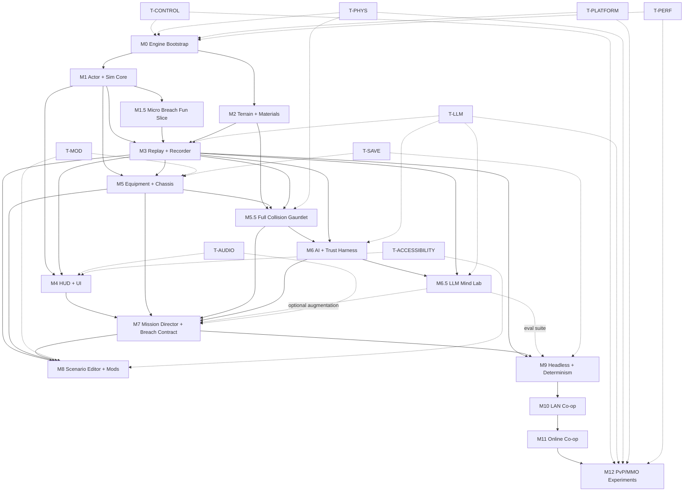

← [[spec/index|spec section]] · [[spec/authoritative-game-spec-v0|game spec v0]] · [[spec/native-implementation-backlog|native backlog]] · [[spec/full-collision-physics-plan|full collision plan]] · [[spec/ai-control-observability-layer|AI control/observability]] · [[spec/prototype-implementation-backlog-slice-a|historical HTML backlog]] · [[dashboards/research-readiness|readiness]] · [[decisions/index|decisions]] · [VAULT_PLAN.md](../../VAULT_PLAN.md) · [HTML-era snapshot](../research-log/2026-05-04-prototype-roadmap-html-snapshot.md)

# Native Build Roadmap

> [!summary] What this is
> The native development roadmap. Replaces the prior browser-lab-flavored roadmap in full. The project is a **greenfield Rust native game** built on Bevy + wgpu as foundation, with custom core crates for the systems that make this game special. Targets desktop-first (Win/Linux/macOS) at 4K/120 ceiling with 1080p/60 floor and Steam Deck 800p/60 compatibility, MMO-ready from day one, with first-class scenario editor and modding at launch.

> [!warning] Authority boundary
> This is a planning anchor. Milestones, ticket counts, and per-feature detail will move as evidence comes in. The structure (M0..M12 + side tracks) is committed. Specific timelines and ticket boundaries will be tuned per milestone.

---

## Table Of Contents

- [Read Order](#read-order)
- [Glossary](#glossary)
- [Agent Implementation Contract](#agent-implementation-contract)
- [Milestone Handoff Template](#milestone-handoff-template)
- [Human Playtest Checklist Template](#human-playtest-checklist-template)
- [Strategic Frame](#strategic-frame)
- [Stack At A Glance](#stack-at-a-glance)
- [Coordinate System And Units](#coordinate-system-and-units)
- [Repository Layout](#repository-layout)
- [Toolchain And Workspace Bootstrap](#toolchain-and-workspace-bootstrap)
- [Per-Crate AGENTS.md Template](#per-crate-agentsmd-template)
- [Logging, Tracing, And Error Policy](#logging-tracing-and-error-policy)
- [Asset And Placeholder Strategy](#asset-and-placeholder-strategy)
- [Testing Layers](#testing-layers)
- [CLI Reference](#cli-reference)
- [Control Transport And Envelope](#control-transport-and-envelope)
- [Scenario Manifest Schema](#scenario-manifest-schema)
- [Run-Bundle Naming Convention](#run-bundle-naming-convention)
- [Bug Log Format](#bug-log-format)
- [Inter-Milestone Bridges](#inter-milestone-bridges)
- [Per-Milestone Kickoff Smoke](#per-milestone-kickoff-smoke)
- [Milestone Map](#milestone-map)
- [Side Tracks](#side-tracks)
- [Milestone Details](#milestone-details)
  - [M0 — Engine Bootstrap](#m0--engine-bootstrap)
  - [M1 — Actor Controller And Sim Core](#m1--actor-controller-and-sim-core)
  - [M1.5 — Micro Breach Fun Slice](#m15--micro-breach-fun-slice)
  - [M2 — Pixel Terrain And Materials](#m2--pixel-terrain-and-materials)
  - [M3 — Replay And Event Recorder](#m3--replay-and-event-recorder)
  - [M4 — HUD And Comic-Noir UI](#m4--hud-and-comic-noir-ui)
  - [M5 — Equipment, Chassis, And Damage Grammar](#m5--equipment-chassis-and-damage-grammar)
  - [M5.5 — Full Collision Gauntlet](#m55--full-collision-gauntlet)
  - [M6 — AI Core And Trust Harness](#m6--ai-core-and-trust-harness)
  - [M6.5 — LLM Mind Lab](#m65--llm-mind-lab)
  - [M7 — Mission Director And Breach Contract Proof Mission](#m7--mission-director-and-breach-contract-proof-mission)
  - [M8 — Scenario Editor And Mod Tools](#m8--scenario-editor-and-mod-tools)
  - [M9 — Headless Server And Determinism Islands](#m9--headless-server-and-determinism-islands)
  - [M10 — LAN Co-op](#m10--lan-co-op)
  - [M11 — Online Co-op (Private)](#m11--online-co-op-private)
  - [M12 — PvP And MMO Experiments](#m12--pvp-and-mmo-experiments)
- [Side Track Details](#side-track-details)
  - [T-CONTROL — AI Control And Observability](#t-control--ai-control-and-observability)
  - [T-LLM — Async LLM Mind Layer](#t-llm--async-llm-mind-layer)
  - [T-PHYS — Full Collision And Physical Consequence](#t-phys--full-collision-and-physical-consequence)
  - [T-PLATFORM — Cross-Platform CI And Steam Deck](#t-platform--cross-platform-ci-and-steam-deck)
  - [T-MOD — Modding And Scripting](#t-mod--modding-and-scripting)
  - [T-AUDIO — Diegetic SFX And Captions](#t-audio--diegetic-sfx-and-captions)
  - [T-SAVE — Save Game System](#t-save--save-game-system)
  - [T-ACCESSIBILITY — Accessibility Floor](#t-accessibility--accessibility-floor)
  - [T-PERF — Performance Targets And Budgets](#t-perf--performance-targets-and-budgets)
- [Dependency Graph](#dependency-graph)
- [Feature Index](#feature-index)
- [Validation Command Matrix](#validation-command-matrix)
- [Bug Hunt Checklist](#bug-hunt-checklist)
- [Definition Of Done](#definition-of-done)
- [Milestone Done-Criteria Summary](#milestone-done-criteria-summary)
- [Risk Register](#risk-register)
- [Anti-Goals](#anti-goals)
- [Source Trail](#source-trail)

---

## Read Order

If you only have time to read three things before starting work:

1. [[spec/authoritative-game-spec-v0]] — what the game is.
2. This roadmap — what gets built and in what order.
3. [[spec/native-implementation-backlog]] — concrete native task cards for the current milestone.

If you have more time, also read: [[decisions/index]], [[dashboards/decision-tracker]], [[references/prototype-run-bundle-schema]], [[spec/ai-control-observability-layer]], [[references/usage-ledger]], [[research-log/moonshot-register]], [[prototypes/actor-feel-lab-a1-human-playtest-2026-05-04]] (the "ok I guess" signal that informs M1.5 acceptance), and [[spec/prototype-implementation-backlog-slice-a]] only as a historical/browser-lab backlog.

---

## Glossary

A junior agent must never have to guess what these words mean. If a term is used in this roadmap, the backlog, the AI control spec, or any task card, it lives here.

| Term | Meaning |
|---|---|
| **Actor** | A simulated entity with `Position`, `Velocity`, `Aim`, `Status`, and `Inventory`. Includes infantry, powered armor, and mech-pilot pairs. |
| **Action** | A semantic player-or-AI request to do something (move, fire, click UI). Routed through `cx-control` and consumed by sim systems on the next fixed tick. |
| **Anti-scope** | What a task card must NOT grow into. If you start drifting toward an anti-scope item, stop and write a follow-up task card instead. |
| **Bevy version** | Pinned in `Cargo.toml`; do not bump without a milestone's explicit upgrade task. |
| **Broadphase** | The cheap first collision pass that finds possible pairs using spatial structures. Required before narrowphase; brute-force all-pairs is not acceptable for gameplay scale. |
| **Capability gate** | A flag in the run manifest that explicitly enables a debug-only or remote-access feature. Default off. |
| **Chassis** | An armor/mech/origin grouping with layered armor zones, modules, and pilot binding. See [[spec/chassis-armor-mechs-and-origins]]. |
| **Checksum** | A bit-deterministic hash of actor/terrain/inventory state at a given tick used to detect replay drift. Algorithm: blake3. |
| **CCD** | Continuous collision detection. Used for fast or important bodies so projectiles, limbs, and mech parts do not tunnel through terrain, actors, shields, or each other. |
| **Collision class** | A named physical class (`actor_limb`, `held_weapon`, `projectile_kinetic`, `terrain_proxy`, etc.) that drives matrix rules, filters, CCD tier, and events. |
| **Collision filter reason** | Required reason string whenever two physical classes do NOT collide. Silent missing pairs are bugs. |
| **Collision matrix** | Data table that says which collision classes collide, sense, filter, damage, or ignore. M5.5 fails if a physical pair has no rule. |
| **Collision proxy** | Simplified shape used for physics/contact instead of raw art pixels. Examples: capsule limb, convex weapon, chunk terrain outline. |
| **Command core** | The rooted/uprooted/embedded strategic object that powers the base or boosts a chassis avatar. See [[spec/command-core-base-power]]. |
| **Contact manifold** | Narrowphase contact result: contact points, normal, depth, time-of-impact fraction, and impulse data. |
| **`cx-app`** | The Bevy app shell binary; the launcher that wires plugins. |
| **`cx-control`** | The crate that owns command/observation/UI-tree schemas and the local control server. |
| **`cxctl`** | The CLI binary for AI/dev control. During M0..M1 use `cargo run -p cxctl -- <subcommand>`; once installed/PATH-ed, `cxctl <subcommand>` is shorthand. |
| **`cx-e2e`** | A scripted end-to-end runner built on `cx-control`/`cxctl`. Used for milestone E2E proof. |
| **`cx-headless`** | The headless server binary; same sim, no renderer/audio, network-driven inputs. |
| **Determinism island** | A subsystem whose state is bit-deterministic given the same inputs and seed. Cosmetic systems are NOT in determinism islands. |
| **Doctrine** | A named AI policy bundle (cautious, aggressive, support, scout, sniper, etc.). Influences utility scoring weights. |
| **E2E** | End-to-end test: runs a scenario from CLI, drives it with `cxctl`/`cx-e2e`, asserts outcomes from observations/events, writes a run bundle. |
| **Event** | A typed record emitted by sim systems (combat/body/terrain/AI/mission/control/system/etc.). All player-visible behavior emits events. |
| **Event id** | Stable id of the form `<run_id>:<tick>:<seq>`. Globally unique per run. Used for parent-cause chains. |
| **Fixed tick** | The 60 Hz (or 120 Hz) sim cadence; render is decoupled and interpolates between ticks. |
| **Full collision** | Product promise that everything physical has collision identity and consequence unless explicitly filtered with tests and replay visibility. It does not mean naive all-pairs simulation. |
| **Junior agent** | The default reader/implementer of this roadmap. Treat them as competent in Rust and game programming basics, but assume they have NOT read CCCP source, the prior HTML lab, or the rest of this vault. |
| **`AiMindProposal`** | The strict-schema output an LLM mind worker may produce. Doctrine patches, squad orders, dialogue, memory writes; never raw actions. See [[spec/hybrid-llm-ai-plan]]. |
| **Manifest (run)** | `run_manifest.json` inside a run bundle. Identifies build, scenario, seed, schema versions, capabilities, expected tests. |
| **Mind frame** | A compact, fog-of-war-filtered observation packet sent to an LLM mind worker. Derived from the `cx-control` observation stream. |
| **Mind task** | A queued LLM request with kind, deadline, cost cap, observation, output schema. Async; never blocks sim. |
| **Mind worker** | An async background worker that consumes mind tasks and submits validated `AiMindProposal` results. Local AI never waits on it. |
| **Mock provider** | The deterministic LLM provider used by CI, AI-H, replay, and mind-lab tests. Always built. No API keys. |
| **Manifest (scenario)** | RON file in `content/scenarios/` describing teams, objectives, materials, command core, base systems, capability requirements, director config, save fields. |
| **Mission director** | The system that paces a scenario: reinforcement, LZ risk, objective escalation. Emits commander-decision events with reason labels. |
| **Module** | A chassis subcomponent with damage states (jet, shield, sensor, repair-drone, weapon-mount). Failures emit reason-labeled events. |
| **Narrowphase** | The exact collision pass for candidate pairs found by broadphase. Produces contact manifolds, TOI, impulses, and damage inputs. |
| **Observation** | A structured snapshot of game state delivered to `cxctl`/control clients. Includes clock, player context, actors, equipment, terrain patch, objectives, UI tree, captions, recent events, perf counters. |
| **Projectile-projectile collision** | Physical projectile contact such as bullet-bullet, bullet-rocket, or shell-shell. Kinetic rounds deflect/fragment/lose energy; explosive rounds may detonate or fuze-fail by profile. |
| **Reason label** | A short string explaining WHY the AI/mission/refusal/warning fired. Required on every AI choice and refusal. |
| **Recoil impulse** | The instantaneous velocity change applied to the firing actor; configurable per weapon preset. |
| **Role record** | The shared item meaning consumed by AI, UI, modding, balance, replay, backend, mission. See [[spec/equipment-loadout]]. |
| **Run** | One execution of a scenario from start to end (or abort). Identified by a unique `run_id`. |
| **Run bundle** | The directory `prototype_runs/native/<run_id>/` containing `run_manifest.json`, `events.jsonl`, `summary.json`, `notes.md`, `screenshots/`, `captures/`. |
| **`run_id`** | Unique per run. Format: `<milestone>_<UTC ISO-8601 with hyphens>_<short_hash>`, e.g. `m0_2026-05-04T22-30-00Z_a1b2c3d4`. |
| **Scenario** | A single playable unit identified by an id (`m0_blank`, `m1_actor_range`, `micro_breach`, `breach_contract`, ...). Loaded from a scenario manifest. |
| **Scenario id** | The string used by `--scenario <id>` flags. Maps 1:1 to a manifest file in `content/scenarios/<id>.ron`. |
| **Seed** | A `u64` deterministic seed for the run's RNG. Default: read from manifest; overridable via `--seed <u64>`. |
| **Side track** | A cross-cutting concern (T-CONTROL, T-LLM, T-PHYS, T-PLATFORM, T-MOD, T-AUDIO, T-SAVE, T-ACCESSIBILITY, T-PERF) with its own done-criteria that intersect every milestone. |
| **Snapshot** | A periodic full state dump (actor/inventory/terrain) used for replay anchoring and drift detection. |
| **Soft breach** | M1.5's stub destructible surface; replaced by M2's full chunked terrain without breaking replay consumers. |
| **Swept shape** | A moving ray/capsule/convex proxy tested across a tick to find impact before tunneling can occur. |
| **Tick** | A discrete sim step. Tick 0 is scenario start. Ticks are u64 monotonic. |
| **TOI** | Time of impact. Fraction of a tick at which a swept contact occurs. Used for high-speed projectile and critical body contacts. |
| **UI tree** | The structured representation of every UI element by stable id, role, label, state, bounds. Queryable/clickable through `cxctl ui ...`. |
| **World units** | Pixel-space coordinates. 1 unit = 1 logical pixel. Y is up. Origin at scene's defined anchor. |

---

## Agent Implementation Contract

This roadmap is intended to be assignable to an AI implementation agent one milestone at a time. A milestone is not complete because code compiles or a feature appears once. The agent must build, test, bug hunt, repair, document evidence, and update the vault.

### Required Agent Loop

| Phase | Required Action | Output |
|---|---|---|
| 1. Preflight | Read `AGENTS.md`, this roadmap, [[spec/native-implementation-backlog]], the milestone's linked DRs/specs, and current repo state. | Short implementation plan with write scope and anti-scope. |
| 2. Ownership | Name crates/files owned by the milestone and avoid unrelated edits. | Work happens in the milestone's owned crates plus explicit boundary crates. |
| 3. Build | Implement the smallest complete vertical slice that satisfies the task cards. | Code, assets, schema, and fixture changes. |
| 4. Unit/integration tests | Add or update tests for every new behavior, event, schema, and failure label. | `cargo test --workspace` passes. |
| 5. E2E run | Run the milestone reference scenario from the command line and produce a run bundle. | `prototype_runs/native/<milestone>_<timestamp>/`. |
| 6. Bug hunt | Actively search for crashes, replay drift, missing events, UI overlap, perf spikes, stale docs, and edge cases. | Bug log in the run notes plus fixes. |
| 7. Rerun | Rerun all validation after fixes. | Clean command matrix. |
| 8. Evidence | Update vault prototype/research notes with links to run bundle, screenshots, test output, and known gaps. | New or updated note under `cortext_command_vault/prototypes/` or `research-log/`. |
| 9. Final audit | Compare all milestone done-criteria and backlog task cards against actual evidence. | Final audit section in the vault note and concise handoff summary. |

### Agent-Completable Vs Human-Gated

| Gate Type | Meaning | Handling |
|---|---|---|
| Agent-completable | Can be proven by code, tests, scripted E2E, screenshots, replay checks, perf counters, or static analysis. | Agent must finish before stopping. |
| Human-gated | Requires project-owner playtest, multi-person playtest, accessibility tester feedback, platform hardware the agent cannot access, or subjective fun assessment. | Agent must prepare the build, scripted evidence, and playtest checklist; mark the gate `READY_FOR_HUMAN` instead of pretending it passed. |

No milestone should use a human-gated item to hide incomplete agent-completable work.

### Required Milestone Artifacts

| Artifact | Required For | Notes |
|---|---|---|
| Run bundle | Every milestone M0 onward. | `run_manifest.json`, `events.jsonl`, `summary.json`, `notes.md`, captures/screenshots when visual. |
| Test log | Every milestone. | Include exact commands run and pass/fail summary. |
| E2E scenario | Every milestone with gameplay/tool UI. | Scripted where possible; manual checklist when unavoidable. |
| Screenshot or capture | Visual/UI milestones and bug fixes. | Must be linked from `summary.json.artifacts`. |
| Perf counters | M0 onward, richer from M2 onward. | Frame time, sim tick cost, event volume, terrain dirty cost as applicable. |
| Replay/checksum report | M3 onward; earlier if events exist. | Drift reports must name first divergence. |
| Vault note | Every milestone. | New note under `prototypes/` or `research-log/` with final audit. |
| Known issues | Every milestone. | Must distinguish blockers from accepted follow-ups. |

---

## Milestone Handoff Template

Use this template when assigning a milestone to an AI agent.

```markdown
Goal: Implement milestone <M#> from cortext_command_vault/spec/native-implementation-backlog.md.

Context:
- Read AGENTS.md.
- Read cortext_command_vault/spec/authoritative-game-spec-v0.md.
- Read cortext_command_vault/spec/prototype-roadmap.md.
- Read cortext_command_vault/spec/native-implementation-backlog.md.
- Read the milestone's linked DRs/spec pages.

Write scope:
- Own only the crates/files named in the milestone task cards.
- Do not edit canonical reference repos.
- Keep unrelated refactors out.

Required loop:
1. Inspect current code and write a short plan.
2. Implement all task cards for the milestone.
3. Add unit/integration/E2E tests.
4. Run the validation command matrix.
5. Bug hunt and fix issues until green.
6. Produce a run bundle under prototype_runs/native/.
7. Update the vault with a prototype/research note and final audit.

Done when:
- Every agent-completable task card is complete.
- Validation commands pass.
- E2E scenario passes.
- Run-bundle checker passes.
- Known issues are documented.
- Human-gated items, if any, are marked READY_FOR_HUMAN with a playtest checklist.
```

---

## Human Playtest Checklist Template

When a milestone has a `READY_FOR_HUMAN_PLAYTEST` gate, the agent must produce this checklist as a markdown file co-located with the milestone vault note.

```markdown
# <Milestone> Human Playtest Checklist

Build hash: <git-sha>
Build platform(s) tested: <macOS/Linux/Windows>
Scenario(s) ready: <scenario_id list>
Estimated playtime: <X minutes per run; Y suggested runs>
Save needed before play: <yes/no>; if yes, path: <path>

## Pre-Flight (agent confirms)
- [ ] Build runs from a clean checkout: `cargo run -p cx-app -- --scenario <id>`.
- [ ] No panics in scripted smoke run.
- [ ] Run bundle from scripted run validates.
- [ ] Screenshot/capture of the starting scene attached.
- [ ] Reset path tested (ESC, restart scenario).

## Tester Tasks
1. Launch `cargo run -p cx-app -- --scenario <id>`.
2. Play <scenario> for <N> minutes.
3. Try each of: <list specific player actions to attempt>.
4. Note one Good, one Bad, one Meh (mandatory; verbatim).
5. If something crashes or feels broken, save the run bundle path and screenshot.

## Tester Capture Form
- Verbatim reaction (one paragraph): _________________________
- Did the scenario feel readable / boring / confusing / fun? _________________________
- One thing I would change first: _________________________
- Did anything crash? <y/n>; if yes, what: _________________________
- Did the HUD ever lie or hide information you needed? _________________________
- Run bundle path (if any): prototype_runs/native/<run_id>/

## Acceptance For Milestone
The milestone is fully done when:
- Tester has played at least <N> runs.
- Verbatim reaction is recorded in a vault note.
- Any crashes are filed as bugs and triaged.
- Acceptance criteria from the milestone done-criteria are confirmed by tester observation, not just by agent claim.
```

---

## Strategic Frame

| Dimension | Commitment |
|---|---|
| Engine direction | Greenfield native; CCCP is read-only reference (DR-001). |
| Native stack | Rust + Bevy/wgpu hybrid + custom core crates (DR-024). |
| Target platforms | Desktop-first: Windows, Linux, macOS. Steam Deck 800p/60 floor. Headless Linux server later. Web only for labs/tools/demos. No mobile (DR-025). |
| Team model | AI-augmented solo/small-core. Modular repo so AI agents can own crates without breakage (DR-026). |
| Pacing & control | Hybrid real-time tactical. Direct possession optional. Strategy-first valid (DR-015 + DR-026). |
| Multiplayer phasing | MMO-ready architecture from day one; ship solo-first first. Solo lab → split-screen → LAN co-op → online co-op → PvP/MMO (DR-005 + DR-026). |
| Visual fidelity | Target 4K/120 strong desktop; floor 1080p/60; Steam Deck 800p/60. Pixel-sim battlefield + comic-noir UI + scalable SDF/vector text + 200% UI scaling (DR-019 + DR-028). |
| Audio | Diegetic industrial synth-dread; audio-as-tactical-UI; mandatory captions (DR-020). |
| Sim model | Fixed 60/120 Hz islands; AI/terrain budgeted-async; deterministic where it earns its keep. |
| Scenario editor | First-class at launch. Same manifest format for official, procedural, player-authored (DR-017 + DR-030). |
| Base layer | Deep combat-base (command core + power grid + shields + turrets + sensors + doors + repair pads + hangar + storage + traps + breachable structure). NOT full colony sim (DR-027). |
| Save game | Versioned local-first campaign saves + replay/run bundles. Multiple slots, autosave, ironman, scenario policies, migration-safe (DR-029). |
| Content economy | Premium game + free modding. Expansions/DLC/cosmetics later. No core-mechanic monetization (DR-031). |
| Modding | Schema-first + scripting (Lua/Rhai TBD); package builder + validator; first-class at launch (DR-006). |
| Async LLM mind layer | Optional async "mind" workers (cloud or local) propose doctrine, memory, personality, debriefs, commander adaptation through strict `AiMindProposal` schemas. **Local AI never blocks on an LLM. No API key required for the core game, CI, or AI-H** (DR-032). See T-LLM + M6.5. |
| Physical collision | Full collision is a core game-feel promise: weapons, limbs, bodies, armor, mechs, objects, terrain, shields, base parts, debris, and projectiles collide by default unless an explicit tested filter says otherwise. Implemented through T-PHYS + M5.5 (DR-033), not brute-force all-pairs. |

---

## Stack At A Glance

| Layer | Choice | Why |
|---|---|---|
| Language | Rust (edition 2021+) | Memory safety, predictability for determinism, excellent ECS ecosystem, AGPL-clean separation from CCCP's C++. |
| App shell / windowing / input / asset pipeline / hot reload | Bevy | Mature, ECS-native, good docs, fast iteration, cross-platform. Use Bevy's plugin system as our extension point. |
| Renderer foundation | wgpu via Bevy where it fits; **custom wgpu-first** for terrain/sprite/particle hot paths | Need 4K/120 + chunked terrain textures + GPU-assisted carving. Off-the-shelf 2D renderers don't deliver that ceiling. |
| ECS | Bevy ECS | Schedule, parallelism, world model are excellent. Custom systems plug in cleanly. |
| Sim core | **Custom crate** with fixed-tick scheduler | Bevy's frame loop is for rendering; sim must run on a fixed-tick deterministic island. |
| Pixel terrain | **Custom crate** | Chunked, GPU-assisted, mutable per-pixel material. Off-the-shelf has no answer. |
| Physics/collision | **Custom crate** with staged broadphase/narrowphase/CCD | Need full collision matrix, projectile-projectile contacts, terrain chunk proxies, limb/equipment/mech contacts, impulse-to-damage, replay-visible contact events, and 4K/120 budgets (DR-033). |
| Body/chassis/mech model | **Custom crate** | DR-014/021 chassis grammar is unique to this project. |
| AI | **Custom crate** | DR-022 humanlike-bar means perception/memory/doctrine/adaptation; not off-the-shelf. |
| Replay/event | **Custom crate** | DR-002/DR-018 event taxonomy + scenario manifest + run-bundle schema. |
| AI/dev control | **Custom crate + CLI** | `cx-control` schemas plus `cxctl` so agents/tests can observe and act without screenshots. |
| Networking | **Custom crate** built on a transport (lightyear / renet / quinn TBD) | DR-005 MMO-ready architecture. Authority boundaries, snapshot/event hybrid, deterministic islands. |
| Save | **Custom crate** | DR-029 versioned + migration-safe + replay-linked. |
| UI | egui (Bevy plugin) for tools/workbench; **custom Bevy UI or egui-skinned** for game HUD | Comic-noir UI requires control egui can't fully give; tools can use egui. |
| Audio | Bevy audio backend or kira | Diegetic-first mix; caption events drive subtitle UI. |
| Modding scripts | mlua (Lua) or Rhai — pick during M8 | Lua is familiar; Rhai is Rust-native. Decide based on M5/M6 needs. |
| Build / CI | cargo + GitHub Actions (Win/Linux/macOS matrix) | Per DR-025. |

### Stack Question: Why Not C + raylib + stb?

This was evaluated as a stack sanity check, not as a new formal product decision. The roadmap stays on Rust + Bevy/wgpu because the target is not only "draw a fast 2D game." The target is 4K/120, destructible pixel terrain, replay/debug, save migration, humanlike AI, modding/workbench tooling, future headless/network architecture, and AI-agent-heavy implementation.

Full comparison note: [[references/rust-bevy-wgpu-vs-c-raylib-stb]].

| Area | Rust + Bevy/wgpu + custom crates | C + raylib + stb |
|---|---|---|
| Raw control | High. | Highest. |
| Time to first pixels | Medium. | Excellent. |
| 4K/120 renderer path | Strong with custom wgpu hot paths. | Possible, but OpenGL-first and more custom work. |
| GPU terrain/compute future | Strong: Vulkan, Metal, DX12, WebGPU through wgpu. | Weaker: raylib is OpenGL-centered. |
| AI-agent coding safety | Strong: Rust types, crates, tests, compiler catches many mistakes. | Riskier: memory bugs, pointer lifetime, data races, and ownership mistakes are easier. |
| Modular repo ownership | Excellent with Cargo workspace crates. | Possible, but more manual build/API discipline. |
| Replay/save/schema/event systems | Excellent with Rust types and serialization ecosystem. | Possible, but more hand-rolled. |
| UI/workbench/editor | Better via Bevy, egui, custom tooling, and typed data. | Mostly custom work. |
| Modding pipeline | Better for schema validation, package diagnostics, source provenance, and migration. | Possible, but more hand-rolled. |
| Long-term engine quality | Better fit for this project's ambition. | Better fit only for a minimalist handmade engine. |

Allowed use of raylib/stb: throwaway prototypes, asset converters, image utilities, procedural terrain experiments, minimal-dependency benchmarks, and reference implementations. Do not let those side experiments become the product engine by inertia.

---

## Coordinate System And Units

| Concept | Choice | Why |
|---|---|---|
| Coordinate space | World units = pixels at 1× zoom. | Pixel-sim battlefield maps cleanly to world units; render scale handles zoom. |
| Y axis | Y is up. | Right-handed, matches `glam` defaults; gravity pulls toward `-Y`. |
| Origin | Scenario manifest's declared anchor (default `(0, 0)` at the bottom-left of the playable region). | Predictable for content authors. |
| Scale | One actor head ≈ 8 px tall. Mech (light) ≈ 24 px. Heavy mech ≈ 48 px. | Keeps Cortex/Liero/Soldat readability. |
| Time | `f32` seconds for render; `u64` ticks for sim. 1 tick = 1/60 s by default; 1/120 s in 120 Hz mode. | Sim is integer-tick, render is fractional-second. |
| Gravity | Default `-980.0` world units per second² (≈ 9.8 m/s² in pixel space if 1 px ≈ 1 cm). | Tunable per scenario manifest. |
| Velocity | `Vec2<f32>` world units per second. | Render decoupling expects float velocities. |
| Mass | `f32` kilograms. | Used by recoil, momentum, projectile impulse. |
| Angles | Radians, `f32`. Aim is a unit `Vec2`. | Match `glam` and avoid degree/radian confusion. |
| Linear maths | `glam::Vec2`, `glam::Vec3` (rare), `glam::IVec2` for grid coords. | Match Bevy. |
| Random | Deterministic per-run via `rand_xoshiro::Xoshiro256StarStar` seeded from manifest. Wrapped by `cx-sim-core::Rng`. NEVER call `rand::thread_rng` or system time inside sim islands. | Fixed seed → reproducible; wrap forces audit. |
| Floating point | All sim-tick math uses `f32`. No `f64` inside sim islands. Fixed-point used for terrain checksum input only. | f32 is consistent across platforms when the same instructions are emitted. |
| Bit-determinism note | Cross-platform bit-deterministic `f32` is NOT guaranteed by IEEE on all CPUs/compilers. The determinism contract uses checksums of *quantized* state at snapshot boundaries, not raw float comparisons. See [[systems/replay-determinism-and-run-evidence]]. |

---

## Repository Layout

Modular crate workspace so AI agents can own separate crates per DR-026:

```
cortex-game/                          # cargo workspace root
├── Cargo.toml                        # workspace + shared deps
├── crates/
│   ├── cx-app/                       # binary; thin Bevy app shell + plugin wiring
│   ├── cx-sim-core/                  # fixed-tick scheduler, time, RNG, deterministic islands
│   ├── cx-terrain/                   # chunked pixel terrain + materials + GPU carving
│   ├── cx-physics/                   # custom 2D physics (collision, atom-style probes)
│   ├── cx-actor/                     # actor components, controller intent layer
│   ├── cx-chassis/                   # armor/mech/origin grammar (DR-014/021)
│   ├── cx-equipment/                 # role records, modules, jam/eject/repair
│   ├── cx-ai/                        # perception, memory, utility, doctrine, reason labels (DR-022)
│   ├── cx-mission/                   # scenario manifest, director, objectives, command-core (DR-017)
│   ├── cx-replay/                    # event taxonomy, run bundle, snapshots, checksums (DR-002)
│   ├── cx-control/                   # command/observation schemas, action routing, UI tree contracts
│   ├── cxctl/                        # CLI binary for AI/dev control: observe, act, step, assert, bundle
│   ├── cx-e2e/                       # scripted end-to-end runner built on cx-control/cxctl
│   ├── cx-save/                      # versioned save, migration, ironman policies (DR-029)
│   ├── cx-net/                       # authority, snapshots, transport adapter (DR-005)
│   ├── cx-render-2d/                 # custom wgpu pipelines: chunked terrain, sprite batching, particles
│   ├── cx-ui/                        # comic-noir HUD, mission cards, accessibility
│   ├── cx-audio/                     # diegetic mix, caption events
│   ├── cx-mod/                       # mod loader, schema validator, script host
│   ├── cx-tools-editor/              # in-engine scenario/package workbench (DR-030)
│   ├── cx-headless/                  # headless server binary
│   └── cx-bench/                     # perf harness
├── assets/                           # sprites, audio, manifests, scenes
├── content/                          # base game packages (data + manifests + scripts)
├── tools/                            # scripts, generators, run-bundle checker
├── tests/                            # integration tests
└── docs/                             # design/architecture notes (links into vault)
```

Each crate is owned by an explicit feature/agent boundary. Inter-crate boundaries are defined by traits and event types, not by reaching into each other's structs.

---

## Toolchain And Workspace Bootstrap

This is the M0 day-zero recipe. A junior agent assigned M0 must produce these files first, BEFORE any feature code, and verify them with the kickoff smoke (see [Per-Milestone Kickoff Smoke](#per-milestone-kickoff-smoke)).

### `rust-toolchain.toml` (in `cortex-game/`)

```toml
[toolchain]
channel = "1.84.0"
components = ["rustfmt", "clippy"]
profile = "default"
```

Pin Rust at a specific stable. Update only on a deliberate task (own row in the milestone audit), never as a side effect.

### Workspace `Cargo.toml`

```toml
[workspace]
resolver = "2"
members = [
  "crates/cx-app",
  "crates/cx-sim-core",
  "crates/cx-terrain",
  "crates/cx-physics",
  "crates/cx-actor",
  "crates/cx-chassis",
  "crates/cx-equipment",
  "crates/cx-ai",
  "crates/cx-mission",
  "crates/cx-replay",
  "crates/cx-control",
  "crates/cxctl",
  "crates/cx-e2e",
  "crates/cx-save",
  "crates/cx-net",
  "crates/cx-render-2d",
  "crates/cx-ui",
  "crates/cx-audio",
  "crates/cx-mod",
  "crates/cx-tools-editor",
  "crates/cx-headless",
  "crates/cx-bench",
]

[workspace.package]
version = "0.0.1"
edition = "2021"
rust-version = "1.84"
license = "Apache-2.0 OR MIT"
publish = false

[workspace.dependencies]
bevy = { version = "0.14", default-features = false, features = ["bevy_winit", "bevy_render", "bevy_core_pipeline", "bevy_sprite", "bevy_text", "bevy_ui", "x11"] }
glam = "0.27"
serde = { version = "1", features = ["derive"] }
serde_json = "1"
ron = "0.8"
thiserror = "1"
anyhow = "1"
tracing = "0.1"
tracing-subscriber = { version = "0.3", features = ["env-filter"] }
rand_xoshiro = "0.6"
blake3 = "1"
clap = { version = "4", features = ["derive", "env"] }
tokio = { version = "1", features = ["rt-multi-thread", "macros", "net", "io-util", "sync", "time"] }
tokio-tungstenite = "0.23"
jsonrpsee = { version = "0.24", features = ["server", "client", "ws-client", "macros"] }
schemars = "0.8"

[profile.dev]
opt-level = 1

[profile.dev.package."*"]
opt-level = 3

[profile.release]
lto = "thin"
codegen-units = 1
debug = true   # keep debug info in release for crash triage
```

Rationale for the dep set:

| Dep | Used By |
|---|---|
| `bevy` | `cx-app`, `cx-render-2d`, `cx-ui`, `cx-tools-editor`, `cx-audio`. |
| `glam` | All sim/physics/render crates. |
| `serde` + `serde_json` + `ron` | Replay, save, scenario manifests, control envelope. |
| `thiserror` + `anyhow` | Error policy below. |
| `tracing` + `tracing-subscriber` | Logging policy below. |
| `rand_xoshiro` | Deterministic RNG. |
| `blake3` | Checksums + content hashing. |
| `clap` | CLI flags for `cx-app`, `cxctl`, `cx-e2e`, `cx-headless`, `cx-bench`, `cx-mod`. |
| `tokio` + `tokio-tungstenite` + `jsonrpsee` | Local control server + `cxctl` client. |
| `schemars` | JSON-Schema generation for control envelope versioning. |

### `rustfmt.toml`

```toml
edition = "2021"
max_width = 120
use_small_heuristics = "Max"
imports_granularity = "Crate"
group_imports = "StdExternalCrate"
reorder_imports = true
reorder_modules = true
newline_style = "Unix"
```

### `clippy.toml`

```toml
avoid-breaking-exported-api = false
too-many-arguments-threshold = 8
type-complexity-threshold = 250
disallowed-methods = [
  { path = "rand::thread_rng", reason = "Use cx-sim-core::Rng inside sim islands; wrap in cx-control for non-sim helpers." },
  { path = "std::time::SystemTime::now", reason = "Use sim tick or cx-sim-core::WallClock to keep determinism intact." },
]
```

### `.cargo/config.toml`

```toml
[build]
rustflags = ["-D", "warnings"]

[alias]
ci-fmt = "fmt --all -- --check"
ci-check = "check --workspace --all-targets"
ci-clippy = "clippy --workspace --all-targets -- -D warnings"
ci-test = "test --workspace"
xtask = "run -p xtask --"

[target.x86_64-pc-windows-msvc]
linker = "rust-lld.exe"

[target.aarch64-apple-darwin]
rustflags = ["-C", "link-arg=-Wl,-rpath,@loader_path"]
```

### `.gitignore` (in `cortex-game/`)

```
/target
**/*.rs.bk
Cargo.lock.bak

# IDE
/.idea
/.vscode
*.iml

# Run bundles produced by local runs in-tree
/prototype_runs/native/local_*

# OS
.DS_Store
Thumbs.db
```

### `.github/workflows/ci.yml`

```yaml
name: ci
on:
  pull_request: {}
  push:
    branches: [main]
jobs:
  test:
    strategy:
      fail-fast: false
      matrix:
        os: [ubuntu-latest, macos-latest, windows-latest]
    runs-on: ${{ matrix.os }}
    defaults:
      run:
        working-directory: cortex-game
    steps:
      - uses: actions/checkout@v4
      - name: Install Linux deps
        if: runner.os == 'Linux'
        run: |
          sudo apt-get update
          sudo apt-get install -y libasound2-dev libudev-dev libxkbcommon-dev libwayland-dev
      - uses: dtolnay/rust-toolchain@stable
        with:
          toolchain: 1.84.0
          components: rustfmt, clippy
      - uses: Swatinem/rust-cache@v2
      - name: cargo fmt
        run: cargo fmt --all -- --check
      - name: cargo check
        run: cargo check --workspace --all-targets
      - name: cargo clippy
        run: cargo clippy --workspace --all-targets -- -D warnings
      - name: cargo test
        run: cargo test --workspace
      - name: cxctl observe smoke
        run: cargo run -p cxctl -- observe --once --scenario m0_blank
      - name: run-bundle smoke
        run: |
          cargo run -p cxctl -- run --scenario m0_blank --ticks 300 --write-run-bundle
          python3 ../research_tools/prototype_run_check.py prototype_runs/native/m0_*
```

### Bootstrap Command Sequence (for M0)

```bash
mkdir -p cortex-game/crates
cd cortex-game
# create rust-toolchain.toml, Cargo.toml, rustfmt.toml, clippy.toml, .cargo/config.toml, .gitignore as above
for crate in cx-app cx-sim-core cx-terrain cx-physics cx-actor cx-chassis cx-equipment \
             cx-ai cx-mission cx-replay cx-control cxctl cx-e2e cx-save cx-net cx-render-2d \
             cx-ui cx-audio cx-mod cx-tools-editor cx-headless cx-bench; do
  case "$crate" in
    cx-app|cxctl|cx-e2e|cx-headless|cx-bench) crate_kind="--bin" ;;
    *) crate_kind="--lib" ;;
  esac
  cargo new $crate_kind crates/$crate --name $crate
done
# Add per-crate deps from workspace.dependencies, write minimal lib.rs/main.rs stubs.
cargo check --workspace --all-targets
```

The per-crate `Cargo.toml` for a library follows the template below. For a binary crate, add a `bin` array-of-tables entry with `name` and `path` (omit for crates whose binary entry is the default `src/main.rs`).

```toml
[package]
name = "cx-sim-core"
version.workspace = true
edition.workspace = true
rust-version.workspace = true
license.workspace = true
publish.workspace = true

[dependencies]
glam = { workspace = true }
serde = { workspace = true }
thiserror = { workspace = true }
tracing = { workspace = true }
rand_xoshiro = { workspace = true }
blake3 = { workspace = true }
```

---

## Per-Crate AGENTS.md Template

Every crate gets a top-level `AGENTS.md` with this exact skeleton. Junior agents read it before touching the crate.

```markdown
# <crate-name> — AGENTS.md

## Owns
- <bullet list of responsibilities>

## Public API Boundary
- <traits, types, events this crate exposes; everything else is private>

## Does NOT Own
- <bullet list of anti-scope; redirect to other crates>

## Test Surface
- Unit tests: `cargo test -p <crate-name>`
- Integration tests: `tests/<scenario>.rs`
- Required event categories in run bundles: <list>

## Cross-Crate Contracts
- Depends on: <crates>
- Depended on by: <crates>
- Event names this crate emits: <list>
- Event names this crate consumes: <list>

## Common Pitfalls
- <known traps; e.g. "do not call rand::thread_rng inside sim systems">

## Source Trail
- Vault links to relevant DRs, specs, and design notes.
```

---

## Logging, Tracing, And Error Policy

### Logging

- Use `tracing`. Never use `println!`, `eprintln!`, or `log::`.
- Top-level binaries (`cx-app`, `cxctl`, `cx-e2e`, `cx-headless`, `cx-bench`, `cx-mod`) initialize `tracing-subscriber` in `main()` with `EnvFilter::try_from_default_env().unwrap_or_else(|_| EnvFilter::new("info,cx_=debug"))`.
- Spans: every fixed sim tick wraps in `tracing::trace_span!("sim_tick", tick = %tick)`. Every scenario load wraps in `tracing::info_span!("scenario", id = %scenario_id, run = %run_id)`.
- Log levels:
  - `error!`: actual bugs, panics-narrowly-avoided, replay drift, scenario load failures.
  - `warn!`: non-fatal degradation (recorder dropped events, perf budget missed, package validation warning).
  - `info!`: lifecycle (run started/finished, scenario loaded, control client connected).
  - `debug!`: per-frame perf samples, AI decisions, terrain dirty regions.
  - `trace!`: per-tick sim/system traces.
- Targets: every crate sets `TARGET = "cx::<short>"`, e.g. `cx::sim`, `cx::ai`, `cx::ctl`, `cx::ui`, `cx::net`. Filters use these.

### Error Policy

| Layer | Pattern | Why |
|---|---|---|
| Inside sim systems | `Result<T, cx_sim_core::SimError>` with `thiserror`-derived enums; never panic on bad data. | Panicking inside the sim breaks replay parity. |
| Library boundaries | Crate-specific error enums via `thiserror`; no `anyhow` in lib crates. | Callers can match on variants. |
| Binaries (`cx-app`, `cxctl`, etc.) | `anyhow::Result<()>` at `main()`; convert library errors with `?`. | Concise top-level error surface. |
| Scenario/manifest loading | Errors include the file path, line/col when possible, and a fix-hint. | Junior agents need to know where to look. |
| Control envelope | Every command response is `accepted`, `rejected`, or `queued`, with reason label and effective tick. | Spec'd in [Control Transport](#control-transport-and-envelope). |
| Panic policy | Panic ONLY for invariant violations the agent can never recover from (poisoned mutex, malformed compile-time fixture). All recoverable failures return `Result`. | Panics destroy replay determinism. |

### Reporting

- Every `error!`/`warn!` increments a counter visible in `summary.json.event_counts.by_severity`.
- Every panic (caught by `std::panic::set_hook`) writes a final `system.panic` event with backtrace before the process exits. The hook is installed by every binary in `main()`.

---

## Asset And Placeholder Strategy

Until M5 chassis art arrives, milestones use procedurally generated or simple-PNG placeholders. The agent commits placeholders under `cortex-game/assets/placeholders/` with a stable file naming scheme. Real art replaces placeholders by file-name swap.

| Asset | Location | M0..M4 Source | M5+ Source |
|---|---|---|---|
| Actor sprite (infantry) | `assets/placeholders/actors/infantry_idle.png` | 16×16 procedurally drawn at build time, OR a checked-in 16×16 PNG with bright distinct colors for parts. | Hand-authored pixel art per chassis archetype. |
| Materials | `assets/placeholders/materials/<name>.png` | Solid 1×1 colored swatch per material id. | Hand-authored per material. |
| Audio cues | `assets/placeholders/audio/<event>.ogg` | 200ms sine/square synth blips at distinct frequencies. | Diegetic synth-dread per [[spec/audio-identity]]. |
| Fonts | `assets/placeholders/fonts/<name>.ttf` | Use a permissively licensed monospace + display pair (e.g. JetBrains Mono + Press Start 2P; check usage-ledger). | Final SDF/vector text per [[decisions/dr-019-visual-direction]]. |
| Sprites for HUD | `assets/placeholders/ui/<element>.png` | 9-slice or solid-color rectangles. | Comic-noir UI per DR-019. |

Every placeholder logged in [[references/usage-ledger]] with license. Generated placeholders: include the generator script under `tools/asset_gen/`. Do not let placeholders linger after final art ships.

---

## Testing Layers

| Layer | Where | What It Tests | Required Starting |
|---|---|---|---|
| Unit | `crates/<crate>/src/...` `#[cfg(test)] mod tests {}` | Pure functions, type roundtrips, schema serialization, math helpers, error variants. | M0 |
| Integration | `crates/<crate>/tests/*.rs` | Cross-module behavior within a crate; deterministic scenarios that build small fixtures. | M0 |
| Workspace integration | `cortex-game/tests/*.rs` | Cross-crate behavior (e.g. sim + replay + control all in one process). | M1 |
| E2E | `cargo run -p cx-e2e -- --scenario <id> --script <name>` | Full scenario run from CLI, asserts via observations + events; writes run bundle. | M1.5 |
| Replay | `cargo run -p cx-headless -- replay <run-bundle> --verify-checksums` | A previously captured run replays headlessly to identical checksums. | M3 |
| Determinism | `cargo run -p cx-bench --bin determinism -- --seed-set seeds.json --runs 100` | Same seed produces same checksum 100/100 runs across the test matrix. | M9 |
| Perf | `cargo run -p cx-bench -- --scenario <id> --profile milestone` | Frame budget, sim cost, event volume, dirty cost; outputs `bench_report.json` artifact. | M2 |
| Accessibility smoke | `cargo run -p cx-e2e -- --scenario <id> --ui-scale 2.0 --high-contrast --verify-focus` | Layout doesn't break at 200%; focus traversal reaches every interactable; captions fire. | M4 |
| Save roundtrip | `cargo run -p cx-e2e -- --scenario <id> --save-load-roundtrip --verify-checksums` | Save → load reproduces identical state. | M5/T-SAVE |
| Network alignment | `cargo run -p cx-headless -- replay-compare <client-a-bundle> <client-b-bundle>` | Two clients' bundles align tick-for-tick. | M10 |

Naming convention: integration test files use the format `<feature>_<scenario>.rs` (e.g. `terrain_carve_lane.rs`). Test names use snake_case and include the assertion (`fn carve_through_dirt_emits_terrain_carved_event()`).

---

## CLI Reference

Single source of truth for every CLI flag. If a flag exists in the codebase but not in this table, it is undocumented and must be added or removed.

### `cx-app`

| Flag | Type | Default | Meaning |
|---|---|---|---|
| `--scenario <id>` | string | required | Scenario id; loads `content/scenarios/<id>.ron`. |
| `--seed <u64>` | u64 | from manifest | Override the manifest's seed. |
| `--run-seconds <f32>` | f32 | unlimited | Auto-exit after N wall-seconds. Useful for smoke tests. |
| `--ticks <u64>` | u64 | unlimited | Auto-exit after N sim ticks. |
| `--write-run-bundle` | flag | false | Emit run bundle on exit. |
| `--run-bundle-dir <path>` | path | `prototype_runs/native/` | Override run-bundle root. |
| `--control-api` | flag | false | Open the local control server (see [Control Transport](#control-transport-and-envelope)). |
| `--control-port <u16>` | u16 | 17890 | Bind port for control server (loopback only). |
| `--control-uds <path>` | path | none | Optional Unix domain socket path for the control server (POSIX only). |
| `--headless-smoke` | flag | false | Skip window creation, run sim only, exit cleanly. |
| `--debug-capabilities <list>` | comma list | empty | Enables capability-gated debug actions; recorded in manifest. |
| `--ui-scale <f32>` | f32 | 1.0 | Initial UI scale factor. |
| `--high-contrast` | flag | false | Enables high-contrast palette. |

### `cxctl`

`cxctl` is the CLI client. During M0..M1, run as `cargo run -p cxctl -- <subcommand>`. After install, `cxctl <subcommand>` is shorthand.

| Subcommand | Purpose | Key Flags |
|---|---|---|
| `observe --once` | Print one observation snapshot to stdout. | `--format json|ron`, `--scenario <id>` (auto-launches if no app is running and `--auto-launch`). |
| `observe --stream --hz <N>` | Stream observations at N Hz to stdout. | `--format json`, `--filter <category>`. |
| `observe --mind-frame <scope>` | Print one compact, fog-of-war-filtered `MindObservationFrame` for an LLM mind worker. | `<scope>` ∈ `actor`, `squad`, `faction`, `mission_director`, `post_mission`. Optional `--ref <id>` to pin the actor/squad/faction. Optional `--once`/`--stream`. Output is the JSON payload of the `MindObservationFrame`. |
| `act <action> ...` | Send a single semantic action; returns accepted/rejected. | `<action>` from the action grammar; see [Action Model](#control-transport-and-envelope). |
| `ui tree` | Print the current UI tree. | `--scope <window\|focused\|all>`. |
| `ui click <id>` | Click a UI element by stable id. | `--scope <window\|focused>`. |
| `ui set <id> <value>` | Set a slider/select value. | `--unit <px\|pct\|raw>`. |
| `scenario load <id>` | Load and ready a scenario. | `--seed <u64>`. |
| `pause` / `step --ticks <N>` / `resume` | Sim control. | — |
| `run --ticks <N> --write-run-bundle` | Run for N ticks unattended; emit bundle. | `--scenario <id>`, `--seed <u64>`. |
| `script run <name>` | Execute a control script. Scripts live in `cortex-game/scripts/cxctl/<name>.cxctl.json`. | `--write-run-bundle`, `--expect <kv>`, `--timeout-ticks <N>`. |
| `assert <key> <op> <value>` | Assert a key from the latest observation; non-zero exit on fail. | Ops: `==`, `!=`, `<`, `>`, `>=`, `<=`. |
| `replay verify <run-dir>` | Replay a run bundle and verify checksums. | `--first-divergence`. |

### `cx-e2e`

| Flag | Default | Meaning |
|---|---|---|
| `--scenario <id>` | required | Scenario id. |
| `--script <name>` | required if not `--manual` | Named cxctl script. |
| `--expect <kv>` | optional, repeatable | `key=value` assertion against final observation. |
| `--write-run-bundle` | false | Emit a run bundle on completion. |
| `--ui-scale <f32>` | 1.0 | UI scale for accessibility runs. |
| `--high-contrast` | false | High-contrast mode. |
| `--verify-focus` | false | Walk all focusable UI elements and assert focus reaches each. |
| `--save-load-roundtrip` | false | Save mid-run, load, continue, verify state checksums. |
| `--verify-checksums` | false | Verify deterministic checksums match between live and replay paths. |

### `cx-headless`

| Flag | Default | Meaning |
|---|---|---|
| `--scenario <id>` | required | Scenario id. |
| `--seed <u64>` | from manifest | Seed override. |
| `--ticks <u64>` | required | Run length in ticks. |
| `replay <run-dir>` | subcommand | Replay a captured run. |
| `replay-compare <a> <b>` | subcommand | Tick-by-tick compare two run bundles. |
| `--verify-checksums` | false | Verify deterministic checksums. |
| `--first-divergence` | false | On replay diverge, dump the first divergence. |
| `--bind <addr>` | `127.0.0.1:0` | Network bind for net-driven mode. |

### `cx-bench`

| Flag | Default | Meaning |
|---|---|---|
| `--scenario <id>` | required | Scenario id. |
| `--profile <milestone>` | required | Pulls perf budget targets per milestone (e.g. `m2`, `m7`). |
| `--runs <N>` | 5 | Repeat count for averaging. |
| `--write-bench-report` | false | Emit `bench_report.json`. |

### `cx-mod`

| Subcommand | Purpose |
|---|---|
| `validate <paths...>` | Validate scenario/package manifests; exit non-zero on errors. |
| `build <pkg-dir>` | Build a deterministic `.cxpkg`. |
| `inspect <.cxpkg>` | Print loader graph + provenance. |
| `--strict` | Treat warnings as errors. |

---

## Control Transport And Envelope

`cx-control` is the contract layer. Pinning these choices removes ambiguity for every E2E and observation task.

### Transport (Pinned)

| Property | Choice |
|---|---|
| Default bind | `127.0.0.1:17890` (loopback only). |
| Optional UDS | `--control-uds <path>` for POSIX. Disabled by default. |
| Protocol | JSON-RPC 2.0 over WebSocket. |
| Framing | One JSON-RPC envelope per WebSocket text frame. Binary frames reserved for future snapshot blobs. |
| Auth | None for loopback. Remote bind requires `--control-token <token>` (off by default; see DR-005 / DR-013). |
| Heartbeat | Server pings every 5 s; client must respond within 5 s or be disconnected. |
| Schema versioning | Every request carries `schema_version: u32`. Server rejects mismatches with `code -32602` (`InvalidParams`) and a fix-hint. |

### Envelope Shape

All requests / responses use JSON-RPC 2.0:

```json
{ "jsonrpc": "2.0", "id": 7, "method": "act.move", "params": { "schema_version": 1, "x": 1.0 } }
```

```json
{ "jsonrpc": "2.0", "id": 7, "result": { "schema_version": 1, "status": "accepted", "effective_tick": 1234, "reason": null } }
```

```json
{ "jsonrpc": "2.0", "id": 7, "error": { "code": -32099, "message": "command_rejected", "data": { "reason": "actor_downed", "tick": 1234 } } }
```

Streaming (observations) uses JSON-RPC notifications:

```json
{ "jsonrpc": "2.0", "method": "observe.frame", "params": { "schema_version": 1, "tick": 1234, "actors": [...], "ui_tree": {...}, "events_since": 1212, "events": [...] } }
```

### Method Catalog (Initial)

| Method | Direction | Purpose |
|---|---|---|
| `scenario.load` | client → server | Load scenario id with optional seed. |
| `scenario.reset` | client → server | Reset to scenario start. |
| `sim.pause` / `sim.resume` / `sim.step` | client → server | Sim control. |
| `sim.run_for_ticks` | client → server | Auto-step N ticks then pause. |
| `observe.once` | client → server | One-shot observation. |
| `observe.subscribe` / `observe.unsubscribe` | client → server | Streaming observations. |
| `observe.frame` | server → client (notification) | Streaming observation. |
| `act.<family>.<verb>` | client → server | Semantic actions: `act.player.move`, `act.player.aim`, `act.player.fire`, `act.tactical.select_unit`, `act.ui.click`, `act.scenario.set_speed`, etc. |
| `ui.tree` | client → server | Query UI tree. |
| `query.entity` | client → server | Query an actor/equipment/objective by id. |
| `assert.expression` | client → server | Server-side assert (used by scripts). |
| `runbundle.write` | client → server | Trigger run-bundle write. |
| `system.shutdown` | client → server | Graceful exit. |

### Schema Files

Schemas are emitted by `schemars` and committed under `cortex-game/crates/cx-control/schemas/`. Each release tags `cx-control` with a schema version; breaking changes bump the major version.

```
cortex-game/crates/cx-control/schemas/
├── v1/
│   ├── command.schema.json
│   ├── observation.schema.json
│   ├── ui_tree.schema.json
│   └── action_grammar.schema.json
```

A control event in the run bundle uses the `control` category (see [[references/prototype-run-bundle-schema]]).

---

## Scenario Manifest Schema

Scenarios are RON files in `content/scenarios/<id>.ron`. The schema is shared by manifest-first hybrid generation (per DR-017) and by the editor (per DR-030).

### Minimal Skeleton

```ron
(
  schema_version: 1,
  id: "m0_blank",
  display_name: "M0 Blank Scene",
  description: "Empty scene used for engine bootstrap and run-bundle smoke.",
  seed: 42,
  duration_ticks: Some(300),
  region: (anchor: (0.0, 0.0), width: 1280.0, height: 720.0),
  gravity: -980.0,
  teams: [],
  actors: [],
  terrain: None,
  objectives: [],
  director: None,
  capabilities: (
    debug: false,
    control_api: true,
    save_load: false,
  ),
  save_fields: [],
  expected_tests: [],
  notes: "",
)
```

### Full-Form Skeleton (M7 Breach Contract Excerpt)

```ron
(
  schema_version: 1,
  id: "breach_contract",
  display_name: "Breach Contract",
  description: "Compact breach + extract proof mission.",
  seed: 31415,
  duration_ticks: Some(18000),
  region: (anchor: (0.0, 0.0), width: 2560.0, height: 1440.0),
  gravity: -980.0,
  teams: [
    (id: "alpha", display: "Alpha", role: Player, allegiance: Friendly),
    (id: "compound", display: "Compound", role: Enemy, allegiance: Hostile),
  ],
  actors: [
    (
      kind: Infantry,
      team: "alpha",
      position: (120.0, 64.0),
      chassis: Some("powered_armor.spartan"),
      loadout: "engineer_breach",
    ),
  ],
  terrain: Some((
    materials_set: "v1.launch",
    map_source: "content/maps/compound_a.png",
    breachable_zones: [
      (id: "outer_wall", bbox: ((640, 96), (768, 192)), material: "concrete"),
    ],
  )),
  command_core: Some((
    team: "compound",
    rooted: true,
    powers: ["shield.alpha", "turret.alpha"],
    endgame: true,
  )),
  base_systems: [
    (id: "shield.alpha", kind: Shield, position: (1280, 256)),
    (id: "turret.alpha", kind: Turret, position: (1380, 256)),
    (id: "door.south", kind: Door, position: (1024, 96), hp: 240),
    (id: "repair.alpha", kind: RepairPad, position: (1340, 96)),
  ],
  objectives: [
    (id: "breach", kind: Breach, target: "outer_wall", optional: false),
    (id: "neutralize", kind: NeutralizeCount, target: "compound.guards", count: 3, optional: false),
    (id: "extract", kind: ReachZone, zone: "lz_north", optional: false),
  ],
  director: Some((
    pacing: Steady,
    reinforcements: [(at_tick: 6000, team: "compound", count: 2)],
    lz_risk: Medium,
  )),
  capabilities: (
    debug: false,
    control_api: true,
    save_load: true,
  ),
  save_fields: ["actors", "objectives", "command_core", "base_systems"],
  expected_tests: ["MISSION-A-01", "MISSION-A-02", "CORE-A-01"],
  notes: "First proof mission. Win via breach + neutralize + extract under timer.",
)
```

### Validation Rules (enforced by `cx-mod validate`)

- `schema_version` must equal the engine's current version or have a registered migration.
- All `team` references in actors/objectives must exist in `teams`.
- Every `actors[*].chassis` must resolve in `content/chassis/`.
- Every `actors[*].loadout` must resolve in `content/loadouts/`.
- Every `objectives[*].target` must resolve to an actor/zone/structure id.
- Every `expected_tests[*]` must be a known acceptance test id.
- `save_fields` must reference real save-domain keys.
- Objectives must form a reachable graph (no objective unreachable from start state).

---

## Run-Bundle Naming Convention

Run bundles live under `prototype_runs/native/`. Naming is strict so that sorting by name = sorting by time, and so that humans can copy-paste paths without thinking.

| Component | Format | Example |
|---|---|---|
| Milestone prefix | `m<id>` (lowercase, no separator) | `m0`, `m1_5`, `m7` |
| Separator | `_` | |
| UTC timestamp | `YYYY-MM-DDTHH-MM-SSZ` (ISO-8601, hyphens for time to keep filename safe) | `2026-05-04T22-30-00Z` |
| Separator | `_` | |
| Short hash | First 8 chars of `blake3(run_id_bytes)` | `a1b2c3d4` |

Full example: `prototype_runs/native/m0_2026-05-04T22-30-00Z_a1b2c3d4/`

The `run_id` itself is `<milestone-prefix>_<UTC ISO with hyphens>_<short-hash>`. The `summary.json.run_id` and `run_manifest.json.run_id` MUST match the directory basename.

The current platform validation must exit cleanly even when `prototype_runs/` does not exist; the run-bundle writer creates the directory.

### Minimal `run_manifest.json` (M0)

```json
{
  "schema_version": 1,
  "run_id": "m0_2026-05-04T22-30-00Z_a1b2c3d4",
  "milestone": "m0",
  "scenario": "m0_blank",
  "seed": 42,
  "build": {
    "commit_sha": "<git-sha>",
    "rust_version": "1.84.0",
    "bevy_version": "0.14.x",
    "platform": "macOS-aarch64"
  },
  "config_hash": "<blake3-of-effective-config>",
  "schemas": {
    "control": 1,
    "scenario": 1,
    "events": 1
  },
  "capabilities": {
    "debug": false,
    "control_api": true,
    "save_load": false
  },
  "expected_tests": [],
  "started_at": "2026-05-04T22:30:00Z",
  "tick_rate_hz": 60
}
```

### Minimal `summary.json` (M0)

```json
{
  "schema_version": 1,
  "manifest_run_id": "m0_2026-05-04T22-30-00Z_a1b2c3d4",
  "run_id": "m0_2026-05-04T22-30-00Z_a1b2c3d4",
  "ended_at": "2026-05-04T22:30:05Z",
  "exit_code": 0,
  "ticks_run": 300,
  "wall_seconds": 5.0,
  "event_counts": {
    "total": 312,
    "by_category": { "system": 8, "control": 4, "snapshot": 300 },
    "by_severity": { "error": 0, "warn": 0 },
    "dropped_total": 0
  },
  "perf": {
    "avg_frame_ms": 4.2,
    "p99_frame_ms": 6.1,
    "avg_tick_ms": 0.4
  },
  "artifacts": [
    { "kind": "screenshot", "path": "screenshots/m0_blank_start.png" }
  ],
  "tests": [
    { "id": "M0-SMOKE-01", "result": "pass", "evidence_event_ids": ["m0_...:0:0", "m0_...:300:0"] }
  ],
  "blockers": [],
  "next_actions": []
}
```

### Minimal `notes.md` (M0)

```markdown
# M0 Run Notes — m0_2026-05-04T22-30-00Z_a1b2c3d4

## Assumptions Tested
- Bevy app launches and ticks fixed 60 Hz for 5 s without crash.
- `cxctl observe --once` returns one observation against the live app.

## Good
- Fixed-tick scheduler stable; no drift across 300 ticks.

## Bad
- (none)

## Meh
- (none)

## Evidence Links
- screenshots/m0_blank_start.png
- events.jsonl tick 0..300

## Next Actions
- Proceed to M1 task cards.
```

---

## Bug Log Format

Bugs found during a milestone are recorded in the milestone's vault note under the `## Bugs Found And Fixed` section using this table:

```markdown
| Bug ID | Severity | Found In | Symptom | Root Cause | Fix | Test Added |
|---|---|---|---|---|---|---|
| M2-BUG-001 | High | M2-003 carve | Carving across chunk border crashes | Off-by-one in dirty-region merge | Clamp bbox to chunk bounds in `terrain::dirty::merge_bbox` | `tests/terrain_carve_chunk_border.rs::carve_at_border_does_not_panic` |
```

Severity:
- **Critical**: panic, data loss, replay drift, crash on startup, security.
- **High**: feature visibly broken; reproduces in scripted E2E.
- **Medium**: incorrect behavior with workaround; degraded perf.
- **Low**: cosmetic, log spam, minor UX wart.

Every Critical/High bug must add at least one test before it is marked fixed.

---

## Inter-Milestone Bridges

Some milestones produce stubs that later milestones must replace without breaking dependents. These bridges are explicit so a junior agent can replace stubs cleanly.

| Bridge | Producer | Consumer | Contract |
|---|---|---|---|
| Soft-breach surface → real terrain | M1.5 | M2 | M1.5 emits `terrain_carved` events with the same field shape (`{ tick, bbox, material_before, material_after, count }`) M2 will produce. M1.5 may emit `terrain_breach_stub` events alongside, but `terrain_carved` is the canonical event and must validate against `prototype-recorder-event.schema.json`. |
| Reactive enemy → AI core | M1.5 | M6 | M1.5 enemy emits `ai_perception`, `tactic_chosen`, `weapon_fired`, `actor_status_changed` with reason labels. The same event names and reason-label vocabulary are reused by M6. |
| Mini HUD → comic-noir HUD | M1.5/M4 | M4/M7 | Mini HUD writes status to the same `cx-ui::HudState` resource M4 reads. Adding fields is allowed; renames require a migration entry. |
| Scenario manifest skeleton → full schema | M0/M1.5 | M7 | Scenario RON files bump `schema_version` only with a registered migration handler. Older scenarios continue to load via migration. |
| Save stub → real save | M5 | T-SAVE | M5 writes a save with the v0.1 format. Each subsequent milestone that adds save fields bumps `schema_version` and registers a migration. |
| Body/chassis proxies → full collision matrix | M5 | M5.5 | M5 owns limb, armor, equipment, and chassis proxy identity. M5.5 fills the collision matrix, broadphase/narrowphase pipeline, CCD tiers, contact events, and impulse-to-damage routing without changing M5 public component ids. |
| Full collision affordances → AI trust harness | M5.5 | M6 | M6 AI reads collision affordances and events from M5.5: body blocking, debris obstruction, projectile danger, doors/shields, and collision damage reasons. AI must not ignore physical contacts. |
| Replay event taxonomy → headless replay | M3 | M9 | All M3 events MUST be deterministically reproducible from manifest+seed+inputs. Cosmetic-only events are flagged with `cosmetic: true` and excluded from replay verification. |
| Per-client bundles → align tick-for-tick | M10 | M11/M12 | Bundles share `run_id`; per-client bundles use `<run_id>__client_<role>` directory suffix. |
| Local AI doctrine/blackboard hooks → LLM mind layer | M6 | M6.5 | M6 exposes hook points: utility-weight patch API, commander-blackboard goal API, doctrine-tag set API, dialogue-queue API, memory-write API. M6.5 wires `cx-ai::mind::policy` to those hooks. M6 must NEVER call the LLM layer directly; it only exposes the hooks. |
| Observation stream → `MindObservationFrame` | T-CONTROL (M0+) | T-LLM (M6.5) | M6.5 adds the compressor that derives `MindObservationFrame` from the `cx-control` observation stream + replay events. The compressor enforces fog-of-war BEFORE any provider sees a prompt. |
| Run-bundle event taxonomy → `mind` events | M3 | M6.5 | M3 reserves the `mind` event category in the schema. M6.5 fills it with `mind.task_created`, `mind.prompt_recorded` (hashes only by default; raw text behind `debug_capabilities`), `mind.response_received`, `mind.proposal_validated`, `mind.patch_applied`, `mind.patch_rejected`, `mind.memory_written`. |

---

## Per-Milestone Kickoff Smoke

Before doing any feature work, the agent runs the milestone's kickoff smoke. If smoke fails, fix smoke first. If smoke succeeds, proceed to task cards.

| Milestone | Kickoff Smoke (run from `cortex-game/`) | Pass Means |
|---|---|---|
| M0 | `cargo fmt --all -- --check && cargo check --workspace --all-targets && cargo clippy --workspace --all-targets -- -D warnings && cargo test --workspace` | Workspace is well-formed; lints clean. |
| M0 | `cargo run -p cx-app -- --scenario m0_blank --headless-smoke --ticks 60` | App launches, ticks 60 sim ticks, exits 0. |
| M0 | `cargo run -p cxctl -- observe --once --scenario m0_blank` | Control envelope serializes one observation. |
| M0 | `cargo run -p cxctl -- run --scenario m0_blank --ticks 300 --write-run-bundle && python3 ../research_tools/prototype_run_check.py prototype_runs/native/m0_*` | Run bundle validates. |
| M1 | `cargo run -p cx-app -- --scenario m1_actor_range --run-seconds 5` | One actor visible; status strip shows. |
| M1 | `cargo run -p cxctl -- script run m1_move_jump_fire_reload --write-run-bundle` | Scripted control drives actor end-to-end. |
| M1.5 | `cargo run -p cxctl -- script run micro_breach_win --write-run-bundle` | Win path completes; bundle validates. |
| M1.5 | `cargo run -p cxctl -- script run micro_breach_loss --write-run-bundle` | Loss path completes; bundle validates. |
| M2 | `cargo run -p cx-e2e -- --scenario m2_material_lane --script dig_concrete_refuse_metal --expect win --write-run-bundle` | All 8 materials behave per affordance. |
| M3 | `cargo run -p cx-headless -- replay prototype_runs/native/<m2_run> --verify-checksums` | Headless replay matches checksums. |
| M4 | `cargo run -p cx-e2e -- --scenario micro_breach --ui-scale 2.0 --high-contrast --verify-focus --write-run-bundle` | UI passes ACC-A floor. |
| M5 | `cargo run -p cx-e2e -- --scenario m5_chassis_wreck_eject --expect pilot_extracted --write-run-bundle` | Chassis grammar end-to-end. |
| M5.5 | `cargo run -p cx-e2e -- --scenario m5_5_full_collision_gauntlet --suite COLL-001..COLL-012 --write-run-bundle` | Full collision matrix, CCD, projectile-projectile, impulse damage, replay, and perf evidence exist. |
| M6 | `cargo run -p cx-ai --bin ai_harness -- --suite AI-H-01..AI-H-06 --write-run-bundle` | Harness suite passes. |
| M6.5 | `cargo run -p cx-ai --bin mind_lab -- --suite MIND-001..MIND-010 --provider mock --write-run-bundle` | Mind lab suite passes against mock; local AI keeps acting through provider sleep/fail/stale; replay shows mind events. |
| M7 | `cargo run -p cx-e2e -- --scenario breach_contract --script win_path --expect win --write-run-bundle` | Breach Contract win path is real. |
| M8 | `cargo run -p cx-mod -- validate content/ mods/ --strict && cargo run -p cx-e2e -- --scenario sample_mod_breach --expect win --write-run-bundle` | Mod loads + plays. |
| M9 | `cargo run -p cx-headless -- --scenario breach_contract --ticks 36000 --verify-checksums` | 10-min headless replay verified. |
| M10 | `cargo run -p cx-headless -- replay-compare <client_a_bundle> <client_b_bundle>` | Per-client bundles align. |
| M11 | M10 smoke + cross-host smoke through transport adapter. | Transport adapter holds. |
| M12 | M10/M11 smokes + N=20 stress harness. | Architecture is plausible at scale. |

---

## Milestone Map

| ID | Title | What It Proves | Depends On | Critical |
|---|---|---|---|---|
| M0 | Engine Bootstrap | Workspace builds, app runs, fixed-tick sim ticks, hello-world render | — | Yes |
| M1 | Actor Controller + Sim Core | One actor playable; control intent + physics + simple weapon | M0 | Yes |
| M1.5 | Micro Breach Fun Slice | Sterile actor lab becomes a 60-90s playable loop with enemy, soft breach, objective, and replay evidence | M1 | Yes |
| M2 | Pixel Terrain + Materials | Mutable chunked terrain; GPU-assisted carving; material affordances | M0, M1 | Yes |
| M3 | Replay + Event Recorder | Event taxonomy + run bundle + snapshot/checksum + headless replay | M0..M2 | Yes |
| M4 | HUD + Comic-Noir UI | HUD reads sim state; comic-noir cards; accessibility floor | M1, M3 | Yes |
| M5 | Equipment + Chassis + Damage Grammar | Role records; modules; armor layers; jam/eject/repair/salvage events | M1, M3 | Yes |
| M5.5 | Full Collision Gauntlet | Collision matrix; limb/equipment/body/mech/base/projectile contacts; projectile-projectile; CCD; impulse damage; collision events; replay/perf proof | M2, M3, M5 | Yes |
| M6 | AI Core + Trust Harness | Perception/memory/utility/doctrine; reason-label events; AI-H scenario runner | M1, M3, M5.5 | Yes |
| M6.5 | LLM Mind Lab | Async LLM mind layer with strict schemas, mock provider, validator, policy compiler, replay logging, deterministic fallback; one visible doctrine patch in a controlled breach scenario | M3, M6 | Optional v1; required for DR-032 closure evidence |
| M7 | Mission Director + Breach Contract | Typed manifest; director; command-core minimum; base-system slice; first proof mission playable | M1..M6 plus M5.5 | Yes |
| M8 | Scenario Editor + Mod Tools | In-engine workbench; same manifest format; mod loader; package builder | M3, M5, M7 | Yes |
| M9 | Headless Server + Determinism Islands | Headless sim binary; deterministic island contracts; replay-from-events | M3, M7 | Yes |
| M10 | LAN Co-op | 2 clients on local network; replicated state; survival of one Breach Contract | M9 | Optional v1 |
| M11 | Online Co-op (Private) | NAT/relay; lobby; package hash sync | M10 | Optional v1 |
| M12 | PvP/MMO Experiments | Bandwidth/authority/cheat models tested at scale | M10, M11 | Post-launch only |

---

## Side Tracks

Side tracks run alongside milestones, not as separate gates. They have their own done-criteria and acceptance tests that intersect with multiple milestones.

| ID | Title | Spans Milestones |
|---|---|---|
| T-CONTROL | AI control and observability | M0..M12 |
| T-LLM | Async LLM mind layer | M3, M6, M6.5..M12 |
| T-PHYS | Full collision and physical consequence | M0..M12; M5.5 primary |
| T-PLATFORM | Cross-platform CI and Steam Deck | M0..M12 |
| T-MOD | Modding and scripting | M5..M8 primary; lifelong |
| T-AUDIO | Diegetic SFX and captions | M4..M7 primary; lifelong |
| T-SAVE | Save game system | M5..M9 primary; lifelong |
| T-ACCESSIBILITY | Accessibility floor | M4..M8 primary; lifelong |
| T-PERF | Performance targets and budgets | M0..M12 |

---

## Milestone Details

### M0 — Engine Bootstrap

**What it proves:** The native repo exists, builds on three platforms, runs a Bevy app with a fixed-tick sim plugin, ticks at 60 Hz, exits cleanly, produces a deterministic run bundle from a scripted no-op scene.

**Scope:**
- Cargo workspace with the crate layout above.
- `cx-app` binary that launches a Bevy app with empty schedule.
- `cx-sim-core` fixed-tick scheduler (60 Hz default; 120 Hz option).
- `cx-replay` minimal event envelope + run-bundle writer (no events yet beyond `system_*`).
- `cx-render-2d` minimal wgpu pipeline that clears the screen.
- `cx-control` minimal command/observation schema plus `cargo run -p cxctl -- observe --once`, `cargo run -p cxctl -- run --ticks`, `pause`, and `step`.
- GitHub Actions CI: build matrix Win/Linux/macOS; cargo check + cargo test + cargo clippy.
- Native run bundles compatible with `research_tools/prototype_run_check.py`; add a thin native helper or wrapper only if the milestone needs one.
- Hello-world scene: blank window, press ESC to exit, run-bundle written to `prototype_runs/native/`.

**Done-criteria:**
- [ ] `cargo build --release` succeeds on Win/Linux/macOS.
- [ ] CI is green for all three platforms when runners are available; local current-platform validation passes before handoff.
- [ ] `cargo run` opens a window, ticks the sim at 60 Hz for 5 seconds, exits cleanly.
- [ ] A run bundle is written under `prototype_runs/native/m0_*/` with manifest+events+summary+notes.
- [ ] `python3 research_tools/prototype_run_check.py prototype_runs/native/<m0_run>` passes on the bundle.
- [ ] `cargo run -p cxctl -- observe --once` reads current run/tick/scenario state without screenshot capture.
- [ ] `cargo run -p cxctl -- run --ticks 300 --write-run-bundle` drives the no-op scene without OS input.
- [ ] Repository is commit-ready, with a semantic commit only if the user explicitly asked the agent to commit.

**Cross-DR:** DR-001, DR-024, DR-025, DR-026, DR-002 (run-bundle).

---

### M1 — Actor Controller And Sim Core

**What it proves:** One actor is playable on the native engine. Movement, aim, simple weapon, and the body-status state machine all run through the fixed-tick sim and emit replay events. This is the moment the **HTML lab is officially superseded as the iteration harness**.

**Scope:**
- `cx-actor` actor components: `Position`, `Velocity`, `Aim`, `Status` (STABLE/UNSTABLE/DOWNED/DEAD), `Inventory`.
- `cx-sim-core` control intent layer: input → `ControlIntent` resource → consumed by sim systems.
- `cx-physics` minimal 2D physics: gravity, ground collision, recoil impulse.
- `cx-equipment` minimal: one rifle preset; magazine/ammo state; fire/reload events.
- `cx-render-2d`: pixel-art sprite rendering (sub-pixel-clean); chunky pixel actor sprite.
- `cx-replay`: event taxonomy expanded to `input_intent`, `actor_status_changed`, `weapon_fired`, `weapon_reloaded`, `actor_snapshot`.
- `cx-control`: movement, aim, fire, reload, selected-item, actor snapshot, and equipment observations/actions.
- HUD stub via egui: ammo + status text overlay.
- Manual playtest: WASD movement, mouse aim, click-to-fire, R to reload.

**Done-criteria:**
- [ ] One actor is playable for 5 minutes without crash.
- [ ] All control inputs produce `input_intent` events.
- [ ] The actor can be moved, aimed, fired, and reloaded through `cxctl` or the control API with the same sim path as human input.
- [ ] Status transitions emit `actor_status_changed` with cause.
- [ ] A 5-minute run bundle validates with the run-bundle checker.
- [ ] Project owner does a manual playtest and writes a verbatim reaction in a vault note.
- [ ] HTML lab is marked superseded; new prototype work goes into native.

**Cross-DR:** DR-001, DR-003, DR-004, DR-024, DR-026, DR-002.

---

### M1.5 — Micro Breach Fun Slice

**What it proves:** The native actor lab has something to do. This milestone directly answers the HTML playtest signal: "ok I guess... hard to tell." It adds the cheapest possible pressure, goal, enemy, and terrain consequence before the full terrain/material milestone.

**Scope:**
- One 60-90 second playable micro scenario: start → breach a soft barrier → fight or bypass one reactive enemy → reach extraction.
- One reactive enemy dummy: limited sight cone, slow aim, imperfect fire, health/status, death event, and no omniscience.
- One soft breach surface: a tiny temporary destructible strip or tile field. It may be replaced by M2's real chunked terrain; it must still emit terrain-like events.
- One digger/tool action with visible refusal/success labels.
- One objective state machine: `objective_started`, `objective_updated`, `objective_completed`, `objective_failed`.
- HUD additions: objective text, timer, player status, enemy status, selected item, last important event.
- Run bundle captures input, enemy perception, enemy fire, hit/miss, player damage/death, tool use, terrain breach, objective result, and screenshot.
- `cargo run -p cxctl -- script ...` scripts drive both win and loss paths without requiring manual input.

**Done-criteria:**
- [ ] The micro scenario can be won and lost in 60-90 seconds.
- [ ] Enemy behavior is reactive but simple; it emits perception/fire/reload/death events with reason labels.
- [ ] The soft breach emits terrain-compatible events that M2 can replace without changing replay consumers.
- [ ] A scripted E2E run wins the scenario; another scripted or deterministic run loses it.
- [ ] Both E2E runs use the semantic control layer and assert objective outcome from structured observations/events.
- [ ] Run bundle validates and includes screenshot/capture plus objective outcome.
- [ ] Project owner can play the scenario and record a verbatim reaction. If unavailable, mark `READY_FOR_HUMAN_PLAYTEST`.

**Cross-DR:** DR-002, DR-004, DR-007, DR-008, DR-009, DR-024.

---

### M2 — Pixel Terrain And Materials

**What it proves:** Mutable chunked pixel terrain. The player can dig a soft-material wall and the change is visible, replay-recorded, and respected by the simple physics.

**Scope:**
- `cx-terrain` chunked pixel terrain: 256×256 chunks; per-pixel material id; sparse storage.
- GPU-assisted carving compute shader (wgpu): blast/dig writes apply on the GPU when bounds are large; CPU fallback for small writes.
- Material registry with launch material set: air, dirt, concrete, metal-nohook, hazard, loose fill, repair-fill, anchor.
- Material affordances: hardness, anchorability, hazard flags, path-cost contribution.
- Dirty-region tracker for downstream consumers (path, replay, render).
- Digger tool wired into `cx-equipment`; `tool_action_started` / `terrain_carved` / `tool_refused` events.
- Material overlay (toggle key): renders material id as colored overlay.
- Visual feedback: pixel debris particles when carving.

**Done-criteria:**
- [ ] Player can dig through dirt fast, concrete slowly, metal-nohook is refused with reason label.
- [ ] Carving emits `terrain_carved` events with bbox + material id + count.
- [ ] Dirty regions update; render reflects mutation within one frame.
- [ ] Material overlay reads correctly across all 8 launch materials.
- [ ] Run bundle validates; replay can reconstruct the terrain state at any tick.
- [ ] Perf budget: 1280×720 scene + carving session sustains 120 FPS on baseline hardware (per T-PERF).

**Cross-DR:** DR-007, DR-019, DR-024, DR-002.

---

### M3 — Replay And Event Recorder

**What it proves:** Event taxonomy is complete enough that any prior milestone's run can be replayed headlessly and produce identical state checksums. Determinism islands are real.

**Scope:**
- `cx-replay` event taxonomy expanded to cover all event categories from [[systems/replay-event-architecture]]: combat, body, terrain, AI, logistics, mission, modifier, network.
- Snapshot writer: full actor/inventory/terrain snapshot at scene start + every objective change.
- Checksum producer: per-tick or per-snapshot.
- Headless replay binary: replays a run bundle without rendering and produces matching checksums.
- Run-bundle viewer: simple egui-based event tail + filter + parent-chain view.
- Determinism island contract: documents which subsystems are deterministic (sim core, terrain mutation, AI decisions) and which are not (audio, particles cosmetic, render).

**Done-criteria:**
- [ ] A 5-minute M2 run can be replayed headlessly and produces identical actor/terrain/inventory checksums.
- [ ] Drift between replay and live run is reported per-tick with diff.
- [ ] Replay viewer can scrub through events and show context.
- [ ] Death recap: given an `actor_died` event, the viewer shows the parent cause chain.
- [ ] Run bundle includes manifest, events, summary, snapshots, checksums, captures.

**Cross-DR:** DR-002, DR-005, DR-018, DR-024.

---

### M4 — HUD And Comic-Noir UI

**What it proves:** Game state is readable from the HUD without text walls. Comic-noir mission card style is established. Accessibility floor (DR-012) is hit.

**Scope:**
- `cx-ui` HUD: body silhouette (DR-003 style); module strip stub; ammo + reload; objective banner; timer; last-important-event ticker.
- Comic-noir mission card: pre-mission briefing card; post-mission debrief card; both static.
- Status banners ("ARMOR CRACKED LEFT", "JET FAILED", "EJECT NOW") triggered by chassis events.
- Material overlay UI integrated; tool-validity color cues.
- Accessibility floor: 200% text scale + reflow; high-contrast mode; color-independent state labels; controller route through HUD; remap holds; captions.
- SDF/vector text rendering for clean scaling.

**Done-criteria:**
- [ ] HUD-01..HUD-03 acceptance tests from [[systems/ux-overlay-screen-brief]] pass with 5 playtesters.
- [ ] ACC-A floor passes for HUD + mission card + material overlay.
- [ ] Mission card renders pre/post mission with comic-noir style.
- [ ] 200% text scale doesn't break HUD layout.

**Cross-DR:** DR-003, DR-009, DR-012, DR-019, DR-024.

---

### M5 — Equipment, Chassis, And Damage Grammar

**What it proves:** The chassis grammar from DR-014/021 works on the native engine. One powered-armor actor and one light mech actor exercise the full ladder of layers + modules + damage stages + jam + eject + repair + salvage.

**Scope:**
- `cx-chassis` chassis components: layered armor zones, modules with state, pilot/operator binding.
- Damage stages: `nominal` → `degraded` → `module-warning` → `module-failed` → `weapon-jammed` → `armor-cracked` → `disabled` → `pilot-injured` → `eject` → `bail-too-late` → `wreck` → `gibbed/exploded`.
- Module system: jet, shield, sensor, repair-drone, weapon-mount; each with damage states.
- `cx-equipment` role records implementation; LOAD-A fixture support; AI policy hints.
- Events: `chassis_stage_changed`, `module_state_changed`, `armor_layer_damaged`, `weapon_jammed`, `weapon_cleared`, `pilot_state_changed`, `pilot_ejected`, `pilot_extracted`, `pilot_lost`, `chassis_repaired`, `chassis_salvaged`.
- Two reference chassis: powered armor (Spartan-ish proportions); light mech (~3× human).
- Tutorial-safety scenario policy honored: lethal demoted to KO during onboarding-shaped scenarios.

**Done-criteria:**
- [ ] Player can take damage and progress through stages with HUD + replay parity.
- [ ] Module damage produces module-warning → failure with reason labels.
- [ ] Pilot eject works: player ejects from a wrecked mech and continues as foot infantry.
- [ ] Chassis salvage emits `chassis_salvaged` with recoverable modules.
- [ ] BODY-A and CHASSIS-A acceptance tests pass.

**Cross-DR:** DR-003, DR-014, DR-018, DR-021, DR-024.

---

### M5.5 — Full Collision Gauntlet

**What it proves:** The game has the physical consequence contract required by DR-033. Bodies, limbs, weapons, armor, mechs, projectiles, objects, terrain, shields, and base parts collide through explicit data and replay-visible events, without brute-force all-pairs.

**Scope (per [[spec/full-collision-physics-plan]]):**
- `cx-physics` collision pipeline: broadphase, narrowphase, contact manifold, stable pair ids, collision matrix loader, deterministic pair ordering, and contact-event emission.
- Collision classes and proxies for actor core, limbs, armor zones, held weapons, loose items, kinetic projectiles, explosive projectiles, terrain proxies, debris chunks, mech parts, base objects, force fields, and sensor triggers.
- Explicit collision matrix: player/player, unit/unit, AI/AI, enemy/enemy, ally/ally, limb/limb, limb/body, limb/weapon, weapon/weapon, projectile/body, projectile/terrain, projectile/equipment, projectile/shield, projectile/projectile, debris/body, mech/infantry, base/object interactions.
- CCD tiers: discrete, speculative, sweep ray, sweep capsule, sweep shape, and TOI substep. Fast projectiles, important limbs, command-core bodies, and mech crush contacts cannot tunnel through thin terrain or units.
- Projectile-projectile contact: kinetic bullet-bullet deflects/fragments/tumbles/loses energy; explosive projectile contacts can detonate, fuze-fail, or deflect by authored profile.
- Impulse-to-damage routing: collision impulse, contact area, sharpness, material pair, armor layer, and origin/chassis rules produce body, armor, equipment, terrain, module, and base-object damage.
- Terrain chunk collision proxies update from M2 dirty regions; chunk seams/tiny holes/edge cases are test fixtures.
- `cx-replay`: `collision` event category with contact start/persist/end, impulse, projectile deflection, projectile-projectile contact, filter reason, collision damage, budget degradation, and first divergence events.
- `cxctl observe --collisions` and `cxctl inspect collision <event-id>` for implementation agents and future bot authors.
- Perf budget governor for low-value debris; never silently drops actor, limb, armor, weapon, key projectile, terrain, shield, command-core, or mission-critical contacts.

**Done-criteria:**
- [ ] COLL-001 collision matrix generator fails on any physical pair with no rule.
- [ ] COLL-002 player/ally/enemy/AI unit-unit body collisions block, shove, knock down, and recover with events.
- [ ] COLL-003 limb-to-limb, limb-to-body, limb-to-terrain, and limb-to-door contacts work; detached limbs collide normally.
- [ ] COLL-004 held weapons collide with limbs, terrain, doors, and other held weapons; owner self-filter is reason-labeled.
- [ ] COLL-005 bullets hit bodies, armor, weapons, dropped items, terrain, shields, and mech modules with distinct events.
- [ ] COLL-006 bullet-bullet/projectile-projectile contacts produce deflection/fragment/fuze/detonation outcomes per projectile profile.
- [ ] COLL-007 high-speed projectiles and falling bodies do not tunnel through tiny holes, chunk boundaries, shields, or thin limbs.
- [ ] COLL-008 physics impacts damage limbs, armor, equipment, chassis modules, debris, terrain, base objects, and mechs where thresholds are met.
- [ ] COLL-009 Full Collision Gauntlet replays headlessly with identical contact ids/checksums.
- [ ] COLL-010 `cxctl observe --collisions` exposes live contacts, filters, and last 30 collision events without screenshots.
- [ ] COLL-011 perf report records 1080p/60 pass plus 4K/120 and Steam Deck status.
- [ ] COLL-012 AI pathing/behavior reacts to body blocking, debris, doors, shields, and contact damage with reason labels.

**Cross-DR:** DR-002, DR-003, DR-005, DR-007, DR-008, DR-014, DR-018, DR-021, DR-024, DR-028, DR-033.

---

### M6 — AI Core And Trust Harness

**What it proves:** The 8-criteria humanlike AI bar from DR-022 has a runnable harness. Perception, memory, doctrine, reason labels, recovery, and replay are all in place. Strategic adaptation across missions is staged but not yet required to fire.

**Scope:**
- `cx-ai` perception model: sight cone + hearing range + memory grid for last-known positions.
- Utility scoring + doctrine slots: cautious, aggressive, support, scout, sniper, etc. (start with 4-6).
- Reason-label events: `tactic_chosen` with reason string for every decision.
- Mistake/recovery model: bots can panic, miss, get stuck; recovery actions emit events.
- AI-H scenario runner: AI-H-01..AI-H-06 from [[spec/ai-trust-harness-slice-a]].
- Reason-label HUD overlay: shows what each visible bot is currently trying to do.
- Cross-mission state stub: faction commander persists across the same campaign session (file-based).

**Done-criteria:**
- [ ] AI-H-01..AI-H-06 pass with replay evidence.
- [ ] All 8 DR-022 criteria are testable; at least 6 are demonstrably met (intent, perception, doctrine, mistakes, recovery, replay proof; strategic adaptation + fairness staged).
- [ ] A friendly bot in a 60-90s scene actively communicates intent through reason labels.

**Cross-DR:** DR-008, DR-014, DR-022, DR-024.

---

### M6.5 — LLM Mind Lab

**What it proves:** An async LLM "mind" layer can run alongside local AI without blocking it. Strict-schema proposals (doctrine patches, squad orders, dialogue, memory writes) flow through a validator and policy compiler. A deterministic mock provider drives CI; cloud/local providers (OpenAI, Anthropic, Ollama, OpenAI-compatible) sit behind feature gates. Local AI keeps acting through provider sleep, failure, malformed/stale responses, and cost-cap exhaustion. **No API key is required to ship, test, or play.**

**Scope (per [[spec/hybrid-llm-ai-plan]]):**
- `cx-ai::mind::schema`: `MindObservationFrame`, `MindTask`, `AiMindProposal`, `MindValidationResult`, `MindMemoryRecord`, `MindProviderConfig`. JSON Schemas under `cortex-game/crates/cx-ai/schemas/mind/v1/`.
- `cx-ai::mind::provider`: shared trait + adapters (`mock` always built; `openai`/`anthropic`/`ollama`/`openai-compatible` behind cargo features `mind-openai`, `mind-anthropic`, `mind-ollama`, `mind-openai-compatible`).
- `cx-ai::mind::compressor`: derives `MindObservationFrame` from the `cx-control` observation stream + replay events with fog-of-war filtering.
- `cx-ai::mind::validator`: rejects stale, invalid, impossible, unfair, over-budget, hidden-info, capability-violating proposals.
- `cx-ai::mind::policy`: applies accepted proposals as utility-weight patches, commander-blackboard goals, doctrine tags, dialogue queue entries, and `MindMemoryRecord` writes.
- `cx-replay`: new `mind` event category (see [[references/prototype-run-bundle-schema]]) with `mind.task_created`, `mind.prompt_recorded`, `mind.response_received`, `mind.proposal_validated`, `mind.patch_applied`, `mind.patch_rejected`, `mind.memory_written`.
- `cxctl observe --mind-frame <scope>`: emit a compact mind frame for `actor`/`squad`/`faction`/`mission_director`/`post_mission` scopes (no screenshots).
- `content/scenarios/micro_breach_mind_lab.ron`: the M6.5 scenario in three modes (`mind_off`, `mind_mock`, `mind_live_optional`).
- `cx-tools-editor`: dev-only mind dashboard (task count, stale rate, provider failures, estimated cost, model routing, accept/reject reasons).

**Done-criteria:**
- [ ] MIND-001 — `ai_mind.enabled=false` baseline plays the scenario; AI-H tests pass.
- [ ] MIND-002 — Provider sleeps 30 s; actors keep fighting/retreating/reloading/rescuing; scenario completes locally.
- [ ] MIND-003 — Malformed JSON is rejected; replay records rejection; game continues.
- [ ] MIND-004 — Response arriving after `valid_until_tick` is rejected or downgraded to post-hoc memory.
- [ ] MIND-005 — Accepted proposal patches utility weights and produces visible reason labels.
- [ ] MIND-006 — Mind prompt excludes hidden enemy state unless explicit debug capability.
- [ ] MIND-007 — Post-encounter memory writes are visible in run bundle and feed later prompt context.
- [ ] MIND-008 — Replay viewer shows mind task, prompt hash, provider class, proposal summary, validator result, applied patch ids.
- [ ] MIND-009 — Provider tasks halt at `max_run_cost_usd`; local AI continues.
- [ ] MIND-010 — AI-H report compares local-only vs mind-enabled runs across all 8 DR-022 criteria.
- [ ] CI uses mock provider only; live cloud calls are never required for any test.

**Cross-DR:** DR-002, DR-006, DR-008, DR-009, DR-012, DR-013, DR-022, DR-024, DR-032.

---

### M7 — Mission Director And Breach Contract Proof Mission

**What it proves:** Everything above composes into one playable Breach Contract mission. Manifest format works. Command core works minimally. Base systems work minimally. Mission director paces the encounter. The first proof mission can be played, won, lost, replayed, debriefed.

**Scope:**
- `cx-mission` typed scenario manifest schema (data-only): objectives, teams, terrain rules, command-core/base state, capability requirements, director phases, save fields, replay events, validation.
- Mission director: manages pacing, reinforcement, LZ risk, objective escalation, with reason labels.
- Command-core mechanic minimum: rooted core powers ≥ 2 base systems (shield + 1 turret). Uprooted core embeds into player avatar with stat boost. Losing core = mission failure if `command_core_endgame` policy.
- Base system slice: command core + power grid + 1 shield + 1 turret + 1 door + 1 repair pad.
- Breach Contract scenario: enter compound → breach wall → neutralize 2-3 enemies → reach extract → before timer.
- Comic-noir pre-/post-mission cards.
- Death recap from replay.

**Done-criteria:**
- [ ] Mission can be won and lost via the listed paths.
- [ ] Replay reconstructs the mission tick-perfect.
- [ ] Command-core uproot works: player embeds the core into a chassis and gains the avatar boost; rooted base systems shed.
- [ ] MISSION-A acceptance tests pass.
- [ ] Project owner plays the mission at least 5 times and writes a verbatim reaction.
- [ ] At this point, the **A-FEEL gate from the prior HTML playtest is met** — the lab has something to do, not just operate.

**Cross-DR:** DR-014, DR-015, DR-016, DR-017, DR-018, DR-021, DR-022, DR-027.

---

### M8 — Scenario Editor And Mod Tools

**What it proves:** Players can author scenarios using the same manifest format the engine ships with. Mod loader works. Package builder produces deterministic packages.

**Scope:**
- `cx-tools-editor` in-engine workbench mode: scenario editor (place spawns, materials, objectives, command-core, base systems, capability requirements, director config); test-run; export.
- `cx-mod` mod loader: discovers packages in `mods/`; validates schemas; loads at engine startup.
- Package builder: produces deterministic `.cxpkg` archives; provenance tracking; loader graph; preset/effect graphs; migration preview.
- Lua or Rhai scripting host for mod scripts (decision in M5; implement in M8).
- Scenario validator: catches missing fields, broken refs, AI policy violations, accessibility issues.
- One sample mod: adds a new chassis archetype using the same grammar.

**Done-criteria:**
- [ ] A player can author a Breach Contract variant in the in-engine editor.
- [ ] The variant exports as a `.cxpkg`, loads back into the engine, runs.
- [ ] Sample mod's new chassis works in M7 mission.
- [ ] PACK-A and MOD-A acceptance tests pass.

**Cross-DR:** DR-006, DR-010, DR-017, DR-024, DR-030.

---

### M9 — Headless Server And Determinism Islands

**What it proves:** The sim runs without rendering on a Linux headless target. Deterministic islands are real and testable. Replays from events alone reconstruct identical state.

**Scope:**
- `cx-headless` headless binary: same sim, no renderer, no audio, network-driven inputs.
- Determinism island contracts documented and validated: which subsystems are bit-deterministic; which are stochastic-but-replayable; which are cosmetic only.
- Headless replay-from-events: given a run bundle, the headless server replays and produces identical checksums.
- Performance pass: headless can run 10× real-time on baseline hardware for replay validation.

**Done-criteria:**
- [ ] A 10-minute M7 mission run replays headlessly with bit-identical actor/terrain/inventory checksums.
- [ ] Headless server runs on a Linux VPS without graphics drivers.
- [ ] DET-A acceptance tests pass.

**Cross-DR:** DR-002, DR-005, DR-024, DR-025.

---

### M10 — LAN Co-op

**What it proves:** Two clients on a local network can play one Breach Contract together with replicated state, authority resolution, and replay parity.

**Scope:**
- `cx-net` authority model: server-authoritative for sim; clients send inputs, receive snapshots + events.
- LAN discovery (no NAT yet).
- Lobby + ready-up.
- Replicated state: actors, terrain, inventory, mission state.
- Co-op friendly fire policy (configurable per scenario).
- Per-client replay bundles that align.

**Done-criteria:**
- [ ] Two clients survive one 5-minute Breach Contract together with no desync.
- [ ] Both clients' replay bundles align tick-for-tick.
- [ ] Bandwidth budget within target (TBD per T-PERF).

**Cross-DR:** DR-005, DR-013, DR-024, DR-025.

---

### M11 — Online Co-op (Private)

**What it proves:** Online co-op works through NAT/relay between two friends. Package hash sync prevents version mismatch crashes.

**Scope:**
- NAT punch-through or relay (transport library decision).
- Lobby with code-based join.
- Package hash sync: server checks client packages match; soft-fail with auto-download for the dev workflow; hard-fail with mismatch report for shipping.
- Latency compensation: client-side prediction + server reconciliation for player actor; pure replication for AI bots.

**Done-criteria:**
- [ ] Two friends in different cities co-op a Breach Contract.
- [ ] Latency masking works at 50-150ms RTT without obvious jitter.
- [ ] Package mismatch produces a clean error, not a crash.

**Cross-DR:** DR-005, DR-013, DR-024.

---

### M12 — PvP And MMO Experiments

**What it proves:** The architecture can support PvP and large-scale online without re-architecting. Or it tells us where the wall is.

**Scope (gated, post-launch):**
- PvP prototype: 2-4 players in a small destructible map.
- Anti-cheat foundation: server-authoritative simulation; all client actions validated.
- Bandwidth/authority/cheat models tested at 4-8 player density.
- MMO experiment (R&D only): persistent world prototype with N players in same shard.

**Done-criteria:**
- [ ] PvP is stable enough to run public stress tests.
- [ ] MMO prototype runs N=20 players for 10 minutes without desync.
- [ ] DR-005 launch posture is reconsidered with prototype evidence.

**Cross-DR:** DR-005, DR-013, DR-024.

---

## Side Track Details

### T-LLM — Async LLM Mind Layer

Spans M3, M6, M6.5..M12. See [[spec/hybrid-llm-ai-plan]] and [[decisions/dr-032-hybrid-llm-ai-direction]].

This track captures the async LLM "mind" workers that augment — but never block — local AI. Local reflex (8-16 ms) and tactical (100-250 ms) decisions stay 100% local. Mind tasks run async in background workers (2-30 s, or between missions for reflection) and submit validated `AiMindProposal` results that the policy compiler turns into utility-weight patches, commander goals, doctrine tags, dialogue, and structured memory writes.

| Aspect | Pin |
|---|---|
| Default mode | `mock` (deterministic). No API key required. |
| Schemas | `MindObservationFrame`, `MindTask`, `AiMindProposal`, `MindValidationResult`, `MindMemoryRecord`, `MindProviderConfig` per [[spec/hybrid-llm-ai-plan]]. |
| Provider portfolio | OpenAI Responses API + Structured Outputs; Anthropic Messages API; Ollama; OpenAI-compatible (vLLM, llama.cpp); deterministic mock. All behind one trait; cloud adapters cargo-feature-gated. |
| Latency contract | Local AI never waits. Every task has a deadline; stale responses are rejected or downgraded to memory. |
| Determinism | CI uses mock only. Replay reuses recorded proposals. Live cloud calls never required for any test. |
| Fairness | Observation compressor enforces fog-of-war. MIND-006 audits that prompts exclude hidden enemy state unless explicit debug capability. |
| Captioning | Every generated dialogue line emits a caption per T-AUDIO + T-ACCESSIBILITY. |
| Localization | English-first at v1 (matches Anti-Goals); language is a `MindProviderConfig.language` field for future packs. |
| Replay/audit | New `mind` event category in run bundles per [[references/prototype-run-bundle-schema]]; secrets redacted. |
| Player default | Disabled. Opt-in via settings; mock-first; cloud/local providers each require explicit configuration. |
| Multiplayer | Server-authoritative LLM cognition; clients see resulting orders/events, never privileged prompts. |
| Modding | LLM-authored profile/doctrine packs are mod data, validated by the standard package builder. |
| Cost budget | `max_run_cost_usd` hard cap per `MindProviderConfig`. CI: $0; dev iteration: $0.10; M6.5 lab: $0.25; player default: off; opt-in power-user: $0.50. |

**Done-criteria per milestone:** every milestone that touches AI/UI/captions extends the mind layer with the relevant observation/proposal/event shape; CI never depends on live providers; the run-bundle audit shows every mind task with its provider class, prompt hash, response hash, validator result, and accepted patch ids.

---

### T-CONTROL — AI Control And Observability

Spans M0..M12. See [[spec/ai-control-observability-layer]].

This is the built-in "eyes, ears, hands, and voice" layer for AI implementation agents (Codex, Factory droids, Claude Code, Cursor, etc.), automated tests, accessibility tooling, and player/community bots. It must expose structured game state and semantic actions directly, so agents do not need to drive the app through screenshot polling.

- `cx-control` owns versioned command, observation, UI-tree, and assertion schemas.
- `cxctl` is the CLI interface for scripts: load scenario, pause, step, observe, act, click UI by id, assert objective state, and write run bundles. During development, run it as `cargo run -p cxctl -- ...`; `cxctl ...` is shorthand after the binary is installed or added to PATH.
- A local-only control server, launched with `--control-api`, streams observations and accepts semantic action commands. Initial target is JSON-RPC/WebSocket or an equally scriptable transport.
- Observation packets include tick, scenario, actors, equipment, terrain/material affordances, objectives, UI semantic tree, captions/audio cues, recent events, and performance counters.
- Action packets map to real human/gameplay/UI affordances: move, aim, fire, reload, use, select unit, issue order, query/click/type UI, run/step/reset scenario, inspect entity/event chain.
- Debug-only actions are capability-gated, disabled by default, and recorded in the run manifest.

**Done-criteria per milestone:** every new player-facing control or UI action is either controllable through `cxctl`/the control API or explicitly marked human-only with a reason; every new critical screen state has a structured observation/event/caption equivalent.

---

### T-PHYS — Full Collision And Physical Consequence

Spans M0..M12; M5.5 is the primary proof milestone. See [[spec/full-collision-physics-plan]] and [[decisions/dr-033-full-collision-physics-direction]].

This track ensures the game never slips into "sprites pass through each other except for damage boxes." Everything physical must have a collision class, collision proxy, material/impulse response, and event policy. Exceptions are allowed only when explicit, tested, and replay-visible.

| Aspect | Pin |
|---|---|
| Default rule | Physical objects collide by default. Missing matrix entries are build/test failures. |
| Performance rule | No naive all-pairs. Use broadphase, spatial hash/dynamic tree, chunk proxies, CCD tiers, stable pair ordering, and low-value debris budgets. |
| Projectile rule | Projectiles collide with units, limbs, armor, equipment, terrain, shields, base objects, and selected projectile classes. Kinetic bullet-bullet contacts deflect/fragment/lose energy unless authored otherwise. |
| Damage rule | Contact impulse can damage limbs, armor, weapons, equipment, mech modules, terrain, shields, and base objects. |
| Terrain rule | Pixels/materials stay authoritative; collision uses chunk proxies rebuilt from dirty regions plus exact material samples at contact. |
| Event rule | Meaningful contacts emit `collision.*` events and parent-link to combat/body/terrain/equipment damage. |
| Control rule | `cxctl observe --collisions` exposes live pair state, filters, recent contacts, and collision budget status. |
| AI rule | From M6 onward, AI perceives collision-affordance changes and emits reason labels when blocked, shoved, pinned, avoiding debris, or reacting to projectile danger. |

**Done-criteria per milestone:** each milestone final audit says which new physical classes, pairs, filters, events, and perf counters were added. A gameplay object cannot become physical in art/combat without being registered in the T-PHYS matrix or explicitly declared cosmetic/sensor-only.

---

### T-PLATFORM — Cross-Platform CI And Steam Deck

Spans M0..M12. From M0:

- GitHub Actions matrix: Win (windows-latest), Linux (ubuntu-latest), macOS (macos-latest).
- `cargo build --release`, `cargo test`, `cargo clippy -- -D warnings` on each.
- Steam Deck testing pass at every milestone end (manual; document in vault).
- Platform-specific issues (input mapping, audio backend, file paths) tracked per milestone.

**Done-criteria per milestone:** CI green; Steam Deck plays the milestone's reference scene at 800p/60.

### T-MOD — Modding And Scripting

Spans M5..M8 primary; lifelong from M5.

- Schema-first data: every mod-extensible system has a documented schema.
- Scripting host: mlua or Rhai (decided during M5; implemented in M6 or M7).
- Sandbox: scripts cannot do filesystem/network without capability declaration.
- Documentation: auto-generated API reference from Rust trait impls.
- Sample mods: 3-5 sample mods covering chassis, weapons, scenarios, AI doctrines, materials.

**Done-criteria:** A modder authors a chassis + scenario + AI doctrine in under one weekend; package validates and runs.

### T-AUDIO — Diegetic SFX And Captions

Spans M4..M7 primary; lifelong from M4.

- Diegetic-first mix per DR-020.
- Audio cue → caption event pipeline: every critical SFX has a caption.
- Origin-specific failure sound families per [[spec/audio-identity]].
- Mix policy: synth music ducks under critical alarms.
- Captioned playback in replay viewer.

**Done-criteria:** All M4..M7 SFX have captions; mix passes 5 deaf-accessibility playtest sessions.

### T-SAVE — Save Game System

Spans M5..M9 primary; lifelong from M5.

- `cx-save` versioned save format (`.cxsave`).
- Saves include: command core state, base modules, actors/veterans, mechs, salvage, faction state, enemy commander memory, mission manifests, scenario policy.
- Multiple save slots per profile.
- Autosave before/after contracts.
- Mission suspend/resume.
- Same-seed retry.
- Ironman / scenario policies persisted.
- Replay archive linked to saves.
- Migration-safe schema with version handlers.

**Done-criteria:** Save → load → continue mission produces identical state. Migration test: a v0.1 save loads on v0.2 with declared migration handlers.

### T-ACCESSIBILITY — Accessibility Floor

Spans M4..M8 primary; lifelong from M4.

- Per DR-012 and [[spec/accessibility-comfort-slice-a]]:
  - 200% text scale + reflow.
  - High contrast mode.
  - Color-independent state labels.
  - Controller / keyboard / mouse parity.
  - Remap holds.
  - Captions for all critical audio.
  - Reduced motion / shake / flash.
- ACC-A acceptance tests at every milestone end.

**Done-criteria:** Every milestone's user-facing surface passes ACC-A floor.

### T-PERF — Performance Targets And Budgets

Spans M0..M12.

| Target | Hardware | Scenario |
|---|---|---|
| 4K @ 120 Hz | Strong desktop (modern dGPU) | M7 Breach Contract with 5 actors + active terrain |
| 1080p @ 60 Hz | Mid-range desktop | Same |
| 800p @ 60 Hz | Steam Deck OLED | Same |

Sim runs at 60 Hz fixed island (or 120 Hz for high-refresh inputs). Render decoupled from sim.

Per-frame budget at 4K/120: 8.33ms. Sim tick at 60Hz: 16.67ms. AI/terrain async budgets defined per milestone.

**Done-criteria per milestone:** Reference scene meets the three targets.

---

## Dependency Graph



---

## Feature Index

Quick lookup: which milestone owns which feature.

| Feature | Milestone(s) |
|---|---|
| Cargo workspace + crate layout | M0 |
| Bevy app shell | M0 |
| Custom wgpu render pipelines | M0 (clear), M1 (sprite), M2 (terrain), M5 (chassis), M7 (full) |
| Fixed-tick sim scheduler | M0 |
| Run-bundle writer / checker | M0, M3 |
| AI/dev control API schemas | T-CONTROL, M0 |
| `cxctl` CLI observe/run/step/act/assert | T-CONTROL, M0..M1.5 |
| Semantic UI tree and UI action control | T-CONTROL, M4, M8 |
| Future bot authoring API | T-CONTROL, M6, M8 |
| Actor controller + control intent | M1 |
| 2D physics baseline | M1 |
| T-PHYS full collision contract | T-PHYS, M1..M12 |
| Micro Breach fun loop | M1.5 |
| Reactive enemy dummy | M1.5 |
| Temporary soft breach surface | M1.5, replaced by M2 terrain |
| Objective timer/win/loss state | M1.5, M7 |
| Pixel terrain (chunked) | M2 |
| Material system + affordances | M2 |
| GPU-assisted terrain carving | M2 |
| Material overlay UI | M2, M4 |
| Event taxonomy (full) | M3 |
| Snapshots + checksums | M3 |
| Headless replay | M3, M9 |
| Replay viewer | M3 |
| HUD body silhouette | M4 |
| Comic-noir mission cards | M4 |
| SDF/vector text | M4 |
| Accessibility floor | M4, T-ACCESSIBILITY |
| Equipment role records | M5 |
| Chassis layers + modules | M5 |
| Damage stages | M5 |
| Pilot eject / repair / salvage | M5 |
| Collision class/proxy registry | M5, M5.5 |
| Full collision matrix | M5.5 |
| Limb/body/equipment/mech/base collision | M5.5 |
| Projectile-projectile collision | M5.5 |
| CCD tiers / TOI contact proof | M5.5 |
| Collision impulse-to-damage routing | M5.5 |
| `collision` event category in run bundles | M3, M5.5 |
| `cxctl observe --collisions` | M5.5 |
| COLL-001..COLL-012 acceptance suite | M5.5 |
| Tutorial-safety policy | M5, M7 |
| AI perception + memory | M6 |
| AI utility + doctrine | M6 |
| AI reason labels | M6 |
| AI-H scenario runner | M6 |
| Cross-mission commander state | M6, M7 |
| Async LLM mind layer (T-LLM) | M6.5, T-LLM |
| `MindObservationFrame` + `MindTask` + `AiMindProposal` schemas | M6.5 |
| Provider adapters (mock + OpenAI + Anthropic + Ollama + OpenAI-compatible) | M6.5 |
| Mock LLM provider for CI | M6.5 |
| Observation compressor (fog-of-war filter) | M6.5 |
| Proposal validator + policy compiler | M6.5 |
| `mind` event category in run bundles | M3, M6.5 |
| `cxctl observe --mind-frame` | M6.5 |
| LLM mind dashboard (dev/debug) | M6.5, M8 |
| MIND-001..MIND-010 acceptance suite | M6.5 |
| LLM-driven debrief / commander adaptation | M7 (optional augmentation), M9 |
| LLM-authored mod profiles (workbench) | M8 |
| Mission manifest schema | M7 |
| Mission director | M7 |
| Command-core mechanic | M7 |
| Base systems (shield + turret + door + repair pad) | M7 |
| Breach Contract proof mission | M7 |
| Comic-noir debrief | M4, M7 |
| In-engine scenario editor | M8 |
| Mod loader + package builder | M8 |
| Lua/Rhai script host | M8 |
| Headless dedicated server | M9 |
| Determinism island contracts | M9 |
| LAN co-op | M10 |
| Online co-op (NAT) | M11 |
| Package hash sync | M11 |
| PvP prototype | M12 |
| MMO experiment | M12 |
| Diegetic audio + captions | T-AUDIO, M4..M7 |
| Save game system | T-SAVE, M5..M9 |
| CI matrix Win/Linux/macOS | T-PLATFORM, M0..M12 |
| Steam Deck compatibility | T-PLATFORM |
| 4K/120 + 1080p/60 + Deck/800p/60 perf | T-PERF |

---

## Validation Command Matrix

These commands are the default validation surface for implementation agents. If the native repo path changes, update this table before assigning more milestones.

| Scope | Command / Check | Required Starting |
|---|---|---|
| Formatting | `cargo fmt --all --check` | M0 |
| Compile | `cargo check --workspace --all-targets` | M0 |
| Lints | `cargo clippy --workspace --all-targets -- -D warnings` | M0 |
| Unit/integration tests | `cargo test --workspace` | M0 |
| Native app smoke | `cargo run -p cx-app -- --scenario <milestone-smoke> --run-seconds 5 --write-run-bundle` | M0 |
| Control API smoke | `cargo run -p cxctl -- observe --once` and `cargo run -p cxctl -- run --ticks 300 --write-run-bundle` against the current milestone scene. | M0 |
| Run-bundle validation | `python3 research_tools/prototype_run_check.py prototype_runs/native/<run_id>` | M0 |
| Scripted E2E | `cargo run -p cx-e2e -- --scenario <scenario-id> --expect <result> --write-run-bundle`; prefer `cxctl`/control API actions over OS-level input. | M1.5 |
| Observation stream check | Stream `cargo run -p cxctl -- observe --stream --hz 30` during a scripted run and verify tick/order/event freshness. | M1.5 |
| Replay check | `cargo run -p cx-headless -- replay prototype_runs/native/<run_id> --verify-checksums` | M3 |
| Screenshot/capture check | Capture listed in `summary.json.artifacts`; verify no blank/overlap failure. | M1.5 visual runs; M4 required |
| Perf sample | `cargo run -p cx-bench -- --scenario <scenario-id> --profile milestone` | M2 |
| Accessibility smoke | `cargo run -p cx-e2e -- --scenario <scenario-id> --ui-scale 2.0 --high-contrast --verify-focus` | M4 |
| Save/load roundtrip | `cargo run -p cx-e2e -- --scenario <scenario-id> --save-load-roundtrip --verify-checksums` | M5/T-SAVE |
| Full collision gauntlet | `cargo run -p cx-e2e -- --scenario m5_5_full_collision_gauntlet --suite COLL-001..COLL-012 --write-run-bundle` then `cargo run -p cx-headless -- replay prototype_runs/native/<m5_5_run> --verify-checksums` | M5.5/T-PHYS |
| Collision observation stream | `cargo run -p cxctl -- observe --collisions --stream --hz 30 --scenario m5_5_full_collision_gauntlet` | M5.5/T-PHYS |
| AI harness | `cargo run -p cx-ai --bin ai_harness -- --suite AI-H-01..AI-H-06 --write-run-bundle` | M6 |
| Mind frame observation | `cargo run -p cxctl -- observe --mind-frame squad_alpha --once` | M6.5 |
| Mind lab suite (mock) | `cargo run -p cx-ai --bin mind_lab -- --suite MIND-001..MIND-010 --provider mock --write-run-bundle` | M6.5 |
| Mind cost-cap smoke | `cargo run -p cx-ai --bin mind_lab -- --suite MIND-009 --provider mock --max-run-cost-usd 0.0 --write-run-bundle` | M6.5 |
| Mind fairness audit | `cargo run -p cx-ai --bin mind_lab -- --suite MIND-006 --provider mock --write-run-bundle` | M6.5 |
| Package/mod validation | `cargo run -p cx-mod -- validate content/ mods/ --strict` | M8 |
| Headless server smoke | `cargo run -p cx-headless -- --scenario breach_contract --ticks 3600 --verify-checksums` | M9 |
| LAN/online replay alignment | Compare per-client run bundles with `cx-headless replay-compare`. | M10+ |

If a command does not exist yet, the milestone that first lists it must either implement it or explicitly record a blocker and replacement check.

---

## Bug Hunt Checklist

Every milestone final audit must answer these prompts.

| Category | Questions |
|---|---|
| Crashes/hangs | Can reset, exit, alt-tab, reload scenario, and replay complete without panic/deadlock? |
| Input | Are repeated inputs, held inputs, lost focus, mouse capture, controller fallback, and remap paths sane? |
| Replay/events | Are required events present, ordered, parent-linked, counted, and linked to visible behavior? |
| Determinism | If a deterministic claim is made, where is the checksum proof and first-divergence report? |
| UI/readability | Does UI fit at 100%, 150%, and 200%; are critical states not color-only; are labels non-overlapping? |
| Terrain/physics/collision | Do high-speed impacts, edge collisions, tiny holes, chunk borders, repeated edits, limb contacts, projectile-projectile contacts, weapon collisions, friendly body blocking, debris impacts, and mech crush contacts behave predictably? Are all collision filters reason-labeled? |
| AI | Can the AI explain perception, chosen tactic, refused action, stuck state, and recovery? |
| Save/load | Does save/load preserve identities, events, objective state, terrain, equipment, and checksums where promised? |
| Performance | Are frame spikes, sim tick cost, event volume, dirty-region cost, and memory growth reported? |
| Platform | Are path separators, case sensitivity, file watching, audio, input, and GPU backend assumptions portable? |
| Mod/package | Do bad packages fail with actionable diagnostics instead of panic/crash? |
| Documentation | Are roadmap/backlog/source links current; are ghost DRs or stale Slice-A references avoided? |

---

## Definition Of Done

For M0..M12, a milestone is done only when all agent-completable items below are complete.

| Area | Required Evidence |
|---|---|
| Code | Implemented in the owned crates/files named by [[spec/native-implementation-backlog]]. |
| Tests | Unit/integration tests added for new core behavior and failure paths. |
| E2E | Milestone reference scenario runs from command line and produces expected outcome. |
| Run bundle | Bundle exists under `prototype_runs/native/` and passes the checker. |
| Replay | Required replay/checksum claims are backed by headless verification or explicitly not claimed. |
| Collision/physics | Any new physical object has a collision class/proxy/matrix entry/event policy or a tested cosmetic/sensor/filter reason. |
| Perf | Perf counters exist; T-PERF target status is recorded as pass/fail/blocked. |
| UI/accessibility | Any user-facing surface has screenshot evidence and ACC-A status when applicable. |
| Bug hunt | Bug checklist is completed; found bugs are fixed or logged as accepted known issues. |
| Vault | Prototype/research note is updated with run links, test commands, screenshots, final audit, and next actions. |
| Human gates | Human-only checks are marked `READY_FOR_HUMAN`, with a short playtest checklist. |

---

## Milestone Done-Criteria Summary

| Milestone | Headline Done-Criterion |
|---|---|
| M0 | Workspace builds on 3 platforms; Bevy app ticks; M0 run bundle validates. |
| M1 | One actor playable for 5 minutes; HTML lab is officially superseded. |
| M1.5 | Micro Breach can be won/lost in 60-90s, with reactive enemy, soft breach, objective state, and checked run bundle. |
| M2 | Player digs through 8-material grid; carving replay-recorded; perf budget met. |
| M3 | Headless replay produces identical checksums to live run. |
| M4 | HUD-01..HUD-03 + ACC-A floor pass with 5 playtesters. |
| M5 | Powered armor + light mech work end-to-end with chassis grammar; pilot eject works. |
| M5.5 | COLL-001..COLL-012 pass; collision matrix/proxies/CCD/projectile-projectile/impulse damage replay headlessly with perf evidence. |
| M6 | 6 of 8 DR-022 AI criteria demonstrably met; AI-H-01..06 pass. |
| M6.5 | MIND-001..MIND-010 pass against mock provider; local AI keeps acting through provider sleep/fail/stale; replay shows `mind` events with redacted prompts. |
| M7 | Project owner plays Breach Contract 5 times; A-FEEL gate met. |
| M8 | Player authors a Breach Contract variant + sample mod loads. |
| M9 | 10-minute mission replays headlessly bit-identical. |
| M10 | LAN co-op survives one Breach Contract; per-client bundles align. |
| M11 | Online co-op survives one Breach Contract; package hash mismatch handled. |
| M12 | PvP stable for stress tests; MMO prototype N=20 for 10 minutes. |

---

## Risk Register

| Risk | Why It Matters | Mitigation |
|---|---|---|
| Bevy breaking changes mid-development | Version churn could break the project. | Pin Bevy version; treat upgrades as scheduled work; isolate Bevy interface in `cx-app` and a few plugins. |
| Custom wgpu renderer is more work than expected | Could delay M2/M7. | Start with off-the-shelf Bevy renderer; introduce custom wgpu only where perf demands. |
| GPU-assisted terrain carving is hard cross-platform | macOS Metal + Linux Vulkan + Windows DX12 differ. | Wgpu abstracts this; CPU fallback path always present; test on all platforms in CI. |
| AI 8-criteria humanlike bar is too ambitious | Could become a tarpit. | Ship 6 of 8 by M6; defer strategic-adaptation + fairness instrumentation to M7+ if needed. |
| Determinism is harder than expected | Replay validation could fail late. | Define determinism islands narrowly; cosmetic systems are NOT in islands. Test at every milestone. |
| Solo+AI-augmented capacity is overestimated | Scope creep across 12 milestones. | Modular crate boundaries let agents own pieces; ruthless anti-goals; M7 is the v1 milestone marker. |
| MMO/PvP experiments balloon | M12 could swallow the project. | M12 is post-launch only; v1 ships at M7-M9. |
| Steam Deck perf doesn't hit 800p/60 | Compatibility floor missed. | Test at every milestone; degrade gracefully; reduce particle/lighting on lower spec. |
| Modding breaks determinism | Mods could desync replays. | Mod scripts run in a sandboxed deterministic island; non-deterministic ops are forbidden in sim-tick scope. |
| Cross-DR conflicts emerge | A new DR contradicts an existing one. | Decision-tracker is the single source of truth; conflicts trigger a DR review. |
| Full collision blows the frame budget (T-PHYS) | Limb/equipment/projectile/debris/mech contacts can explode pair counts. | Broadphase + class filters + CCD tiers + low-value debris budgets; M5.5 COLL-011 perf gate; never brute-force all-pairs. |
| Collision feels unfair or sticky | Friendly body blocking, limb snagging, and weapon-wall contact can frustrate players. | Reason-labeled filters, shove/recovery states, debug overlays, AI spacing doctrine, scenario softening where deliberate. |
| Projectile-projectile collision is noisy | Bullet-bullet contacts could be expensive and unreadable. | Projectile lane cache, class masks, event summaries, and readable deflect/fragment/fuze rules; keep cosmetic tracers non-physical. |
| Collision order breaks replay determinism | Floating-point/contact ordering can diverge across platforms. | Stable pair ids, deterministic pair sorting, fixed tick, contact checksums, first-divergence events, and M5.5 headless replay gate. |
| LLM cost overruns (T-LLM) | Live cloud calls can be expensive at iteration scale. | `MindProviderConfig.max_run_cost_usd` hard cap; per-task budget; mock-by-default for CI/dev; M6.5 lab caps at $0.25/run. |
| LLM latency spikes (T-LLM) | A slow response could starve the policy compiler. | Async only with deadlines; staleness check; local AI never waits; MIND-002 acceptance test. |
| LLM hallucination / invalid actions (T-LLM) | A model could output plans the validator can't recognize. | Strict `AiMindProposal` schema + validator; bounded caption length; no live arbitrary code; MIND-003/004 acceptance tests. |
| LLM fairness leak (T-LLM) | A prompt could leak hidden enemy state. | Observation compressor enforces fog-of-war BEFORE provider sees a prompt; MIND-006 acceptance test audits prompts. |
| LLM determinism contamination (T-LLM) | Live cloud calls would break replay parity. | CI uses mock only; replay reuses recorded `AiMindProposal`s; live cloud never required for tests. |
| LLM provider/model deprecation (T-LLM) | OpenAI/Anthropic/local stack churn could break adapters. | Provider trait + cargo-feature-gated adapters; model IDs are `MindProviderConfig` data; M6.5 ships against mock first. |

---

## Anti-Goals

This roadmap explicitly does NOT include for v1:

- Mobile platform.
- Cloud save (optional later).
- Live-service economy.
- Public PvP at launch (M12 is post-launch).
- Account system (deferred to backend service scope).
- Marketplace / paid mods.
- Full colony sim (per DR-027).
- Noita-grade material chemistry (moonshot).
- VR/AR.
- Per-pixel deformable rigid bodies (chassis are sprite-based with module damage; no Teardown-style voxel sim).
- Naive all-pairs collision. Full collision uses broadphase, filters, proxies, CCD tiers, and budgets; missing physical pair rules are bugs.
- Silent ghosting of physical gameplay objects. If something physical does not collide, it needs a tested `collision_filter_reason` and replay/debug visibility.
- Multi-region simultaneous combat in MMO mode (M12 is small-shard exploration).
- Voice chat (use external; we provide text + captions).
- Full localization at v1 (English-first; localization plan TBD).
- LLMs in the reflex / tactical loop (8-16 ms / 100-250 ms). Mind workers are async-only per DR-032.
- Hard dependency on a paid LLM API for the core game, CI, AI-H, or replay tests.
- Free-form chatbot UI bolted onto combat. Generated text surfaces only as captioned radio lines, debrief cards, replay annotations.
- LLM-emitted executable code into a live campaign. Workbench validation is required for any future script generation.

---

## Source Trail

- [[spec/authoritative-game-spec-v0]]
- [[spec/native-implementation-backlog]]
- [[spec/ai-control-observability-layer]]
- [[spec/hybrid-llm-ai-plan]]
- [[decisions/dr-032-hybrid-llm-ai-direction]]
- [[spec/full-collision-physics-plan]]
- [[decisions/dr-033-full-collision-physics-direction]]
- [[spec/prototype-implementation-backlog-slice-a]]
- [[spec/setting-and-world-frame]]
- [[spec/chassis-armor-mechs-and-origins]]
- [[spec/command-core-base-power]]
- [[spec/visual-direction]]
- [[spec/audio-identity]]
- [[spec/replay-recorder-slice-a]]
- [[spec/terrain-material-sandbox-slice-a]]
- [[spec/mission-director-slice-a]]
- [[spec/equipment-loadout]]
- [[spec/equipment-loadout-workbench-slice-a]]
- [[spec/ai-trust-harness-slice-a]]
- [[systems/ux-overlay-screen-brief]]
- [[spec/ux-wireframes-slice-a]]
- [[spec/accessibility-comfort-slice-a]]
- [[spec/backend-networking]]
- [[spec/backend-service-hub-slice-a]]
- [[spec/modding-model]]
- [[spec/package-builder-workbench-slice-a]]
- [[spec/missions-and-objectives]]
- [[spec/progression-retention]]
- [[decisions/index]]
- [[dashboards/decision-tracker]]
- [[dashboards/research-readiness]]
- [[dashboards/system-heatmap]]
- [[references/usage-ledger]]
- [[research-log/moonshot-register]]
- [[research-log/2026-05-04-prototype-roadmap-html-snapshot]] — superseded HTML-era version
- [VAULT_PLAN.md](../../VAULT_PLAN.md)
