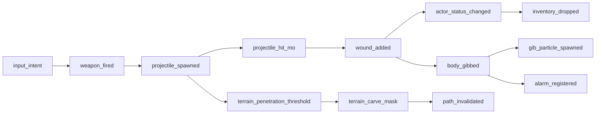

← [[spec/index|spec section]] · [[spec/replay-event-architecture|replay/event spec stub]] · [[systems/replay-event-architecture|replay/event system brief]] · [[decisions/dr-002-replay-event-architecture|DR-002]] · [[spec/actor-feel-sandbox-slice-a|actor-feel Slice A]]

# Replay Recorder Slice A

> [!warning] Prototype requirements, not final replay format
> This page turns the current replay/event architecture into a buildable Slice A recorder and viewer. It is allowed to be concrete because implementation needs hook points. Final replay format, compression, migration, sharing, and networking claims still wait on prototype evidence.

## Purpose

The first recorder should answer one question:

> Can we explain what happened in a mutable, physics-heavy fight without pausing development to build a full replay product?

For Slice A, the recorder is not a cinematic replay browser. It is debugging and design infrastructure for actor feel, terrain destruction, damage readability, AI trust, and future networking. If it cannot answer "why did this actor die?", "what carved this terrain?", and "which input/tool caused this chain?", the event taxonomy is not good enough yet.

## Inputs

| Source | Requirement Pulled Forward |
|---|---|
| [[systems/replay-event-architecture]] | Hybrid event log + snapshots, event bus boundaries, death recap, JSON Lines debug export. |
| [[spec/actor-feel-sandbox-slice-a]] | Slice A event hooks, test scene, material set, REC-01/REC-02 acceptance pressure. |
| [[engine/direct-control-and-actor-feel-lifecycle]] | Capture `Controller` intent before actor/item systems consume it. |
| [[engine/projectile-to-impact-lifecycle]] | Weapon fire, spawned particles, projectile/terrain/body impact causality. |
| [[engine/body-damage-wound-gib-lifecycle]] | Wounds, status changes, inventory fallout, gib/attachable consequences. |
| [[engine/terrain-mutation-and-pathfinding-lifecycle]] | Terrain dirty regions, penetration, dislodged pixels, path invalidation. |
| [[comparables/opensoldat-local-audit]] | Demo/input capture and snapshot/delta caution for combat traces. |
| [[comparables/the-powder-toy-local-audit]] | Snapshot/delta undo, save/stamp mentality, tool-driven material edits. |
| [[comparables/openlierox-local-audit]] | Shared input/control surface, terrain-carve consequences, legacy/NewNet caution. |

## Slice A Scope

| Area | Must Have | Explicitly Later |
|---|---|---|
| Recorder | In-memory ring buffer, on-disk JSONL event export, per-run header, dropped-event counter. | zstd/lz4 block compression, replay migration, cloud upload. |
| Snapshots | Actor snapshot, inventory summary, terrain dirty-chunk checksum/payload at coarse cadence. | Full savegame-level binary snapshot and cross-version loading. |
| Viewer | Live event tail, filter by actor/category, last-30s recap, death/failure chain text. | Polished scrub timeline, cinematic camera, community replay browser. |
| Integration | Hook Slice A input, weapon, projectile/body, terrain, status, inventory, alarm events. | Full mission/economy/logistics/network coverage. |
| AI/debug | Event schema includes path/order fields even if no bot drives them yet. | AI-01..AI-12 automated harness and tactic heatmaps. |
| Networking | Event envelope serializable and size-counted. | Online replication, reconciliation, anti-cheat, PvP. |

## Event Envelope

Keep the envelope boring. Interesting data belongs in `payload`, not in one-off top-level fields.

| Field | Required | Notes |
|---|---|---|
| `schema_version` | Yes | Increment only for breaking format changes. |
| `run_id` | Yes | Unique per sandbox run. |
| `tick` | Yes | Simulation tick, monotonic. |
| `sim_time_ms` | Yes | Useful for player-facing recaps and UI. |
| `event_id` | Yes | Stable within the run. |
| `parent_event_id` | Optional | Links cause chains: fire -> projectile -> hit -> wound/carve/status. |
| `category` | Yes | `input`, `combat`, `body`, `terrain`, `ai`, `logistics`, `mission`, `system`. |
| `event_type` | Yes | Typed string; add, do not repurpose. |
| `actor_id` | Optional | Stable recorder id, not just a raw pointer or transient MOID. |
| `source_id` | Optional | Weapon/projectile/tool/effect id. |
| `team` | Optional | Supports AI/alarm/friendly-fire analysis. |
| `pos` | Optional | World position or bbox center. |
| `bbox` | Optional | Terrain edits, explosions, path invalidations. |
| `payload` | Yes | Event-specific JSON object. |
| `dropped_count` | Optional | Recorder backpressure should be visible. |

> [!danger] Stable id requirement
> Do not rely on raw `MOID` or pointer identity as the only replay identifier. `MovableMan::GetMOFromID` explicitly warns that Lua ownership and pooled memory can leave stale pointers or newly allocated objects at old addresses (`MovableMan.cpp:126-143`). The recorder needs its own stable `record_id` layer.

## Hook Map

| Event | Hook Candidate | Minimum Payload | Why It Matters |
|---|---|---|---|
| `input_intent` | Before/after `Controller::Update()`; player path starts at `Controller.cpp:147`, `GetInputFromPlayer()` at `185`, `UpdatePlayerInput()` at `225`. | actor id, player id, input mode, buttons, analog move/aim, selected item. | Lets player, AI, replay, and future net prediction share one control surface. |
| `ai_intent` | `Controller::ShouldUpdateAIThisFrame()` and AI behavior code paths; throttle evidence at `Controller.cpp:196-208`. | actor id, order id, tactic, target, path state, update interval. | AI trust failures need the same recorder surface as player control. |
| `weapon_fired` | `HDFirearm::Update()` firing loop: rounds counted at `HDFirearm.cpp:672-707`; particles launched at `723-798`; recoil at `891-919`. | actor id, weapon id, muzzle pos, aim angle, shake, recoil force, ammo before/after, round count. | Parent event for projectile, recoil, sound/alarm, and player aim feedback. |
| `projectile_spawned` | `HDFirearm.cpp:741-798` when `Round::PopNextParticle()` particles are positioned, assigned velocity, team, and added to `MovableMan`. | projectile id, parent weapon event, particle preset, pos, velocity, team, lifetime/lethal range. | Necessary for cause chains and future deterministic small tests. |
| `weapon_reloaded` | `HDFirearm::Reload()` at `HDFirearm.cpp:590-617` and reload completion at `863-875`. | weapon id, actor id, had magazine, magazine id, reload duration, result. | Explains "why did fire fail?" and buy/loadout readiness UI. |
| `alarm_registered` | `MovableMan::RegisterAlarmEvent`; range construction at `MovableMan.cpp:30-33`; firearm loudness at `HDFirearm.cpp:949`; gib loudness at `MOSRotating.cpp:908-909`. | source id, team, pos, range, loudness, cause event. | AI awareness and stealth/combat readability depend on this. |
| `projectile_hit_mo` | `MOSRotating::CollideAtPoint()` at `MOSRotating.cpp:646-710`. | hitor id, hitee id, hit point, impulse, material, result. | Root body/item hit event before penetration, wound, bounce, or gib. |
| `particle_penetrated_body` | `MOSRotating::ParticlePenetration()` at `MOSRotating.cpp:722-881`. | target id, projectile id, impulse, target material integrity, sharpness, entry pos, exited bool. | Explains body damage and why some shots lodge while others pass through. |
| `wound_added` | `MOSRotating::AddWoundExt()` at `MOSRotating.cpp:447`; entry wound at `827-835`; exit wound at `839-851`. | target id, wound preset, entry/exit, body/local offset, damage multiplier, cause event. | DR-003 needs wound readability and death recap evidence. |
| `body_gibbed` | `MOSRotating::GibThis()` at `MOSRotating.cpp:883-913`. | body id, cause id, impact impulse, gib impulse limit, loudness, screen shake. | High-value recap event; also creates many child events. |
| `gib_particle_spawned` | `CreateGibsWhenGibbing()` at `MOSRotating.cpp:915-1049`. | parent body id, gib preset, count, spread, velocity range, child particle ids. | Lets the recorder coalesce spectacle while preserving enough cause data. |
| `attachable_detached` | `RemoveAttachablesWhenGibbing()` at `MOSRotating.cpp:1051-1078` and regular attachment removal sites. | parent id, attachable id, detached/gibbed/deleted, inherited velocity, cause. | Equipment/limb fallout becomes explainable instead of visual noise. |
| `actor_status_changed` | `Actor::Update()` stability/death transitions: `Actor.cpp:1182-1193`, `1229-1235`, `1243-1244`. | actor id, old status, new status, health, travel impulse, cause. | The HUD and death recap must explain stable/unstable/dying/dead. |
| `inventory_dropped` | `Actor::DropAllInventory()` and death-trigger calls at `Actor.cpp:1215-1234`; humanoid drop path around `AHuman.cpp:2029`. | actor id, item ids, reason, positions, ownership. | Death consequences, salvage, and replay recaps need inventory fallout. |
| `terrain_penetration_threshold` | `SceneMan::TryPenetrate()` at `SceneMan.cpp:544-686`. | pos, material id, integrity, impulse, velocity, pass/fail, spawned material. | Shows why bullets/drills affect or fail against a material. |
| `terrain_pixel_dislodged` | `SceneMan::DislodgePixel*()` family starting at `SceneMan.cpp:688`. | pos, source material, spawn material, delete flag, child pixel id. | Burst terrain/objective consequences need cheap counting and coalescing. |
| `terrain_carve_mask` | `SLTerrain::EraseSilhouette()` at `SLTerrain.cpp:397-481`. | cause id, mask/sprite id, pos, dirty bbox, removed count, material ids, dislodged count. | Explosions/diggers should reconstruct enough terrain change without logging every pixel. |
| `path_invalidated` | Terrain dirty areas from `SLTerrain.cpp:479` plus path refresh code in terrain/pathfinding notes. | bbox, affected teams/actors, old/new area version. | AI trust needs a clear "my path changed" event. |
| `snapshot_actor` | Custom recorder snapshot; `MovableMan::Save()` serializes actors/particles at `MovableMan.cpp:97-108` as existing save evidence, not final schema. | actor transform, velocity, status, health, selected item, inventory summary. | Scrub anchors and death recap context. |
| `snapshot_terrain_chunk` | Dirty rect/chunk snapshot from material bitmap and foreground layer. | chunk id, version, bbox, checksum, compact payload or hash. | Terrain reconstruction without logging every material pixel forever. |

## Causality Model

Rules:

- Every child event should point to a parent where practical.
- Terrain edits can be coalesced, but the coalesced event still needs the original cause ids.
- A death recap is just a filtered cause chain around the actor, not a separate hand-written system.
- If a cause chain breaks, that is a schema bug unless the break is explicitly marked `unknown_cause`.

## Snapshot Cadence

| Snapshot | Cadence | Contents | Budget Signal |
|---|---|---|---|
| Actor snapshot | Every 250 ms in Slice A, plus on status/death. | transform, velocity, status, health, selected item, inventory summary. | bytes/sec per actor. |
| Terrain dirty chunk | On dirty rect coalescing, at most every 500 ms per chunk. | bbox/chunk id, version, checksum, compact payload or diff id. | bytes/sec at bullet and explosion density. |
| Run header | Once. | prototype build id, seed, map id, material schema version, mod/content hashes. | required for every export. |
| End summary | Once. | event counts by category, dropped counts, max buffer depth, max event bytes/tick. | tells DR-002/DR-005 whether the model is viable. |

Default Slice A retention: keep the last 30 seconds in memory and write the full run to JSONL when debug export is enabled.

## Viewer Requirements

| Surface | Minimum Behavior | Acceptance Pressure |
|---|---|---|
| Live event tail | Shows recent important events with category, actor/source, and short payload summary. | REC-A-01, REC-A-02 |
| Filter controls | Filter by actor, category, event type, parent chain, terrain bbox. | Debugging must not require grep alone. |
| Death/failure recap | Shows last 3-5 seconds of input, hit, wound/status, terrain/hazard, inventory/gib events. | REC-A-04 |
| Terrain overlay | Highlights dirty rects and selected carve/fill events over the test scene. | REC-A-03 |
| JSONL export | Exports header + events + snapshots + end summary. | REC-A-05 |
| Event volume badge | Shows dropped events, bytes/sec, events/sec, and largest category. | REC-A-06 |

## Acceptance Tests

| ID | Test | Pass Criteria |
|---|---|---|
| REC-A-01 | Input order trace | For a 30-second movement/shoot/dig run, `input_intent` events precede the sim consequences they cause and can be filtered by actor. |
| REC-A-02 | Weapon cause chain | One rifle shot produces `weapon_fired` -> `projectile_spawned` -> hit event -> either wound, terrain threshold, or explicit miss/expired event. |
| REC-A-03 | Terrain carve reconstruction | One dig/explosion action produces a dirty bbox, material affected summary, removed count, and a terrain overlay that points at the changed area. |
| REC-A-04 | Death/failure recap | A forced death or failure can be explained from prior input, hit/hazard/terrain, wound/status, and inventory/gib consequences within five seconds. |
| REC-A-05 | Snapshot roundtrip smoke test | Exported JSONL has a run header, at least one actor snapshot, at least one terrain snapshot/checksum, and an end summary. |
| REC-A-06 | Volume budget | A 60-second spam run records event counts/bytes/sec/drops; pass target starts as zero recorder stalls and visible dropped-event counters if budget is exceeded. |
| REC-A-07 | Reentrancy guard | Events emitted from collision/terrain hooks do not mutate simulation state or call scripts from the recorder path. |

## First Build Tickets

| Order | Ticket | Done When |
|---|---|---|
| 1 | Define `RecorderEvent` envelope and schema version. | Header + event + payload structs can serialize to JSONL. |
| 2 | Add stable recorder ids for actors/items/projectiles/terrain chunks. | Events never depend only on raw pointers or transient MOIDs. |
| 3 | Add ring buffer and dropped-event accounting. | Recorder cannot block the simulation; drops are visible. |
| 4 | Capture `input_intent` from the Slice A control surface. | REC-A-01 is testable. |
| 5 | Emit `weapon_fired` and `projectile_spawned`. | REC-A-02 parent chain starts. |
| 6 | Emit terrain penetration/carve/dirty chunk events. | REC-A-03 is testable. |
| 7 | Emit wound/status/death/inventory/gib events. | REC-A-04 is testable. |
| 8 | Add actor and terrain snapshot writer. | REC-A-05 is testable. |
| 9 | Build live event tail and death recap panel. | Viewer can answer "what just happened?" without reading raw JSON. |
| 10 | Add volume counters and export summary. | REC-A-06 feeds DR-002 and DR-005. |

## Failure Modes

| Failure | Mitigation |
|---|---|
| Event spam hides the story. | Coalesce terrain edits, group gib particles under a parent, rank event importance for the viewer. |
| Event drop silently breaks a replay. | Record `dropped_count`, category budget, and end summary; show badge in viewer. |
| Recorder changes sim timing. | Ring buffer only; no blocking disk writes on sim thread; export on a worker or after run. |
| Hook emits during dangerous script/collision path. | Emit plain data only; no subscriber mutation; buffer and process after the current sim step. |
| Object ids become stale. | Stable recorder id registry with lifecycle events; never make raw pointer/MOID the only key. |
| Death recap blames the wrong cause. | Preserve parent chains and include `unknown_cause` explicitly when attribution fails. |
| Terrain snapshots are too large. | Dirty chunks first; checksums and coalesced masks before full bitmap payloads. |

> [!warning] Collision/script reentrancy caveat
> `Atom.cpp:96-99` notes that `OnCollideWithTerrain` Lua can run while an `AtomGroup` is travelling. Recorder hooks in collision/terrain paths should emit inert data into a buffer and avoid calling scriptable subscribers or mutating gameplay state in-place.

## Decisions Fed

| Decision | Evidence This Slice Should Produce |
|---|---|
| [[decisions/dr-002-replay-event-architecture]] | Whether hybrid events + snapshots can reconstruct five minutes of combat and terrain mutation. |
| [[decisions/dr-003-body-damage-readability]] | Whether wound/status/death events support a readable HUD and death recap. |
| [[decisions/dr-004-first-playable-slice]] | Whether Slice A can be evaluated and debugged without guesswork. |
| [[decisions/dr-005-multiplayer-posture]] | Event sizes, terrain chunk cadence, and authority boundaries for future co-op/PvP research. |
| [[decisions/dr-008-ai-architecture]] | The event/debug substrate for AI-01..AI-12 failures. |

## Source Trail

- `Cortex-Command-Community-Project/Source/System/Controller.cpp:147`, `185`, `196`, `225`
- `Cortex-Command-Community-Project/Source/Entities/HDFirearm.cpp:590`, `651`, `672`, `723`, `741`, `797`, `891`, `949`
- `Cortex-Command-Community-Project/Source/Entities/MOSRotating.cpp:447`, `646`, `722`, `827`, `839`, `883`, `908`, `915`, `1051`
- `Cortex-Command-Community-Project/Source/Entities/Actor.cpp:760`, `1167`, `1182`, `1215`, `1229`, `1243`
- `Cortex-Command-Community-Project/Source/Managers/SceneMan.cpp:544`, `571`, `599`, `614`, `627`, `688`
- `Cortex-Command-Community-Project/Source/Entities/SLTerrain.cpp:397`, `411`, `449`, `468`, `479`
- `Cortex-Command-Community-Project/Source/Managers/MovableMan.cpp:30`, `97`, `126`, `1166`
- `Cortex-Command-Community-Project/Source/System/Atom.cpp:96`
- [[systems/replay-event-architecture]]
- [[spec/actor-feel-sandbox-slice-a]]
- [[comparables/opensoldat-local-audit]]
- [[comparables/the-powder-toy-local-audit]]
- [[comparables/openlierox-local-audit]]
