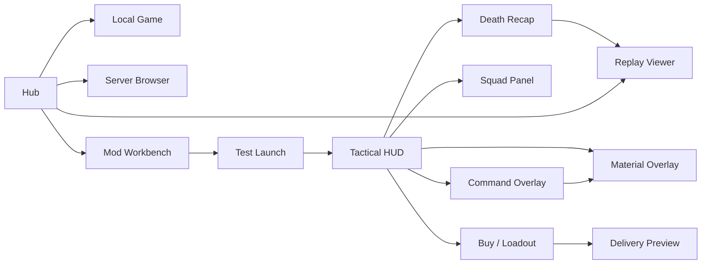

← [[spec/index|spec section]] · [[systems/ux-overlay-screen-brief|UX overlay brief]] · [[spec/accessibility-comfort-slice-a|accessibility/comfort Slice A]] · [[decisions/dr-012-accessibility-comfort-readability|DR-012]] · [[systems/ux-ui-and-retention|UX/retention]] · [[spec/actor-feel-sandbox-slice-a|actor-feel Slice A]] · [[spec/replay-recorder-slice-a|replay recorder Slice A]] · [[spec/backend-service-hub-slice-a|backend/hub Slice A]] · [[spec/package-builder-workbench-slice-a|package-builder/workbench Slice A]] · [[spec/equipment-loadout-workbench-slice-a|loadout workbench Slice A]] · [[spec/equipment-role-card-renderer-slice-a|role-card renderer Slice A]] · [[references/equipment-ai-behavior-contract|equipment AI behavior contract]] · [[references/equipment-ai-summary-seed-slice-a|equipment AI summary seed]] · [[references/equipment-device-loadout-field-atlas|equipment field atlas]] · [[references/equipment-role-card-renderer-view-slice-a|renderer view]] · [[references/equipment-loadout-fixtures-slice-a|LOAD-A fixtures]] · [[references/equipment-role-cards-slice-a|role cards]] · [[references/equipment-overlap-audit-slice-a|overlap audit]] · [[references/equipment-overlap-resolution-worksheet-slice-a|overlap worksheet]]

# UX Wireframes Slice A

> [!summary] Purpose
> Turn the current UX brief into a build-facing wireframe system. This page does not define final art style. It defines screen layouts, data priorities, input behavior, accessibility floors, telemetry hooks, and usability tests for the first playable and tool-facing prototypes.

> [!tip] Accessibility detail
> The dedicated accessibility, comfort, and readability contract now lives in [[spec/accessibility-comfort-slice-a]] and [[decisions/dr-012-accessibility-comfort-readability]]. Use those notes for ACC-A tests, run-bundle evidence, equipment/workbench accessibility, reduced motion/flash, captions, and settings persistence.

> [!important] Product stance
> The future game should preserve expressive physics friction while removing avoidable UI friction. If the player, creator, or debugging agent cannot understand why an actor died, why a bot failed, why a path is blocked, why a package is incompatible, or why a server row is disabled, the UX is failing even if the simulation is impressive.

## Slice A UX Question

Can a returning player control one actor, command a small squad, buy and deliver a useful loadout, inspect terrain risk, understand a death, start a local/hub flow, and test a mod package without memorizing hidden engine rules?

## Evidence Stack

### Local Cortex / CCCP Evidence

| Evidence | Local Path | UX Lesson |
|---|---|---|
| Separate in-game buy/editor/inventory GUI surfaces | `Cortex-Command-Community-Project/Source/Activities/GameActivity.h:151-164`, `:336-340` | The game already treats in-game UI as a first-class per-player surface. Future UX should unify state instead of scattering it. |
| Physical delivery is a queue, not a spawn button | `GameActivity.h:274-310`, `GameActivity.cpp:688-695` | Buy/loadout UX must show delivery risk, landing zone, queue count, craft constraints, and cargo consequences. |
| Player screens and split-screen positioning affect GUI layout | `GameActivity.cpp:665-823` | Wireframes need responsive layouts and focus order, not one fixed desktop panel. |
| Objective arrows, landing zone arrows, and banners carry must-see info | `GameActivity.h:204-241`, `GameActivity.cpp:787-807`, `:830-849` | Critical alerts should be high-signal and spatial, but not permanent clutter. |
| Buy menu tracks categories, loadouts, costs, mass, passengers, craft, allowed/prohibited items | `Source/Menus/BuyMenuGUI.h:60-69`, `:119-169`, `:181-246`; `BuyMenuGUI.cpp:180-205`, `:240-251` | The replacement loadout UI should expose role filters and compatibility/risk badges while preserving cost/mass/craft math. |
| Pie commands directly switch actor and craft AI modes | `Source/Entities/AHuman.cpp:572-600`, `Source/Entities/ACraft.cpp:393-416` | Command overlay must show exactly what AI mode or order will be applied before confirmation. |
| Pie menu descriptions are context-sensitive | `AHuman.cpp:2962-3020` | Disabled actions need explanations like "No Arm", "Not Holding Anything", or "needs digger", not dead buttons. |
| Squad leadership is reassigned across controlled actor switches | `Source/Entities/Activity.cpp:676-715` | Squad panel must explain leader/follower intent and avoid surprise when the player switches bodies. |
| Craft crash, hatch, orbit, pickup, and death states are rich simulation events | `Source/Entities/ACraft.cpp:635-739`, `:759-817` | Delivery UX should visualize craft state, exit safety, scuttle/crash risk, and inventory ejection/suck-in affordances. |

### Comparable Evidence

| Evidence | Local Path / Note | UX Lesson |
|---|---|---|
| OpenSoldat launcher top-level tabs are operational buckets | `comparables_repos/opensoldat-launcher/src/types/ui.ts:3-13`; [[comparables/opensoldat-satellites-local-audit]] | Hub IA should group Lobby/Local/Replays/Settings, then add Mods/Workbench and Diagnostics for Cortex-like needs. |
| OpenSoldat lobby click/double-click populates connect form and joins | `comparables_repos/opensoldat-launcher/src/components/Lobby/Page.tsx:25-64` | Dense tables work for server rows, but double-click join needs compatibility preflight and clear blockers. |
| OpenSoldat local game page uses sidebar start/stop plus collapsible settings | `comparables_repos/opensoldat-launcher/src/components/LocalGame/Page.tsx:118-213` | Local host flow should keep the primary action obvious while hiding advanced server knobs under collapsible sections. |
| OpenSoldat demos page has search, refresh, selection, and play | `comparables_repos/opensoldat-launcher/src/components/Demos/Page.tsx:65-106` | Replay browser Slice A should start as searchable rows plus event tags before cinematic replay polish. |
| OpenSoldat settings use stable side tabs with icons | `comparables_repos/opensoldat-launcher/src/components/Settings/Page.tsx:41-110` | Settings/accessibility should use predictable tab structure and icon+label, not buried modal stacks. |
| OpenSoldat server supervisor relies on stdout readiness | `comparables_repos/opensoldat-launcher/src/api/soldat/server.ts:21-60` | Future hub should show explicit lifecycle states from [[spec/backend-service-hub-slice-a]], not parse logs as UX truth. |

### External UX / Accessibility Sources

| Source | UX Lesson |
|---|---|
| Microsoft Xbox Accessibility Guideline 101: Text display | Text in menus, HUDs, objectives, prompts, chat, toasts, and loading tips needs minimum readable size and scaling up to 200% without losing meaning. |
| Microsoft Xbox Accessibility Guideline 102: Contrast | Standard important text/visuals should meet 4.5:1 contrast, large elements 3:1, and high-contrast mode 7:1; borders/backgrounds are recommended when gameplay backgrounds fluctuate. |
| Microsoft Xbox Accessibility Guideline 103: Additional channels | Critical visual/audio cues need at least one additional sensory or symbolic channel. Color alone is not enough. |
| Microsoft Xbox Accessibility Guideline 112: UI navigation | Menu focus order, repeated controls, input methods, back paths, and scaled layouts should stay consistent and predictable. |
| Game Accessibility Guidelines full list | Game speed adjustment, remapping, same-input UI access, readable text, current-objective reminders, practice/sandbox modes, resize/rearrange options, and no color-only critical info are baseline design pressure. |
| Nielsen Norman Group game heuristics and usability heuristics | Visibility of status, consistency, recognition over recall, user control/freedom, error prevention, and contextual help apply to game UI without flattening gameplay challenge. |
| GameDeveloper Dreadnought HUD article | Critical HUD data performs better when placed near the player's current locus of attention; progressive/contextual display can reduce space while improving reaction. |

## UX Principles For This Game

| Principle | Practical Rule | Prototype Test |
|---|---|---|
| Simulation truth should be visible. | HUD/status labels must map to real actor, AI, terrain, delivery, and package state. | UX-W-01, UX-W-03, UX-W-08 |
| Physics friction is allowed; mystery friction is not. | Wounds, recoil, falling, craft crashes, blocked paths, and AI failures need short explanations. | UX-W-02, UX-W-04, UX-W-07 |
| Focus follows pressure. | Combat-critical status stays near actor/reticle; squad/server/package details live in dense panels. | UX-W-01, UX-W-05, UX-W-12 |
| Command before consequence. | Orders, purchases, package publishes, and joins must show predicted result and blockers before commit. | UX-W-04, UX-W-06, UX-W-13 |
| Dense is fine when it is organized. | Tables are acceptable for server, replay, diagnostic, package, and loadout surfaces; they need filters, badges, and details drawers. | UX-W-09, UX-W-10, UX-W-14 |
| Accessibility is a design floor. | Text scale, contrast, remap, focus order, no color-only states, and same-input navigation are Slice A requirements. | UX-W-15, UX-W-16 |

## Information Priority Ladder

| Layer | Player Attention | Examples | UI Placement |
|---|---|---|---|
| L0: Immediate survival | 0-500 ms | Incoming shell, dying, reload blocked, fall instability, blast radius, delivery danger. | Reticle/actor-adjacent cue, screen-edge direction, sound/haptic/caption pair. |
| L1: Active action state | 0.5-2 s | Ammo, wound limb, item state, aim range, current order, jet/dig/repair state. | Tactical HUD around actor/reticle and lower-left compact status. |
| L2: Squad/tactical state | 2-5 s | Which bot needs help, path blocked, current doctrine, LZ risk, material overlay. | Squad strip, command overlay, material overlay, quick details. |
| L3: Planning/economy | 5-60 s | Buy/loadout, role fit, delivery craft, package/server compatibility, replay browser. | Full panel/table with filters and comparison. |
| L4: Debug/learning | After action | Death recap, AI failure, package diagnostics, replay tags, backend health. | Viewer/report/workbench/hub screens. |

## Screen Map



## Wireframe A: Tactical HUD

```text
+--------------------------------------------------------------------------------+
| Obj/Timer        Team Alert: Enemy breach W                 Squad Strip [1][2!] |
|                                                                                |
|                         incoming shell marker                                  |
|                                v                                               |
|                         .--------------.                                       |
|                         | actor focus  |  reticle/range arc                    |
|                         '--------------'                                       |
|                 limb cue: left leg orange     order: Holding sentry            |
|                                                                                |
| [Body silhouette] STABLE -> UNSTABLE trend   Weapon: SMG 24/30  Reload ring    |
| [Item state] Digger ready  Heat low          Event: heard by enemy 2s ago      |
| Gold 320 oz   Delivery queue 1   LZ risk LOW       Slowdown 75%   Help prompt  |
+--------------------------------------------------------------------------------+
```

| Region | Always Visible | Contextual | Hidden Until Asked |
|---|---|---|---|
| Actor/reticle | Aim vector, range arc, weapon readiness, incoming L0 cues. | Reload ring, recoil bloom, instability wobble, pickup label. | Weapon spreadsheet stats. |
| Lower-left body status | Silhouette, status, wound trend, held item failure reason. | Limb/tool warning, "No Arm", "Bleeding", "Overburdened". | Full medical log. |
| Top/edge alerts | Objective arrow, breach/delivery danger, brain threat. | Screen-edge incoming fire/explosion/ship marker. | Full mission log. |
| Squad strip | Unit hotkeys, role icon, health/status pill, alert badge. | Current intent on hover/focus. | Full doctrine editor. |

### HUD Data Contract

| HUD Element | Source Event / State | Must Explain |
|---|---|---|
| Body silhouette | `actor_status_changed`, `wound_added`, limb attachable state. | Which body part is weak, bleeding, missing, stunned, or unrecoverable. |
| Instability indicator | travel impulse/status from actor lifecycle. | Why aim/movement is degraded after falls, collisions, or explosions. |
| Weapon readiness | `weapon_fired`, reload/ammo state, `weapon_reloaded`. | Why trigger succeeds/fails: empty, reload, jam/overheat, no arm, blocked muzzle. |
| Danger arrow | explosion/projectile/delivery event, alarm event. | Direction and type of threat without color-only meaning. |
| Current order | actor AI mode/order id. | Whether this actor is player-controlled, following, sentry, digging, rescuing, or brain-hunting. |
| Heard/noise badge | `alarm_registered`. | Why enemies reacted or why stealth failed. |

## Wireframe B: Squad Panel And Command Overlay

```text
+-------------------------------- Squad ----------------------------------------+
| [1] Rifle  STABLE  Holding sentry     alert: heard fire       switch  order    |
| [2] Engi   HURT    Blocked: basalt    needs digger           switch  order    |
| [3] Medic  OK      Rescuing #2        path clear 08s         switch  order    |
+-------------------------------------------------------------------------------+

Command Overlay over map:
  Order wheel: Move | Defend | Dig | Breach | Repair | Rescue | Retreat | Hold Fire
  Route line: green -> yellow -> red blocked segment
  Tooltip: "Blocked by basalt. Needs breacher/drill or alternate tunnel."
  Confirm: Enter/A     Cancel: Esc/B     Slowdown: 25%
```

| State | Required UI | Acceptance |
|---|---|---|
| Unit needs help | Alert badge plus short cause, not only a flashing portrait. | Player finds unit in under 2 seconds. |
| Order preview | Path line, estimated time, tool requirement, danger zones. | Player can predict what bot will try before committing. |
| Blocked route | Exact reason and suggested alternatives. | "AI is dumb" becomes "needs drill / path collapsed / LZ unsafe". |
| Leadership/follow | Show leader/follower chain and doctrine. | Switching bodies does not surprise the player. |
| Slowdown command mode | Overlay opens in 25% or 75% sim speed with visible state. | Player can think without losing realtime identity. |

## Wireframe C: Buy / Loadout / Delivery

```text
+---------------------------- Buy / Loadout ------------------------------------+
| Role filter: Assault Engineer Medic Demo Scout Commander      Search ________  |
| Package: Base + DevMount(MyPack)  Funds: 320 oz  Queue: 1                     |
|                                                                                |
| Catalog table: Name | Role | Cost | Mass | Bot Skill | Terrain Fit | Warnings |
| Selected: Heavy Digger                                                         |
|  Pros: basalt capable, repair fill                                             |
|  Cons: slow, high cargo mass, bot skill medium                                 |
|                                                                                |
| Cart: Light Soldier + SMG + Heavy Digger          Cost 210 oz  Mass 165 kg     |
| Craft: Dropship 2 seats / 300 kg   LZ risk: LOW   ETA: 14s                    |
| Preview: landing path, blast zone, hatch exits, cargo order                    |
| [Save Loadout] [Test In Sandbox] [Queue Delivery]                              |
+--------------------------------------------------------------------------------+
```

| Field | Why It Exists | Slice A Rule |
|---|---|---|
| Role filter | Large modded catalogs become unreadable. | Every purchasable actor/item gets role tags or appears in "uncategorized". |
| Cost/mass/passenger badges | Cortex delivery is physical and crashable. | Show red/yellow/green risk plus exact value on focus. |
| Bot skill indicator | Solo-first game depends on AI item competence. | "Bot Skill: poor/medium/good/unknown" is required metadata, not flavor. |
| Terrain fit | Tools should explain what materials they solve. | Link item role to [[systems/material-and-mobility-affordance-schema]]. |
| Package source | Modded/private package status affects compatibility. | Show package id/hash/dev dirty flag when item comes from non-base content. |
| Delivery preview | Delivery is part of the battle story. | Show LZ risk, craft exits, blast/danger area, and cargo order before queue. |

### Buy / Loadout Fixture Input

| Fixture Source | Required Slice A Use |
|---|---|
| [[references/equipment-loadout-fixtures-slice-a]] | Use these nine fixtures as the first catalog/cart/actor-column test data for UX-W-06, UX-W-07, BUY-01, and LOAD-A buy/loadout checks. |
| [equipment-loadout-fixtures.slice-a.json](../references/equipment-loadout-fixtures.slice-a.json) | Render expected warnings and manual badges exactly before adding real prototype validation. |
| [[references/equipment-overlay-review-matrix]] | Explain warning severity and why `Risky` or `Manual Recommended` appears. |
| [[references/equipment-manual-overlay-patches]] | Preserve replacement/catalog policy and hide internal components/payloads from player-facing catalog rows. |
| [[references/equipment-schema-and-overlays]] | Use `field_provenance` and `warning_details` in item detail drawers so authors can see whether values are direct, inherited, inferred, missing, or manually patched. |
| [[references/equipment-device-loadout-field-atlas]] | Use exact field atlas rows for item detail drill-downs, legacy loadout conversion warnings, bot reason-source labels, and workbench trace tabs. |
| [[references/equipment-provenance-workbench-view]] | Use the fixture rows and attention queue as the first item-detail/provenance panel data set. |
| [[references/equipment-role-cards-slice-a]] | Render catalog rows, item detail drawers, actor slot cards, squad capability summaries, bot badges, and replay/debug labels from the generated 106-card dataset. |
| [[references/equipment-overlap-audit-slice-a]] | Show high/medium overlap warnings in designer/workbench mode so duplicate item roles become compare/resolve decisions. |
| [[references/equipment-overlap-resolution-worksheet-slice-a]] | Use initial role-split, skin/legacy, and mission-fixture statuses when designing overlap compare drawers and designer-mode badges. |
| [[references/equipment-role-card-renderer-view-slice-a]] | Use the generated 63-row catalog, 5 detail drawer examples, 10 overlap rows, and 9 fixture summaries as the first UI fixture before real game data exists. |
| [[spec/equipment-role-card-renderer-slice-a]] | Use LOAD-R-01..LOAD-R-12 as the role-card renderer acceptance suite for buy/loadout, workbench, AI debug, replay labels, accessibility, and controller navigation. |
| [[spec/equipment-loadout-workbench-slice-a]] | Use LOAD-W-01..LOAD-W-17, LOAD-W-010, and LOAD-FIELD tests as the concrete interactive equipment/loadout/workbench prototype suite. |
| [[references/equipment-ai-behavior-contract]] | Use refusal labels and `ai_item_choice`/`ai_item_refusal`/`ai_item_result` events for "why bot blocked" panels, HUD explanations, and replay labels. |
| [[references/equipment-ai-summary-seed-slice-a]] | Use generated claim state, blackboard keys, required reason labels, required events, source confidence, and first fix actions for bot trust panels, replay/export preview, package gates, and AI-H harness links. |
| [[references/equipment-consumer-traceability-matrix]], [[references/equipment-consumer-traceability-slice-a]], [[references/equipment-trace-tab-view-slice-a]] | Use traceability rows and trace-tab view data to ensure equipment UI labels also feed AI/debug, package diagnostics, replay, backend, and balance review. |

## Wireframe D: Material / Path Overlay

```text
Overlay modes: [Integrity] [Path] [Hazard] [Support] [AI Debug]

Map tint:
  green: passable / diggable now
  yellow stripe: slow or tool-required
  red hatch: blocked / lethal
  white outline: fresh dirty-region change

Tooltip at cursor:
  Basalt wall
  Integrity: 0.82
  Tools: heavy drill, breacher charge
  AI path: blocked for rifleman, passable for engineer after 3.2s dig
  Replay events: terrain_carve_mask #423, path_invalidated #426
```

| Overlay | Player Version | Debug Version |
|---|---|---|
| Integrity | Strength tiers and right-tool icons. | Raw material id, integrity, density, structural flags. |
| Pathability | Can/cannot reach, ETA, danger, tool need. | Node costs, dirty region id, path cache version. |
| Hazard | Fire/gas/electric/heat/fall/crush zones. | Event ids, damage ticks, decay timers. |
| Support | Collapse/fill/repair readability. | Support graph, unstable chunks, material mass. |
| AI Debug | Off by default; summarized reasons only. | Intent, target, path state, stuck timer, utility scores. |

## Wireframe E: Death Recap And Replay Viewer

```text
+----------------------------- Death Recap -------------------------------------+
| Unit #2 Engineer lost at 03:14                                                  |
| Cause chain: ordered dig -> basalt breach -> enemy grenade -> left leg wound -> |
|              UNSTABLE fall -> dropship debris crush                            |
|                                                                                |
| Timeline: 03:08 order  03:10 carve  03:12 grenade  03:13 wound  03:14 death    |
| Filters: [Combat] [Terrain] [AI] [Delivery] [Friendly Fire]                    |
| [Replay Last 10s] [Bookmark] [Open Full Replay] [Show AI Intent]               |
+--------------------------------------------------------------------------------+

Replay browser rows:
  Map | Result | Duration | Deaths | AI fails | Terrain collapses | Packages | Tags
```

| Surface | Requirement | Why |
|---|---|---|
| Auto death recap | On major actor death or mission loss, show 3-5 event causes. | Turns chaos into learning. |
| Replay timeline | Event ticks by category, actor, package/version. | Debuggable AI, terrain, and balance iteration. |
| Bookmark/report | One click bookmarks death, AI fail, terrain collapse, or package error. | Makes playtests actionable. |
| Full replay browser | Search by map, actor, tags, package hash, event type. | Replays become research data, not hidden files. |

## Wireframe F: Hub / Local Game / Server Browser

```text
+-------------------------------- Hub ------------------------------------------+
| Left nav: Play Local | Servers | Replays | Mods/Workbench | Settings | Health |
|                                                                                |
| Servers table: Name | Ping | Mode | Map | Humans/Bots | Packages | Trust | Join |
| Detail drawer: rules, terrain sync, AI profile, required packages, blockers    |
|                                                                                |
| Local panel: profile, map, packages, bots, supervisor state, logs, last replay  |
| Primary action: START LOCAL SANDBOX / STOP / OPEN REPLAY                       |
+--------------------------------------------------------------------------------+
```

| Surface | Required Pattern |
|---|---|
| Server browser | Dense sortable table plus detail drawer from [[spec/backend-service-hub-slice-a]]. |
| Join blocker | Button disabled only with exact reason and next action: update, install package, enter invite, repair hash, trust override. |
| Local game | Primary start/stop action stays visible; advanced server settings are collapsible. |
| Replays | Search/refresh/play pattern like OpenSoldat demos, but with tags and cause categories. |
| Health | Backend API, package registry, recorder schema, supervisor state, and last failed join all visible. |

## Wireframe G: Workbench / Package Builder

```text
+--------------------------- Mod Workbench -------------------------------------+
| Project: MyPack.rte  Mode: dev_mount dirty  Manifest: warning  Hash: dev       |
|                                                                                |
| File tree        Diagnostics table                         Preview / Graph     |
| Base.rte         ERROR PATH_NOT_FOUND Devices.ini:42        CopyOf graph       |
| MyPack.rte       WARN UNKNOWN_PROVENANCE sprite.png         Effect chain       |
|                                                                                |
| Build panel: [Validate] [Build Twice] [Migration Preview] [Test Launch]        |
| Provenance: copied/adapted/generated/unknown, source URL/path, license note    |
+--------------------------------------------------------------------------------+
```

| Surface | Required Pattern |
|---|---|
| Diagnostics table | Severity/code/file/line/column/include stack; click-to-source. |
| Manifest editor | Form plus raw view; no hidden generated fields. |
| Graph views | Preset inheritance and effect chains before node editing. |
| Provenance ledger | Reuse is allowed, but visible and exportable. |
| Test launch | Runs a sandbox and captures runtime diagnostics/replay event file. |

## Accessibility Floor

| Requirement | Slice A Floor | Source |
|---|---|---|
| Text size | PC 1080p important text >= 18 px; console/TV target >= 26 px; support up to 200% scaling without loss of meaning. | Microsoft XAG 101 |
| Contrast | Standard important text/visual elements >= 4.5:1; large elements >= 3:1; high contrast mode >= 7:1. | Microsoft XAG 102 |
| Color | No critical state relies on color alone; use icon, pattern, label, motion, sound, haptic, or position. | Microsoft XAG 103; Game Accessibility Guidelines |
| Input | Menus and overlays navigable by same primary input as gameplay, plus keyboard/controller digital input. | Microsoft XAG 112; Game Accessibility Guidelines |
| Focus order | Focus order follows visual/operational meaning and updates when layout scales. | Microsoft XAG 112 |
| Back path | Every panel has consistent cancel/back behavior. | Microsoft XAG 112 |
| Game speed | Slowdown and pause modes are accessible settings, not cheats. | Game Accessibility Guidelines |
| Remapping | Direct control, command overlay, and UI navigation actions are remappable. | Game Accessibility Guidelines |
| UI scale/layout | HUD and panels can be scaled; no two-direction scrolling for a single text block. | Microsoft XAG 101/112 |

## UX Event Hooks

| Event | When | Why |
|---|---|---|
| `ux_screen_opened` | Any major panel opens. | Finds hidden/deep navigation problems. |
| `ux_command_previewed` | Player previews an order. | Measures blocked reasons and command confidence. |
| `ux_order_confirmed` | Player commits order. | Connects UI intent to AI/replay results. |
| `ux_buy_item_compared` | Player compares catalog items. | Measures whether loadout stats are useful. |
| `ux_delivery_queued` | Player queues delivery. | Connects LZ/craft preview to actual delivery outcome. |
| `ux_overlay_toggled` | Material/path/hazard/AI overlay toggled. | Shows whether overlays are useful or ignored. |
| `ux_recap_opened` | Death/failure recap appears or is opened. | Measures if players use the learning loop. |
| `ux_join_blocker_seen` | Server join is blocked. | Finds the most painful backend/package incompatibilities. |
| `ux_diag_fix_action_used` | Workbench diagnostic fix runs. | Measures creator-tool value. |
| `ux_accessibility_setting_changed` | Text scale, contrast, remap, caption, slowdown, or layout setting changes. | Validates settings people actually need. |

## Acceptance Tests

| ID | Test | Pass Criteria |
|---|---|---|
| UX-W-01 | HUD one-glance state | A player identifies STABLE/UNSTABLE/DYING, ammo state, and current order in under 1 second during motion. |
| UX-W-02 | Limb/wound readability | After targeted wounds, player identifies affected limb and severity in under 2 seconds. |
| UX-W-03 | Failure explanation | Trigger failure states such as empty gun, no arm, blocked muzzle, overheat, or cannot pick up; UI names the reason. |
| UX-W-04 | Order preview | Player previews a move/dig/rescue order and understands path, ETA, tool requirement, and blocker before confirming. |
| UX-W-05 | Find troubled unit | Squad panel lets player select the unit that needs help in under 2 seconds. |
| UX-W-06 | Loadout under 60s | Returning player builds a four-unit squad for a known mission in under 60 seconds using role filters. |
| UX-W-07 | Delivery risk read | Player predicts whether delivery is low/medium/high risk and why before queueing. |
| UX-W-08 | Material tool choice | Player chooses the correct tool for soil, loose rock, basalt, metal, gold, hazard pocket, and reinforced wall from overlay/tool hints. |
| UX-W-09 | Death recap cause | Player states the primary cause chain of a death within 5 seconds of recap. |
| UX-W-10 | Replay search | User finds a replay with an AI failure, terrain collapse, or friendly-fire event within 15 seconds. |
| UX-W-11 | Hub local start | User starts and stops a local sandbox without orphaning the server/supervisor and can open the last replay. |
| UX-W-12 | Server join blocker | Disabled join button always shows exact reason and next action. |
| UX-W-13 | Package diagnostic path | Creator clicks a package diagnostic and lands on source file/line/column or clear include-stack fallback. |
| UX-W-14 | Workbench test launch | Creator validates, test-launches, and finds runtime diagnostics without reading raw logs first. |
| UX-W-15 | Accessibility text/contrast | All Slice A screens pass text size and contrast floors at 100% and 200% scale. |
| UX-W-16 | Same-input navigation | HUD overlays, buy/loadout, hub, replay, and workbench are navigable by keyboard/controller without mouse-only traps. |

## First Wireframe Tickets

| Order | Ticket | Done When |
|---|---|---|
| 1 | Build low-fidelity HUD/squad/command overlay in the actor-feel sandbox. | UX-W-01..UX-W-05 can be run. |
| 2 | Add loadout/delivery panel with catalog filters and craft preview. | UX-W-06 and UX-W-07 can be run. |
| 2A | Add role-card detail drawer and overlap badges from [[spec/equipment-role-card-renderer-slice-a]]. | LOAD-R-03..LOAD-R-08 can be run against the buy/loadout mock. |
| 2B | Build the interactive equipment/loadout/workbench prototype from [[spec/equipment-loadout-workbench-slice-a]]. | LOAD-W-01..LOAD-W-17 plus LOAD-W-010 and LOAD-FIELD can be run against generated renderer/fixture/traceability/trace-tab/field-atlas data. |
| 3 | Add material/path overlay states from terrain sandbox. | UX-W-08 can be run. |
| 4 | Add death recap panel from recorder Slice A. | UX-W-09 can be run. |
| 5 | Add replay browser rows and filters. | UX-W-10 can be run. |
| 6 | Add hub IA prototype with local/server/replay/mod/settings/health sections. | UX-W-11 and UX-W-12 can be run. |
| 7 | Add workbench diagnostic layout and test-launch path. | UX-W-13 and UX-W-14 can be run. |
| 8 | Add accessibility settings pass. | UX-W-15 and UX-W-16 can be run. |
| 8A | Add ACC-A accessibility/comfort evidence pass from [[spec/accessibility-comfort-slice-a]]. | ACC-A-01..ACC-A-16 can be run across HUD, command, buy/loadout, equipment workbench, replay, hub, package builder, and settings. |
| 9 | Record UX telemetry events into replay/debug output. | UX-W results can be analyzed across playtests. |

## Risks And Anti-Patterns

| Risk | Bad Outcome | Mitigation |
|---|---|---|
| HUD tries to show the whole sim. | Combat view becomes unreadable. | Use priority ladder and context windows. |
| Debug overlays leak into player mode. | Game feels like an editor. | Separate player-curated overlays from raw AI/debug overlays. |
| Tables become spreadsheet work. | Loadout/hub/workbench feels sterile. | Tables get role icons, warnings, previews, and details drawers tied to action. |
| Slowdown becomes a crutch. | Core control feel is never fixed. | Slowdown helps command/planning; actor-feel tests still run at full speed. |
| Accessibility is bolted on late. | Text/contrast/focus fixes force redesign. | Text scale, contrast, focus order, and remap are Slice A requirements. |
| Death recap blames wrong cause. | Player trusts UI less than chaos. | Recap must be generated from recorder cause chains with explicit `unknown_cause`. |
| Workbench hides provenance as legal clutter. | Future public release becomes painful. | Provenance is visible but non-blocking for private/dev modes. |

## Open Questions

| Question | Cheapest Test |
|---|---|
| Should squad strip be always visible or summoned? | Run UX-W-05 with persistent strip vs hold-to-open strip. |
| Should command overlay open at 25% or 75% slowdown by default? | Run ORDER/UX-W-04 with both and measure confirmation mistakes. |
| How much actor-adjacent HUD is too much? | Compare minimal reticle + lower-left silhouette vs richer reticle cluster. |
| Should buy/loadout live in-game, hub, or both? | Use same data model in both; test which route players use before missions. |
| Should replay/death recap pause the sim automatically? | Test auto-pause, slowdown, and non-modal toast. |
| Should workbench be in-game, launcher, or standalone? | Use hub IA first; split later only if workflow/performance demands it. |

## Source Trail

- `Cortex-Command-Community-Project/Source/Activities/GameActivity.h:151`, `204`, `236`, `274`, `307`, `321`, `336`
- `Cortex-Command-Community-Project/Source/Activities/GameActivity.cpp:665`, `720`, `736`, `787`, `804`, `830`
- `Cortex-Command-Community-Project/Source/Menus/BuyMenuGUI.h:60`, `119`, `142`, `155`, `167`, `181`, `197`, `245`
- `Cortex-Command-Community-Project/Source/Menus/BuyMenuGUI.cpp:127`, `180`, `190`, `203`, `211`, `240`
- `Cortex-Command-Community-Project/Source/Entities/AHuman.cpp:572`, `584`, `591`, `594`, `2962`, `2972`, `2981`, `2992`, `3010`
- `Cortex-Command-Community-Project/Source/Entities/ACraft.cpp:393`, `635`, `650`, `665`, `727`, `759`, `782`
- `Cortex-Command-Community-Project/Source/Entities/Activity.cpp:676`, `681`, `692`, `707`, `717`
- `comparables_repos/opensoldat-launcher/src/types/ui.ts:3`
- `comparables_repos/opensoldat-launcher/src/components/Lobby/Page.tsx:25`
- `comparables_repos/opensoldat-launcher/src/components/LocalGame/Page.tsx:118`
- `comparables_repos/opensoldat-launcher/src/components/Demos/Page.tsx:65`
- `comparables_repos/opensoldat-launcher/src/components/Settings/Page.tsx:41`
- `comparables_repos/opensoldat-launcher/src/api/soldat/server.ts:21`
- [[systems/ux-overlay-screen-brief]]
- [[systems/ux-ui-and-retention]]
- [[spec/actor-feel-sandbox-slice-a]]
- [[spec/replay-recorder-slice-a]]
- [[spec/backend-service-hub-slice-a]]
- [[spec/package-builder-workbench-slice-a]]
- [[references/equipment-consumer-traceability-matrix]]
- [[references/equipment-consumer-traceability-slice-a]]
- [[references/equipment-ai-behavior-contract]]
- [[references/equipment-ai-summary-seed-slice-a]]
- [[references/equipment-device-loadout-field-atlas]]
- [[spec/equipment-role-card-renderer-slice-a]]
- [[references/equipment-role-card-renderer-view-slice-a]]
- [[references/equipment-role-cards-slice-a]]
- [[references/equipment-overlap-audit-slice-a]]
- [[references/equipment-overlap-resolution-worksheet-slice-a]]
- [[comparables/opensoldat-satellites-local-audit]]
- Microsoft Xbox Accessibility Guideline 101: `https://learn.microsoft.com/en-us/gaming/accessibility/xbox-accessibility-guidelines/101`
- Microsoft Xbox Accessibility Guideline 102: `https://learn.microsoft.com/en-us/gaming/accessibility/xbox-accessibility-guidelines/102`
- Microsoft Xbox Accessibility Guideline 103: `https://learn.microsoft.com/en-us/gaming/accessibility/xbox-accessibility-guidelines/103`
- Microsoft Xbox Accessibility Guideline 112: `https://learn.microsoft.com/en-us/gaming/accessibility/xbox-accessibility-guidelines/112`
- Game Accessibility Guidelines full list: `https://gameaccessibilityguidelines.com/full-list/`
- Nielsen Norman Group, 10 Usability Heuristics Applied to Video Games: `https://www.nngroup.com/articles/usability-heuristics-applied-video-games/`
- Nielsen Norman Group, 10 Usability Heuristics for User Interface Design: `https://www.nngroup.com/articles/ten-usability-heuristics/`
- GameDeveloper, Dreadnought combat HUD UX insights: `https://www.gamedeveloper.com/design/key-user-experience-insights-gained-during-the-creation-of-dreadnought-s-combat-hud`
