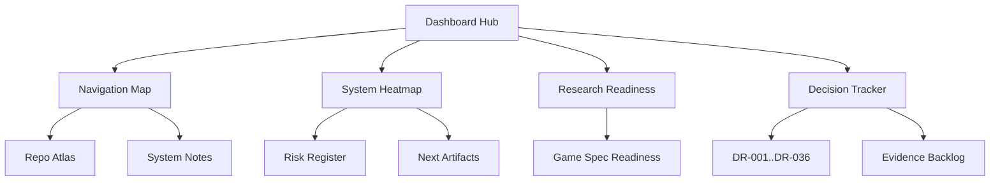

← [[index|vault home]] · [[dashboards/navigation-map|navigation map]] · [[dashboards/system-heatmap|system heatmap]] · [[dashboards/research-readiness|readiness]]

# Dashboard Hub

> [!tip] Use this folder when navigation feels fuzzy
> These dashboards are maps over the research vault. They are intentionally denser than normal notes: more tables, flags, jump links, and decision routes.

## Dashboard List

| Dashboard | Status | Purpose |
|---|---|---|
| [[index|vault home]] | HOME | Main vault control center. |
| [[dashboards/navigation-map]] | READY | Find notes by question, folder, or research target. |
| [[dashboards/system-heatmap]] | READY | Which systems are important, risky, and under-researched. |
| [[dashboards/research-readiness]] | ACTIVE | Gate checklist before writing the full game spec. |
| [[dashboards/decision-tracker]] | ACTIVE | DR-001..DR-036 status, evidence backlog, closes-when triggers. |
| [VAULT_PLAN.md](../../VAULT_PLAN.md) | ROOT | Execution plan outside the Obsidian vault. |

## Suggested Daily Flow

| Step | Open | Action |
|---|---|---|
| 1 | [[index|vault home]] | Pick the current research/build track. |
| 2 | [[spec/authoritative-game-spec-v0]] | Check the canonical product direction, first playable scope, commitments, prototype tracks, moonshots, and open questions. |
| 3 | [[dashboards/decision-tracker]] | Check open DRs and evidence backlog. |
| 4 | [[dashboards/research-readiness]] | Check spec gates. |
| 5 | [[dashboards/navigation-map]] | Jump to the exact system/source notes. |
| 6 | [[dashboards/system-heatmap]] | Re-check risk and priority. |
| 7 | [[spec/native-implementation-backlog]] + [[spec/prototype-roadmap]] + [[spec/feature-completion-checklist]] + [[references/prototype-run-bundle-schema]] + [[systems/replay-determinism-and-run-evidence]] + [[spec/mission-director-slice-a]] | If building, follow the native M0..M12 task cards, capture replay/run evidence, validate the run bundle, update checklist rows and ratings, and use the Breach Contract proof mission once actor/recorder basics exist. |
| 8 | [VAULT_PLAN.md](../../VAULT_PLAN.md) | Record the next artifact to make. |

## Visual Map

