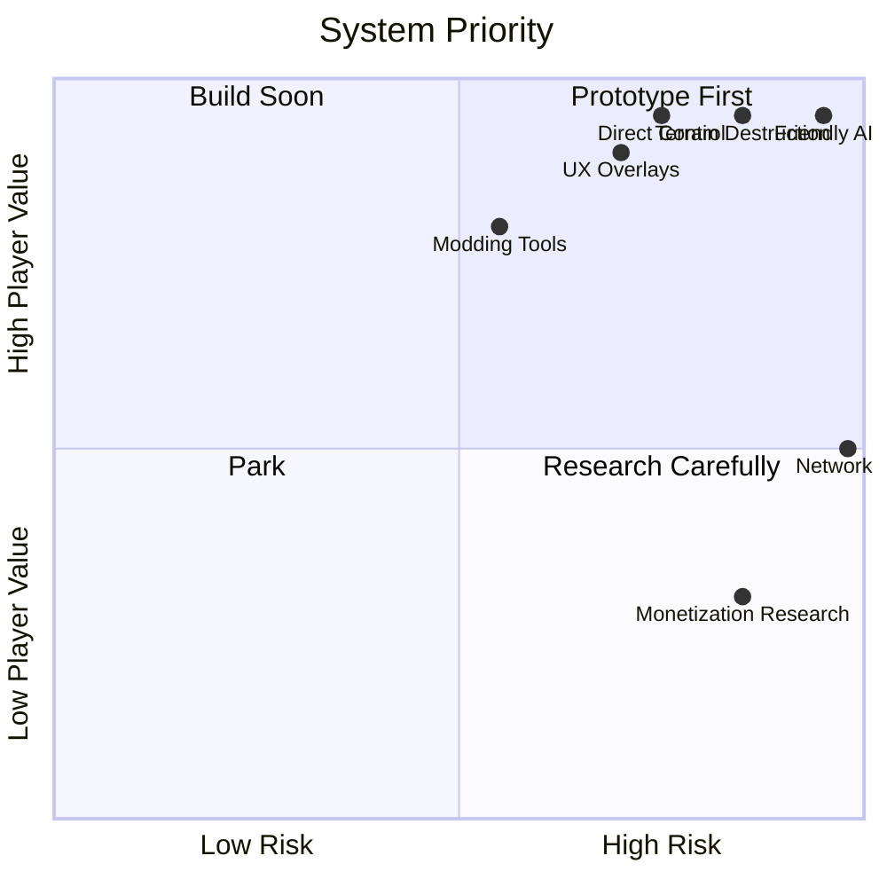

← [[index|vault home]] · [[dashboards/index|dashboard hub]] · [[dashboards/navigation-map|navigation map]] · [[dashboards/research-readiness|readiness]]

# System Heatmap

> [!warning] Read this before spec writing
> This table shows where the future game is most likely to succeed or fail. High-value, high-risk systems need evidence and prototypes before we lock a spec.

> [!summary] Spec anchor
> [[spec/authoritative-game-spec-v0]] is now the canonical v0 spec. Use this heatmap to decide which v0 claims are implementation commitments, which are prototype tracks, and which remain open research before they can become release promises.

## Heatmap

> [!info] Reading this table
> Risk levels apply to **shipping a system as a launch promise**. Research, side-prototypes, and moonshot tracks are not gated by these flags — capture wild ideas in [[research-log/moonshot-register]].

| System | Player Value | Risk | Evidence | Next Artifact |
|---|---|---|---|---|
| Direct actor control | VERY HIGH | HIGH | Cortex feel notes, [[comparables/opensoldat-local-audit]] control/weapon/reticle findings, [[comparables/openlierox-local-audit]] rope/movement mastery findings, [[spec/actor-feel-sandbox-slice-a]], [[prototypes/actor-feel-lab-a0-bootstrap]], [[prototypes/actor-feel-lab-a1-runtime-smoke]], [[prototypes/actor-feel-lab-a1-ui-smoke]], [[prototypes/actor-feel-lab-a1-load-w-workbench-smoke]], [[prototypes/actor-feel-lab-a1-load-w-fixture-switch-smoke]], [[prototypes/actor-feel-lab-a1-load-w-fixture-tab-input-smoke]], [[prototypes/actor-feel-lab-a1-load-w-fixture-traversal-smoke]]. | Run manual A1 play notes, then add integrated terrain collision/path, full workbench traversal, and physical gamepad fixture input UX. |
| Terrain/material destruction | VERY HIGH | HIGH | [[engine/terrain-mutation-and-pathfinding-lifecycle]], [[engine/terrain-materials]], [[systems/material-and-mobility-affordance-schema]], [[spec/terrain-material-sandbox-slice-a]], [[comparables/the-powder-toy-local-audit]], [[comparables/openlierox-local-audit]], [[comparables/noita-grade-material-simulation-research]], [[decisions/dr-007-terrain-material-model]], [[decisions/dr-036-systemic-material-simulation-direction]]. | Implement terrain/material sandbox MAT-T-01..MAT-T-10, then T-MAT material kernel + reaction table + atmospheres at M5.6/M5.7/M7.5/M8.5. |
| Full collision / physical consequence | VERY HIGH | CRITICAL | [[decisions/dr-033-full-collision-physics-direction]], [[spec/full-collision-physics-plan]], [[spec/prototype-roadmap]], [[spec/native-implementation-backlog]], [[spec/feature-completion-checklist]], [[references/prototype-run-bundle-schema]], Box2D/Rapier/Unity/Godot/Jolt/GPU Gems/Noita/Powder Toy research. | Build T-PHYS + M5.5 COLL-001..COLL-012 after chassis/equipment proxies exist; prove projectile-projectile, CCD, impulse damage, replay, perf, and checklist closeout. |
| Systemic material simulation (T-MAT) | VERY HIGH | CRITICAL | [[decisions/dr-036-systemic-material-simulation-direction]], [[comparables/noita-grade-material-simulation-research]], [[spec/prototype-roadmap]], [[spec/native-implementation-backlog]], [[references/prototype-run-bundle-schema]], Noita/Powder Toy/Barotrauma/ONI/Stationeers research, AI-MAT acceptance suite. | Build T-MAT M5.6 (kernel + reaction table) → M5.7 (hazard package + afflictions) → M6.6 (AI material competence) → M7.5 (Barotrauma-style atmospherics) → M8.5 (material lab + expansion materials). Curated 17-material launch set; replay determinism + server-authoritative. |
| Damage/wounds/gibs | HIGH | MED | [[spec/body-damage-model]], [[engine/projectile-to-impact-lifecycle]], [[engine/body-damage-wound-gib-lifecycle]], [[systems/damage-equipment-and-items]], [[research-log/2026-05-04-body-damage-model-spec]], Cataclysm: DDA, ACE3 Medical, /tg/ Station 13, and Space Station 14 body/combat references. | Build HUD-01..HUD-03 and BODY-A-01..BODY-A-12 with replay/death recap, AI reason labels, equipment fallout, and treatment events. |
| Chassis/armor/mechs/origins | HIGH | HIGH | [[decisions/dr-014-tone-player-promise]], [[spec/chassis-armor-mechs-and-origins]], [[spec/body-damage-model]], [[spec/equipment-loadout]], [[spec/progression-retention]], [[research-log/2026-05-04-tone-chassis-mech-promise]]. | Prototype CHASSIS-A: local armor stages, equipment degradation, one enterable mech, one android/robot origin, AI reason labels, and replay/debrief cause chains. |
| Equipment/loadouts | HIGH | MED | [[spec/equipment-loadout]], [[spec/equipment-role-card-renderer-slice-a]], [[spec/equipment-loadout-workbench-slice-a]], [[prototypes/actor-feel-lab-a1-load-w-workbench-smoke]], [[prototypes/actor-feel-lab-a1-load-w-fixture-switch-smoke]], [[prototypes/actor-feel-lab-a1-load-w-fixture-tab-input-smoke]], [[prototypes/actor-feel-lab-a1-load-w-fixture-traversal-smoke]], [[references/content-loader-graph-cccp]], [[references/equipment-source-trace-slice-a]], [[references/equipment-role-card-renderer-view-slice-a]], [[references/equipment-cccp-field-map]], [[references/equipment-device-loadout-field-atlas]], [[references/equipment-role-design-deep-dive]], [[references/equipment-capability-authoring-matrix]], [[references/equipment-ai-behavior-contract]], [[references/equipment-ai-summary-seed-slice-a]], [[references/equipment-consumer-traceability-matrix]], [[references/equipment-consumer-traceability-slice-a]], [[references/equipment-trace-tab-view-slice-a]], [[references/equipment-role-cards-slice-a]], [[references/equipment-overlap-audit-slice-a]], [[references/equipment-overlap-resolution-worksheet-slice-a]], [[references/equipment-corpus-cccp]], [[references/equipment-schema-and-overlays]], [[references/equipment-overlay-review-matrix]], [[references/equipment-manual-overlay-patches]], [[references/equipment-overlay-merged-preview]], [[references/equipment-provenance-workbench-view]], [[references/equipment-loadout-fixtures-slice-a]], [[references/equipment-ai-scenarios-slice-a]], [[references/equipment-package-diagnostics-slice-a]], [[engine/loadout-delivery-economy-lifecycle]], [[systems/damage-equipment-and-items]], CCCP devices/loadout code, F.E.A.R. GOAP, Game AI Pro utility scoring, Soldat/OpenSoldat, Unreal GAS, Godot Resources, Factorio Prototype Docs, OpenRA Weapons, Arma Reforger, Ravenfield, Core, and other weapon/loadout/AI metadata references. | Extend the fixture traversal smoke into full workbench traversal, physical gamepad/200% checks, field/source drill-downs, squad comparison, replay/export preview, AI-EQ item choice/refusal, package diagnostics editing, balance, and AI-H evidence. |
| Friendly AI | VERY HIGH | CRITICAL | [[engine/ai-order-lifecycle]], [[systems/ai-trust-test-suite]], [[spec/ai-trust-harness-slice-a]], [[decisions/dr-008-ai-architecture]], [[comparables/opensoldat-local-audit]], [[comparables/openlierox-local-audit]], Rain World lessons. | Implement AI-H bootstrap harness, then AI-01..AI-12. |
| Enemy commander AI | HIGH | HIGH | [[spec/mission-director-slice-a]], [[engine/activity-scenario-lifecycle]], `LandingZoneMap.lua`, `TacticsHandler.lua`, `MetaFight.lua`, BunkerBreach code pass, L4D/Warframe director references. | Implement commander reason strings, LZ scorer, package builder, squad tasking, and MISSION-A-06..09. |
| Objectives/campaign | HIGH | MED | [[spec/mission-director-slice-a]], [[spec/missions-and-objectives]], [[engine/activity-scenario-lifecycle]], [[systems/destruction-objective-mission-patterns]], BunkerBreach/MetaFight findings, Teardown mission design references. | Build Breach Contract proof mission and run MISSION-A-01..18. |
| Replay/event capture | VERY HIGH | HIGH | [[systems/replay-event-architecture]], [[systems/replay-determinism-and-run-evidence]], [[spec/replay-recorder-slice-a]], [[references/prototype-run-bundle-schema]], [[prototypes/actor-feel-lab-a0-bootstrap]], [[prototypes/actor-feel-lab-a1-runtime-smoke]], [[prototypes/actor-feel-lab-a1-ui-smoke]], [[decisions/dr-002-replay-event-architecture]], [[spec/actor-feel-sandbox-slice-a]]. | Upgrade browser JSONL export into full run-bundle export, then implement Slice A rolling recorder + viewer/export with checksums and terrain snapshots. |
| UX overlays | VERY HIGH | HIGH | [[systems/ux-overlay-screen-brief]], [[spec/ux-wireframes-slice-a]], [[spec/accessibility-comfort-slice-a]], [[decisions/dr-009-command-ux-style]], [[decisions/dr-012-accessibility-comfort-readability]], [[comparables/opensoldat-local-audit]] reticle/HUD findings, [[comparables/opensoldat-satellites-local-audit]] launcher/lobby/demos/settings findings. | Build low-fidelity UX-W-01..UX-W-16 and ACC-A-01..ACC-A-16 prototypes across HUD, command, buy/loadout, replay, hub, workbench, package builder, settings, and accessibility. |
| Modding/tools | HIGH | MED | [[systems/modding-package-and-workbench]], [[spec/modding-model]], [[engine/content-module-loading-lifecycle]], [[references/content-loader-graph-cccp]], [[spec/package-builder-workbench-slice-a]], VS Code extension, converter, [[comparables/the-powder-toy-local-audit]] Lua/custom-element/stamp lessons, [[comparables/openlierox-local-audit]] game-script/Gusanos/mod-pack lessons. | Build package-builder/workbench Slice A PACK-A-01..PACK-A-14 plus CONTENT-A loader parity checks. |
| Networking + Server App + MMO | UNKNOWN | CRITICAL | [[engine/network-terrain-replication-lifecycle]], [[decisions/dr-005-multiplayer-posture]], [[decisions/dr-013-backend-service-scope]], [[decisions/dr-034-dedicated-server-application]], [[decisions/dr-035-persistent-mmo-architecture]], [[spec/server-app-architecture]], [[spec/persistent-mmo-architecture]], [[comparables/opensoldat-local-audit]] snapshot/client-authority caution, [[comparables/opensoldat-satellites-local-audit]] lobby/package/hash lessons, [[spec/backend-service-hub-slice-a]] service/hub requirements, [[comparables/openlierox-local-audit]] carve/rope/NewNet caution. | Build M9 dedicated server app (`cx-server`) with all 5 mode boot/config paths + server-core subset; M10 LAN co-op via `lan_room`; M11 self-hosted online co-op via `coop_room` + lobby_directory; M12 public PvP arenas + persistent MMO shards (MMO-001..MMO-012). Anyone can host; no proprietary cloud lock-in; no subscription. |
| Retention/progression | HIGH | MED | [[decisions/dr-011-progression-retention-loop]], [[spec/progression-retention]], [[systems/ux-ui-and-retention]], [[comparables/the-powder-toy-local-audit]] online save/community loop, SDT/replayability/progression/dark-pattern sources. | Run RET-A-01..RET-A-06 after actor-feel, recorder, and loadout prototypes exist. |
| Gacha/monetization research | RESEARCH OK | HIGH at commit time | Research is permitted any time; commitment is a separate decision. | Ethics/economy DR before any launch commitment. |

## Risk Burn-Down

| Risk | Burn-Down Step 1 | Burn-Down Step 2 | Burn-Down Step 3 |
|---|---|---|---|
| AI trust | Draft tests + harness requirements done | Implement AI-H bootstrap harness | Measure failures/replays |
| Replay determinism | [[systems/replay-determinism-and-run-evidence]] bridge done, [[prototypes/actor-feel-lab-a0-bootstrap]] proves checker plumbing, [[prototypes/actor-feel-lab-a1-runtime-smoke]] proves A1 event-family validation, [[prototypes/actor-feel-lab-a1-ui-smoke]] proves screenshot artifacts in run bundles, and [[prototypes/actor-feel-lab-a1-load-w-workbench-smoke]] proves workbench event/checker shape | Implement REC-A + DET-A runtime event/checksum/snapshot tests | Promote deterministic islands only after checked run evidence |
| Simulation readability | Define overlays and material affordance schema | Run [[spec/terrain-material-sandbox-slice-a]] MAT-T-01..MAT-T-10 | User-test confusion points |
| UX readability | [[spec/ux-wireframes-slice-a]] and [[spec/accessibility-comfort-slice-a]] requirements done | Build low-fidelity HUD/command/loadout/replay/accessibility prototypes | Run UX-W-01..UX-W-16 plus ACC-A-01..ACC-A-16 and revise |
| Equipment readability | [[spec/equipment-loadout]], [[spec/equipment-role-card-renderer-slice-a]], and [[spec/equipment-loadout-workbench-slice-a]] requirements done; [[prototypes/actor-feel-lab-a1-load-w-workbench-smoke]] proves first browser render; [[prototypes/actor-feel-lab-a1-load-w-fixture-switch-smoke]] proves all-fixture imports plus query-param fixture switch; [[prototypes/actor-feel-lab-a1-load-w-fixture-tab-input-smoke]] proves fixture-tab click/focused-keyboard switching; [[prototypes/actor-feel-lab-a1-load-w-fixture-traversal-smoke]] proves fixture-control Tab focus, ArrowRight navigation, Enter/Space activation, and focus restore; [[references/content-loader-graph-cccp]], [[references/equipment-source-trace-slice-a]], [[references/equipment-role-card-renderer-view-slice-a]], [[references/equipment-cccp-field-map]], [[references/equipment-device-loadout-field-atlas]], [[references/equipment-role-design-deep-dive]], [[references/equipment-capability-authoring-matrix]], [[references/equipment-ai-behavior-contract]], [[references/equipment-consumer-traceability-matrix]], [[references/equipment-consumer-traceability-slice-a]], [[references/equipment-trace-tab-view-slice-a]], [[references/equipment-role-cards-slice-a]], [[references/equipment-overlap-audit-slice-a]], [[references/equipment-overlap-resolution-worksheet-slice-a]], [[references/equipment-corpus-cccp]], [[references/equipment-schema-and-overlays]], [[references/equipment-overlay-review-matrix]], [[references/equipment-manual-overlay-patches]], [[references/equipment-overlay-merged-preview]], [[references/equipment-provenance-workbench-view]], [[references/equipment-loadout-fixtures-slice-a]], [[references/equipment-ai-scenarios-slice-a]], and [[references/equipment-package-diagnostics-slice-a]] first passes generated | Extend the LOAD-W UI/workbench prototype with full workbench traversal, physical gamepad input, trace tab, source inspector, field/source drill-down, squad comparison, and bot-blocked panel | Run LOAD-W-01..LOAD-W-20 plus LOAD-W-010, LOAD-FIELD-01..06, LOAD-FIELD-SOURCE-01..06, LOAD-A-01..LOAD-A-16, LOAD-R-01..LOAD-R-12, LOAD-010 overlap decisions, AI-H-LOAD-01..10, AI-EQ-001..007, PACK-014C/D, ACC-A workbench checks, and REC-A-LOAD; revise buy/loadout + AI contracts |
| Chassis/mech readability | [[spec/chassis-armor-mechs-and-origins]] and [[decisions/dr-014-tone-player-promise]] define armor stages, module states, pilot state, origin differences, AI labels, and CHASSIS-A tests | Add chassis/armor/mech/origin fields to workbench fixtures and body/equipment event schema | Run CHASSIS-A-01..07 with HUD/replay/debrief and AI reason-label evidence before promising mechs/armor as a launch feature. |
| Mission readability | [[spec/mission-director-slice-a]] now defines typed manifest, objective grammar, director phases, commander events, equipment capability contract, save/replay fields, and MISSION-A tests | Build the Breach Contract proof mission after actor-feel/recorder basics | Run MISSION-A-01..18 and feed failures back into objectives, commander AI, loadout workbench, and replay/debrief UX |
| Multiplayer feasibility | CCCP/C4 terrain trace done | Measure prototype sync | Decide co-op vs server-authoritative for launch |
| Scope creep on launch promise | Rank launch materials | Prototype top set | Curated 17-material launch set per [[decisions/dr-036-systemic-material-simulation-direction]]; expansion materials gated behind material lab (M8.5) + balance review |
| Material kernel cost | [[decisions/dr-036-systemic-material-simulation-direction]] active-region budgets, dirty rects, sleeping chunks | Run M5.6 perf bench; verify 1080p/60 budget on mid-range; verify Deck floor | Per-milestone perf gates at M5.6/M5.7/M7.5/M8.5 with regression tracking |
| Hidden material chemistry / unfair deaths | Mandatory hazard overlays + captions; replay cause chains; AI captions for visible bots | Build M5.7 hazard overlay + recipe journal; M6.6 AI affordance scoring | Run AI-MAT-01..AI-MAT-08 + human-readability gate; debrief inspect tool covers every reaction |
| Modding fragility | [[engine/content-module-loading-lifecycle]] loader parity trace done and [[references/content-loader-graph-cccp]] generated | Validate sample modules with CONTENT-A fixtures and PACK-A | Build [[spec/package-builder-workbench-slice-a]] |
| Retention turns into obligation | [[decisions/dr-011-progression-retention-loop]] intrinsic-first posture | Run RET-A same-seed/veteran/salvage/replay tests | Split monetization/economy DR only after fairness and modding evidence |

## Priority Chart

