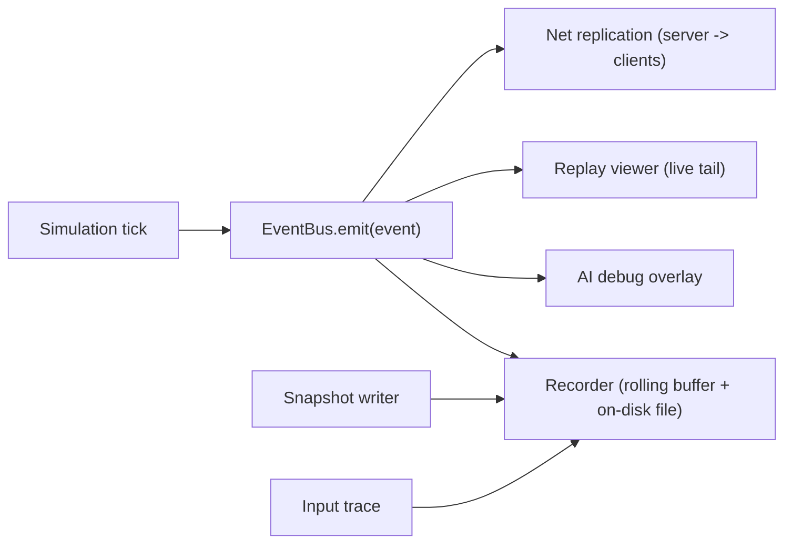

← [[systems/index|systems index]] · [[references/prototype-run-bundle-schema|run-bundle schema]] · [[spec/prototype-roadmap|native roadmap]] · [[spec/native-implementation-backlog|native backlog]] · [[spec/replay-recorder-slice-a|recorder Slice A]] · [[systems/replay-determinism-and-run-evidence|determinism/run evidence]] · [[systems/networking-backend-frontend|networking/backend/frontend]] · [[systems/ai-trust-test-suite|AI trust suite]] · [[references/equipment-ai-behavior-contract|equipment AI behavior contract]] · [[engine/network-terrain-replication-lifecycle|terrain replication]]

# Replay And Event Architecture

> [!summary] Premise
> Replay/event capture is foundational infrastructure, not polish. AI trust testing, player learning, support diagnostics, mod debugging, content QA, and any future networking model all depend on it. This brief defines the event taxonomy, capture model, replay format, and authority boundaries for our future game.

## Why This Has To Exist Day One

| Driver | Source / Note |
|---|---|
| Cortex bullets, terrain edits, gibs, and Lua AI all change state per frame; postmortem requires a structured trace. | [[engine/projectile-to-impact-lifecycle]], [[engine/terrain-mutation-and-pathfinding-lifecycle]], [[engine/body-damage-wound-gib-lifecycle]] |
| AI trust suite tests need replays to be meaningful. | [[systems/ai-trust-test-suite]] |
| CCCP/C4 networking already implies a delta stream for terrain and movement. | [[engine/network-terrain-replication-lifecycle]] |
| Modding/community share replays of weird outcomes. | [[systems/modding-package-and-workbench]] |
| Future multiplayer needs deterministic-or-event-replay scaffolding. | [[systems/networking-backend-frontend]] |
| Crash reports become 10x more useful with the last 30 seconds of events. | Standard postmortem practice. |

## Current Implementation Target

| Artifact | Status | What It Adds |
|---|---|---|
| [[references/prototype-run-bundle-schema]] | CANONICAL | Current run-bundle file contract, event category baseline, cross-file validation rules, and per-milestone acceptance gates. M3 must implement this schema, not a separate hand-maintained taxonomy. |
| [[spec/prototype-roadmap]] / [[spec/native-implementation-backlog]] | NATIVE BUILD ROADMAP | M3 Replay/Event Recorder, M5.5 collision events, M5.6-M8.5 material/atmosphere/affliction events, M9-M12 server/MMO events, and M6.5 mind events. |
| [[spec/replay-recorder-slice-a]] | READY TO BUILD | Event envelope, local CCCP hook map, causality model, snapshot cadence, viewer requirements, REC-A acceptance tests, first tickets, and failure modes for the actor-feel sandbox. |
| [[systems/replay-determinism-and-run-evidence]] | RESEARCH BRIDGE | Hybrid replay/determinism posture, local comparable lessons, run-bundle extensions, checksum/snapshot requirements, and DET-A acceptance tests. |

## Three Layers Of State Capture

| Layer | Rate | Purpose | Cost |
|---|---|---|---|
| Snapshot | Low (every N seconds, on objective changes) | Recovery point; replay scrub anchor; save game. | Bandwidth/disk heavy; built once. |
| Event log | Medium (per significant change) | "What happened and why" trail; debug; replay. | Cheap if events are well-typed. |
| Input/control trace | High (per tick of player input) | Deterministic replay where viable; AI training. | Small but constant. |

Combine all three. Snapshots cap recovery cost; events tell stories; input traces enable selective deterministic playback for tightly-scoped scenarios. See [[systems/replay-determinism-and-run-evidence]] for the exact Slice A posture: hybrid evidence first, deterministic islands only after checksums and restore tests prove them.

## Event Taxonomy Authority

Every event has: `tick`, `actor` (or `null`), `position`, `cause`, `payload`. Keep the field set small and stable.

The canonical event category list lives in [[references/prototype-run-bundle-schema#Event Category Baseline]]. The current native baseline covers:

| Track | Categories |
|---|---|
| Control / automation | `input`, `control` |
| AI / mind | `ai`, `mind` |
| Physical sim | `collision`, `material`, `reaction`, `atmosphere`, `affliction`, `terrain` |
| Actor/combat | `combat`, `body`, `logistics`, `mission` |
| Server / online | `server`, `anti_cheat`, `mmo` |
| Evidence / UX | `system`, `snapshot`, `determinism`, `ux`, `accessibility`, `performance` |

M3 implements the recorder/viewer/filter/counter path for the schema. Individual milestones add concrete event types inside those categories: M5.5 adds `collision.*`, M5.6-M8.5 add `material.*` / `reaction.*` / `atmosphere.*` / `affliction.*`, M6.5 adds `mind.*`, and M9-M12 add `server.*` / `anti_cheat.*` / `mmo.*`.

> [!info] Stability rule
> Adding events is fine. Removing or repurposing event fields requires a version bump and a replay migration step.

## Event Bus Boundaries

- Simulation never reads from the bus directly; it emits only.
- Subscribers are pull-style (recorder, debug overlay) or hooks (AI overlay, network).
- Backpressure handled by the recorder (drop with counter; never block sim).

## Replay File Format

| Field | Notes |
|---|---|
| Header | engine version, mod set, scene preset, activity preset, seed, checksum. |
| Snapshots | binary blobs at known ticks; reference scene + `.rte` set. |
| Events | typed records with monotonic tick ordering. |
| Input traces | optional; tied to player ids. |
| Index | tick -> file offset; allows scrubbing. |

Compression: per-block zstd (or lz4) keeps streaming cheap. Human-readable export (JSON Lines for events) for debugging.

## Authority And Networking

The event log is also the networking backbone. Three options:

| Model | How Events Flow | Pros | Cons |
|---|---|---|---|
| Local replay only | Recorder writes, server-authority is implicit (single host). | Cheapest; required for solo/co-op. | No network sync. |
| Server-authoritative event broadcast | Server emits canonical events; clients render and predict. | Cheaters cannot fake terrain edits/AI actions; replay = network log. | Requires bandwidth budget per event class. |
| Deterministic event replay | Clients run sim from same seed + input trace; events used only for verification. | Lowest bandwidth. | Determinism on physics + Lua + RNG is extremely hard. |

Default recommendation: **local replay first**, **server-authoritative event broadcast** as the online plan. Avoid deterministic replay unless we redesign the simulation for it from day one.

## Player-Facing Surfaces

| Surface | Use |
|---|---|
| Death recap | Replay last 5 seconds of events around the player's actor. |
| Mission recap | Timeline of `mission.*`, `logistics.*`, `body.*`, notable `terrain.*`, and material/atmosphere cause chains. |
| AI debug overlay | Live tail of `tactic_chosen`, `order_*`, `ai_item_*`, `ai_hazard_*`, and reason labels. |
| Material / hazard recap | Shows `material.*` -> `reaction.*` -> `affliction.*` / `damage.*` / `body.*` parent chains so players and agents can debug lava, acid, toxic gas, electricity, fire, and pressure outcomes. |
| Server/admin timeline | Shows `server.*`, `anti_cheat.*`, `mmo.*`, snapshot, and persistence events for hosted shards. |
| Crash bundle | Last 30s events + last snapshot + system info (privacy-respecting). |
| Mod report | Per-mod event count + warnings. |

## Failure Modes To Pre-empt

| Failure | Prevention |
|---|---|
| Bus is too chatty -> performance hit. | Per-frame event budget; coalesce `terrain_edited` boxes. |
| Bus dropped events under load and silenced. | Drop counter + UI badge; expose in crash bundle. |
| Mods emit events with conflicting types. | Mod-namespaced custom events; reserved core types. |
| Replays drift after sim version change. | Version-tagged replays; migration tool; reject old replays gracefully. |
| Privacy leakage in crash bundles. | Strip player names, file paths; opt-in; documented schema. |

## Implementation Order (Future Game)

| Step | Effort | Output |
|---|---|---|
| 1 | M0/M3 | Define schema-backed event types in code; emit at bootstrap, input, actor, terrain, combat, and system lifecycle sites. |
| 2 | M3 | Recorder with rolling buffer, run-bundle writer, category counters, dropped-event counters, and debug viewer. |
| 3 | M3/M5.6+ | Snapshot writer at scene/objective changes plus actor, inventory, terrain chunk, material chunk, and server persistence checkpoints. |
| 4 | M3/M4 | Replay reader + scrub UI + death/material recap parent-chain viewer. |
| 5 | M5.5-M8.5 | Add collision, material, reaction, atmosphere, affliction, AI material, and material-lab event families as their systems land. |
| 6 | M9-M12 | Server-authoritative event/snapshot stream for LAN, online co-op, PvP arenas, and MMO shards. |
| 7 | Post-M12 | Replay export/import + community share + richer admin tooling. |

## Open Questions

| Question | Next Evidence |
|---|---|
| Should every wound add an event, or just the first/last and gib? | Sample expected wound counts in CCCP combat traces. |
| How many terrain edit boxes per second under heavy combat? | Build a small profiler harness using `Atom::Travel` + `SceneMan::TryPenetrate`. |
| Does deterministic Lua need a seeded RNG sandbox? | Audit Lua scripts for direct `math.random` calls. |
| Should replays carry the entire mod set or just hashes? | Disk vs portability tradeoff. |

## Source Trail

- [[engine/projectile-to-impact-lifecycle]]
- [[engine/terrain-mutation-and-pathfinding-lifecycle]]
- [[engine/body-damage-wound-gib-lifecycle]]
- [[engine/network-terrain-replication-lifecycle]]
- [[systems/ai-trust-test-suite]]
- [[systems/networking-backend-frontend]]
- [[systems/destruction-objective-mission-patterns]]
- [[systems/replay-determinism-and-run-evidence]]
