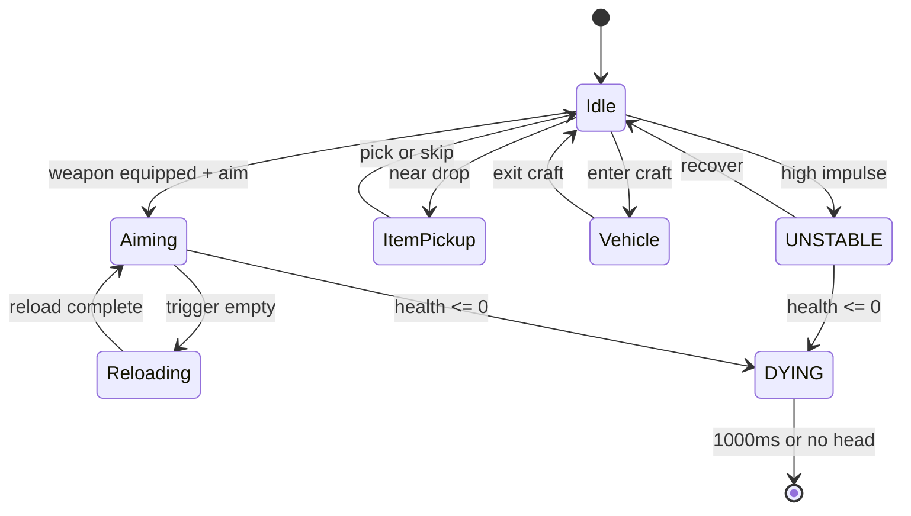

← [[systems/index|systems index]] · [[spec/ux-wireframes-slice-a|UX wireframes Slice A]] · [[spec/accessibility-comfort-slice-a|accessibility/comfort Slice A]] · [[systems/ux-ui-and-retention|UX/retention]] · [[systems/ai-trust-test-suite|AI trust suite]] · [[game/player-loop-and-ux|player loop]]

# UX Overlay And Screen Brief

> [!summary] Premise
> Cortex's depth is invisible without overlays. This brief is the screen inventory and overlay state model that the future game's UI must implement before any spec page locks. Each screen lists must-have data, interaction states, and acceptance tests.

> [!tip] Build-facing follow-up
> The concrete Slice A wireframes, UX event hooks, accessibility floors, and UX-W-01..UX-W-16 acceptance tests live in [[spec/ux-wireframes-slice-a]]. The detailed accessibility/comfort floor, ACC-A tests, run-bundle evidence additions, and equipment workbench readability requirements live in [[spec/accessibility-comfort-slice-a]].

## Screen Inventory

| Screen | Purpose | Modes |
|---|---|---|
| Tactical HUD | Direct control of one actor. | Idle, Aiming, Reloading, UNSTABLE, DYING, ItemPickup, Vehicle. |
| Squad Panel | Roster + jobs + alerts. | Compact, Expanded, Reordering, OrderQueueing. |
| Command Overlay | Order placement on the map. | OrderPick, RouteDraw, JobAssign, BlockedReason. |
| Buy / Loadout | Purchase actors/items/craft. | RoleFilter, Compare, DeliveryPicker, OwnedItems, MassWarning. |
| Material / Path Overlay | Inspect the world. | Integrity, Pathability, Hazard, OwnershipBuild. |
| Replay / Event Viewer | Postmortem and learning. | Live, Scrub, EventFilter, Bookmark. |
| Mission Briefing | Pre-mission context. | Objectives, Recommended Loadout, RiskAssessment. |
| Mission End Screen | Result + replay handoff. | Win, Loss, Aborted, RewardsBreakdown. |
| Mod Workbench (Editor) | Author content. | ModuleBrowser, EditorINI, EditorLua, AssetPreview, MaterialLab. |
| Pause / Slowdown | Tactical thinking room. | FullPause, Slowdown75, Slowdown25, Resume. |
| Settings / Accessibility | Controls, audio, video, captions, color. | Defaults, Custom, Per-Activity profiles. |

## Tactical HUD

| Field | Why It Matters | Acceptance |
|---|---|---|
| Reticle with weapon range arc | Aim feel + weapon role. | Player understands maximum effective range without firing. |
| Health silhouette (head/torso/arms/legs) | Body damage readability. | Player can identify which limb is wounded within 1 second. |
| Wounds count and trend | Predicts gib threshold. | Player can predict an imminent gib and choose retreat. |
| Stability indicator (STABLE/UNSTABLE) | Travel-impulse damage warning. | Player understands why aim "wobbles" after a fall. |
| Ammo + reload progress | Combat planning. | Visible during reload, hidden when not relevant. |
| Held device state | Jam/empty/overheat. | Cause-of-failure visible without reading log. |
| Stance (crouch/jet/climb) | Movement feel. | Animation+icon match. |
| Danger indicators (incoming shells, dropships, fire, gas) | Survival reflex. | Directional arrows or screen edges, not center clutter. |
| Order context | "Holding sentry," "moving to waypoint," "rescuing X." | Visible without opening squad panel. |

## Squad Panel

| Field | Notes |
|---|---|
| Unit row: portrait, role, status pill, current intent. | Status pill mirrors `Actor::Status` (STABLE/UNSTABLE/DYING). |
| Quick switch hotkey | Number key or scrollwheel; remappable. |
| Issue order button | Opens command overlay focused on that unit. |
| Squad mode tag | Doctrine preset: "Cautious bunker", "Aggressive breach", etc. |
| Alert badge | Recent alarm event affecting this unit. |
| Reorder | Drag to reorder; persistent. |

Acceptance: a player should be able to find the squadmate that "needs help" in under 2 seconds, with no random switching.

## Command Overlay

| State | What Shows | Cancel/Confirm |
|---|---|---|
| OrderPick | Wheel/menu of orders by role: move, defend, dig, breach, repair, rescue, hold-fire. | Right-click cancel. |
| RouteDraw | Pre-visualization of bot route over current terrain costs; segments highlighted blocked. | Click to set; right-click to abort. |
| JobAssign | Multi-unit assignment with role suggestion. | Confirm = lock. |
| BlockedReason | Tooltip explains why an order can't be issued (e.g. "needs digger", "no path", "delivery in path"). | Auto-displays on hover. |

The route visualization must update when terrain changes; this is the contract that ties to [[engine/terrain-mutation-and-pathfinding-lifecycle]].

## Buy / Loadout

| Field | Notes |
|---|---|
| Role filter (Assault, Engineer, Medic, Sniper, Demo, Scout, Commander) | Reduces cognitive load of huge lists. |
| Cost / Mass / Risk badges | Mass affects delivery; Risk hints at delivery hazards. |
| Owned counter | Clarifies "free because owned" cases. |
| Compare card | Side-by-side stats for two items. |
| Delivery preview | Choose craft; show landing risk and pathability of LZ. |
| Saved loadouts | Name + share + tag (per-mission). |
| AI competence indicator | Tells the player whether bots use the item well. |

Acceptance: building a competent squad for an unfamiliar mission should take under 60 seconds for a returning player.

## Material And Path Overlay

| Mode | Visualizes |
|---|---|
| Integrity | Material strength gradient; weak vs hard pixels. |
| Pathability | Per-team path costs; blocked nodes; door states. |
| Hazard | Fire, gas, electric, slippery, hot/cold. |
| Ownership/Build | Player- vs enemy-built terrain; fortification level. |

Toggle via single key; multiple modes can stack with reduced opacity. Critical for mission patterns in [[systems/destruction-objective-mission-patterns]].

## Replay / Event Viewer

| Feature | Tied To |
|---|---|
| Timeline scrub with event ticks | [[systems/replay-event-architecture]] |
| Event filter (combat, terrain, AI, mission) | Replay file format. |
| Death recap auto-pop | After actor dies; configurable. |
| Bookmark + share | Mod community + bug reports. |
| AI overlay during replay | Verifies AI trust scenarios. |

## Pause / Slowdown

A pure "pause" is too strong if the game is still real-time. The Cortex tradition is "buy menu pauses but world keeps simulating slowly". The future game should support:

| Mode | Description |
|---|---|
| FullPause | True pause; menu navigation only. |
| Slowdown75 | 75% speed; orders allowed; combat continues. |
| Slowdown25 | 25% speed; strong tactical thinking room. |
| Resume | Snap back to 100% with a brief animation cue. |

All four modes must be replay-aware so mid-mission saves and replays show the slowdown context.

## Modes And State Machine (HUD)

This mirrors the engine `Actor::Status` lifecycle in [[engine/body-damage-wound-gib-lifecycle]] so HUD truth = simulation truth.

## Acceptance Tests (UX Trust Suite)

| Test | Pass Criteria |
|---|---|
| HUD-01: Identify wounded limb | After two hits to a leg, the silhouette shows the leg orange within 1 second. |
| HUD-02: Status read | Player can describe whether actor is STABLE/UNSTABLE/DYING within 1 glance. |
| HUD-03: Loud weapon awareness | Firing a high-loudness weapon shows a "you were heard" badge. |
| SQUAD-01: Find the unit | Player picks the unit that needs help in under 2 seconds. |
| ORDER-01: Order preview | Issued route shows blocked segment; player understands why. |
| BUY-01: Loadout under 60s | Returning player builds a 4-unit squad in under 60 seconds. |
| MAT-01: Material readability | Player picks the right tool for a given material in under 2 seconds. |
| REPLAY-01: Death cause | Player identifies cause of death within 5 seconds of recap. |

## Anti-Patterns

| Anti-Pattern | Cost | Fix |
|---|---|---|
| Modal pause as the only thinking room | Players miss the simulation; tactical "feel" lost. | Slowdown75 + Slowdown25. |
| HUD shows abstract HP only | Players can't tell which limb is bleeding. | Body silhouette + wound count. |
| Order issued without feedback | Player thinks "AI is dumb". | Visible intent line + "I'll get there in N seconds" estimate. |
| Material overlay always on | Visual clutter; readability collapses. | Toggle with brief auto-show on demand. |
| Replay viewer separate from game | Players never use it; learning loop dies. | Auto-pop death recap; one-button access from end screen. |

## Open Questions

| Question | Notes |
|---|---|
| Should the squad panel be persistent or summoned? | Persistent risks clutter; summoned risks "out of sight, out of mind." |
| How does the command overlay coexist with direct control? | Probably tied to slowdown; needs prototype. |
| Should material overlay differ for player vs AI debug? | Player gets tactically curated info; AI debug shows raw costs. |
| Should the buy menu be diegetic (in-world terminal) or modal? | Cortex tradition is modal during pause; future may want both. |

## Source Trail

- [[systems/ux-ui-and-retention]]
- [[systems/ai-trust-test-suite]]
- [[systems/replay-event-architecture]]
- [[systems/destruction-objective-mission-patterns]]
- [[engine/body-damage-wound-gib-lifecycle]]
- [[engine/terrain-mutation-and-pathfinding-lifecycle]]
- [[game/player-loop-and-ux]]
