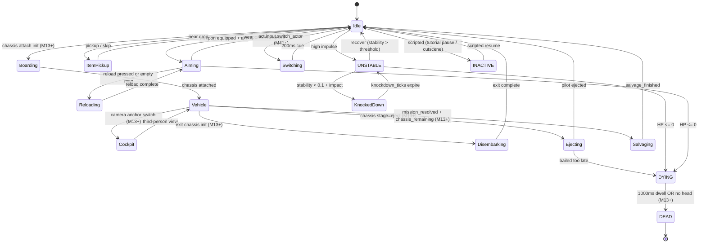

# M11 — Readability + ACC-A Floor

## Status

`active`

## Intent

Game state is readable from the HUD without text walls. Body silhouette + module strip + ammo + objective + timer + last-event ticker render with material overlay integration and tool-validity color cues. Accessibility floor (DR-012) is hit: 200% text scale + reflow, high-contrast mode, color-independent state labels, controller route through HUD, remap holds (hold-to-confirm), captions surface.

## Player-facing behavior

M11 is **the closure milestone for DR-003 (body damage readability) AND DR-012 (accessibility floor)**. Every UI surface from M11 forward inherits the ACC-A floor automatically because the `Settings` resource + `HudSettings` mirror + Bevy `UiScale` + palette swap + caption strip + `observe.accessibility` are workspace-wide.

### Information Priority Ladder (per ux-wireframes-slice-a)

HUD layout serves attention budgets, not just real-estate. Every element earns its zone by ladder:

| Layer | Attention | What lives here | Placement |
|---|---|---|---|
| **L0 — Immediate survival** | 0-500 ms | Incoming shell direction, dying state, reload-blocked reason, fall instability, blast radius warning, delivery danger arrow, hazard contact, knockdown stun, "you were heard" badge | Reticle / actor-adjacent cue, screen-edge directional arrow, paired sound + caption + haptic |
| **L1 — Active action state** | 0.5-2 s | Ammo + reload progress, wound limb tint, item state (jam/empty/overheat), aim range arc, current order context, jet/dig/repair state, stability indicator, sharp-aim build | Tactical HUD around actor/reticle + lower-left compact STATUS strip |
| **L2 — Squad / tactical state** | 2-5 s | Which bot needs help, path blocked, current doctrine, LZ risk, material overlay legend, mission timer, objective sub-line, reactor pressure (M9) | Squad strip, command overlay, material overlay, quick-detail drawer |
| **L3 — Planning / economy** | 5-60 s | Buy/loadout panel, role fit, delivery craft choice, package/server compatibility, replay browser rows | Full panel/table with filters, sort, comparison (M33 forward-compat) |
| **L4 — Debug / learning** | After-action | Death recap cause chain, AI failure tags, package diagnostics, replay event filters, backend health, accessibility audit | Viewer/report/workbench/hub screens (M10 + M33 already / future) |

Critical rule: **L0 + L1 cues must NEVER be hidden behind a panel toggle**. Player must always see "I am dying" / "I am out of ammo" / "There is incoming fire" without opening anything.

### HUD layout — 12 focusable nodes across 7 zones

Canonical list in `cf_control::engine::HUD_FOCUSABLE_NODES`:

- **Top-left (STATUS, L1)**: HP bar + max HP + stance label + stability descriptor + status pill (`STABLE` / `UNSTABLE` / `INACTIVE` / `DOWNED` / `DYING` / `DEAD` each with ASCII icon glyph)
- **Top-right (AMMO + ITEM, L1)**: ammo `n/m` + reticle-state label (`READY` / `RELOADING NN%` / `EMPTY` / `COOLDOWN Nt`) + selected slot 0-3 + heat/charge bar (if applicable)
- **Top-center (OBJECTIVE, L2)**: objective banner with title + sub-line + countdown timer (color-coded green → yellow → red at 30s / 10s thresholds + "Hold the line" caption at 5s)
- **Bottom-right (EVENT TICKER, L1-L2)**: last-important-event ticker (rendered via plain-language templates from M10's renderer; max 1 event visible at a time; auto-dismisses after 4 seconds)
- **Left edge (SILHOUETTE + MODULE STRIP, L1)**: body silhouette (per-zone HP%, head/torso/arms/legs at M11 scalar; chassis-backed per-zone at M13) + module strip (up to 5 modules: WEAPON / JET / SHIELD / SENSOR / REPAIR with state tag OK/DEG/WARN/FAIL/N/A and ammo/power/bound_zone fields)
- **Bottom-center (TOOL + REACTOR, L1-L2)**: TOOL validity line ("DIGGER: VALID" / "DIGGER: REFUSED — cannot dig metal") + REACTOR pressure line (M9 forward-compat: "REACTOR: NOMINAL/STRESSED/CRITICAL/VENTING/DESTROYED")
- **Banner stack (BANNERS, L0-L1)**: status banners render top-center stacked, sorted by severity (`[!!]` critical bottom = most visible; `[!]` warning middle; `[*]` info top). ASCII icon glyph ensures monochrome readability. Max 4 visible at a time; oldest evicts.

Additional L0 surfaces (rendered on top of all zones, never focusable):

- **Screen-edge directional arrows** for incoming projectiles / explosions / dropships / off-screen alarms (DR-046 juice + DR-055 hit-stop request)
- **Center-screen flash** on critical hits (suppressed when `reduce_flash=true`)
- **Camera punch** on weapon fire, magnitude × `(1.0 - reduce_shake_scale)` (DR-055)
- **Death recap modal** on `mission.mission_resolved.result=lost` with "Show me why" CTA → M10 (DR-023)
- **Pause/slowdown overlay** (DR-009 forward-compat — M11 ships the overlay state; M12 + M25+ implement command UX)

### Status banner taxonomy

Banners are the L0-L1 surface for state changes that need player attention NOW. M11 ships the full taxonomy below; producers ladder up at their owning milestones. Every banner has `(severity, glyph, text_template, parent_event_type, dismiss_condition)`.

**Body damage banners (DR-003 closure — producers in M1 + M13):**

| Banner | Severity | Glyph | Trigger event | Dismiss when |
|---|---|---|---|---|
| `HP_LOW` | warning | `[!]` | `actor.actor_status_changed` to UNSTABLE OR HP < 30% | HP > 50% |
| `BLEEDING_LEFT_ARM` | warning | `[!]` | `wound_added` to arm_left with bleed=true (M13+) | bleed cleared / wound healed |
| `LIMB_LOST_LEFT_LEG` | critical | `[!!]` | `attachable_detached` for leg_left (M13+) | actor death (banner persists otherwise) |
| `ARMOR_CRACKED_TORSO` | critical | `[!!]` | armor layer destroyed at torso (M13+) | armor repaired OR actor death |
| `ARMOR_CRACKED_HEAD` | critical | `[!!]` | armor layer destroyed at head (M13+) | repaired OR death |
| `ARMOR_CRACKED_LEFT_ARM` / `RIGHT_ARM` / `LEFT_LEG` / `RIGHT_LEG` | critical | `[!!]` | per-zone armor destroyed (M13+) | repaired |
| `ARMOR_CHUNKED_<zone>` | warning | `[!]` | armor.chunked_off fires for zone | zone re-armored (M13+) |
| `UNSTABLE` | warning | `[!]` | status_changed STABLE→UNSTABLE | recovery to STABLE |
| `KNOCKED_DOWN` | warning | `[!]` | Stance::KnockedDown entered | knockdown ticks expire |
| `DYING` | critical | `[!!]` | status_changed to DYING | DEAD (banner morphs into DEAD recap) |
| `STIMMED` | info | `[*]` | affliction.stim_active (M16+) | timer expires |
| `BLEEDING_OUT` | critical | `[!!]` | affliction.bleeding_severe (M16+) | stabilized via medikit |

**Deep damage banners (M9 NEW):**

| Banner | Severity | Glyph | Trigger | Dismiss |
|---|---|---|---|---|
| `INTERNAL_ORGAN_DAMAGED_<organ>` | warning | `[!]` | internal.organ_damaged | repair (medikit M13+) |
| `INTERNAL_ORGAN_DESTROYED_<organ>` | critical | `[!!]` | internal.organ_destroyed | (sticky until death) |
| `INTERNAL_CIRCUIT_DAMAGED_<circuit>` | warning | `[!]` | internal.circuit_damaged (robots) | repair |
| `INTERNAL_CIRCUIT_DESTROYED_<circuit>` | critical | `[!!]` | internal.circuit_destroyed (robots) | (sticky until robot inert) |
| `CONCUSSED_MILD` | warning | `[!]` | concussion.band_changed to Mild | band drops back to Clear |
| `CONCUSSED_MODERATE` | warning | `[!]` | band to Moderate | band drops back |
| `CONCUSSED_SEVERE` | critical | `[!!]` | band to Severe | drops back |
| `KO_IMMINENT` | critical | `[!!]` | band to KO_Imminent | drops back |
| `KNOCKED_OUT` | critical | `[!!]` | concussion.ko_threshold_crossed | KO duration expires |
| `INTERNAL_SHOCK_<band>` (robots) | warning/critical | `[!]`/`[!!]` | internal_shock.band_changed (robot equivalent) | band drops back |
| `INTERNAL_SHOCK_MODULE_DAMAGED` | warning | `[!]` | internal_shock.module_damaged | repair (M13+) |
| `OIL_LEAKING` | warning | `[!]` | fluid.leak_started kind=oil | leak stopped |
| `COOLANT_LEAKING` | warning | `[!]` | fluid.leak_started kind=coolant | stopped |
| `FUEL_LEAKING` | warning | `[!]` | fluid.leak_started kind=fuel | stopped |
| `ELECTROLYTE_LEAKING` | warning | `[!]` | fluid.leak_started kind=electrolyte | stopped |
| `FLUID_LOW_<kind>` | warning | `[!]` | fluid.reservoir_warning (50%) | refill |
| `FLUID_CRITICAL_<kind>` | critical | `[!!]` | fluid.reservoir_critical (20%) | refill |
| `FLUID_EMPTY_<kind>` | critical | `[!!]` | fluid.reservoir_empty (0%) | refill |
| `OIL_IGNITED` / `FUEL_IGNITED` | critical | `[!!]` | fluid.ignition (combustible only) | extinguish |
| `JOINTS_SEIZED` | critical | `[!!]` | oil reservoir empty cascade (motor_controller disabled) | refill + repair |
| `HELMET_BREACHED` | critical | `[!!]` | origin.helmet_breach | helmet repaired / atmosphere returns |
| `OXYGEN_LOW` | warning | `[!]` | oxygen_supply < 30s | resupply |
| `OXYGEN_CRITICAL` | critical | `[!!]` | oxygen_supply < 10s | resupply |
| `OXYGEN_EMPTY` | critical | `[!!]` | oxygen_supply == 0 | resupply or death |
| `G_LOAD_MILD` / `_MODERATE` / `_SEVERE` | warning/critical | `[!]`/`[!!]` | origin.g_load_dose_changed band crossings | dose decays |
| `AP_ROUND_INCOMING` (advanced) | info | `[*]` | combat.projectile_hit_mo with ap_factor >= 0.5 | (2s timeout; informational) |

**Equipment + weapon banners (M1 + M13):**

| Banner | Severity | Glyph | Trigger | Dismiss |
|---|---|---|---|---|
| `WEAPON_JAMMED` | warning | `[!]` | `chassis.weapon_jammed` (M13) OR rifle jam (M1) | `weapon_cleared` |
| `WEAPON_OVERHEAT` | warning | `[!]` | weapon heat > threshold (M13+) | heat dissipated |
| `EMPTY_MAG` | warning | `[!]` | rifle ammo = 0 | reload completed |
| `RELOADING_NN%` | info | `[*]` | reload_started | reload_completed |
| `NO_AMMO_RESERVE` | warning | `[!]` | all magazines depleted (M13+) | resupply / pickup |
| `LOW_AMMO` | warning | `[!]` | magazine < 25% | magazine refilled |
| `ITEM_BROKEN` | warning | `[!]` | held device durability = 0 (M13+) | item replaced |

**Chassis lifecycle banners (M13):**

| Banner | Severity | Glyph | Trigger | Dismiss |
|---|---|---|---|---|
| `CHASSIS_DEGRADED` | warning | `[!]` | chassis.stage_changed Nominal → Degraded | repair |
| `MODULE_WARNING_JET` | warning | `[!]` | module Jet state Warning | repair |
| `MODULE_FAILED_JET` | critical | `[!!]` | module Jet state Failed | repair |
| `MODULE_FAILED_SHIELD` | critical | `[!!]` | module Shield Failed | repair |
| `MODULE_FAILED_SENSOR` | warning | `[!]` | module Sensor Failed | repair |
| `EJECT_WINDOW_OPEN` | critical | `[!!]` | chassis.stage = eject | pilot ejected |
| `EJECT_NOW` | critical | `[!!]` | eject_ticks_remaining < 60 | ejected OR bailed too late |
| `BAILED_TOO_LATE` | critical | `[!!]` | pilot_bailed_too_late event | scenario.reset |
| `PILOT_INJURED` | warning | `[!]` | pilot_state=Injured | pilot extracted |

**Mission + reactor banners (M2 + M9 + M25):**

| Banner | Severity | Glyph | Trigger | Dismiss |
|---|---|---|---|---|
| `BREACH_OBJECTIVE_NEW` | info | `[*]` | objective_started for breach | objective completed |
| `OBJECTIVE_COMPLETED` | info | `[*]` | objective_completed | 4s timeout |
| `OBJECTIVE_FAILED` | critical | `[!!]` | objective_failed | mission_resolved |
| `EXTRACTION_OFFERED` | info | `[*]` | mission director extraction window | window closes |
| `EXTRACTION_CLOSING` | warning | `[!]` | extraction window < 10s | extracted OR window closes |
| `RESCUE_WINDOW` | warning | `[!]` | DR-018 rescue window opens (M13+) | rescue / window closes |
| `MISSION_CRITICAL_ACTOR_DOWN` | critical | `[!!]` | mission_critical actor enters DYING | rescued OR mission_resolved |
| `REACTOR_NOMINAL` | info | `[*]` | M9 reactor pressure_state=Nominal first set | state advances |
| `REACTOR_STRESSED` | warning | `[!]` | reactor pressure_state=Stressed | back to Nominal OR advance |
| `REACTOR_CRITICAL` | critical | `[!!]` | reactor pressure_state=Critical | repair OR destroy |
| `REACTOR_VENTING` | critical | `[!!]` | reactor pressure_state=Venting | repair OR destroy |
| `REACTOR_DESTROYED` | critical | `[!!]` | mission.reactor_destroyed | mission_resolved |
| `TIMER_30s` / `TIMER_15s` / `TIMER_5s` | warning/critical | `[!]`/`[!!]`/`[!!]` | mission.timer_warning_threshold | timer expires |
| `TUTORIAL_PAUSED` | info | `[*]` | mission.objective_paused | resumed |

**Threat awareness banners (M2 + M14+):**

| Banner | Severity | Glyph | Trigger | Dismiss |
|---|---|---|---|---|
| `HEARD_BY_ENEMY` | warning | `[!]` | `ai.perception_signal` kind=hearing with player as source | 5s timeout |
| `SPOTTED` | warning | `[!]` | `ai.target_acquired` with player as target | LOS lost OR 5s |
| `INCOMING_FIRE` | warning | `[!]` | projectile trajectory toward player (M14+) | impact OR miss |
| `INCOMING_EXPLOSIVE` | critical | `[!!]` | grenade/rocket tracked toward player (M14+) | detonation |
| `DROPSHIP_INCOMING` | warning | `[!]` | dropship vector toward player vicinity (M25+) | dropship landed |
| `FRIENDLY_FIRE_DANGER` | warning | `[!]` | weapon arc covers friendly (M41+ teams) | aim shifts |
| `HAZARD_ON_PATH` | warning | `[!]` | walking toward hazard tile (M3 + M16) | redirected |

**Comms banners (M37 forward-compat):**

| Banner | Severity | Glyph | Trigger | Dismiss |
|---|---|---|---|---|
| `RADIO_INCOMING` | info | `[*]` | `radio.transmission_received` (M37+) | message ends |
| `RADIO_BLOCKED_JAMMED` | warning | `[!]` | `radio.interference_event` | clear signal |
| `VOICE_BLOCKED_VACUUM` | warning | `[!]` | `voice.transmission_blocked` reason=vacuum (M19+) | atmosphere returns |

**Accessibility banners (M11 own surface):**

| Banner | Severity | Glyph | Trigger | Dismiss |
|---|---|---|---|---|
| `CONTROLS_CAPTURED` | info | `[*]` | overlay/settings panel grabs input | overlay closed |
| `HOLD_TO_CONFIRM` | info | `[*]` | hold_to_confirm=true + destructive action held | threshold reached OR released |
| `SETTING_APPLIED` | info | `[*]` | accessibility.settings_changed | 2s timeout |
| `FOCUS_TRAPPED` | warning | `[!]` | focus traversal hit a non-existent node (dev diagnostic) | focus_cleared |

**Banner stack invariants:**

- Max 4 visible at once; oldest non-critical evicts first; critical banners are sticky.
- Critical banners render BELOW warning + info (most visible to peripheral vision).
- Banners auto-dismiss when their `dismiss_condition` event fires.
- `ux.banner_raised` fires on entry; `ux.banner_dismissed` on exit; both carry `parent_event_id` linking to the trigger.
- `cfctl observe.accessibility.banners` returns the live stack for AI Self-Test grading.

### Body damage readability (DR-003 closure detail)

DR-003 closes at M11 with **Recommendation E (hybrid default + advanced opt-in)**. The HUD body surface ladders up additively:

**M1 (closed) — placeholder silhouette:**
- `ActorObservation.body_silhouette: BodySilhouette { head, torso, arm_left, arm_right, leg_left, leg_right, placeholder: true }`
- Each zone HP% derived from scalar HP (e.g. `zone = hp/max_hp`)
- HUD renders the 6-zone widget; tint is plain "hp%" scaled, all zones identical until M13

**M11 (this milestone) — full readability surface:**
- HUD silhouette widget renders 6-zone tinting (red gradient for low HP; gray for "destroyed" placeholder)
- **Wound count + trend display** per CCCP `MOSRotating::GibWoundLimit` (M2+ reactive guard emits `wound_added` events; M11 renders the count near the silhouette + trend arrow ↑ when increasing)
- **Stability indicator** strip (SOLID / SHAKEN / UNSTABLE / CRITICAL / DISRUPTED / KNOCKED_DOWN) per M1's stability scalar
- **Status pill** with ASCII glyph: `[OK] STABLE`, `[!] UNSTABLE`, `[!] DOWNED`, `[!!] DYING`, `[X] DEAD`, `[--] INACTIVE`
- **Status pill dwell-time bar** for DYING state (1000ms countdown to DEAD per CCCP `Actor.cpp:1229`)
- **HP_LOW + UNSTABLE + KNOCKED_DOWN banners** auto-raise on threshold crossings
- **HUD-01 acceptance test passes**: player identifies wounded limb in <1s with silhouette tint
- **HUD-02 acceptance test passes**: player reads STABLE/UNSTABLE/DYING in 1 glance via status pill
- **HUD-03 acceptance test passes**: "you were heard" badge appears within 500ms of weapon_fired with loudness above hearing threshold

**M13 (concurrent or post-M11) — chassis-backed real per-zone:**
- `BodySilhouette.placeholder` flips to false when chassis attaches
- 15-zone body graph (CCCP-style: head, torso, arm_left/right, forearm_left/right, hand_left/right, leg_left/right, shin_left/right, foot_left/right, backpack)
- Per-zone has 3 armor layers (External / Internal / Core) — each with own HP, hardness, condition
- HUD silhouette widget tints by Core HP; armor-cracked banners fire when a layer reaches 0
- Module strip shows per-module state with bound_zone reference (which limb the module is attached to)
- Wound emitters render per-zone with positions (entry / exit) per CCCP `MOSRotating::AddWoundExt` pattern
- Limb-loss banners (`LIMB_LOST_LEFT_LEG`) on `attachable_detached` event
- Per-zone damage_multiplier visible in advanced HUD

**M16 (forward-compat) — afflictions overlay:**
- Per-actor affliction layer per `affliction.*` event family (M16+): wetness, burning, corroded, electrified, poisoned, asphyxiating, concussed, drowning, depressurizing, internal_shock, coolant_leaking, oil_leaking, overheating, low_battery, hypoxia
- HUD shows affliction icons + stack count under the silhouette
- M11 reserves the HUD slot; producers ladder up at M16

**Damage cause readability (HUD-01 / ACC-A-09 / DR-018 closure surface):**
- When HP transitions trigger a banner, the EVENT ticker shows the cause in plain language ("Wounded by guard's rifle, torso, 15 damage")
- Death recap modal (via M10 cause-chain) shows last-3-seconds cause chain
- "Show me why" CTA hands off to M10 for full debrief
- Mission-critical flag visible in silhouette tint (gold border on body for `mission_critical=true` actors)

### Chassis HUD layering — pilot-inside-mech dual representation (M13+ forward-compat)

The defining identity in Cortex-family games is the **dual player role**: direct actor pilot + battlefield commander. When a player IS the pilot inside a chassis (M13+), the HUD must show BOTH the pilot status AND the chassis status simultaneously — NOT collapse one into the other (per UX brief: "Treating a mech like a single health bar" is an explicit anti-pattern).

**M11 reserves the surface layering**; M13 fills it:

```
+----------------------------------------------------------------------+
|                     PILOT SILHOUETTE (small, top)                     |
|              head / torso / arms / legs — actor HP                    |
|                                                                       |
|                  CHASSIS SILHOUETTE (large, below)                    |
|       cockpit / armor zones / fuel tank / reactor / modules           |
|              Module strip mirrors chassis modules                      |
|                                                                       |
|       FUEL / POWER / HEAT gauges (chassis-specific zone)              |
+----------------------------------------------------------------------+
```

When `chassis_attached=false`: pilot silhouette is the only body widget (M11 default).
When `chassis_attached=true`: pilot silhouette shrinks to ~30% size at top-left of the body zone, chassis silhouette takes the primary visual space, and chassis-only gauges (fuel/power/heat) appear in the AMMO+ITEM zone.

**Chassis silhouette is a separate projection**:
- `observe.chassis.silhouette` returns the chassis-specific zone graph (per-chassis-shape variant; humanoid=15 zones; quadruped=11 zones; tank=8 zones; reserved at M11, populated at M13)
- `observe.chassis.modules` returns the module strip data
- `observe.chassis.power` returns fuel/power/heat gauges
- Pilot silhouette continues to return via `observe.actor.silhouette` (the pilot inside the chassis is still a separate Actor entity)

**Eject visualization**: when chassis stage=eject, the chassis silhouette dims + the pilot silhouette flashes red border + `EJECT_NOW` critical banner. Player ejecting causes chassis silhouette to fade out + pilot silhouette to enlarge back to default size.

### Chassis HUD by weight class (M13+ forward-compat)

CCCP-family games (and DR-029 chassis identity) support different chassis weight classes. M11 reserves the surface contract so M13+ classes inherit without renaming:

| Class | Pilot silhouette size | Chassis-specific gauges | Module slots | Notes |
|---|---|---|---|---|
| `Light` (humanoid power armor) | 60% (small but visible) | Battery + minor heat | Up to 3 (jet + shield + weapon) | Per-zone HP tracked; armor crack banners fire |
| `Medium` (mech bipedal) | 40% | Fuel + heat + battery | Up to 5 (jet + shield + weapon + sensor + repair) | Default chassis profile |
| `Heavy` (tank / quadruped) | 25% (icon-sized) | Fuel + heat + cooling system + reactor pressure | Up to 7 (extended turret + sensor + repair + shield + secondary weapons) | No jet; ground-only mobility |
| `Drone` (no pilot — autonomous) | (hidden) | Battery only | Up to 4 | Pilot silhouette hidden entirely; brain-actor-switch banner if controlling |

M11's HUD must NOT hardcode "humanoid bipedal" as the only chassis shape. The silhouette renderer reads `chassis.shape_variant` and draws accordingly.

### Chassis fuel + power + heat gauges (M13+ forward-compat)

Chassis-only resources distinct from actor HP. M11 reserves the HUD slot — placed in the AMMO+ITEM zone when chassis is attached:

| Gauge | Range | HUD widget | Banner triggers |
|---|---|---|---|
| **FUEL** | 0..max_fuel (oz / liters) | Vertical bar with fuel-state label (FULL / OK / LOW / CRITICAL / EMPTY) | `FUEL_LOW` warning at 25%; `FUEL_EMPTY` critical at 0 |
| **POWER** | 0..max_power (kW or % battery) | Lightning bolt icon + power-state label (FULL / OK / LOW / RESERVE) | `POWER_LOW` warning at 25%; `RESERVE_POWER_ACTIVE` warning |
| **HEAT** | 0..max_heat (°C or %) | Thermometer icon + heat-state label (COOL / WARM / HOT / OVERHEATING) | `HEAT_HIGH` warning at 70%; `OVERHEATING` critical at 90%; `MELTDOWN_IMMINENT` critical at 95% |
| **REACTOR_PRESSURE** (heavy class only) | enum | Pressure gauge mirroring M9 reactor pressure_state | Existing REACTOR_* banner family |

Empty fuel forces ground-only mobility (no jet). Reserve power disables non-essential modules (sensor first, then shield, then weapons). Overheating disables weapons until cooled. Reactor critical → meltdown timer banner + "EJECT NOW" cascade.

### Pilot dual stance + chassis stance derivation

When chassis is attached, the player's stance comes from TWO sources:

| Stance source | Drives | Display |
|---|---|---|
| `Actor.stance` (pilot inside chassis) | (mostly invisible) | Pilot silhouette pose |
| `Chassis.stance` derived from chassis motion | Camera, animation, HUD | Chassis-stance label in STATUS zone |

Per `cf-actor::Stance` extensions: `Idle, Walking, Running, Crouching, Airborne, KnockedDown, Downed, Dying, Dead, Ejecting, Climbing, Jetting` + (M13) `Piloting, ChassisWalking, ChassisJetting, ChassisCrouched, ChassisProne, Driving, Boarding, Disembarking, Salvaging`. Stance::from_chassis derives chassis-driven stance when chassis_attached=true.

### Camera anchor + brain-actor switching (M13+ + M41+ forward-compat)

Cortex-family games support **camera anchor switching** (CCCP brain-hopping or actor-switching). M11 reserves the surface:

- **First-person mech-cockpit view** (M13+): when piloting a chassis, the camera can dock at the cockpit anchor; HUD adds a "COCKPIT" badge + sharper field-of-view tint
- **Third-person actor view** (default): when out of chassis OR commanding, camera follows the actor at default distance
- **Brain camera (M41+)**: when the player IS the brain (high-value command actor), the brain warning pulses near the silhouette ("BRAIN AT RISK")
- **Switching between controlled actors** (M41+ squad command OR DR-022 humanlike): brief camera transition (200ms ease-out) + caption "Switched to <actor name>" + previous-actor handoff order summary
- **act.input.switch_actor { actor_id }** (forward-compat; M41+): cycles controlled actor; emits `ux.actor_switched` event
- **Brain-threat banner**: critical banner when brain HP < 30% OR enemy LOS to brain (CCCP pattern from `GameActivity.h:204-241`)

### Delivery + dropship + craft surface (M25+ forward-compat)

Cortex-family games make delivery a queue, not a button (per CCCP `GameActivity.cpp:688-695`). M11 reserves the **delivery preview** + **landing zone risk** + **craft state** surfaces:

| Surface | M11 status | M25+ fill |
|---|---|---|
| **Delivery queue counter** | Slot in OBJECTIVE zone reserves "DELIVERY: 1 incoming" | Live queue with ETA per slot |
| **Landing zone risk arrow** | Screen-edge arrow reserved for `LZ_RISK` | Tints by hazard density / enemy proximity / wall integrity |
| **Craft state banner** | Slot in banner stack reserved | `CRAFT_INCOMING`, `CRAFT_LANDING`, `CRAFT_HATCH_OPEN`, `CRAFT_HATCH_CLOSE`, `CRAFT_TAKEOFF`, `CRAFT_CRASHED`, `CRAFT_SCUTTLED` |
| **Cargo eject** | Slot reserved | "[CARGO] 3 actors + 2 weapons → LZ" preview |
| **Pickup range** | Slot reserved | "PICK UP <item>" prompt when actor within pickup radius |
| **Scuttle button** | Action reserved (`act.craft.scuttle`) | Triggers scuttle with confirmation hold |
| **Crash risk warning** | Slot reserved | "CRAFT WILL CRASH — angle too steep" warning + remediation |

### Extraction zone + objective marker arrows (M2 + M25+ forward-compat)

Per CCCP `GameActivity.h:204-241` (objective arrows + landing-zone arrows + banners):

- **Objective arrow** points to the active objective from edge of screen (M2 baseline; M11 surface)
- **Extraction arrow** points to extraction zone when `extraction_offered=true`
- **Brain threat arrow** (M41+): points to the brain when brain takes damage
- **Last-known position trail** (M14+ memory): faint trail dots showing last-known enemy position when out of LOS

All arrows include text label per DR-012 ACC-A-03 (e.g. "OBJECTIVE: BREACH WALL — 32m NE"). All arrows respect reduce_motion (no pulsing if reduced).

### Pickup label + item interaction prompts

When the player is within pickup radius of a drop / weapon / item:

- "PICK UP <item name>" prompt near actor (L1)
- Press [F] (or remapped) to pick up; or hold-to-confirm if `hold_to_confirm=true`
- Caption "Picked up <item>" surfaces on success
- "INVENTORY FULL — drop item first" warning if backpack full
- "WEAPON LOCKED — wrong faction" warning if item belongs to enemy team (M41+ team forward-compat)
- `ux.pickup_prompted` event fires on prompt display; `equipment.item_picked_up` fires on success

### Brain core + base power panel forward-compat (DR-029)

Cortex-Command-family games have a **base core identity** (DR-029): the command core can stay rooted in base (defensive bunker) OR uproot into an avatar body (mobile risk). M11 reserves the **Base Power Panel** slot:

| Surface | M11 status | M25+ fill |
|---|---|---|
| **Base core HP** | Slot reserved in banner stack (`BASE_CORE_DAMAGED` critical) | Core HP gauge + uprooted/rooted state |
| **Base power budget** | Reserved | "POWER BUDGET: 12/16 modules online" + reserve warning |
| **Base shield grid** | Reserved | Per-module shield state (front / back / side) |
| **Turret network** | Reserved | Per-turret state + ammo + power |
| **Sensor coverage** | Reserved | Sensor radii visible on tactical overlay |
| **Door / repair module** | Reserved | Per-module state |
| **Avatar warning** | Reserved | "AVATAR EXPOSED — core uprooted, base undefended" critical |
| **Uproot/Reroot action** | Reserved (`act.base.uproot` / `act.base.reroot`) | Hold-to-confirm + cost feedback |

These panels are NOT rendered at M11; M11 just reserves the HUD slot + event categories + observe.* contracts.

### Mech bay / repair bay / salvage panel forward-compat (DR-016 + DR-018)

Cortex-family games have **persistent chassis identity**: armor scars, repair logs, pilot history, salvage workflow. M11 reserves these forward-compat panels:

| Panel | M11 status | M13+ fill |
|---|---|---|
| **Mech bay** | Reserved as L3 panel slot | Chassis inventory + per-chassis stats + repair queue |
| **Repair bay** | Reserved | Active repair operations + ETA per chassis + cost feedback |
| **Salvage panel** | Reserved | Post-mission salvage list + tag-to-keep / tag-to-scrap |
| **Pilot dossier** | Reserved | Per-pilot history: missions / kills / wounds / scars |
| **Module scars** | Reserved | Cosmetic scars on chassis surface (per DR-019 visual direction) |
| **Veteran panel** (M41+) | Reserved | Named actors + trait icons + reputation |
| **Commander dossier** | Reserved | Enemy commanders + rival AI persistence |

### Squad strip with role icons (M13+ forward-compat)

Per ux-overlay-screen-brief Squad panel + CCCP `Activity.cpp:676-715`:

- Reserved zone in upper-right (next to AMMO)
- Up to 4 squad members displayed
- Each row: hotkey [1-4] + role icon + health state + alert badge
- Click row OR hotkey: switch to that actor
- Hover row: shows current intent / order
- "Heard fire" alert if squad member observed combat
- Leader/follower badge shows who leads when player is not directly controlling
- Body-switch transition: 200ms ease, caption "Switched to <name>"

### Side-view body silhouette (per Cortex Command / Soldat lineage)

The user demand: **"limb resolution is currently in game but seems to be facing the camera, and should be facing side to side right?"**. M11 HUD silhouette explicitly renders the **side-profile body** (matching the side-view game rendering).

**Side-view body silhouette layout:**

```
+---------------------+
|     (HEAD)          |
|       O             |     ← head zone (top-center)
|       |             |
|    /<---+---->\     |     ← shoulders + arms (near + far)
|   /     |      \    |     ← side-profile torso (chest forward)
|  /  TORSO     \    |     ← (chest = "front" zone facing camera direction)
| /              \    |
| |   |  |   |  |     |     ← legs side-by-side (front + back per facing)
| |   |  |   |  |     |     ← feet at bottom
+---------------------+
```

**Side-profile zones rendered:**

- `head` — top-center; visible
- `torso_front` — chest area (visible when facing toward camera-side)
- `torso_back` — back of torso (visible when facing away)
- `arm_near` — arm closer to camera; always visible
- `arm_far` — arm farther from camera; mostly hidden behind torso (visible if torso damaged)
- `leg_front` — leg in front (relative to facing direction)
- `leg_back` — leg in back
- `backpack` — visible as small wedge behind torso (when facing perpendicular to view)
- `feet_pair` — paired at bottom

**Sprite-flip per facing direction:**

- When `Actor::facing = Right`: torso right side faces camera; back of torso = `torso_back` zone
- When `Actor::facing = Left`: sprite flipped horizontally; what was `torso_front` becomes `torso_back` visually
- Per zone, HUD silhouette renders the SIDE PROFILE (NOT front-facing). The widget is a 2D side-view bone structure, not a front-facing humanoid.

**Side-view per-zone tinting (M9 + M13 5-tier integrity carries over):**

Each side-profile zone tints per HP / integrity band:
- Pristine: full color
- Scratched: slight darkening
- Cracked: visible cracks rendered on sprite
- Critical: red halo + visible damage texture
- Destroyed: zone removed from sprite (severed limb visible as ground debris)

**Side-view armor angle indicator (M13 forward-compat):**

When chassis attached:
- Per-zone armor angle pip shows the mount angle (e.g. "Torso 30° forward slope")
- Threat-direction indicator overlays on silhouette — shows where enemy fire is coming from
- Side-view layout makes it clear which zones are exposed per facing direction

**Limb-loss visual update:**

When a limb is severed (per M13/M14 contract):
- Silhouette removes that limb from the side-view render
- Visible blood/oil splatter at severance point (per origin)
- Severed limb visible on ground as physical debris (M14 ragdoll)
- HUD banner: "LIMB LOST: <which arm/leg> — <consequence>"

**Anti-pattern: do NOT render front-facing humanoid silhouette for chassis-bearing actors:**

- M11's HUD silhouette MUST be side-profile (matching the side-view game)
- Front-facing silhouette is reserved ONLY for menu / loadout / character sheet UIs (M33+ shell UI)
- Per CCCP `AHuman` and Soldat character rendering — actors are 2D side-profile

### Origin-specific resource bars (M17 — no HP bar)

The user demand: **"actors don't have HP, they either have blood (human) or oil and energy (robot) or blood and energy (android)"**. M11's HUD ditches the master HP bar for chassis-bearing actors and shows origin-specific resource bars.

**Per-origin HUD layouts:**

**Humans (blood + caloric + stamina + oxygen):**

```
+-------------------------------+
| BLOOD     [▮▮▮▮▮▮▮▮▮▮]  100%   |  ← primary (red); critical at <30%
| CALORIC   [▮▮▮▮▮▮▮▮  ]  78%    |  ← orange
| STAMINA   [▮▮▮▮      ]  40%    |  ← cyan (M6 baseline)
| OXYGEN    [▮▮▮       ] 120s    |  ← in vacuum only; cyan
+-------------------------------+
```

**Robots (power + oil + heat + electrolyte):**

```
+-------------------------------+
| POWER     [▮▮▮▮▮▮▮▮▮ ]  85%    |  ← primary (cyan); critical at <30%
| OIL       [▮▮▮▮▮     ]  50%    |  ← yellow; mobility-critical at 0%
| HEAT      [▮▮▮       ]  35%    |  ← orange; critical at 90% (overheat)
| BATTERY   [▮▮▮▮▮▮▮   ]  70%    |  ← if dual-source robot
+-------------------------------+
```

**Androids (blood + power + caloric + stamina):**

```
+-----------------+-----------------+
| BLOOD  100%     | POWER     85%    |  ← hybrid: both shown side-by-side
| [▮▮▮▮▮▮▮▮▮▮]    | [▮▮▮▮▮▮▮▮ ]      |
+-----------------+-----------------+
| CALORIC 78%     | OIL       50%    |
| [▮▮▮▮▮▮▮▮▮▮]    | [▮▮▮▮▮    ]      |
+-----------------+-----------------+
```

**Powered organic / heavy_biomech:** custom layouts per origin matrix.

**Per-bar visual:**

- **Bar fill** = current_resource / max_capacity
- **Color tint** per state: cyan/green >50%, yellow <50%, orange <30%, red <10%
- **Pulsing animation** when actively draining (subtle; respects reduce_motion)
- **Tooltip on hover**: "Blood: 3850/5000 mL | Drain rate: -5 ml/s (severe bleeding from heart wound) | Predicted depletion: 13s"
- **Banner triggers per resource**:
  - `BLOOD_CRITICAL` (red, critical) at <30%
  - `BLOOD_LETHAL` (red, critical) at <10%
  - `POWER_LOW` (yellow) at <30%
  - `POWER_RESERVE` (red) at <10%
  - `OIL_LOW` (yellow) at <30%
  - `OIL_EMPTY` (red) at 0%
  - `HEAT_CRITICAL` (red) at 90%
  - `OXYGEN_LOW` (yellow) at <30s remaining
  - `OXYGEN_CRITICAL` (red) at <10s

**HUD widget — Origin-Specific Resource Strip:**

- Renders in the STATUS zone (top-left)
- For chassis-bearing actors only; un-chassis actors (M1 baseline) still show scalar HP for backward compat
- Layout adapts per origin (1-4 bars visible; 1-3 advanced bars in expandable tooltip)
- Settings.advanced_resource_view (default false) shows all resource bars + drain rates + organ damage indicators

**Death recap modal — origin-aware (M10 integration):**

When player dies, the modal shows the actual resource depletion that killed them:

- "You bled out. Blood: 5000 → 0 ml over 23s. Caused by: heart wound (-5 ml/s, started tick 1200) + femoral artery (-10 ml/s, started tick 1500). Medikit applied at 1230 but couldn't stop both bleeds."
- "You shut down (robot). Power_core destroyed by AP round at tick 3450 — instant offline. Total power dropped 100 → 0 in 18s."

**Anti-pattern check — no master HP bar:**

- HUD MUST NOT render a master "HP" bar for chassis-bearing actors (only resource bars)
- Replay viewer death recap MUST NOT report "HP: 0" — must report "Blood: 0 ml" / "Power: 0 kWh" / etc.
- Cause chain MUST attribute cause to specific resource depletion + organ/circuit that triggered it
- "HP" backward-compat field on ActorState is DERIVED only — never directly damaged

### War Thunder-style armor angle HUD widget (M9 + M13 forward-compat)

The user demand: **War Thunder-style armor / deflection / angled armor visualization**. M11 reserves the **armor angle HUD widget** for chassis-bearing actors; M13 fills with full per-zone angle visualization.

**Armor Angle Indicator widget** — positioned near the body silhouette (chassis HUD section):

```
+----------------------------------------------------------------------+
|              CHASSIS SILHOUETTE (primary)                             |
|                                                                       |
|        ARMOR ANGLE INDICATOR (overlaid on silhouette)                 |
|        Per-zone arrow showing armor mount angle                       |
|        e.g. Front: 30° slope; Side: 0° (flat); Back: 45° slope        |
|                                                                       |
|        THREAT ARROW (red; shows current incoming-fire angle)          |
|        e.g. "Incoming from 25° NE"                                    |
|                                                                       |
|        EFFECTIVE ARMOR TOOLTIP (on hover)                             |
|        "Front: 30° slope + threat at 35°NE = 65° impact angle         |
|        → 2.0× effective thickness (60mm RHA → 120mm)                  |
|        → Ricochet probability: 25%"                                   |
+----------------------------------------------------------------------+
```

**Pre-fire penetration probability tooltip** (when aiming at enemy):

When player hovers reticle over an enemy chassis:
- Tooltip shows: target zone, nominal armor, mount angle, projected impact angle (computed from player position + target facing), effective thickness, ricochet probability, penetration probability with current weapon
- Example: "Target: enemy mech (Light) | Zone: Front | Nominal: 60mm RHA | Mount: 30° | Impact angle: 25° | Effective: 66mm | Ricochet: 5% | Pen prob (rifle): 12% | Pen prob (AP rifle): 65% | Pen prob (HEAT): 95% (if spaced armor → 60%)"

Player can learn the math + plan weapon choice + approach angle.

**Threat awareness — angle indicator:**

When taking fire from a specific direction:
- HUD shows incoming-fire angle relative to actor's facing
- Color-coded: green if armor is angled toward threat (effective thickness >1.5×); yellow neutral; red if flat/exposed
- Banner if hit at unsafe angle: `HIT AT UNSAFE ANGLE — face the threat`

**Penetration cam — basic ray visualization (M11; M41 polishes)**:

When penetration succeeds:
- Brief 200ms slow-motion of the ray traversal through chassis
- Visible ray line + module hit indicators (red highlight on hit modules)
- Spalling fragments visible as small sparks
- Settings.penetration_cam_enabled toggleable (default on; respects reduce_motion)
- HUD caption shows module impact summary

M41 ships the full **War Thunder-style polished kill cam** with 3D ray rendering + full module visualization + ammo rack detonation cinematic + spalling fragment trace.

**M13 chassis penetration cam fills full:**
- Per-zone armor angle pip strip (per chassis silhouette)
- Real-time threat-direction arrow
- Pre-fire penetration probability vs aimed target
- Penetration cam playback on each hit

### Per-limb armor strip — deep damage HUD readability (M13 forward-compat)

The user demand: armor takes damage before the limb; every limb has separate armor based on equipped gear; armor visibly chunks off; damage events route through layered armor stages. M11 reserves the per-limb armor surface; M13 chassis fills with real per-zone armor items.

**Per-limb armor strip widget** — secondary strip ALONGSIDE the body silhouette:

```
+----------------------------------------------------------------------+
|        BODY SILHOUETTE (primary L1 visual)                            |
|        head / torso / arm / leg with limb HP tinting                  |
|                                                                       |
|        PER-ZONE ARMOR LAYER STRIP (NEW widget — secondary)            |
|        per zone: armor item type + 3 layer pips (External/Internal/Core)
|        e.g. "Helmet: PRIST | PRIST | PRIST"                          |
|              "Chest:  CRACK | DEST  | PRIST"                          |
|              "L Arm:  --                  (un-armored)"               |
+----------------------------------------------------------------------+
```

Each zone shows:
- `armor_item.material_id` (icon + label e.g. "Metal Plate")
- 3 layer pips with the 5-tier color signature (Pristine / Scratched / Cracked / Critical / Destroyed / ChunkedOff)
- If un-armored: shows "--" (text label so monochrome reading is OK)
- On hover: tooltip "Material: metal_plate | External Cracked (60%) | Internal Pristine (100%) | Core Pristine (100%) | AP resist: 0.6 | Damage resist: kinetic 0.7, thermal 0.4"

**Armor chunked-off animation:**
- When `armor.chunked_off` fires, a brief 200ms animation shows the layer pip "falling" out of the strip and into a physical-debris position (cosmetic; respects reduce_motion)
- A new "ARMOR_CHUNKED_<zone>" banner fires (warning severity)
- The chunked debris is visible on the world (as a separate sprite the player can see + pick up)

### Internal silhouette overlay — organs (humans/androids) / circuits (robots)

The user demand: simulate organs/circuits that take damage from heavy hits or explosions. M11 reserves the surface; M13+ fills.

**Internal silhouette widget** — overlaps the body silhouette with a TRANSLUCENT secondary silhouette showing organ/circuit state:

```
+----------------------------------------------------------------------+
|              BODY SILHOUETTE (50% opacity primary)                    |
|                                                                       |
|        INTERNAL OVERLAY (50% opacity, behind/in-front toggle)         |
|        Humans/androids: heart (pulsing), lungs (×2), brain, spine,    |
|                         liver, kidneys (×2), stomach, intestines      |
|        Robots: power_core, cpu, sensor_array, motor_controllers (×4), |
|                hydraulic_pump, coolant_pump, oil_reservoir, fuel_tank |
+----------------------------------------------------------------------+
```

**Toggle modes:**
- `off` (default): no internal overlay
- `auto-on-damage`: appears when any internal.organ_damaged or internal.circuit_damaged fires (M9+ producer)
- `always-on`: always visible for advanced players
- `on-hover`: appears when player hovers their own silhouette

**Color signature:**
- Pristine: subtle green tint
- Damaged: yellow tint with HP % overlay
- Critical: orange with pulsing
- Destroyed: red with crack pattern + ghost icon

**Per-organ/circuit tooltip on hover:**
- "Heart: 65/100 HP — DAMAGED — at-risk: severe bleed"
- "Power_core: 30/100 HP — CRITICAL — robot inert imminent"
- "Oil_reservoir: 50/100 L — LEAKING (rate 1.2 L/s)"

**Acessibility-friendly internal overlay:**
- ALWAYS includes text label per organ (DR-012 color-independent)
- Toggle is keyboard-reachable (Tab through HUD)
- High-contrast mode: organ shapes have hard outlines (not soft glow)
- ColorblindSafe mode: uses shape AND color (heart=heart-shape, lung=lung-shape, brain=brain-shape) for monochrome readability

### Concussion + Internal Shock vignette + bloom HUD

The user demand: repetitive small arms fire causes concussion + reduced movement + vision. M11 reserves the surface; M17 origin model produces.

**Vignette per concussion band:**

| Band | Vignette intensity | Screen kick | Caption |
|---|---|---|---|
| `Clear` | 0% | (none) | (no caption) |
| `Mild` | 10% edge dim | Light shake on hit | "Concussed (mild)" |
| `Moderate` | 30% dim | Medium shake on hit + slight aim wobble | "Concussed (moderate) — aim impaired" |
| `Severe` | 60% dim + slight tunneling | Strong shake; vision swaying | "Concussed (severe) — vision tunneled" |
| `KO_Imminent` | 85% dim + heavy tunneling | (anti-aliased blackout edges) | "BRACE — about to black out" |
| `KO` | 100% full blackout | (input rejected) | "KNOCKED OUT — 5-10s" |

**Accessibility:**
- Settings.reduced_g_force_blackout=true → max vignette capped at 30% (Moderate band)
- Settings.reduce_motion=true → no screen sway, no shake; vignette + caption only
- Settings.color_cue_mode=MonochromeTest → vignette renders as darker outer edge (B&W gradient)
- Always include caption fallback regardless of visual

**Robot equivalent — internal shock band (no vignette):**
- Same 5-band accumulator but NO vignette (robots don't blacken)
- Instead: HUD shows internal_shock band as a discrete "INTERNAL SHOCK: <band>" indicator next to the body silhouette
- Internal_shock.module_damaged events fire at band thresholds; banner "INTERNAL SHOCK — <module_kind> damaged" surfaces

### Fluid drain HUD bars (robots / mechs / power-suits)

The user demand: oil/coolant/fuel/electrolyte drain visible. M11 reserves the surface; M13+ producer fills.

**Fluid bar widget** — placed in the AMMO+ITEM zone when chassis is attached:

```
+------------------+
| AMMO   24/30     |
| OIL    [▮▮▮▮▮ ]  |   ← cyan bar (full)
| COOLANT[▮▮▮▮ ]   |   ← yellow (low)
| FUEL   [▮▮ ]     |   ← red (critical)
| BATTERY[▮▮▮▮▮▮▮▮▮]| ← cyan (full)
+------------------+
```

Each bar:
- Width = `current_level / max_capacity`
- Color tint per state: cyan (>50%) → yellow (20-50%) → red (<20%) → gray (0%)
- Text label: "OIL: 75/100 L"
- Leak indicator: animated dripping icon next to bar when `fluid.leak_started` is active

**Banner triggers:**
- `FLUID_LOW_<kind>` (warning) at 50% threshold
- `FLUID_CRITICAL_<kind>` (critical) at 20% threshold
- `FLUID_EMPTY_<kind>` (critical) at 0%
- `OIL_LEAKING` / `COOLANT_LEAKING` / `FUEL_LEAKING` (warning) when leak active
- `FLUID_IGNITION` (critical) when ignition fires

**Sound + visual:**
- Leak: cosmetic dripping particles at leak position on world
- Ground splatter: cosmetic stain at leak point (becomes hazardous tile in M16+)
- Ignition: chassis fire animation overlay (subject to reduce_motion + reduce_flash)

### Sound clip variants HUD coupling

Per damage model, every armor hit + internal hit + fluid event has a sound clip. M11 reserves the audio queue surface:

- `audio.event_requested { kind: <material_state>, surface_kind, damage_kind, position }` fires per hit
- M13.x+ cf-audio consumes; M9/M11 just emit the request events
- HUD shows the sound clip type as a small icon next to the EVENT ticker for debug (e.g. "Metal Ping" / "Ceramic Crack" / "Wet Squelch" / "Electric Zap")

### Damage attribution tooltip (on hover)

When the player hovers an actor's silhouette OR points at it with a tool:
- Tooltip shows: 
  - Origin: <human/android/robot>
  - HP: <current>/<max>
  - Stance: <stance>
  - Status pill: <STABLE/UNSTABLE/DYING/...>
  - Concussion: <band> (or "internal_shock: <band>" for robots)
  - Per-zone armor: <table of zone → armor item → state per layer>
  - Per-organ/circuit: <table of organ → hp → condition> (advanced mode only)
  - Per-fluid: <table of reservoir → level → leak state> (robots only)
  - Active afflictions: <list>
- The tooltip is keyboard-reachable (Tab focus then F1) AND mouse-hoverable
- Tooltip respects `reduce_motion` (no fade animation) + `text_scale`

### Death recap layered damage breakdown (M10 integration)

The M10 death recap modal (covered in M10 section) renders the full cause chain. M11's HUD layer triggers the modal on `mission.mission_resolved.result=lost`:

- Modal opens AUTO on death event
- "Show me why" CTA expands the recap into the full chain (per M10 templates)
- The recap respects all M11 accessibility settings (text_scale, contrast, captions)
- M11 HUD does NOT render raw JSON; M10 templates render plain language

### Loadout / buy panel forward-compat (L3 surface for M33+)

Reserved L3 panel placeholder (M33 / loadout-workbench-slice-a fills it):

- **Role filter tabs** (rifleman / engineer / sniper / medic / heavy)
- **Item compare drawer** (side-by-side stats)
- **Cost / mass / craft math**
- **Saved loadouts** + recent purchases + recommended counters
- **Delivery craft selector** (per craft: cargo capacity / crash risk / orbit time)
- **Recommended counter** (suggests loadout based on enemy doctrine)
- **Package compatibility badge** (M33 cf-tools-editor forward-compat)

M11 reserves the panel slot + event categories (`equipment.loadout_*`); M33 fills the actual UI.

### Tactical HUD state machine

The HUD has explicit modes that mirror `Actor::Status` + tool state + UI overlay state. M11 enforces the state machine; downstream consumers (M13/M16/M25) extend it without renaming states:



**HUD mode-specific layouts:**

| Mode | Visible zones | Hidden zones | Special |
|---|---|---|---|
| `Idle` | STATUS, AMMO, OBJECTIVE, TIMER, ITEM, EVENT, SILHOUETTE, BANNERS, TOOL | (none) | Default |
| `Aiming` | All + reticle range arc + bloom widget | (none) | Sharp-aim progress visible |
| `Reloading` | All + RELOADING NN% AMMO state | (none) | Fire intent rejected with caption |
| `ItemPickup` | All + "PICK UP <item>" prompt near actor | (none) | Hold-to-confirm threshold if `hold_to_confirm=true` |
| `Vehicle (Light)` | All + pilot silhouette 60% + chassis silhouette + chassis modules + battery gauge | (none) | M13+; per-zone armor banners |
| `Vehicle (Medium)` | All + pilot 40% + chassis silhouette + 5 modules + fuel+heat+battery gauges | (none) | M13+; default chassis HUD |
| `Vehicle (Heavy)` | All + pilot 25% + chassis silhouette + 7 modules + fuel+heat+coolant+reactor gauges | jet info hidden | M13+; ground-only |
| `Cockpit` (first-person) | All + cockpit badge + sharper FOV tint + chassis-driven stance | minimap zoomed | M13+; camera anchor mode |
| `Ejecting` | EJECT_NOW banner pinned + dwell-bar | most other zones dim | M13+; chassis stage=eject |
| `Boarding` (chassis attach in-progress) | Chassis silhouette fade-in + caption | input rejected | M13+; 1500ms transition |
| `Disembarking` (chassis exit in-progress) | Chassis silhouette fade-out + caption | input rejected | M13+; 1500ms transition |
| `Driving` | Vehicle layout + driving controls hint | jet zone hidden | M13+ (tank/quadruped) |
| `Salvaging` | Salvage panel overlay + per-item tag-to-keep | mission ticker dim | M13+; post-mission cleanup |
| `Switching` (actor switch in-progress; M41+) | Brief 200ms ease + caption "Switched to <name>" | input rejected briefly | M41+ |
| `UNSTABLE` | All + UNSTABLE banner + stability strip wobble (cosmetic) | (none) | Recoil bloom doubled |
| `KnockedDown` | STATUS + STANCE pinned at `KNOCKED_DOWN` + KNOCKED_DOWN banner | (input rejected; UI greyed) | Floor pose sprite |
| `DYING` | DYING banner + dwell-time bar + dim palette | EVENT ticker frozen | Captions for cause |
| `DEAD` | Death recap modal with cause chain + "show me why" CTA | All other zones dim/hidden | Replay/retry CTAs |
| `INACTIVE` | "PAUSED / Tutorial" caption + dim palette | All input rejected | Tutorial controls only |

### Material overlay (M3 forward-compat — 5-mode integration)

The material overlay is a player-controlled HUD layer that tints the world for tactical readability. Toggle via `act.player.toggle_material_overlay` or hotkey M:

| Mode | Tints world by | Use case | Source |
|---|---|---|---|
| **off** | (no overlay) | Default | — |
| **integrity** | Material hardness (gradient) | Pick the right tool for the wall | DR-007 |
| **pathability** | Per-team path costs / blocked nodes | Plan route around obstacles | M22+ |
| **mobility** | anchorable (green) / nohook (red) / passable (clear) | Pick safe anchor points | OpenLieroX nohook |
| **hazard** | Damage tiles (red), gas (yellow), electric (cyan), fire (orange) | Avoid danger | M16+ |
| **build_repair** | Where repair_fill can be placed | Build cover / patch breach | M13+ |

The legend HUD widget updates per mode with plain-text labels matching the colors. `ux.overlay_mode_changed` fires on switch. Multiple modes can stack (`stacked=true`) with reduced opacity for advanced players.

### Tool-validity reticle + range arc + bloom

Reticle is the L1 surface for weapon/tool feel. It combines four feedback channels (per OpenSoldat `InterfaceGraphics.pas:2283` + M1 spec):

1. **Validity color** (per DR-012 ACC-A-03 + text label):
   - Normal cyan: target is acceptable for the equipped tool
   - RED + "REFUSED: <reason>" caption: invalid target (e.g. metal_nohook for digger; out of range; friendly fire blocked at M41+)
   - White + "READY": no specific target; weapon ready
2. **Bloom (spread radius)** per movement / recoil:
   - Standing/walking: 1.0× base
   - Running: 7.0× base (OpenSoldat parity)
   - Jumping/jetting: 7.0×
   - Airborne / prone-transition: 3.0×
   - Recoil decay: per-shot bloom + decay over `recoil_decay_rate` per tick (M1)
3. **Range arc** (max effective range cone):
   - Drawn as faint arc from muzzle to weapon's effective range
   - Visualizes weapon role (rifle ~ 320u, SMG ~ 160u, sniper ~ 800u)
   - Helps player choose distance without firing (per ux-overlay-screen-brief HUD acceptance)
4. **Sharp-aim progress indicator**:
   - When player holds `act.player.sharp_aim`, the reticle visibly tightens
   - Per M1's sharp_aim mechanism with invalidation reasons (jump / reload / item swap / knockdown / movement above walk threshold)
   - When invalidated, the reticle visibly snaps wide + caption "SHARP AIM LOST: <reason>"

Friendly-fire reticle color (M41+ teams): red tint when aim arc covers a friendly actor (per OpenSoldat `:2283`). Placeholder at M11 (team=0 only).

### Threat awareness — directional cues + screen-edge arrows

L0 surface for incoming danger. Player must NOT need to look at logs to know danger is present.

| Cue | Trigger event | Render |
|---|---|---|
| **Incoming projectile arrow** | `combat.projectile_spawned` with trajectory toward player (M14+ collision tracking) | Screen-edge arrow + distance/ETA caption |
| **Incoming explosive** | grenade / rocket tracked toward player vicinity (M14+) | Screen-edge arrow + "INCOMING EXPLOSIVE" banner + sound + haptic |
| **Dropship vector** | dropship trajectory toward player vicinity (M25+) | Screen-edge arrow + "DROPSHIP INCOMING" banner |
| **"You were heard" badge** | `equipment.alarm_registered` with player as source + enemy hearing in range (per HUD-03 acceptance + M2 ReactiveGuard hearing) | Brief badge near reticle + caption + sound |
| **Spotted** | `ai.target_acquired` with player as target | Screen-edge arrow toward enemy + "SPOTTED" banner |
| **Off-screen alarm source** | `ai.perception_signal` kind=hearing with offscreen position | Faint directional arrow toward alarm source |
| **Hazard contact warning** | walking toward hazard tile (M3 contact predicted) | Tile pulse + caption "HAZARD ON PATH" |
| **Friendly-fire danger** | weapon arc covers friendly (M41+) | Reticle red tint + banner |
| **Falling / instability warning** | velocity exceeds stable threshold | Caption "BRACE!" + screen shake (if not reduced) + UNSTABLE banner imminent |
| **Reactor in danger** | M9 reactor pressure_state advances | Pulsing reactor HP bar + REACTOR_* banner |

All threat cues respect `reduce_motion` / `reduce_shake` / `reduce_flash` settings — replacement cues (captions + arrows + state changes) fire even when shake/flash is suppressed (per ACC-A-06).

### Captions surface — verbosity modes + category filtering

DR-012 ACC-A-07 closure. Critical audio + event cues surface as text in the upper-right caption strip:

| Mode | Shows |
|---|---|
| `Off` | (no captions) |
| `Critical only` | Only critical events (severity=critical banners + DYING + reactor destroyed + extraction closing) |
| `Standard` (default when enabled) | Critical + warning events (HP_LOW, BLEEDING, JET_FAILED, INCOMING_FIRE, etc.) |
| `Expanded` | All event categories: combat (every shot fired), ai (state changes), terrain (every carve), mission (every progress update), system (tick samples) |

**Category filters** (modal toggle in settings):
- `combat` — weapon_fired, projectile_spawned, projectile_hit_mo, wound_added
- `ai` — ai.state_changed, ai.target_acquired, ai.tactic_chosen
- `terrain` — terrain.terrain_carved, terrain.tool_refused, terrain.hazard_contact
- `mission` — objective_started, objective_completed, objective_failed, mission_resolved
- `system` — system.run_started, system.run_finished, system.category_baseline
- `accessibility` — settings_changed, captions_shown, focus_moved (debug)

**Caption rendering rules:**
- Caption text uses plain-language templates from M10's renderer + `docs/plan/spec/death-recap-ux-contract.md`
- Captions auto-dismiss after 4s (config: `caption_dwell_ms`)
- Caption strip background opacity: 50% / 80% / 100% (item #806)
- Captions render in the upper-right lane (does NOT obstruct play area; per DR-012 ACC-A-01 reflow)
- Max 4 visible at once; oldest evicts (with a "[3 more]" hint when overflowing)
- `ux.captions_shown` fires with caption text, event_source_id, verbosity_mode
- `cfctl observe.captions` returns the live queue for AI grading

### Pause + slowdown overlay (DR-009 forward-compat)

DR-009 (command UX) is OPEN; M11 ships the **overlay surface** so future M12 + M25+ can layer command UI without renaming controls. M11's slowdown is also the **accessibility comfort path** (`game_speed_assist` per ACC-A; per Game Accessibility Guidelines).

| Mode | Speed multiplier | Input | When used |
|---|---|---|---|
| `Resume` | 1.0× | Full input | Default |
| `Slowdown75` | 0.75× | Full input (gameplay continues slower) | Tactical thinking room |
| `Slowdown25` | 0.25× | Full input (gameplay continues at 25%) | Strong tactical pause for complex decisions |
| `FullPause` | 0.0× | Menu navigation only | True pause; settings / quit / restart |
| `Resume → animation cue` | 1.0× | Full input | Snap back with brief animation |

Triggered via `act.input.key_press { action: "pause" }` (cycles through modes) OR `act.settings.set { game_speed_assist: <mode> }`. Emits `ux.pause_mode_changed`. All four modes are replay-aware (run_manifest records slowdown segments). Mid-mission saves include slowdown state.

### Settings tree — full ACC-A surface

DR-012 closes at M11 with these settings flags. M11's `Settings` struct is the **authoritative source** consumed by cf-ui rendering, cf-app input bridge, cf-control observe surface, and run-bundle evidence. Future T-ACC-PLUS (BP9..BP12) extends without renaming any field.

| Setting | Default | Range | Effect | ACC-A test |
|---|---|---|---|---|
| `text_scale` | 1.0 | 0.5 / 1.0 / 1.5 / 2.0 / custom 0.5..4.0 | Bevy `UiScale` resource; Val::Px reflows natively | ACC-A-01 |
| `ui_density` | `Comfortable` | `Compact` / `Comfortable` | Workbench tables can switch to denser rows | ACC-A-08 |
| `contrast_mode` | `Standard` | `Standard` / `HighContrastDark` / `HighContrastLight` | Palette swap via `palette_*` helpers | ACC-A-02 |
| `color_cue_mode` | `Default` | `Default` / `ColorblindSafe` / `MonochromeTest` | Critical states pair color with text + shape/glyph | ACC-A-03 |
| `caption_mode` | `Off` | `Off` / `CriticalOnly` / `Standard` / `Expanded` | Caption strip verbosity | ACC-A-07 |
| `caption_background_opacity` | 0.8 | 0.0 / 0.5 / 0.8 / 1.0 | Caption strip alpha background | ACC-A-07 |
| `caption_categories` | `[combat, ai, mission, accessibility]` | subset of 6 categories | Filter caption emit by category | ACC-A-07 |
| `input_profile` | `KeyboardMouse` | `KeyboardMouse` / `Controller` / `KeyboardOnly` / `Custom` | Default key/button bindings | ACC-A-04 / ACC-A-05 |
| `remap_actions_enabled` | false | bool | Custom key bindings active | ACC-A-05 |
| `key_bindings` | (18-action defaults) | `BTreeMap<String, KeyCode>` | Per-action key override (18 actions) | ACC-A-05 |
| `remap_groups` | `[Gameplay]` | subset of 5 groups | Which action groups are remappable (Gameplay / Command / UI / Replay / Workbench) | ACC-A-05 |
| `hold_behavior` | `Hold` | `Hold` / `Toggle` / `PressToCycle` | How destructive / sustained actions activate | ACC-A-05 |
| `hold_to_confirm` | false | bool | Destructive actions require hold | ACC-A-05 |
| `hold_threshold_ms` | 250 | 50..2000 | Hold duration before action fires | ACC-A-05 |
| `game_speed_assist` | `Off` | `Off` / `Slowdown75` / `Slowdown25` / `PauseInMenus` | Comfort + tactical pause | ACC-A-06 / DR-009 |
| `screen_shake_scale` | 1.0 | 0.0 / 0.25 / 0.5 / 0.75 / 1.0 | Camera shake magnitude scale | ACC-A-06 |
| `camera_motion` | `Standard` | `Reduced` / `Standard` | Recoil camera, follow camera, replay camera | ACC-A-06 |
| `flash_reduction` | false | bool | Chromatic aberration + white flashes suppressed | ACC-A-06 |
| `reduced_motion` | false | bool | UI panel animation (slide/skew) reduced | ACC-A-06 |
| `objective_help` | `Standard` | `Minimal` / `Standard` / `Verbose` | Mission strip + HUD reminders verbosity | ACC-A-12 |
| `debug_explainer_level` | `Player` | `Player` / `Designer` / `Raw` | AI labels + equipment trace + package diagnostics verbosity | ACC-A-15 |

**Settings persistence + observe:**

- All 21 fields serde-default; `Settings` round-trips via `runbundle.write` → `run_manifest.json.settings`
- `accessibility.settings_changed` fires per toggle with `parent_event_id` linking to the patch event
- `cfctl observe.accessibility` returns the FULL current state
- Settings persist across scenario.reset + app restart (stored at OS-appropriate location: `~/.config/corefall/settings.toml` on Linux/macOS, `%APPDATA%\corefall\settings.toml` on Windows)
- `act.settings.set` accepts a partial patch; validates each field at the control boundary; rejects with structured reason (`ui_scale_out_of_range`, `key_binding_unknown_action`, etc.)
- Settings reachable from: first-run wizard (M11 debug menu), pause overlay, settings tab (M33 shell UI ladder), cfctl, hub (M33+)

**Key bindings table:**

`Settings.key_bindings: BTreeMap<String, KeyCode>` covers **18 actions** (10 discrete + 8 continuous):

- **Discrete** (10): `jump`, `fire`, `fire_alt`, `reload`, `dig`, `reset`, `sharp_aim`, `select_slot_0`, `select_slot_1`, `select_slot_2`, `select_slot_3`
- **Continuous** (8): `move_left`, `move_right`, `move_up`, `move_down`, `aim_left`, `aim_right`, `aim_up`, `aim_down`
- Supported key codes include Numpad0..9 for aim/movement remaps (per OpenSoldat parity)
- Validation rejects unknown actions / invalid key codes with structured reason

**Same-input navigation** (DR-012 ACC-A-04 closure): keyboard (Tab / Shift+Tab / Arrow keys / Escape / F1) + controller (`gamepad_focus_direction`: D-Pad + Left/Right Triggers + right-stick analog Y with deadzone 0.5; rising-edge debounced per-gamepad; East button clears focus; South is reserved for future activation). Visible focus ring in cf-ui; `observe.accessibility.focused_node` exposes the current focus.

**Same-input navigation**: keyboard (Tab / Shift+Tab / Arrow keys / Escape / F1) + controller (`gamepad_focus_direction`: D-Pad + Left/Right Triggers + right-stick analog Y with deadzone 0.5; rising-edge debounced per-gamepad; East button clears focus; South is reserved for future activation). Visible focus ring in cf-ui; `observe.accessibility.focused_node` exposes the current focus.

**Reactive UI data binding** (Bevy state-driven): HUD strips re-render automatically when the underlying `ActorObservation` / `MissionState` / `Settings` change — no manual repaint calls. Per-frame diff only redraws zones that changed.

All surfaces are reachable through `cfctl act.input.{focus, mouse_click, mouse_move, key_press}`, `act.settings.set`, `observe.accessibility.*`, and `cfctl ui assert <node_id> <predicate>` testing harness.

## Crates / modules touched

| Crate | Status | What changes |
|---|---|---|
| `cf-ui` | MODIFY | **HUD root** with 6-zone layout (status / ammo / objective+timer / event-ticker / silhouette+module-strip / banner-stack). **Bevy UI scale** (`UiScale` resource driven by `apply_ui_scale_from_settings`). **Palette helpers**: `palette_text` / `palette_strip_bg` / `palette_banner_bg` (swap to white-on-black when `Settings.high_contrast=true`). **Status banner stack** with 3 severity tiers + ASCII icon glyphs `[!!]/[!]/[*]`. **Caption strip** (upper-right; `Display::Flex` when queue non-empty + `Settings.captions=true`). **Tool-validity reticle** widget. **Material overlay legend** (M3 forward-compat — 5-mode legend). **Body silhouette** widget (per-zone HP tinting via `BodySilhouette` projection). **Module strip** (up to 5 modules with ammo + power-state + bound_zone fields — M13 forward-compat). **Reactive data binding** via Bevy Changed<T> queries (re-render only on observation diff). **Focus ring** + `HUD_FOCUSABLE_NODES` canonical 12-id list (also lives in `cf_control::engine::HUD_FOCUSABLE_NODES`). |
| `cf-control` | MODIFY | `act.input.focus { direction: "next"\|"prev"\|"up"\|"down"\|"left"\|"right"\|"clear" }`. `act.input.mouse_click { x, y }` + `act.input.mouse_move { x, y }` + `act.input.key_press { action }` (BP3 self-play floor). `act.settings.set` with key-remap validator: rejects `key_binding_unknown_action` / `key_binding_unknown_key` / `ui_scale_out_of_range` / `hold_threshold_ms_out_of_range` with structured reason; clamps `ui_scale` at `0.5..4.0`. `observe.accessibility` exposes all 9 ACC-A flags + `key_bindings` + `focused_node` + `caption_queue`. `observe.actor.silhouette` (per-zone HP% as BodySilhouetteView). `observe.actor.module_strip` (per-module state with ammo/power/bound_zone). `cfctl ui assert <node_id> <predicate>` (NEW: M11 UI testing harness). |
| `cf-control::engine` | MODIFY | `HUD_FOCUSABLE_NODES` const — canonical 12-element list of focusable HUD node ids. Shared by cf-ui (rendering), cf-app (keyboard handler), cf-e2e (--verify-focus), cf-control live_ws_acceptance test, cf-tools-editor (M33 future remap UI). |
| `cf-actor` | MODIFY | `BodySilhouette { head, torso, arm_left, arm_right, leg_left, leg_right }` projection — placeholder=true at M11 (scalar HP scaled into 6 zones); placeholder=false at M13 when chassis attaches. `Stance::{Idle, Walking, Running, Crouching, Airborne, KnockedDown, Downed, Dying, Dead, Ejecting, Climbing, Jetting}`. `Stance::from_chassis` derivation. |
| `cf-replay` | MODIFY | Event categories: `ux.*` (`banner_raised`, `banner_dismissed`, `focus_moved`, `captions_shown`, `tool_validity_changed`, `overlay_mode_changed`, `mouse_clicked`, `mouse_moved`), `accessibility.*` (`settings_changed`, `ui_scale_applied`, `contrast_mode_toggled`, `captions_toggled`, `reduce_motion_toggled`, `reduce_shake_toggled`, `reduce_flash_toggled`, `hold_to_confirm_toggled`, `key_remap_changed`). All carry `parent_event_id`. |
| `cf-app` | MODIFY | Bind keyboard input via `key_for_action(action) -> KeyCode` (consults `Settings.key_bindings`); bind controller via `gamepad_focus_direction` (D-pad + triggers + right-stick deadzone 0.5; rising-edge per-gamepad). `HoldTracker.tick_with_state` for hold-to-confirm (5 behavior tests at the threshold). `ingest_player_input` handles BOTH held-key movement/aim AND edge-triggered discrete actions every frame. Bind `Settings.ui_scale` to Bevy's `UiScale` resource. Render captions overlay. Camera shake magnitude × `(1.0 - settings.reduce_shake_scale)`. |
| `cf-control::settings` | MODIFY | 9 ACC-A flags as fields with serde defaults; `key_bindings: BTreeMap<String, KeyCode>` covering 18 actions; `key_for_action()` helper; clamp bounds enforced at the patch boundary. Settings round-trip through `runbundle.write` → `run_manifest.json.settings`. |
| `cf-e2e` | MODIFY | `--verify-focus` flag reads `HUD_FOCUSABLE_NODES` const and asserts each node is reachable via Tab/D-pad. New expect operators: `observe.accessibility.<flag>=<val>`, `observe.actor.silhouette.<zone>>=<float>`, `observe.actor.module_strip.<slot>=<state>`, `ux.banner_raised.severity=<critical\|warning\|info>`. |
| `cf-tools-replay-viewer` | MODIFY (small) | `view <bundle> --accessibility` filter shows only `accessibility.*` + `ux.*` events for ACC-A audit trail. |

## Files

Source:
- `game/crates/cf-ui/src/lib.rs` (MODIFY: HudRoot + apply_ui_scale_from_settings + observe.accessibility binding)
- `game/crates/cf-ui/src/hud.rs` (MODIFY: 6-zone layout + reactive Changed<T> rendering)
- `game/crates/cf-ui/src/silhouette.rs` (NEW: body silhouette widget; per-zone HP%)
- `game/crates/cf-ui/src/module_strip.rs` (NEW: 5-module strip with ammo + power + bound_zone)
- `game/crates/cf-ui/src/banners.rs` (NEW: severity-tagged banner stack with ASCII glyphs)
- `game/crates/cf-ui/src/captions.rs` (NEW: caption queue + upper-right strip widget)
- `game/crates/cf-ui/src/contrast.rs` (NEW: palette helpers + high-contrast swap)
- `game/crates/cf-ui/src/reticle.rs` (MODIFY from M1: tool-validity color cue + RED-tinted REFUSED label)
- `game/crates/cf-ui/src/material_legend.rs` (MODIFY from M3: 5-mode legend integration)
- `game/crates/cf-ui/src/focus_ring.rs` (NEW: visible focus ring + 12-node iterator)
- `game/crates/cf-ui/src/event_ticker.rs` (NEW: last-event ticker with plain-language templates from M10 renderer)
- `game/crates/cf-control/src/server.rs` (MODIFY: act.input.{focus,mouse_click,mouse_move,key_press}; cfctl ui assert; settings remap validator with structured rejects)
- `game/crates/cf-control/src/settings.rs` (MODIFY: 9 ACC-A flags + key_bindings BTreeMap + clamp bounds)
- `game/crates/cf-control/src/engine.rs` (MODIFY: HUD_FOCUSABLE_NODES const — single source of truth)
- `game/crates/cf-actor/src/lib.rs` (MODIFY: BodySilhouette projection + Stance extensions)
- `game/crates/cf-replay/src/lib.rs` (MODIFY: ux.* + accessibility.* categories with parent_event_id)
- `game/crates/cf-app/src/main.rs` (MODIFY: keyboard/controller input bridge + HoldTracker + gamepad_focus_direction + ingest_player_input)
- `game/crates/cf-app/src/hold_tracker.rs` (NEW: HoldTracker.tick_with_state + 5 behavior tests)
- `game/crates/cf-app/src/gamepad_focus.rs` (NEW: D-pad + triggers + right-stick analog Y with deadzone 0.5)
- `game/crates/cf-e2e/src/main.rs` (MODIFY: --verify-focus + accessibility expect operators)

Content + scripts:
- `game/scripts/cfctl/m4a_acc_a_floor.cfctl.json` (EXISTS — original 9-flag round-trip)
- `game/scripts/cfctl/m4a_micro_breach_readability.cfctl.json` (EXISTS — readability on M2 scenario)
- `game/scripts/cfctl/m4a_focus_traversal.cfctl.json` (EXISTS — 12 focusable nodes Tab + Shift+Tab + D-pad)
- `game/scripts/cfctl/m4a_hold_remap_settings.cfctl.json` (EXISTS — hold-to-confirm + key remap acceptance)
- `game/scripts/cfctl/m4a_mouse_click.cfctl.json` (NEW — clickable HUD elements via act.input.mouse_click — item #358)
- `game/scripts/cfctl/m4a_mouse_move.cfctl.json` (NEW — hover-state via act.input.mouse_move — item #359)
- `game/scripts/cfctl/m4a_ui_assert.cfctl.json` (NEW — cfctl ui assert testing harness — item #349)
- `game/scripts/cfctl/m4a_text_scale_150.cfctl.json` (NEW — 150% intermediate scale — item #801)
- `game/scripts/cfctl/m4a_color_cue_modes.cfctl.json` (NEW — Default/Colorblind-safe/Monochrome-test — item #804)
- `game/scripts/cfctl/m4a_caption_modes.cfctl.json` (NEW — Critical-only/Expanded/Off — item #805)
- `game/scripts/cfctl/m4a_shake_scale.cfctl.json` (NEW — 25/50% screen-shake-scale — item #811)

Schemas:
- `game/crates/cf-control/schemas/v1/settings.schema.json` (MODIFY: full 9-flag + 18-action enum)
- `game/crates/cf-control/schemas/v1/observe_accessibility.schema.json` (NEW)
- `game/crates/cf-control/schemas/v1/observe_actor_silhouette.schema.json` (NEW)
- `game/crates/cf-control/schemas/v1/observe_actor_module_strip.schema.json` (NEW)
- `game/crates/cf-replay/schemas/event/banner_raised.json` (NEW)
- `game/crates/cf-replay/schemas/event/focus_moved.json` (NEW)
- `game/crates/cf-replay/schemas/event/captions_shown.json` (NEW)
- `game/crates/cf-replay/schemas/event/settings_changed.json` (NEW)
- `game/crates/cf-replay/schemas/event/ui_scale_applied.json` (NEW)

Documentation:
- `docs/plan/spec/m4a-juice-rules.md` (NEW: per-HUD-element animation rules per DR-046 + DR-055; item #350 + #352)
- `docs/plan/spec/m4a-localization-keys.md` (NEW: keyed-strings table for Tier-A 11 languages — item #351, #1638; production code consumes; localization land at T-ACC-PLUS BP9+)

## Acceptance criteria

### HUD zoned layout + 12 focusable nodes (ACC-A-01 / ACC-A-04 closure)

```gherkin
Scenario: HUD has 6 zones with no overlap at default scale
  Given an active scenario
  Then the HUD renders 6 zones: STATUS (top-left), AMMO (top-right), OBJECTIVE+TIMER (bottom-center), EVENT-TICKER (bottom-right), SILHOUETTE+MODULE-STRIP (left edge), BANNER-STACK (top center)
  And no zone overlaps another at ui_scale=1.0
  And captures/summary_grid.png shows readable separation

Scenario: HUD_FOCUSABLE_NODES is the single source of truth
  Given `cf_control::engine::HUD_FOCUSABLE_NODES`
  Then it contains exactly 12 focusable node ids in canonical order
  And cf-ui rendering reads from this list
  And cf-app keyboard handler reads from this list
  And cf-e2e --verify-focus reads from this list
  And cf-control live_ws_acceptance test reads from this list
  And adding a 13th focusable node requires editing exactly ONE const definition

Scenario: 200% text scale reflows without overlap (ACC-A-01)
  Given the player toggles ui_scale=2.0
  When the HUD re-renders
  Then no text overflows its zone
  And no zone overlaps another (status / ammo / objective / silhouette / event / banner all reflow)
  And the bottom play area remains visible (no two-axis scrolling, no critical text truncation)
  And captures/review_grid.png at 200% high contrast proves no occlusion

Scenario: 150% intermediate scale also works
  Given ui_scale=1.5 (between 100% and 200%)
  When the HUD re-renders
  Then layout reflows correctly (item #801 — currently only 100% and 200% are tested)
  And captures/review_grid_150.png shows readable HUD
```

### High-contrast + color-independent state (ACC-A-02 / ACC-A-03 closure)

```gherkin
Scenario: High-contrast mode swaps palette
  Given the player toggles high_contrast=true
  Then HUD text uses pure white on solid black backgrounds (via palette_text / palette_strip_bg / palette_banner_bg helpers)
  And event banners remain readable in high contrast
  And accessibility.contrast_mode_toggled fires
  And cfctl observe.accessibility.high_contrast_applied returns true

Scenario: High Contrast Light variant
  Given the player selects contrast_mode="high_contrast_light"
  Then HUD text uses pure black on solid white backgrounds (item #803 — only High Contrast Dark exists at current M11 landing)
  And accessibility.contrast_mode_toggled fires with mode=high_contrast_light

Scenario: Color-independent state labels (ACC-A-03)
  Given an actor in DOWNED status
  Then the HUD shows the literal text "DOWNED" (not just a red icon)
  And the status pill includes ASCII glyph `[!!]` (critical) for monochrome readability
  And every state surface has a text label (no color-only encoding)

Scenario: ASCII icon glyphs on banner stack
  Given banners at 3 severity levels
  Then critical banners show `[!!]` glyph + text
  And warning banners show `[!]` glyph + text
  And info banners show `[*]` glyph + text
  And monochrome screenshot still identifies severity (DR-012 ACC-A-03)

Scenario: Color cue modes for colorblind accessibility
  Given color_cue_mode ∈ {Default, ColorblindSafe, MonochromeTest}
  When the player sets color_cue_mode=ColorblindSafe
  Then HUD swaps to a colorblind-safe palette (avoid red/green for critical/passable distinction)
  When color_cue_mode=MonochromeTest
  Then HUD renders in grayscale for testing color-independence
  (Item #804 — currently only Default exists)
```

### Body silhouette + module strip (DR-003 closure)

```gherkin
Scenario: Body silhouette per-zone HP (DR-003 closure)
  Given a chassis actor with head=80%, torso=100%, arm_left=40%, arm_right=100%, leg_left=100%, leg_right=100%
  Then the HUD silhouette tints each of 6 zones proportionally to HP%
  And cfctl observe.actor.silhouette returns {head: 0.8, torso: 1.0, arm_left: 0.4, arm_right: 1.0, leg_left: 1.0, leg_right: 1.0, placeholder: false}
  And the BODY HUD line reads "BODY: H80/T100/ARM_L40/ARM_R100/LEG_L100/LEG_R100"

Scenario: Silhouette placeholder for chassis-less actors
  Given an actor without a chassis (M1 baseline)
  Then BodySilhouette.placeholder = true
  And per-zone values are derived from scalar HP (e.g. each zone = hp/max_hp scaled)
  And M11 renders the same widget with placeholder tint

Scenario: Module strip shows up to 5 modules
  Given a chassis actor with jet=Failed, shield=Warning, weapon_mount=Nominal, sensor=Degraded
  Then the HUD module strip shows: WEAPON [OK] / JET [FAIL] / SHIELD [WARN] / SENSOR [DEG] / REPAIR [N/A]
  And cfctl observe.actor.module_strip returns per-slot { kind, state, placeholder }
  And placeholder=true when no chassis is attached (item #2128 fixed)

Scenario: Module strip shows ammo + power + bound_zone
  Given a weapon_mount with ammo=15/30 and power=Online
  Then the strip shows "WEAPON [OK] 15/30 P:ON" (items #2130 — ammo + power state per module)
  And bound_zone reference is exposed via inspect.actor.module_strip (item #2132)

Scenario: Module repair-progress in-flight
  Given chassis.repaired fires on a module
  Then ModuleStrip shows the repair-progress indicator until module returns to OK
  (Item #2131 — currently not shown)
```

### Status banners (DR-003 + M13 forward-compat)

```gherkin
Scenario: Status banner raises on HP threshold
  Given a player taking damage
  When HP crosses 30%
  Then ux.banner_raised fires with severity=warning, text="HP_LOW", glyph="[!]"
  And the banner stack shows "[!] HP LOW"

Scenario: Status banner on chassis stage change (M13 forward-compat)
  Given a chassis actor transitioning Nominal → Degraded
  Then a status banner "[!] ARMOR CRACKED" appears
  When stage advances to Disabled
  Then a critical banner "[!!] EJECT NOW" appears
  And critical banners render below warning banners (sorted by severity)

Scenario: Status banner on M9 reactor pressure
  Given M9 reactor with pressure_state=Critical
  Then a critical banner "[!!] REACTOR CRITICAL" appears
  When pressure_state=Venting
  Then banner updates to "[!!] REACTOR VENTING — HOLD THE LINE"

Scenario: Banner dismissal on resolution
  Given an active banner "[!] LOW STABILITY"
  When stability recovers above the threshold
  Then ux.banner_dismissed fires with banner_id, reason="resolved"
  And the banner stack removes the banner
```

### Captions surface (ACC-A-07 closure)

```gherkin
Scenario: Caption strip toggleable
  Given captions_enabled=false (default)
  Then the caption strip is hidden (Display::None)
  When the player sets captions_enabled=true
  Then accessibility.captions_toggled fires
  And the caption strip appears (Display::Flex) when the queue is non-empty
  And hides again when the queue empties

Scenario: Captions on audible events
  Given captions_enabled=true and an audio-bound event (gunshot / reload click / breach hit / explosion / alarm_registered)
  Then a caption appears briefly in the upper-right strip
  And ux.captions_shown fires with caption_text + event_source_id
  And cfctl observe.captions returns the live queue

Scenario: Caption modes (item #805)
  Given caption_mode ∈ {Off, CriticalOnly, Standard, Expanded}
  When CriticalOnly
  Then only [!!]-severity captions display
  When Expanded
  Then captions include event details (e.g. "Guard fired rifle (3 rounds, loud-radius 480u)")
  (Item #805 — currently only on/off toggle)

Scenario: Caption background opacity (item #806)
  Given caption_background_opacity ∈ {50%, 80%, 100%}
  When the player sets opacity=80%
  Then captions render with 80% alpha background
  (Item #806 — currently one opacity)
```

### Key remap + hold-to-confirm (ACC-A-05 closure)

```gherkin
Scenario: Key remap covers 18 actions
  Given Settings.key_bindings
  Then the BTreeMap covers 18 actions:
    - 10 discrete: jump, fire, fire_alt, reload, dig, reset, select_slot_0, select_slot_1, select_slot_2, select_slot_3
    - 8 continuous: move_left, move_right, move_up, move_down, aim_left, aim_right, aim_up, aim_down
  And cf-app's ingest_player_input consults key_for_action(action) for both held-key and edge-triggered actions

Scenario: Key remap rejects unknown action
  Given cfctl sends act.settings.set with key_bindings={"unknown_action": "KeyZ"}
  Then the engine rejects with reason="key_binding_unknown_action", action="unknown_action"
  And no fallback / silent acceptance

Scenario: Key remap rejects invalid key
  Given cfctl sends act.settings.set with key_bindings={"fire": "InvalidKey"}
  Then the engine rejects with reason="key_binding_unknown_key", key="InvalidKey"
  And the supported key list includes Numpad0..9 for aim/movement remaps

Scenario: Hold-to-confirm with HoldTracker
  Given hold_to_confirm=true and hold_threshold_ms=500
  When the player presses a destructive action (act.player.eject / scenario.reset)
  Then HoldTracker.tick_with_state begins tracking
  When the threshold elapses with the key still held
  Then the action fires
  And captions show "Hold to confirm" during the wait
  When the player releases before the threshold
  Then the action does NOT fire
  And HoldTracker resets
  (5 behavior tests in cf-app/hold_tracker.rs cover: tap, hold-to-completion, release-before-threshold, hold-past-threshold, repeated-hold)

Scenario: Hold behavior alternatives (item #809)
  Given hold_behavior ∈ {Hold, Toggle, PressToCycle}
  When Toggle is selected
  Then the action fires on press; pressing again toggles off
  When PressToCycle
  Then each press advances through possible states (e.g. material overlay mode cycle)

Scenario: Remap action groups (item #808)
  Given remap groups ∈ {Gameplay, UI, Replay, Workbench}
  Then the player can remap any group independently
  (Currently only Gameplay group is remappable at M11; UI/Replay/Workbench groups ladder to M33+)
```

### Focus traversal (ACC-A-04 closure)

```gherkin
Scenario: Keyboard focus traversal (Tab / Shift+Tab / Arrow / Escape / F1)
  Given the HUD has 12 focusable nodes per HUD_FOCUSABLE_NODES
  When Tab is pressed
  Then focus advances through nodes in canonical order
  When Shift+Tab is pressed
  Then focus retreats
  When Arrow keys are pressed (Up/Down/Left/Right)
  Then focus moves spatially based on zone layout
  When Escape is pressed with a focus active
  Then focus clears
  When Escape is pressed on the root (no focus)
  Then the app exits (standard "Esc closes overlay; Esc on root exits" pattern)
  When F1 is pressed
  Then focus clears (fast-clear shortcut)

Scenario: Controller focus traversal (gamepad_focus_direction)
  Given a connected gamepad
  When D-Pad up/down/left/right is pressed (rising-edge debounced)
  Then focus moves in the corresponding direction
  When Left/Right Trigger is pressed
  Then focus advances/retreats (analog with rising-edge detection)
  When right-stick analog Y exceeds deadzone 0.5
  Then focus moves up/down (analog continuous, debounced per-gamepad)
  When East button is pressed
  Then focus clears
  When South button is pressed
  Then no focus traversal happens (reserved for future activation; dispatches no event)

Scenario: Mouse click + move acts on HUD elements
  Given cfctl invokes act.input.mouse_click { x: <pixel_x>, y: <pixel_y> } over a HUD button
  Then the HUD button activates (e.g. settings tab switches)
  And ux.mouse_clicked fires with target_node_id + position
  Given act.input.mouse_move { x, y }
  Then hover-state activates on the node at that position
  And ux.mouse_moved fires
  (Items #358-359 — M11 self-play sweep rule from BP3 requires these)

Scenario: cfctl ui assert testing harness
  Given the HUD is in a known state
  When `cfctl ui assert hud.objective contains "Breach"` runs
  Then the assertion passes if the HUD OBJECTIVE zone contains text "Breach"
  And fails with structured error otherwise
  And the assertion path is read via observe.* surface
  (Item #349 — DR-012 same-input-navigation rule requires it)
```

### Motion / shake / flash (ACC-A-06 closure)

```gherkin
Scenario: reduce_motion suppresses animation
  Given Settings.reduce_motion=true
  Then panel slide-in animations are skipped (Display::Flex applied immediately)
  And M12's comic-noir transitions are suppressed
  And accessibility.reduce_motion_toggled fires on patch

Scenario: reduce_shake scales camera shake (item #811)
  Given screen_shake_scale ∈ {0%, 25%, 50%, 75%, 100%}
  When the player fires a rifle (camera punch event)
  Then camera shake magnitude = base_magnitude × screen_shake_scale
  When screen_shake_scale=0%
  Then no shake is applied (accessibility floor)
  (Currently only boolean reduced_shake; granular scale is item #811)

Scenario: reduce_flash suppresses chromatic aberration + white flashes
  Given Settings.reduce_flash=true
  Then DR-055 juice rules suppress: chromatic aberration on damage, white flashes on crit, screen flash on explosion
  And accessibility.reduce_flash_toggled fires
  And flash-sensitive players can play safely
```

### Tool-validity reticle + material overlay (M3 forward-compat)

```gherkin
Scenario: Tool-validity reticle color cue
  Given the player aims the digger at a dirt block (diggable=true)
  Then the reticle renders in normal (cyan) color
  And the tool-validity HUD line reads "TOOL: VALID"
  Given the player aims at metal_nohook (diggable=false)
  Then the reticle tints RED + shows refusal label "REFUSED: cannot dig metal"
  And ux.tool_validity_changed fires with from=valid, to=refused, reason

Scenario: Material overlay legend integrated
  Given the player toggles material overlay (M3 surface; 5 modes)
  Then the HUD legend appears with mode-appropriate color/label mapping
  And ux.overlay_mode_changed fires
  And cfctl observe.terrain.current_overlay_mode returns the active mode
```

### Settings round-trip (ACC-A-10 closure)

```gherkin
Scenario: Settings round-trip via observe.accessibility
  Given the player sets: ui_scale=2.0, high_contrast=true, captions=true, reduced_motion=true, reduced_shake=true, reduced_flash=true, hold_to_confirm=true, hold_threshold_ms=500, key_remap_enabled=true
  When cfctl observe.accessibility runs
  Then the response includes all 9 flags + key_bindings + focused_node + caption_queue
  And run_manifest.json.settings reflects the same patch
  And the patch persists across scenario.reset
  And summary.json.event_counts.by_type includes accessibility.settings_changed events for each toggle

Scenario: ui_scale clamp at control boundary
  Given cfctl sends act.settings.set { ui_scale: 5.0 }
  Then the engine clamps to ui_scale=4.0
  And rejects with reason="ui_scale_out_of_range", clamped_to=4.0
  When ui_scale is 0.3
  Then engine clamps to 0.5

Scenario: hold_threshold_ms clamp
  Given cfctl sends act.settings.set { hold_threshold_ms: 9999 }
  Then the engine clamps to hold_threshold_ms=2000 (max)
  Given hold_threshold_ms=20
  Then engine clamps to 50 (min)
```

### Reactive UI + juice (DR-055 + DR-046 forward-compat)

```gherkin
Scenario: Reactive Bevy data binding
  Given the HUD is rendering at 60Hz
  When ActorObservation.hp changes
  Then ONLY the STATUS zone re-renders (Bevy Changed<T> query)
  And other zones are unchanged (no full HUD repaint)
  (Item #348 — currently static text strips; need reactive bindings)

Scenario: Button hover juice rule
  Given a focusable HUD button
  When cursor hovers
  Then scale animates 1.0 → 1.05 over 80ms ease-out
  And glow halo appears
  And a soft tick SFX plays (200Hz square 30ms; cosmetic event)
  When reduce_motion=true
  Then scale animation is skipped (instant 1.05)

Scenario: Click punch juice rule
  Given the player clicks a HUD button
  Then scale punches 1.0 → 0.95 → 1.0 over 120ms
  And a brighter flash appears
  And a click SFX plays
  When reduce_motion=true
  Then punch animation is skipped

Scenario: Banner slide-in juice
  Given a new banner pushed to the stack
  Then the banner slides in from the right edge over 200ms ease-in-out
  When reduce_motion=true
  Then the banner appears instantly (no slide)
  (Per DR-046 + DR-055 juice rules)
```

### Information priority ladder enforcement (L0-L4)

```gherkin
Scenario: L0 cues survive panel-closed state
  Given the player is in the default HUD (no panel open)
  When an incoming explosive enters detection range (M14+ tracking)
  Then the L0 cue (screen-edge arrow + INCOMING_EXPLOSIVE banner + caption + haptic) fires
  And the cue is visible without opening any sub-panel
  And the cue persists until impact OR miss event fires

Scenario: L0 cues remain visible even when L3 panel is open
  Given the player has opened the Buy/Loadout panel (L3 forward-compat at M33+)
  When DYING state is triggered
  Then the DYING banner overlays the panel
  And captions surface DYING cause-chain text
  And the panel is auto-dismissed on the next critical event tick (banner severity priority)

Scenario: L1 active action state never hides behind L3
  Given the player opens any L3 planning panel
  Then STATUS / AMMO / SILHOUETTE / TOOL / MODULE_STRIP remain visible
  And they do NOT scroll out of view

Scenario: L4 surfaces require explicit player action
  Given the player has finished a mission (mission_resolved fires)
  Then the death recap (L4) opens automatically
  And the "Show me why" CTA hands off to M10 replay viewer
  And the recap does NOT block live play (mission is over)
```

### HUD state machine transitions

```gherkin
Scenario: Idle → Aiming → Reloading → Aiming → Idle
  Given the player has rifle equipped (Idle mode)
  When the player aims (act.player.aim with non-zero vector)
  Then HUD mode = Aiming, range arc + bloom visible
  When the player presses reload (mag not empty triggers reload)
  Then HUD mode = Reloading, RELOADING NN% AMMO state visible
  And fire intent during reload is rejected with caption "RELOADING"
  When reload completes
  Then HUD mode = Aiming
  When the player unequips weapon (slot=0)
  Then HUD mode = Idle

Scenario: Idle → UNSTABLE → KnockedDown → UNSTABLE → Idle
  Given the player takes a heavy impulse (M14+ collision)
  When stability < 0.3
  Then HUD mode = UNSTABLE, UNSTABLE banner raised
  And recoil bloom × 2.0
  When stability < 0.1 + impact event
  Then HUD mode = KnockedDown, KNOCKED_DOWN banner raised, input rejected
  When knockdown_ticks expire (1500ms default)
  Then HUD mode = UNSTABLE
  When stability > 0.5
  Then HUD mode = Idle, UNSTABLE banner dismissed

Scenario: Idle → DYING → DEAD
  Given the player takes lethal damage
  When HP reaches 0 AND Status = DYING
  Then HUD mode = DYING, dwell-time bar (1000ms) renders
  And captions surface "Wounded by guard's rifle, torso, 15 damage" (last cause)
  And EVENT ticker freezes
  When dwell timer expires OR Actor::Status = Dead
  Then HUD mode = DEAD, death recap modal opens
  And "Show me why" CTA is reachable via Tab focus

Scenario: Idle → Vehicle (M13+ forward-compat)
  Given the player attaches a chassis (M13+)
  Then HUD mode = Vehicle, chassis module strip replaces actor module strip
  And per-chassis banners are reachable
  When the player detaches chassis
  Then HUD mode = Idle
  (M11 reserves the surface; M13 fills in)

Scenario: Idle → INACTIVE (tutorial-paused, M25+ forward-compat)
  Given a tutorial step pauses the player (act.scenario.pause_tutorial)
  Then HUD mode = INACTIVE, "PAUSED / TUTORIAL" caption shown, all input rejected
  And tutorial controls (Next / Previous / Skip) are reachable via Tab
  When tutorial resumes
  Then HUD mode = Idle
```

### Threat awareness cues (L0 surface)

```gherkin
Scenario: "You were heard" badge fires per HUD-03
  Given the player fires a loud weapon (e.g. SMG)
  When equipment.alarm_registered fires within hearing radius of an enemy
  Then the "you were heard" badge appears near the reticle within 500ms
  And caption "Heard by guard" surfaces
  And accessibility-friendly sound (soft beep) plays
  And the badge auto-dismisses after 5 seconds

Scenario: Incoming projectile arrow (M14+ forward-compat)
  Given an enemy fires a projectile aimed at the player (M14 collision tracks trajectory)
  When the projectile is within 500u of player + path within 50u
  Then a screen-edge directional arrow renders
  And captions surface "INCOMING FIRE" if caption_mode >= CriticalOnly
  And the cue dismisses on impact OR miss

Scenario: Spotted screen-edge arrow
  Given an enemy AI fires ai.target_acquired with the player as target
  Then a SPOTTED banner raises + screen-edge arrow toward the enemy renders
  And dismisses 5s after LOS is lost (last-known-position trail; M14+ memory)

Scenario: Hazard contact warning
  Given the player walks toward a hazard tile (lava / electric)
  When the player's velocity vector intersects a hazard tile within 1s
  Then the tile pulses + caption "HAZARD ON PATH" surfaces
  And the cue dismisses when player redirects OR enters the tile

Scenario: Reduced motion respects threat cues
  Given Settings.reduced_motion=true + reduced_flash=true + reduced_shake=true
  When INCOMING_EXPLOSIVE banner fires
  Then the screen-edge arrow renders (NOT suppressed; arrow is informational not motion)
  And the banner + caption renders (NOT suppressed)
  And camera shake is suppressed (×0)
  And the flash juice is suppressed
  And the player can still perceive + respond to the threat via the L0 surface (per ACC-A-06)
```

### Captions verbosity + categories

```gherkin
Scenario: caption_mode=CriticalOnly filters to critical events
  Given Settings.caption_mode=CriticalOnly
  When weapon_fired (info severity) fires
  Then no caption is emitted
  When DYING event fires
  Then caption "DYING — wounded by guard's rifle" surfaces
  When EXTRACTION_CLOSING (warning) fires
  Then NO caption (warning excluded in CriticalOnly mode)

Scenario: caption_mode=Standard surfaces critical + warning
  Given Settings.caption_mode=Standard
  When HP_LOW (warning) fires
  Then caption "HP low — 25%" surfaces
  When weapon_fired (info) fires
  Then NO caption

Scenario: caption_mode=Expanded surfaces all categories
  Given Settings.caption_mode=Expanded
  When ai.state_changed fires (info)
  Then caption "Guard entered alert state" surfaces
  When terrain.terrain_carved fires
  Then caption "Concrete carved (2t)" surfaces

Scenario: caption_categories filter
  Given Settings.caption_categories=[combat, mission] (ai, terrain, system excluded)
  When ai.target_acquired fires
  Then NO caption (ai category excluded)
  When weapon_fired fires
  Then caption surfaces (combat included)

Scenario: caption_background_opacity respects setting
  Given Settings.caption_background_opacity=0.5
  Then the caption strip background renders at 50% alpha
  And text contrast remains >= 4.5:1 against the dimmed background

Scenario: caption queue max 4 + oldest evicts
  Given 5 captions fire in rapid succession
  Then the strip shows 4 most recent + "[1 more]" hint
  When the oldest auto-dismisses (4s)
  Then it scrolls out + hint becomes "[0 more]" → hint disappears
```

### Pause + slowdown overlay (DR-009 forward-compat)

```gherkin
Scenario: act.input.key_press pause cycles modes
  Given pause action mapped to a key
  When player presses pause
  Then game_speed cycles Resume → Slowdown75 → Slowdown25 → FullPause → Resume
  And ux.pause_mode_changed fires per cycle
  And run_manifest records slowdown segments

Scenario: Slowdown75 preserves full input
  Given mode=Slowdown75
  When the player fires weapon
  Then weapon_fired event fires
  And projectile spawns
  And tick rate runs at 0.75× sim speed
  And HUD renders at full 60Hz (UI is NOT slowed)
  And captions / banners surface normally

Scenario: FullPause rejects gameplay input
  Given mode=FullPause
  When the player presses fire
  Then fire intent is REJECTED with caption "PAUSED"
  But menu navigation (Tab / Esc / Arrow keys) still works
  And settings panel is reachable via Tab

Scenario: Resume snap with brief animation cue
  Given mode=FullPause and player presses Resume
  When mode transitions to Resume
  Then a brief "snap back" animation cue plays (200ms; subject to reduce_motion)
  And gameplay tick resumes at 1.0×
  And ux.pause_mode_changed fires with from=FullPause to=Resume

Scenario: Replay records slowdown segments
  Given the player toggled Slowdown75 for 1500ms during a run
  When the run finishes
  Then run_manifest.slowdown_segments contains {start_tick, end_tick, mode: Slowdown75}
  And M10 replay viewer replays the segments at the original speed (deterministic playback)
```

### 21 settings flags round-trip (extended ACC-A)

```gherkin
Scenario: All 21 settings round-trip via observe.accessibility
  Given the player sets (full patch):
    text_scale=2.0,
    ui_density=Compact,
    contrast_mode=HighContrastDark,
    color_cue_mode=ColorblindSafe,
    caption_mode=Expanded,
    caption_background_opacity=0.8,
    caption_categories=[combat,ai,terrain,mission],
    input_profile=Controller,
    remap_actions_enabled=true,
    remap_groups=[Gameplay,Command,UI],
    hold_behavior=Toggle,
    hold_to_confirm=true,
    hold_threshold_ms=500,
    game_speed_assist=Slowdown75,
    screen_shake_scale=0.5,
    camera_motion=Reduced,
    flash_reduction=true,
    reduced_motion=true,
    objective_help=Verbose,
    debug_explainer_level=Designer,
    key_bindings={fire: KeyCode::J, jump: KeyCode::Space}
  When cfctl observe.accessibility runs
  Then the response includes all 21 fields with the patched values
  And run_manifest.json.settings reflects the same patch
  And the patch persists across scenario.reset + app restart
  And summary.json.event_counts.by_type includes accessibility.settings_changed events for each toggle

Scenario: Settings tree per-tab persistence
  Given the player opens Settings overlay
  Then tabs are reachable: Display / Audio / Controls / Accessibility / Gameplay / Captions
  And each tab is reachable via Tab/D-pad
  And each tab's settings field-set serializes independently

Scenario: input_profile=Controller applies controller-only defaults
  Given the player sets input_profile=Controller
  Then key_bindings defaults to controller-only mappings
  And keyboard-only fallback (act.input.key_press) still works (per ACC-A-04 same-input)

Scenario: remap_groups subset restricts remappable actions
  Given remap_groups=[Gameplay]
  When the player attempts to remap a UI-group action (e.g. focus_next)
  Then the rebind is REJECTED with caption "Cannot remap UI action — enable UI group in Settings"
  When remap_groups=[Gameplay, UI]
  Then the UI rebind succeeds
```

### Per-limb armor strip + internal silhouette + concussion + fluid (M9 deep damage)

```gherkin
Scenario: Per-limb armor strip shows zone-by-zone armor
  Given an actor with armor equipped: head=helmet (metal), torso=vest (composite), arm_left=pauldron (ceramic), other zones un-armored
  When the HUD renders the per-limb armor strip
  Then 4 occupied rows show: head/torso/arm_left/(implicitly all others=---)
  And each row shows material + 3 layer pips (External/Internal/Core)
  And the pip color signature matches M9: Pristine (green) / Scratched (yellow) / Cracked (orange) / Critical (red+halo) / Destroyed (gone) / ChunkedOff (animated fall)
  And tooltip on hover shows full armor details
  And un-armored zones show "--" text label (DR-012 color-independent)

Scenario: Armor chunked-off animation respects reduce_motion
  Given an armor.chunked_off event fires for arm_left
  Then HUD plays a 200ms fall animation showing the pip drop
  When Settings.reduce_motion=true
  Then the animation is replaced with instant transition + ARMOR_CHUNKED_arm_left banner

Scenario: Per-zone armor on chassis-bearing actor (M13 forward-compat)
  Given M13 chassis attached with 15-zone armor
  When the HUD renders the per-limb armor strip
  Then all 15 zones show in the strip
  And the chassis silhouette + per-limb armor strip + per-organ overlay all render coherently

Scenario: Armor durability follows 5-tier band signature consistent with terrain
  Given the player views terrain damage AND armor damage AND reactor armor on the same HUD
  Then ALL three use the same 5-tier color signature: Pristine → Scratched → Cracked → Critical → Destroyed (+ ChunkedOff for armor)
  And the player learns ONE damage grammar across world + actors + reactor

Scenario: Internal silhouette overlay toggles via setting
  Given Settings.internal_overlay_mode = 'off' (default)
  Then no internal silhouette renders
  When set to 'auto-on-damage'
  Then internal overlay appears when first internal.organ_damaged or internal.circuit_damaged fires
  And the overlay shows the body's organs/circuits with HP tinting
  When set to 'always-on'
  Then overlay is always visible (advanced mode)

Scenario: Internal silhouette shows organ states (humans/androids)
  Given a human actor with heart=85%, lungs_left=60%, lungs_right=100%, brain=100%
  When internal overlay is on
  Then 4 organs render with tinting per HP
  And heart tooltip shows "Heart: 85/100 HP — DAMAGED"
  And lungs_left shows "Lungs (left): 60/80 HP — DAMAGED"

Scenario: Internal silhouette shows circuit states (robots)
  Given a robot actor with power_core=70%, cpu=100%, oil_reservoir=30%
  When internal overlay is on
  Then circuits render with tinting per HP
  And power_core shows "Power Core: 70/100 HP — DAMAGED"
  And oil_reservoir shows "Oil Reservoir: 30/100 L — LEAKING"

Scenario: Internal silhouette has ColorblindSafe shape encoding
  Given Settings.color_cue_mode = 'ColorblindSafe'
  When internal overlay renders
  Then each organ has a distinctive SHAPE icon (heart-shape, lung-shape, brain-shape, etc.) + color
  And monochrome screenshot is readable (shapes distinguishable)

Scenario: Concussion vignette appears at Mild band
  Given a human actor with concussion_dose=25 (band=Mild)
  Then HUD applies 10% edge vignette
  And caption "Concussed (mild)" surfaces
  And reticle gets slight aim wobble
  When dose drops below 20 (band=Clear)
  Then vignette transitions to 0%

Scenario: Severe concussion + KO threshold full blackout
  Given dose=85 (band=KO_Imminent)
  Then 85% vignette + heavy tunneling renders
  When dose=100
  Then concussion.ko_threshold_crossed fires
  And full blackout renders + caption "KNOCKED OUT"
  And input is rejected
  When ko_duration_s expires (5-10s)
  Then KO clears + dose resets to 50 (Severe band)

Scenario: Concussion accessibility — reduce_motion + reduce_flash
  Given Settings.reduce_motion=true + reduce_flash=true
  When dose enters Severe band
  Then NO screen sway (reduce_motion)
  And NO blackout flash (reduce_flash)
  And captions surface state + banner CONCUSSED_SEVERE
  And the player can read the band via observe.actor.concussion_band

Scenario: Robot internal_shock indicator (no vignette)
  Given a robot with internal_shock dose=60 (Severe band)
  Then HUD shows "INTERNAL SHOCK: SEVERE" indicator next to silhouette
  And NO vignette renders (robots never blacken)
  When dose threshold crossed
  Then internal_shock.module_damaged event fires
  And banner INTERNAL_SHOCK_MODULE_DAMAGED + caption "CPU damaged from internal shock" surfaces

Scenario: Fluid drain HUD bars show 4 reservoirs (robots/mechs)
  Given a robot with oil=75/100, coolant=40/80, fuel=15/150, electrolyte=90/100
  When HUD renders fluid bars
  Then 4 bars show in AMMO+ITEM zone
  And colors: oil=cyan (>50%), coolant=yellow (40-50%), fuel=red (<20%), electrolyte=cyan
  And text labels per bar
  And dripping icon next to bars with active leaks

Scenario: Fluid critical banner triggers at thresholds
  Given oil at 25 L (25%; just above 20% critical)
  When oil drops to 19 L (below 20%)
  Then FLUID_CRITICAL_oil banner fires
  And caption "OIL CRITICAL — joints will seize" surfaces

Scenario: Fuel ignition cascade banner
  Given a robot with fuel leak active near a fire hazard
  When fluid.ignition fires
  Then FUEL_IGNITED critical banner fires
  And caption "FUEL IGNITED — CHASSIS BURNING" surfaces
  And visible chassis fire animation (respects reduce_motion + reduce_flash)

Scenario: AP_ROUND_INCOMING informational banner
  Given combat.projectile_hit_mo fires with ap_factor >= 0.5
  Then AP_ROUND_INCOMING info banner fires (severity=info)
  And caption "AP ROUND — armor pierced" surfaces
  And the banner auto-dismisses after 2s

Scenario: G-load dose tracks during high-G maneuvers (humans/androids)
  Given a human actor falling from height OR taking rapid impulse
  When origin.g_load_dose_changed fires
  Then HUD g-load indicator updates
  When band crossings: G_LOAD_MILD / MODERATE / SEVERE
  Then matching banners fire
  And vignette + caption per band

Scenario: Helmet breach + oxygen draining banners
  Given a human actor in vacuum + helmet pierced
  When origin.helmet_breach fires
  Then HELMET_BREACHED critical banner fires
  And caption "HELMET BREACHED — oxygen draining at 3x rate" surfaces
  When oxygen_supply < 30s
  Then OXYGEN_LOW warning fires
  When < 10s
  Then OXYGEN_CRITICAL critical
  When == 0
  Then OXYGEN_EMPTY critical + actor enters DYING state

Scenario: Death recap modal includes layered damage breakdown (M10 integration)
  Given a player died from layered armor pierce + organ destruction
  When mission.mission_resolved fires
  Then death recap modal auto-opens with cause chain rendered via M10 templates
  And the recap shows: "AP round → armor pierced → organ destroyed → death"
  And "Show me why" CTA expands to full cause chain
  And the recap respects all M11 settings (text_scale, contrast, captions, reduce_motion)
  And no raw JSON is shown (M10 plain-language templates always)

Scenario: Damage attribution tooltip on hover
  Given the player hovers their own silhouette
  Then tooltip shows:
    - Origin: human
    - HP: 65/100
    - Stance: STABLE
    - Status pill: STABLE
    - Concussion: Mild (dose 25/100)
    - Per-zone armor: head=helmet (metal, External Cracked), torso=vest (composite, all Pristine), ...
    - Active afflictions: <list>
  And the tooltip is keyboard-reachable (Tab + F1)

Scenario: Damage HUD readability at 200% scale
  Given Settings.text_scale=2.0 + high_contrast=true
  When the deep damage HUD widgets render (per-limb armor strip + internal overlay + concussion vignette + fluid bars)
  Then all widgets reflow without overlap
  And all text remains readable at 200% scale
  And the play area at the bottom remains unobstructed
```

### Chassis HUD layering (M13+ forward-compat surface)

```gherkin
Scenario: Pilot-inside-chassis dual silhouette
  Given the player is the pilot inside a Medium chassis (M13+)
  When the HUD renders
  Then the pilot silhouette is shown at 40% size (top-left of body zone)
  And the chassis silhouette is shown at primary visual size below
  And observe.actor.silhouette returns pilot HP per actor-zone
  And observe.chassis.silhouette returns chassis HP per chassis-zone
  And both projections render simultaneously (NOT collapsed into one HP bar)

Scenario: Chassis weight class affects HUD layout
  Given a Light chassis (humanoid power armor)
  Then pilot silhouette = 60% size + chassis = small silhouette + 3 module slots + battery gauge only
  Given a Medium chassis (default mech)
  Then pilot = 40% + chassis = primary + 5 module slots + fuel+heat+battery
  Given a Heavy chassis (tank / quadruped)
  Then pilot = 25% (icon) + chassis = primary + 7 module slots + fuel+heat+coolant+reactor
  And jet info is hidden (no jet on Heavy)
  Given a Drone chassis (autonomous)
  Then pilot silhouette is hidden + battery gauge only

Scenario: Chassis fuel low banner cascade
  Given Medium chassis with fuel=20%
  Then FUEL_LOW warning banner fires
  When fuel=0%
  Then FUEL_EMPTY critical banner fires
  And jet module disabled (no fuel for jet)
  And caption "Out of fuel — ground mobility only" surfaces

Scenario: Chassis heat overheating cascade
  Given chassis heat at 65%
  Then HEAT widget renders WARM state
  When heat=75%
  Then HEAT_HIGH warning banner fires + HOT state
  When heat=92%
  Then OVERHEATING critical banner fires
  And weapons disabled until cooled
  When heat=96%
  Then MELTDOWN_IMMINENT critical banner fires
  And EJECT NOW countdown begins

Scenario: First-person cockpit camera mode
  Given the player is piloting a Medium chassis
  When the player triggers act.input.camera_anchor=cockpit
  Then HUD mode = Cockpit
  And a "COCKPIT" badge appears in the STATUS zone
  And the chassis-driven stance label updates (e.g. "MECH WALKING")
  And FOV tints slightly (cockpit-window effect; respects reduce_motion)

Scenario: Boarding transition
  Given the player presses act.actor.board_chassis
  Then HUD mode = Boarding (1500ms)
  And input is rejected during transition
  And chassis silhouette fades in
  And caption "Boarding..." surfaces
  When transition completes
  Then HUD mode = Vehicle (weight-class appropriate)

Scenario: Disembarking transition
  Given the player is in Vehicle mode and presses act.actor.exit_chassis
  Then HUD mode = Disembarking (1500ms)
  And input is rejected during transition
  And chassis silhouette fades out + pilot silhouette enlarges
  And caption "Exiting..." surfaces
  When transition completes
  Then HUD mode = Idle

Scenario: Eject too-late cascade
  Given chassis stage = eject (EJECT_WINDOW_OPEN raised)
  When eject_ticks_remaining < 60
  Then EJECT_NOW critical banner fires
  When eject_ticks_remaining = 0 without ejecting
  Then HUD mode = DYING (pilot dies with chassis)
  And caption "Bailed too late — pilot lost" surfaces

Scenario: Salvaging mode after mission
  Given the mission has resolved + at least one chassis remains
  Then HUD mode = Salvaging
  And salvage panel overlay shows per-chassis tag-to-keep / tag-to-scrap
  And captions surface salvage value totals
  When salvage_finished
  Then HUD mode = Idle (post-mission summary screen)
```

### Brain + actor switching surface (M41+ forward-compat)

```gherkin
Scenario: Brain warning when LOS to brain
  Given the player is the brain (mission_critical=true, role=brain)
  When an enemy gains LOS to the player
  Then BRAIN_AT_RISK critical banner pulses
  And caption "BRAIN VISIBLE — break LOS" surfaces

Scenario: act.input.switch_actor cycles controlled actor (M41+)
  Given the player has 3 controlled actors
  When act.input.switch_actor { actor_id: 2 } fires
  Then HUD mode = Switching (200ms ease)
  And caption "Switched to <actor name>" surfaces
  And previous-actor handoff order summary surfaces in EVENT ticker
  When transition completes
  Then HUD mode = Idle for the new actor
  And the previous actor reverts to AI doctrine (per ux-overlay-screen-brief)

Scenario: Squad strip body-switch warning (M13+)
  Given the player has a squad strip with 3 actors
  When the player attempts to switch to actor[2] who is the squad leader
  Then a warning surfaces: "Switching to leader — squad reassign pending"
  And the warning explains how leadership reassigns (per CCCP Activity.cpp:676-715 pattern)
```

### Delivery + dropship + craft surface (M25+ forward-compat)

```gherkin
Scenario: Delivery queue counter visible
  Given a delivery is queued
  Then the OBJECTIVE zone shows "DELIVERY: 1 incoming"
  And cfctl observe.mission.delivery_queue returns the queue state

Scenario: Landing zone risk warning
  Given a delivery is about to land in a high-risk LZ
  Then a screen-edge arrow + caption "LZ RISK: HIGH (enemy proximity)" surfaces
  And the player can re-route delivery if time permits

Scenario: Craft state banner family
  Given a craft is in flight
  Then the craft state cycles: CRAFT_INCOMING → CRAFT_LANDING → CRAFT_HATCH_OPEN → CRAFT_HATCH_CLOSE → CRAFT_TAKEOFF
  And each transition fires a banner + caption
  When craft crashes
  Then CRAFT_CRASHED critical banner fires + cause caption

Scenario: Pickup label appears within radius
  Given a weapon is dropped near the player
  When the player walks within pickup radius
  Then "PICK UP <weapon name>" prompt appears near actor
  When the player presses pickup key (or holds if hold_to_confirm=true)
  Then equipment.item_picked_up fires
  And caption "Picked up <weapon name>" surfaces
```

### Base power + brain core panel surface (M25+ forward-compat — DR-029)

```gherkin
Scenario: Base core damage banner
  Given the player has a rooted base with a command core
  When the base core takes damage
  Then BASE_CORE_DAMAGED critical banner fires
  And caption "BASE CORE DAMAGED — HP at NN%" surfaces

Scenario: Reserve power activation warning
  Given base power budget hits reserve threshold
  Then RESERVE_POWER_ACTIVE warning banner fires
  And caption "Power low — reserve active; sensors offline" surfaces
  And M11 reserves the surface; M25+ fills the actual module-state visualization

Scenario: Avatar exposed warning
  Given the player has uprooted the command core into an avatar
  Then AVATAR_EXPOSED critical banner fires (sticky until rerooted)
  And caption "Base undefended — core in avatar" surfaces
  When the player reroots via act.base.reroot
  Then banner dismisses
```

### Anti-pattern prevention (design rule enforcement)

```gherkin
Scenario: No color-only state encoding
  Given Settings.color_cue_mode=MonochromeTest
  When the HUD renders all 12 focusable nodes
  Then every state pill includes a TEXT label + ASCII glyph
  And every status banner includes a TEXT label + glyph
  And every reticle state includes a TEXT label
  And no HUD element relies solely on color to communicate state
  (DR-012 ACC-A-03 absolute rule)

Scenario: No modal-pause as only thinking room
  Given the player wants to think tactically
  Then Slowdown75 / Slowdown25 modes are available (not just FullPause)
  And these modes preserve gameplay continuity (player can think + execute slowly)
  (Anti-pattern from ux-overlay-screen-brief)

Scenario: No mouse-only HUD interaction
  Given the player uses keyboard-only profile (input_profile=KeyboardOnly)
  When the player tabs to each of the 12 HUD focusable nodes
  Then every node accepts keyboard activation (Enter / Space)
  And no node requires mouse hover for primary action
  And cf-e2e --verify-focus passes
  (DR-012 ACC-A-04 absolute rule)

Scenario: No order without feedback (M13+ command forward-compat)
  Given the player issues an order (placeholder at M11; M13+ wires up)
  Then a visible intent line surfaces near the target
  And an ETA / feedback text appears
  And the order can be cancelled before commit
  (Anti-pattern from ux-wireframes-slice-a)

Scenario: No abstract HP-only damage display
  Given the player takes damage
  Then the HUD body silhouette shows WHICH zone was hit
  And the wound count + trend indicates accumulation toward gib threshold
  And the cause is surfaced in the EVENT ticker
  (DR-003 absolute rule — no abstract HP-only)

Scenario: No material overlay permanent clutter
  Given the player toggles material overlay
  Then the overlay is OFF by default
  And the player chooses when to enable (4 modes + off)
  And auto-show-on-demand (M3+) surfaces only when tool refusal happens
```

### Run bundle evidence + DR-003/DR-012 closure

```gherkin
Scenario: M11 run bundle proves all 14 ACC-A tests (extended)
  Given m4a_micro_breach_readability.cfctl.json runs at 100% / 150% / 200% UI scale with high_contrast=true
  Then the bundle contains:
    - run_manifest.scene.id = "m4a_micro_breach_readability"
    - milestone tagged "m4a"
    - expected_tests = ["M11-D01", "M11-D02", "M11-D03", "M11-D04", "ACC-A-01..14"]
    - All 21 ACC-A settings driven through cf-e2e (extended from 9)
    - summary_grid.png + review_grid.png populated
    - Bottom play lane unobstructed at 200% high contrast
    - Caption coverage count >= 100% of critical events surfaced
    - Flash-suppression count = 100% of flash events suppressed when flash_reduction=true
    - Color-only audit = PASS (every state has text + glyph)
    - Focus-path smoke test = PASS (12 nodes reachable Tab + D-pad)

Scenario: DR-003 + DR-012 close at M11
  Given M11 done-criteria all pass
  Then docs/plan/decisions/dr-003-body-damage-readability.md status updates to CLOSED-DIRECTION-WITH-EVIDENCE (closed_at, closed_by_milestone: M11, closed_evidence: [...])
  And docs/plan/decisions/dr-012-accessibility-comfort-readability.md updates similarly
  And the closure notes cite the m4a_* run bundle + bp3 close-loop verdict

Scenario: Self-play sweep includes M11 rows
  Given self_play_sweep.sh
  Then the sweep verdict matrix includes rows:
    - m4a_acc_a_floor (9 ACC-A settings round-trip)
    - m4a_micro_breach_readability (M2 + M11 HUD readability)
    - m4a_focus_traversal (12 nodes Tab + Shift+Tab + D-pad)
    - m4a_hold_remap_settings (HoldTracker + key remap acceptance)
  And all rows PASS
```

## Out of scope

- **Comic-noir mission card styling** — M12 / BP7 (M11 ships text-only banners + plain captions; visual styling is M12)
- **DR-019 visual direction closure** — M12 / BP7 (the comic-noir aesthetic lands at M12)
- **DR-009 command UX** (slowdown overlay + tactical map) — M12 / M25+ (M11 has no command surface; player controls 1 actor)
- **True SDF / MSDF text rendering** — BP6+ engineering (M11 uses Bevy 0.18.1 ab_glyph TTF; works at all scales)
- **Animated UI panel transitions** (slide + skew + ease per DR-046) — M12 / juice polish pass (M11 ships static panels; item #352)
- **Per-HUD-element juice rules per DR-046 + DR-055** — M12 / juice polish (M11 ships the events + the surface; M12 layers visual punch; item #350)
- **Tier-A 11-language localization** — T-ACC-PLUS / BP9..BP12 (M11 ships English-only keyed strings; localization extension lands later without renaming the M11 surface; items #351 + #1638)
- **Settings menu full tree** (Graphics / Audio / Controls / Accessibility / Gameplay / Language / Online tabs per DR-046) — M33 / shell UI work (M11 ships ONLY the M11 acceptance settings via cfctl; item #353)
- **Screen-reader API integration** — T-ACC-PLUS / BP9..BP12 (item #356 — DR-012 ACC-A list mentions controller/keyboard parity; screen-reader is post-launch)
- **Workbench accessibility density tests (ACC-A-08)** — M33 / `cf-tools-editor` (M11 floor is workspace-wide; M33 inherits)
- **Loadout UI accessibility (ACC-A-08)** — M33 / loadout-workbench-slice-a
- **Tutorial implementation** (12-15 min "First Contract" + 8 modular labs) — M13+ / M25 (per DR-023 + DR-046)
- **Hub / server-browser / lobby / cosmetic locker / codex / photo-mode / mod manager** — M33+ / shell UI (per DR-046; M11 ships only the HUD surface)
- **Mission briefing comic panels with AI-generated art** — M33+ / DR-044 audiovisual production pipeline
- **Adaptive hints engine** (reads EnvironmentSignal + AI bot scoring) — M25+ (per DR-023)
- **Difficulty presets (Standard / Easy / Hard / Custom)** — M13+ / DR-050 onboarding (M2 ships 3 ai_difficulty presets; full mission-level presets are M25+)
- **Squad list HUD on hover** — M13+ (no squad system at BP3; item #360)
- **Mouse-only HUD interactions** — explicitly forbidden at M11 (DR-012 ACC-A-04: "no mouse-only traps")
- **Real-player accessibility playtest** — OPTIONAL per AGENTS.md (AI Self-Test = scripted 9-flag round-trip + 12-node focus traversal + 5 hold-tracker tests + sweep grading = primary gate; item #405)

## Dependencies

- **M1 actor controller (closed)**: provides ActorObservation (HP, stance, stability, ammo, selected_slot, body_silhouette placeholder=true) — the data backing the STATUS / AMMO / SILHOUETTE zones.
- **M2 micro breach (closed)**: provides MissionState + objective banner content + timer + enemy_hp + last_event_ticker source events.
- **M3 chunked terrain (must be done)**: material_legend integrates with M3's 5-mode overlay.
- **M9 micro reactor defense (must be done OR concurrent)**: reactor_pressure_state drives REACTOR_PRESSURE HUD line; reactor_destroyed triggers critical banner.
- **M4 event recorder (must be done)**: M11's `ux.*` + `accessibility.*` event families use the locked v0.1 envelope; parent_event_id chain wiring.
- **M10 replay viewer (must be done)**: M10's plain-language templates feed the EVENT-TICKER renderer; "show me why" CTA hands off to M10.
- **M13 chassis (concurrent OR pre-closed)**: BodySilhouette.placeholder=false when chassis attaches; module strip reads from chassis.modules; status banners (ARMOR CRACKED / JET FAILED / EJECT NOW) fire on chassis.stage_changed.
- **M8A (must close before HUD reads GPU-offload state)**: M11's material overlay 5-mode toggle (off / integrity / pathability / mobility / hazard / build_repair) is fragment-shader-rendered post-M8A (was CPU-tinted in M3 baseline). HUD palette reads `MaterialAffordance::overlay_rgba` table (CPU side); shader reads it via uniform buffer. The 5-mode toggle keystroke (M) emits a `ux.material_overlay_mode_changed` event; mode switch latency is < 1 frame per M8A's GPU contract. All M11 HUD widgets respect M8A's `cosmetic: true` separation — HUD damage numbers, animated transitions, and the lockstep-tick perf overlay are cosmetic and may drop under backpressure without affecting sim.

## Notes for the implementer

### Architecture rules

- **Single source of truth for focusable nodes**: `cf_control::engine::HUD_FOCUSABLE_NODES` is the canonical 12-id list. cf-ui rendering reads it; cf-app keyboard handler reads it; cf-e2e --verify-focus reads it; cf-control live_ws_acceptance test reads it. Adding a 13th node = edit ONE const + add the node to the HUD layout. Regression in any one node is caught by the shared list.
- **Bevy `UiScale` for scale**: do NOT manually multiply Val::Px values. Bevy's UiScale resource handles reflow natively. `apply_ui_scale_from_settings` system reads `Settings.ui_scale` and applies it to UiScale.
- **Palette helpers, not hardcoded colors**: `palette_text` / `palette_strip_bg` / `palette_banner_bg` return the right color based on `Settings.high_contrast`. NEVER use literal `Color::rgb(...)` calls in HUD widgets — always go through palette helpers.
- **Reactive rendering**: use Bevy `Changed<T>` queries so HUD re-renders only when observation data changed. Per-frame full repaint is a perf bug.
- **HoldTracker is the only hold mechanism**: `cf-app::HoldTracker.tick_with_state` handles all destructive actions. 5 behavior tests cover tap / hold-to-completion / release-before-threshold / hold-past-threshold / repeated-hold. Add a 6th test if you add a 6th case.
- **Mouse-only HUD interactions are FORBIDDEN**: every HUD interaction must be reachable via keyboard OR controller. DR-012 ACC-A-04 absolute rule. cf-e2e `--verify-focus` catches violations.

### DR-003 + DR-012 closure procedure

When M11 done-criteria all pass:

1. Update `docs/plan/decisions/dr-003-body-damage-readability.md` status → CLOSED-DIRECTION-WITH-EVIDENCE + closed_at + closed_by_milestone: M11 + closed_evidence: [BodySilhouette projection + per-zone HP rendering + status pill + banners].
2. Update `docs/plan/decisions/dr-012-accessibility-comfort-readability.md` status → CLOSED-DIRECTION-WITH-EVIDENCE + closed_evidence list per ACC-A test (01-10) with run-bundle paths + run-id.
3. Reference bundle: `prototype_runs/native/m11_<UTC>_<hash>/`.
4. Self-play sweep includes 4 M11 rows: `m4a_acc_a_floor`, `m4a_micro_breach_readability`, `m4a_focus_traversal`, `m4a_hold_remap_settings`. All PASS.

### OpenSoldat HUD pattern references

Per `comparables_repos/opensoldat/client/InterfaceGraphics.pas` (vault audit `comparables/opensoldat-local-audit.md`):

- **Line 98**: HUD data structure covers health, ammo, vest, jet, grenades, bullets, weapon, fire, team, ping, status. Our M11 HUD adds: stance, stability, sharp_aim, body_silhouette, module_strip, objective, timer, reactor — Cortex-like depth on Soldat's HUD discipline.
- **Line 2139**: HUD renders health, vest, ammo/reload, fire cooldown, jet bars. Our AMMO zone follows this pattern with READY/RELOADING/EMPTY/COOLDOWN labels.
- **Line 2283**: Crosshair grows with inaccuracy and changes color for friendly/enemy. Our reticle uses tool-validity color cue + bloom from sharp_aim_progress + movement multipliers (per M1 spec).
- **Lesson — interface as structured data**: Soldat's HUD definition is data-structured. Our HudSettings + observe.accessibility round-trip follows this so HUD state is testable via cfctl, not hand-coded one-off overlays.

### CCCP HUD lessons (cautionary)

- CCCP's HUD is largely hand-coded in C++/Lua with no structured observation API; AI bots cannot "see" the same HUD the player sees. M11's `observe.actor.silhouette` + `observe.actor.module_strip` + `observe.accessibility.focused_node` fixes this: AI agents read the EXACT same projection the renderer renders.
- CCCP has NO accessibility surface (no ui_scale, no high_contrast, no captions). M11 is the first Cortex-family game with WCAG-aligned ACC-A floor.

### Decision-record alignment

- **DR-003 (Body Damage Readability / OPEN → CLOSED at M11)**: Recommendation E (hybrid default + advanced opt-in). M11 ships the silhouette + module strip + status pill + banner stack — the full DR-003 surface. M13 chassis fills in real per-zone HP without changing the projection contract.
- **DR-012 (Accessibility Floor / OPEN → CLOSED at M11)**: Recommendation B. 10 ACC-A tests + 9 settings flags shipped. T-ACC-PLUS (BP9..BP12) extends with cognitive + motor + hearing + reading + sensory presets without renaming the M11 surface.
- **DR-019 (Visual Direction / closed-direction)**: M11 is the readability foundation; comic-noir styling layered at M12.
- **DR-022 (AI Humanlike Bar / closed)**: AI agents read HUD state via observe.actor.* — bots cannot lie about what they "see" because the renderer reads from the same projection.
- **DR-023 (Tutorial / closed)**: M11's "show me why" CTA wraps M10 cause-chain output. Hold-to-confirm protects new players from destructive actions.
- **DR-046 (Player-Facing Surfaces / closed)**: M11 is the HUD piece. Title/main/pause/settings menu trees + lobby + mod manager + photo mode all ladder up at M33.
- **DR-051 (Accessibility-Plus / closed)**: T-ACC-PLUS extends M11 with cognitive + motor + hearing presets at BP9..BP12; surface doesn't rename.
- **DR-055 (Game Feel / closed)**: M11 ships the camera-shake + flash-suppression respect for accessibility (`reduce_motion`, `reduce_shake`, `reduce_flash`). Juice rules per surface land at M12.

### Existing W1.x work to credit during audit (per DR-012 closure note)

Per DR-012's closure evidence list:

| Item | Status |
|---|---|
| Bevy `UiScale` resource + `apply_ui_scale_from_settings` system | PASS (already in) |
| `palette_text` / `palette_strip_bg` / `palette_banner_bg` helpers | PASS (already in) |
| `Settings.high_contrast` + `observe.accessibility.high_contrast_applied` | PASS (already in) |
| Severity-tagged banners with ASCII glyphs `[!!]/[!]/[*]` | PASS (already in) |
| 12 focusable HUD nodes + `HUD_FOCUSABLE_NODES` const | PASS (already in) |
| `cf-app::gamepad_focus_direction` (D-Pad + triggers + analog Y) | PASS (already in) |
| `Settings.hold_to_confirm` + `hold_threshold_ms` (default 250) | PASS (already in) |
| `Settings.key_remap_enabled` + `key_bindings` 18-action BTreeMap | PASS (already in) |
| `cf-app::HoldTracker.tick_with_state` + 5 behavior tests | PASS (already in) |
| `key_binding_unknown_action` / `key_binding_unknown_key` rejection | PASS (already in) |
| 9 ACC-A settings in `run_manifest.json.settings` | PASS (already in) |
| `observe.captions` queue surface | PASS (already in) |
| `Settings.reduced_motion` / `reduced_shake` / `reduced_flash` flags | PASS (already in) |
| m4a_acc_a_floor + m4a_micro_breach_readability + m4a_focus_traversal + m4a_hold_remap_settings cfctl scripts | PASS (already in) |
| `prototype_runs/native/m4a_2026-05-10T18-19-43Z_5d1a46cc/` bundle exists | PASS (already in) |
| DR-012 closure file updated to CLOSED-DIRECTION-WITH-EVIDENCE | PASS (already in) |

The audit should mark these STILL FAILING:

- Reactive Bevy data binding (item #348 — currently static text strips)
- `cfctl ui assert <node> <predicate>` testing harness (item #349)
- Juice rules per HUD element (item #350 — DR-046 + DR-055 polish)
- Tier-A 11-language localization keyed strings (item #351 — defer to T-ACC-PLUS / BP9+)
- Animation system for UI panel slide + skew (item #352 — DR-046; defer to M12)
- Settings menu full tree (item #353 — defer to M33 shell UI)
- Controller-only fallback path tested without keyboard (item #354)
- Screen-reader API (item #356 — defer to T-ACC-PLUS / BP9+)
- `act.input.mouse_click` + `act.input.mouse_move` (items #358-359)
- 150% intermediate scale test (item #801 — only 100% + 200% in bundle)
- UI density Compact/Comfortable toggle (item #802)
- High Contrast Light variant (item #803 — only Dark exists)
- Color cue modes (Colorblind-safe / Monochrome-test; item #804)
- Caption modes (Critical-only / Expanded / Off; item #805)
- Caption background opacity (50/80/100%; item #806)
- Input profiles (keyboard-only / custom; item #807)
- Remap action groups (UI / Replay / Workbench beyond Gameplay; item #808)
- Hold behavior alternatives (Toggle / Press-to-cycle; item #809)
- Screen-shake scale granular (25/50%; item #811)
- Camera motion granular (Reduced / Standard; item #812)
- ModuleStrip ammo + power state per module (item #2130)
- ModuleStrip repair-progress in-flight (item #2131)
- ModuleStrip bound_zone reference (item #2132)
- cf-ui/AGENTS.md M11 accessibility surfaces section (item #1031)

### Personal-power HUD widgets (M17 + M29 integration; CANONICAL UX/UI deep-dive)

Per the user's vision: **"power management should be integral to the actors... humans don't require power but their equipment and gear and certain armor do; androids require power but don't completely disable when out depending on which parts are still human; robots will power down, can overclock; they need to carry battery packs."**

M11's HUD makes power + oxygen state immediately readable for every actor + every play style. Below is the deep-dive UX/UI design.

**Per-origin HUD power layout — adaptive per actor:**

Per chassis-bearing actor, the HUD adapts based on origin:

**Human actor (battery-only HUD):**
```
+------------------------------------------------+
|  [HEAD]  HP: 90% | STAMINA: ████░░░ 60%       |
|          BLOOD: 4250 mL (-3 ml/s bleeding)    |
|                                                |
|  [BATTERY PACK]  T2 Lithium-Ion                |
|    █████████░░░░░ 65% (3.25 kWh / 5.0 kWh)    |
|    Time to empty: 18:42 (at current draw)     |
|    Equipment shed: [ flashlight ]              |
|                                                |
|  [O2 TANK]  T1 Compressed (60 L)              |
|    ████████████░░░ 78% — 47 min remaining     |
|    Helmet seal: ✓ INTACT (100%)               |
+------------------------------------------------+
```

**Robot actor (full power-dependent HUD):**
```
+------------------------------------------------+
|  [CHASSIS]  HP: 95% | HEAT: ██░░░░░░ 22%      |
|             POWER (core+battery): 75%          |
|                                                |
|  [BATTERY PACK]  T2 Standard                   |
|    ████████░░░░░ 60% (3.0 kWh / 5.0 kWh)      |
|    Time to inert: 24:15                       |
|    Solar trickle: +50 W (daylight)            |
|    Equipment shed: [ jet pack — utility ]     |
|                                                |
|  [VACUUM HEAT WARN]  Heat radiator: 60% used  |
|                       Cool method: passive     |
|                                                |
|  [NO OXYGEN]  (robot — immune)                |
+------------------------------------------------+
```

**Android actor (hybrid HUD):**
```
+--------------------------------+
|  [BODY]  HP: 88%                |
|         BLOOD: 3800 mL          |
|         BATTERY: 70% (synth side)|
|                                  |
|  [EQUIPMENT]   T2 battery pack  |
|    ████████░░ 70%               |
|                                  |
|  [O2 TANK]   60 L (organic side)|
|    ████████░░ 75%               |
|    Time: 38 min                  |
+--------------------------------+
```

**Persistent HUD strip placement:**

- **Battery widget**: bottom-right of HUD (small icon + percentage); expandable on hover
- **O2 widget**: bottom-right below battery (humans/androids only)
- **Power equipment list**: under widget; shows top 3 active equipment + power draw
- **Charge indicator**: lightning bolt animation when on charging pad / cable
- **Robot thermal widget**: replaces O2 slot for robots; shows heat % + cooling method
- **Helmet seal indicator**: small ring icon near reticle; green/yellow/red

**Battery-low cascade UX:**

| Battery % | Visual | Banner | Audio |
|---|---|---|---|
| 100-50% | Green | (none) | (none) |
| 50-30% | Yellow | (none) | (none) |
| 30-15% | Orange | "LOW BATTERY" warning | Soft alert tone |
| 15-5% | Red flash | "BATTERY CRITICAL — utilities shed" | Urgent alert |
| 5-0% | Red strobe | "BATTERY EMPTY IN 2:30" | Critical alarm |
| 0% (human/android) | Equipment greyed out | "EQUIPMENT OFFLINE" | Power-down sound |
| 0% (robot) | Full HUD freeze; black overlay with red emergency LED | "ROBOT INERT — REQUIRES BATTERY" | Heartbeat-style pulse |

**Battery hot-swap UX flow:**

1. Player presses [B] (Battery hot-swap hotkey, remappable)
2. Pie menu opens (per M8 pie menu UI) with 4 slices:
   - Hot-swap primary battery
   - Hot-swap backup battery
   - Charge primary at nearest pad (path-finder hint)
   - Cancel
3. Player selects "hot-swap primary"
4. 1-3s animation (depends on tier); equipment briefly offline
5. New battery seated; equipment powers up
6. Caption: "Primary battery swapped — T2 Standard Lithium-Ion (5.0 kWh)"

**Equipment power priority customization UX:**

Player can drag-and-drop equipment in priority order:

```
+--------------------------------+
| EQUIPMENT POWER PRIORITY        |
|--------------------------------|
| 1. [CRITICAL] Helmet HUD      |
| 2. [CRITICAL] Suit life-support|
| 3. [IMPORTANT] Weapon          |
| 4. [IMPORTANT] Servo armor     |
| 5. [UTILITY] Thermal optics    |
| 6. [UTILITY] Flashlight        |
| 7. [LUXURY] Cosmetic lighting  |
|--------------------------------|
| [Drag-and-drop to reorder]     |
| [Auto-shed threshold: 30% ▼]  |
| [Save preset: "Combat"]        |
+--------------------------------+
```

Settings persist per profile (T-CONFIG in M36).

**O2 management UX:**

- Helmet seal indicator: ring around reticle (green = sealed; yellow = minor breach; red = major breach)
- Sound cue: "BREACH" voice line on critical (M37 audio)
- Caption: "Helmet seal breached at left vent — 2 sec to reseal"
- Player can press [R] (or remap) to reseal manually (slow process; 5-10s depending on damage)
- Time-remaining countdown in HUD: HH:MM:SS based on current activity
- Warning at <30s: amber banner "LOW O2"
- Critical at <10s: red banner "OXYGEN CRITICAL"
- Zero: hypoxia affliction cascades (per M17 + M19)

**Charging pad UX:**

- Approach pad → HUD shows charge rate (e.g. "2 kW from T1 charging pad")
- Press [E] to plug in / unplug
- Battery icon shows live charge rate (lightning bolt animation)
- Multiple players can share pad if it has multiple ports
- Cable visible from pad to actor backpack
- Pad shows power consumption from grid + queue of users

**Power overlay HUD (F5 toggle):**

Comprehensive grid view (per M29 base + M17 personal):
```
+----------------------------------------------------------+
|  POWER OVERLAY  ─  GRID STATE: NOMINAL (78% load)        |
|----------------------------------------------------------|
|                                                          |
|  Generation:  Solar 8.2 kW | Wind 3.1 kW | Reactor 0 kW |
|  Total supply: 11.3 kW                                   |
|  Total demand: 8.8 kW (77.9%)                            |
|                                                          |
|  Per-actor batteries:                                    |
|  └─ Player: T2 65% (3.25 kWh) — 18:42 remaining         |
|  └─ Squad 1 (robot): T2 60% (3.0 kWh) + solar +50 W     |
|  └─ Squad 2 (android): T1 30% (0.3 kWh) — LOW WARNING   |
|                                                          |
|  Charging:                                               |
|  └─ Pad 1: empty                                         |
|  └─ Pad 2: 1 battery charging (15 min remaining)        |
|                                                          |
|  Grid topology (live):                                   |
|    [Solar] ──── [Battery Bank 50%] ─── [Distribution]   |
|         └─[Charging Pad] └─[Shield] └─[Turrets] └─[Lights]|
|                                                          |
|  Brown-out band:  ░░░░░░░░░░ 0% (clean)                 |
|                                                          |
|  Per-tick graph (last 60s):                              |
|  Supply: ────────────╱──────                            |
|  Demand: ─────╱─╲────────╱───                          |
|  Battery: ────────────╲──────                          |
+----------------------------------------------------------+
```

Press F5 to toggle. Per DR-012 accessibility:
- Color-independent text labels for every state
- High-contrast mode: monochrome topology
- Reduce motion: no animated curves; only updates on state change events
- Captions: "Solar output 8.2 kW; brown-out risk at 90%"

**Quick-access power management:**

- Hotkey [P] → opens personal power panel (per actor)
- Hotkey [P + Shift] → opens base power panel (per base)
- Hotkey [P + Ctrl] → opens orbital power panel (per station)
- Hotkey [F5] → toggle overlay
- Hotkey [B] → hot-swap battery
- Hotkey [O] → check oxygen status

### UX/UI master deep-dive — Cortex / Terraria / Stationeers / Soldat / Noita synthesis

Per the user's vision: **"the best all-encompassing 2D Cortex Command game! with features from Terraria, Stationeers, Soldat, Noita, etc."**

M11 unifies the HUD design across all major reference games:

| Reference game | What Corefall borrows |
|---|---|
| **Cortex Command** | Command core HUD widget + objective arrows + actor-switching UI + brain camera + dropship landing UI |
| **Terraria** | Crafting recipe panel (top-bar tier filter + drag-input slot + queue) + inventory grid Tetris (per M25) + day/night countdown + boss healthbar (per M25 bosses) |
| **Stationeers** | Power overlay (live grid topology) + per-room atmospheric overlay + IC10 chip programming + cable/wire connection preview + voltage tier visual cues |
| **Soldat** | Reticle bloom from movement/recoil + status pip strip (HP/AMMO/JET) + footstep sound radius indicator (per M6 perception kernel) |
| **Noita** | Material affordance overlay + flask system UI + alchemy + perk/curse altar UI |
| **Helldivers** | Stratagem call-in panel (D-pad combo) + extraction zone arrows + dropship landing alert |
| **Diablo** | Loot rarity color borders + drop pickup glow + tooltip with affixes |
| **Rimworld** | Per-actor mood/stress widget (per M17 affliction strip) + storyteller event ticker + scheduler |
| **ONI** | Power circuit overlay (grid topology + voltage tier colors) + per-room atmospheric readouts |
| **ACRE2** | Radio frequency indicator + helmet HUD overlay + comms blackout banner |
| **Factorio** | Per-tick load graph (supply/demand/battery) + crafting queue + research tree UI |
| **OpenSoldat launcher** | Lobby browser with dense rows + double-click join + compatibility pip |

**Information priority ladder (CRITICAL UX RULE)**:

Every HUD surface follows the L0..L4 ladder from M11's primary spec:

- **L0 (0-500ms attention)**: Body status changes, incoming projectile arrows, helmet breach warning, battery critical, oxygen critical — these CANNOT be hidden behind menus
- **L1 (0.5-2s)**: Ammo, current weapon, reticle state, current stance, current power level
- **L2 (2-5s)**: Mini-map, objective banner, squad strip, faction status
- **L3 (5-60s)**: Buy/loadout panel, base build menu, crafting panel, power management panel, settings
- **L4 (after-action)**: Debrief, replay viewer, codex, research tree, cosmetic locker

Each new HUD widget gets a specific L tier; M11 validates that no L3/L4 panel obscures L0/L1 surfaces.

**Quick visualization examples (ASCII mock-ups for clarity):**

**Power management quick-look (top-right corner; persistent):**
```
[BAT] T2 65% [O2] 78% [HEAT] 22%
```

**Crafting panel (M32; activated by [C]):**
```
+------------------------------------------------+
| CRAFT  ●●○○○ T1 Industrial                     |
|------------------------------------------------|
| Filter: [Weapons ▼] Station: [Workbench ✓]    |
|------------------------------------------------|
| ▶ Iron Rifle M1                                |
|   Cost: 15 iron ✓ | 5 wood ✓ | 2 copper ✓     |
|   Power: 1 kW | Time: 60s                     |
|   [CRAFT NOW]                                  |
|------------------------------------------------|
| ▷ Iron Plate Armor (locked — research needed) |
|   Requires: "Industrial Metallurgy"            |
+------------------------------------------------+
```

**Base build palette (M25; activated by [G]):**
```
+--------------------------+
| BUILD ●●○○○ T1            |
|--------------------------|
| Tabs: [Walls][Floors]    |
|       [Power][Doors]     |
|       [Defense][Crafting]|
|--------------------------|
| ▶ Iron Wall              |
|   Cost: 5 iron + 1 plastic|
|   HP: 200                 |
|   [PLACE]                 |
+--------------------------+
```

**Power management deep panel ([P]):**
```
+--------------------------------+
| PERSONAL POWER                  |
|--------------------------------|
| BATTERY: T2 Lithium 65%        |
| Time to empty: 18:42           |
|                                |
| Charging: NO (off pad)         |
| Charging rate available: 0 W   |
|                                |
| EQUIPMENT POWER:               |
| └─ Helmet HUD ✓ 15 W           |
| └─ Suit heating ✓ 200 W        |
| └─ Servo assist ✓ 300 W        |
| └─ Energy rifle ✓ 200 W        |
| └─ Flashlight ✗ SHEDDED        |
| └─ Thermal optics ✗ SHEDDED    |
|                                |
| [HOT-SWAP BATTERY]             |
| [CHANGE PRIORITY]              |
| [AUTO-SHED THRESHOLD: 30% ▼]  |
+--------------------------------+
```

**World map (PvE survival; M43):**
```
+--------------------------------+
| EARTH — Surface (planet-side)  |
|--------------------------------|
|                                |
|        ⓿ Base                  |
|       /        ⓪ Outpost        |
|      /                         |
|     /  ⓢ Storm zone             |
|    /                           |
|  ⓘ Iron deposit                |
|                                |
| Press [Shift+M] for orbital map|
+--------------------------------+
```

**Orbital map (PvE survival; M43):**
```
+--------------------------------+
| SOLAR SYSTEM                   |
|--------------------------------|
|                                |
|         ☼ Sol                  |
|        /  \                    |
|       /    \                   |
|     ◐ Mercury                  |
|       \    /                   |
|        \  / ●Earth (you)       |
|              ⓢ                  |
|         ⓘ                       |
|        Mars   distance 1.5 AU  |
|              comms delay 8 min |
|                                |
| [TRAVEL TO MARS] (dropship 4h) |
+--------------------------------+
```

**Pitfalls / things that have bitten us before**

- **Hardcoding HUD_FOCUSABLE_NODES in multiple places**: focus traversal breaks when one consumer's list goes stale. The const is the single source of truth.
- **Manual Val::Px multiplication for scale**: defeats Bevy UiScale; reflow breaks. Use UiScale resource.
- **Color-only state encoding**: monochrome screenshots become unreadable; DR-012 ACC-A-03 violation. Every state needs a text label + ASCII glyph.
- **Mouse-only HUD button**: DR-012 ACC-A-04 violation. cf-e2e --verify-focus catches it.
- **HoldTracker mutated mid-tick by another system**: race condition. Tick once per frame, state machine, no external mutators.
- **Captions queue grows unbounded**: cap at N entries; oldest evicts. Bevy Display::None hides when queue is empty.
- **Settings patch silently accepted with invalid key**: validator must reject with structured reason. Default-fallback is a UX bug.
- **Reduce motion / shake / flash forgotten in downstream juice**: M9 + M13 + M14 juice paths MUST respect the flags. Owner: each milestone that introduces motion / shake / flash.
- **ANSI color codes in viewer output (cf-tools-replay-viewer)**: M10 rule; M11's event-ticker that consumes M10's renderer inherits the rule.
- **English string baked in instead of keyed lookup**: localization breaks. Use the keyed-strings table from `docs/plan/spec/m4a-localization-keys.md`. M11 ships English-only values; T-ACC-PLUS adds translations.
- **No emoji anywhere in HUD or captions or events** (project rule).
- **L3 / L4 panel covering L0 / L1 surfaces**: information priority ladder violation. L0 cues (DYING, INCOMING_EXPLOSIVE, HEARD) MUST overlay any panel; L3 panels MUST auto-dismiss on critical event.
- **Modal pause as the only thinking room**: anti-pattern. Slowdown75 / Slowdown25 / FullPause are all reachable; DR-009 forward-compat surface lives in M11.
- **Banner stack unbounded**: cap at 4 visible + critical-sticky semantics; oldest non-critical evicts first.
- **Captions verbose-flood**: caption_mode + caption_categories filter the queue; default is `Off` (player opt-in).
- **Threat cues firing without sound + caption pair**: every L0 cue is a multi-channel pair (visual + text + audio) per DR-012 ACC-A-03 "additional channels" rule.
- **Materials overlay always-on by player default**: anti-pattern (constant clutter). Default off; toggle via M; auto-show-on-tool-refused.
- **Status pill text-only without glyph**: monochrome test fails; pair text + ASCII glyph for every state.
- **DYING dwell timer not visible**: player thinks death is instant. The 1000ms dwell-time bar is required so player understands "I am dying" vs "I am dead".
- **Wound count drops to 0 without trend**: player misses gib threshold. Trend arrow (↑) must surface when wound count is increasing.

### Comparable HUD pattern lessons

Distilled from the comparable repos vault audits + ux-overlay-screen-brief.md research:

| Comparable | Lesson distilled | M11 integration |
|---|---|---|
| **OpenSoldat** `InterfaceGraphics.pas:98` | HUD as structured data (health/vest/ammo/jet/fire/team/ping/status) | M11's `Settings` + `observe.accessibility` round-trip uses this pattern; HUD state is testable via cfctl |
| **OpenSoldat** `:2139` | HUD renders ammo + reload + fire cooldown + jet bars | AMMO zone uses READY/RELOADING/EMPTY/COOLDOWN labels matching this |
| **OpenSoldat** `:2283` | Crosshair grows with inaccuracy, changes color for friendly/enemy | Tool-validity reticle + bloom scaling + friendly-fire forward-compat |
| **Cortex Command** `Source/Activities/GameActivity.h:151-164` | Separate in-game buy/editor/inventory GUI surfaces | Unify state behind observe.* surface; do NOT scatter |
| **Cortex Command** `:204-241` | Objective arrows / landing-zone arrows / banners carry must-see info | M11's screen-edge arrows + banner stack inherit this pattern |
| **Cortex Command** `Activity.cpp:676-715` | Squad leadership reassignment surprises | Squad strip (M13+) must explain leader/follower intent + warn on body-switch |
| **Cortex Command** `ACraft.cpp:635-739` | Craft crash/hatch/orbit/pickup/death are rich simulation events | Delivery UX must visualize craft state, exit safety, scuttle/crash risk |
| **Barotrauma** (afflictions HUD) | Multi-affliction layered HUD (bleeding, wet, electrified, etc.) | M11 reserves the affliction slot under silhouette; M16+ fills |
| **Stationeers** (atmosphere overlay) | Atmospheric dashboard + per-tile gas readouts | M11's material overlay 5-mode integration follows this density |
| **Powder Toy** (material lab) | Material info panel with hardness + state | M11's material legend per mode follows this pattern |
| **Noita** (HUD) | Wand slot + gold + HP + max_HP + perk icons | Module strip up to 5 slots inherits "slot strip with state per slot" pattern |
| **OpenSoldat launcher** `Lobby/Page.tsx` | Dense rows with double-click join + compatibility check | Forward-compat for M33 hub server browser |
| **Dreadnought HUD article (GameDeveloper)** | Critical data near locus of attention | L0/L1 placement near reticle + actor, NOT relegated to edges |
| **Xbox Accessibility Guideline 101** | 200% scale without losing meaning | text_scale 200% reflow contract |
| **Xbox Accessibility Guideline 102** | 4.5:1 (standard) / 3:1 (large) / 7:1 (high-contrast) text contrast | palette helpers enforce ratios |
| **Xbox Accessibility Guideline 103** | Color-alone never sufficient; pair with shape/text/audio | DR-012 ACC-A-03 enforcement |
| **Xbox Accessibility Guideline 112** | UI navigation consistency, repeated controls, scaled layouts | 12-node focus contract + Tab/D-pad parity |

### Design rules (M11 enforces these workspace-wide)

1. **Simulation truth is visible.** Every state that can kill a player must have a HUD/banner/caption representation. No hidden engine rules.
2. **Physics friction is allowed; mystery friction is forbidden.** Wounds, recoil, falling, craft crashes, blocked paths, AI failures get short plain-language explanations.
3. **Focus follows pressure.** L0/L1 cues live near reticle/actor; L3/L4 lives in panels with filters + comparison.
4. **Command before consequence.** Orders, purchases, package publishes, joins all show predicted result + blockers BEFORE commit (forward-compat for M13+ command UX).
5. **Dense is fine when organized.** Tables with filters + badges + drawers are acceptable for server, replay, diagnostic, package, loadout surfaces (M33+).
6. **Accessibility is a design FLOOR, not a checkbox.** text_scale + contrast + remap + focus + no-color-only + same-input + captions + motion/shake/flash respect are baseline.
7. **L0 cues must survive any L3/L4 overlay.** Critical events overlay panels; panels auto-dismiss on critical.
8. **No order without feedback line.** Every command surface (M13+) shows visible intent + ETA.
9. **No modal-pause-only thinking room.** Slowdown modes exist + are reachable.
10. **No mouse-only interaction.** Every interactive HUD element reachable via keyboard AND controller.
11. **Replay/death recap is one-button away.** M10 recap reachable via "Show me why" CTA on death; auto-pops on mission_resolved=lost.
12. **Material overlay is opt-in.** Default off; toggle key (M); auto-show on tool-refusal as a learning hook.
13. **Banner severity sticks.** Critical banners NEVER evict from automatic stack management; only dismiss-condition can clear.
14. **Wound + state + cause are a triad.** Damage events emit: wound location (zone) + state change (status pill) + cause chain (caption). Never one alone.
15. **Settings persist across resets + restarts.** No "settings forgotten on retry" anti-pattern; round-trip is mandatory.
16. **Mech is NEVER one health bar.** Pilot + chassis are dual representation. Chassis weight class drives HUD layout (Light/Medium/Heavy/Drone). Anti-pattern explicitly called out by UX brief.
17. **Chassis fuel/power/heat are first-class.** Distinct from actor HP; surface in AMMO+ITEM zone when chassis is attached.
18. **Boarding / disembarking are transitions, not edges.** 1500ms transition window with caption + faded animation; input rejected during transition.
19. **Eject is its own mode + countdown.** EJECT_WINDOW_OPEN → EJECT_NOW countdown → BAILED_TOO_LATE cascade with timer visible at all times.
20. **Brain identity is sticky.** Brain-threat banner pulses when LOS to brain; never auto-dismiss while threat persists.
21. **Switching actors costs feedback.** 200ms ease + handoff order summary in EVENT ticker (CCCP brain-hop pattern).
22. **Craft state is rich, not collapsed.** CRAFT_INCOMING through CRAFT_SCUTTLED is 7+ explicit states (per CCCP ACraft.cpp); UX must visualize each.
23. **Salvage is a mode, not a side panel.** Post-mission Salvaging mode with tag-to-keep/tag-to-scrap workflow.
24. **Base power has its own panel.** Don't fold base state into actor HUD; base power is L2 surface (M25+).

### Forward-compat hooks (M13+ inherits these without renaming)

**Chassis / mech scale (M13+):**
- `BodySilhouette.placeholder` flips false at M13; HUD widget renders without re-implementation
- Pilot-inside-chassis dual silhouette: M11 reserves layering (pilot at 25/40/60% based on weight class); M13 fills
- Chassis silhouette projection (`observe.chassis.silhouette`) accepts humanoid/quadruped/tank shape variants
- Chassis fuel + power + heat gauges reserve slots in AMMO+ITEM zone; M13+ fills
- Module strip's 5-7 slots accept chassis modules + power_state + ammo + bound_zone + heat fields
- Affliction icons under silhouette accept M16+ overlays (burning, wet, electrified, poisoned, hypoxia)
- Vehicle mode forks by weight class (Light/Medium/Heavy/Drone)
- Cockpit camera anchor + first-person mech view reserved (M13+)
- Boarding/Disembarking 1500ms transitions reserved
- Ejecting + Salvaging modes reserved
- Driving mode (tank/quadruped) reserved
- `act.actor.board_chassis` / `act.actor.exit_chassis` / `act.input.camera_anchor` actions reserved
- `chassis.*` event family reserved (stage_changed, module_state_changed, fuel_state, heat_state, eject_window, etc.)

**Threat awareness + craft (M14 + M25+):**
- Threat-awareness cues accept M14+ projectile-trajectory tracking + M25+ dropship vectors + M41+ team-color (friendly fire)
- Delivery queue counter + LZ risk + craft state banners reserved (CRAFT_INCOMING through CRAFT_SCUTTLED)
- Pickup label / item-interaction prompts reserved
- Extraction zone arrow + extraction window banners reserved
- Last-known-position trail dots reserved (M14+ memory)

**Brain + base + actor-switching (M41+ + DR-029):**
- Brain-threat banner (BRAIN_AT_RISK) reserved
- `act.input.switch_actor` reserved for M41+ multi-actor control
- Switching mode (200ms ease + handoff order summary) reserved
- Squad strip with 4 hotkey slots + leader/follower badge reserved (M13+)
- Base power panel (BASE_CORE_DAMAGED, RESERVE_POWER_ACTIVE, AVATAR_EXPOSED, uproot/reroot actions) reserved (M25+)
- `act.base.uproot` / `act.base.reroot` reserved
- Mech bay / repair bay / salvage panel L3 slots reserved (M13+)
- Pilot dossier + veteran panel + commander dossier reserved (M41+)

**HUD state + mode (M12+M13+M25+):**
- HUD state machine's `Vehicle (Light/Medium/Heavy)` / `Cockpit` / `Boarding` / `Disembarking` / `Ejecting` / `Salvaging` / `Driving` / `Switching` modes reserved
- `INACTIVE` mode accepts M25+ tutorial-paused state
- Pause/slowdown overlay accepts M12 + M25+ command UX layered on top
- Replay/death recap CTA hands off to M10 without changing CTA contract

**Captions + comms + workbench (M33 + M37 + T-ACC-PLUS):**
- Captions accept M37+ radio + voice transmission events
- Settings tree accepts T-ACC-PLUS BP9..BP12 extensions (cognitive, motor, hearing, reading, sensory presets) without renaming any field
- Workbench density (`ui_density=Compact`) is reserved for M33 cf-tools-editor density rows
- Mission director banners are reserved for M25+ scenarios (extraction, objectives, timer warnings)
- Loadout / buy L3 panel reserved for M33+ shell UI ladder + DR-046 menu trees
- Command overlay zone is reserved for M13+ squad command UX (DR-009 forward-compat)

### Closure procedure (M11 → CLOSED)

When all M11 acceptance criteria pass:

1. Update `docs/plan/decisions/dr-003-body-damage-readability.md` → `CLOSED-DIRECTION-WITH-EVIDENCE` with `closed_at`, `closed_by_milestone: M11`, `closed_evidence: [BodySilhouette projection + per-zone HP rendering + wound count + status pill + banners + dwell timer]`.
2. Update `docs/plan/decisions/dr-012-accessibility-comfort-readability.md` → `CLOSED-DIRECTION-WITH-EVIDENCE` per ACC-A-01..14 with run-bundle paths + run-id.
3. Update `docs/plan/decisions/dr-009-...-command-ux.md` → note M11 surface present, full DR-009 closure deferred to M12+M25+.
4. Reference bundle: `prototype_runs/native/m11_<UTC>_<hash>/`.
5. Self-play sweep includes M11 rows: `m4a_acc_a_floor`, `m4a_micro_breach_readability`, `m4a_focus_traversal`, `m4a_hold_remap_settings`, `m4a_threat_awareness`, `m4a_captions_filtering`, `m4a_pause_slowdown_modes`. All PASS.
6. Move `specs/active/M11.md` → `specs/done/M11.md` per AGENTS.md workflow.
7. Update README + Build Points checklist + write `docs/plan/closure-notes/m4a-closure.md` per AGENTS.md note.
